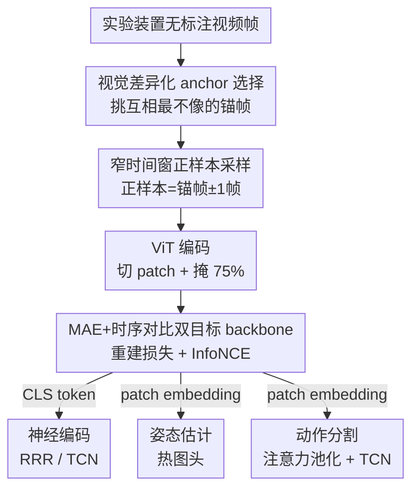

# Animal behavioral analysis and neural encoding with transformer-based self-supervised pretraining

**会议**: ICLR 2026  
**OpenReview**: [https://openreview.net/forum?id=AeqPIRKUni](https://openreview.net/forum?id=AeqPIRKUni)  
**代码**: 待确认  
**领域**: 计算生物 / 神经科学 / 自监督表示学习  
**关键词**: 动物行为分析, 神经编码, 自监督预训练, 掩码自编码, 时序对比学习, Vision Transformer

## 一句话总结
BEAST 用「掩码自编码 + 时序对比学习」双目标，在单个实验装置自己采集的无标注行为视频上预训练一个 ViT backbone，让同一个模型在神经编码、姿态估计、动作分割三类神经行为学任务上都打过需要大量标注的专用模型。

## 研究背景与动机
**领域现状**：现代神经科学有一条共识——「只有透过行为这面镜子才能真正理解大脑」。实验室普遍用摄像头记录动物行为，再从视频里抽取三类信息：(1) 神经编码，即提取能预测同步记录到的脑活动的行为特征；(2) 姿态估计，追踪解剖关键点；(3) 动作分割，逐帧判别 grooming、rearing、社交等行为状态。

**现有痛点**：这三类任务现在各用各的专用模型，且都吃大量人工标注。姿态估计要标几千上万帧关键点，动作分割往往还要先跑姿态估计这一步预处理（既费力又会引入误差）。更可惜的是，控制实验每天产出海量**无标注**视频，几乎没有方法去利用它们。

**核心矛盾**：通用视觉自监督大模型（DINOv2、CLIP、VideoPrism 等）虽然强，但它们是在互联网图片/视频上训练的，与「静态背景、固定机位、变化只来自动物本身」的实验室行为视频分布差很远，直接拿来用并不贴合；而专用方法又各自为政、不共享预训练。两边都没把「实验室自有的无标注视频」这块金矿挖出来。

**本文目标**：用一套自监督预训练，从原始视频里学出一个**通用 backbone**，一次预训练、多任务复用，且尽量摆脱对标注的依赖。

**切入角度**：作者抓住实验视频的独特性质——背景几乎不动、机位固定、信息主要藏在动物的逐帧外观和时序动态里。于是用 MAE 抓「每一帧长什么样」的细粒度外观，用时序对比损失抓「帧与帧之间怎么变」的动态，两者互补。

**核心 idea**：在 VIC-MAE（MAE + 对比损失）基础上，针对神经科学场景做关键改造——把对比损失的**正样本限制在锚帧 ±1 帧的窄时间窗内**，从而在「长时段、行为反复出现」的行为视频上学到真正区分行为的表示，得到 BEAST（BEhavioral Analysis via Self-supervised pretraining of Transformers）。

## 方法详解

### 整体框架
BEAST 的输入是某个实验装置采集的原始行为视频帧，输出是一个 ViT backbone，它能为下游三类任务提供两种特征：作为全局表示的 CLS token，以及保留空间信息的 patch embedding。预训练阶段，每一帧被切成 patch、随机掩掉 75%，剩下的 patch 过 ViT 编码器；一路接解码器重建被掩掉的像素（MAE 重建损失），另一路把 CLS token 经非线性投影头映射到对比空间，让时间上相邻的帧靠拢、相隔远或来自别的视频的帧推开（InfoNCE 对比损失）。两个损失加权相加联合训练。预训练好后，backbone 按任务接不同的头：神经编码用 CLS token 喂回归器，姿态估计和动作分割用 patch embedding 接对应的头。

### 关键设计

**1. MAE + 时序对比双目标 backbone：用一个模型同时抓外观与动态**

单独的 MAE 损失擅长重建逐帧的低层像素细节，但它对「帧与帧之间怎么变」几乎无感；而某些下游任务（神经编码、动作分割）恰恰需要时序信息。BEAST 的做法是让同一个 ViT 同时背负两个目标：掩码自编码损失 $L_{\text{MSE}}=\frac{1}{N}\sum_{p=1}^{N}(x_p-\hat{x}_p)^2$ 负责从未掩 patch（占比 25%）重建全部 patch，逼模型学好每一帧的外观；时序对比损失负责把时间结构注入表示。总损失为 $L = L_{\text{MSE}} + \lambda \cdot L_{\text{InfoNCE}}$，$\lambda$ 在验证集上调来平衡两者。实验里这个组合很关键：只用 MAE 的变体（VIT-M）做姿态估计很强但时序任务偏弱，只用对比的变体（VIT-C）在姿态估计上明显变差，两者合起来的 BEAST 才能在三类任务上都站得住——因为 MAE 偏低层像素、对比偏高层时序结构，正好互补。

**2. 窄时间窗正样本采样：把对比的"正样本"锁死在 ±1 帧**

这是 BEAST 相对 VIC-MAE 最核心的改造，也是它能适配神经科学的关键。VIC-MAE 允许同一段视频里**任意两帧**构成正样本对，不同视频的帧才是负样本——这在「短片段」基准上没问题，但行为实验是长时段录制，同一种行为会在不同时刻反复出现，于是相隔很远、其实属于不同行为时刻的两帧会被错误地当成正样本，把表示拉糊。BEAST 改成：每个锚帧 $x^v_t$ 只从 $x^v_{t\pm1}$ 里随机取正样本，其余帧（无论是同一视频里相隔远而不相似的帧，还是别的视频的帧）一律当负样本。对比损失用 InfoNCE 算在 CLS embedding 的非线性投影 $\{z^p_b\}$ 上：$L_{\text{InfoNCE}}=-\frac{2}{B}\sum_{i\in A}\log\frac{\exp(z^p_i\cdot z^p_{i'})}{\sum_{j\neq i}\exp(z^p_i\cdot z^p_j)}$，其中 $i'$ 是 $i$ 的正样本、$A$ 是一个 batch 里 $B/2$ 个锚帧的集合。消融（Table 5）证实这套窄窗采样显著优于 VIC-MAE 的任意配对方式。

**3. 视觉差异化 anchor 选择：让锚帧尽量互相不像**

光把正样本限制在 ±1 帧还不够——如果一批锚帧本身就大同小异，对比学习能学到的区分度有限。BEAST 在从一段视频里选初始锚帧时，刻意挑那些**视觉上彼此差异最大**的帧，让每个锚帧覆盖不同的行为/姿态。这相当于给对比学习喂进更有信息量、更难的样本，提升表示的鲁棒性。消融（Table 4）显示这一选择策略带来可测的收益，是窄窗采样之外的第二重把关。

**4. 任务自适应的特征接法：CLS token 还是 patch embedding，看任务而定**

同一个 backbone 要服务三类性质不同的任务，关键在于「取哪种特征、怎么接头」。神经编码要的是整帧的全局行为状态，于是用 CLS token（作为整帧的全局表示），后面接两类编码器——线性的 reduced rank regression（RRR，看信息有多直接可达）和非线性的 temporal convolution network（TCN，逼近信息上限的上界）；消融（Table 12）证实 CLS token 比 patch embedding 更适合编码任务。姿态估计是空间定位任务，需要保留位置信息，于是改用 patch embedding，接一个把特征转成关键点热图的头，端到端微调。动作分割则对 patch embedding 做多头注意力池化得到帧级表示，拼上相邻帧的差分特征再过 TCN，用滑窗预测中心帧的行为类别。一套 backbone、三种接法，正是「通用预训练 + 任务特化下游」的体现。

### 损失函数 / 训练策略
总损失 $L = L_{\text{MSE}} + \lambda \cdot L_{\text{InfoNCE}}$。模型用 ImageNet 预训练权重初始化，掩码比例 0.75，训练 800 个 epoch，AdamW 优化器配 cosine annealing 学习率调度，在 8 张 Nvidia A40 上约 25 小时。$\lambda$ 用各数据集的验证集选取。下游既可冻结 backbone 只取特征，也可端到端微调。

## 实验关键数据

### 主实验
跨多物种（小鼠、弱电鱼）、多记录技术（Neuropixels、双光子钙成像）、单/多动物设置评测三类任务。

零样本神经编码（BPS，TCN 非线性编码器，N=842 神经元 / 5 个测试 session，越高越好）：

| 方法 | IBL | IBL-whisker |
|------|------|------|
| VIT-M (IN，仅 ImageNet+MAE) | 0.321 ± 0.013 | 0.301 ± 0.012 |
| VIT-M (IN+PT，再做域内预训练) | 0.331 ± 0.013 | 0.311 ± 0.013 |
| VIT-C (IN+PT，仅对比) | 0.314 ± 0.013 | 0.283 ± 0.011 |
| BEAST (IN+PT) | 0.292 ± 0.012 | 0.309 ± 0.013 |
| **BEAST (IN+PT+FT，再微调)** | **0.347 ± 0.014** | **0.326 ± 0.013** |

关键观察：连只用 MAE、零微调的 VIT-M (IN) 都已超过此前基于关键点/PCA 的 baseline，印证「行为视频里的信息远比姿态估计能抓的丰富」；域内预训练（IN→IN+PT）进一步涨点，证实领域特异预训练的价值；加上对比目标的 BEAST (IN+PT) 零样本即超过纯 MAE 与纯对比两个变体；再做 session 级微调达到最佳。

姿态估计：在仅 **100 帧标注**的严苛低数据场景下，BEAST 在全部四个数据集上都优于 AP-10K 预训练的 ResNet-50 和 ImageNet 预训练的 ViT，且在难关键点上优势更明显；纯对比预训练（VIT-C）反而显著变差，印证 MAE 对像素级定位任务更对路。

动作分割（macro-F1）：IBL 上 BEAST ensemble 的 F1 追平关键点 ensemble（约 0.89）；CalMS21 上 BEAST 超过 SimBA、大幅超过 TREBA，ensemble F1 达 **0.84**，能排进 AIcrowd 多智能体行为挑战赛前 15（榜首 0.89）——而这是在不需要训练姿态估计网络（省掉上千标注帧）的前提下达到的。

### 消融实验

| 配置 | 影响 | 说明 |
|------|------|------|
| 仅 MAE（VIT-M） | 姿态估计强、时序任务弱 | 偏低层像素特征 |
| 仅对比（VIT-C） | 姿态估计明显变差 | 偏高层时序结构 |
| MAE + 对比（BEAST） | 三类任务整体最优 | 两种特征互补 |
| ±1 帧窄窗 vs VIC-MAE 任意配对 | 窄窗显著更优（Table 5） | 适配长时段行为视频 |
| 视觉差异化 anchor 选择（Table 4） | 带来可测收益 | 提升对比鲁棒性 |
| CLS token vs patch（神经编码，Table 12） | CLS 更优 | 全局表示更适合编码 |

### 关键发现
- **双损失互补是核心**：MAE 偏低层、对比偏高层，去掉任一个都会让某类任务掉点；姿态估计尤其依赖 MAE，时序/编码任务依赖对比。
- **正样本窗口的设定决定成败**：把 VIC-MAE 的「任意帧正样本」改成「±1 帧」，是从通用视频迁到长时段行为视频的关键，否则反复出现的行为会污染对比信号。
- **whisker pad 携带大量神经相关信息**：BEAST 在 IBL 和 IBL-whisker 上 BPS 相近，说明所记录脑区里，须垫（whisker pad）活动就承载了很大一部分与神经相关的行为信息。
- **非关键点表示普遍胜过关键点**：在 IBL 和 Facemap 上，非关键点表示都超过基于关键点的方法，证实姿态估计会丢失视频里的丰富信息。

## 亮点与洞察
- **一次预训练、三任务复用**：用同一个自监督 backbone 同时服务神经编码、姿态估计、动作分割三类性质迥异的任务，且都有竞争力，这种「实验室级通用模型」的范式很有迁移价值。
- **窄时间窗正样本采样**：一个看似小的改动（任意帧→±1 帧），却精准命中长时段行为视频「同种行为反复出现」的痛点，是把通用对比学习「驯化」到特定科学域的范本。
- **省掉姿态估计预处理**：动作分割直接吃 ViT patch embedding，绕开「先标几千帧训姿态网络」这一步，对标注资源稀缺的实验室是实打实的解放。
- **面向小实验室的算力友好设计**：选对比式（而非原生视频模型）正是因为很多实验室没有大算力，8 卡 25 小时即可在自有数据上训出专属模型，落地门槛低。

## 局限与展望
- **每个实验装置要训一个专属模型**：BEAST 强调「实验特异」，背景/机位一变就得重训，没有跨装置的统一 foundation model，复用性受限于单一实验范式。
- **强依赖实验视频的特殊结构**：方法吃「静态背景 + 固定机位」的红利，对自由场景、移动机位、背景剧烈变化的视频是否还成立，文中未充分验证。
- **CalMS21 仍未夺榜**：ensemble F1 0.84 排进前 15 但距榜首 0.89 有差距，说明在复杂社交行为上，纯视频自监督特征相对精心设计的手工特征仍有提升空间。
- **可改进方向**：把多个实验装置的视频联合预训练、探索跨装置/跨物种的统一 backbone，或引入更长程的时序建模来补足当前 ±1 帧窄窗对长时依赖的覆盖。

## 相关工作与启发
- **vs VIC-MAE**：同样融合 MAE 与对比损失，但 VIC-MAE 用任意帧/跨视频构造正负样本、面向通用视频；BEAST 把正样本锁死在 ±1 帧、加视觉差异化 anchor 选择，并简化了训练与架构，专门适配长时段行为视频，消融证明这套改造在行为数据上显著更优。
- **vs DINOv2 / CLIP / VideoPrism**：这些是冻结的通用互联网预训练大模型；BEAST 让单个实验室用自有无标注视频做域内预训练，分布更贴合，在神经编码、动作分割上稳定超过它们。
- **vs DeepLabCut / SLEAP / Lightning Pose**（专用姿态估计）：传统路线靠 ImageNet backbone 微调、吃大量关键点标注；BEAST 在仅 100 帧标注下就超过强 ResNet-50 baseline，且无需先做姿态估计即可服务动作分割。
- **vs TREBA / SimBA**（关键点轨迹特征）：它们从关键点轨迹抽自监督或手工特征、需先训姿态网络（上万标注帧）；BEAST 直接从原始视频学特征，CalMS21 上超过两者。

## 评分
- 新颖性: ⭐⭐⭐⭐ 把通用「MAE+对比」自监督针对长时段行为视频做了关键的正样本采样改造，问题切口清晰
- 实验充分度: ⭐⭐⭐⭐⭐ 跨多物种、多记录技术、单/多动物，覆盖三类任务并配齐消融
- 写作质量: ⭐⭐⭐⭐ 动机—方法—实验逻辑顺畅，图表信息密集
- 价值: ⭐⭐⭐⭐⭐ 给标注稀缺的行为神经科学实验室提供了可落地、算力友好的通用 backbone

<!-- RELATED:START -->

## 相关论文

- [\[ICLR 2026\] Pretraining with Re-parametrized Self-Attention: Unlocking Generalization in SNN-Based Neural Decoding Across Time, Brains, and Tasks](pretraining_with_re-parametrized_self-attention_unlocking_generalizationin_snn-b.md)
- [\[ICML 2026\] Learning the Neighborhood: Contrast-Free Multimodal Self-Supervised Molecular Graph Pretraining](../../ICML2026/computational_biology/learning_the_neighborhood_contrast-free_multimodal_self-supervised_molecular_gra.md)
- [\[ICLR 2026\] CryoLVM: Self-supervised Learning from Cryo-EM Density Maps with Large Vision Models](cryolvm_self-supervised_learning_from_cryo-em_density_maps_with_large_vision_mod.md)
- [\[ICLR 2026\] CellDuality: Unlocking Biological Reasoning in LLMs with Self-Supervised RLVR](cellduality_unlocking_biological_reasoning_in_llms_with_self-supervised_rlvr.md)
- [\[ICLR 2026\] Coupled Transformer Autoencoder for Disentangling Multi-Region Neural Latent Dynamics](coupled_transformer_autoencoder_for_disentangling_multi-region_neural_latent_dyn.md)

<!-- RELATED:END -->
