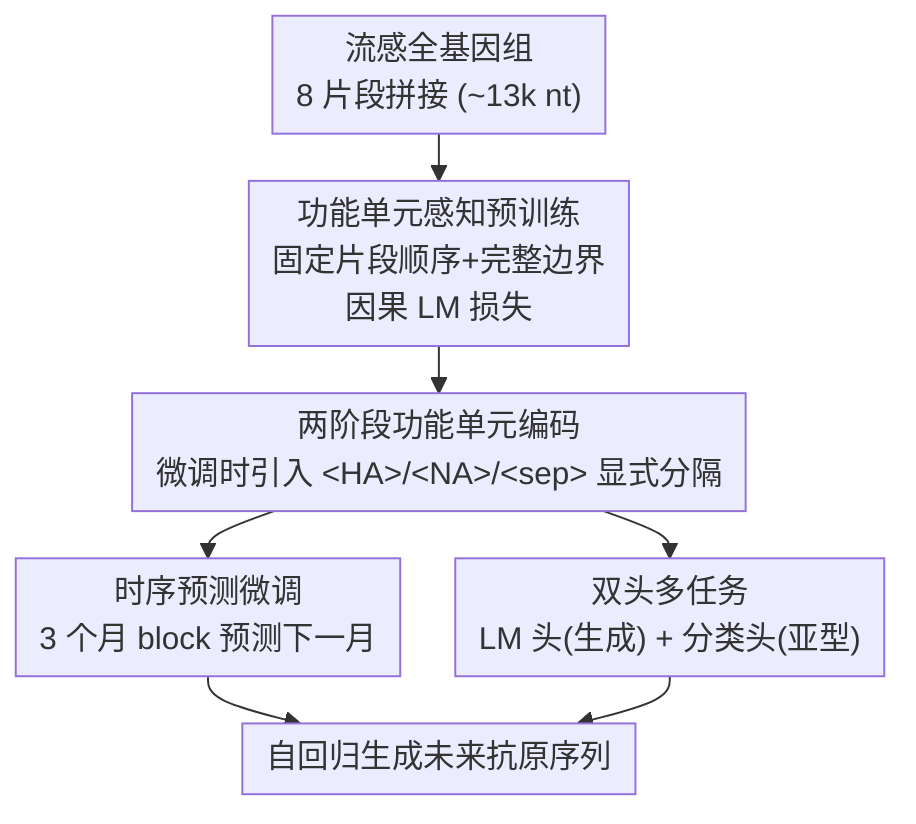

# AntigenLM: Structure-Aware DNA Language Modeling for Influenza

**会议**: ICLR 2026  
**arXiv**: [2602.09067](https://arxiv.org/abs/2602.09067)  
**代码**: [https://github.com/peilab-cnic/AntigenLM](https://github.com/peilab-cnic/AntigenLM)  
**领域**: 生物序列生成 / DNA语言模型  
**关键词**: DNA语言模型, 流感病毒预测, 功能单元编码, 全基因组建模, 疫苗设计  

## 一句话总结
AntigenLM 是一个保留基因组功能单元完整性的 GPT-2 风格 DNA 语言模型，通过在流感病毒全基因组上预训练并微调，能够自回归预测未来流行毒株的抗原序列，在氨基酸错配率上显著优于进化模型 beth-1 和通用基因组模型。

## 研究背景与动机
**领域现状**：流感病毒快速进化以逃逸宿主免疫，疫苗株需频繁更新。当前 WHO 疫苗推荐依赖系统发育树动态（如 LBI）和位点级进化预测模型（如 beth-1）。

**现有痛点**：
   - 位点级模型（beth-1）将突变视为独立事件，无法捕捉跨片段的协同进化
   - 通用基因组基础模型（DNABERT、HyenaDNA）在多物种异构语料上训练，丢失了物种特异性结构信息
   - 蛋白质级模型（ESM、ProtGPT2）完全忽略了同义突变、非编码调控元件、密码子适应性等核苷酸层面的进化机制

**核心矛盾**：病毒进化受全基因组多片段协调互作驱动（RNA-RNA 互作、片段重配约束、聚合酶-抗原协同适应），碎片化建模丢失关键信号

**本文目标**：如何构建一个保留功能单元完整性的 DNA 语言模型，在核苷酸层面捕捉全基因组依赖关系，用于准确预测流感抗原序列

**切入角度**：流感基因组紧凑（~13k 核苷酸），适合用单个 Transformer 全基因组建模；通过保持 8 个基因片段的固定顺序和完整边界，让模型学习跨片段的共进化模式

**核心 idea**：在预训练阶段保持基因组功能单元的完整性和正确排列，使 DNA 语言模型能捕捉跨片段的高阶进化约束

## 方法详解

### 整体框架
AntigenLM 采用 GPT-2 风格的 decoder-only Transformer 架构，输入是流感 A 型病毒的全基因组核苷酸序列（最长 13k tokens），输出是自回归生成的下一个核苷酸。Pipeline 分两阶段：(1) 在 54,512 个完整流感基因组上做**功能单元感知预训练**（保持 8 个片段固定顺序与完整边界，隐式学跨片段共进化）；(2) 针对**时序抗原预测**和亚型分类两个下游任务，引入显式分隔 token、用**双头多任务**微调。

### 关键设计

**1. 功能单元感知预训练：把整条基因组喂进去，让注意力学到跨片段共进化**

通用 DNA 模型在多物种异构语料上训练、还常把长序列截断分片，结果丢掉了流感病毒特有的基因组结构。AntigenLM 反其道而行：把 8 个基因片段（PB2、PB1、PA、HA、NP、NA、MP、NS）按从大到小的固定顺序拼成单条全基因组序列，每条训练样本都保持完整基因组，13k 的位置编码范围正好覆盖全长，不截断、不分片，用标准因果语言模型损失训练：

$$\mathcal{L}_{\text{CLM}} = -\sum_{t=1}^{T-1} \log p(x_{t+1} \mid x_{\leq t})$$

保持片段顺序与边界完整，注意力机制才有机会建模跨片段的共进化依赖（比如 HA-NA 之间的补偿性突变）——这正是碎片化训练拿不到的信号。

**2. 两阶段功能单元编码：预训练隐式学边界，微调显式控生成**

预训练阶段不加任何分隔标记，靠固定的片段顺序加位置编码让模型自由地隐式学习片段边界；到了微调阶段才引入 `<HA>`、`<NA>`、`<sep>` 等特殊 token 显式分隔功能区域，引导注意力聚焦、并约束解码不跨片段乱续。这样既保留了预训练的通用性，又在下游获得了精准的可控生成。

**3. 时序预测微调：把多个时间点串起来，让模型读出进化方向**

下游抗原预测被设计成"用连续 3 个月的 HA/NA 序列预测下一月"。输入格式为 $\text{block}^{(1)}\text{block}^{(2)}\text{block}^{(3)}\text{block}^{(\star)}$，其中每个 block = `<subtype><HA>HA<NA>NA<sep>`。训练时优化整条序列的因果 LM 损失，推理时喂入 3 个历史 block 后自回归生成未来 block。把多个时间点的抗原序列串联起来，等于把进化轨迹隐式编码进上下文，模型就能从序列变化模式里推断下一步的演化方向。

**4. 双头多任务：生成头管全局动态，分类头管表示质量**

共享一个 Transformer backbone，上面挂两个头：LM head 预测下一核苷酸（与 embedding 矩阵权重绑定），Classification head 从哨兵 token 位置取隐状态、投射成亚型 logits 用交叉熵训练。生成任务负责捕捉全局进化动态，分类任务提供监督信号改善表示质量，两者共享 backbone 互相增益。

### 损失函数 / 训练策略
- 预训练：标准因果 LM 损失，AdamW 优化器（学习率 $1 \times 10^{-4}$，线性 warmup 5% + cosine decay，dropout 0.1，梯度裁剪 1.0）
- 有效 batch size = 32 genomes/step（8 GPU × 1 sample × 4 梯度累积）
- 模型规模紧凑：6 层 Transformer，384 hidden dim，6 attention heads，FFN 内部维度 1536

## 实验关键数据

### 主实验 — 下季抗原序列预测（日本，post-2022）

| 方法 | H1N1-HA AA错配 | H3N2-HA AA错配 | H1N1-NA AA错配 | H3N2-NA AA错配 |
|------|--------------|--------------|--------------|--------------|
| WHO 当前系统 | ~10+ | ~10+ | ~2 | ~5+ |
| beth-1 | ~6-8 | ~6-8 | ~1-2 | ~3-4 |
| LBI | 较高 | 较高 | — | — |
| **AntigenLM** | **~3-4** | **~3-4** | **<1** | **~1-2** |

- AntigenLM 在 H1N1-HA 和 H3N2-NA 上相比 WHO 推荐减少 >70% 错配，相比 beth-1 减少 ~50%
- 下月预测：HA 平均 3-4 个氨基酸错配（<1% of 566 AAs），NA 1-2 个（<0.5% of 469 AAs）

### 消融实验 — 预训练策略对比

| 预训练配置 | 下月预测 Token 困惑度 | 序列生成有效性 | 亚型分类 F1 |
|-----------|-------------------|-------------|-----------|
| Full-genome（完整模型）| **1.26** | 高 | **99.81%** |
| Incomplete-genome（随机裁剪）| 3.55 | 低（常生成无效序列）| 较低，亚型混淆多 |
| Segment-wise（单片段）| 4.42 | 中等 | 较低 |
| Antigen-only (nuc) | 4.56 | 中等 | 100%（因为亚型由抗原决定）|
| Antigen-only (protein) | — | 中等 | 100% |

### 关键发现
- **全基因组上下文至关重要**：去掉非 HA/NA 内部片段后困惑度从 1.26 升至 4.56，说明 PB1/PB2/PA 等片段提供有意义的预测信号
- **功能单元完整性比数据量更重要**：Incomplete-genome 使用相同数据量但破坏片段边界，效果最差
- **跨亚型泛化**：H7N9 仅占预训练数据 4.68%、微调数据 0.3%（48 条序列），AntigenLM 仍能准确预测
- **地理泛化**：在完全未见过的美国数据上（训练仅用欧洲+亚洲），AntigenLM 仍显著优于 beth-1

## 亮点与洞察
- **功能单元保持原则可推广**：不仅适用于流感，任何具有明确功能单元结构的基因组（如分段 RNA 病毒）都可以采用类似的结构感知预训练策略
- **紧凑模型+领域特化的胜利**：6 层 384 维的小模型，因为针对流感全基因组专门设计，击败了参数量大得多的通用基因组模型
- **两阶段编码的巧妙之处**：预训练时不加标记让模型自由学习结构，微调时加标记精准控制生成——兼顾了通用性和可控性

## 局限与展望
- 预测本质上是概率性的，应作为专家决策的补充而非替代
- 仅在流感 A 型上验证，对其他病原体（如 SARS-CoV-2、HIV）的泛化能力未知
- 模型规模较小（6 层），对于更复杂的基因组可能需要扩展
- 训练数据依赖 GISAID，存在地理采样偏差

## 相关工作与启发
- **vs beth-1**：beth-1 建模位点级独立突变，AntigenLM 建模跨片段协同进化，在所有任务上 AntigenLM 更优
- **vs HyenaDNA/DNABERT**：通用 DNA 模型在多物种语料上训练丢失物种特异结构，生成的序列常无效（长度偏差大、标记缺失）
- **vs ProtGPT2**：蛋白质级模型无法捕捉同义突变等核苷酸层面的进化信号

## 评分
- 新颖性: ⭐⭐⭐⭐ 功能单元感知预训练是新颖的设计原则，但整体架构是标准 GPT-2
- 实验充分度: ⭐⭐⭐⭐⭐ 5 种预训练消融 + 3 类方法对比 + 跨亚型/跨地理泛化，非常全面
- 写作质量: ⭐⭐⭐⭐ 逻辑清晰，动机推导完整
- 价值: ⭐⭐⭐⭐ 对疫苗设计有直接应用价值，功能单元保持原则有广泛借鉴意义

<!-- RELATED:START -->

## 相关论文

- [\[ICLR 2026\] FlexRibbon: Joint Sequence and Structure Pretraining for Protein Modeling](flexribbon_joint_sequence_and_structure_pretraining_for_protein_modeling.md)
- [\[ICLR 2026\] Automatic and Structure-Aware Sparsification of Hybrid Neural ODEs with Application to Glucose Prediction](automatic_and_structure-aware_sparsification_of_hybrid_neural_odes_with_applicat.md)
- [\[ICML 2026\] DNAChunker: Learnable Tokenization for DNA Language Models](../../ICML2026/computational_biology/dnachunker_learnable_tokenization_for_dna_language_models.md)
- [\[ICLR 2026\] PatchDNA: A Flexible and Biologically-Informed Alternative to Tokenization for DNA](patchdna_a_flexible_and_biologically-informed_alternative_to_tokenization_for_dn.md)
- [\[ICML 2026\] Protein Autoregressive Modeling via Multiscale Structure Generation](../../ICML2026/computational_biology/protein_autoregressive_modeling_via_multiscale_structure_generation.md)

<!-- RELATED:END -->
