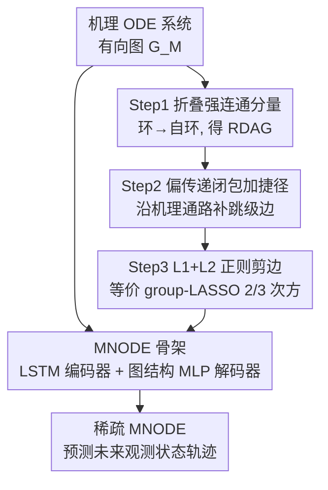

# Automatic and Structure-Aware Sparsification of Hybrid Neural ODEs with Application to Glucose Prediction

**会议**: ICLR 2026  
**OpenReview**: [https://openreview.net/forum?id=QBzFrjEF59](https://openreview.net/forum?id=QBzFrjEF59)  
**代码**: 待确认（论文称随补充材料提交）  
**领域**: 计算生物 / 混合神经 ODE / 模型约简 / 时间序列预测  
**关键词**: 机理神经ODE, 图稀疏化, L1/L2正则, 血糖预测, 模型约简

## 一句话总结
针对"机理模型嵌进神经 ODE 后潜变量太多、小数据下过拟合"的痛点，本文提出三步混合图稀疏化算法 HGS（合并强连通分量→加捷径→L1/L2 正则剪边），自动选出既稀疏又保持机理可解释的子图，在合成数据和真实 T1D 血糖预测上用更少参数拿到更好、更鲁棒的预测。

## 研究背景与动机
**领域现状**：在医疗、生理这类小数据场景，"混合建模"很受欢迎——把机理模型（mechanistic model）的归纳偏置和神经网络的灵活性结合起来，往往比纯黑盒和纯白盒都强。其中一类主流做法建立在神经 ODE 之上：把机理 ODE 系统画成有向图（节点是状态变量/输入，边是相互作用），再用一组按图结构连接的小神经网络去学每个状态的导数，得到所谓机理神经 ODE（MNODE）。

**现有痛点**：生理学/医学里的机理模型为了刻画延迟、异质性、多房室过程，往往被堆得很大——一个 SOTA 的"碳水-胰岛素-血糖"模型有 20 多个潜状态，但可观测状态不到 5 个、输入只有 2 个。混合化之后，神经网络带来的额外灵活性会让一部分潜状态变得多余甚至有害：在数据稀缺时，冗余状态显著抬高模型方差，导致过拟合，把机理模型本该带来的好处给抵消掉。

**核心矛盾**：要"约简"这个机理图，但两条现成路线都不好走。生化里的经典约简（时间尺度分离、准稳态近似）需要深厚领域知识和反复试错；而 GNN 社区的图剪枝方法（拓扑选点、子图采样、优化稀疏化）几乎都是纯数据驱动、对领域知识无感知，剪完不保证保留关键机理结构；非梯度的贪心搜索在高维 ODE 上又贵得离谱。于是缺口很明确：缺一个既计算高效、又能在保持机理完整性的同时提升预测性能的约简方案。

**本文目标**：给 MNODE 设计一个自动选状态/选边、优化结构的算法，要同时满足三点——计算高效（梯度可微）、机理合理（剪出来的图仍物理可解释）、预测更好（小数据下不过拟合且更鲁棒）。

**切入角度**：把"领域知识引导的图修改"和"数据驱动的正则"拼起来——前者从经典约简与图论出发，把搜索空间约束在"机理上合理的稀疏图"里；后者用 L1/L2 正则在训练中梯度式地剪边，效率高且贴合观测数据。

**核心 idea**：用一套三步混合图稀疏化（HGS）替代纯数据驱动剪枝——先把环路折叠成无环图保证数值稳定，再沿机理通路加"捷径边"允许减少潜状态，最后用 L1/L2（等价于一种更狠的 group LASSO）把冗余边权重压到零。

## 方法详解

### 整体框架
方法分两层。底层是**预测骨架 MNODE**：一个编码器-解码器序列模型，编码器（LSTM）吃历史观测，吐出系统潜状态的初值估计；解码器拿初值 + 未来外生输入，按机理有向图 $G_M$ 的结构、用一组前馈网络 $\{NN_i\}$ 逐状态地前向欧拉积分，滚动预测未来可观测状态轨迹。任务是时间序列预测：给过去上下文 $\{S^P_{obs}, X^P\}$ 和未来输入 $X^F$，预测未来可观测状态 $S^F_{obs}$（在血糖任务里就是用过去 210 分钟历史预测未来 60 分钟血糖）。

上层是**约简算法 HGS（Hybrid Graph Sparsification）**，对喂给 MNODE 的机理图做三步处理：Step 1 把所有极大强连通分量（MSCC）折叠成超节点，得到一个（含自环的）松弛无环图 RDAG；Step 2 沿"输入→可观测状态"的机理通路做偏传递闭包，给图补上"跳级"捷径边；Step 3 给每条边挂一个权重，用 L1（边权）+ L2（网络权重）的混合正则把冗余边压零，从而自动选边/选状态。三步分别对应"保稳定 / 让模型敢减状态 / 数据驱动剪枝"，缺一不可（消融里去掉任何一步都明显掉点）。

### 关键设计

**1. MNODE 骨架：把机理图变成可微的神经动力系统**

这是预测的载体，要解决"如何让神经网络既灵活又受机理结构约束"。机理 ODE 系统被表示成有向图 $G_M=(V_M,E_M)$，节点是状态 $S$ 和输入 $X$，边 $(s_j,s_i)$ 表示 $s_j$ 影响 $s_i$ 的导数方向。MNODE 不学一个黑盒右端项，而是按这张图给每个状态 $s_i$ 配一个只看其"父节点" $S_{pa(i)},X_{pa(i)}$ 的前馈网络：

$$\frac{ds_i(t)}{dt}=NN_i(S_{pa(i)}(t),X_{pa(i)}(t),t)$$

实际用前向欧拉离散：$s^{t_{h+1}}_i=s^{t_h}_i+(t_{h+1}-t_h)NN_i(S^{t_h}_{pa(i)},X^{t_h}_{pa(i)},t_h)$。编码器用标准 LSTM 把历史压成潜状态初值 $\hat S_{lat}(0)$，解码器从初值滚动出预测。这样神经网络的灵活性被限制在机理图允许的连接里——这正是"混合建模"在小数据下能赢纯黑盒的原因，也正是后面三步要去精简的对象。

**2. Step 1 折叠强连通分量：先把环路收掉换数值稳定**

机理图一般不是无环的，而带环的 ODE 系统在训练时容易出现爆炸、梯度爆炸和刚性（stiffness），需要对参数加一堆复杂约束才能压住。Step 1 的做法是把图里所有极大强连通分量 $C_i$ 折叠成超节点，环内复杂动力学交给神经网络去近似，结果是一个只允许自环的松弛无环图（RDAG）。

为什么有效：无环之后，把节点按拓扑序重排，系统雅可比变成上三角，特征值就是对角元，于是只需对对角元（远更少、更简单的约束）就能保证系统稳定，不必为环路逐一设计约束。作者也论证折叠损失的预测力很小——神经网络足够近似分量内部的复杂动力学。这一步是可定制的：用户可基于领域知识选择不折叠某些 MSCC，后续两步仍兼容，因果可解释性可通过"时间展开"把反馈环还原成时滞依赖来保留。

**3. Step 2 偏传递闭包加捷径：让模型敢于减少潜状态**

折叠后图变稀但还不够灵活——要想真正减少一条通路上的潜状态，得允许"跳过中间态"。Step 2 沿每条"输入 $x$ → 可观测状态 $s$"的机理通路，取其割点集 $D_{x,s}$（去掉就会断开 $x$ 到 $s$ 的节点）诱导出子图 $G^a_{x,s}$，对它做**偏传递闭包**，把得到的捷径边补回原 RDAG，形成增广图 $G^{a,c}$。

作者用了个很形象的类比：一条生理通路像学生从初三读到高三，正常是 9→10→11→12 一级级走；传递闭包等于加上所有"跳级"链接（9 直接到 11/12）；而"偏"传递闭包是更谨慎的版本，允许部分跳级、但禁止过激的跳跃（如 9 直接到 12）。背后的生物动机是：不同生理过程经过的中间态数目不同（如化学动力学里的准稳态近似就是把快变量直接消掉），加捷径让模型有自由度去匹配这种差异，同时偏闭包又避免引入机理上不支持的"输入直连输出"边、保留必要的潜动力学。这一步也可定制（用全闭包或省略某些捷径）。

**4. Step 3 L1+L2 混合正则：数据驱动地把冗余边压到零**

前两步把搜索空间约束到了"机理合理的稀疏图候选"，最后一步用数据决定到底剪哪些。给增广图 $G^{a,c}$ 的每条边挂一个权重 $w_{(u,v)}$，在消息传递里对父节点特征做逐元素加权 $W\odot S^a_{pa(i)}$，再在 MSE 预测损失上加正则：

$$\sum_{cases,h}\big\|S^{a,t_h}_{obs}-\hat S^{a,t_h}_{obs}\big\|_2^2+\lambda_1\sum_{(u,v)\in E^{a,c}}|w_{u,v}|+\lambda_2\|\Theta\|_2^2$$

L1 罚边权 $W$ 鼓励稀疏（LASSO 式把冗余边压零），L2 罚解码器权重 $\Theta$ 提升可辨识性。一个漂亮的理论联系是：该正则等价于"第一层 group LASSO"的一个变体，把每条边对应的首层权重向量 $\Gamma_{(u,v)}=w_{(u,v)}\Theta_{(u,v)}$ 的范数提到 $2/3$ 次方 $\sum\|\Gamma_{(v,u)}\|_2^{2/3}$——比标准 group LASSO 的 1 次方梯度更陡、更狠地推向零，且 $\Gamma_{(u,v)}=0 \iff$ 删掉边 $(u,v)$。$\lambda$ 用 K 折交叉验证选。作者特别诚实地声明：本方法**不是**为了恢复真实因果图（神经网络的表达力让不同底层图能产生等价 MNODE，真支撑恢复理论上不可行），目标只是高效诱导稀疏、生成需临床验证的数据驱动假设。

## 实验关键数据

> 说明：论文结果以柱状图（Figure 1、2）呈现、未给数值表，下表数值为按图约略读出，仅用于体现趋势与排序，精确值以原文为准。

### 主实验

合成数据：两种稀疏机制（true sparsity / quasi sparsity）、两种起始图（refined / comprehensive 冗余）、样本量 100 与 1000，测试集 10000。指标 RMSE（预测）、Peak RMSE（鲁棒性）、ENP（有效非零参数数，衡量稀疏度）。

| 对比对象 | 设置 | HGS 表现 | 结论 |
|----------|------|----------|------|
| 黑盒模型(LSTM/BNODE/TCN/S4D/Trans) | 样本量 100 | RMSE/Peak RMSE 均最优，ENP 最低 | 小数据下 HGS 明显领先 |
| 黑盒模型 | 样本量 1000 | TCN 在 RMSE 略超 HGS，但 HGS 仍最鲁棒 | 数据变多时正则的偏差开始显现 |
| 其他约简法(NS/EGL/EN/RD/GD/NR) | refined 图 | 略优（差距不大） | 图本就干净时大家都行 |
| 其他约简法 | comprehensive 冗余图 | 大幅且显著领先，ENP 最低 | 冗余越多 HGS 优势越大 |

真实数据（T1DEXI 血糖预测，342 条序列 / 105 名 T1D 患者，5 分钟一测；历史 210 分钟、预测 60 分钟；机理模型用 FDA 批准的 2013 版 UVA-Padova）：

| 指标 | HGS(约) | 最好黑盒/约简法(约) | 备注 |
|------|---------|---------------------|------|
| RMSE | ~34.5 | 黑盒 ~36–46；约简法 NR ~37.5 | HGS 最低 |
| Peak RMSE | ~100–120 | 其他 ~150–260 | 鲁棒性优势最明显 |
| Diagnostic Accuracy | ~0.78 | 其他 ~0.75–0.77 | 高/正常/低血糖三分类准确率 |
| Variance | 最低（≈0 量级） | 其他显著更高 | 模型方差小 |
| ENP | ~6000 | DK/黑盒更高 | 参数更少 |

### 消融实验

| 配置 | 关键指标 | 说明 |
|------|---------|------|
| 完整 HGS（Step 1+2+3） | 各指标最优 | 三步齐备 |
| 去掉 Step 1（不折叠环） | 明显下降 | 失去无环带来的稳定性 |
| 去掉 Step 2（无捷径） | 明显下降 | 无法减少通路潜状态 |
| 去掉 Step 3（无正则） | 明显下降 | 无数据驱动剪枝 |

### 关键发现
- 三步缺一不可：去掉任意一步都显著掉点，说明"机理图修改 + 数据正则"是互补而非冗余的。
- HGS 的独特之处在于不只压稀疏，还能引入正则方法本身够不到的**新结构捷径**（邻接矩阵热图可见），这正是 Step 2 的功劳。
- 机理可解释收获：HGS 在血糖任务里主动删掉了胰高血糖素（glucagon）反馈环对应的边，提示"低血糖时受损的胰高血糖素反应可能在运动诱发的低血糖期间同样持续"——一个可指导后续临床研究的新假设。

## 亮点与洞察
- **把图论稳定性分析直接用进训练设计**：用"折叠强连通分量→无环→雅可比上三角→特征值即对角元"这条链把数值稳定问题化简成对角约束，是很扎实的"为什么这么剪"论证，而不是凭经验剪枝。
- **L1+L2 等价于 2/3 次方 group LASSO**：把朴素的边权 LASSO 重参数化后，证明它等价于一个比标准 group LASSO 梯度更陡的稀疏惩罚，理论上解释了为什么它更敢把边压到零——这个 reparam 技巧可迁移到其他"乘性门控 + 神经网络"的稀疏化场景。
- **"偏"传递闭包的克制**：不盲目加全部跳级边，而是禁止机理不支持的输入直连输出，体现了"数据驱动但守机理底线"的设计哲学，值得在其他领域知识引导的剪枝里借鉴。
- **诚实声明不做真支撑恢复**：明确承认神经网络表达力导致真因果图不可辨识，只做"假设生成"，避免了把稀疏结果过度解读成因果发现的常见误区。

## 局限与展望
- **数据多了就不一定赢**：样本量 1000 时 TCN 在 RMSE 上反超，作者也承认正则带来的偏差在大数据下可能盖过方差收益——方法的甜区是小数据。
- **依赖一个像样的机理先验**：整套流程从机理有向图出发，若领域没有可靠的机理模型（如 UVA-Padova 这种 FDA 级别的），HGS 的"结构感知"优势无从谈起。
- **结果以柱状图呈现、缺数值表与显著性细节**：合成与真实实验都靠 bar chart，部分排序接近，难以判断差异的统计显著程度（除作者点名"comprehensive 图上显著"外）。
- **真实实验只验证了血糖一个任务**：虽然方法号称通用，但真实世界只跑了 T1D 血糖，跨疾病/跨系统的迁移性有待检验。

## 相关工作与启发
- **vs Zou et al. (2024) 的贪心逐步约简**：他们用贪心 stepwise 选择，本文用梯度式 L1/L2，更高效、性能更好——类比线性模型里 LASSO 相对逐步回归的优势；GD（贪心）在 comprehensive 图上甚至因耗时过长被迫省略。
- **vs GNN 优化式图稀疏化（Li 2020 约束 L0、Jiang 2021 弹性网、Jiang 2023 排他 group LASSO）**：它们直接稀疏邻接矩阵且不顾机理结构；本文稀疏的是消息传递里的边权、且先做领域引导的剪枝把搜索限制在物理可行图上，更适合需机理一致性的混合模型。
- **vs 经典生化约简（时间尺度分离 / 准稳态近似）**：那些需要重领域专家和反复试错，本文用 Step 2 的捷径机制把"消去快变量"这类思想自动化、数据化。
- **vs LASSO/group LASSO 一族稀疏方法**：传统 LASSO 在神经网络里产生的稀疏模式难解释，本文把稀疏性锚定在机理图结构上，得到领域对齐、可解释的稀疏。

## 评分
- 新颖性: ⭐⭐⭐⭐ 把图论稳定性、偏传递闭包、2/3 次方 group LASSO 三件事缝进 MNODE 约简，组合新颖且每步都有据。
- 实验充分度: ⭐⭐⭐⭐ 合成两机制两图两样本量 + 真实 T1D 多指标 + 消融齐全，但结果只给柱状图、缺数值表与显著性。
- 写作质量: ⭐⭐⭐⭐ 动机清晰、类比生动（跳级、学生通路），数学定义严谨；图代表数值略影响可读性。
- 价值: ⭐⭐⭐⭐ 在医疗小数据这一真实痛点上给出可解释、参数更少、更鲁棒的方案，并能生成可临床验证的新假设。

<!-- RELATED:START -->

## 相关论文

- [\[ICLR 2026\] Temporally Detailed Hypergraph Neural ODEs for Disease Progression Modeling](temporally_detailed_hypergraph_neural_ode_for_disease_progression_modeling.md)
- [\[ICLR 2026\] AntigenLM: Structure-Aware DNA Language Modeling for Influenza](antigenlm_structure-aware_dna_language_modeling_for_influenza.md)
- [\[ICLR 2026\] Towards Knowledge-and-Data-Driven Organic Reaction Prediction: RAG-Enhanced and Reasoning-Powered Hybrid System with LLMs](towards_knowledgeanddatadriven_organic_reaction_prediction_ragenhanced_and_reaso.md)
- [\[ICLR 2026\] Automatic Image-Level Morphological Trait Annotation for Organismal Images](automatic_image-level_morphological_trait_annotation_for_organismal_images.md)
- [\[ICLR 2026\] I2Mole: Interaction-aware Invariant Molecular Learning for Generalizable Drug-Drug Interaction Prediction](i2mole_interaction-aware_invariant_molecular_learning_for_generalizable_property.md)

<!-- RELATED:END -->
