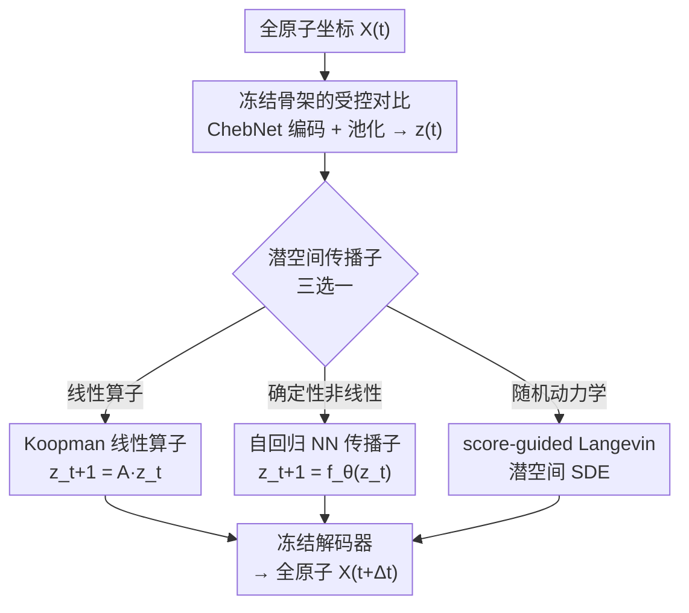

# Beyond Ensembles: Simulating All-Atom Protein Dynamics in a Learned Latent Space

**会议**: ICLR2026  
**OpenReview**: [https://openreview.net/forum?id=AwowReRWXI](https://openreview.net/forum?id=AwowReRWXI)  
**代码**: 待确认  
**领域**: 计算生物学 / 蛋白质动力学 / 生成模型  
**关键词**: 潜空间模拟, 全原子蛋白质动力学, 自回归传播子, Koopman 算子, score-guided Langevin

## 一句话总结
本文在已训好的 LD-FPG 全原子潜空间里塞进一个时间传播子 GLDP，把"只会采静态构象系综"升级成"能模拟构象随时间演化"，并在同一冻结潜空间里公平对比了三类传播子（自回归神经网络、Koopman 线性算子、score-guided Langevin），结论是：自回归 NN 长轨迹最稳、骨架动力学最准；Langevin 侧链热力学最锐利；Koopman 是轻量但偏僵硬的可解释基线。

## 研究背景与动机
**领域现状**：研究蛋白质的慢速功能性运动（折叠、配体结合、变构开关）一直靠分子动力学（MD）模拟，但这些运动发生在崎岖的能量面上、由稀有事件主导，暴力 MD 算不动。一条越来越火的替代路线是"表征优先"：把模拟问题改写成 encoder–propagator–decoder 流水线——编码器把高维原子坐标压到低维连续潜空间，传播子在这个简化空间里推进状态，解码器再把潜轨迹映射回全原子坐标。

**现有痛点**：最近的生成模型 LD-FPG 证明了可以绕开"需要预先定义良好集体变量"这个老大难——它学着把静态平衡系综表示成相对参考结构的全原子形变，是个很强的"全原子系综生成器"。但 LD-FPG 只会采样"可能出现的构象"，**完全不建模这些构象之间随时间的演化**，也就是说它给的是一堆独立快照，没有动力学、没有动力学时间尺度。

**核心矛盾**：在潜空间里"推进状态"的那个传播子，本身就卡在一个三角权衡里——物理保真度、长时程稳定性、表达能力三者难以兼得。学界提出过 Koopman 线性算子、神经序列模型、score/扩散驱动的随机动力学等多种传播子，但它们各自用不同的编码器、不同的系统评测，谁强谁弱、强在哪一块，从来没在同一个潜空间里被干净地比较过。

**本文目标**：(1) 给 LD-FPG 补上"时间维度"，让它能真正模拟动力学而非只采系综；(2) 在一个受控设置下，把三类主流传播子放进**同一个冻结潜空间**公平 PK，搞清楚各自的甜区与失效模式。

**切入角度**：既然 LD-FPG 的编码-解码器已经把"局部几何合法性"（键长键角）这件事保证好了，那就把它整个冻住当固定坐标系，只替换中间的传播子——这样性能差异就完全归因于"传播规则"本身，而不是被编码器质量混淆。

**核心 idea**：冻结 LD-FPG 编解码器，在其潜空间里只换传播子，用"自回归 NN / Koopman / score-guided Langevin"三选一做受控对比，从而隔离出"用什么规则推进潜状态"对稳定性、系综保真度和动力学时间尺度的真实影响。

## 方法详解

### 整体框架
GLDP（Graph Latent Dynamics Propagator）的骨架沿用 LD-FPG 的 encoder–decoder，并在其中插入一个**只在潜空间内工作**的时间传播子。所有实验里编码器和解码器都被冻结，唯一变动的就是中间那个传播子。整条流水线严格走四步：

1. **编码（Encoding）**：一个 Chebyshev 图神经网络（ChebNet）把全原子坐标 $X(t)\in\mathbb{R}^{N\times3}$ 映射成逐原子嵌入。
2. **池化（Pooling）**：一个确定性池化层把逐原子嵌入聚成单个紧凑潜向量 $z(t)\in\mathbb{R}^d$（$d\ll 3N$）。
3. **传播（Propagation）**：GLDP 用学到的转移函数把潜状态推进 $z_t\to z_{t+1}$，这一步是三类传播子的角逐场。
4. **解码（Decoding）**：冻结的解码器把演化后的 $z_{t+1}$ 还原成全原子坐标 $\hat X(t+1)$。

潜时间更新写成统一形式 $z_{t+1}=f(z_t)+\eta_t,\ \eta_t\sim\mathcal{N}(0,\sigma_\eta^2 I)$，其中 $f$ 是传播子、$\eta_t$ 是可选的 rollout 噪声。训练对默认用单帧步长 $(z_t,z_{t+1})$，潜向量按维度用训练集统计量标准化后再拟合传播子（解码前反标准化），初始状态 $\hat z_0$ 取一帧留出的 MD 帧编码。之所以在潜空间而非 $3N$ 维笛卡尔空间跑动力学，是因为高维空间里误差会快速累积、动辄破坏立体约束；而 LD-FPG 潜空间编码的是相对一个物理参考结构的形变，动力学天然被锚在合法构象盆地内，解码器负责把局部几何兜住，传播子就能专心学慢速集体运动。

### 关键设计

**1. 冻结骨架的受控对比：把编解码器钉死，只换传播子**

本文最根本的方法学选择，是不去重训 LD-FPG，而是把它的 ChebNet 编码器和全原子解码器整个冻结，只在中间替换传播子。痛点在于：以往不同传播子工作各用各的潜空间和编码器，性能差异里混着"编码器好不好"的噪声，没法干净归因。冻结骨架后，重建质量被固定为常量，三类传播子面对完全相同的潜向量 $z(t)$、相同的解码通路，于是稳定性、系综保真度、动力学时间尺度上的任何差异都只能来自"传播规则"本身。它还有一个工程红利：解码器已经替你保证了键长键角等局部几何合法，传播子不必再操心物理约束，只需在一个被平滑过、没有高频噪声的能量面上学慢速集体运动。

**2. Koopman 线性算子：用一个线性映射近似潜空间演化**

Koopman 变体假设潜演化可以用一个时不变线性算子近似，$z_{t+1}\approx A z_t,\ A\in\mathbb{R}^{d\times d}$。$A$ 通过动态模态分解（DMD）从数据估计：把潜轨迹排成两个错开一帧的快照矩阵 $X=[z_0,\dots,z_{M-2}]$、$Y=[z_1,\dots,z_{M-1}]$，解最小二乘 $\min_A\|Y-AX\|_F^2$ 得到 $A=YX^+$（$X^+$ 是 Moore–Penrose 伪逆）。为数值稳定，伪逆用 SVD 计算，并把 SVD 截断到较低秩 $r$ 以滤掉噪声、聚焦最显著的动态模态。生成新轨迹时从 $\hat z_0$ 自回归地反复作用 $A$，并加一点高斯 rollout 噪声 $\eta_t\sim\mathcal{N}(0,\sigma_{koop}^2 I)$ 去匹配一步残差方差。它的价值是轻量、可解释（特征值直接对应动态模态），但线性假设过强，倾向于压低涨落、把能量面压窄。

**3. 自回归神经网络传播子：直接学一个确定性非线性转移**

这个传播子用神经网络直接参数化一个确定性非线性映射 $z_{t+1}=f_\theta(z_t)$，以一步预测目标训练：$L(\theta)=\frac{1}{M-1}\sum_{t=0}^{M-2}\|f_\theta(z_t)-z_{t+1}\|^2$。它不像 Koopman 那样被线性束缚，能拟合更复杂的转移；但纯一步训练在长 rollout 时误差会累积，作者用 dropout 和权重衰减来抑制。推理时从 $\hat z_0$ 迭代 $\hat z_{i+1}=f_\theta(\hat z_i)+\eta_i,\ \eta_i\sim\mathcal{N}(0,\sigma_{roll}^2 I)$，其中 $\sigma_{roll}$ 在验证集上选取，使其匹配 $z_{t+1}-z_t$ 的一步潜残差方差。实验里它是综合最稳的传播子：长时程不崩、骨架二面角分布最准。

**4. score-guided Langevin 传播子：用学到的平衡分布 score 驱动随机模拟**

这个传播子分两阶段。**阶段一**训练一个时间条件去噪器 $\epsilon_\theta(z_t,t)$，在潜嵌入上用 DDPM 式的方差保持（VP）噪声调度，前向加噪 $z_t=\sqrt{\bar\alpha_t}z_0+\sqrt{1-\bar\alpha_t}\epsilon$。当网络学会预测噪声后，扰动数据的 score 为 $s(z_t)=\nabla_z\log p_t(z_t)\approx-\epsilon_\theta(z_t,t)/\sqrt{1-\bar\alpha_t}$；测试时查询极低噪声水平 $t_{noise}\approx0$ 来逼近未扰动 score $s(z)$。**阶段二**用 Euler–Maruyama 积分一个过阻尼 Langevin SDE，把 score 当作漂移项：$z_{t+1}=z_t+T\Delta t\,s(z_t)+\sqrt{2T\Delta t}\,\eta_t,\ \eta_t\sim\mathcal{N}(0,\sigma_\eta^2 I)$。若 $p(z)\propto\exp(-U(z)/T)$，则 $T s(z)=-\nabla U(z)$，漂移恰好对应潜空间一个有效能量面的梯度，因此理论上 score 精确时其不变分布就是目标潜分布 $p_Z$。它的甜区是侧链：热力学一致的漂移加各向同性噪声特别擅长采样锐利、多峰的 rotamer 分布；代价是对 score 估计质量和积分步长敏感、轨迹间方差偏大。

> 三个传播子建模的目标对象略有差异：Langevin 瞄准潜空间一个不变密度为 $p_Z$ 的正则分布，而 Koopman 和自回归 NN 近似的是在固定编码器下从 $(z_t,z_{t+1})$ 观测到的一步转移核 $K(z_{t+1}\mid z_t)$。由于潜空间只演化坐标 $z$、不含动量/控压，作者明确不声称严格 NVE 能量守恒或精确物理动力学，时间尺度的比较是诊断性的而非绝对标定。

### 损失函数 / 训练策略
- **自回归 NN**：一步 MSE 损失 $L(\theta)=\frac{1}{M-1}\sum\|f_\theta(z_t)-z_{t+1}\|^2$，配 dropout + 权重衰减抑制长 rollout 误差累积。
- **Koopman**：闭式最小二乘 $A=YX^+$，SVD 截断到秩 $r$ 正则化，无梯度训练。
- **Langevin**：DDPM 式 VP 去噪损失训 score 网络，温度 $T$、步长 $\Delta t$、采样步长 $s$、score clipping 等为关键超参（不同系统需单独标定，如 ADP 用 $\Delta t=10^{-8}$、A1AR 用 $\Delta t=10^{-10}$）。
- 所有传播子共享冻结的 LD-FPG 编解码器，潜向量按维度标准化后拟合、解码前反标准化。

## 实验关键数据

### 主实验
在 ADP（丙氨酸二肽）、7JFL（α-螺旋）、1R6W（混合拓扑 HIV-1 蛋白酶）、A1AR（GPCR）上，把 GLDP（用自回归 NN 传播子，记 GLDP-NN）对比 LSS、MD-Gen、GeoTDM。指标含二面角/坐标 JSD（越低越好）、接触相关性（越高越好）、TICA 慢时间尺度 $t_1$ 与去相关时间 $t_{decorr}$（越接近真值越好）。

| 系统 | 模型 | 二面角 JSD (BB/SC) | 坐标 JSD (BB/SC) | 接触相关 | TICA $t_1$ |
|------|------|------|------|------|------|
| A1AR | Ground Truth | — | — | — | 1058.85 |
| A1AR | LSS | 0.134 / 0.146 | 0.657 / 0.602 | 0.971 | 不稳定 |
| A1AR | MD-Gen | 0.033 / 0.088 | 0.106 / 0.117 | 0.941 | 85.4 |
| A1AR | **GLDP** | **0.019 / 0.067** | **0.063 / 0.087** | **0.985** | **650.2** |
| 1R6W | GLDP | 0.045 / 0.092 | 0.220 / 0.185 | 0.972 | 980.1 |
| 1R6W | LSS | 0.035 / 0.135 | 0.620 / 0.610 | 0.885 | 102.5 |

在最复杂的 A1AR 上 GLDP 全面领先：二面角与坐标 JSD 双双最低，接触相关 0.985 最高；LSS 的 TICA 出现负特征值（数值不稳定），而 GLDP 仍能恢复物理上合理的 $t_1\approx650$ 步。在 1R6W 上 GLDP 侧链分歧最低（JSD 0.092 vs LSS 0.135），并恢复出 980 步的慢时间尺度与深记忆（$t_{decorr}=1650$）。GeoTDM 在 7JFL/1R6W/A1AR 上超出 H100 的 80GB 显存无法跑，凸显坐标空间扩散模型的可扩展性瓶颈。

### 消融实验
固定 GLDP 框架、只换传播子，比较二面角自由能面保真度（JSD，5 次独立运行均值，越低越好）：

| 传播子 | ADP $(\phi,\psi)$ | A1AR $(\phi,\psi)$ | A1AR $(\chi_1,\chi_2)$ |
|------|------|------|------|
| Koopman | 0.138 ± 0.015 | 0.043 ± 0.006 | 0.121 ± 0.012 |
| 自回归 NN | **0.061 ± 0.003** | **0.019 ± 0.001** | 0.067 ± 0.002 |
| Langevin | 0.164 ± 0.021 | 0.052 ± 0.008 | **0.058 ± 0.009** |

长时程稳定性（失效定义：lDDT 相对初始帧首次 < 0.65 的帧号）：ADP 上自回归 NN 跑满 10000 帧不失效，Koopman 撑到 4443 帧，Langevin 仅 206 帧就崩（小系统上 score 估计噪声大、积分步长过激进）；A1AR 上 NN 同样跑满 10000 帧，Langevin 7476、Koopman 5740。

### 关键发现
- **骨架归 NN、侧链归 Langevin**：自回归 NN 在骨架二面角上又准又稳（A1AR $(\phi,\psi)$ JSD 0.019、方差仅 ±0.001）；但侧链 rotamer 反转——Langevin 在 A1AR $(\chi_1,\chi_2)$ 上 JSD 0.058 最优，能采出最锐利的多峰 rotamer 带，代价是方差较大（±0.009）。
- **Koopman 偏僵硬**：线性假设让它压低涨落、把自由能盆地压窄、抬高肩部，在 A2AR 活化面上难以覆盖连接非活化↔活化态的过渡走廊。
- **GPCR 活化面**：在 A2AR 上（投影到 TM3–6、TM3–7 距离的二维自由能面）Langevin 覆盖过渡谷最完整，NN 落在谷中但足迹偏紧、欠采两翼，Koopman 只抓到中心盆地。非线性传播子（NN/Langevin）整体更能描出完整活化路径。

## 亮点与洞察
- **"冻结骨架 + 只换零件"的受控对比范式**：把编解码器钉死当常量，是一种很干净的科学对照设计，让"传播规则"成为唯一自变量；这个思路可迁移到任何 encoder–propagator–decoder 类生成模拟器的组件评测。
- **三向权衡讲得很透**：稳定性（NN）、细粒度物理精度（Langevin）、可解释轻量（Koopman）各占一角，而且作者诚实地指出"无动量、不控压，所以不声称严格物理动力学"，没有过度包装。
- **把扩散去噪器复用成 score 来源**：训一个 DDPM 式去噪器、在极低噪声水平查询就得到平衡分布的 score，再喂进 Langevin SDE 当漂移——这种"去噪器即能量梯度"的复用很优雅，省掉单独训能量模型。
- **混合传播子的明确指引**：实验直接暗示了下一步——用 NN 做慢速集体运动的稳定长程积分、用 Langevin 做局部高频侧链采样，按物理尺度分工。

## 局限与展望
- **系统专用、不可迁移**：GLDP 是 per-system 代理模型，每个目标蛋白都要单独训传播子，没有跨蛋白泛化；作者把"端到端联训编码器+传播子于多蛋白数据集"列为未来方向。
- **不建模动量与精确动力学**：潜空间只演化坐标 $z$、无动量/控压，因此时间尺度只能做诊断性比较，不能标定到 wall-clock 时间，也不保证严格物理动力学。
- **Langevin 超参敏感**：步长 $\Delta t$、采样步长需逐系统标定，小系统（ADP）上极易崩（206 帧失效），鲁棒性弱于 NN。
- **依赖 LD-FPG 重建上限**：整个动力学保真度被冻结解码器的重建能力封顶，编码器若漏掉某类构象，传播子无论多强也救不回来。
- **改进思路**：训练时加显式动力学约束（如谱匹配损失）以进一步对齐时间尺度；探索 NN+Langevin 混合传播子兼顾稳定与热力学正确性。

## 相关工作与启发
- **vs LD-FPG**（Sengar et al. 2025）：LD-FPG 只学静态平衡系综（构象快照），本文在其冻结潜空间里补上时间传播子，把"采系综"升级成"模拟动力学演化"，是直接的时间维度扩展。
- **vs LSS / DeepGenMSM**（Sidky et al. 2020；Wu et al. 2018）：同属 encoder–propagator–decoder 范式，但本文冻结编解码器以控制重建质量，并在同一潜空间里聚焦比较不同传播子，而非各用各的编码器。
- **vs MD-Gen / GeoTDM**（Jing et al. 2024；Han et al. 2024）：这些在笛卡尔/SE(3) 坐标空间直接做轨迹合成或扩散，显存开销大（GeoTDM 在大系统上爆 80GB H100）；GLDP 在低维潜空间传播，可扩展到大型跨膜 GPCR。
- **vs VAMPnets / VDE / Koopman 深度变体**：这些把精力放在"学一个动力学感知的好编码器"，本文反其道而行——把编码器固定为给定项，专注研究"潜空间已就绪后不同传播机制的行为差异"。

## 评分
- 新颖性: ⭐⭐⭐⭐ 给静态系综生成器补时间维度 + 同潜空间三传播子受控对比，组合角度新颖，但单个传播子本身都是已有家族。
- 实验充分度: ⭐⭐⭐⭐⭐ 覆盖从二肽到大型 GPCR 的难度梯队，含 SOTA 对比、5 次重复消融、长时程稳定性与 TICA 动力学多维度评测。
- 写作质量: ⭐⭐⭐⭐⭐ 框架清晰、权衡讲得透、对方法局限诚实标注，公式与协议交代完整。
- 价值: ⭐⭐⭐⭐ 为潜空间蛋白动力学模拟器的传播子选型提供了实用指引（骨架用 NN、侧链用 Langevin），并指明混合传播子方向。

<!-- RELATED:START -->

## 相关论文

- [\[ICLR 2026\] BioMD: All-atom Generative Model for Biomolecular Dynamics Simulation](biomd_all-atom_generative_model_for_biomolecular_dynamics_simulation.md)
- [\[ICLR 2026\] Towards All-atom Foundation Models for Biomolecular Binding Affinity Prediction](towards_all-atom_foundation_models_for_biomolecular_binding_affinity_prediction.md)
- [\[ICLR 2026\] Coupled Transformer Autoencoder for Disentangling Multi-Region Neural Latent Dynamics](coupled_transformer_autoencoder_for_disentangling_multi-region_neural_latent_dyn.md)
- [\[ICLR 2026\] Pallatom-Ligand: an All-Atom Diffusion Model for Designing Ligand-Binding Proteins](pallatom-ligand_an_all-atom_diffusion_model_for_designing_ligand-binding_protein.md)
- [\[ICLR 2026\] One Protein Is All You Need](one_protein_is_all_you_need.md)

<!-- RELATED:END -->
