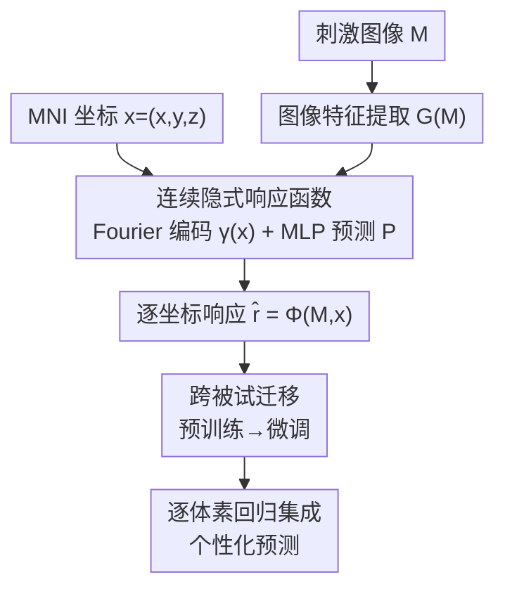

# Beyond Grid-Locked Voxels: Neural Response Functions for Continuous Brain Encoding

**会议**: ICLR2026  
**OpenReview**: [https://openreview.net/forum?id=wBKXuuLZbc](https://openreview.net/forum?id=wBKXuuLZbc)  
**代码**: https://github.com/haomiao8/NRF  
**领域**: 计算神经科学 / 脑编码 / 隐式神经表示  
**关键词**: fMRI 编码模型, 隐式神经表示, MNI 解剖坐标, 跨被试迁移, 数据高效

## 一句话总结
本文提出 NRF（Neural Response Function），把 fMRI 视觉编码从"对每个被试的离散体素向量做回归"改成"在标准 MNI 解剖空间上学一个连续隐式函数 $\Phi(M,x)$"，输入图像 $M$ 和坐标 $x=(x,y,z)$ 直接预测该位置的脑响应，从而利用体素的局部平滑性和跨被试解剖对齐，做到在只有几百张图的低数据场景下也明显超过传统编码模型，并支持把一个被试上预训练的模型微调迁移到新被试。

## 研究背景与动机
**领域现状**：神经编码模型（neural encoding model）的目标是预测大脑（通常用 fMRI 测量）对自然图像的响应，是探究视觉皮层表征的核心工具。主流做法把 fMRI 体积"拍平"成一个 $\mathbb{R}^n$ 的一维向量（$n$ 是该被试的体素数），然后训练一个回归器，从图像特征直接映射到这个扁平向量。

**现有痛点**：这种离散表述有两个硬伤。其一是**丢掉 3D 结构**——把体积拍平成向量后，解剖上相邻、功能上高度相关的体素被当成彼此独立的输出来预测，局部空间上下文被彻底抹掉。其二是**绑死单个被试**——模型输出维度等于某个被试的体素数，而不同人的体素数和体素网格各不相同，于是一个被试上学到的知识无法直接迁移给另一个人，每来一个新被试都得从头训一个新模型。

**核心矛盾**：大脑本身是一个**连续的 3D 结构**——同一被试内相邻体素响应模式相似（局部平滑），不同被试间视觉皮层高度保守（如 FFA、EBA 在 MNI 标准模板下能很好对齐）。可传统编码模型把它当成一堆互不相干的离散采样点，既浪费了这些天然结构带来的统计效率，又在数据稀缺时表现尤其糟。而现实里除了 NSD 这种花一年扫上万 trial 的大工程，大多数研究每个被试只能采几百个 trial，离散模型的低效在低数据场景被进一步放大。

**本文目标**：让编码模型（1）能利用体素的局部平滑性、（2）能跨被试共享知识、（3）不被训练时的体素网格分辨率绑死。

**切入角度**：作者借鉴计算机视觉里的隐式神经表示（INR，如 NeRF、SIREN、DeepSDF）——这些方法不把信号存在固定网格上，而是用一个坐标→值的连续函数来参数化信号，天然支持任意分辨率查询。作者把同样的"坐标条件连续函数"思路搬到 fMRI 编码：既然大脑是连续的 3D 结构，那就别再用离散体素，而是学一个定义在解剖坐标上的连续场。

**核心 idea**：用一个连续隐式函数 $\Phi(M,x)=\hat r$ 代替"图像→扁平体素向量"的离散回归，把解剖坐标作为输入条件，从而把局部平滑性和跨被试对齐这两条神经科学先验直接注入到模型学习过程里。

## 方法详解

### 整体框架
NRF 要解决的是"在数据稀缺时也能准确预测 fMRI 视觉响应、并且能跨被试迁移"。它的核心转变是把编码问题从离散回归改成**坐标条件的连续场预测**：给定刺激图像 $M$ 和一个 MNI 标准解剖空间中的坐标 $x=(x,y,z)\in\mathbb{R}^3$，模型输出该位置的预测响应 $\hat r\in\mathbb{R}$，即

$$\Phi(M, x) = \hat r.$$

整条 pipeline 分两条线。**单被试编码线**：图像先经特征提取块 $G$ 得到嵌入 $G(M)$，坐标 $x$ 先用 Fourier 特征编码成 $\gamma(x)$，两者拼接后送进一个 MLP 预测器 $P$ 输出响应；训练时随机采样图像和体素端到端优化。**新被试适配线**：拿在其他被试上预训练好的 NRF，用新被试少量数据做端到端微调，再对多个微调后的基模型做逐体素回归集成，得到针对该被试的个性化预测。直觉上，$\Phi$ 把每个解剖位置 $x$ 映射到一个"功能嵌入"（刻画该位置对什么刺激特征敏感），$\hat r$ 来自这个功能嵌入和刺激表征的比较——相当于学了一张**连续的功能图谱**，解剖位置提供基底、学到的位移携带调谐，这种"解剖位置 × 功能身份"的分解正是单一模型能在体素网格不同的被试间共享参数的原因。

### 关键设计

**1. 连续隐式响应函数：把扁平体素向量换成解剖坐标上的连续场**

针对"拍平丢 3D 结构 + 绑死单被试"这个根本痛点，NRF 不再输出固定长度的体素向量，而是把脑响应建成定义在 $\mathbb{R}^3$ 上的连续函数 $\Phi$。具体实例化为两个组件：特征提取块 $G$ 从图像 $M$ 抽取并融合多尺度特征得到嵌入 $G(M)$；隐式预测器 $P$ 同时以 $G(M)$ 和空间坐标为条件。坐标先经 Fourier 特征编码

$$\gamma(x)=[\cos(2\pi b_1^\top x),\sin(2\pi b_1^\top x),\dots,\cos(2\pi b_m^\top x),\sin(2\pi b_m^\top x)]^\top,$$

其中 $b_j$ 从各向同性高斯采样（这一步让 MLP 能拟合坐标上的高频变化，是 INR 的标准操作）。随后 $G(M)$ 与 $\gamma(x)$ 拼接送入 MLP，得到 $\Phi(M,x)=P(G(M),\gamma(x))$。这样做的有效性在于：由于 $\Phi$ 定义在连续坐标上，预测被显式地"接地"到解剖位置，相邻且功能相关的体素通过共享坐标自然地共享信息，而不是各算各的；同时模型可以在任意分辨率查询，彻底和采集时的体素网格解耦，实现分辨率无关的建模与分析。

**2. 数据高效的训练目标：MSE 与余弦相似度的凸组合**

低数据场景下既要预测准、又要保住响应的整体模式，单纯 MSE 容易只压绝对误差而忽略响应向量的方向。NRF 沿用 Beliy 等人的损失，对预测响应 $\hat r$ 与真实 fMRI $r$ 取均方误差和余弦相似度的凸组合：

$$L(\hat r, r) = (1-\alpha)\lVert \hat r, r\rVert_2 + \alpha\cdot\cos(\angle(\hat r, r)),$$

其中 $\alpha=0.1$，在"绝对误差最小化（MSE）"和"表征对齐（余弦相似度）"之间做平衡（⚠️ 公式形式以原文为准）。训练时每个 batch 取 32 张随机图像，每张图从该被试约 13000–15000 个体素里随机采 2000 个体素及其响应来预测，Adam 优化、学习率 3e-3、端到端联合训练 $G$ 与 $P$。这种"随机采样体素而非吃整张体积"的训练方式本身就利用了连续场的优势——模型不需要每次看全部体素，从稀疏采样里也能学到平滑映射，这正是它数据高效的来源之一。

**3. 跨被试微调：在共享 MNI 坐标系上直接迁移**

新被试数据稀缺是编码模型落地的最大障碍——离散模型因为绑死体素网格，每个新被试都得从零训练。NRF 因为响应定义在标准 MNI 空间，不同被试天然落在同一套解剖坐标系里，于是支持直接迁移：在源被试上预训练的模型，无需做体素重采样，就能在新被试的坐标和响应上微调。作者对 $\Phi$ 的两个组件 $G$（视觉处理）和 $P$（视觉→解剖映射）都做端到端微调，理由是个体在"如何处理视觉内容"和"如何把内容映射到解剖位置"两方面都有差异，所以两个组件都需要适配。消融实验（§5.3 的坐标平移扰动）进一步证明：把 MNI 坐标打乱后迁移效果显著变差，说明跨被试增益确实来自解剖对齐而非别的。

**4. 逐体素回归集成：把多个源被试的知识"混"进目标被试**

单个微调模型只携带一个源被试的知识，简单平均又会抹掉被试特异的变异性。NRF 对 $K$ 个微调后的基模型做**逐体素回归集成**：对每个体素 $v$，设第 $k$ 个基模型对第 $i$ 张图的预测为 $\hat r_v^{(k,i)}$，在新被试有限的适配数据上用最小二乘学一组体素专属权重 $w_{v,k}$ 和偏置 $b_v$：

$$\min_{\{w_{v,k},b_v\}}\sum_{i=1}^{N}\Big(r_v^{(i)}-\sum_{k=1}^{K}w_{v,k}\hat r_v^{(k,i)}-b_v\Big)^2,$$

推理时该体素的最终预测为 $\hat r_v=\sum_{k=1}^{K}w_{v,k}\hat r_v^{(k)}+b_v$。它的妙处在于：权重是逐体素学的，所以集成不是简单去噪平滑，而是按体素灵活地"挑选"哪个源被试的知识更适合这个位置，从而在保住目标被试个体变异的同时融合多源知识。消融显示简单平均虽然略微提升体素级精度，却损害语义保真度（解码出的图像更差），而逐体素回归在体素级和语义级解码上都更强。

### 损失函数 / 训练策略
- 单被试训练：损失为 MSE 与余弦相似度的凸组合（$\alpha=0.1$），Adam，lr=3e-3，batch 32 图 × 每图采 2000 体素，端到端联合训练 $G$ 和 $P$。
- 新被试适配：两步——先端到端微调（$G$、$P$ 都调），再对多个微调基模型做逐体素最小二乘回归集成。

## 实验关键数据

### 主实验
数据集用 NSD（8 名被试观看 1 万张 MS COCO 自然图，7T fMRI），用 nsdgeneral ROI 掩膜聚焦视觉皮层，评测 Subj01/02/05/07（这几位完成了全部 session）。每被试约 9000 张图训练、约 1000 张测试。指标分两层：体素级（逐体素 Pearson $r$、MSE）和语义级（把预测响应喂给预训练解码器 MindEye2 重建图像，再算 PixCorr/SSIM/AlexNet/Incep/CLIP/Eff/SwAV）。

满数据（约 9k 图）下与基线对比（4 被试体素中位数的均值）：

| 方法 | Pearson↑ | MSE↓ | PixCorr↑ | SSIM↑ |
|------|----------|------|----------|-------|
| Linear Regression | 0.323 | 0.353 | 0.186 | 0.271 |
| fWRF | 0.343 | 0.361 | 0.303 | 0.341 |
| MindSimulator (Trials=5) | 0.355 | 0.385 | 0.201 | 0.298 |
| **NRF（本文）** | **0.358** | **0.345** | 0.261 | 0.371 |

NRF 在体素级（Pearson 最高、MSE 最低）领先，语义级与基线相当。作者特别指出 fWRF 的语义分数异常高（甚至超过用真实 fMRI 解码的结果），归因于"解码器偏置"——fWRF 输出虽然神经精度低，却更贴近预训练解码器的分布，从而虚高语义指标；因此语义级指标只能当作重建质量的粗略参考，不宜作为编码模型的严格比较依据。

低数据场景（Figure 2a）最能体现优势：**只用 200 张训练图，NRF 就超过基线用 800+ 张图训练的结果**，作者把这归功于坐标条件带来的解剖感知能力，让模型能从稀缺数据里挖到响应的平滑性。

新被试适配（Subj 1/2/5 预训练 → Subj7 适配，Table 2，体素中位数）：

| 适配图数 | 方法 | Pearson↑ | SSIM↑ | CLIP↑ |
|----------|------|----------|-------|-------|
| Full（subj7 全量从零） | — | 0.269 | 0.367 | 0.846 |
| 20 | NRF scratch | 0.076 | 0.195 | 0.545 |
| 20 | NRF finetune ensemble | 0.114 | 0.366 | 0.729 |
| 200 | NRF scratch | 0.180 | 0.284 | 0.716 |
| 200 | NRF finetune ensemble | 0.227 | 0.372 | 0.873 |
| 800 | NRF finetune ensemble | 0.251 | 0.382 | 0.895 |

关键发现：**仅 200 张适配图的 finetune+ensemble（Pearson 0.227）就超过了用全量数据从零训的模型（0.269 是全量、但在多数语义指标如 SSIM 0.372 > 0.367、CLIP 0.873 > 0.846 上反超）**，且各数据量下 finetune+ensemble 一致优于 scratch。

### 消融实验
逐体素回归集成的消融（Subj1/2/5 → Subj7，200 图，Table 3）：

| 配置 | Pearson↑ | PixCorr↑ | CLIP↑ | 说明 |
|------|----------|----------|-------|------|
| finetune ensemble（逐体素回归） | 0.227 | 0.255 | 87.3% | 体素级与语义级都最优 |
| finetune average（简单平均） | 0.253 | 0.167 | 74.9% | 体素级略高，但语义保真度崩 |
| finetune base (subj1→7) | 0.220 | 0.246 | 86.9% | 单源基模型 |
| finetune base (subj2→7) | 0.232 | 0.243 | 82.4% | 单源基模型 |
| finetune base (subj5→7) | 0.225 | 0.226 | 82.4% | 单源基模型 |

另有"探测解剖感知"的扰动实验（Figure 4）：（a）打乱坐标–响应配对（破坏局部平滑）后精度下降，低数据下尤甚，全局打乱掉得最多；（b/c）平移 MNI 坐标（破坏跨被试对齐）后迁移变差，同样在低数据下影响最大。

### 关键发现
- **逐体素回归 vs 简单平均**：简单平均能略微抬高体素级 Pearson（0.253 > 0.227），却把语义保真度（PixCorr 0.255→0.167、CLIP 87.3%→74.9%）拉崩——说明平均压制了被试个体变异，而逐体素回归是"按位置混合专长知识"而非单纯去噪。
- **解剖先验是性能来源**：打乱坐标或平移坐标都让性能（尤其低数据下）显著退化，直接证明 NRF 的数据高效确实来自利用局部平滑性和跨被试解剖对齐这两条结构先验。
- **低数据增益最显著**：无论单被试编码还是跨被试迁移，NRF 的优势在 trial 越少时越明显，正好对上现实中数据稀缺的痛点。

## 亮点与洞察
- **把 INR 的"坐标→值连续场"范式第一次搬进 fMRI 编码**：用一个 $\Phi(M,x)$ 同时解决"丢 3D 结构"和"绑死单被试"两个老问题，思路干净——既然大脑是连续的，就别再假装它是一堆独立体素。
- **解剖位置 × 功能身份的分解**：坐标提供解剖基底、学到的位移携带功能调谐，这个分解是单模型能跨体素网格不同的被试共享参数的根本，也让"连续功能图谱"这个直觉站得住。
- **逐体素回归集成是个可迁移的 trick**：当你有多个源域模型、目标域数据少时，逐元素学一个最小二乘组合权重，比简单平均更能保住目标域特异性——这个思路可迁移到任何"多源个性化适配"的低数据问题。
- **对语义级指标的诚实反思**：作者主动指出 fWRF 语义分虚高源自解码器偏置，提醒"用预训练解码器评编码模型"会引入分布偏置，这种自我证伪比单纯刷点更有价值。

## 局限与展望
- **只验证了视觉皮层 + 自然图像**：实验局限在 NSD 的 nsdgeneral 视觉 ROI 和 COCO 图像，能否推广到其他脑区、其他模态刺激（语言、听觉）尚未验证。
- **依赖 MNI 配准质量**：整套跨被试迁移建立在"被试都已准确配到 MNI 空间"的前提上，坐标平移消融已显示对齐被破坏时迁移大幅退化；现实里配准误差、个体解剖差异大的人群可能削弱增益。
- **语义级评测受限于解码器**：语义指标依赖 MindEye2 这个特定预训练解码器，存在解码器偏置（作者自己也承认），不是干净的编码质量度量。
- **集成的计算/数据开销**：finetune+ensemble 需要多个源被试的预训练基模型，源被试数量、选哪些源被试对目标的影响、规模化到很多被试时的成本，文中讨论有限。
- **可改进方向**：把连续场扩展到全脑、引入更强的图像编码器、或显式建模个体解剖形变（而非只靠 MNI 配准），都可能进一步提升。

## 相关工作与启发
- **vs 传统体素级编码（fWRF、Linear Regression、VAE 类）**：他们把 fMRI 拍平成 1D 向量、每个体素独立回归、绑死单被试；NRF 把响应建成连续坐标函数，利用平滑性和对齐，区别在于"离散独立点 vs 连续解剖场"，优势是数据高效、分辨率无关、可跨被试迁移。
- **vs 引入空间先验的编码工作（如视网膜拓扑贝叶斯模板、空间频率多参数拟合）**：这些方法只是局部引入空间先验，整体框架仍是离散的；NRF 把解剖结构注入到整个学习过程。
- **vs 跨被试解码方法（MindEye2、自适应池化、把坐标作位置编码喂注意力）**：那条线做的是"从测到的离散体素网格解码刺激"，即使用了坐标也仍绑在采集到的具体体素上；NRF 做的是相反方向的编码，且把坐标当作连续场的输入而非离散体素的辅助特征，从而支持任意位置查询和无需重采样的跨被试适配。
- **vs 隐式神经表示（SIREN、NeRF、DeepSDF、Occupancy Net）**：NRF 借用其坐标 + Fourier 特征 + MLP 的连续场表述，但首次把它用到计算神经科学，证明"连续场 + 解剖接地"能带来数据效率和泛化。

## 评分
- 新颖性: ⭐⭐⭐⭐⭐ 首次把 INR 连续场范式引入 fMRI 编码，重新表述了一个用了二十年的离散问题。
- 实验充分度: ⭐⭐⭐⭐ 单被试 + 跨被试 + 扰动探测 + 集成消融都做了，但局限在视觉皮层和 NSD 单一数据集。
- 写作质量: ⭐⭐⭐⭐ 动机清晰、对语义指标的自我反思加分；部分公式排版略糙。
- 价值: ⭐⭐⭐⭐⭐ 直击 fMRI 编码"数据稀缺 + 不可迁移"的真实痛点，给出可落地、可扩展为"脑数字孪生"的新范式。

<!-- RELATED:START -->

## 相关论文

- [\[ICLR 2026\] Continuous Multinomial Logistic Regression for Neural Decoding](continuous_multinomial_logistic_regression_for_neural_decoding.md)
- [\[ICLR 2026\] TRIBE: Trimodal Brain Encoder for Whole-Brain fMRI Response Prediction](tribe_trimodal_brain_encoder_for_whole-brain_fmri_response_prediction.md)
- [\[ICLR 2026\] Animal behavioral analysis and neural encoding with transformer-based self-supervised pretraining](animal_behavioral_analysis_and_neural_encoding_with_transformer-based_self-super.md)
- [\[ICLR 2026\] OmniMouse: Scaling properties of multi-modal, multi-task Brain Models on 150B Neural Tokens](omnimouse_scaling_properties_of_multi-modal_multi-task_brain_models_on_150b_neur.md)
- [\[ICLR 2026\] Beyond Ensembles: Simulating All-Atom Protein Dynamics in a Learned Latent Space](beyond_ensembles_simulating_all-atom_protein_dynamics_in_a_learned_latent_space.md)

<!-- RELATED:END -->
