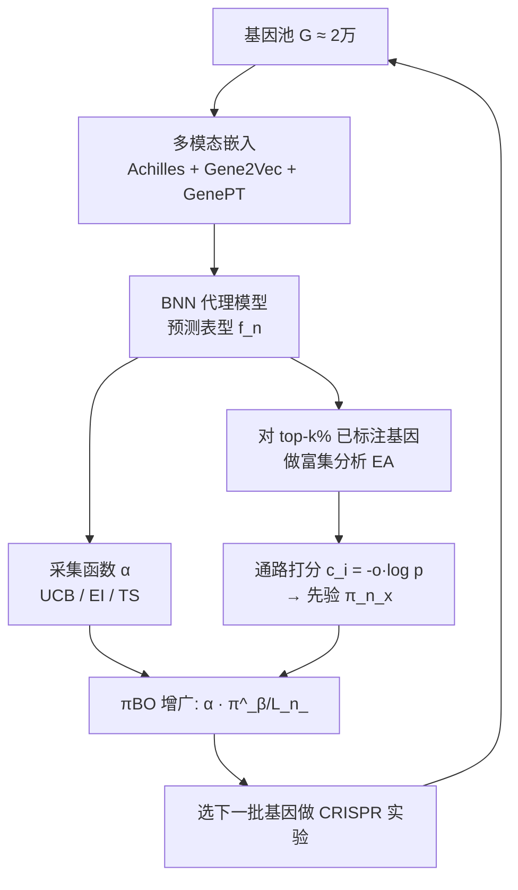

# BioBO: Biology-informed Bayesian Optimization for Perturbation Design

**会议**: ICLR 2026  
**OpenReview**: [https://openreview.net/forum?id=CF3kJrAwmV](https://openreview.net/forum?id=CF3kJrAwmV)  
**代码**: 待确认  
**领域**: 计算生物学 / 贝叶斯优化 / 基因扰动实验设计  
**关键词**: Bayesian Optimization, Perturbation Design, Multimodal Gene Embeddings, Enrichment Analysis, πBO, CRISPR Screen  

## 一句话总结
BioBO 把多模态基因表征（Achilles + Gene2Vec + GenePT）塞进贝叶斯优化的代理模型、再用富集分析（enrichment analysis）结果当作 πBO 框架下的先验去增广采集函数，让 CRISPR 基因敲除筛选的标注效率提升 25–40%，同时给出通路级（pathway-level）的可解释设计依据。

## 研究背景与动机
**领域现状**：早期药物发现要靠 CRISPR-Cas9 敲除筛选逐个扰动基因、观察细胞表型来推断基因功能并锁定治疗靶点。但人类有约 2 万个蛋白编码基因，穷举所有扰动在实验成本上完全不可行，因此需要一种"少量实验就能找到高价值靶点"的样本高效策略。贝叶斯优化（BO）正好擅长这件事：用高斯过程或贝叶斯神经网络（BNN）当代理模型拟合响应面，再用采集函数（EI/UCB/TS 等）在"开发已知最优"和"探索不确定区域"之间权衡。

**现有痛点**：把 BO 用到基因扰动设计的工作（GeneDisco、DiscoBAX）普遍只用**单模态、通用的基因嵌入**，没把生物先验知识用足，性能受限。另一条平行的生物学路线——富集分析（EA），能找出在 top 基因里统计上显著过表征的通路、给出机制层面的提示，却有两个硬伤：**(i) 缺粒度**——把同一通路里所有未测基因当成同等有希望，显著通路一大就又是一个巨大候选池；**(ii) 纯开发无探索**——只会往已知生物学里钻，显著通路被反复选，非显著通路永远不被碰。

**核心矛盾**：BO 有原则化的探索-开发权衡但缺生物领域知识，EA 有丰富生物先验但缺粒度且只会开发——两边各有一半答案，却没人把它们以理论可靠的方式拼起来。

**本文目标**：构造一个统一框架，**用 EA 给 BO 注入生物领域知识，同时用 BO 给 EA 补上粒度和探索能力**，并保证拼接后不损害 BO 原有的收敛保证。

**核心 idea**：**双管齐下** —— 在代理模型侧融合多模态基因表征提升"靠近最优处"的预测质量；在采集函数侧把富集分析的通路打分转成 πBO 的先验分布 $\pi_n(x)$，去偏置搜索方向但随数据增多自动衰减。

## 方法详解

### 整体框架
BioBO 在标准 BO 主循环上做两处正交改造：**代理建模侧**把基因的多模态嵌入拼起来喂给 BNN，让代理在最优附近预测更准；**采集函数侧**对当前已标注 top 基因做富集分析，把"未标注基因落在哪些显著通路、这些通路有多代表性"折算成一个先验概率，再用 πBO 把这个先验乘进任意 myopic 采集函数。两条改造都不改 BO 的骨架，因此能即插即用到 UCB/EI/TS 上，分别得到 BioUCB/BioEI/BioTS。

### 关键设计

**1. 多模态基因表征融合：把"近最优处"的预测磨锋利。** 现有工作只用 GeneDisco 的 Achilles 描述子（单模态），BioBO 额外引入两路嵌入：Gene2Vec（用自监督学到基因本体 GO 里的基因-基因关系）和 GenePT（基于文献用 ChatGPT 生成的基因嵌入）。最简单的做法是直接把三者拼接 $f([x, x_{g2v}, x_{\text{GenePT}}])$ 喂进 BNN，论文还探索了在隐空间用拼接或 cross-attention 学联合表征的 latent-space fusion。值得玩味的是论文第 4.3 节的反直觉发现：融合**并不会**提升代理模型的全局预测质量（全局对数似然 LL 与 BO 的 top-k recall 甚至负相关，Spearman −0.22 到 −0.31），真正起作用的是它**改善了靠近最优的那一小撮点的预测**——LL@top-1% 与 top-k recall 的 Spearman 相关高达 0.49（IFN-γ）和 0.64（IL-2）。直觉是 BO 只需要代理把高价值候选的相对排序和局部最优定准，不在乎全局精度，所以"局部磨锋利"才是融合带来收益的真正机制。

**2. 富集分析先验：把通路统计显著性折算成可选基因概率。** 每轮迭代把已标注基因按表型变化排序，取 top-10% 作为"感兴趣基因集" $S_n$，对每条预定义通路 $P_i$ 用超几何分布算 p 值并做 Bonferroni 校正得 $p_{adj}(P_i)$，再结合优势比 $o(P_i)$ 算出综合代表性打分 $c(P_i)=-o(P_i)\log p(P_i)$。一个未标注基因 $x$ 的先验由它所落入的所有显著通路（$p_{adj}<0.05$）的打分聚合而来：

$$s_n(x) = \text{logit}\!\left(\tfrac{1}{U_n}\right) + \tfrac{1}{t}\,\underset{\{P_i \mid x\in P_i,\, p_n^{adj}(P_i)<0.05\}}{\text{agg}}\big[c_n(P_i)\big], \quad \pi_n(x) = \frac{e^{s_n(x)}}{\sum_x e^{s_n(x)}}$$

其中 $U_n$ 是未标注基因数，聚合 agg 默认取 mean（也试了 max）。温度 $t$ 控制保留多少 EA 信息：$t\to\infty$ 时 $\pi$ 退化成均匀分布、EA 被忽略；论文全程用 $t=0.1$。这一步正好补上了纯 EA 的"缺粒度"——同一通路里的基因不再等概率，而是按通路代表性和落点情况被精细加权。

**3. πBO 增广采集函数 + no-harm 保证：让先验随数据自动退场。** BioBO 不直接拿先验贪心选基因（那就退回纯开发了），而是套用 πBO 把先验乘进采集函数：

$$\pi\alpha_{p(f_n|D_n)}(x) = \alpha_{p(f_n|D_n)}(x)\,\pi_n(x)^{\frac{\beta}{L_n}}$$

指数 $\beta/L_n$ 是点睛之笔——$\beta$ 是用户对先验的信心，$L_n$ 是当前已标注样本数，随着实验推进、数据变多，先验的权重自动衰减，让 BO 越来越信任代理模型而非生物先验。这带来了关键的 **no-harm 保证**：配合 myopic 采集函数（本文全部用的都是），BioEI 的遗憾可被对应 EI 的遗憾界住，$L_n(\text{BioEI}_n)\le C_{\pi,n}L_n(\text{EI}_n)$ 且 $C_{\pi,n}=(\max_x\pi_n/\min_x\pi_n)^{\beta/L_n}$，渐近上 $L_n(\text{BioEI}_n)\sim L_n(\text{EI}_n)$。换句话说，即便富集分析给出的先验有偏有错，BioBO 最坏也只是退回到原始 BO 的水平，不会被坏先验带沟里——这正是把"开发型"EA 安全嵌入"探索-开发平衡"BO 的理论底气。

## 实验关键数据

数据集：GeneDisco 的 5 个全基因组 CRISPR assay，主文聚焦最常用的 IFN-γ 和 IL-2；用 Achilles 作基础基因描述子，额外加 Gene2Vec、GenePT；代理用 BNN，采集函数用 UCB/EI/TS/DiscoBAX；EA 用 Gene Ontology（GO）和 Hallmark（HM）两个通路库；每组 7 个随机种子。评测指标为 Cumulative Top-k Recall（识别 top 扰动的能力）。

### 主实验表格（Cumulative top-k recall，越高越好，括号为标准误）

| 采集函数 | IFN-γ Fusion | IFN-γ Achilles | IL-2 Fusion | IL-2 Achilles |
|---|---|---|---|---|
| EI | 0.093 | 0.072 | 0.148 | 0.130 |
| BioEI-GO (ours) | 0.098 | 0.085 | 0.147 | 0.138 |
| BioEI-HM (ours) | 0.096 | 0.076 | 0.153 | 0.130 |
| TS | 0.083 | 0.068 | 0.142 | 0.119 |
| BioTS-GO (ours) | 0.095 | 0.073 | 0.147 | 0.142 |
| BioTS-HM (ours) | 0.097 | 0.097 | 0.153 | 0.123 |
| UCB | 0.100 | 0.077 | 0.174 | 0.143 |
| BioUCB-GO (ours) | 0.102 | 0.098 | 0.169 | 0.158 |
| **BioUCB-HM (ours)** | **0.109** | 0.085 | **0.178** | 0.163 |
| Random | 0.050 | 0.050 | 0.049 | 0.048 |

BioBO 在 24 个设置里 23 个取得最佳；最优组合是 **Fused 嵌入 + BioUCB-HM**，在 IFN-γ 和 IL-2 上都是冠军。

### 消融实验（多模态 vs 单模态、纯 EA vs BioBO）

| 维度 | 对照 | BioBO 关键观察 |
|---|---|---|
| 多模态融合（图 2） | 单模态 Achilles/Gene2Vec/GenePT | Fusion 始终优于任一单模态，标注成本节省 4%–40%；最佳为 Fusion+UCB |
| BO vs Random | Random | 所有 BO 采集函数都强于 random，UCB 尤甚，省 25%–75% 标注 |
| 纯 EA（图 4a） | Random | 纯 EA 贪心选基因优于 random，但纯开发无探索 |
| EA 先验加成（图 4b） | UCB | BioUCB 同时优于 UCB 和纯 EA；IFN-γ 上 EA 先验把 UCB 标注效率提升约 20% |
| DiscoBAX | — | 表现差于标准采集函数（与其官方 repo Issue #3 报告的实现 bug 一致），后续实验剔除 |

### 关键发现
- **机制解释**：融合的收益来自"近最优局部"而非全局——全局 LL 与 BO 性能负相关，LL@top-1% 与 BO 性能正相关（Spearman 最高达 0.64），在 4/5 数据集上 top-k recall 与 LL@top-1% 相关性最高。
- **可解释性（表 2）**：BioUCB-HM 选出的设计在 Hallmark 富集上信号远强于 UCB。以 MYC TARGETS V1 通路为例，UCB 设计 overlap 32/200、combined score 237；BioUCB-HM 达到 overlap 187/200、调整 p 值 $4.98\times10^{-247}$、combined score $4.37\times10^5$，给出了机制连贯的通路级解释。

## 亮点与洞察
- **"双向补全"的框架视角很漂亮**：不是简单把生物知识当特征塞进去，而是清楚指出 BO 缺领域知识、EA 缺粒度和探索，再用 πBO 的衰减先验把两者各自的短板互补，逻辑闭环。
- **no-harm 保证是落地关键**：生物先验天然有噪声有偏（well-characterized 通路被过度研究），$\beta/L_n$ 衰减 + 遗憾界让"坏先验最坏退回原始 BO"，这对真要进湿实验的人来说是敢用的前提。
- **反直觉的代理诊断很有教益**：揭示"全局 LL 提升 ≠ BO 提升、局部 LL 才是真因"，纠正了"代理越准 BO 越好"的朴素假设，对整个 BO 社区都有方法论价值。
- **可解释性是真·副产品**：富集先验本身就携带通路语义，选完基因顺手就能给出 pathway-level 机制解释，不需要额外的事后归因模块。

## 局限与展望
- **retrospective 评测而非真湿实验**：所有 BO loop 都在已全标注的 GeneDisco 池上模拟"在线查询"，没做真实 CRISPR 湿实验验证，真实场景里未标注基因没有 ground-truth 表型，效果可能打折。
- **强依赖通路库质量**：EA 先验完全建立在 GO/Hallmark 等人工标注通路库上，对注释稀疏的新基因/孤儿基因，先验几乎不提供信息，"探索未知"的承诺主要靠 BO 那一侧兜底。
- **超参与设计选择待考**：top-k%（用 10%）、温度 $t=0.1$、$\beta$、聚合用 mean/max 等都靠附录敏感性分析定，跨表型/跨细胞系是否稳健需更多验证。
- **DiscoBAX 对比偏弱**：被剔除是因其官方实现 bug，所以与"专门为 BAX 设计的采集函数"的真实较量其实没充分展开。
- **展望**：把 latent-space cross-attention 融合做深、引入更多组学模态（表达、蛋白互作）、以及在真实迭代湿实验闭环里验证 no-harm 保证，都是自然的下一步。

## 相关工作与启发
- **BO 用于基因扰动设计**：GeneDisco (Mehrjou et al., 2021)、DiscoBAX (Lyle et al., 2023) 是直接前作，本文沿用其 BNN + GeneDisco 设定但指出它们只用单模态嵌入。
- **πBO (Hvarfner et al., 2022)**：本文增广采集函数与 no-harm 保证的理论基座，BioBO 的贡献是把"用户先验"具体化为"富集分析先验"。
- **多模态基因嵌入**：Gene2Vec (Du et al., 2019)、GenePT (Chen & Zou, 2025) 提供了 GO 关系与文献语义两路异构信息。
- **富集分析**：Subramanian et al. (2005)、Hallmark (Liberzon et al., 2015) 等是 EA 与通路库基础；Chen et al. (2013) 的 combined score 被直接用来构造先验。
- **启发**：这套"把成熟的领域统计工具（EA/p 值/通路）转写成 BO 先验，再用衰减机制+遗憾界保安全"的范式，可迁移到任何"有强领域启发式但又怕被启发式带偏"的科学实验设计问题——材料筛选、分子优化、临床试验设计都值得照搬。

## 评分
- **新颖性**: ⭐⭐⭐⭐ — 把富集分析以 πBO 先验的形式原则化地嵌入 BO，并给出 no-harm 理论保证，框架视角清晰；单个组件（πBO、多模态嵌入、EA）均为已有工具，胜在组合与诊断。
- **实验充分度**: ⭐⭐⭐⭐ — 5 数据集 × 多采集函数 × 2 通路库 × 7 种子，含机制层面的 BO-代理相关性分析与可解释性表格；扣分在于全为 retrospective 模拟、无真实湿实验。
- **写作质量**: ⭐⭐⭐⭐ — 动机-矛盾-方法-理论-诊断层层递进，"为什么融合有用"的反直觉分析尤其加分。
- **价值**: ⭐⭐⭐⭐ — 对 CRISPR 筛选/药物靶点优先级排序有直接落地价值，no-harm 保证让生物学家敢用；并给整个 BO 社区贡献了"局部 LL 才是关键"的方法论洞察。

<!-- RELATED:START -->

## 相关论文

- [\[ICLR 2026\] PatchDNA: A Flexible and Biologically-Informed Alternative to Tokenization for DNA](patchdna_a_flexible_and_biologically-informed_alternative_to_tokenization_for_dn.md)
- [\[NeurIPS 2025\] Is Sequence Information All You Need for Bayesian Optimization of Antibodies?](../../NeurIPS2025/computational_biology/is_sequence_information_all_you_need_for_bayesian_optimization_of_antibodies.md)
- [\[ICML 2025\] Empower Structure-Based Molecule Optimization with Gradient Guided Bayesian Flow Networks](../../ICML2025/computational_biology/empower_structure-based_molecule_optimization_with_gradient_guided_bayesian_flow.md)
- [\[ICLR 2026\] scDFM: Distributional Flow Matching for Robust Single-Cell Perturbation Prediction](scdfm_distributional_flow_matching_model_for_robust_single-cell_perturbation_pre.md)
- [\[ICML 2026\] Constrained Flow Optimization via Sequential Fine-Tuning for Molecular Design](../../ICML2026/computational_biology/constrained_flow_optimization_via_sequential_fine_tuning_for_molecular_design.md)

<!-- RELATED:END -->
