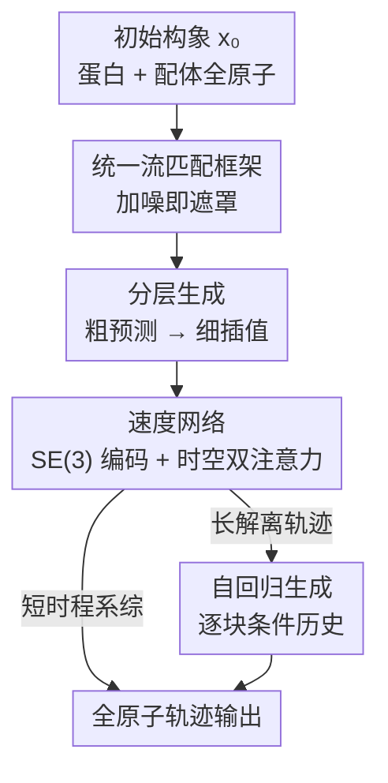

# BioMD: All-atom Generative Model for Biomolecular Dynamics Simulation

**会议**: ICLR2026  
**OpenReview**: [https://openreview.net/forum?id=LQDeJk6NOr](https://openreview.net/forum?id=LQDeJk6NOr)  
**代码**: 待确认  
**领域**: 计算生物 / 分子动力学 / 生成模型 / 流匹配  
**关键词**: 分子动力学, 全原子生成, 流匹配, 蛋白-配体, 解离路径

## 一句话总结
BioMD 是首个面向蛋白-配体体系的全原子生成式分子动力学模型，用"粗粒度预测 + 细粒度插值"的分层流匹配框架，把传统 MD 需要数小时的长时程轨迹（含配体解离路径）压缩到几十秒生成，并在 DD-13M 上对 97.1% 的体系成功重建出解离路径。

## 研究背景与动机
**领域现状**：分子动力学（MD）模拟是计算化学与药物发现的核心工具，它通过数值积分牛顿运动方程，直接产出原子随时间演化的轨迹，从而揭示构象系综、结合位点、解离通道等动态信息。近年机器学习开始作为 MD 的"加速替身"，出现了生成蛋白构象系综的模型、训练在量子数据上的神经网络势能，以及 AlphaFold 3 这类高精度结构预测器。

**现有痛点**：传统 MD 受限于极高的算力开销——即便有 PME 把复杂度降到 $O(N\log N)$，力的计算仍是最贵的部分；而为了解析飞秒级的高频原子振动，时间步必须极小，导致能模拟到的物理时间被死死卡在很短的尺度上。生物学上真正有意义的过程（微秒到毫秒）因此几乎无法用全原子 MD 直接采到。ML 方法虽有进展，却普遍卡在两类局限里：一类（如各种构象系综生成器）只能给出"可能的构象"或最终结合态，**没有时间维度**，看不到态与态之间的动力学通道；另一类尝试建模轨迹的，又往往做了过度简化——NeuralMD 把蛋白原子当静止只动配体，MDGen 专为多肽/蛋白设计、不处理小分子配体。

**核心矛盾**：要生成蛋白-配体复合物的完整轨迹，既受困于蛋白-配体能量面的复杂性，又受困于高质量轨迹训练数据的稀缺；同时长轨迹直接建模会带来序列过长与误差累积两重难题。

**切入角度**：作者观察到一个关键事实（论文 Figure 1）——在短时间尺度上构象几乎不变，只有拉长时间窗口才会出现大幅度的全局运动。既然如此，长轨迹的"大步演化"和"局部细节"可以解耦。

**核心 idea**：把长轨迹生成拆成两步——先用大步长（每 $k=10$ 帧取一帧）**预测**出一条粗粒度轨迹，再在每个粗区间内**插值**补全中间帧；两步统一在同一个条件流匹配模型里，靠不同的"加噪即遮罩"调度切换任务，从而既缩短了建模序列长度，又抑制了长程误差累积。

## 方法详解

### 整体框架
BioMD 的目标是：给定复合物的初始构象（第一帧 $x_0$），生成后续全原子轨迹 $X_T=\{x_0,x_1,\dots,x_T\}$，其中每帧 $x_t=[x_t^P, x_t^\ell]\in\mathbb{R}^{N\times3}$ 同时含蛋白与配体的笛卡尔坐标。整条管线是：先用一个 SE(3) 图 Transformer 把初始构象编码成单体表征与原子对表征作为条件；再由一个统一的速度网络（FlowTrajectoryTransformer）一次性处理整段轨迹序列，在条件流匹配下预测每帧的速度场；分层框架则通过两套不同的遮罩调度，让同一个模型先做粗粒度"预测"、再做细粒度"插值"；对长解离轨迹则切换到自回归方式逐块生成。生成出的坐标再经几条物理辅助损失约束，保证键长、避免碰撞、抑制刚体漂移。

### 关键设计

**1. 统一流匹配框架：用"加噪即遮罩"把预测与插值塞进同一个模型**

整篇方法的地基是一个条件流匹配（FM）模型，但作者的巧思在于：不为预测和插值各训一个网络，而是让"已知帧 vs 待生成帧"的区别完全由**每帧独立的噪声水平**来表达。给一段序列 $X=\{x_{t_1},\dots,x_{t_L}\}$，训练时为每帧独立采一个时间变量 $\tau_{t_i}\sim U(0,1)$，把帧加噪成 $x_{t_i}^\tau=\tau_{t_i}x_{t_i}+(1-\tau_{t_i})\epsilon_i$（$\epsilon_i\sim\mathcal N(0,I)$），对应的真值速度场为 $u_{t_i}^\tau=(x_{t_i}-x_{t_i}^\tau)/(1-\tau_{t_i})$。速度模型 $u_\theta$ 吃整段噪声序列与静态条件 $Z$（首帧坐标、氨基酸序列、配体原子类型），一次性回归所有帧的速度，目标就是一个对整段序列的均方误差：

$$\mathcal L_{\text{flow}}=\text{MSE}\big(u_\theta(X_T, Z, T),\, U_T\big).$$

这里 $\tau=1$ 表示帧"干净/已知"（即未遮罩），$\tau=0$ 表示帧从纯噪声出发待生成（即遮罩）。这一思路借鉴 Diffusion Forcing 的"加噪即遮罩"——独立给每帧加噪，意味着只要换一套 $\tau$ 调度，就能灵活地以任意部分轨迹片段为条件，因而不同任务只是不同的遮罩日程，而非不同的网络。作者还区分了两种坐标参数化：BioMD-rel 预测相对锚帧的坐标变化，BioMD-abs 预测绝对坐标，后文以绝对坐标为主线说明。

**2. 分层生成：粗粒度预测打骨架、细粒度插值填血肉**

这是 BioMD 抑制长程误差累积的核心机制，直接回应"短时构象几乎不变、长时才有大运动"的观察。第一阶段（粗粒度预测）从完整轨迹里每隔 $k=10$ 步取一帧，得到稀疏序列 $X_C=\{x_0,x_k,x_{2k},\dots\}$，把首帧固定为已知（$\tau_0=1$）、其余帧的 $\tau$ 独立采自 $U(0,1)$，让模型在仅给初始帧的条件下预测整条粗轨迹的速度。推理时支持两种策略：**一次性生成**（所有未来帧并行从噪声积分到 $\tau=1$，用 Euler 等 ODE 求解器同时演化）；**自回归（AR）**（按块大小 $j$ 逐块生成，已生成历史帧的 $\tau$ 全部置 1 当作干净条件，当前块内 $j$ 帧的 $\tau$ 一起从 0 演化到 1，生成后并入历史再生成下一块）。第二阶段（细粒度插值）在每个粗区间内补全中间帧 $\{x_{ik+1},\dots,x_{(i+1)k-1}\}$，**复用同一个 $u_\theta$ 和同一套训练框架**，只是把两端锚帧 $x_{ik}, x_{(i+1)k}$ 固定为已知（$\tau=1$）、中间帧从噪声出发，再一次性积分：

$$\hat Y_{ik}^{\tau+\Delta\tau}=\hat Y_{ik}^{\tau}+u_\theta(\hat X_I^T, Z_{\text{seq}}, T)\cdot \Delta\tau.$$

这种解耦把长轨迹的"长程演化"和"局部动力学"分开建模，缩短了单次需要处理的序列长度，也让误差不至于沿一条长链无限放大——后文分析（5.4）显示，正是分层框架让 AR 模型即便引入误差，键长/键角 MAE 仍稳定在 0.1 Å / 0.1 弧度以下，落在热涨落范围内、可由一次轻量局部弛豫修正。

**3. 速度网络：全原子建模 + 空间×时间双注意力**

BioMD 直接在全原子笛卡尔坐标上建模，而非依赖粗粒度主链或扭转角等内坐标——这样才能捕捉对真实动力学至关重要的细微结构变化，思路上承袭 AlphaFold 3 的全原子建模。网络先用一个 SE(3) 图 Transformer 编码初始构象，产出丰富的单体表征与原子对表征作为条件；核心生成模块 FlowTrajectoryTransformer 在整段轨迹序列上操作，每个 block 叠两类注意力：**AttentionPairBias** 负责建模帧内的空间相互作用（同一帧不同原子/token 之间），**TemporalAttention** 负责跨帧的时间依赖（聚焦不同时间步上的同一个原子/token）。靠交替堆叠这两种注意力，模型得以同时处理空间与时间信息，这对准确预测轨迹至关重要。整个速度网络约 341M 参数，是 BioMD 把"结构编码器 + 时序生成器"统一到一个架构里的关键。

**4. 自回归生成：破解"大步静止、小步发散"的两难**

在 DD-13M 这类长解离轨迹上，如果像 MISATO 那样对所有未来帧并行去噪，模型因缺乏历史指引、会在众多可能路径上做平均，结果配体几乎不动。BioMD 用自回归把长程预测拆成若干步，用已生成帧引导后续帧，从而真正"走出"解离路径。论文 5.4 把这点提炼成一个清晰的失败谱：非分层方法被卡在两个失败模式之间——AR 步长太大则轨迹近乎静止，步长太小则误差累积到产出物理上不真实的结构；而 BioMD 凭分层框架让 AR 误差可控。实验上 BioMD-rel (AR-5) 把单次尝试解离成功率做到 70.9%、十次尝试做到 97.1%，并在 6EY8 上不仅复现了 metadynamics 的两条已知路径，还发现了一条新路径，体现生成式方法的探索能力。

### 损失函数 / 训练策略
除主流匹配目标 $\mathcal L_{\text{flow}}$ 外，作者在最终预测坐标上叠加三条物理辅助损失提升结构合理性：**配体键长损失**（对配体每对成键原子，约束预测的原子间距离逼近真值，沿用 AlphaFold 3，保持局部结构）；**碰撞损失**（对非成键原子对中靠得过近者施加平方惩罚，覆盖蛋白-配体与配体内相互作用，避免空间冲突）；**配体几何中心损失**（惩罚预测配体几何中心与真值的偏差，抑制配体整体不真实的刚体漂移）。坐标参数化上提供 BioMD-rel / BioMD-abs 两个变体，分别偏向探索性采样与精确路径重建。

## 实验关键数据

### 主实验
在 MISATO（约 2 万条蛋白-配体相互作用轨迹，聚焦口袋内配体动态）上评估物理稳定性与构象柔性：

| 数据集 | 指标 | BioMD-abs | NeuralMD | 说明 |
|--------|------|-----------|----------|------|
| MISATO | 配体内空间冲突 ↓ | .0019 | .0114 | 冲突分数比对照低数个量级 |
| MISATO | 配体 RMSF 相关性 ↑ | .4789 | .3405(SDE) | 比 NeuralMD 高 42.8% |
| MISATO | 蛋白 RMSF 相关性 ↑ | .6854 | — | 其他方法基本无法模拟蛋白构象变化 |

在 DD-13M（2.66 万条解离轨迹、565 个复合物、平均 480 帧）上评估解离路径重建与成功率：

| 模型 | Unbinding Path RMSD ↓ | 成功@1 | 成功@10 |
|------|----------------------|--------|---------|
| Static | .6504 | 0 | 0 |
| BioMD-abs (AR-5) | .5645 | .5676 | .7941 |
| BioMD-rel (AR-5) | .7055 | .7088 | **.9706** |

在 ATLAS（1390 条单链蛋白、100 ns 轨迹）上，BioMD 在 13 项指标里 9 项达到 SOTA；与同样"序列+初始帧"设定的 MDGen 相比全面提升，Global RMSF 相关系数 $r$ 提升约 52%（0.50→0.76）。

### 消融实验

| 配置 | 关键现象 | 说明 |
|------|---------|------|
| 非 AR（并行去噪） | 配体几乎不动 | 缺历史指引、对多路径取平均 |
| AR-5（分层加持） | 键长/键角 MAE < 0.1 Å / 0.1 rad | 误差可控、可由轻量弛豫修正 |
| BioMD-abs | 蛋白 RMSF / 路径 RMSD 更优 | 更擅长全局构象与精确路径复现 |
| BioMD-rel | 解离成功率显著更高 | 更擅长探索、保持局部化学保真 |

### 关键发现
- 分层框架是抑制误差累积的关键：它让 AR 在引入误差的同时仍把局部几何误差压在热涨落范围内；非分层方法则必落入"大步静止/小步发散"两难。
- abs 与 rel 形成功能二元性：abs 偏精确复现已知动力学，rel 偏探索发现新路径，可按模拟目标灵活选用。
- 计算效率惊人：metadynamics 找到首条解离路径需约 2654 步（单卡约 1 小时），BioMD 用 50 个粗粒度步在 10 秒内生成完整路径；生成 100 ns 全轨迹约 56 秒。

## 亮点与洞察
- **"加噪即遮罩"统一预测与插值**：把任务差异编码进每帧独立的 $\tau$，一个网络两种用法，省去多模型工程，这套思路可迁移到任何"部分条件 + 序列生成"场景。
- **分层解耦长程/局部**：抓住"短时几乎不变"的物理先验，把长轨迹拆成稀疏骨架 + 区间插值，是同时降序列长度、降误差累积的漂亮工程权衡。
- **能发现新路径**：在 6EY8 上复现两条已知解离路径之外还找到第三条，说明生成式方法不只是 MD 的"快照加速器"，还有探索未知通道的潜力。
- **全原子 + 时空双注意力**：直接建模笛卡尔全原子坐标、用空间/时间两种注意力分工，是其在蛋白柔性指标上压过只动配体方法的根因。

## 局限与展望
- 作者承认：BioMD 向更长时程（µs/ms）或训练分布外罕见事件的泛化能力仍有限，是重要的未来方向。
- AR 变体会带来可观察的误差累积，虽被分层框架压住、需靠局部弛豫后处理修正，但这暗示更长轨迹下误差控制仍是隐忧。
- DD-13M 由 metadynamics 生成，任务本质是"复现采样路径"，并不必然代表真实热力学/动力学行为，成功率指标需在此前提下解读。
- 评测主要在蛋白序列 ≤800、配体 ≤100 重原子的体系上，更大体系的可扩展性未充分验证。

## 相关工作与启发
- **vs 构象系综/结合位姿生成（BioEmu、DynamicBind、DynamicFlow）**: 它们学平衡态构象分布或恢复结合位姿，本质是"时间无关"的——能采到哪些构象，却给不出态间的动力学通道；BioMD 直接生成时间有序轨迹，补上了这条时间轴。
- **vs 轨迹学习方法（MDGen、ConfRover、EquiJump）**: 这些方法多专注蛋白单体动力学；BioMD 用全原子建模同时处理蛋白与小分子配体，在 ATLAS 同设定下相对 MDGen 全面占优。
- **vs NeuralMD**: NeuralMD 把蛋白受体当静止、只动配体；BioMD 让蛋白与配体一起演化，因而能给出蛋白 RMSF 相关性（其他方法几乎为零）。

## 评分
- 新颖性: ⭐⭐⭐⭐⭐ 首个面向蛋白-配体的全原子生成式 MD，分层流匹配 + 加噪即遮罩的组合很扎实。
- 实验充分度: ⭐⭐⭐⭐⭐ 三大数据集、物理稳定性/柔性/路径/效率多维度评测，并有新路径发现与案例分析。
- 写作质量: ⭐⭐⭐⭐ 结构清晰、动机与方法逻辑连贯，部分超参选择（如 $k=10$）依赖附录消融。
- 价值: ⭐⭐⭐⭐⭐ 把小时级 MD 压到秒级且能探索解离通道，对药物发现有直接实用价值。

<!-- RELATED:START -->

## 相关论文

- [\[ICLR 2026\] Towards All-atom Foundation Models for Biomolecular Binding Affinity Prediction](towards_all-atom_foundation_models_for_biomolecular_binding_affinity_prediction.md)
- [\[ICLR 2026\] Beyond Ensembles: Simulating All-Atom Protein Dynamics in a Learned Latent Space](beyond_ensembles_simulating_all-atom_protein_dynamics_in_a_learned_latent_space.md)
- [\[ICLR 2026\] Pallatom-Ligand: an All-Atom Diffusion Model for Designing Ligand-Binding Proteins](pallatom-ligand_an_all-atom_diffusion_model_for_designing_ligand-binding_protein.md)
- [\[ICLR 2026\] VCWorld: A Biological World Model for Virtual Cell Simulation](vcworld_a_biological_world_model_for_virtual_cell_simulation.md)
- [\[ICLR 2026\] ProTDyn: A Foundation Protein Language Model for Thermodynamics and Dynamics Generation](protdyn_a_foundation_protein_language_model_for_thermodynamics_and_dynamics_gene.md)

<!-- RELATED:END -->
