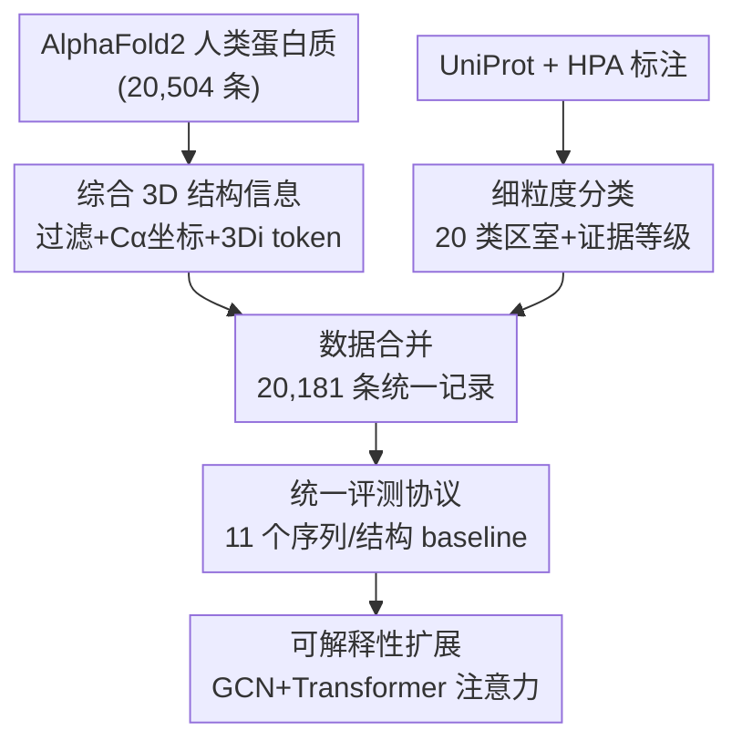

# CAPSUL: A Comprehensive Human Protein Benchmark for Subcellular Localization

**会议**: ICLR2026  
**OpenReview**: [https://openreview.net/forum?id=wJn4WbvSpK](https://openreview.net/forum?id=wJn4WbvSpK)  
**代码**: 待确认（论文称完整数据与代码在附录 Supp. L 提供）  
**领域**: 计算生物学 / 蛋白质表示学习 / 数据集与 Benchmark  
**关键词**: 亚细胞定位、蛋白质 3D 结构、AlphaFold2、细粒度标注、结构-based 模型

## 一句话总结
CAPSUL 构建了首个同时带有蛋白质 3D 结构信息和 20 类细粒度亚细胞定位标注的人类蛋白质 benchmark（20,181 条蛋白质），把 11 个序列/结构 baseline 拉到同一套评测里，证明引入 3D 结构对亚细胞定位预测是必要的，并通过注意力可视化在高尔基体上发现了 α-螺旋这一可与实验吻合的决定性定位模式。

## 研究背景与动机
**领域现状**：判断一个蛋白质会被定位到细胞里的哪个区室（细胞核、线粒体、高尔基体等），是药物靶点识别和功能注释的基础任务。近年来数据驱动的 AI 方法成了主流——给定蛋白质，预测它是否会定位到某个亚细胞区室，能大幅省下传统湿实验的时间和成本。

**现有痛点**：但这个领域几乎只有一个被广泛接受的数据集 DeepLoc，它只提供氨基酸**序列**信息，于是催生出来的全是「纯序列」模型——只看一维氨基酸序列来推断定位。问题是，生物学上早已知道亚细胞定位和蛋白质的**空间构象**密切相关：比如转录因子 NF-κB 的核定位信号只有在特定 3D 构象下才会暴露。纯序列模型抓不住这层信息。

**核心矛盾**：一边是结构-based 蛋白质表示模型（受益于 AlphaFold2 能给海量蛋白质算出可靠结构）在蛋白质分类、生成等任务上已经展现出强大能力；另一边是亚细胞定位这个明明依赖结构的任务，却**没有任何数据集提供 3D 结构输入**，结构模型根本进不了场。DeepLoc 还有第二个毛病：用粗粒度的区室划分（比如核膜和核仁都笼统归进「细胞核」），抹掉了不同细胞器各自的定位机制，导致可解释性差、发现不了真正的生物规律。

**本文目标**：造一个能让结构-based 方法跑起来、又能挖出更具体生物规律的人类蛋白质亚细胞定位数据集，需要同时满足两点——① 全面的 3D 结构信息；② 细粒度的定位分类。

**切入角度**：用 AlphaFold2 拿到每条蛋白质的 3D 坐标、用 FoldSeek 把结构离散成 3Di token，再把 UniProt 和 HPA 两个权威数据库的定位标注交叉比对、由领域专家校验，把区室细化到 20 类。

**核心 idea**：与其再发明一个新模型，不如先补上「带 3D 结构 + 细粒度标注 + 实验证据等级」的统一 benchmark，让结构-based 方法第一次能在亚细胞定位上被公平评测，并顺手用注意力机制把模型学到的结构模式翻译成可被生物学验证的解释。

## 方法详解

### 整体框架
CAPSUL 本质是一条「数据构建 + 评测协议」的流水线，而不是一个新模型。数据构建分三步（论文 Figure 1）：**第一步**从 AlphaFold2 数据库取所有人类蛋白质的预测结构，做质量过滤，抽出 Cα 坐标并用 FoldSeek 转成 3Di 结构 token；**第二步**从 UniProt 和 HPA 收集对应的细粒度定位标注，聚合成 20 个区室类别，并打上实验证据等级；**第三步**把结构数据和标注按蛋白质 ID 合并，每条记录含蛋白质 ID、定位标注、氨基酸序列、序列长度、3Di token、Cα 坐标等。最终得到 20,181 条高质量蛋白质，按 70%:15%:15% 划分训练/验证/测试。

数据集落地后，论文在上面搭了一套评测：把序列-based 与结构-based 共 11 个代表模型统一接到「编码器 + 定位分类器」的下游头上，用 Precision / Recall / F1（含 micro / macro 平均）做多标签评测，并额外探索 reweighting、单标签分类两条缓解类别不均衡的训练策略，以及一个把 Transformer 注入 GCN 来增强可解释性的扩展。

### 关键设计

**1. 综合 3D 结构信息：让结构模型第一次有得吃**

这一步直接针对「现有数据集没有 3D 输入、结构模型进不来」的痛点。作者先从 AlphaFold2 数据库取 20,504 条人类蛋白质预测结构，只保留 UniProt 中标为 active 的蛋白质（20,401 条），再剔除 AlphaFold2 用滑窗策略拼接长序列时可能产生坐标不一致的「碎片化预测」蛋白质，得到 20,181 条高一致性结构。对每条蛋白质，保留完整 PDB 文件，抽取主链 Cα 原子坐标作为结构理解的核心成分，并用 FoldSeek 把每个残基的 3D 局部结构离散成紧凑的 3Di 结构 token。这样一条蛋白质同时带有序列、Cα 坐标、3Di token 三种表示，既能喂给图卷积这类需要原子/残基级坐标的结构模型，又能用 token 形式做低开销建模——而这正是 DeepLoc 完全缺失的输入。

**2. 细粒度区室分类 + 实验证据分级：把「能不能信」也标进去**

DeepLoc 的粗粒度十分类把不同细胞器混在一起，抹掉了各自的定位机制。CAPSUL 借鉴 DeepLoc 和 HPA 的方案、对照权威细胞生物学教材并经领域专家核验，把区室细化到 20 个聚合类别（细胞核、核膜、核仁、核质、胞质、胞浆、细胞骨架、中心体、线粒体、内质网、高尔基体、细胞膜、内体、脂滴、溶酶体/液泡、过氧化物酶体、囊泡、初级纤毛、分泌蛋白、精子），并把不同数据库里五花八门的术语对齐到这 20 类。更关键的是它给每条标注打了**实验证据等级**：UniProt 中带 ECO:0000269 实验证据的标为 1、其它证据形式标为 2、无证据标为 0；HPA 因主要来自免疫荧光/共聚焦实验，有标注的一律标 1。合并两库时优先采信带实验证据的标注。统计上每条蛋白质平均 2.51 个标注、最多 14 个，且 85.7% 的标注有实验证据支撑。这套分级让研究者能按对标签可靠性的不同需求灵活取用，而不是被迫吞下噪声标签。

**3. 统一评测协议：把 11 个序列/结构 baseline 拉到同一把尺子下**

光有数据还不够，得有公平的对比基线。作者把模型统一拆成「编码器 + 定位分类器」：序列侧对蛋白质序列 $S=(s_1,\dots,s_n)$ 过序列编码器得到逐残基嵌入 $H=f_{seq}(S)$，再做 mean pooling 得全局表示 $\bar h=\frac{1}{n}\sum_{i=1}^{n} h_i$，最后接 MLP 分类器 $\hat y=\phi(\bar h)$ 输出多标签向量；结构侧把蛋白质建成图 $G=(V,E)$（节点是残基、用 Cα 位置，边按空间或序列邻接定义），过图编码器再全局池化得到 $\bar h$，同样接分类器。优化统一用二元交叉熵 $L_{BCE}=-\frac{1}{m}\sum_{i=1}^{m}[y_i\log(\hat y_i)+(1-y_i)\log(1-\hat y_i)]$。在这套协议下评测了序列侧的 DeepLoc 2.1、ESM-2 650M、ESM-C 600M（含微调/随机初始化变体），结构侧的 CDConv、GearNet-Edge、FoldSeek，以及扩展的 Graph Transformer、Graph Mamba、Graph Diffusion、CDConv+对比损失、ESM-C+CDConv 融合等。这种「同一下游头、同一损失、同一划分」的设计保证了序列与结构方法之间的对比是干净可比的。

**4. GCN 注入 Transformer 的可解释性扩展：把模型学到的结构翻译成生物规律**

benchmark 的终极价值是能不能帮人发现新生物学。作者在 GCN-based 结构模型上额外接一个 Transformer 编码器（把原本的 MLP 头替换成 Transformer 层），利用注意力权重定位「模型认为最决定定位的残基」。在高尔基体预测这个 precision 高达 100% 的案例上，作者可视化注意力得分最高的 20 个残基，发现模型在三条序列差异很大的蛋白质（MFNG 第 8–27 残基、B3GALT2 第 24–45 残基、GIMAP1 C 端第 273–292 残基）上都一致聚焦到相似的 **α-螺旋跨膜结构域**（长 20–30 个氨基酸、拓扑朝向一致）。这一发现与已有湿实验证据高度吻合——跨膜域的拓扑构象确实能通过调节电势梯度和脂膜锚定效率影响高尔基定位。换句话说，模型在序列高度发散的情况下仍能跨样本抓住同一种结构模式，benchmark 因此具备了「数据驱动发现细胞生物学规律」的潜力。

### 损失函数 / 训练策略
主评测用 BCE 多标签损失。为缓解每个区室正样本远少于负样本的类别不均衡，论文额外探索两条策略：① **Reweighting**——逆频率 $w_c=\frac{1}{f_c}$、对数逆频率 $w_c=\frac{1}{\log(1+f_c)}$、以及 Focal loss $L_c=-w_c\sum_i[y_{ic}(1-\hat y_{ic})^\gamma\log(\hat y_{ic})+(1-y_{ic})\hat y_{ic}^\gamma\log(1-\hat y_{ic})]$（$f_c$ 是类 $c$ 正样本频率，$\gamma$ 是聚焦参数）；② **单标签分类**——对每个区室单独训一个二分类器，专门用于至少一个模型 F1 低于 0.1 的稀有类，以避免多目标优化之间的冲突。

## 实验关键数据

### 主实验
统一评测下，序列侧的预训练 ESM-C 600M 整体最强，结构侧 CDConv 在结构模型里最好。下表为各方法的总体平均指标（节选）：

| 方法 | 类型 | Micro F1 | Macro F1 | Micro Precision | Micro Recall |
|------|------|----------|----------|------|------|
| ESM-2 650M（微调） | 序列 | 0.375 | 0.150 | 0.647 | 0.264 |
| **ESM-C 600M（微调）** | 序列 | **0.495** | 0.263 | 0.690 | 0.386 |
| ESM-C 600M（随机初始化） | 序列 | 0.338 | 0.135 | 0.598 | 0.236 |
| FoldSeek | 结构 | 0.248 | 0.092 | 0.605 | 0.156 |
| CDConv（+Transformer 头） | 结构 | 0.452 | 0.226 | 0.632 | 0.352 |
| GearNet-Edge（+Transformer 头） | 结构 | 0.417 | 0.235 | 0.546 | 0.337 |
| ESM-C+CDConv 后融合 | 融合 | 0.476 | 0.235 | 0.634 | 0.381 |

几条核心观察：① 大规模预训练对序列模型至关重要——ESM-C > ESM-2，且去掉预训练的 ESM-C 600M₀ 大幅掉点；DeepLoc 因预训练时用粗粒度分类，表现明显偏弱，反向印证了细粒度标注的必要性。② 3D 结构是决定性的——CDConv、GearNet-Edge 在多数情况下都超过无预训练的 ESM-C₀，融合模型在多个区室上拿到全场最佳。

### 消融实验
把结构模型的 Cα 坐标替换成从蛋白质空间范围内**随机采样**的坐标，性能显著崩塌，直接证明「是真实结构在起作用」而非别的捷径：

| 配置 | Micro F1 | Micro Precision | Micro Recall |
|------|----------|------|------|
| CDConv（随机 Cα 坐标） | 0.329 | 0.586 | 0.229 |
| **CDConv（真实坐标）** | **0.452** | 0.632 | 0.352 |
| GearNet-Edge（随机 Cα 坐标） | 0.348 | 0.450 | 0.283 |
| **GearNet-Edge（真实坐标）** | **0.417** | 0.546 | 0.337 |

### 关键发现
- **结构信息是决定性的**：随机化 Cα 坐标后 CDConv 的 Micro F1 从 0.452 掉到 0.329、GearNet-Edge 从 0.417 掉到 0.348，说明模型确实在用空间几何而非投机。
- **类别不均衡是主瓶颈**：样本多的区室（如细胞核、分泌蛋白）F1 高，样本极少的（如脂滴、过氧化物酶体）经常一个都预测不对；reweighting 让 CDConv/GearNet-Edge 的 macro F1 显著提升（如 GearNet-Edge macro F1 0.235→0.304），单标签分类对此前欠拟合的稀有类也有明显改善，尤其 GearNet-Edge。
- **结构模型擅长捕捉非平凡模式**：Graph Mamba、GearNet-Edge 在部分小样本类上反而比序列模型好，作者归因于它们的关系型消息传递能建模残基间不同的空间交互。
- **对比学习 + 融合有潜力**：给 CDConv 加对比损失后内体、初级纤毛、高尔基体等少数类 F1 提升；ESM-C+CDConv 融合虽平均略逊纯 ESM-C，却在多个区室上拿到全场最佳，说明把结构信息注入序列语言模型值得继续做。

## 亮点与洞察
- **把「证据等级」也做成数据集一等公民**：大多数蛋白质数据集只给标签，CAPSUL 给每条定位标注打了 0/1/2 三级实验证据，让下游研究能按可靠性需求取用——这是数据集质量意识上的一个可复用范式。
- **用注意力把黑盒翻译成可验证的生物结论**：在高尔基体案例里，模型跨三条序列发散的蛋白质一致锁定 α-螺旋跨膜域，且与既有湿实验吻合。这把「模型性能好」升级成了「模型发现的规律可被生物学验证」，是 benchmark 真正想推动的事。
- **随机化坐标这个消融极其干净**：直接把真实结构换成随机坐标，一刀切证明结构有用，避免了「会不会只是参数多了」之类的混淆，方法论上很值得借鉴到其它「结构是否有用」的论证里。
- **统一下游头的评测设计**：把序列和结构方法都压到「编码器 + 同一分类器 + 同一 BCE」，让跨范式比较第一次干净可比，这个协议本身可以迁移到其它蛋白质下游任务。

## 局限与展望
- **整体绝对性能仍偏低**：最强模型 Micro F1 也才 0.495、Macro F1 0.263，稀有类（脂滴、过氧化物酶体等正样本占比 0.5%–3%）经常零命中，说明任务远未解决，benchmark 更多是「打开了门」而非「给了答案」。
- **结构模型未能反超序列模型**：尽管证明了 3D 结构有用，结构-based 方法整体仍略逊于预训练 ESM-C，作者把结构信息真正用好（如对齐/解耦序列、Cα、3Di 三种维度）列为未来方向。
- **依赖 AlphaFold2 预测结构**：3D 信息来自预测而非实验测定，碎片化预测虽已过滤，但预测误差对下游的影响未深入量化。
- **作者点出的展望**：① 跨序列/Cα/3Di 多维表示的对齐或解耦；② 在 CAPSUL 上做 3D 结构与亚细胞定位之间的因果发现，把模型规律直接对接到生物学原理。

## 相关工作与启发
- **vs DeepLoc / setHARD**：这俩是亚细胞定位的既有数据集，但都只有序列、用粗粒度分类、不带实验证据标注。CAPSUL 同时补齐结构信息、20 类细粒度分类、实验证据分级三块（论文 Table 1），让结构模型第一次能进场评测。
- **vs PEER 等蛋白质 benchmark 框架**：PEER 在 DeepLoc 数据上建过评测，但因缺 3D 结构无法评测结构模型；CAPSUL 把数据重组并补上结构，定位为「结构-based 方法的亚细胞定位评测平台」。
- **vs 纯序列蛋白质语言模型（ESM-2 / ESM-C）**：本文不否定序列模型（ESM-C 仍是最强单模型），而是论证「序列之外，结构能补上序列抓不到的空间构象信号」，并给出融合两者的初步证据。
- **启发**：「先补 benchmark、把所有范式拉到同一把尺子，再用可解释性把模型规律翻译回领域知识」这条路径，对任何「某种新输入模态是否有用、却没有公平评测平台」的领域都通用。

## 评分
- 新颖性: ⭐⭐⭐⭐ 首个带 3D 结构 + 细粒度 + 证据分级的亚细胞定位 benchmark，填了实打实的空白；模型层面主要是已有方法的迁移。
- 实验充分度: ⭐⭐⭐⭐⭐ 11 个 baseline、随机坐标消融、reweighting/单标签两套缓解策略、外加高尔基体可解释性案例，覆盖很全。
- 写作质量: ⭐⭐⭐⭐ 动机—数据构建—评测—解释的链条清晰，表格信息密度高；细粒度类别和缩写较多，初读略需对照。
- 价值: ⭐⭐⭐⭐⭐ 给一个长期缺数据集的任务提供了高质量统一评测平台，并示范了用注意力发现可验证生物规律，对社区拉动明显。

<!-- RELATED:START -->

## 相关论文

- [\[ICLR 2026\] GeomMotif: A Benchmark for Arbitrary Geometric Preservation in Protein Generation](geommotif_a_benchmark_for_arbitrary_geometric_preservation_in_protein_generation.md)
- [\[ICLR 2026\] Optimal Transport Unlocks End-to-End Learning for Single-Molecule Localization](optimal_transport_unlocks_end-to-end_learning_for_single-molecule_localization.md)
- [\[ICLR 2026\] 3DCS: Datasets and Benchmark for Evaluating Conformational Sensitivity in Molecular Representations](3dcs_datasets_and_benchmark_for_evaluating_conformational_sensitivity_in_molecul.md)
- [\[ICLR 2026\] The Human Brain as a Dynamic Mixture of Expert Models in Video Understanding](the_human_brain_as_a_dynamic_mixture_of_expert_models_in_video_understanding.md)
- [\[ICML 2026\] TadA-Bench: A Million-Variant Benchmark for Future-Round Discovery Toward Agentic Protein Engineering](../../ICML2026/computational_biology/tada-bench_a_million-variant_benchmark_for_future-round_discovery_toward_agentic.md)

<!-- RELATED:END -->
