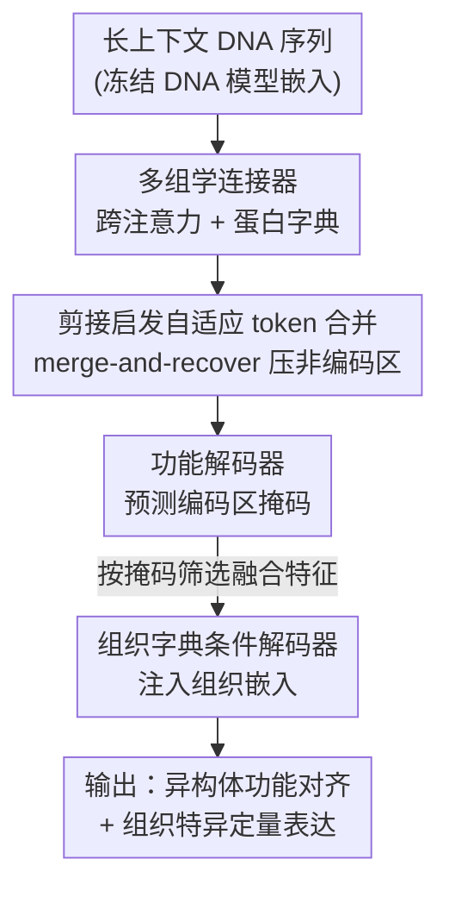

# CDBridge: A Cross-omics Post-training Bridge Strategy for Context-aware Biological Modeling

**会议**: ICLR2026  
**OpenReview**: [https://openreview.net/forum?id=Hk4Fb6kaYF](https://openreview.net/forum?id=Hk4Fb6kaYF)  
**代码**: 待确认  
**领域**: 计算生物学 / 跨组学建模  
**关键词**: 中心法则、跨组学桥接、后训练、组织感知表达预测、自适应 token 合并

## 一句话总结
CDBridge 提出一种"后训练桥接"策略，把已经预训练好的冻结 DNA 模型和蛋白质模型在不重新训练的前提下拼到一起，通过"剪接启发的自适应 token 合并 + 组织条件解码器"两阶段对齐，首次让模型既能做 DNA→蛋白的定性功能对齐、又能在不同组织语境下做定量基因表达预测。

## 研究背景与动机
**领域现状**：把基因组 DNA 序列映射到"具体语境下的定量表达"是计算生物学的核心问题。目前有两类模型各管一摊：一类是单细胞基础模型（scGPT、scFoundation、GeneCompass），它们能捕捉组织/细胞语境，但工作在基因 ID 层面，完全看不到驱动表达的底层 DNA 序列；另一类是序列到表达的专家模型（Enformer、AlphaGenome、Isoformer），它们吃 DNA，但要么在预先裁剪好的片段上工作，要么对同一基因的多个异构体（isoform）做平均，把动态的剪接信息抹平了。

**现有痛点**：现有跨组学模型（CD-GPT、LucaOne 等）虽然能统一 DNA/RNA/蛋白的表示，但大多只做定性任务（功能迁移、序列分类），忽略了两个关键生物机制——**可变剪接**（一个基因产生多个蛋白）和**异构体复用**；而且它们普遍无视"同一段 DNA 在不同组织里表达量天差地别"这件事。结果就是：定量表达——这个最终决定表型的量——基本没人认真解决。

**核心矛盾**：作者把这个 gap 拆成两个具体障碍：（1）**序列长度严重失配**——一个基因常常横跨几十万碱基（DNA token ∼$10^4$），而它编码的蛋白只有几百个氨基酸（∼$10^2$）；（2）**语境映射的歧义性**——可变剪接和异构体复用让 DNA 到蛋白天生是"一对多"关系，同一段序列在不同组织里走不同的剪接路径。

**本文目标**：在不做昂贵的端到端多组学重训练的前提下，把"全长 DNA 序列"映射到"组织感知的定量表达"，同时兼顾定性（功能对齐）和定量（表达回归）。

**切入角度**：既然单组学的 DNA 模型和蛋白模型都已经很强，何必从头训一个统一大模型？作者借用多模态 AI 里"轻量 connector 桥接冻结编码器"的思路（类似 CLIP / BLIP 的连接器），把它搬到生物领域——但要解决生物特有的极端长度差和一对多映射。

**核心 idea**：用一个"后训练桥接"框架，冻结 DNA 和蛋白基础模型，只训练中间的连接器与解码器；用**模仿剪接的自适应 token 合并**压掉无信息的非编码区来解决长度失配，用**组织字典条件解码器**注入组织语境来解决表达的环境依赖。

## 方法详解

### 整体框架
CDBridge 是一个建立在**冻结**的 DNA 基础模型（如 Evo）和蛋白基础模型之上的两阶段后训练框架，全程把 RNA 当作隐式的生物中介，遵循"中心法则"（DNA→RNA→蛋白→表达）的约束来对齐跨模态表示。

输入是带长上下文的原始 DNA 序列，输出是两类结果：（1）每个 token 的功能区掩码（哪些区域编码蛋白），以及（2）在给定组织条件下、目标蛋白的定量表达水平。中间分两阶段走：

- **Stage 1（序列语境学习）**：用一个跨注意力的多组学连接器，把全长 DNA 嵌入投影到"功能上有意义的蛋白空间"，并用剪接启发的自适应 token 合并把长序列压短、突出编码区，最后由功能解码器预测功能掩码。
- **Stage 2（环境语境学习）**：拿 Stage 1 选出来的融合特征，用一个组织字典做条件，由条件解码器在特定组织语境下预测异构体级的蛋白表达量。

为了评估这个新设定，作者还配套构建了 **GTEx-Benchmark**，逼模型去解长程外显子依赖、异构体复用和组织特异表达。

### 关键设计

**1. 多组学连接器：用蛋白字典 + 跨注意力把 DNA 嵌入"翻译"进蛋白空间**

Stage 1 要解决两个障碍：DNA（∼$10^4$ token）和蛋白（∼$10^2$ token）的长度失配，以及两种模态预训练目标不同造成的语义鸿沟（DNA 嵌入捕捉全基因组上下文，蛋白嵌入聚焦局部编码区的功能氨基酸链）。作者的做法是设计一个序列语境感知的跨组学连接器，把 DNA 嵌入空间投影到蛋白空间。设 DNA 嵌入为 $X_{\text{DNA}} \in \mathbb{R}^{L \times d}$，再引入一个可学习的蛋白 token 字典 $T_{\text{prot}} \in \mathbb{R}^{M \times d}$（用训练集蛋白嵌入做 k-means 聚类来初始化）。这些字典 token 当作 key/value，DNA 嵌入当 query 做跨注意力：

$$\text{Attn}(X_{\text{DNA}}, T_{\text{prot}}, T_{\text{prot}}) = \text{softmax}\!\left(\frac{X_{\text{DNA}} T_{\text{prot}}^{\top}}{\sqrt{d}}\right) T_{\text{prot}}.$$

字典 token 充当"蛋白原型"，DNA 的每个位置去这些原型里检索它最该对应的功能语义。相比直接拿 DNA 嵌入硬怼蛋白嵌入（Figure 2(a) 显示对不齐），甚至比人工裁剪 cDNA 再对齐（Figure 2(b) 仍有表示鸿沟）都更好——因为字典是从真实蛋白嵌入聚类来的，给了对齐一个有生物意义的锚点。

**2. 剪接启发的自适应 token 合并：merge-and-recover 把算力集中到编码区**

长 DNA 里功能信号是稀疏且局部的（外显子编码、内含子不编码），直接全序列计算既贵又被噪声淹没。作者基于 ToMe 设计了一个模仿"转录剪接"的 token 压缩策略：把 DNA token 索引随机分成不相交的两组 $A$、$B$，对每个 $i \in A$ 在 $B$ 里找余弦相似度最高的伙伴 $j^*(i) = \arg\max_{j \in B} \frac{\langle x_i, x_j\rangle}{\|x_i\|\cdot\|x_j\|}$，若相似度超过阈值 $\tau$ 就合并这一对，直接取平均 $\tilde{x}_i = \frac{1}{2}(x_i + x_{j^*(i)})$，保留 $i$ 丢掉 $j^*(i)$。阈值 $\tau$ 由合并率决定，而合并率在训练时对每个输入从高斯分布里随机采样，相当于随机化的压缩强度。

关键在于"可恢复"：作者维护一个映射 $\pi$ 记录每个 token 是存活还是被合并进了谁，在 unmerge 阶段把被丢掉的 token 用它存活伙伴的嵌入填回去，恢复成等长序列 $\hat{X}_{\text{DNA}}$，再交给一个轻量 Transformer 解码器预测功能区。作者把这套 merge-and-recover 解读为 MAE 的一个变体——但和标准 MAE 随机遮挡不同，这里的"遮挡"是按 token 间相似度**自适应选择**的，因此是显著性感知的、保留位置对齐的、且支持 token 级监督，特别适合"功能信号稀疏且局部"的基因组序列。一个很漂亮的副产物（Figure 5）：在 loss 里完全没给外显子掩码的情况下，模型自发地保留编码区 token、积极合并非编码区 token，说明它真的学会了把算力分配到生物显著区。

**3. 组织字典条件解码器：把"同序列不同表达"的环境依赖建进来**

Stage 1 只管 DNA↔蛋白的结构对齐，但同一段 DNA 在脑、心、肾里表达量完全不同——这是 Stage 2 要解决的。作者用单细胞基础模型（scGPT）构建一个组织字典 $T_{\text{Envir}} \in \mathbb{R}^{C \times M \times d}$（$C$ 个组织类型、每个组织 $M$ 个 cell token）：把 bulk RNA 表达数据过单细胞模型再池化成全局嵌入，每个组织得到一个表征其细胞状态的向量 $t_c$。条件解码器是个 Transformer，拿组织向量当 query、对 Stage 1 压缩后的 DNA 表示 $\tilde{X}_{\text{DNA}}$ 做跨注意力，输出 $M$ 个 token：$\{\hat{p}_m\}_{m=1}^{M} \sim p(\{p_m\}_{m=1}^{M} \mid \tilde{X}_{\text{DNA}}, t_c)$。这 $M$ 个 token 同时支撑两类预测——异构体感知的蛋白嵌入（用对比损失正则）和一个标量回归（在组织条件 $c$ 下的定量表达量），从而定性对齐和定量估计一起做。

这里有个容易被质疑的点：组织嵌入会不会直接泄露目标基因的表达答案？作者特意论证组织向量是在约 19k 个基因上做均值池化得到的，不隔离目标基因或邻近基因的表达值，单个基因信号被稀释掉了；并做了控制实验——只用组织嵌入、不给 DNA 特征时 $R^2$ 掉到接近 0（Table 4），证明组织嵌入只是条件信号、不是独立的预测特征。相比把细胞当无序基因集合的传统表达模型，这个解码器保留了基因级上下文和序列语义，同时建模组织依赖效应。

**4. GTEx-Benchmark：逼模型同时解长程依赖、异构体复用和组织特异表达**

为了严格评估中心法则建模，作者基于 GTEx v8 和 Ensembl 构建了 GTEx-Benchmark，覆盖 40 个人体组织，为每个蛋白编码基因配齐 DNA 序列、蛋白序列、组织特异 RNA 表达值和蛋白功能注释。按基因 ID 做 80%/10%/10% 严格划分防泄露，并剔除超过 200k 碱基的超长基因（仅约 2% 长尾）。和 Enformer/Isoformer 这类基准不同，它强迫模型跨巨大基因组距离识别关键外显子、管理多异构体间的外显子复用、预测组织特异表达，支持组织条件表达预测、编码区分割、异构体检索三类任务，是一个更贴近真实生物的评测设定。

### 损失函数 / 训练策略
两阶段训练：Stage 1 用功能解码器对 token 级功能掩码做监督（merge-and-recover 后预测哪些 token 属于编码区）；Stage 2 是双目标——异构体蛋白嵌入用对比损失正则做定性对齐，标量回归头估计组织条件下的定量表达。DNA 和蛋白主干全程冻结，只训连接器、token 字典、组织字典和两个解码器，因此是"后训练桥接"而非全量重训。

## 实验关键数据

### 主实验：组织感知的基因表达预测
在 GTEx 五个组织上做异构体级表达预测，指标为 $R^2$ 和 Spearman 相关。CDBridge 整体显著优于序列-only 基线和不带组织条件的专家模型：

| 模型 | 类型 | 平均 $R^2$ | 平均 Spearman |
|------|------|-----------|---------------|
| DNABERT-2 | 序列-only | -0.004 | 0.317 |
| Evo2-7B | 序列-only | 0.021 | 0.324 |
| LucaOne | 序列-only(多组学) | 0.001 | 0.309 |
| Enformer | 专家表达 | 0.127 | 0.122 |
| AlphaGenome | 专家表达 | 0.248 | 0.438 |
| Isoformer (w/o TSS Align.) | 专家表达 | -0.315 | 0.309 |
| **CDBridge (Ours)** | 跨组学桥接 | **0.387** | **0.618** |

> 说明：Isoformer 官方版（$R^2$=0.530, Spearman=0.720）依赖 TSS 对齐的数据设定，和本文"未对齐 + 长序列"协议不可直接比较；在去掉 TSS 对齐的同等设定下 Isoformer 反而崩到 $R^2$=-0.315。CDBridge 的 Spearman（0.618）在所有可比方法里最高，说明它对表达量的排序关系把握最稳。

更关键的是零样本泛化（Figure 4）：用 leave-tissue-out 协议（训 90% 组织、测 10% 完全没见过的组织类型），CDBridge 在未见组织上的表现和已见组织接近，而 Enformer/Isoformer 因为用固定维度输出头，结构上根本无法在不重训新头的情况下做未见组织预测。

### 跨组学下游任务
三个任务（编码区分割、异构体检索、中心法则关联）上 CDBridge 全面领先：

| 模型 | 分割 AUC↑ | 分割 F1↑ | 异构体检索 MRR↑ | 中心法则 AUC↑ |
|------|----------|---------|----------------|--------------|
| DNABERT-2 | 0.612 | 0.382 | 0.227 | 0.598 |
| Evo2 | 0.848 | 0.597 | 0.278 | 0.725 |
| LucaOne | 0.859 | 0.613 | 0.354 | 0.767 |
| **CDBridge** | **0.993** | **0.635** | **0.436** | **0.792** |

### 消融实验
逐组件拆解（Table 4），$\Delta$ 为相对无组件基线的提升：

| 配置 | 分割 AUC | 分割 F1 | 表达 $R^2$ | 表达 Spear |
|------|---------|---------|-----------|-----------|
| 全去掉 Stage 1（≈Evo2 基线） | 0.848 | 0.600 | 0.021 | 0.324 |
| + ToMe Attn. | 0.882 | 0.601 | 0.205 | 0.457 |
| + 固定蛋白聚类 | 0.990 | 0.602 | 0.212 | 0.483 |
| + 可学习蛋白聚类 | 0.993 | 0.635 | 0.215 | 0.483 |
| 只用组织嵌入（无 DNA） | – | – | 0.020 | 0.128 |
| **全开（+组织聚类）** | **0.993** | **0.635** | **0.387** | **0.618** |

### 关键发现
- **组织条件是定量表达的命门**：去掉组织条件后 $R^2$ 仅 0.215，加上组织聚类直接跳到 0.387，提升幅度（+0.366）远超其他组件，说明环境语境建模才是定量预测的主要增益来源。
- **"只用组织嵌入"控制实验**：$R^2$ 掉到 0.020、Spearman 0.128，几乎等于瞎猜，反证组织嵌入没有泄露答案、只起条件作用——这个对照很重要，否则组织感知的高分会被怀疑是信息泄露。
- **可解释性是免费午餐**：token 合并在没有任何外显子监督的情况下自发对齐到编码区（Figure 5），不同组织下激活的异构体 token 也随组织类型漂移（Figure 6），说明模型学到的是真实生物调控模式而非过拟合。

## 亮点与洞察
- **"后训练桥接"范式很省**：不重训 DNA/蛋白大模型，只训中间连接器和解码器，就拿到跨组学 + 组织感知能力。这条"冻结单组学骨干 + 轻量连接器"的路线，把多模态 AI 的成熟经验干净地移植到了生物领域，可复用性强。
- **把 ToMe 重新诠释成"剪接"**：自适应 token 合并本来是视觉里加速 ViT 的 trick，作者发现"合并非信息 token"和"内含子被剪掉、外显子保留"在生物学上同构，于是它不仅压缩长度，还自带可解释性——loss 里没给外显子掩码却自己学会保留外显子，这是最让人"啊哈"的地方。
- **蛋白字典 / 组织字典当锚点**：用 k-means 聚类的原型字典做跨注意力的 key/value，给跨模态对齐一个有生物意义的离散锚，比直接嵌入对嵌入更稳——这个"字典做桥"的思路可以迁移到任何两个语义空间差异大的模态对齐任务。
- **配套基准补位**：现有基准要么裁好片段、要么对异构体取平均，CDBridge 顺手造了 GTEx-Benchmark 把长程依赖、异构体复用、组织特异性一起逼出来，让"组织感知中心法则建模"这个设定有了可比的评测。

## 局限与展望
- **超长基因被排除**：剔除了 >200k 碱基的基因（约 2%），这些长尾基因往往恰恰是调控最复杂的，目前框架对它们没有覆盖。
- **绝对 $R^2$ 仍不高**：平均 $R^2$=0.387，离"可靠定量预测"还有距离；且与 Isoformer 官方版因协议不同不可直接比，横向比较需谨慎。
- **依赖外部预训练骨干**：性能受限于冻结的 DNA/蛋白基础模型质量，骨干没编码进去的信号桥接也补不回来；组织字典也依赖单细胞模型（scGPT）的表征质量。
- **可改进方向**：把合并率从随机采样改成可学习的、按基因结构自适应；引入显式剪接位点先验进一步提升异构体检索；探索把超长基因用分块 + 层次合并纳入框架。

## 相关工作与启发
- **vs 单组学序列模型（DNABERT-2 / Evo2 / NTv2）**：它们只建模 DNA 序列，缺蛋白信息和组织条件，定量表达预测几乎为 0；CDBridge 通过跨组学连接器和组织解码器补上这两块。
- **vs 多组学基础模型（LucaOne / GENA-LM / CD-GPT）**：它们要端到端多组学预训练、且多偏定性任务、忽略剪接和环境语境；CDBridge 走"后训练桥接"避开昂贵重训，还保留单组学骨干的模块化灵活性，并显式建模组织依赖。
- **vs 专家表达模型（Enformer / AlphaGenome / Isoformer）**：它们用固定维度输出头，结构上无法零样本泛化到未见组织，且常对异构体取平均；CDBridge 用组织字典条件化，支持 leave-tissue-out 的零样本未见组织预测。
- **vs 通用多模态连接器（CLIP / Flamingo / BLIP）**：思路同源（轻量桥接冻结编码器），但生物领域有极端长度差和一对多剪接映射，CDBridge 用剪接启发的 token 合并和蛋白字典专门应对这些生物特有挑战。

## 评分
- 新颖性: ⭐⭐⭐⭐⭐ 首次把"后训练桥接 + 剪接启发 token 合并 + 组织条件解码"组合起来做组织感知的中心法则定量建模，范式清晰。
- 实验充分度: ⭐⭐⭐⭐ 主实验 + 三个下游任务 + 细致消融 + 信息泄露控制实验齐全，但绝对 $R^2$ 偏低、超长基因被排除。
- 写作质量: ⭐⭐⭐⭐ Table 1 能力矩阵和两阶段图把定位讲得很清楚，可解释性可视化有说服力。
- 价值: ⭐⭐⭐⭐⭐ 给"DNA→组织特异定量表达"这个长期难题提供了可扩展且生物可信的方案，并配套了 GTEx-Benchmark，对计算生物学社区有实用价值。

<!-- RELATED:START -->

## 相关论文

- [\[ICML 2026\] STRIDE: Post-Training LLMs to Reason and Refine Bio-Sequences via Edit Trajectories](../../ICML2026/computational_biology/stride_post-training_llms_to_reason_and_refine_bio-sequences_via_edit_trajectori.md)
- [\[AAAI 2026\] MergeDNA: Context-aware Genome Modeling with Dynamic Tokenization through Token Merging](../../AAAI2026/computational_biology/mergedna_context-aware_genome_modeling_with_dynamic_tokenization_through_token_m.md)
- [\[ICLR 2026\] AntigenLM: Structure-Aware DNA Language Modeling for Influenza](antigenlm_structure-aware_dna_language_modeling_for_influenza.md)
- [\[ICLR 2026\] CP-Agent: Context-Aware Multimodal Reasoning for Cellular Morphological Profiling under Chemical Perturbations](cp-agent_contextaware_multimodal_reasoning_for_cellular_morphological_profiling_.md)
- [\[ICLR 2026\] Controllable Diffusion-based Generation for Multi-channel Biological Data](controllable_diffusion-based_generation_for_multi-channel_biological_data.md)

<!-- RELATED:END -->
