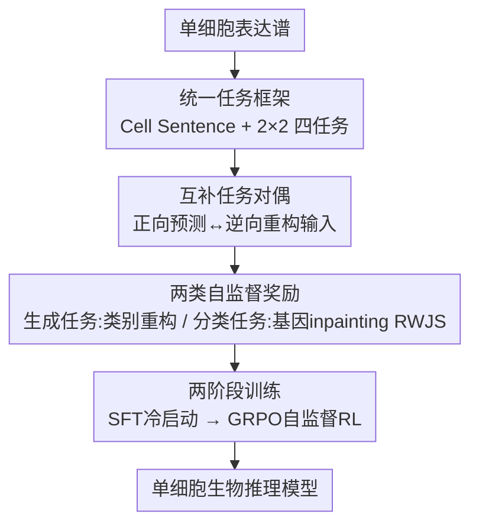

# CellDuality: Unlocking Biological Reasoning in LLMs with Self-Supervised RLVR

**会议**: ICLR2026  
**OpenReview**: [https://openreview.net/forum?id=I4meJN28Ol](https://openreview.net/forum?id=I4meJN28Ol)  
**代码**: 待确认  
**领域**: LLM推理 / 计算生物学 / 自监督强化学习  
**关键词**: 单细胞推理, RLVR, 任务对偶, 自监督奖励, GRPO

## 一句话总结
CellDuality 把单细胞生物学的四类推理任务组织成一个统一框架，再用"互补任务对偶"——让模型正向预测一个生物结果、再逆向从结果重构出原始输入条件，用重构保真度当内在奖励——在完全没有 ground-truth 标签的情况下做 RLVR 对齐，使一个 3B 的 LLaMA 在细胞类型注释、药敏分类、扰动响应生成等任务上达到 SOTA，并在 OOD 扰动预测上把与"有监督 RLVR oracle"的差距缩小了 35–56%。

## 研究背景与动机
**领域现状**：用 LLM 做"生物推理"是计算生物学的核心目标——希望模型不只是预测，而能从细胞数据里推断出机制性的因果链（如某个细胞为什么对某种药敏感）。现有的单细胞基础模型（scGPT、Geneformer、C2S-Scale 等）已经能把转录组数据学成不错的表示。

**现有痛点**：作者把现状归纳成三条短板。其一，绝大多数模型是为**预测**优化的，擅长学相关性模式（细胞类型注释、药敏分类），却没被显式训练去产出连贯的、解释性的推理步骤。其二，少数"会推理"的模型停留在**逻辑约束**范式里，比如 Cell-o1 把推理建模成一个演绎式解谜，而不是科学探索那种开放式、假设驱动的追问。其三，**深度与通用性之间存在 trade-off**：专才模型在单一任务上推理很深，而 InstructCell 这类多任务通才又缺乏同等的机制洞察。

**核心矛盾**：一个本来很有希望的方向是 RLVR（Reinforcement Learning from Verifiable Rewards），它在数学、代码这类领域已被证明能大幅提升推理。但它在生物学里几乎用不了——**大多数生物结果是不可验证的**。比如条件细胞生成出来的一段基因序列，对一个给定细胞类型根本没有唯一正确答案，没法用确定性 verifier 打分。验证信号的缺失，从根上卡死了在开放式因果场景上训练统一模型的可能。

**本文目标**：能不能直接从这些生物问题**自身的结构**里，造出一个可靠的内在奖励信号，从而在没有外部监督的情况下做 RL？

**切入角度**：作者受 DuPO 启发，注意到很多生物推理任务天然成对——正向问"细胞 + 药 → 新细胞"，逆向就能问"新细胞 + 已知细胞 → 是什么药"。如果模型正向的预测是对的、逻辑自洽的，那么逆向应该能把原始输入重构回来。重构得越准，说明正向越可信。

**核心 idea**：用"互补任务对偶"的一致性当内在奖励——逆向重构原始输入的保真度，就是正向输出生物/逻辑一致性的直接度量，从而把 RLVR 从可验证域扩展到不可验证的生物域，整条 RL 不需要任何 ground-truth 标签。

## 方法详解

### 整体框架
CellDuality 要解决的是"在没有可验证标签的单细胞任务上做 RL 对齐"。整体转法是：先把单细胞表达谱转成排序后的"Cell Sentence"（按表达量降序取 top-K 基因的文本序列），喂进一个覆盖四类推理任务的统一框架；然后用一个少量、高质量的 CoT 数据集做 SFT 冷启动，让模型先学会生物推理的"语言和格式"；最后在大规模无标注数据上做自监督 RL（GRPO），用"互补任务对偶"产生的内在奖励把模型对齐到生物/逻辑一致。

四类任务排成一个 2×2 矩阵，横轴是任务类型（分类 / 生成），纵轴是两大生物主题（**细胞身份** Cell Identity 与 **细胞动态** Cell Dynamics）：细胞类型注释（细胞→标签）、条件细胞生成（标签→细胞）、药敏分类（细胞+药→标签）、扰动响应生成（细胞+药→新细胞）。

### 关键设计

**1. 统一任务框架：把开放式生物推理收进 Cell Sentence + 2×2 四任务**

针对"现有模型要么只会预测、要么只在单一任务上推理"的痛点，作者先用一个统一的数据结构和任务集合把问题框住。细胞 $c=\{g_1,g_2,\dots,g_K\}$ 被表示成按表达量**降序**排列的 top-K 基因序列（即 Cell Sentence），扰动 $p=\{\text{operation},\text{target}\}$（operation 取 knockdown / overexpression），细胞类型 $t$ 和药敏标签 $s$ 都是预定义集合里的类别标签；所有输入都拼成文本 prompt $x$，模型自回归产出 $y=\{z,a\}$（推理轨迹 $z$ + 最终答案 $a$）。四个任务沿"细胞身份 / 细胞动态"两个主题、"分类 / 生成"两种形式张成 2×2 矩阵，刻意覆盖了从静态身份到因果动态的范围。这一框架的价值不只是任务集合本身，更在于它让"正向 / 逆向"配对成为可能——正是后面对偶奖励的基础。

**2. 互补任务对偶：把无监督问题改写成自验证问题**

这是全文的核心。直接对四个任务做 RL 没有可扩展的奖励来源（实验拿 ground-truth 太贵太慢）。作者把单个生物问题重写成一对**互相验证**的任务：原任务 $T_p:\mathcal{X}\to\mathcal{Y}$，把输入空间拆成已知分量 $x_k$ 和未知分量 $x_u$（$\mathcal{X}=\mathcal{X}_k\cup\mathcal{X}_u$）；互补对偶任务 $T_{cd}:(y,x_k)\mapsto\hat{x}_u$，利用原任务输出 $y$ 和已知分量 $x_k$ 去重构未知分量。一对 $(T_p,T_{cd})$ 满足"互补一致性原理"当且仅当

$$\forall x\in\mathcal{X},\ y=T_p(x):\quad d\big(x_u,\,T_{cd}(y,x_k)\big)\le\epsilon,$$

其中 $d(\cdot,\cdot)$ 是领域专属的距离度量，$\epsilon\ge0$ 是容忍阈值。这一原理的威力在于把无监督问题变成自验证问题：逆向重构的保真度 $d(x_u,\hat{x}_u)$ 直接度量了正向输出 $y$ 的逻辑与生物一致性。和经典对偶学习相比，它用已知分量 $x_k$ 当上下文锚点，绕开了不可逆、不对称这两个老问题，保证逆向任务是良定义的。

**3. 两类自监督奖励：对生成任务用类别重构、对分类任务用条件基因 inpainting**

对偶原理要落地成具体奖励，作者按任务性质设计了两种。对**生成类任务**（扰动响应生成、条件细胞生成），正向产出一个高维细胞序列（$c_{post}$ 或 $c$），逆向去重构一个类别输入标签（药敏 $s$ 或细胞类型 $t$），奖励是干净的二值信号

$$r(y\mid x)=\mathbb{I}(\hat{x}_u=x_u),$$

直觉是：一个生物上合理的细胞序列，应该无歧义地编码了生成它的条件。对**分类类任务**（细胞类型注释、药敏分类），正向输出只是一个低信息量的标签，没法反过来重构出整张细胞，于是作者设计了**条件基因 inpainting**：把输入细胞序列人为拆成可见部分 $c_{obs}$ 和隐藏部分 $c_{hid}$（$c_{hid}$ 当未知分量 $x_u$），逆向任务要在"可见基因 $c_{obs}$ + 模型预测的标签"条件下重构 $\hat{c}_{hid}$，奖励是连续分数 $r(\hat{t}\mid c)=\mathrm{RWJS}(c_{hid},\hat{c}_{hid})$。这里 RWJS（Rank-Weighted Jaccard Similarity）把标准 Jaccard 按基因的倒数排名 $w(g,c)=1/\mathrm{rank}(g,c)$ 加权，让高表达基因贡献更大：

$$\mathrm{RWJS}(c^*,c_{gen})=\frac{\sum_{g\in S^*\cap S_{gen}}\frac{w(g,c^*)+w(g,c_{gen})}{2}}{\sum_{g\in S^*}w(g,c^*)+\sum_{g\in S_{gen}\setminus S^*}w(g,c_{gen})},$$

其中 $S^*=\mathrm{Set}(c^*)$、$S_{gen}=\mathrm{Set}(c_{gen})$，取值 0（无重叠）到 1（完全一致）。这样设计逼着模型把分类建立在对细胞底层基因签名的深刻理解上——正确的标签应当为准确的基因 inpainting 提供足够上下文。

**4. 两阶段训练：SFT 冷启动 + GRPO 自监督 RL**

直接上 RL 模型连"怎么说生物推理"都不会，所以先用 SFT 冷启动。SFT 数据 $\mathcal{D}_{SFT}=\mathcal{D}^{primal}_{SFT}\cup\mathcal{D}^{dual}_{SFT}$ 由强教师模型（GPT-4o、Gemini 2.5 Pro）生成 CoT，并用任务相关的过滤把质量卡住：分类任务用严格 Rejection Sampling（最终答案与 ground-truth 精确匹配 $\epsilon_{i,k}=\mathbb{I}(a_{i,k}=a^*_i)$ 才收），生成任务因为没有唯一答案改用 Rank-Aware Filtering（RWJS 超过阈值才收）；同时对每个 primal 实例构造其对偶 prompt $x_{dual}=(y^*,x_k)$、ground-truth 为 $x_u$，显式教模型逆向推理。SFT 目标是标准负对数似然 $\mathcal{L}_{SFT}(\theta)=-\mathbb{E}\big[\sum_j\log\pi_\theta(y^*_{i,j}\mid x_i,y^*_{i,<j})\big]$。第二阶段在大规模无标注数据 $\mathcal{D}_{RL}$ 上用 GRPO 做自监督对齐：每个 prompt 由当前策略采 $G$ 个候选，按对偶任务表现各得一个自监督奖励，组内归一化得到优势 $A_k=\frac{r_k-\mathrm{mean}(\{r_j\})}{\mathrm{std}(\{r_j\})+\epsilon}$（免去价值网络），再用带 clip 和 KL 惩罚的目标更新：

$$\mathcal{J}_{GRPO}(\theta)=\mathbb{E}\big[\min(\rho_t A_t,\ \mathrm{clip}(\rho_t,1-\epsilon_c,1+\epsilon_c)A_t)-\beta D_{KL}(\pi_\theta\Vert\pi_{ref})\big],$$

其中 $\rho_t=\pi_\theta(y_t\mid x)/\pi_{\theta_{old}}(y_t\mid x)$，参考策略 $\pi_{ref}$ 取初始 SFT 模型。整条 RL 不依赖任何 ground-truth。

### 损失函数 / 训练策略
基座为 Llama-3.2-3B。SFT 跑 3 个 epoch、学习率 $1\mathrm{e}{-5}$；RL 用 GRPO，组大小 $G=8$、train batch 512、mini-batch 32、200 个优化步；全程 8×A6000，所有分数为 5 次运行的 mean ± std。

## 实验关键数据

### 主实验
覆盖四类任务，单一多任务模型 vs 在各 benchmark 上单独训练的专才模型。

| 任务 | 数据集/指标 | CellDuality | SFT-only | 代表基线 |
|------|------|------|------|------|
| 细胞类型注释（ID）| Segerstolpe-2016 Acc. | 99.81 | 98.76 | InstructCell 100.0 |
| 细胞类型注释（OOD）| Bastidas-Ponce-2019 F1 | 78.12 | 57.24 | InstructCell 88.69 |
| 药敏分类（ID）| GSE117872 Acc. | 97.23 | 96.78 | InstructCell 100.0 |
| 扰动响应生成（OOD sci-Plex3）| scFID ↓ | 0.038 | 0.045 | C2S-Scale GRPO(GT) 0.02 |
| 条件细胞生成（ID）| Human Immune kNN@3 ↑ | 26.34 | 24.92 | C2S-160M 25.88 |

最关键的结论在生成类任务上：扰动响应生成的 OOD 基准上，对偶引导的 RL 在已经很强的 SFT 之上还有明显提升，并把与"需要 ground-truth 标签的有监督 oracle"的差距缩小了 **35–56%**，证明这套无标注策略的样本效率和泛化潜力。

### 消融实验
核心消融是"自监督 RL vs ground-truth 有监督 RL"，三者都从同一 SFT checkpoint 初始化，在各自 ID 测试集上比。

| 配置 | He-2020-Liver Acc. | He-2020-Liver F1 | sci-Plex3 scFID ↓ |
|------|------|------|------|
| Llama-3.2-3B-Instruct（裸模型）| 22.45 | 52.82 | - |
| SFT-only | 95.83 | 94.67 | 0.045 |
| RL with Ground-Truth（oracle）| 97.21 | 94.85 | 0.025 |
| Ours（Self-Supervised RL）| 96.34 | **95.41** | 0.038 |

### 关键发现
- 自监督 RL 在所有任务上都稳定、显著优于 SFT-only，且把与有监督 oracle 的差距大幅收窄——在 He-2020-Liver 注释的 Macro F1 上甚至**反超** oracle（95.41 vs 94.85），暗示对偶一致性可能学到了更鲁棒的决策边界。
- 奖励训练动态（图 2）显示，生成任务的二值类别奖励和分类任务的连续 RWJS 奖励在 RL 阶段都稳定上升，说明对偶信号确实可优化、没有崩溃。
- OOD / 跨物种（如 GSE110894 小鼠骨髓）上仍保持竞争力，验证了"逆向可重构"这一约束对泛化的正向作用。

## 亮点与洞察
- **把"不可验证"变成"可自验证"**：最让人"啊哈"的是用任务对偶绕开了 RLVR 在生物域的死穴——不去验证那个没有唯一答案的输出，而是验证"能不能从输出逆推回已知输入"，把验证难度转移到了一个良定义的重构任务上。
- **针对低信息标签的条件 inpainting 很巧**：分类任务输出只是一个标签，无法直接逆推整张细胞，作者改成"遮住部分基因、让模型在预测标签条件下补全"，并用 RWJS 让高表达基因主导奖励——这是一个可迁移到其它"标签信息量太低、难做对偶"场景的思路。
- **样本/标注效率**：整条 RL 零 ground-truth，却能逼近甚至局部反超有监督 oracle，对数据稀缺、湿实验昂贵的生物领域意义很大。
- 用已知分量 $x_k$ 当锚点来规避经典对偶学习的不可逆/不对称问题，这个"上下文锚定"技巧本身可复用到其它对偶式自监督设计。

## 局限与展望
- **奖励即代理目标的风险**：内在奖励奖励的是"正向输出能被逆向重构"，但逻辑可逆 ≠ 生物学正确，模型可能学到自洽但偏离真实机制的捷径；论文未深入分析这种 reward hacking 的边界。
- **逆向任务本身也由模型完成**：重构质量受逆向能力限制，正逆两端可能"互相迁就"出虚假一致性，缺少对逆向模块独立可靠性的检验。
- **规模与基座单一**：只在 Llama-3.2-3B、200 RL 步上验证，更大模型 / 更长训练下对偶奖励是否仍稳定上升、是否会饱和，尚不清楚。
- **OOD 仍落后专才**：在 Bastidas-Ponce-2019 等 OOD 注释上与 InstructCell 仍有差距（F1 78.12 vs 88.69），通用 vs 深度的 trade-off 没有被完全消解。
- 改进方向：引入对逆向模块的独立校准、把湿实验少量真值当稀疏锚点混入自监督奖励、扩展到更多生物主题（空间转录组、多组学）。

## 相关工作与启发
- **vs DuPO**：DuPO 把对偶推广到数学等不可逆任务，通过重构输入分量造奖励；本文受其启发，但针对生物输出**高维、随机**的特点，专门设计了条件基因 inpainting 等领域形式来产生稳定奖励，把对偶原理适配到不可验证的生物域。
- **vs Cell-o1 / ESCARGOT**：它们要么把推理框成逻辑约束的解谜、要么依赖外部知识图谱；本文追求直接从细胞数据做开放式机制推理的通才 agent。
- **vs scGPT / Geneformer / C2S-Scale**：这些单细胞基础模型主打预测与表示学习，本文则用 RL 显式优化推理一致性，并在多任务通用性上对标 InstructCell，但训练目标更强调内在机制推理。
- **vs 标准 RLVR**：标准 RLVR 需要确定性 verifier，本文用对偶一致性把"可验证奖励"扩展到本无 verifier 的领域，是 RLVR 适用边界的一次实质拓展。

## 评分
- 新颖性: ⭐⭐⭐⭐⭐ 把任务对偶改造成不可验证生物域的自监督奖励，思路干净且解决真问题。
- 实验充分度: ⭐⭐⭐⭐ 四任务 + ID/OOD + 与有监督 oracle 头对头消融较完整，但基座单一、缺 reward hacking 分析。
- 写作质量: ⭐⭐⭐⭐ 动机—原理—奖励—训练层层递进，定义与公式清晰。
- 价值: ⭐⭐⭐⭐⭐ 为数据稀缺的生物推理提供了可扩展的无标注 RL 路径，迁移潜力大。

<!-- RELATED:START -->

## 相关论文

- [\[ICLR 2026\] CryoLVM: Self-supervised Learning from Cryo-EM Density Maps with Large Vision Models](cryolvm_self-supervised_learning_from_cryo-em_density_maps_with_large_vision_mod.md)
- [\[ICLR 2026\] Lost in Tokenization: Context as the Key to Unlocking Biomolecular Understanding in Scientific LLMs](lost_in_tokenization_context_as_the_key_to_unlocking_biomolecular_understanding_.md)
- [\[ICLR 2026\] Animal behavioral analysis and neural encoding with transformer-based self-supervised pretraining](animal_behavioral_analysis_and_neural_encoding_with_transformer-based_self-super.md)
- [\[ICLR 2026\] Towards Knowledge-and-Data-Driven Organic Reaction Prediction: RAG-Enhanced and Reasoning-Powered Hybrid System with LLMs](towards_knowledgeanddatadriven_organic_reaction_prediction_ragenhanced_and_reaso.md)
- [\[ICML 2026\] Learning the Neighborhood: Contrast-Free Multimodal Self-Supervised Molecular Graph Pretraining](../../ICML2026/computational_biology/learning_the_neighborhood_contrast-free_multimodal_self-supervised_molecular_gra.md)

<!-- RELATED:END -->
