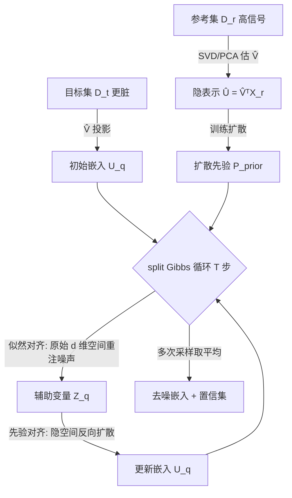

# Clustering by Denoising: Latent Plug-and-Play Diffusion for Single-Cell Embeddings

**会议**: ICLR 2026  
**OpenReview**: [https://openreview.net/forum?id=zxlbh55PhC](https://openreview.net/forum?id=zxlbh55PhC)  
**代码**: [https://github.com/dommeier/dice](https://github.com/dommeier/dice)  
**领域**: 计算生物学 / 单细胞 RNA 测序 / 概率方法  
**关键词**: 单细胞测序、去噪、即插即用扩散、后验采样、Gibbs 采样、不确定性量化、细胞聚类  

## 一句话总结
把"即插即用扩散去噪"搬到单细胞场景，提出 DICE：在低维隐空间里跑扩散先验做去噪、却在原始高维观测空间里重注噪声来"导航"采样轨迹，从而避开 PCA 隐空间把不同细胞类型挤在一起的塌缩问题，用一份高质量参考数据去噪另一份更脏的目标数据，显著提升聚类与细胞类型可分性。

## 研究背景与动机
**领域现状**：单细胞 RNA 测序（scRNA-seq）让我们能在单个细胞分辨率上刻画细胞异质性，标准流程是降维（通常 PCA）→ 聚类 → 按 marker 基因人工标注，构建"细胞图谱"。

**现有痛点**：scRNA-seq 数据噪声极大——既有捕获效率差异等技术伪影，也有生物随机性。标准聚类算法会放大这些噪声，导致标签不可靠。更要命的是，PCA 这类线性降维会把本应分开的不同细胞类型投影到一起（隐空间塌缩），一旦在压缩表示里做去噪，就失去了精确引导所需的几何信息。

**核心矛盾**：把图像领域成熟的即插即用扩散（PnP diffusion）直接搬过来不行——图像像素噪声大体独立，而基因表达有内在低秩结构和复杂相关性，且去噪必须保留细胞间的关系结构才能正确聚类。现有的单细胞贝叶斯方法（VAE 如 scVI、近似消息传递如经验贝叶斯去噪器）又依赖限制性的生成假设、需要参数化噪声建模、对高维隐空间扩展性差。

**本文目标**：把单细胞去噪重新表述为一个**逆问题**——在不施加强生成假设的前提下，从噪声测量里恢复干净的基因表达，并能用高信号参考数据集（如 SMART-seq2）去增强更脏的目标数据集（如基于液滴的 scRNA-seq）。

**核心 idea**：**分离"观测空间"与"去噪空间"**。学习到的扩散先验在低维隐空间里执行去噪，而为了引导这个过程，噪声被重新注入到原始高维观测空间——作者称之为"输入空间导航"（input-space steering），让去噪轨迹始终忠实于原始数据结构，同时通过可调参数 $\rho$ 自适应平衡先验与观测、通过多次采样取平均量化不确定性。

## 方法详解

### 整体框架
DICE（Diffusion Induced Cell Embeddings）建立在低秩因子模型 $X_i = V U_i + \varepsilon_i$ 之上：$V$ 是横跨转录空间的因子载荷矩阵，$U_i$ 是低维生物信号，$\varepsilon_i$ 是噪声。参考集与目标集共享同一个从参考数据学到的载荷矩阵 $V$，从而把目标数据投影进和参考一致的隐空间实现知识迁移。整个流程分两阶段：**训练阶段**在参考集 $D^{(r)}$ 上用 SVD 估计 $\hat V$、再在 $\hat V^\top X^{(r)}$ 得到的 15~25 维隐表示上训练一个扩散模型当先验 $P_{\text{prior}}$；**推理阶段**对每个查询细胞跑一个 split Gibbs 采样器，在"似然对齐"和"先验对齐"两步之间交替，最终把多次采样取平均作为去噪嵌入。

### 关键设计

**1. 后验采样 + 辅助变量分裂：把似然和扩散先验解耦。** 目标是从后验 $\pi(U\mid X)\propto f(X-UV^\top\mid U)\,P_{\text{prior}}(U)$ 采样，但同时满足局部重构约束（似然）和全局流形结构（隐式扩散先验）非常棘手。DICE 借鉴 split Gibbs，引入辅助变量 $Z_i$ 把似然里的 $U_i$ 替换掉，再用高斯惩罚强制 $U_i$ 与 $Z_i$ 一致，得到增广分布

$$P_\rho(X_i, U_i, Z_i)\propto \exp\Big(-\log f(X_i - V Z_i) - \tfrac{1}{2\rho^2}\lVert U_i - Z_i\rVert_2^2 - \log P_{\text{prior}}(U_i)\Big).$$

这里的对齐惩罚是人为引入的（并非来自标准共轭），正是这一改动让我们能在推理时"即插即用"一个只被隐式定义的扩散先验，从而在似然非高斯、先验无显式形式时仍能高效后验采样。

**2. 输入空间导航：似然步在原始高维空间重注噪声（全文最关键的设计）。** Gibbs 采样器在两步间交替——先验对齐步（Line 5）走隐空间的标准反向扩散更新 $x_{t-1}=\frac{1}{\sqrt{\alpha_t}}\big(x_t-\frac{1-\alpha_t}{\sqrt{1-\bar\alpha_t}}\hat\varepsilon_\theta(x_t)\big)+\sqrt{1-\alpha_t}\,z_t$；而**似然对齐步（Line 4）不在隐空间、而是回到原始 $d$ 维观测空间**，通过 $\log f(X_q - \hat V Z_q)$ 重新注入噪声。这一步直接化解了 PCA 隐空间塌缩——在保留完整几何关系的高维空间里施加数据一致性约束，去噪轨迹就被"导航"向被压缩表示掩盖掉的、真正有生物学意义的结构，而不是在已经塌缩的隐空间里盲目去噪。

**3. 可调参数 $\rho$ 的退火调度：自适应平衡先验与观测。** $\rho_s$ 控制 $U_i$ 与 $Z_i$ 的对齐强度：$\rho$ 越大越强调群体级先验结构（适合噪声大的查询），越小越忠于观测到的表达谱。推理时用一个退火调度 $\{\rho_s\}_{s=1}^T$（如从 5 线性降到 0.5），反向扩散的链长选得让 $\bar\alpha_{t_0}\approx(1+\rho_s^2)^{-1}$。当测试与训练分布对齐时保留数据特异信号，当输入极脏时则倚重先验来稳定——这种自适应是传统聚类/插补方法不具备的。

**4. 高斯似然下的闭式更新 + 多次采样量化不确定性。** 单细胞数据常做 log1p 变换并用高斯噪声建模，此时似然步有闭式解（Proposition 3.1）：

$$Z_q^{(s)}\sim\mathcal{N}_k\Big(\Lambda\big(\hat V^\top X_q+\tfrac{1}{\rho_s^2}U_q^{(s)}\big),\ \Lambda\Big),\quad \Lambda=\big(\hat V^\top\hat V+\tfrac{1}{\rho_s^2}I_k\big)^{-1},$$

避免了一般近端方案的迭代开销。更进一步，对同一个查询细胞**多次跑 DICE、看去噪嵌入的散布**就能构造置信集：输入落在簇中心时所有样本一致映射到该簇（高置信），落在两簇中点时样本分裂到两簇（高不确定），$\rho$ 直接控制置信集大小——这为下游软标签和临床应用提供了量化的标注可靠性。

## 实验关键数据

### 合成数据主实验
在 $d=2000$、$k=15$、两个平衡高斯混合成分（各代表一种细胞类型）的受控设置下，对比 PCA 与 DICE 在四种训练-测试漂移下的可分性：

| Setup（漂移类型） | Silhouette PCA | Silhouette DICE | cLISI PCA | cLISI DICE |
|---|---|---|---|---|
| 1 匹配分布 | 0.25 | **0.37** | 1.27 | **1.17** |
| 2 信号强度漂移（噪声×10） | 0.24 | **0.36** | 1.27 | **1.17** |
| 3 噪声模型漂移（重尾 t 噪声） | 0.22 | **0.34** | 1.32 | **1.18** |
| 4 隐先验漂移（重尾混合+高噪声） | 0.22 | **0.28** | 1.35 | **1.27** |

（Silhouette 越高越好，cLISI 越低越好）四种漂移下 DICE 都稳定优于 PCA，说明它对似然误设、先验误设、信号弱化都鲁棒。

### 真实单细胞数据
在 CITE-seq（PBMC 免疫细胞，~30 个亚型）和人胎脑发育（跨数据集标签迁移）两个真实场景，对比多种主流去噪管线：

| 方法 | CITE-seq ARI | CITE-seq NMI | Neo-Cortex ARI | Neo-Cortex NMI |
|---|---|---|---|---|
| **DICE** | **0.805** | **0.740** | **0.393** | **0.553** |
| PCA | 0.745 | 0.689 | 0.347 | 0.496 |
| ALRA | 0.604 | 0.713 | 0.310 | 0.474 |
| kNN (15) | 0.735 | 0.683 | 0.268 | 0.442 |
| MAGIC | 0.674 | 0.648 | 0.317 | 0.502 |
| NMF | 0.448 | 0.430 | 0.209 | 0.220 |
| scVI (10) | 0.641 | 0.595 | – | – |

DICE 在绝大多数指标上一致领先。CITE-seq 上对 CD4/CD8 T 细胞亚谱系、以及难分的 MAIT 细胞分离明显更好（这些仅靠 RNA 难以解析，原本要靠多模态）；胎脑数据上 RG→IPC→nEN→EN 这条经典兴奋性发育轨迹在 DICE 嵌入里连续可追，而 PCA 下是断裂噪杂的。

### 关键发现
- **去噪可超越训练分布**：用高信号参考集训练先验、对低信号目标集去噪并取平均，质量能超过参考数据本身。
- **跨数据集迁移有效**：在 Nowakowski 上训、在 Polioudakis 上测（不同组织、相关但不同的细胞类型）仍全面领先，验证对真实分布漂移的鲁棒性。
- **效率可接受**：CITE-seq 上训练约 36 分钟、推理约 12 分钟（单张 RTX PRO 6000）。

## 亮点与洞察
- **"分离观测空间与去噪空间"是个干净的洞见**：去噪在低维隐空间做（扩散先验擅长、可扩展），但导航信号来自高维原始空间（几何关系完整），一举绕开了 PCA 隐空间塌缩这个单细胞领域的老大难。
- **likelihood-free**：不需要显式生成模型、不需要预先建模噪声结构，直接从数据学先验，比 VAE/经验贝叶斯方法的假设宽松得多。
- **不确定性量化是免费的副产品**：靠重复采样的散布构造置信集，且 $\rho$ 可解释地控制其大小，对临床和软标签下游很实用。
- **PnP 思想的成功跨域迁移**：把图像逆问题里的 split Gibbs / 输入空间一致性，针对单细胞的低秩结构和关系保持需求做了恰当裁剪。

## 局限与展望
- **线性低秩 + i.i.d. 高斯噪声假设**：因子模型 $X=VU+\varepsilon$ 是线性的，作者也把"扩展到非线性低秩结构、放松 i.i.d. 噪声假设"列为首要未来工作。
- **采样效率**：split Gibbs 需要 T=100~200 次迭代、每步还要跑反向扩散链，效率有提升空间。
- **依赖高质量参考集**：方法在参考集噪声不高于目标集时表现最好，反向场景未充分讨论。
- **未覆盖多模态/空间信息**，且嵌入质量尚未在临床有意义的下游任务上评估——这些都被列入展望。

## 相关工作与启发
- **即插即用扩散（PnP diffusion）**：Xu & Chi 2024 的 split Gibbs、以及一系列 PnP 框架（Zhu 2023、Go 2023 等）是直接思想来源，DICE 的贡献是把它裁剪到单细胞。
- **单细胞贝叶斯/生成方法**：scVI（VAE）、经验贝叶斯近似消息传递（Zhong 2022、Nandy & Ma 2024）是对照——DICE 用 likelihood-free 扩散先验摆脱了它们的参数化噪声建模与隐空间局限。
- **传统去噪/插补**：MAGIC、ALRA、kNN smoothing、NMF 是实验基线，Seurat/Harmony 是标准预处理管线。
- **启发**：当一个去噪/逆问题里"压缩表示利于建模但丢失引导信息"时，把"建模空间"和"导航/一致性空间"显式分开、在原始空间施加数据一致性，是个可复用的范式——值得迁移到其他有低秩结构但需保关系几何的科学数据（如空间转录组、蛋白质组）。

## 评分
- **新颖性**: ⭐⭐⭐⭐ — "隐空间去噪 + 输入空间导航"的分离设计在单细胞场景是新颖且针对性强的贡献，虽底层 split Gibbs PnP 借自图像逆问题。
- **实验充分度**: ⭐⭐⭐⭐ — 合成数据四种漂移 + 两个真实数据集 + 7 个基线 + 多指标，跨数据集迁移和不确定性可视化都做了；缺更大规模/更多模态验证。
- **写作质量**: ⭐⭐⭐⭐ — 动机—矛盾—方法逻辑清晰，公式与算法完整，"输入空间导航"的核心洞见表达到位。
- **价值**: ⭐⭐⭐⭐ — 单细胞图谱构建是高频刚需，能用干净参考去噪脏数据并提供不确定性，实用价值高，代码开源。

<!-- RELATED:START -->

## 相关论文

- [\[ICML 2026\] Plug-and-Play Guidance for Discrete Diffusion Models via Gradient-Informed Logit Correction](../../ICML2026/computational_biology/plug-and-play_guidance_for_discrete_diffusion_models_via_gradient-informed_logit.md)
- [\[ICML 2026\] Scalable Single-Cell Gene Expression Generation with Latent Diffusion Models](../../ICML2026/computational_biology/scalable_single-cell_gene_expression_generation_with_latent_diffusion_models.md)
- [\[ICLR 2026\] Learning Explicit Single-Cell Dynamics Using ODE Representations](learning_explicit_single-cell_dynamics_using_ode_representations.md)
- [\[ICLR 2026\] PETRI: Learning Unified Cell Embeddings from Unpaired Modalities via Early-Fusion Joint Reconstruction](petri_learning_unified_cell_embeddings_from_unpaired_modalities_via_early-fusion.md)
- [\[ICLR 2026\] scDFM: Distributional Flow Matching for Robust Single-Cell Perturbation Prediction](scdfm_distributional_flow_matching_model_for_robust_single-cell_perturbation_pre.md)

<!-- RELATED:END -->
