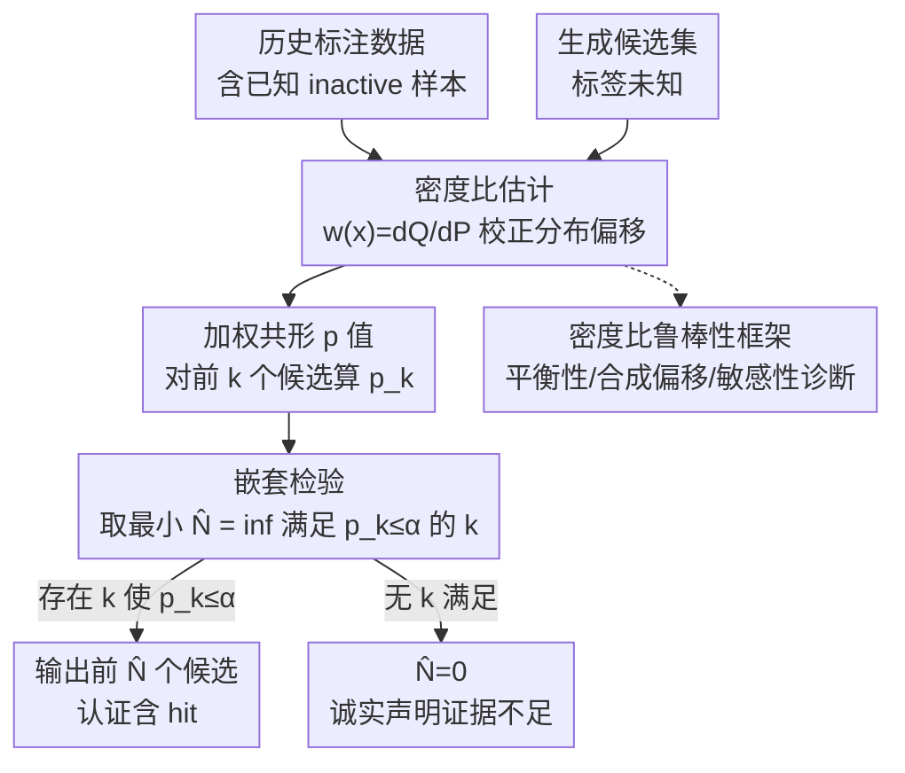

# ConfHit: Conformal Generative Design with Oracle Free Guarantees

**会议**: ICLR 2026  
**arXiv**: [2603.07371](https://arxiv.org/abs/2603.07371)  
**代码**: 无  
**领域**: 计算生物  
**关键词**: conformal prediction, generative design, drug discovery, density ratio, statistical guarantee

## 一句话总结

提出 ConfHit 框架，利用密度比加权的共形排列 p 值实现"认证"（判断生成批次是否包含 hit）和"设计"（精简候选集同时保持统计保证），在无需实验验证 oracle 和存在分布偏移的条件下，为生成式分子设计提供有限样本 $1-\alpha$ 覆盖保证。

## 研究背景与动机

**领域现状**：深度生成模型（VAE、扩散、自回归 Transformer）在分子发现中表现出色，但实际部署需要保证生成分子确实满足目标性质——这只能通过昂贵的湿实验或体内实验验证。共形预测（Conformal Prediction）提供了模型无关的统计保证框架，近期已被扩展到生成任务（Quach et al., 2023; Shahrokhi et al., 2025）。**现有痛点**：(a) **需要 oracle 访问**——现有 CP 生成方法需要对新生成样本进行实验验证（合成+测试），在药物发现中成本极高且不可行；(b) **分布偏移**——生成样本分布 $Q$ 与历史标注数据分布 $P$ 可能不同，违反可交换性假设；(c) **预算约束**——有限生成预算下，不一定能保证包含有效分子，需要诚实地声明"不够自信"而非盲目声称成功。**核心矛盾**：需要在不验证新样本的前提下提供统计保证，同时处理分布偏移——这是经典 CP 框架的根本困难。**本文目标** 两个核心问题：(i) **认证**——给定生成批次，能否以 $1-\alpha$ 概率保证包含至少一个 hit？ (ii) **设计**——能否精简候选集为最小子集同时保持保证？**切入角度**：利用历史标注数据（已知 $Y_i$）中的"inactive"样本与生成样本间的加权可交换性（密度比校正偏移），无需 oracle。**核心 idea**：密度比加权排列 p 值 + 嵌套检验 = oracle-free 有限样本保证。

## 方法详解

### 整体框架

ConfHit 要回答的是一个很实际的问题：一批生成出来的分子，能不能在**不送进实验室验证**的前提下，给出"这批里至少有一个真 hit"的统计保证。它手里只有两样东西——一份带已知标签的历史数据 $\mathcal{D}_{\text{calib}}=\{(X_i,Y_i)\}_{i=1}^n$（$Y_i \in \{0,1\}$ 是已测过的性质），和一批新生成、标签未知的样本 $\{X_{n+j}\}_{j=1}^N$。

整条流水线是这么转的：先估出生成分布相对历史分布的密度比 $w(x) = dQ/dP(x)$，用它校正两边的分布偏移；然后对候选集从前往后取嵌套子集 $\{X_{n+j}\}_{j=1}^k$，每个子集算一个加权共形 p 值 $p_k$；最后做一遍嵌套检验，找到最小的 $\hat{N} = \inf\{k: p_k \leq \alpha\}$，把前 $\hat{N}$ 个候选作为精简后的输出。如果一路找下去都没有哪个 $k$ 能把 p 值压到 $\alpha$ 以下，就老实输出 $\hat{N}=0$，声明"证据不足"，而不是硬给一个虚假保证。密度比是否估得准直接关系到保证能不能成立，所以还配了一套鲁棒性诊断从旁监控。

### 关键设计

**1. 加权共形 p 值：在不验证新样本的情况下量化"批次里有没有 hit"**

认证问题的难点在于：经典共形预测靠的是校准样本和测试样本之间的可交换性，可生成样本的分布 $Q$ 和历史数据的分布 $P$ 往往不一样，可交换性直接被打破。ConfHit 的破法是只拿历史数据里的 inactive 样本 $\{X_i: Y_i=0\}$ 当参照，再用密度比加权把分布偏移补回来，恢复出 Tibshirani et al. (2019) 意义下的**加权可交换性**，并把它从单测试样本推广到一整批生成样本。具体地，对 $B$ 个随机排列算一个随机化 p 值：

$$p_N^{\text{rand}} = \frac{\sum_{b=0}^B \bar{w}(\pi^{(b)};\bm{X}) \mathbb{1}\{V(\pi_0;\bm{X}) \leq V(\pi^{(b)};\bm{X})\}}{\sum_{b=0}^B \bar{w}(\pi^{(b)};\bm{X})}$$

其中 $\bar{w}(\pi;\bm{X}) = \prod_{j=1}^k w(X_{\pi(n+j)})$ 是这批样本的联合似然比，承担了纠偏的角色。**Theorem 3.1** 证明这个 p 值在"批次里没有任何 hit"的零假设下是保守的：$\Pr(p_N^{\text{rand}} \leq t \mid \max_{j} Y_{n+j}=0) \leq t$，且这是有限样本、模型无关的结论，不依赖打分模型的好坏。

**2. 嵌套检验：把候选集精简到最小，又不引入多重检验的代价**

认证只回答"有没有"，设计问题进一步要"用尽量少的候选保住保证"。ConfHit 对每个 $k=1,\ldots,N$ 构造一个假设 $H_k: Y_{n+j}=0,\ \forall j \leq k$（即前 $k$ 个全是 inactive），然后把 p 值序列单调化成 $p_k = \max_{k' \geq k} \tilde{p}_{k'}$，取最小的 $\hat{N} = \inf\{k: p_k \leq \alpha\}$，输出 $\hat{\mathcal{C}} = \{X_{n+j}\}_{j=1}^{\hat{N}}$。这里的巧妙之处是这些假设天然嵌套——只要 $H_k$ 为真，所有 $H_\ell$（$\ell \leq k$）必然也为真，所以沿着 $k$ 往上扫的停止规则不会踩到多重检验的坑，不需要额外的校正项。**Theorem 3.4** 正是据此给出整体错误率控制 $\Pr(\max_{j \leq \hat{N}} Y_{n+j}=0) \leq \alpha$。

**3. 密度比估计的鲁棒性框架：当 $w(x)$ 只能估而非已知时，保证仍可量化**

前两步都假设密度比已知，但现实里 $w(x)$ 只能估，估歪了保证就可能失效。**Theorem 3.5** 把这层不确定性显式刻画出来：覆盖率的膨胀量取决于 p 值临界区域附近的加权误差，也就是说只有"恰好卡在判定边界上"的那部分误差才真正伤害保证。配套地，ConfHit 给了三件可落地的诊断工具：**(1) 平衡性检查**——加权后校准数据的均值应当贴近生成数据，差太远说明权重估偏了；**(2) 合成偏移验证**——在标注数据里人工注入已知偏移，看 p 值是否还保持均匀；**(3) 敏感性分析**——扰动估计权重，看最终结论是否稳定。三者一起把"密度比估得准不准"从一个看不见的隐患变成可检验的量。

### 损失函数 / 训练策略

打分函数 $V$ 决定检验的功效（但不影响错误率控制），论文给了四种选择：Max-pooling $V = \max_j \hat{\mu}(x_{n+j})$、Sum-of-prediction $V = \sum_j \hat{\mu}(x_{n+j})$、Rank-sum $V = \sum_j R_{n+j}$、以及 Likelihood ratio $V = \sum_j \log(\hat{\mu}(x_{n+j})/(1-\hat{\mu}(x_{n+j})))$。换句话说，$V$ 怎么选只关乎能多大概率检出真有 hit 的批次，保证本身始终成立。

## 实验关键数据

### 主实验

**任务 1: 约束分子优化 (CMO-DRD2)**，2 个生成模型：

| 模型 | $\alpha$ | 经验错误率 | 平均候选集大小 | 认证率 |
|------|---------|-----------|-------------|--------|
| Hgraph2graph | 0.05 | 0.023 | 3.2 | 89% |
| Hgraph2graph | 0.10 | 0.056 | 2.1 | 94% |
| SELF-EdiT | 0.05 | 0.034 | 2.8 | 91% |
| SELF-EdiT | 0.10 | 0.068 | 1.7 | 96% |

**任务 2: 基于结构的药物发现 (SBDD)**，3 个生成模型：

| 模型 | $\alpha$ | 经验错误率 | 平均候选集大小 |
|------|---------|-----------|-------------|
| TargetDiff | 0.10 | ≤0.10 | 显著 < N |
| DecompDiff | 0.10 | ≤0.10 | 显著 < N |
| MolCRAFT | 0.10 | ≤0.10 | 显著 < N |

所有模型 × 所有 $\alpha$ 水平一致满足覆盖保证（经验错误率 ≤ 名义 $\alpha$）。

### 消融实验

| 消融项 | 影响 |
|--------|------|
| 去除密度比校正 | 错误率超过 $\alpha$（保证失效） |
| 不同打分函数 | Max-pooling 和 Likelihood ratio 功效较好，但控制均成立 |
| 减少校准数据量 | p 值方差增大但保证仍成立 |
| 估计密度比 vs 真实密度比 | 保证在估计误差可控时近似成立（Theorem 3.5） |

### 关键发现

1. **5 个生成模型 × 2 个任务一致有效**，验证了模型无关性
2. **候选集显著精简**：从原始 $N$ 个候选大幅缩减，减少实验成本
3. **密度比校正是必需的**：去除后错误率超 $\alpha$，保证失效
4. **诚实声明能力**：当生成器较弱或预算不足时，ConfHit 输出 $\hat{N}=0$（"不够自信"），而非给出虚假保证
5. **鲁棒性诊断有效**：平衡性检查和敏感性分析能有效识别密度比估计质量

## 亮点与洞察

- **首个 oracle-free 生成模型统计保证框架**：利用历史数据的可交换性结构绕过了 oracle 需求，真正适用于资源受限的药物发现场景
- **嵌套假设避免多重检验校正**：统计学上优雅——检验序列的嵌套结构使得简单的停止规则即可控制整体错误率
- **"认证+设计"问题拆分**：清晰的问题分离使得方法逻辑透明，认证失败时也有信息价值（说明任务本身困难）
- **理论与实践的平衡**：Theorem 3.5 的鲁棒性分析 + 三种诊断工具 = 实际部署中可量化的可靠性

## 局限与展望

- 实验仅用计算 oracle（DRD2 模型、AutoDock Vina）验证，未做真实湿实验
- 高维分子空间中密度比估计仍然困难，估计质量直接影响功效
- 仅处理单性质保证，多性质同时保证（如活性+选择性+毒性）是重要扩展方向
- 协变量偏移假设 $dQ/dP(x,y)=w(x)$ 要求性质完全由结构决定，可能在某些场景下过强

## 相关工作与启发

- **vs Quach et al. (2023)**: 经典共形生成方法，但需要 oracle 验证新样本。ConfHit 利用历史数据的标签信息绕过了这一要求
- **vs CoDrug (Laghuvarapu et al., 2023)**: 做性质预测的共形区间。ConfHit 解决的是生成设计问题——保证候选集包含 hit——不同的问题定义
- **vs 共形选择 (Jin & Candès, 2023b)**: 控制假阳性率。ConfHit 控制的是"无 hit 概率"——不同的错误类型
- **启发**：共形推断从预测到生成的自然扩展方向；密度比估计和分布偏移处理是核心挑战

## 评分

- 新颖性: ⭐⭐⭐⭐⭐ 问题定义新颖（oracle-free 生成保证），理论框架（嵌套检验+多测试样本 p 值）原创性强
- 实验充分度: ⭐⭐⭐⭐ 5 模型 × 2 任务 × 多 α 水平全面验证，鲁棒性诊断完善，但缺真实湿实验
- 写作质量: ⭐⭐⭐⭐⭐ 理论推导严谨清晰，问题动机和方法逻辑紧密衔接
- 价值: ⭐⭐⭐⭐⭐ 直接影响生成式药物发现的实际部署决策，提供了从"试试看"到"有保证"的范式转变

<!-- RELATED:START -->

## 相关论文

- [\[ICLR 2026\] WFR-FM: Simulation-Free Dynamic Unbalanced Optimal Transport](wfr-fm_simulation-free_dynamic_unbalanced_optimal_transport.md)
- [\[ICML 2025\] Multivariate Conformal Selection](../../ICML2025/computational_biology/multivariate_conformal_selection.md)
- [\[CVPR 2026\] Stronger Normalization-Free Transformers](../../CVPR2026/computational_biology/stronger_normalization-free_transformers.md)
- [\[ICLR 2026\] MarS-FM: Generative Modeling of Molecular Dynamics via Markov State Models](mars-fm_generative_modeling_of_molecular_dynamics_via_markov_state_models.md)
- [\[ICLR 2026\] SYNC: Measuring and Advancing Synthesizability in Structure-Based Drug Design](sync_measuring_and_advancing_synthesizability_in_structure-based_drug_design.md)

<!-- RELATED:END -->
