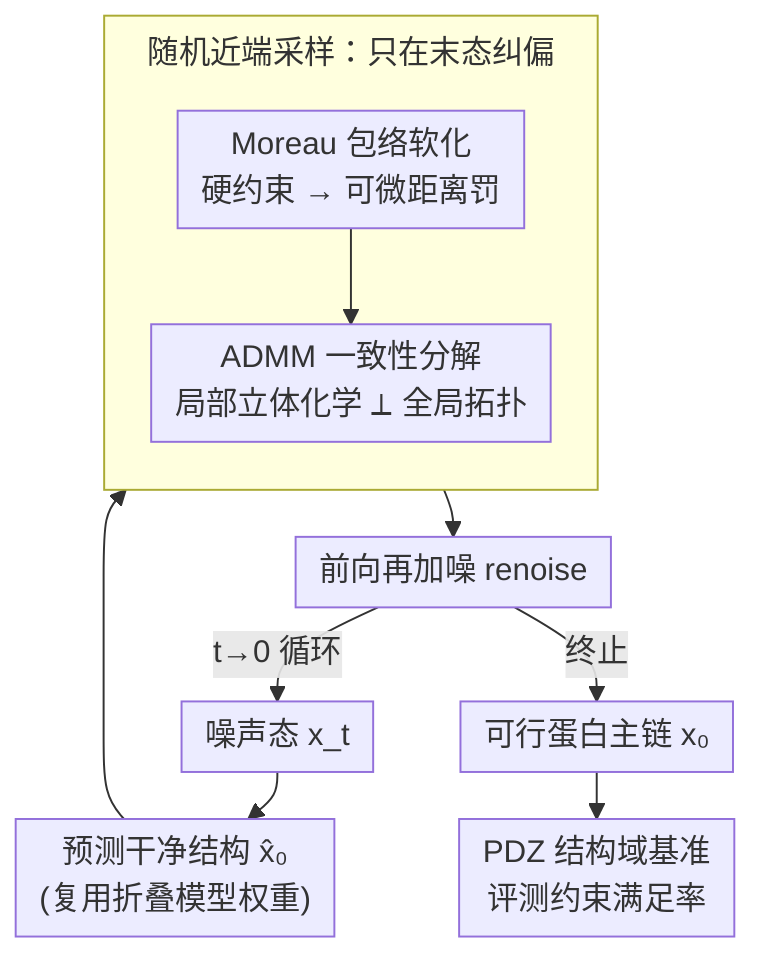

# Constrained Diffusion for Protein Design with Hard Structural Constraints

**会议**: ICLR2026  
**OpenReview**: [https://openreview.net/forum?id=kkvqVRu2Zy](https://openreview.net/forum?id=kkvqVRu2Zy)  
**代码**: 随补充材料发布（含 PDZ 基准）  
**领域**: 计算生物学 / 蛋白质设计 / 扩散模型  
**关键词**: 约束扩散, 蛋白质设计, 近端优化, ADMM, motif scaffolding

## 一句话总结
把约束扩散重新解释成"随机近端优化"，在每一步**预测出的干净结构**上施加可行性修正、再加噪回到数据流形（predict-prox-renoise），并用 ADMM 把局部立体化学与全局拓扑约束解耦，从而在蛋白质 motif scaffolding 和空腔设计任务上做到**键长键角约束 100% 严格满足**，可用率远超 RFDiffusion 系列基线。

## 研究背景与动机
**领域现状**：扩散模型（以 RFDiffusion 为代表）已经能很好地刻画真实蛋白质骨架的流形，被广泛用于单体、复合体、binder 的从头设计。功能性设计往往要求把预定义的结合/催化 motif "嵌"进生成的骨架里（motif scaffolding），或在结构里挖出底物进出的通道（负空间/空腔约束）。

**现有痛点**：现有方法对"精确约束"束手无策。motif scaffolding 不保证生成骨架真的精确包含 motif；非共价氢键、键长键角、手性、链闭合这类硬约束几乎无法保证；空腔这种负空间约束更是现有生成模型难以表达的。结果是要生成成千上万个候选，才能筛出少数几个几何合法的设计，靠的是 rejection sampling。

**核心矛盾**：把约束"装进"扩散过程有两条路，但都有硬伤。**软引导（guidance）** 只能提高可行率、给出概率性偏置，无法保证逐样本满足约束，而且加大引导权重会扰动扩散轨迹、反而掉性能。**逐步投影**（每步把中间噪声态 $x_t$ 投回可行集 $\mathcal{C}$）虽然把可行性直接嵌进生成过程，却要在**高噪声的中间态**上向**高度非凸**的约束集做投影——既会引入统计偏置（中间样本被挤到约束边界附近），又容易陷入局部极小，破坏扩散轨迹。一句话：**早期就在噪声态上硬投影，会把扩散带歪**。

**本文目标**：在不依赖"中间态可行 $x_t \in \mathcal{C}$"这个假设的前提下，让采样轨迹**收敛到终态严格可行**，同时不脱离数据流形、不损失结构多样性。

**切入角度**：作者用**随机近端方法（stochastic proximal methods）** 的视角重看约束扩散。关键观察是：扩散模型本来就在每一步预测一个"干净结构估计" $\hat{x}_0$；那就不要在噪声态上动手，而是**在这个干净预测上做可行性修正**，再重新加噪回到正确的扩散边缘分布。

**核心 idea**：把单步反向扩散看作一次近端梯度步——去噪器提供数据驱动的"锚点"，可行性通过惩罚到约束集的距离来强制。于是采样变成 **predict → prox → renoise** 循环：只在末态（干净预测）纠偏，让违反量随步数单调收缩，终态趋于精确可行。

## 方法详解

### 整体框架
目标是从约束分布 $p_\mathcal{C}(x_0) \propto p_\text{data}(x_0)\,\mathbf{1}\{x_0 \in \mathcal{C}\}$ 采样：既要像真实蛋白（落在数据流形 $p_\text{data}$ 上），又要严格落进可行集 $\mathcal{C}$（键长、键角、手性、链闭合、空腔等几何/化学约束）。标准扩散只能采到 $p_\text{data}$，所以要改采样过程把约束注入进去。

本文把反向扩散的每一步拆成三个阶段：**(1) 预测**——去噪器 $x_\theta(x_t,t)$ 从当前噪声态 $x_t$ 预测干净结构 $\hat{x}^t_0$；**(2) 近端修正**——用近端算子 $\text{prox}_{\eta_t,g}$ 把 $\hat{x}^t_0$ 拉到可行集附近得到 $\tilde{x}^t_0$；**(3) 再加噪**——用前向核 $\text{FWD}(\cdot,\varepsilon)$ 把修正后的干净结构重新加噪到 $x_{t-1}$。即

$$x_t \xrightarrow{\text{predict}} \hat{x}^t_0 \xrightarrow{\text{prox}} \tilde{x}^t_0 \xrightarrow{\text{FWD}} x_{t-1}.$$

因为修正发生在**预测出的干净态**而非噪声中间态，所以避开了"在高噪声上投影非凸约束"的两个毛病；又因为修正后立刻重新加噪、匹配回 $t-1$ 的前向边缘分布，轨迹始终贴着数据流形走。随着 $t\to 0$、$\lambda_t\eta_t \to \infty$，终态收敛到任意接近 $\mathcal{C}$。而近端修正这一步本身又被 ADMM 进一步拆成"局部立体化学"和"全局拓扑"两块协同求解。

### 关键设计

**1. 随机近端采样：把约束修正搬到末态、用 predict-prox-renoise 取代逐步投影**

针对"在噪声中间态上硬投影非凸约束会带偏轨迹、陷入局部极小"这个痛点，本文不再要求每个 $x_t \in \mathcal{C}$，而是只在去噪器预测出的干净结构 $\hat{x}^t_0$ 上做一次近端修正，然后再加噪回去。把单步反向扩散写成一个优化问题：去噪器给出数据锚点，可行性通过惩罚到 $\mathcal{C}$ 的距离来实现。这样做有概率解释——若把网络在第 $t$ 步的干净误差建模成方差 $\eta_t$ 的高斯 $p(x_0\mid x_t)\propto \exp(-\tfrac{1}{2\eta_t}\|x_0-\hat{x}^t_0\|^2)$，再把惩罚 $g$ 看作软先验 $\propto\exp(-g(x_0))$，那么近端子问题 $\tilde{x}^t_0=\text{prox}_{\eta_t,g}(\hat{x}^t_0)$ 恰好是干净态的逐步 MAP 估计；随后的再加噪 $x_{t-1}=\sqrt{\bar\alpha_{t-1}}\,\tilde{x}^t_0+\sigma_{t-1}\varepsilon$ 恢复反向链应有的随机性，同时把它锚向 $\mathcal{C}$。这整套循环是近端梯度步的随机版本，既尊重扩散动力学又保证收敛到可行终态，从根上绕开了"早期噪声态投影把扩散带歪"的问题。

**2. Moreau 包络软化：把硬约束指示函数换成可微距离罚，并用 $\lambda_t$ 调度**

如果近端算子里的 $g$ 直接取可行集的指示函数，就退化成对非凸集的精确投影——当 $\hat{x}^t_0$ 离 $\mathcal{C}$ 很远时这个投影是病态的、不稳定。作者用它的 **Moreau 包络** 替代硬指示，得到光滑惩罚 $g(x)=\tfrac{\lambda_t}{2}\,\text{dist}_\mathcal{C}(x)^2$，其中 $\text{dist}_\mathcal{C}$ 是到可行集的距离（如 $\text{SE}(3)$ 上的 $\inf_{y\in\mathcal{C}}\|x-y\|$）。参数 $\lambda_t$ 扮演"逆光滑半径"：$\lambda_t\to\infty$ 时罚项强制精确可行，有限 $\lambda_t$ 时柔性地把样本拉向 $\mathcal{C}$。调度上，因为再加噪方差 $\sigma_t^2$ 随步数收缩，就让 $\lambda_t$ 反过来增长——只有当去噪器的 $\hat{x}^t_0$ 已经足够准时，可行性才占主导；并取信任权重 $\eta_t=\sigma_{t-1}^2$，让近端子问题和扩散方差处在同一尺度。理论上（Thm 6.1）一次近端步把违反量按 $(2\lambda_t\eta_t)^{-1/2}$ 收缩，$\lambda_t\eta_t\to\infty$ 时终态任意接近约束集；只要 $\lambda_t=c_t/\eta_t$ 且 $c_t$ 末段收紧，终态违反的期望就单调下降（Thm 6.2）。

**3. ADMM 一致性分解：把局部立体化学和全局拓扑拆开协同求解**

约束集 $\mathcal{C}$ 里局部立体化学变量（相邻原子/残基的键长键角）和全局变量（拓扑、长程残基相互作用）强耦合：序列上相距很远的残基在折叠结构里可能贴在一起，强加一条全局约束（如对 β-折叠施加非共价键约束）会大幅扰动附近的局部几何、破坏其保真度，使近端步在计算上很复杂。但这种"可分的局部+全局"结构反而是个机会。作者把可行点写成 $x\in\mathcal{C}_\text{local}\cap\mathcal{C}_\text{global}$，惩罚分解为 $g=g_\text{local}+g_\text{global}$，并**特意把"到去噪器的距离项"并进局部块 $F$**（让局部步既修立体化学又贴近 $\hat{x}^t_0$），全局块 $G$ 专注长程可行。再用一致性 ADMM（即 Douglas–Rachford 近端分裂）求解 $\min_{y,z} F(y)+G(z)\ \text{s.t.}\ y=z$：

$$y^{k+1}=\text{prox}_{\rho_k,F}(y^k-u^k),\quad z^{k+1}=\text{prox}_{\rho_k,G}(z^k+u^k),\quad u^{k+1}=u^k+y^{k+1}-z^{k+1}.$$

$y,z$ 是骨架的两份拷贝（分别对应局部/全局可行修正），对偶变量 $u$ 累积二者的不一致；收敛时 $y=z$ 即得 $F+G$ 的极小。实践中每个扩散步只需扫一遍 ADMM，靠跨步 warm-start 让两份拷贝保持接近。这一分解正是本文能同时满足"局部立体化学合法"和"全局功能约束（如非共价键、空腔）"的关键。

**4. PDZ 结构域基准：第一个面向约束扩散的 motif scaffolding 标准评测集**

为评估带硬约束的设计，作者新构建并人工策展了一个 PDZ 结构域 motif scaffolding 基准。PDZ 是一类小型模块化结合域，通过 β-折叠样氢键识别伴侣蛋白的无结构 C 端 motif，是抗体之外更可设计的结合方式。作者从 RCSB PDB 收集所有已解析的 PDZ/PBM 复合物，初筛 72 个、人工剔除未解析区域和过短肽段后留 52 个；再为了让 PDZ 能与目标 PBM 建立额外接触而重排 N/C 端（在配体邻近 loop 处剪开、修剪原端、用 vanilla RFDiffusion 补全缺口），并用 ProteinMPNN 设计序列、AlphaFold2 预测结构，按自洽 RMSD<2.5 Å、pLDDT>90、肽段 RMSD<2.0 Å 严格筛选，最终保留 31 个高置信设计（其中 6 个含短肽或脯氨酸等几何受限残基，被标注为 poor-posed）。这个基准本身是论文的一项贡献，填补了约束扩散在模块化域工程上缺乏系统评测的空白。

### 损失函数 / 训练策略
方法是**纯推理时（inference-time）** 的：不重训去噪器，直接复用预训练折叠/扩散骨干（实验里以 RFDiffusion 为底，采用 $x_0$-prediction 参数化以便复用 RoseTTAFold 架构与权重）。所有"约束"通过近端子问题里的距离罚 $g$ 和 ADMM 在采样时施加，不引入任何训练目标，因而能逐样本满足任意任务特定约束、无需为新约束集重训。

## 实验关键数据

### 主实验
两个任务：PDZ 结构域非共价键设计、分子封装的空腔（vacancy）约束设计。底层骨干统一用 RFDiffusion，对比 Standard、Recenter（质心重定位引导）、CGD（约束引导扩散 + SMC 重采样）。

**PDZ 基准（每方法 31,000 样本）**：

| 指标 | Standard | Recenter | CGD | 本文 |
|------|----------|----------|-----|------|
| 约束满足率 (%) ↑ | 0.0 | 0.0 | 0.0 | **100.0** |
| 结构真实性 (%) ↑ | (32.0) | (18.7) | (38.2) | 21.0 |
| 可用率 (%) ↑ | 0.0 | 0.0 | 0.0 | **21.0** |
| 回转半径 (Å) ↓ | (13.6) | (13.2) | (16.2) | **12.4** |
| 多样性 (%) ↑ | N/A | N/A | N/A | **18.8** |

（括号内统计是在"不可用结构"上算的。）近十万个基线样本里没有一个完美满足键距+键角约束；基线常生成错误二级结构，无法与肽配体结合。本文不仅约束满足 100%，可用率 21.0%（well-posed 配体上最高 83.0%），回转半径和多样性也全面领先。

**分子封装 / 空腔约束（每方法约 4,000 样本）**：

| 指标 | Standard | Recenter | CGD | Recenter+CGD | 本文 |
|------|----------|----------|-----|--------------|------|
| 约束满足率 (%) ↑ | 0.0 | 0.0 | 21.6 | 27.4 | **100.0** |
| 结构真实性 (%) ↑ | (100.0) | (100.0) | 96.1 | 93.8 | 97.8 |
| 可用率 (%) ↑ | 0.0 | 0.0 | 20.5 | 24.2 | **97.8** |
| 回转半径 (Å) ↓ | (15.2) | (14.3) | 23.9 | 26.6 | **14.8** |
| 多样性 (%) ↑ | N/A | N/A | 20.5 | 24.2 | **97.8** |

任务是让骨架严格落在 20×40×40 Å 的盒内、同时避开内部锥形排除区（非凸）。最强基线 Recenter+CGD 可用率仅 24.2% 且回转半径飙到 26.6 Å（说明生成了松散/未折叠构象），本文可用率 97.8%、约为最近基线的 **4 倍**，且回转半径 14.8 Å 与标准扩散相当，兼顾合法性、紧凑性与折叠覆盖。

### 消融实验
论文主表已含等价于消融的对照——核心变量是"约束注入方式"：

| 配置 | 约束满足率 | 说明 |
|------|-----------|------|
| Standard（无约束注入） | 0% | 纯 RFDiffusion，全靠 rejection sampling |
| Recenter（质心引导） | 0% | 软偏置，控不住全局键约束/排除区 |
| CGD（约束引导 + SMC） | 0–27.4% | 重要性采样，仍只是概率性偏置 |
| 本文（近端末态修正 + ADMM） | **100%** | 逐样本严格可行 |

### 关键发现
- **"在哪一步修约束"比"修多狠"更关键**：把修正从噪声中间态搬到预测的干净末态，是从 0% 到 100% 满足率的根本差别。
- **软引导触顶**：CGD/Recenter 在局部几何真实性上不差，但全局非共价键、非凸排除区这类硬约束上始终上不去——印证了"guidance 只给概率性偏置"的局限。
- **ADMM 分解保住了局部保真**：直接对 β-strand 施加全局非共价键约束会拽偏附近立体化学；解耦后局部块兼顾"修立体化学 + 贴近去噪器预测"，避免了这种破坏。
- **质量不打折**：回转半径与标准扩散持平，说明严格可行不是靠生成松散/不真实结构换来的。

## 亮点与洞察
- **视角转换很漂亮**：把"约束扩散"重写成"随机近端优化"，于是 predict-prox-renoise 这一步自然就是近端梯度步的随机版本——既给了概率解释（逐步 MAP），又能套用近端方法的收敛理论拿到可证的可行性界。
- **"末态纠偏 + 再加噪"是可迁移的通用技巧**：任何带 $x_0$-prediction 的扩散/流模型，要施加硬约束都可以照搬"在干净预测上投影/近端、再用前向核加噪回轨道"，不止蛋白质。
- **把去噪距离项塞进局部块**这一手很细：让 ADMM 的局部步同时"修几何 + 不跑离数据流形"，是保住结构真实性的关键工程决策。
- **空腔/负空间约束**被显式表达为非凸排除区，比"插一根占位 α-helix 再删掉"这种 hack 通用得多，指向可控的口袋/通道设计。

## 局限与展望
- **依赖底层骨干质量**：方法是推理时包装，最终结构的真实性仍受 RFDiffusion 等去噪器能力上限约束；去噪器预测差时近端修正也救不回。
- **约束需可表达为可微距离/可近端的势函数**：复杂、隐式或离散的功能约束（如序列层面的可设计性）如何纳入并不显然。
- **ADMM 每步只扫一遍 + warm-start**：是工程折中，对极难耦合的约束是否仍收敛、单步预算如何影响终态可行性，论文给的是渐近保证而非有限步刻画。
- **评测仍偏结构/几何指标**：约束满足、回转半径、多样性都到位，但缺少湿实验或更下游的功能验证（结合亲和力、可表达性），真实蛋白工程价值有待进一步确认。
- **超参调度依赖经验**：$\lambda_t$、$\eta_t=\sigma_{t-1}^2$、$\rho$ 的选择虽有理论指引（Thm 6.2），但末段收紧的具体节奏仍需按任务调。

## 相关工作与启发
- **vs 软引导 / classifier guidance（Ho & Salimans 2022, Chroma 等）**：它们只提供概率性偏置、加大权重会扰动轨迹；本文做逐样本严格可行，且不靠加大引导而是靠末态近端修正，不破坏扩散动力学。
- **vs 逐步投影约束扩散（Christopher et al. 2024）**：同样想把约束嵌进生成过程，但本文证明"在噪声中间态投影"会引入统计偏置、陷入非凸局部极小，改成"只在干净末态近端 + 再加噪"，避开这两点。
- **vs 训练时嵌入约束（Eguchi 2022, Lutz 2023, ReQFlow, FoldFlow-2）**：训练时方法换约束就得重训、且只给分布层面保证；本文推理时即插即用、逐样本可行，且把硬几何约束真正强制而非软偏置。
- **vs RFDiffusion / Genie 2 / OriginFlow 等骨架生成器**：它们给出强大的功能性条件能力，但输出仍频繁违反全局约束、依赖大量后筛与 rejection sampling；本文正是用近端+ADMM 包装去消除这种后筛依赖。

## 评分
- 新颖性: ⭐⭐⭐⭐⭐ 把约束扩散重述为随机近端优化、末态纠偏 + ADMM 解耦，视角和落地都新。
- 实验充分度: ⭐⭐⭐⭐ 两任务 + 三/四基线 + 大样本，约束满足从 0% 到 100%；缺湿实验/功能验证。
- 写作质量: ⭐⭐⭐⭐⭐ 动机—方法—理论—实验逻辑严密，理论与算法对应清晰。
- 价值: ⭐⭐⭐⭐⭐ 给硬约束蛋白质设计提供了可证、即插即用的通用范式，并贡献了 PDZ 基准。

<!-- RELATED:START -->

## 相关论文

- [\[NeurIPS 2025\] Constrained Discrete Diffusion](../../NeurIPS2025/computational_biology/constrained_discrete_diffusion.md)
- [\[ICML 2026\] Constrained Flow Optimization via Sequential Fine-Tuning for Molecular Design](../../ICML2026/computational_biology/constrained_flow_optimization_via_sequential_fine_tuning_for_molecular_design.md)
- [\[ICLR 2026\] SAIR: Enabling Deep Learning for Protein-Ligand Interactions with a Synthetic Structural Dataset](sair_enabling_deep_learning_for_protein-ligand_interactions_with_a_synthetic_str.md)
- [\[ICLR 2026\] A Joint Diffusion Model with Pre-Trained Priors for RNA Sequence-Structure Co-Design](a_joint_diffusion_model_with_pre-trained_priors_for_rna_sequence-structure_co-de.md)
- [\[ICLR 2026\] Iterative Distillation for Reward-Guided Fine-Tuning of Diffusion Models in Biomolecular Design](iterative_distillation_for_reward-guided_fine-tuning_of_diffusion_models_in_biom.md)

<!-- RELATED:END -->
