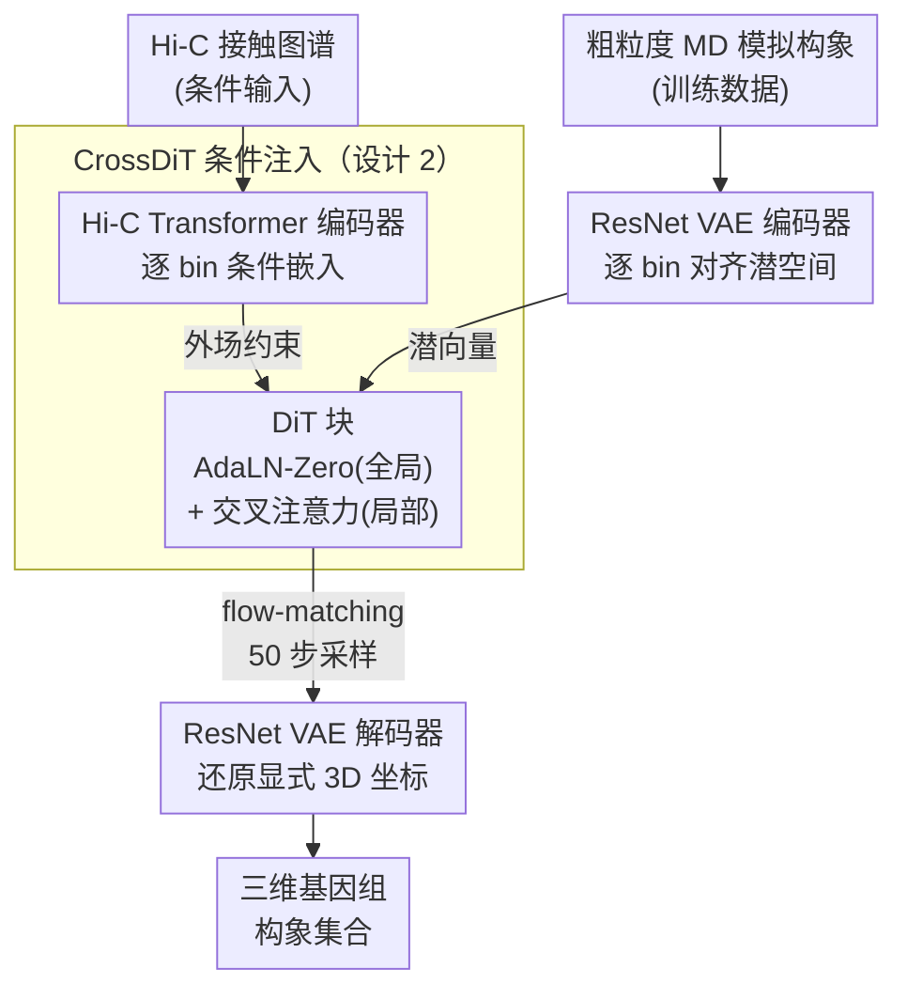

# Contact-Guided 3D Genome Structure Generation of E. coli via Diffusion Transformers

**会议**: ICLR2026  
**arXiv**: [2603.07472](https://arxiv.org/abs/2603.07472)  
**代码**: 待确认  
**领域**: 计算生物  
**关键词**: 3D genome, Hi-C, diffusion transformer, CrossDiT, latent diffusion, flow matching, E. coli

## 一句话总结
提出 DiffBacChrom——基于条件扩散 Transformer (CrossDiT) 从 Hi-C 接触图谱生成大肠杆菌三维基因组构象集合，通过 ResNet VAE 保持逐 bin 对齐的潜空间编码、Transformer 编码器 + 交叉注意力注入 Hi-C 条件、flow-matching 训练，生成的集合在距离衰减 P(s) 和 SCC 指标上与输入 Hi-C 高度一致，同时保持构象多样性。

## 研究背景与动机

**领域现状**：Hi-C 技术提供基因组片段间的群体平均接触频率，但 Hi-C 矩阵是间接测量——同一接触图谱可对应多种三维构象集合。

**确定性方法的局限**：FLAMINGO（优化方法）、CHROMFORMER（Transformer 回归）等主流方法只输出单一共识构象，忽略了染色质组织的固有异质性。

**集合方法的瓶颈**：基于聚合物模拟的集合方法（如 Li & Schlick 2024）计算昂贵，难以扩展到大规模数据。

**生成式建模的机会**：将基因组重建定义为条件生成问题——给定 Hi-C，采样物理合理的三维构象分布。训练后可对新输入高效生成集合，实现摊余推断。

**为何选细菌**：细菌染色体有较完善的物理和生物约束可做合理性检验；原核生物跨物种组织模式多样，适合评估模型迁移能力。

**核心idea**：用 CrossDiT 架构实现 Hi-C → 3D 结构的单向条件生成，交叉注意力确保 Hi-C 作为"外场"约束结构而不被结构反向影响。

## 方法详解

### 整体框架

DiffBacChrom 把"从 Hi-C 重建三维基因组"重写成潜空间里的条件生成问题。它分三步走：先用一个 ResNet VAE 把 3D 坐标序列压成与 Hi-C bin 一一对齐的潜向量，再训练 CrossDiT 扩散模型在这个潜空间里以 Hi-C 接触图谱为条件采样构象，最后由 VAE 解码器把潜向量还原成显式坐标。训练数据来自粗粒度分子动力学（MD）模拟，提供成对的合成 Hi-C 与对应构象集合；推理时给一张新的 Hi-C，模型就能高效采样出一整组物理合理的三维构象。

### 关键设计

**1. ResNet VAE：保持逐 bin 对齐的潜空间**

扩散模型若直接在原始 3D 坐标上做，会丢失 Hi-C 矩阵与结构之间的位置对应关系，给后续的条件注入带来歧义。这里用 1D ResNet18 编码 $928\times16$ 维输入——每个 Hi-C bin 对应 2 个 bead、2 条染色体，每 bead 携带 $xyz$ 坐标与一个掩码位。关键在于编码器不沿序列维度压缩，潜向量长度始终等于 Hi-C 矩阵维度，从而让潜空间的每个位置都对齐到一个 bin，条件注入时"第几个 bin"就能精确找到"第几段结构"。为处理 DNA 复制时染色体分叉出的分支结构，模型引入一个二值复制掩码（replication mask），坐标重建损失 $\mathcal{L}_{coord}$ 只在掩码激活的位置上计算 MSE，这样不同复制阶段 bead 数量不一致也不会让重建偏差被稀释。整体 VAE 损失为 $\mathcal{L} = \mathcal{L}_{coord} + \lambda_{mask}\mathcal{L}_{mask} + \lambda_{KL}\mathcal{L}_{KL}$，实测取 $\lambda_{mask}=1.0$、$\lambda_{KL}=5\times10^{-3}$。

**2. CrossDiT 条件注入：让 Hi-C 当"外场"单向约束结构**

Hi-C 是群体平均的间接测量，物理上应当约束结构、而不被某一条采样结构反过来改写，所以条件注入必须是单向的。模型先用一个沿行维度处理 Hi-C 矩阵（列作特征）的 Transformer 编码器，输出逐 bin 的条件嵌入 $z_c$；再分两路注入 DiT：全局一路把时间步嵌入与全局平均池化后的条件相加成 $c = t + \tilde{z}_c$，通过 AdaLN-Zero 调制每个 DiT 块；局部一路用交叉注意力，让结构特征 $x$ 作 Query、$z_c$ 作 Key/Value。这样结构始终"向条件查询"信息，而条件本身不会被结构更新，既符合 Hi-C 作为外场约束的物理直觉，也让信息流向可解释。

**3. Flow-Matching 训练：稳定优化且不牺牲多样性**

为了让潜空间扩散的优化路径更直、训练更稳，模型用 rectified flow 框架替代 DDPM，直接回归速度场。推理时只需 50 步采样，并把 classifier-free guidance 的 scale 设为 $1.0$——即不额外放大条件信号，避免过度向单一"最优"构象收敛而压垮集合多样性。潜空间在训练前按 scale $=1.335$ 做标准化，使噪声调度与数据尺度校准一致。

### 损失函数

VAE 端为掩码加权的坐标重建项加 KL 正则：$\mathcal{L} = \mathcal{L}_{coord} + 1.0\cdot\mathcal{L}_{mask} + 5\times10^{-3}\cdot\mathcal{L}_{KL}$；DiT 端为 flow-matching 的速度场 MSE 损失。

## 实验关键数据

### 模型配置与生成质量

| 模型 | 深度 | 隐藏维 | 注意力头 | 参数量 | SCC (mean±std) | dRMSD |
|------|------|--------|----------|--------|----------------|-------|
| CrossDiT-S | 12 | 384 | 6 | 45M | 0.824±0.022 | 0.666 |
| CrossDiT-L | 24 | 1024 | 16 | 634M | **0.962±0.008** | **0.700** |
| 高斯扰动基线 | — | — | — | — | — | 0.072 |

### 关键指标解读

| 指标 | 含义 | CrossDiT-L | CrossDiT-S |
|------|------|------------|------------|
| SCC | Hi-C 层级相关系数 | 0.951–0.975 | 0.787–0.865 |
| P(s) 距离衰减 | 接触频率~基因组距离 | 高度匹配 | 基本匹配 |
| dRMSD / 键长 | 构象多样性 | 1.94× | 1.84× |
| 基线 dRMSD / 键长 | 单构象扰动 | 0.20× | — |

- CrossDiT-L 的 SCC 均值 0.962 表明生成集合的 Hi-C 与输入在各距离层级上高度一致
- 生成集合的 dRMSD 约为键长的 1.9 倍，远超单构象扰动基线（0.2 倍），证明模型没有坍缩到单一结构

## 亮点与洞察
- **问题定义的转变**：从"重建单一最优结构"到"采样构象集合分布"——更符合 Hi-C 数据的本质（群体平均测量）
- **交叉注意力的物理解释**：Hi-C 是"外场约束"→ 单向条件注入 → 结构向条件查询但不反向影响，架构设计与物理直觉一致
- **复制掩码处理分支结构**：巧妙地用二值掩码统一处理不同复制阶段的染色体，允许模型学习复制感知的表示

## 局限性
- 训练数据完全来自粗粒度 MD 模拟而非实验测量，生成结构的生物真实性取决于模拟质量
- 当前每个 Hi-C bin 对应 2 个 bead，序列长度 928——扩展到真核生物（序列更长）需解决长序列计算瓶颈
- 未与 ChromoGen 等基于序列条件的方法在相同物种上定量对比
- VAE 结构较简单（1D ResNet18），对更复杂的嵌套复制分支可能表达力不足

## 相关工作与启发
- **vs FLAMINGO (Wang et al., 2022)**：优化方法输出单一构象；本方法输出分布——更忠实反映细胞群体异质性
- **vs CHROMFORMER (Valeyre et al., 2022)**：Transformer 回归单一结构；本方法用扩散生成多样集合
- **vs ChromoGen (Schuette et al., 2025)**：ChromoGen 以 DNA 序列+可及性为条件；本方法以 Hi-C 为条件直接生成显式 3D 坐标
- **启发**：CrossDiT 的单向条件注入模式可迁移到其他"物理约束→结构生成"场景（如密度图→蛋白质构象）

## 评分
- 新颖性: ⭐⭐⭐⭐ 首次用扩散 Transformer 做细菌全基因组集合生成，问题定义有新意
- 实验充分度: ⭐⭐⭐ 指标设计合理（SCC + P(s) + dRMSD），但仅在合成数据上验证，缺少与其他方法的定量对比
- 写作质量: ⭐⭐⭐⭐ 方法描述清晰，物理直觉解释到位
- 价值: ⭐⭐⭐ 概念验证阶段，需在真实实验数据和更多物种上验证才能确认实际影响力

<!-- RELATED:START -->

## 相关论文

- [\[NeurIPS 2025\] Multimodal 3D Genome Pre-training](../../NeurIPS2025/computational_biology/multimodal_3d_genome_pre-training.md)
- [\[AAAI 2026\] Distributional Priors Guided Diffusion for Generating 3D Molecules in Low Data Regimes](../../AAAI2026/computational_biology/distributional_priors_guided_diffusion_for_generating_3d_molecules_in_low_data_r.md)
- [\[ICLR 2026\] Protein Counterfactuals via Diffusion-Guided Latent Optimization](protein_counterfactuals_via_diffusion-guided_latent_optimization.md)
- [\[ICML 2025\] Supercharging Graph Transformers with Advective Diffusion](../../ICML2025/computational_biology/supercharging_graph_transformers_with_advective_diffusion.md)
- [\[AAAI 2026\] Apo2Mol: 3D Molecule Generation via Dynamic Pocket-Aware Diffusion Models](../../AAAI2026/computational_biology/apo2mol_3d_molecule_generation_via_dynamic_pocket-aware_diff.md)

<!-- RELATED:END -->
