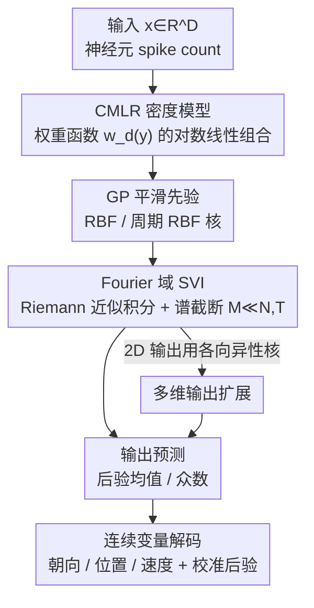

# Continuous Multinomial Logistic Regression for Neural Decoding

**会议**: ICLR2026  
**OpenReview**: [https://openreview.net/forum?id=theeeNBSTG](https://openreview.net/forum?id=theeeNBSTG)  
**代码**: 待确认  
**领域**: 计算神经科学 / 神经解码 / 条件密度估计  
**关键词**: 神经解码, 多项逻辑回归, 高斯过程, 条件密度估计, 变分推断

## 一句话总结
本文把经典的多项逻辑回归（MLR）从"有限离散类别"推广到"连续输出空间"，提出 CMLR：用一组带高斯过程先验的平滑权重函数 $w_d(y)$ 取代离散类别权重，从而把神经群体活动映射成关于连续变量（朝向、位置、速度等）的完整条件概率密度；配合 Fourier 域的随机变分推断使其能在上万神经元规模上高效训练，在小鼠/猴的视觉皮层、海马、运动皮层数据上普遍优于 DNN、XGBoost 和 FlexCode。

## 研究背景与动机
**领域现状**：神经解码（neural decoding）要从神经活动反推行为或感觉变量，是系统神经科学的核心问题。二分类任务上逻辑回归是基础工具，多分类则用多项逻辑回归（MLR）——为每个离散类别学一个权重向量，再用 softmax 给出类别概率。

**现有痛点**：很多神经解码任务的目标变量本质是**连续**的——时间、朝向、头朝向、空间位置、速度。MLR 这类分类器只能处理有限离散类别，要套用就得把连续输出"切 bin"离散化。离散化有三宗罪：① 降低有效分辨率；② 引入量化伪影；③ 为防止过拟合还得额外加正则。而普通回归模型（点预测）又只给一个数，无法表达**多峰、环形（circular）、非对称**的输出分布——可朝向解码天然是环形且常常双峰（0° 与 180° 难分）。

**核心矛盾**：研究者既想要分类器那样的**完整后验密度**（能表达不确定性、多峰、环形结构），又想避免离散化带来的分辨率损失和量化误差——离散类别数 $K$ 越大表达越细，但参数越多越容易过拟合，二者难以兼得。

**本文目标**：构造一个既保留 MLR 可解释加性结构、又能在**连续输出空间**上直接给出归一化密度的解码模型，并且要能扩展到上万神经元、上万样本的真实数据规模。

**切入角度**：作者观察到，MLR 给每个离散类别 $k$ 配一个权重向量 $w_k$，当类别无穷细分时，这串"按输出排序的离散权重"可以看作输出变量 $y$ 的一个**平滑函数** $w_d(y)$。于是把"$K$ 个权重向量"换成"$D$ 条权重函数"，就把 MLR 推到了连续极限。

**核心 idea**：用输出空间上的平滑权重函数（带 GP 先验）取代 MLR 的离散类别权重，把分类器变成一个连续输出的条件密度估计器——即 CMLR，$K\to\infty$ 时 MLR 的连续极限。

## 方法详解

### 整体框架
CMLR 把一个输入向量 $x\in\mathbb{R}^D$（如 $D$ 个神经元的 spike count）映射成输出变量 $y\in\Omega$ 上的一条概率密度。每个输入维度 $d$ 配一条权重函数 $w_d(y)$，描述该神经元的活动对"输出取 $y$"这件事的对数密度的加性贡献。条件密度写成对数线性形式：

$$p(Y=y\mid x)=\frac{\exp\!\big(w(y)^\top x\big)}{\int_\Omega \exp\!\big(w(y')^\top x\big)\,dy'},\qquad w(y)=[w_1(y),\dots,w_D(y)]^\top$$

分母是把密度归一到 1 的配分函数。和离散 MLR 的 $p(Y=k\mid x)=\exp(w_k^\top x)/\sum_j \exp(w_j^\top x)$ 一对照就能看出：CMLR 只是把"对 $K$ 个离散类求和"换成"对连续 $y$ 求积分"，把离散权重向量 $w_k$ 换成连续权重函数 $w_d(y)$。

整条流水线是：给权重函数加 GP 先验保证平滑 → 用 Riemann 积分近似配分函数中的积分 → 把权重函数搬到 Fourier 域并截断到少量基函数把推断变得可解、可扩展 → 随机变分推断联合优化变分参数与超参 → 训练完后在任意分辨率网格上算后验，取后验均值或众数作为点估计。

### 关键设计

**1. CMLR 密度模型：把 MLR 的离散类别权重换成连续权重函数**

这一步直接针对"MLR 只能处理离散类别、套到连续变量上要切 bin"的痛点。CMLR 不再为每个离散类别 $k$ 存一个权重向量，而是为每个输入特征 $d$ 存一条定义在整个输出域 $\Omega$ 上的权重函数 $w_d(y)$，密度由 $\exp(w(y)^\top x)$ 归一化得到。它和神经元的**调谐曲线（tuning curve）**概念上同构：$w_d(y)$ 刻画了第 $d$ 个神经元的活动如何抬高/压低"输出取 $y$"的密度，因此学出来的权重函数往往就长得像该神经元的调谐结构——这让 CMLR 不只是个解码器，还是个能直接可视化、跨神经元比较的群体编码探针。因为是对数线性加性结构，它继承了 MLR 的可解释性；又因为输出连续，它能自然表达点估计回归器表达不了的多峰、非对称、环形密度。

**2. 高斯过程平滑先验：用核函数约束权重函数，区分线性变量与环形变量**

如果对 $w_d(y)$ 不加任何约束，连续输出下参数其实是无穷维的，必然过拟合。作者给每条权重函数独立加一个零均值高斯过程先验 $w_d(y)\sim\mathcal{GP}(0,K_d)$，协方差用标准 RBF 核 $K_d(y',y'')=\rho_d\exp\!\big(-(y'-y'')^2/2\ell_d^2\big)$，其中幅度 $\rho_d$ 和长度尺度 $\ell_d$ 分别控制权重函数的强度与平滑度。关键的是对**环形变量**（如朝向 $\Omega=[0,2\pi)$）改用周期版 RBF 核 $K_d(y',y'')=\rho_d\sum_{m=-\infty}^{\infty}\exp\!\big(-(y'-y''+2\pi m)^2/2\ell_d^2\big)$，保证密度在单位圆上连续闭合——这正是朝向解码这类周期任务能被正确建模的原因，而点估计回归器对环形结构无能为力。

**3. Fourier 域随机变分推断：把无穷维推断压成低维、可扩展到上万神经元**

直接算条件密度里的配分积分和对权重函数做边缘化都不可解。作者分三步把它压成可算的有限维问题。其一，**Riemann 近似**：把输出域切成 $T$ 个等宽 bin，用 $\Delta\sum_{t=1}^T \exp(w(y_t)^\top x_n)$ 近似归一化积分。其二，**Fourier 域参数化**：利用 RBF 协方差在 Fourier 基下被对角化这一事实，把权重函数写成频域系数 $\omega_d$ 经正交基矩阵的线性组合 $w_d=B\omega_d$，频域系数独立服从 $\omega_{m,d}\sim\mathcal{N}(0,k_{m,d})$，再**截断到 $M\ll T,N$** 个基，把推断降到极低维，并消掉了矩阵求逆。其三，**随机变分优化**：假设变分后验在特征与频率上完全分解 $q(\omega)=\prod_{d,m}\mathcal{N}(\mu_{m,d},\sigma_{m,d}^2)$，最大化 ELBO

$$\mathcal{L}(\theta,\psi)=\mathbb{E}_{q_\psi}\!\big[\log p_\theta(\{x_n\}\mid w)\big]-D_{\mathrm{KL}}\!\big(q_\psi(w)\,\|\,p_\theta(w)\big)$$

其中 KL 项因高斯假设有闭式解，似然项里的 log-sum-exp 用 Monte Carlo 采样近似，再用小批量 + Adam 联合优化变分参数 $\{\mu_{m,d},\sigma_{m,d}\}$ 和 GP 超参 $\theta=\{\rho_d,\ell_d\}$（尺度参数在对数空间优化保正）。最终训练时间随神经元数 $D$ 线性增长（$D\approx2000$ 约 $10^3$ 秒），随样本数 $N$ 仅缓慢增长，且对 Fourier 分量数 $M$ 不敏感——这是它能上真实大规模数据的根本。

**4. 多维输出扩展与"相关性感知"：各向异性核 + 显式建模神经元共变**

很多解码目标是多维的（如 2D 光标速度）。CMLR 用**各向异性 RBF 核**给每个输出维度配独立长度尺度，把先验协方差推广到 $y=[y^{(1)},y^{(2)}]$，频域先验方差相应地变成两维频率的乘积形式，变分框架原样适用。更重要的是，CMLR 是个**相关性感知（correlation-aware）**解码器：它在似然里保留了神经元之间的共变结构，这与对照的 Naive Bayes 形成鲜明对比——后者假设给定输出后各神经元响应条件独立（correlation-blind），等于丢掉了噪声相关性。实验里 CMLR 全面超过同样用 GP 先验和 Fourier 推断、只差在"是否假设独立"的 NB，直接证明了建模噪声相关性对准确解码的重要性。

### 损失函数 / 训练策略
训练目标即上面的 ELBO，由"期望对数似然 −  KL 散度"两项构成。KL 项闭式可算；似然项中归一化常数用 Riemann 近似、log-sum-exp 用 Monte Carlo 采样。优化用 Adam + 小批量随机变分推断（批量 $N'\ll N$），所有尺度参数在对数空间优化以保正。每个数据集 CMLR 的超参固定、无需逐数据集调参，这也是它相对 DNN/XGBoost（需 Bayesian optimization 调参）的工程优势。训练完成后，在任意目标分辨率 $\delta$ 上构造解码 Fourier 基 $B_{\mathrm{dec}}$，softmax 得到完整后验，回归任务取后验均值 $\hat y_{\mathrm{mean}}=\sum_j \tilde y_j\,p(\cdot)$、最小化分类误差取后验众数 $\hat y_{\mathrm{mode}}=\arg\max_j p(\cdot)$。

## 实验关键数据

在小鼠 V1、猴 V1、小鼠海马 CA1、猴运动皮层四套真实神经数据上做 5 折交叉验证，对比 Naive Bayes、FlexCode、XGBoost、DNN。

### 主实验

| 任务 / 数据 | 指标 | CMLR | FlexCode | Naive Bayes | XGBoost | DNN |
|------|------|------|----------|-------------|---------|-----|
| 小鼠 V1 朝向解码 | 平均绝对环形误差 (°) | **3.1 ± 9.3** | 3.2 ± 5.5 | 4.9 ± 10.8 | 13.6 ± 23.4 | 18.3 ± 23.6 |
| 海马 CA1 位置解码 | 绝对误差 (归一化) | **0.15 ± 0.31** | 0.16 ± 0.30 | 0.16 ± 0.31 | 0.16 ± 0.13 | 0.18 ± 0.16 |
| 运动皮层 2D 速度 | $R^2$ | 0.53 | 0.35 | −0.43 | 0.55 | 0.58 |

- 朝向解码上 CMLR 误差最低（中位数 2.1°），大误差主要落在 180° 附近，反映朝向的内在双峰。
- 海马位置解码 CMLR 全程随分辨率 $J$ 增大保持领先。
- 运动皮层这种超大样本数据上 XGBoost/DNN 略高（高容量非线性模型在大数据占优属预期），但 CMLR 仍有竞争力，且额外提供完整条件密度和可解释调谐函数。

### 消融实验

| 配置对比 | 关键现象 | 说明 |
|------|---------|------|
| CMLR（相关性感知）vs Naive Bayes（相关性盲） | V1/CA1/运动皮层全面占优 | 证明建模神经元噪声相关性对解码的重要性 |
| 解码类别数 $J$ 扫描 | 误差随 $J$ 增大下降，$J\approx5000$ 后饱和 | 连续模型可在高分辨率极限做原则性评估，无需任意离散化 |
| 低数据量场景（减小 $D,N$） | CMLR 精度仅小幅下降，对 XGBoost/DNN 的领先反而更大 | GP 函数先验 + 加性结构提供强正则 |
| 后验校准（PIT 直方图 / 分位校准曲线） | CMLR 后验接近均匀、贴合对角线；FlexCode 系统性失校准 | CMLR 给出更可靠的不确定性估计 |

### 关键发现
- **相关性是关键**：CMLR 与 NB 只差在是否假设条件独立，前者全面胜出，说明噪声相关性携带了解码信息。
- **小数据优势最大**：函数先验 + 加性结构的强正则让 CMLR 在低数据/结构化（环形、多峰）输出上把点估计模型甩开。
- **后验校准好**：CMLR 的 PIT 直方图接近均匀、分位校准贴合对角线，而 FlexCode 出现峰化/多峰 PIT 与覆盖不足。
- **效率可接受**：训练时间随 $D$ 线性、随 $N$ 缓增、对 $M$ 不敏感；运行时间与 FlexCode 相当、快于 NB，虽慢于 XGBoost/DNN 但提供了它们没有的完整密度与校准不确定性。

## 亮点与洞察
- **"连续极限"视角很优雅**：把 MLR 的离散类别权重 $w_k$ 看成输出变量的离散采样，$K\to\infty$ 自然过渡到权重函数 $w_d(y)$——一个旧模型被干净地推广，且保留了加性可解释性。
- **权重函数即调谐曲线**：学出来的 $w_d(y)$ 直接对应神经元调谐结构，可视化、跨神经元比较，把解码器同时变成群体编码的分析工具，这是黑箱模型给不了的。
- **Fourier 域 + 谱截断**这套把"无穷维函数推断"压成"少量频域系数"的做法，可迁移到任何带 GP 先验、需扩展到大规模的隐函数推断问题。
- **环形变量的周期核处理**值得借鉴：凡是目标变量有周期性（朝向、相位、时钟）的任务，用周期 RBF 核能从根上避免点估计模型的边界失效。

## 局限与展望
- 作者承认在**超大样本**场景下，高容量非线性模型（XGBoost/DNN）的预测精度会更高，CMLR 定位是"可解释、数据高效的互补基线/诊断模型"，而非追求极致精度。
- 加性对数线性结构本质是**线性解码器**（权重函数对输入 $x$ 线性），无法捕捉神经活动到输出之间的强非线性交互，这也是它在大数据上不及 DNN 的根因之一。
- Riemann 近似与 Fourier 截断引入近似误差，bin 数 $T$ 与基数 $M$ 的选择虽然鲁棒，但仍是需要权衡的设计参数。
- 改进方向：在权重函数层引入特征交互项或浅层非线性映射，在保留可解释性的前提下提升大数据表达力；把校准良好的后验接入下游决策（如识别模糊刺激、估计解码置信度）。

## 相关工作与启发
- **vs 离散 MLR (Greenidge et al. 2024)**：离散 MLR 是 CMLR 在小 $J$ 极限下的特例；CMLR 把它推广到连续输出，能在高分辨率极限做原则性评估，避免任意离散化的量化误差。
- **vs Naive Bayes**：同样用 GP 先验和 Fourier 推断，但 NB 假设给定输出后神经元条件独立（相关性盲）；CMLR 显式建模共变，全面占优，证明相关性的价值。
- **vs FlexCode**：同为非参数条件密度估计 SOTA，但 FlexCode 用级数展开 + 随机森林估系数，后验系统性失校准；CMLR 后验校准更好、且权重函数可解释。
- **vs GP 回归 / GP 分类**：GP 回归把输出建成输入的 GP 函数（只给高斯预测），GP 分类把隐 GP 过非线性 link 得离散类别概率；二者都无法表达连续输出上丰富/结构化的密度。CMLR 把 GP 先验放在**输出空间上的权重函数**，才能灵活估计完整条件密度。
- **vs 混合密度网络 / 条件归一化流等 CDE 方法**：这些方法在高维下常受限于可扩展性、可解释性或统计鲁棒性；CMLR 以非参数加性结构提供可解释权重函数、支持多维输出、并靠结构化推断获得可扩展性。

## 评分
- 新颖性: ⭐⭐⭐⭐⭐ 首次把条件密度估计系统性地引入神经解码，MLR→连续的推广视角干净且有理论味。
- 实验充分度: ⭐⭐⭐⭐ 覆盖四套真实数据、五个对照、含校准与运行时分析，但缺与现代深度 CDE（如条件流）的直接对比。
- 写作质量: ⭐⭐⭐⭐⭐ 模型推导清晰，从离散 MLR 一路推到 Fourier 域 SVI，逻辑连贯。
- 价值: ⭐⭐⭐⭐⭐ 给系统神经科学提供了可解释、数据高效、后验校准良好的解码新基线，权重函数即调谐曲线的特性实用性强。

<!-- RELATED:START -->

## 相关论文

- [\[ICLR 2026\] Beyond Grid-Locked Voxels: Neural Response Functions for Continuous Brain Encoding](beyond_grid-locked_voxels_neural_response_functions_for_continuous_brain_encodin.md)
- [\[ICLR 2026\] Decoding Dynamic Visual Experience from Calcium Imaging via Cell-Pattern-Aware Pretraining](decoding_dynamic_visual_experience_from_calcium_imaging_via_cell-pattern-aware_p.md)
- [\[ICLR 2026\] Pretraining with Re-parametrized Self-Attention: Unlocking Generalization in SNN-Based Neural Decoding Across Time, Brains, and Tasks](pretraining_with_re-parametrized_self-attention_unlocking_generalizationin_snn-b.md)
- [\[NeurIPS 2025\] MEIcoder: Decoding Visual Stimuli from Neural Activity by Leveraging Most Exciting Inputs](../../NeurIPS2025/computational_biology/meicoder_decoding_visual_stimuli_from_neural_activity_by_leveraging_most_excitin.md)
- [\[ICLR 2026\] Coupled Transformer Autoencoder for Disentangling Multi-Region Neural Latent Dynamics](coupled_transformer_autoencoder_for_disentangling_multi-region_neural_latent_dyn.md)

<!-- RELATED:END -->
