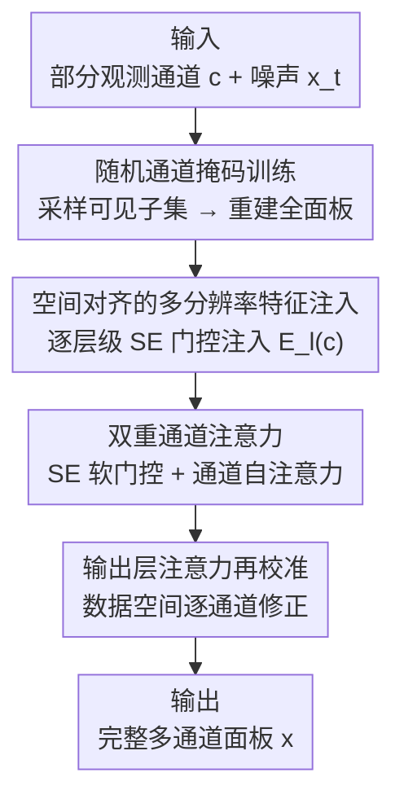

# Controllable Diffusion-based Generation for Multi-channel Biological Data

**会议**: ICLR2026  
**OpenReview**: [https://openreview.net/forum?id=t7wIerUT2E](https://openreview.net/forum?id=t7wIerUT2E)  
**代码**: https://github.com/tansey-lab/MCD  
**领域**: 扩散模型 / 计算生物学  
**关键词**: 多通道扩散、空间组学补全、随机通道掩码、通道注意力、摊销条件生成

## 一句话总结
本文提出多通道扩散框架 MCD，用"随机通道掩码训练 + 多分辨率空间条件注入 + 双重通道注意力"让单个扩散模型能在任意"已观测/缺失通道"组合下补全完整通道面板，在空间蛋白组学、单细胞基因到蛋白翻译、MRI 缺失模态合成上都拿到 SOTA。

## 研究背景与动机
**领域现状**：成像质谱流式（IMC）、空间转录组（Xenium/ST）等生物剖析技术产出的是**多通道数据**——每个通道对应一种蛋白标记或基因表达，同一像素/细胞上是多个空间共配准的生物信号。把扩散模型用到这类数据上做生成与补全，是近年很自然的方向。

**现有痛点**：现有生成模型几乎都是为低维自然图像（RGB 三通道）设计的。它们用的条件注入方式——全局 embedding、把条件拍平后拼接、FiLM 调制——会**破坏空间对应关系**：生物数据里条件通道和待生成通道是逐像素空间对齐的，一旦拍平/全局化，这种对齐就丢了。即便是 ControlNet/BrushNet 这类保留空间对齐的多尺度条件方法，也假设输入通道数很少（$n\le 3$），且条件编码模块和主生成网络分开训练，缺乏端到端协同，更没法建模几十上百个语义各异通道之间的关系。

**核心矛盾**：生物通道之间的依赖是**稀疏、非线性、非对称、且上下文相关**的——有的蛋白只在特定空间小生境或细胞类型里共定位，有的则互斥。同时实验约束导致每次只能测到部分信号（IMC 约 50 个蛋白、Xenium 500–5000 个基因），临床扫描还会因患者运动、扫描时间限制而缺通道。于是模型必须同时满足四件相互纠缠的事：① 生成结果与条件**空间对齐**；② 把条件当成**多分辨率结构化信息**而非全局向量；③ 建模**复杂跨通道依赖**；④ 在测试时**泛化到任意条件–目标组合**，包括训练没见过的配置。

**本文目标**：学一个条件分布 $p(x\mid c)$，其中 $x\in\mathbb{R}^{C\times H\times W}$ 是完整面板、$c\in\mathbb{R}^{C_o\times H\times W}$ 是任意已观测子集，且要尊重空间结构、对任意 $c$ 灵活。

**切入角度**：与其为每个目标通道训一个专用模型，不如让**一个模型条件于任意子集、永远重建完整面板**；要做到这点，就用"随机掩码哪些通道当条件"的训练方式去摊销整个条件空间。

**核心 idea**：把"随机通道掩码"当成对条件空间的**摊销推断（amortized inference）**——训练时随机采样可见通道子集、强制重建全通道，再配上保空间对齐的多分辨率条件注入和双重通道注意力，用一个统一扩散模型覆盖整族条件分布 $\{p(x\mid c)\}$。

## 方法详解

### 整体框架
MCD 是一个**双网络扩散架构**：一条**扩散网络**对加噪目标 $x_t$ 去噪，一条平行的**条件网络**编码已观测通道 $c$。在每个分辨率层级 $\ell$，扩散编码器产出特征 $D_\ell(x_t)$，条件编码器产出空间对齐的条件特征 $E_\ell(c)$；后者经过 SE 门控后**逐层级注入**到扩散网络对应分辨率上，保证空间对齐与有效的空间条件化。UNet 块内部插入通道注意力模块来建模跨通道依赖，训练时用随机通道掩码保证对任意通道组合的泛化。整体上：输入是"部分观测通道 $c$ + 噪声目标 $x_t$"，输出是去噪后的**完整通道面板** $x$，整个过程可在测试时接受任意可见通道组合而无需改架构或重训。

### 关键设计

**1. 随机通道掩码：把"任意条件组合"变成一次摊销训练**

针对的痛点是"实验测哪些通道不固定、还得泛化到没见过的可见配置"。做法很直接（Algorithm 1）：每次迭代独立用伯努利 $\mathrm{Bern}(p)$ 采样一个观测集合 $S_o\subset\{1,\dots,C\}$，把其余通道 $S_m$ 在条件 $c$ 里**置零**，而目标始终是完整面板 $x$——
$$c_i = \begin{cases} x_i, & i\in S_o \\ 0, & \text{otherwise}\end{cases}$$
模型按标准 EDM 目标在全通道 $x$ 上去噪，掩码只作用在条件上。这等价于优化一个**摊销条件目标**
$$\mathbb{E}_{c\sim p(c)}\,\mathbb{E}_{t,x_0,\epsilon}\big[\lVert \epsilon - \epsilon_\theta(x_t,t,c)\rVert^2\big]$$
其中 $p(c)$ 是条件配置（可见通道组合）在条件空间 $\mathcal{C}$ 上的分布。最小化它，单个估计器 $\epsilon_\theta(x_t,t,c)\approx \nabla_{x_t}\log p(x_t\mid c)$ 就隐式建模了整族条件分布 $\{p(x\mid c)\}$。和 classifier-free guidance 的区别在于：CFG 是在推理时在"有条件/无条件"预测之间插值，而这里是在**训练时采样条件子集**学一个统一条件模型；好处是避免了逐通道的专用 head 或逐通道分开训练，一次训练就能在任意（含未见）配置下补全，作者实测它能稳健泛化到测试时未出现过的掩码模式。

**2. 空间对齐的多分辨率特征注入：让条件既管局部细节又管全局结构**

针对"naive 条件注入破坏空间对齐"。MCD 在每个分辨率层级 $\ell$ 把条件特征 $E_\ell(c)$ 直接对齐叠加到扩散特征上：
$$z_\ell = D_\ell(x_t) + \mathrm{SE}\big(E_\ell(c)\big)$$
这里 $\mathrm{SE}(\cdot)$ 是 Squeeze-and-Excitation 软通道注意力（见设计 3），它**保持空间维度**、只对条件特征图做逐通道门控后再逐元素相加——所以注入是"有选择地放行条件"，而非简单加法，空间对应关系被完整保留。关键在于条件不再被压成一个固定全局表示，而是一组随分辨率变化的上下文特征 $\{E_\ell(c)\}_{\ell=1}^L$：编码器浅层更关注局部结构、深层负责高层全局结构，正好对上"$x$ 里有的模式依赖 $c$ 的局部细节、有的依赖全局母题"的直觉。

**3. 双重通道注意力 + 输出层再校准：建模稀疏非对称的跨通道依赖**

针对"生物通道间是非线性、非对称、上下文相关的复杂依赖"，而多数扩散模型只做空间注意力、忽略通道关系。MCD 用两个互补模块。其一是轻量 **SE 软注意力**（即注入用的那个），对潜在特征图 $z\in\mathbb{R}^{D\times H\times W}$：
$$\alpha=\mathrm{GAP}(z),\quad w=\sigma\big(W_2\,\phi(W_1\alpha)\big),\quad z'=w\cdot z$$
它用全局上下文给每个潜在通道学一个缩放权重，做逐通道重加权，轻量且能稳住分层注入。其二是在 UNet 块内对所有潜在通道做 **通道自注意力**：把特征摊平成 $x_\text{flat}\in\mathbb{R}^{D\times N}$（$N=H\times W$），算 $Q,K,V$ 后
$$A=\mathrm{softmax}\!\Big(\frac{QK^\top}{\sqrt{d}}\Big),\quad x'_\text{flat}=AV$$
比 SE 更有表达力，能捕捉潜在通道间的**高阶依赖**——它不是各通道独立重加权，而是让信息在通道间通过学到的交互传播，恰好对应生物通道"模型要跨通道推断缺失信息"的需求。此外在模型**最后阶段**（潜在通道映射到数据通道处）再加一层 SE 式输出注意力：$\hat{y}_\text{attn}=y+\mathrm{Conv}_1(\mathrm{SE}(y))$，在**数据空间**做最终逐通道再校准。两者合起来提供"自适应门控（SE）+ 结构化通道交互（自注意力）"，在异质条件配置下做稳健的特征调制。

### 损失函数 / 训练策略
训练用标准 EDM（Karras et al., 2022）去噪目标，作用在完整通道目标 $x$ 上，二值掩码只施加在条件 $c$ 上（设计 1 的 Algorithm 1）。单细胞 CITE-seq 任务因为目标和条件通道都固定，**不用**随机掩码训练。作者还把扩散模型用 SiD 蒸馏成**一步生成**变体，精度基本不掉，推理成本降两个数量级，利于大规模部署。

## 实验关键数据

### 主实验

单细胞基因→蛋白翻译（CITE-seq，4 个数据集，报告细胞级相关 $r_c$ 与蛋白级相关 $r_p$，后者更具生物学意义）：

| 数据集 | 指标 | 本文(500步) | 次优基线 |
|--------|------|------|----------|
| PBMC | $r_p$ | **0.673** | 0.646 (KRR) |
| CBMC | $r_p$ | **0.763** | 0.628 (UnitedNet) |
| BMMC | $r_p$ | **0.685** | 0.634 (UnitedNet) |
| HSPC | $r_p$ | **0.647** | 0.598 (scMM) |

MCD 在每个数据集上都拿到最高蛋白级相关 $r_p$；SiD 蒸馏的一步变体（如 PBMC $r_p=0.672$）几乎无损。

空间蛋白组学 IMC 补全（Pearson $r$，乳腺/肺癌队列）：

| 方法 | Breast | Lung |
|------|--------|------|
| 最相关单蛋白 | 0.481 | 0.506 |
| 核岭回归 | 0.489 | 0.527 |
| ControlNet | 0.452 | 0.537 |
| Virtues / Stem(领域专用) | 0.398/0.403 | 0.425/0.475 |
| 本文(单通道) | **0.667** | **0.703** |
| 本文(多通道) | 0.596 | 0.647 |

多数基线甚至打不过"最相关单蛋白"这个朴素预测器，MCD 大幅领先。

MRI 缺失模态合成（BraTS）：MCD 的 DICE 0.738、SSIM$_\text{global}$ 0.928，全面超过 BraTS 2024 冠亚军 HF-GAN（0.714/0.919）与 SwinUNETR（0.709/0.916）。

### 消融实验

| 配置 | 现象 | 说明 |
|------|------|------|
| 单通道 vs 多通道训练 | 单通道 0.667/0.703 > 多通道 0.596/0.647 | 摊销多任务的容量权衡：固定目标通道时模型能把容量集中在单一条件分布 |
| union vs intersection（跨数据集） | union 平均 Pearson 更高 (Fig.3b) | 用所有蛋白通道并集+零填充，比只保留两数据集共有的 23 个蛋白学到更丰富的跨通道依赖 |
| 各组件 | 每个都提升生成质量 (Appendix B.2) | 注入机制+两类通道注意力缺一不可 |

### 关键发现
- **随机掩码确实带来真泛化而非记忆**：测试时刻意用训练未出现的通道子集做掩码，MCD 仍能成功重建，说明它学到的是对条件空间的摊销，而非记住固定的条件–目标配置。
- **多数据集整合不需完美通道对齐**：零填充未观测通道 + 训练时采样条件子集，让模型从部分重叠的面板里推断条件结构，union 设置稳定优于 intersection，验证随机掩码是"异质监督下联合学习"的原则性手段。
- **容量权衡可解释**：多通道模型把容量摊到所有缺失配置上，单点精度略低于单通道专模，但仍全面超基线，换来一个模型通吃任意配置的实用性。

## 亮点与洞察
- **把"随机 dropout 条件"重新诠释为对条件空间的摊销推断**：这让"训练一次、测试任意可见通道组合"有了概率视角的解释（隐式建模 $\{p(x\mid c)\}$ 整族），思路可迁移到任何"观测变量集合会变"的补全/翻译任务。
- **SE 门控既当条件注入器又当软注意力**：同一个 SE 块保空间维度做逐通道门控，既保证注入时的空间对齐、又顺手做了通道重加权，一举两得且轻量。
- **统一框架打通空间与非空间**：把问题抽象成 $C=C_o+C_m$ 的多通道补全后，$H=W=1$ 退化成单细胞向量预测、$H,W>1$ 是空间成像，RGB inpainting/colorization 都是它的特例——这种统一表述本身很漂亮。
- **一步蒸馏即插即用**：SiD 蒸馏几乎无损地把推理成本降两个数量级，说明该方法在保精度的同时具备部署可行性。

## 局限与展望
- 作者承认这是方法学工作，主要在生物图像生成任务上验证；未来要**扩到更大更多样的空间队列**、引入更丰富的生物先验、面向真正的生物学发现。
- 摊销带来的容量权衡是真实代价：多通道模型单点精度低于单通道专模，超大通道面板下这一差距是否会放大、是否需要更大模型，文中未深究。
- 随机掩码用独立 $\mathrm{Bern}(p)$ 采样可见通道，**忽略了通道间被采样的相关性**（现实里某些通道往往成组测量），更贴合实验协议的结构化掩码分布可能进一步提升。
- 跨数据集整合靠零填充对齐通道空间，当不同平台通道语义不完全一致（同名蛋白不同抗体）时是否还稳健，需要更多验证。

## 相关工作与启发
- **vs ControlNet / BrushNet**：它们也做空间对齐的多尺度条件，但假设输入低维（$n\le3$）、条件编码与主网络分开训、不建模跨通道依赖；MCD 端到端协同、显式做通道注意力、且面向几十上百通道，所以在 IMC 上大幅领先 ControlNet。
- **vs Classifier-free guidance**：CFG 在推理时插值有/无条件预测；MCD 借其"训练时掩码条件"的内核，但改成采样条件子集学单一统一条件模型，得到的是对任意可见集合的摊销估计器，而非一个 guidance 标量。
- **vs SENet 等通道注意力**：以往通道注意力多在视觉骨干里、扩散模型几乎只关注空间注意力；MCD 把 SE 软注意力与通道自注意力组合进扩散去噪，专门服务多通道生物数据的非对称跨通道建模。
- **vs 单细胞模态翻译（UnitedNet/scMM/GLUE 等）**：这些方法多为特定模态对设计、各自训练；MCD 用一个扩散先验统一覆盖单细胞翻译、空间补全、MRI 合成，并在蛋白级相关上全面更优。

## 评分
- 新颖性: ⭐⭐⭐⭐⭐ 把随机通道掩码重诠释为条件空间的摊销推断，并用统一表述打通空间/非空间多通道补全
- 实验充分度: ⭐⭐⭐⭐⭐ 覆盖单细胞、空间蛋白组学、跨数据集泛化、MRI 三大类任务，含未见配置泛化与一步蒸馏
- 写作质量: ⭐⭐⭐⭐ 结构清晰、动机与方法对应紧密；部分理论论证下放附录
- 价值: ⭐⭐⭐⭐⭐ 给实验受限的生物剖析面板提供 in silico 扩展，朝"空间/多模态生物剖析基础模型"迈进一步

<!-- RELATED:START -->

## 相关论文

- [\[ICLR 2026\] Controllable Sequence Editing for Biological and Clinical Trajectories](controllable_sequence_editing_for_biological_and_clinical_trajectories.md)
- [\[ICLR 2026\] Hierarchical Multi-Scale Molecular Conformer Generation](hierarchical_multi-scale_molecular_conformer_generation.md)
- [\[ICML 2026\] CountsDiff: A Diffusion Model on the Natural Numbers for Generation and Imputation of Count-Based Data](../../ICML2026/computational_biology/countsdiff_a_diffusion_model_on_the_natural_numbers_for_generation_and_imputatio.md)
- [\[ICLR 2026\] VCWorld: A Biological World Model for Virtual Cell Simulation](vcworld_a_biological_world_model_for_virtual_cell_simulation.md)
- [\[AAAI 2026\] Investigating Data Pruning for Pretraining Biological Foundation Models at Scale](../../AAAI2026/computational_biology/investigating_data_pruning_for_pretraining_biological_foundation_models_at_scale.md)

<!-- RELATED:END -->
