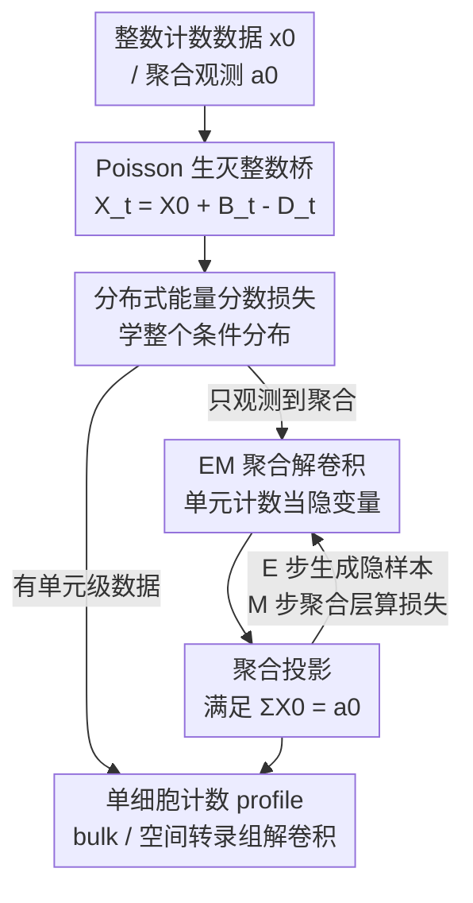

# Count Bridges enable Modeling and Deconvolving Transcriptomic Data

**会议**: ICLR2026  
**OpenReview**: [https://openreview.net/forum?id=4nOZBufbLC](https://openreview.net/forum?id=4nOZBufbLC)  
**代码**: 有（论文中提供匿名仓库链接）  
**领域**: 计算生物学 / 生成模型 / 离散扩散 / 转录组解卷积  
**关键词**: 计数数据、随机桥、Poisson 生灭过程、解卷积、单细胞转录组

## 一句话总结
本文提出 Count Bridges——一个定义在整数格 $\mathbb{Z}^d$ 上、由 Poisson 生灭过程驱动的随机桥模型，为计数数据提供了扩散模型的精确可解析对应；并通过 EM 把"只观测到聚合计数"的解卷积纳入同一框架，在合成分布匹配、bulk RNA-seq 核苷酸级解卷积和空间转录组 spot 解卷积上都达到 SOTA。

## 研究背景与动机
**领域现状**：现代生物测量（RNA 测序、荧光成像、质谱流式）本质上输出的是"分子计数"这种**整数值**数据。但近年火热的生成框架——扩散模型、流匹配——大多是为连续欧氏空间设计的；扩散往数据上加高斯噪声、学一个去噪器，天然假设状态可以取任意实数。

**现有痛点**：把生成模型搬到计数数据上有两类做法都不理想。一类是**离散扩散**（D3PM、SEDD 等），它们把计数当成无序的类别，用 masking 或 uniform 噪声来腐蚀，完全丢掉了计数本身的**序结构**（5 比 3 大、和 100 在"远近"上不同）。另一类计数专用的 Blackout Diffusion 用的是**纯死亡过程**，只能把图像逐步打到全零，没法在两个任意分布之间做传输。与此同时，生物里的解卷积文献（cell2location、RCTD、CIBERSORTx）只输出**细胞类型的比例**（cluster 级），而不是真正的单细胞计数 profile。

**核心矛盾**：一个理想的框架需要同时满足三点——尊重计数的整数与序结构、能在任意两个分布间传输、还能系统性地从聚合观测里反推出单元级别的细节；现有方法没有一个能三者兼顾。而生物上最关键的需求恰恰是后者：Visium 每个 spot 混了 10–50 个细胞、bulk RNA-seq 把几千到上百万个细胞平均成一条读数，把这些聚合体**解卷积**回单细胞 profile 对刻画细胞异质性、细胞间互作、组织结构至关重要。

**本文目标**：(1) 造一个原生支持整数计数、能在任意分布间传输的扩散式生成模型；(2) 把它扩展成能直接从聚合观测训练、推断单元级 profile 的解卷积器。

**切入角度**：作者注意到扩散模型的本质是一族满足"桥一致性"和"投影后验"两条性质的桥核。只要在整数上找到一个**有闭式条件分布**的随机过程来替代高斯过程，就能整套照搬扩散的训练-采样范式。

**核心 idea**：用一对独立的 **Poisson 生/灭过程**（增/减计数）构造整数上的随机桥，得到精确可采样的闭式条件分布；再用 EM 把单元级计数当作隐变量，从聚合数据里把模型训出来。

## 方法详解

### 整体框架
Count Bridges 的整体思路分两层。**第一层是生成建模**：给定数据分布 $p_0$（如单细胞计数）和一个简单源分布 $p_1$（如 Poisson 噪声），构造一个在 $\mathbb{Z}^d$ 上从 $X_1$ 走到 $X_0$ 的随机桥；桥的"加噪"用生灭过程实现——每个时刻随机让计数 $+1$ 或 $-1$。由于这个过程有闭式的条件分布，可以像扩散一样训练一个去噪器 $q_\theta(x_0\mid x_t,t)$ 来近似后验 $X_0\mid X_t$，再沿着桥多步采样还原数据。因为空间是离散的，去噪器不能只学条件均值，必须用**分布式损失**（能量分数）来学整个条件分布。

**第二层是解卷积**：现实里我们往往只看得到聚合量 $a_0=\sum_g x_{g0}$（一个 spot 里所有细胞的计数和），看不到单元级向量 $x_0$。作者把它写成一个**广义 EM 问题**，单元级计数 $X_0$ 是隐变量、聚合 $a_0$ 是观测。E 步用"投影引导采样"在满足聚合约束的前提下生成隐的单元级样本 $x_0^\approx$；M 步用这些样本、但**在聚合层面**计算损失来更新模型。整条管线如下：

### 关键设计

**1. Poisson 生灭整数桥：用闭式条件分布把扩散搬到整数格上**

针对"扩散是为连续空间设计、离散方案丢掉序结构"这个痛点，作者用一对独立的 Poisson 生/灭过程构造前向核。定义一个递增的跳跃强度 $w(t)$（$w(0)=0,w(1)=1$），累计生/灭强度 $\Lambda^\pm(t)=\lambda^\pm w(t)$，于是出生数 $B_t\sim\mathrm{Poi}(\Lambda^+(t))$、死亡数 $D_t\sim\mathrm{Poi}(\Lambda^-(t))$，无条件前向核为

$$X_t = X_0 + B_t - D_t.$$

关键在于这个过程有**闭式的桥条件分布** $K_{s|0,t}$。作者引入位移 $d_t=X_t-X_0$、总跳数 $N_t=B_t+D_t$ 和松弛变量 $M_t=\min(B_t,D_t)$，三者任意两个决定第三个（$N_t=|d_t|+2M_t$）。借助 Poisson 的叠加/稀释性质，在给定终点 $(x_0,x_t)$ 后，可以先用一个 Bessel 分布采松弛 $M_t\mid d_t\sim\mathrm{Bes}(|d_t|;\Lambda^+,\Lambda^-)$，再用**二项分布**采 $N_s\mid N_t\sim\mathrm{Bin}(N_t, w(s)/w(t))$、**超几何分布**采 $B_s$，即可精确还原中间状态。这套闭式分布满足扩散所需的"桥一致性"和"投影后验"两条性质（命题 3.1），所以多步采样等价于直接从 $(0,1)$ 桥采样，模型不会漂出训练分布。生灭机制既允许任意整数分布间的双向传输（弥补 Blackout 纯死亡的局限），又因为增减都尊重计数的自然序而保住了序结构。作者还实现了定制 CUDA 的快速 Bessel 采样器以支撑大规模采样。一个漂亮的副产品：当 $d_t$ 增大时松弛 $M_t$ 集中到 0，说明 Count Bridges 其实是**静态 Schrödinger 桥**的一个实例——它在求解熵正则的最优传输，跳跃强度 $\kappa=\sqrt{\lambda^+\lambda^-}$ 扮演的角色和高斯情形里的噪声尺度 $\sigma$ 完全对应（$\kappa\to 0$ 退化为以 $|x_1-x_0|$ 为代价的离散 OT）。

**2. 分布式能量分数损失：在离散空间里学整个条件分布而非均值**

连续扩散里去噪器只学条件均值 $\mathbb{E}[X_0\mid X_t]$ 就够，但在离散/跳跃过程里 ELBO 是"分布式"的、无法约化成点估计（Holderrieth et al. 2024），所以必须学整个条件分布。最朴素的做法是交叉熵，但它有两个毛病：不利用格点几何，且无法建模 $X_s\mid X_t$ 的联合分布（维度上指数爆炸，只能逐坐标独立或自回归近似）。作者改用一个**严格 proper 的能量分数**作为损失。固定一个负型半度量 $\rho$（实验取 $\rho(x,x')=\|x-x'\|_2^{\beta}$，$\beta=1$），对去噪器 $q_\theta$ 的输出定义

$$S_\rho(p,y)=\tfrac12\,\mathbb{E}_{X,X'\sim p}\big[\rho(X,X')\big]-\mathbb{E}_{X\sim p}\big[\rho(X,y)\big],$$

训练目标 $L(\theta)=\mathbb{E}_{X_0,X_t,t}\big[S_\rho(q_\theta(\cdot\mid X_t,t),X_0)\big]$。实践中只需从 $q_\theta$ 采 $m$ 个样本做无偏 plug-in 估计即可。相比交叉熵，能量分数把计数几何（坐标间的距离）写进了损失，且天然支持联合分布建模，这正是 Count Bridges 在高维上 scale 更好的原因。

**3. EM 聚合解卷积：把单元级计数当隐变量、从聚合数据直接训练**

针对"现实只观测到聚合 $a_0$、看不到单元级 $x_0$"这一核心难题，作者把解卷积写成广义 EM。设线性聚合映射 $A:\mathbb{Z}^G\to\mathbb{Z}$（如逐元素求和），去噪器在 $X_0=(X_{10},\dots,X_{G0})$ 上给出 i.i.d. 乘积先验，条件在聚合上得到目标后验

$$Q_\theta(X_0\mid a_0,x_t,t,z)\propto\Big[\prod_{g=1}^{G} q_\theta(X_{g0}\mid x_t,t,z)\Big]\,\mathbf{1}\{A(X_0)=a_0\}.$$

这个分布一般不可直接采样。**E 步**用"投影引导采样"近似它（算法 3）：从 $x_1$ 出发跑反向采样，每一步先预测 $\hat x_0\sim q_\theta$，再把 $\hat x_0$ 投影到满足聚合约束得到 $\tilde x_0$，用 $\tilde x_0$ 作为预测终点走采样步，使聚合约束贯穿整条去噪轨迹，最终产出与约束一致的隐样本 $x_0^\approx$。**M 步**拿着这些单元级样本训练桥，但损失抬到聚合层面：把同一个 proper 分数升级为聚合分数 $S^A_\rho(p,a)=\tfrac12\mathbb{E}_p[\rho(A(X),A(X'))]-\mathbb{E}_p[\rho(A(X),a)]$，对地面真值聚合 $a_0$ 计算 $L_\mathrm{agg}$。这样模型从未见过单元级标签、只靠聚合监督，就能学会生成自洽的单元级 profile——这正是 bulk/spatial 解卷积的核心能力。

**4. 聚合投影：把"按比例缩放"证明成一阶近似，并可学一个更强的投影**

E 步里那一步"投影"是关键工程，作者给了理论与实用两版。命题 4.1 证明：在正则条件下，聚合条件律 $Q_\theta(\cdot\mid A_0=a_0)$ 容许一个一阶指数倾斜，对应的广义 KL 投影 $\Pi(x_0)=\arg\min_{y_0:A(y_0)=a_0} D_{\mathrm{KL}}(y_0\|x_0)$ 对逐元素求和而言恰好是**简单的按比例缩放** $\Pi(x_0)_g = a_0 x_{g0}/(\sum_{g'} x_{g'0})$。这说明生物里常用的 rescaling 并非 ad hoc，而是真后验在大样本下的一阶近似。当有单元级训练数据时，作者更进一步**学一个投影模块** $\Pi_\psi(\hat x_0,a_0,x_t,z)$——一个跨 batch 内细胞做注意力的小模块，用分布式损失训练它直接采 $X_0\mid A(X_0)=a_0$；为同时支持无约束与聚合条件推理，只在随机 10% 的样本上施加该投影。

### 损失函数 / 训练策略
生成建模阶段最小化能量分数 $L(\theta)$；解卷积阶段交替 E 步（投影引导采样产隐样本）与 M 步（聚合分数 $L_\mathrm{agg}$ 更新去噪器）。训练时随机 mask 细胞类型标签，使模型同时支持无条件与条件采样；投影模块仅在 10% 提供聚合的样本上启用，兼顾无约束与聚合条件两种推理。源分布在空间转录组实验中取 $X_1\sim\mathrm{Poi}(10)$。

## 实验关键数据

### 主实验
合成任务上，Count Bridges（CB）对比连续流匹配（CFM）与离散流匹配（DFM）：在"8 高斯→2 月牙"的整数化任务上 CB 在 $W_2$、Energy、MMD 三项均最优，轨迹呈 OT 状（DFM 轨迹则与几何解耦）；在低秩高斯混合的维度缩放实验（$d$ 从 4 增到 512）中 CB 的维度可扩展性最好。

bulk RNA-seq 核苷酸级解卷积（PBMC scRNA-seq，$10^6$ 细胞 / $10^3$ 供体）：

| 任务 | 指标 | 本文 CB | baseline | 提升 |
|------|------|---------|----------|------|
| 序列→表达预测 | Bulk MSE | **0.601** | Fine-tuned Enformer 2.590 | ↓ 大幅 |
| 序列→表达预测 | CT MSE | **1.410** | Fine-tuned Enformer 3.142 | ↓ 大幅 |
| 细胞类型比例解卷积 | JSD | **0.113** | CIBERSORTx 0.194 / MuSiC 0.313 | 最优 |
| 细胞类型比例解卷积 | RMSE | **0.073** | CIBERSORTx 0.109 | 最优 |
| 细胞类型比例解卷积 | Spearman | **0.267** | MuSiC 0.186 | 最优 |

空间转录组 spot 解卷积（MERFISH 小鼠脑，人工聚合成 Visium 式 spot，UViT 编码细胞核图像作为 side info）：

| 指标 | 本文 CB | STDeconvolve | 提升 |
|------|---------|--------------|------|
| JSD | **0.231** | 0.288 | 最优 |
| RMSE | **0.110** | 0.177 | 最优 |
| Spearman | **0.332** | 0.255 | 最优 |

CB 还在计数 profile 质量上超过"spot 均值 $a_0/G$"这一有生物学依据的强 baseline（MMD 0.203 vs 0.409、Energy 8.903 vs 41.717）。

### 消融实验

| 配置 | 关键发现 | 说明 |
|------|---------|------|
| 能量分数 vs 交叉熵 | 能量分数更优 | 交叉熵不利用格点几何、且需逐坐标分解，无法建模联合 |
| 单步桥 vs 两步桥 | ECDF 不可区分 | 验证桥的复合一致性（图 1 右） |
| 解卷积 vs 组大小 $G$ / 组间异质性 $\alpha$ | 组越大越均匀越差 | 与可识别性理论一致：解卷积需要组间异质性 |

### 关键发现
- **序结构 + 闭式条件分布是性能来源**：CB 的轨迹呈 OT 状而 DFM 与几何解耦，说明尊重计数序结构带来更合理的传输。
- **能量分数对高维 scale 至关重要**：交叉熵无法建模联合分布，CB 在 $d$ 增大时仍保持优势。
- **解卷积有理论上限**：随组变大、组间异质性消失，可识别性必然退化，因此 EM 在中等聚合规模最可靠（理论分析见附录 B.2/B.3）。

## 亮点与洞察
- **把扩散抽象成"两条桥性质"再换 backbone**：作者先把扩散提炼成桥一致性 + 投影后验两条性质，再证明 Poisson 生灭桥满足它们，于是整套训练-采样范式无缝平移到整数空间——这是非常干净的"换核不换框架"思路，可复用到其他离散结构。
- **生灭过程同时拿下"双向传输 + 保序 + 闭式"**：相比 Blackout 的纯死亡，加上出生就能在任意分布间传输；而 Bessel/二项/超几何这套闭式分布让精确采样成为可能，定制 CUDA Bessel 采样器是落地关键。
- **把生物里的 rescaling 提升为一阶近似**：命题 4.1 给"按聚合比例缩放"这一常见启发式做了理论背书，又顺势学了个更强的注意力投影模块，理论与工程衔接得很自然。
- **统一生成与解卷积**：同一个桥既能无条件生成、又能在聚合约束下做 EM 解卷积，迁移到任何"只观测到聚合计数"的场景（质谱、成像计数）都成立。

## 局限与展望
- **连续近似下未必占优**：当计数大到可近似为连续时，欧氏扩散可能持平甚至更好——CB 的优势主要在小计数、强离散的场景。
- **纯解卷积的可识别性有硬上限**：组越大、组间越同质，可识别性越差，EM 只在中等聚合规模可靠；这是问题本身的信息论限制，非方法可完全克服。
- **投影步缺乏严谨理论**：E 步用的投影是一阶代理，作者自承"缺乏 serious 理论支持"，投影引导采样器的收敛性、更紧的可识别性界都是未来工作。
- **个人观察**：解卷积评估大量依赖"人工聚合单细胞数据再还原"的合成设定（MERFISH 假装成 Visium、held-out 病人合成 bulk），真实 Visium/bulk 上缺乏单细胞 ground truth 时如何验证仍是开放问题。

## 相关工作与启发
- **vs Blackout Diffusion**：它用纯死亡过程把图像打到全零，只能单向、无法在任意分布间传输；CB 同时允许生与灭，$\kappa\to 0$ 时退化回它的纯出生构造，并推广为可双向传输的桥。
- **vs 离散扩散 / 离散流匹配（D3PM、SEDD、DFM）**：它们把计数当无序类别、用 uniform/masking 噪声，丢掉序结构；CB 原生建模序数计数，轨迹更贴几何、高维 scale 更好。
- **vs 生物解卷积方法（cell2location、RCTD、CIBERSORTx、MuSiC、STDeconvolve）**：它们输出 cluster 级细胞类型**比例**、且多数需要配对参考图谱；CB 直接输出单细胞**计数 profile**、且空间应用中无需外部参考（用细胞核图像作 side info）。
- **vs 分布式扩散（De Bortoli et al. 2025）**：CB 借用其"用 proper scoring rule 学条件分布"的思想，但把它落到整数格并配合生灭桥的闭式分布，解决了离散空间无法约化为条件均值的根本困难。

## 评分
- 新颖性: ⭐⭐⭐⭐⭐ 首个在任意整数分布间双向传输、且闭式可采样的计数生成桥，并统一了解卷积。
- 实验充分度: ⭐⭐⭐⭐ 合成 + bulk RNA-seq + 空间转录组三类任务全覆盖，但真实数据多靠合成聚合验证。
- 写作质量: ⭐⭐⭐⭐⭐ 从扩散抽象到整数桥的推导清晰，理论（Schrödinger 桥、一阶投影）与应用衔接自然。
- 价值: ⭐⭐⭐⭐⭐ 为计数数据生成与解卷积提供了有原则的基础框架，对单细胞/空间转录组有直接应用价值。

<!-- RELATED:START -->

## 相关论文

- [\[ICML 2026\] CountsDiff: A Diffusion Model on the Natural Numbers for Generation and Imputation of Count-Based Data](../../ICML2026/computational_biology/countsdiff_a_diffusion_model_on_the_natural_numbers_for_generation_and_imputatio.md)
- [\[ICLR 2026\] Doloris: Dual Conditional Diffusion Implicit Bridges with Sparsity Masking Strategy for Unpaired Single-Cell Perturbation Estimation](doloris_dual_conditional_diffusion_implicit_bridges_with_sparsity_masking_strate.md)
- [\[ICLR 2026\] Controllable Diffusion-based Generation for Multi-channel Biological Data](controllable_diffusion-based_generation_for_multi-channel_biological_data.md)
- [\[ICLR 2026\] Adaptive Data-Knowledge Alignment in Genetic Perturbation Prediction](adaptive_data-knowledge_alignment_in_genetic_perturbation_prediction.md)
- [\[ICLR 2026\] Drugging the Undruggable: Benchmarking and Modeling Fragment-Based Screening](drugging_the_undruggable_benchmarking_and_modeling_fragment-based_screening.md)

<!-- RELATED:END -->
