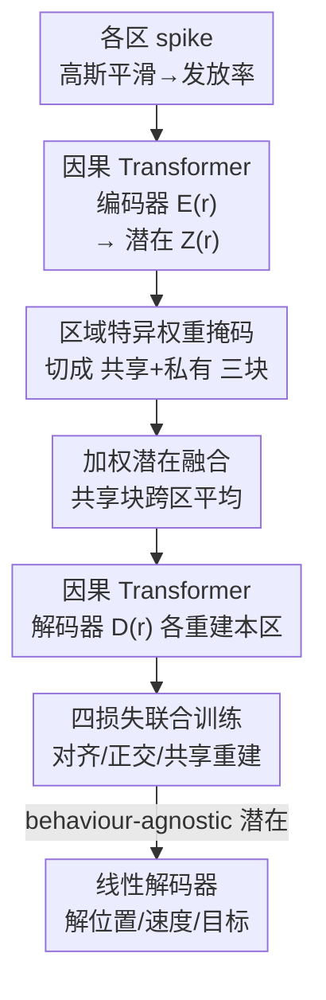

# Coupled Transformer Autoencoder for Disentangling Multi-Region Neural Latent Dynamics

**会议**: ICLR2026  
**OpenReview**: [https://openreview.net/forum?id=oeoCgcYIyf](https://openreview.net/forum?id=oeoCgcYIyf)  
**代码**: https://github.com/Mishne-Lab/ctae-multiregion （有）  
**领域**: 计算神经科学 / 神经潜在动态 / 表示解耦  
**关键词**: 多脑区神经记录、共享-私有解耦、Transformer 自编码器、通信子空间、潜在动态

## 一句话总结
CTAE 用一对（或多个）耦合的因果 Transformer 自编码器同时建模多个脑区的神经群体活动，把每个脑区的潜在空间显式切成「跨区共享」和「区域私有」两个正交子空间，靠四个损失函数把跨区共有的信号逼进共享块、把区域特有的信号留在私有块，从而在保留非平稳非线性时序动态的同时干净地分离共享与私有成分，下游用简单线性解码器就能比 DLAG/mDLAG 等线性方法更准地解出行为变量。

## 研究背景与动机
**领域现状**：Neuropixels 探针和体积钙成像让神经科学家能同时记录跨多个脑区、上千个神经元的活动。主流分析思路是「神经潜在动态」假说——高维群体响应其实是一条低维轨迹随时间演化的结果。单区分析有成熟工具：线性的 PCA/FA、加了时间平滑先验的 GPFA，以及用 RNN（LFADS）或自注意力（NDT）捕捉非线性非平稳动态的深度模型。

**现有痛点**：当把这些单区工具粗暴地搬到多区数据上（比如直接把多个脑区的记录拼接成一个大矩阵），它们会失效：脑区间的传导延迟会扭曲潜在空间、不同区相关结构的差异会让共享因子吸收掉私有方差、活动更强或通道更多的区会主导混合权重。另一条线是受 CCA 启发的联合潜变量模型（DLAG/mDLAG 等 GP 类方法，或多视角自编码器如 SPLICE、DMVAE），但 GP 类继承了平滑、线性读出假设，难以应对非平稳、长程依赖；多视角自编码器又大多把每个时间点当作 i.i.d. 样本，直接丢掉了时序结构。

**核心矛盾**：一个合格的多区潜在模型必须同时满足三个互相牵扯的要求——(i) 潜在轨迹要随时间平滑演化以尊重神经自相关；(ii) 要能容纳真实电路的非平稳、非线性动态；(iii) 要把共享和区域特有结构分开，而且不能随着脑区数量增加发生参数爆炸。现有方法没有一个能三者兼顾。

**切入角度**：作者借用神经科学里的「通信子空间」假说——脑区间的交流是通过一个持久的低维子空间介导的，这个子空间与各区私有的、区域特异的动态正交（output-null/potent 思想）。如果共享维度和私有维度天然正交，那就有可能从区域特异过程里干净地恢复出共享动态。

**核心 idea**：用 Transformer 编解码器当灵活的非线性时序先验来抓长程动态，同时把每个区的潜在空间用固定的 0/1 掩码切成「共享 + 私有」三块，再用一组损失把跨区共有信号挤进共享块、保证各子空间正交并对齐——在一个端到端框架里同时解决非线性动态和共享/私有分离。

## 方法详解

### 整体框架
问题设定：给定两个脑区同步记录的群体活动 $X^{(1)}\in\mathbb{R}^{N_1\times T}$、$X^{(2)}\in\mathbb{R}^{N_2\times T}$（$N_r$ 是通道数，$T$ 是时间步），假设每个时刻的观测是潜在变量的非线性变换，潜在变量包括跨区相关的共享动态 $S$（落在通信子空间里）和各区私有动态 $P^{(1)}, P^{(2)}$（落在与共享正交的子空间里）。目标是从 $X^{(1)}, X^{(2)}$ 中恢复出 $S, P^{(1)}, P^{(2)}$。

CTAE 给每个区配一对独立的「因果 Transformer 编码器 + 解码器」。输入不是原始 spike，而是先对 spike train 做高斯平滑得到的连续发放率估计。编码器 $E^{(r)}_\theta$ 用带自注意力的 Transformer 栈把整段多通道时序映射成潜在表示 $Z^{(r)}\in\mathbb{R}^{D\times T}$（$D$ 是总潜在维度）。关键在于：用一个固定的二值掩码 $w_r$ 把这 $D$ 维切成共享块（前 $d_s$ 维）+ 区域私有块，然后按掩码做加权融合得到统一潜在 $Z$；解码器 $D^{(r)}_\phi$ 只拿到与自己区相关的那部分潜在维度（用掩码把无关维清零），靠交叉注意力重建本区发放率。整套架构靠四个损失端到端训练，使共享块对齐、各子空间正交。多于两个区时（$R>2$）把正交损失推广到逐对脑区即可，参数不随区数指数膨胀。

### 关键设计

**1. 区域特异权重掩码：用固定 0/1 向量切出「共享+私有」结构，又不硬编码交互关系**

痛点是：直接拼接或用单一自编码器时，共享与私有信号会互相污染，强区还会主导混合权重。CTAE 把总潜在维 $D=d_s+d_1+d_2$ 划成三段连续索引集 $I_s, I_1, I_2$，构造两个二值向量 $w_1=[\mathbf{1}_{d_s}, \mathbf{1}_{d_1}, \mathbf{0}_{d_2}]^\top$、$w_2=[\mathbf{1}_{d_s}, \mathbf{0}_{d_1}, \mathbf{1}_{d_2}]^\top$：$w_1$ 激活「共享 + 区 1 私有」，$w_2$ 激活「共享 + 区 2 私有」。这些掩码全程固定，$(d_s,d_1,d_2)$ 当超参在验证集上调。巧的地方在于：掩码只规定了模型「最多」能分配多少共享/私有维度（上界），并不强制真实交互结构；训练中数据不支持的维度会自然塌缩到可忽略的方差。这样既给了清晰的结构控制，又不会把先验强加给数据。作者也指出掩码未来可由解剖先验初始化或做成可学习。

**2. 加权潜在融合：用掩码平均把两区的共享块对齐，私有块原样保留**

有了掩码后，需要把两个编码器各自输出的潜在合成一个统一的 $Z$。CTAE 对每个潜在维 $d$ 做掩码加权平均：

$$Z_t[d] = \frac{w_1[d]\,Z^{(1)}_t[d] + w_2[d]\,Z^{(2)}_t[d]}{w_1[d] + w_2[d]}.$$

私有块只被自己区的掩码激活（权重为 1），所以 $\hat P^{(1)}=Z_{I_1}=Z^{(1)}_{I_1}$、$\hat P^{(2)}=Z_{I_2}=Z^{(2)}_{I_2}$ 原样保留；共享块两区都激活，于是取两区平均 $\hat S=Z_{I_s}=\tfrac12(Z^{(1)}_{I_s}+Z^{(2)}_{I_s})$。这个平均操作本身就隐式逼着两个区的共享潜在对齐——因为后面要靠这个融合后的 $Z$ 去重建各区活动，若两区共享表示不一致，平均会破坏重建，梯度会把它们推到一致。解码时 $\hat X^{(r)}=D^{(r)}_\phi((w_r\mathbf{1}_T^\top)\odot Z)$，用外积把掩码沿时间复制再逐元素相乘，把与本区无关的潜在清零，强制每个解码器只依赖对自己区有意义的动态。

**3. 四损失协同：把共享信号逼进共享块、把各维推向正交**

这是真正决定解耦质量的部分，总目标是 $L = L_\text{rec} + \lambda_\text{align}L_\text{align} + \lambda_\text{shared}L_\text{shared} + \lambda_\text{orth}L_\text{orth}$，四项各司其职：

- **重建损失** $L_\text{rec}=\sum_r \lVert \hat X^{(r)}-X^{(r)}\rVert_F^2$：保证每个自编码器忠实重建本区活动，是潜在「有信息」的基础。
- **仅共享重建** $L_\text{shared}=\sum_r \lVert D^{(r)}_\phi((w^{(s)}\mathbf{1}_T^\top)\odot Z)-X^{(r)}\rVert_F^2$，其中 $w^{(s)}=w_1\odot w_2=[\mathbf{1}_{d_s},\mathbf{0},\mathbf{0}]^\top$ 是只选共享维的交集掩码。它要求「只用共享块」也能重建两区活动，从而把所有跨区共有的规律强制路由进共享子空间——没有这一项，共享信息会泄漏到私有子空间里。
- **对齐损失** $L_\text{align}=\sum_r \lVert (w_r\mathbf{1}_T^\top)\odot Z - (w_r\mathbf{1}_T^\top)\odot Z^{(r)}\rVert_F^2$：把每个编码器的共享输出对齐到两区平均，防止区域特异方差漏进共享空间。
- **正交损失** $L_\text{orth}=\lVert G-\text{diag}(G)\rVert_F^2$，其中 $G=\tfrac1T ZZ^\top$ 是潜在轨迹的经验 Gram 矩阵。只把非对角项（即各潜在维之间的相关）压向零，让任意一对潜在维（无论共享还是私有）都近似正交，促成全局解耦。

消融显示这三个正则项（对齐、正交、仅共享重建）缺一不可，去掉任一项共享子空间的解码精度都会明显下降——尤其去掉正交损失或仅共享重建损失，共享块解码精度会从 0.69 暴跌到 0.31~0.34。

### 损失函数 / 训练策略
四个损失的权重 $\lambda_\text{shared}, \lambda_\text{align}, \lambda_\text{orth}$ 在留出验证集上选。潜在维度 $(d_s,d_1,d_2)$ 同样作为超参在验证集上调。整个训练是端到端的，掩码固定不学。多于两区时把正交损失推广到逐对脑区，避免专家数或成对损失项随区数指数增长。下游解码用的是 behaviour-agnostic 的潜在表示，所以解位置、速度、认知状态等不同任务都能复用同一套嵌入、只换一个简单线性读出，无需重训编码器。

## 实验关键数据

### 主实验
作者用两个真实多区电生理数据集 + 一个合成数据集（附录）评测，主要对手是 GP 类的 DLAG / mDLAG，附录还比了 DeepCCA 和「拼接后单一 Transformer AE」。

**运动皮层 M1–PMd（猕猴中心向外伸手任务）**：208 试次、8 个伸手方向，PMd/M1 各 66/52 个神经元（64 通道 Utah array），每试 3s、100ms 分箱共 30 时间步。用两个线性解码任务评估潜在质量：连续解码手的位置、离散解码 8 选 1 的目标方向。

| 数据集 / 任务 | 评估方式 | CTAE 共享潜在 | DLAG / 基线 |
|--------------|---------|--------------|-------------|
| M1–PMd 连续手位置 | 线性回归 | 行为相关方差主要落在共享子空间，预测最准 | DLAG 把行为方差碎片化地分散到两区私有潜在 |
| M1–PMd 目标方向分类 | 多类逻辑回归 | 各方向分类一致性高 | DLAG 只对部分方向高准、出现方向特异碎片化 |
| DeepCCA / 拼接单 AE | 同上 | —— | 连续与离散精度都显著低于 CTAE 与 DLAG |

关键发现：CTAE 的共享潜在因子承载了伸手行为的大部分相关方差，符合「PMd 与 M1 通过一致的低维流形共同编码伸手运动学」的既有神经科学结论；而 DLAG 倾向把行为相关方差以方向各向异性的方式漏进私有子空间，说明它会无意中把共享信息泄漏到私有块，CTAE 的掩码结构 + 正则化则能阻止这种泄漏。

**多感觉电路 SC–ALM（小鼠多感觉辨别任务，三区）**：用 Neuropixels 记录上层 SC、深层 SC 与 ALM，动物整合视觉与触觉刺激判断目标侧（左/右）。作者用 $R>2$ 的多区版 CTAE 拟合这三区，推断出「全局共享 / 成对共享 / 区域私有」多种交互。结果显示深层 SC 与上层 SC、深层 SC 与 ALM 之间的共享子空间解码刺激类型和目标侧的精度都高于区域私有潜在，提示深层 SC 在该电路里更居中心、共享动态分别反映与上层 SC 的证据累积、与 ALM 的选择。作为对照，mDLAG 在同一数据上的共享/私有潜在相比原始活动几乎没有提升、解码在各子空间间弥散，反映了它线性观测假设的局限。

### 消融实验

| 配置 | 共享块解码精度 | Private M1 | Private PMd | 说明 |
|------|---------------|-----------|-------------|------|
| CTAE（完整） | 0.69 (0.03) | 0.22 (0.02) | 0.21 (0.03) | 行为信息集中在共享块、私有块低 |
| w/o 对齐损失 | 0.61 (0.02) | 0.16 (0.02) | 0.20 (0.02) | 共享对齐变弱、精度下降 |
| w/o 正交损失 | 0.31 (0.02) | 0.28 (0.02) | 0.29 (0.02) | 解耦崩坏，信息漏入私有块 |
| w/o 仅共享重建 | 0.34 (0.01) | 0.36 (0.01) | 0.37 (0.01) | 共享信息大量泄漏到私有块 |

（数值为预测伸手方向的准确率，括号是 5 折标准差。）

### 关键发现
- 正交损失和仅共享重建损失是解耦的关键：去掉任一项，共享块解码精度从 0.69 跌到 0.31~0.34，同时私有块精度反而升高——典型的「共享信息泄漏到私有子空间」征兆。
- 对齐损失贡献相对温和（0.69→0.61），但它专门防止区域特异方差漏进共享空间。
- CTAE 相比 DLAG 的优势不只是精度，更在于「把行为相关信息正确归位到共享块」，与神经科学上「PMd/M1 共享低维运动学流形」的认知一致，而 DLAG 会把信息碎片化分散。

## 亮点与洞察
- **用固定二值掩码做共享/私有划分**很巧：不引入额外可学习参数就规定了子空间结构上界，数据不支持的维度训练中自然塌缩，既可控又不过度约束——这个 trick 可迁移到任何需要「软切分表示子空间」的多视角学习。
- **加权平均融合隐式实现对齐**：不需要显式配对损失，靠「共享块取两区平均再去重建」就逼着两区共享表示一致，是个优雅的隐式约束。
- **正交 + 仅共享重建的组合拳**专治多视角学习里「私有块偷偷吸收共享信息」的老毛病，消融数据把这个泄漏问题量化得很清楚（0.69→0.31）。
- **可扩展性设计**：把正交损失推广到逐对脑区，使参数不随区数指数膨胀，直接支持 SC–ALM 三区分析——这是相对 DMVAE（专家数指数增长）、SPLICE（测量网络指数增长）的核心优势。

## 局限与展望
- **掩码固定、维度靠调参**：共享/私有维度 $(d_s,d_1,d_2)$ 是验证集上手调的超参，掩码也不学习，限制了对真实交互结构的自适应；作者把「可学习掩码 / 解剖先验初始化」留作未来工作。
- **输入是平滑发放率而非原始 spike**：高斯平滑会损失精细时序信息，作者提出未来直接在 spike 上训练、配 Poisson/负二项观测模型更贴合 spike 生成机制。
- **评估主要靠线性解码代理 + 两个真实数据集**：缺少更大规模、更多脑区、更多任务的系统验证；多区结论（如「深层 SC 更中心」）属于在特定任务上的观察，外推需谨慎。
- 多区扩展虽避免了参数指数爆炸，但成对正交损失的项数仍随区数平方增长，超大区数下的可扩展性还需检验。

## 相关工作与启发
- **vs DLAG / mDLAG（GP 类多区模型）**：它们用平滑 GP 先验 + 线性读出建模延迟潜在，难抓非平稳长程动态，且会把共享信息泄漏到私有块；CTAE 用 Transformer 抓非线性动态、用掩码 + 正则严格隔离共享/私有，解码更准、信息归位更干净。
- **vs DeepCCA / DCCAE（多视角相关对齐）**：CCA 类最大化瞬时相关但不保证捕获全部共享方差，DCCAE 加重建又有混入私有的风险；CTAE 的「仅共享重建 + 正交」组合显式把共享方差路由进共享块。
- **vs SPLICE / DMVAE / MVAE 等多视角自编码器**：这些方法要么把时间点当 i.i.d. 丢掉时序，要么辅助网络/专家数随视角指数增长，或假设单一全局共享成分；CTAE 既保留完整时序（因果 Transformer），又用逐对正交损失实现可扩展、且支持子集特异的共享潜在。
- **启发**：「掩码切子空间 + 仅共享重建 + 逐对正交」这套解耦范式不限于神经数据，可迁移到一般多视角时序（如神经-行为联合分析、多模态时序对齐），用来分离「跨视角共享」与「视角私有」的动态成分。

## 评分
- 新颖性: ⭐⭐⭐⭐ 首个同时满足非平稳非线性动态 + 时序连续 + 多区可扩展三要求的多区神经潜在模型，掩码+四损失的组合设计扎实。
- 实验充分度: ⭐⭐⭐⭐ 合成 + 两个真实多区数据集 + 多基线对比 + 损失消融，但规模和脑区数仍有限。
- 写作质量: ⭐⭐⭐⭐ 问题动机和损失设计讲得清楚，公式记号规范；部分结论依赖附录。
- 价值: ⭐⭐⭐⭐ 给多脑区神经数据分析提供了一个实用、可扩展、解耦干净的工具，代码开源，对计算神经科学社区有直接价值。

<!-- RELATED:START -->

## 相关论文

- [\[ICLR 2026\] Animal behavioral analysis and neural encoding with transformer-based self-supervised pretraining](animal_behavioral_analysis_and_neural_encoding_with_transformer-based_self-super.md)
- [\[ICML 2026\] Disentangling Latent Risk Pathways via Bayesian Hypergraph Inference](../../ICML2026/computational_biology/disentangling_latent_risk_pathways_via_bayesian_hypergraph_inference.md)
- [\[ICLR 2026\] Beyond Ensembles: Simulating All-Atom Protein Dynamics in a Learned Latent Space](beyond_ensembles_simulating_all-atom_protein_dynamics_in_a_learned_latent_space.md)
- [\[ICLR 2026\] OmniMouse: Scaling properties of multi-modal, multi-task Brain Models on 150B Neural Tokens](omnimouse_scaling_properties_of_multi-modal_multi-task_brain_models_on_150b_neur.md)
- [\[ICLR 2026\] FACET: A Fragment-Aware Conformer Ensemble Transformer](facet_a_fragment-aware_conformer_ensemble_transformer.md)

<!-- RELATED:END -->
