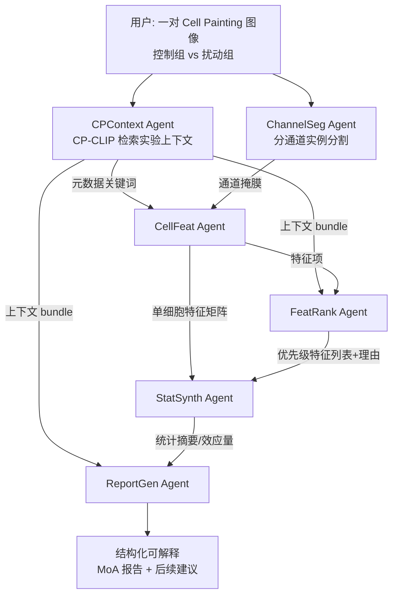

# CP-Agent: Context-Aware Multimodal Reasoning for Cellular Morphological Profiling under Chemical Perturbations

**会议**: ICLR 2026  
**OpenReview**: [https://openreview.net/forum?id=7BLnSeWuei](https://openreview.net/forum?id=7BLnSeWuei)  
**代码**: [https://github.com/letitia-zhang/CP-Agent](https://github.com/letitia-zhang/CP-Agent)  
**领域**: 计算生物学 / 表型药物筛选 / 多模态智能体  
**关键词**: Cell Painting, 高内涵成像, MoA 推断, CLIP 对齐, 实验上下文, Agentic MLLM, 药物发现  

## 一句话总结
CP-Agent 把"实验上下文感知的图文对齐模块 CP-CLIP"和"多智能体 MLLM 推理流水线"串成一条单遍管线，从一对 Cell Painting 显微图像出发，自动检索实验背景、分割提取单细胞形态特征、统计对比扰动组与对照组，最终生成可追溯、可解释的药物作用机制（MoA）报告。

## 研究背景与动机
**领域现状**：Cell Painting（细胞涂染）是表型药物筛选的主力技术——用多重荧光染色 + 高内涵成像，把细胞对化合物扰动的多尺度响应固化成高维形态学读数，支撑 MoA 推断、毒性预测、药物重定位、参考图谱构建等下游任务。近年涌现了一批 AI 方法，如 CLOOME 首次用 CLIP 范式把 Cell Painting 图像与分子结构对齐，MolPhenix、CellCLIP 进一步借助强单模态基础模型来对齐分子。

**现有痛点**：(i) **复杂的中间依赖**——形态响应高度依赖上下文，浓度相关的 profile 在不同剂量间相关性极低（Pearson r=0.21–0.26），MoA 预测对细胞系背景敏感，忽略这些结构会把生物学信号和采集伪影混为一谈，浪费宝贵的元数据；(ii) **形态收敛**——机制完全不同的化合物可能诱导出相似的形态读数，降低 MoA 分辨率；(iii) **缺乏语义接地**——把图像 embedding 当成无结构特征向量，限制了语义推理与下游生物学推断能力。

**核心矛盾**：现有药物筛选建模**过度聚焦分子表示学习，却忽视真实实验上下文**（细胞系、给药方案、成像参数等）。元数据往往被晚融合追加、或当成无结构文本处理，导致表示信息量不足、无法支撑闭环迭代实验设计；而通用 MLLM 虽有推理能力，但在药物筛选上几乎没被验证过——本文实验显示 GPT-5/Gemini-2.5-Pro 等在化合物分类上**全部跌破随机基线**。

**本文目标**：构建一个上下文感知的 agentic MLLM 框架，既能在感知层把图像与结构化实验上下文鲁棒对齐，又能在推理层生成**机制相关、人类可解释**的形态变化解释报告。

**核心 idea**：**[感知-推理解耦]** 用一个轻量对比对齐模块 CP-CLIP 把图像与"结构化实验上下文（含连续数值元数据）"联合嵌入，作为感知底座；再由多个专职 MLLM 智能体在其上做工具增强推理，把高维单细胞特征压缩成校准过的紧凑统计摘要，由 MLLM 综合成可追溯的机制叙述。**[数值令牌注入]** 把化合物描述符、浓度、时间这类连续元数据通过占位符 token 注入文本序列，让语言模型同时吃下离散语言和连续数值。

## 方法详解

### 整体框架
CP-Agent 是一条"感知 → 检索 → 分析 → 报告"的单遍记忆增强管线。底层是 **CP-CLIP**：把一对（扰动 vs 对照）Cell Painting 图像和结构化实验上下文对比对齐，既当感知编码器又当记忆检索器。上层是 **6 个专职智能体**协同工作——给定用户的一对图像，CPContext 先用 CP-CLIP 从知识库检索最匹配的实验上下文，ChannelSeg 做分通道实例分割，CellFeat 用 CellProfiler 抽单细胞形态/纹理/颗粒度等特征，FeatRank 按"被扰动影响的可能性"对特征排序，StatSynth 对排序后的特征做扰动组与对照组的统计对比，ReportGen 最后把所有证据综合成机制解释报告。MLLM 在这里不是固定脚本，而是充当"认知控制器"动态路由工具、解读分布偏移、合成机制假设。

### 关键设计

**1. CP-CLIP 上下文感知令牌投影：把连续元数据塞进语言序列。** 这是全文最核心的创新点。传统做法把元数据当无结构文本晚融合，信息量低。CP-CLIP 改为：把每次实验描述成"细胞培养 + 成像 + 化合物扰动"的类提示句，用标准 GPT-2 分词，但为化合物描述符、归一化浓度、归一化时间分别引入**字段专属占位符 token**（`<CMPD>`、`<CONC>`、`<TIME>`），并注册进 tokenizer 词表使其被当作原子单元、位置不被打散。它们的 embedding 由轻量 MLP trunk 动态计算：$e_{\text{cmpd}}=f_{\text{cmpd}}(z_{\text{cmpd}})$、$e_{\text{conc}}=f_{\text{conc}}(z_{\text{conc}})$、$e_{\text{time}}=f_{\text{time}}(z_{\text{time}})$，全部投到 $\mathbb{R}^D$。最终送入文本 Transformer 的是混合序列 $X=[\text{CLS}, t_1, \dots, e_{\text{cmpd}}, \dots, e_{\text{conc}}, \dots, e_{\text{time}}, \dots]$，让离散语言 token 与连续数值 embedding 在同一空间共存，从而同时捕捉实验信号和语言连贯性。模型在 190 万图文对上预训练。

**2. 配对图像分支：用"扰动-对照"对比放大处理效应。** 图像侧先做通道级预处理 $P:\mathbb{R}^{H_0\times W_0}\to\mathbb{R}^{H\times W}$（CLAHE、随机拉普拉斯锐化、Gamma 校正），切成 512×512 patch。关键在于：对每个扰动 tile $x_p$，从"除扰动化合物外所有实验上下文（板、细胞系、通道）都匹配"的对照集 $\Omega(x_p)$ 中独立采样一个对照 tile $x_c \sim U(\Omega(x_p))$，再沿通道维拼接成 $\hat{x}=\text{concat}(x_p, x_c)\in\mathbb{R}^{512\times512\times2}$ 喂给 ViT。这种配对设计强迫模型直接学"处理态 vs 未处理态"的差异，而非绝对外观，天然抵消批次效应。

**3. 化合物/浓度/时间的数值规范化：让不同给药方案落到一致输入空间。** 分子用连续物化/拓扑描述符 $\phi_{\text{desc}}$（去 NaN/Inf 后逐维 z-score）或二值指纹两种编码。浓度用归一化对子 $[\rho_{\max}, s(C)]$ 表示，其中质量归一化最大浓度 $\rho_{\max}[\text{mg/mL}]=\frac{M[\text{Da}]\cdot C_{\max}[\mu M]}{10^6}$，对数剂量步索引 $s(C)=\frac{\log_{10}(C_{\max})-\log_{10}(C)}{\Delta\log}$（$\Delta\log=0.5$，对应 2 倍系列稀释的相邻滴定级差）。时间归一化为 $\tilde{t}=t/T_{\max}$（$T_{\max}=112$ 天，源自 FDA 停药规则）。这套规范化保证了三个数据集间剂量方案、时间点不一致时输入仍可比。

**4. 证据优先的智能体流水线：把高维特征压成 MLLM 吃得下的统计摘要。** StatSynth 要处理每图 30–300 个细胞的高维形态数据，直接喂 LLM 既超长又含噪。设计上改为：FeatRank 先基于机制上下文给特征打置信度加权的排序和理由；StatSynth 只对优先特征算"扰动 vs 对照"的逐特征统计证据——中位数差、bootstrap 置信区间、效应量（Cliff's delta）、统计显著性（p、q）。这些紧凑、可解释的摘要才送 LLM 推理，既绕开长度/噪声瓶颈，又让最终报告能从图像→掩膜→特征→统计→解释全程可追溯。分割工具用微调 20 epoch 的 VISTA-2D（DNA 通道做核实例分割、非 DNA 通道做全细胞分割）以缓解光学批次效应。

## 实验关键数据

### 主实验：分类任务 F1（细胞系/通道/化合物，Macro-avg）
通用 MLLM 与 CLIP 变体的对比（化合物为 10 类平衡设置，检索式推理）：

| 模型 | 细胞系 | 通道 | 化合物 Macro-avg |
|---|---|---|---|
| Random Guessing | 0.25 | 0.143 | 0.10 |
| Grok-4 | 0.448 | 0.228 | 0.102 |
| GPT-5 | 0.377 | 0.439 | 0.074 |
| Claude-4-Sonnet | 0.450 | 0.198 | 0.027 |
| Gemini-2.5-Pro | 0.526 | 0.628 | 0.007 |
| CLIP ViT-B/16 | 1.000 | 0.955 | 0.657 |
| SigLIP ViT-B/16 | 1.000 | 0.925 | 0.514 |
| **CP-CLIP ViT-B/16 (fingerprint)** | 1.000 | 0.991 | 0.887 |
| **CP-CLIP ViT-B/16 (descriptor)** | 1.000 | 0.882 | **0.896** |
| CP-CLIP ViT-L/16 (descriptor) | 1.000 | 0.849 | 0.891 |

**最刺眼的发现**：所有通用 MLLM 在化合物分类上**几乎全部跌破随机基线**（Gemini 仅 0.007，GPT-5 0.074），混淆矩阵显示系统性失败；而 CP-CLIP 达到 0.896，碾压所有基线。这构成了"无 CP 上下文"基线，证明缺乏扰动感知的接地，当前 MLLM 无法从 Cell Painting 图像提取有意义的生物信号。

### 泛化实验：未见药物零样本匹配（图文余弦相似度）

| 模型 | 平均相似度 |
|---|---|
| CLIP ViT-B/16 | 0.286 |
| SigLIP ViT-B/16 | 0.096 |
| CP-CLIP SigLIP-ViT-B/16 (descriptor) | 0.414 |
| CP-CLIP ViT-B/16 (fingerprint) | 0.360 |
| CP-CLIP ViT-B/16 (descriptor) | 0.432 |
| **CP-CLIP ViT-L/16 (descriptor)** | **0.444** |

descriptor 版较 CLIP 基线绝对提升 14.6%；且未见药物（0.432）与已见药物（0.549）表现接近，说明 CP-CLIP 学到的是机制相关生物学而非记忆标签。

### 关键发现
- **连续描述符 > 二值指纹**：化合物分类 0.896 vs 0.887、未见药物 0.432 vs 0.360，连续编码捕捉到更丰富的化学上下文。
- **视觉骨干放大收益甚微**：ViT-B/16→ViT-L/16 在分类上 0.896→0.891 无显著增益，说明配上强化学先验后，轻量骨干就够用。
- **embedding 编码药理学语义**：UMAP 显示按 MoA 聚类（而不仅按化合物身份），且 Anisomycin、Bryostatin 等呈现清晰的剂量-响应轨迹，与既往文献一致。
- **专家评审（N=11，1–7 分，10 项标准，40 份报告）**：多数指标得分高，GPT-5 驱动的 CP-Agent 推理最强、Gemini-2.5-Pro 紧随；FeatRank 与 ReportGen 在多次运行间特征选择和报告语料级一致性稳定。

## 亮点与洞察
- **"上下文是信号不是噪声"的范式转换**：本文把实验元数据从"待控制的麻烦"重新定义为"待建模的信号"，并给出了一个把连续数值（浓度/时间/物化描述符）真正塞进语言模型序列的工程方案，而非简单文本拼接。
- **感知与推理彻底解耦**：CP-CLIP 负责把图像接地到化学/实验语义，MLLM 只在校准过的紧凑统计摘要上推理——这让端到端可解释成为可能，用户能把预测机制一路追溯回原始形态特征。
- **一个有说服力的负面证据**：作者特意指出"与组织病理学任务不同，那里用现成 MLLM + 精心设计的 CoT 就能零训练做好"，但 Cell Painting 上零样本提示持续失败，证明**生物学接地的监督是必需的**——这个对照很有启发性。
- **配对对照设计**：用共享上下文的对照 tile 拼接输入，是个简洁但有效的抵消批次效应、聚焦处理效应的技巧。

## 局限与展望
- **MLLM 推理仍受统计摘要质量制约**：StatSynth 抽取的特征若漏掉关键信号，下游 MLLM 也无从补救；报告里也多次出现样本量小（如 n=16）、特征不显著、无法排除脱靶/成像差异的诚实标注。
- **依赖人工设计特征与工具链**：CellProfiler 特征、VISTA-2D 分割、统计工具都是固定配置，"agentic"更多是过程自主性而非真正的策略学习（非 RL planner）。
- **MoA 标签覆盖受限**：只保留了能在 ChEMBL 解析出公开 MoA 名的化合物，限制了可评估的机制范围。
- **作者展望**：模块化架构可扩展到实验规划（剂量策略优化）、多组学融合、以及为反事实推理引入因果先验；也声称可泛化到 QPI、数字全息、明场延时成像等模态，并能接 ilastik/Fiji/Icy 等工具。

## 相关工作与启发
- **CLIP 式分子-图像对齐谱系**：CLOOME 首开 Cell Painting 图像 ↔ 分子结构对齐，MolPhenix、CellCLIP 借强单模态基础模型扩展。CP-CLIP 的差异在于不只对齐分子，而是把**整套结构化实验上下文（含连续数值）**联合嵌入。
- **生物医学 MLLM**：MLLM 已用于基因组学、生物医学成像、组学分析，但药物筛选方向几乎空白，本文填补了这一空缺并给出"通用 MLLM 直接做会失败"的实证。
- **对其他领域的启发**：把领域专属连续变量（剂量、时间、物理量）通过专属占位符 token + MLP trunk 注入语言序列的做法，可迁移到任何"图像 + 结构化数值元数据"的科学场景（如材料、遥感、医学影像的采集参数建模）。

## 评分
- **新颖性**: ⭐⭐⭐⭐ — 数值令牌注入 + 实验上下文联合嵌入 + 感知/推理解耦的多智能体管线，在表型药物筛选这一具体场景里是扎实且少见的组合创新；单点技术（占位符 token 注入）虽不算颠覆，但问题定义（上下文即信号）和系统设计很到位。
- **实验充分度**: ⭐⭐⭐⭐ — 190 万图文对、三大公开数据集、4 个最新通用 MLLM（GPT-5/Grok-4/Claude-4/Gemini-2.5）+ 多 CLIP 变体对比、seen/unseen 双评测、UMAP 与剂量响应分析、11 位专家评审，覆盖很全；化合物分类只取 10 类平衡设置稍显受限。
- **写作质量**: ⭐⭐⭐⭐ — 动机递进清晰、痛点-方法-证据对应紧密，机制报告案例（Taxol/Sorbinil/BGT226 由清晰到模糊）有说服力；公式与符号偏密集，部分实现细节推到附录。
- **价值**: ⭐⭐⭐⭐ — 把可解释性和实验上下文真正接进药物筛选闭环，对加速表型驱动的药物发现有现实意义，且开源代码、可扩展到多模态/多组学，落地潜力明确。

<!-- RELATED:START -->

## 相关论文

- [\[NeurIPS 2025\] Beyond Chemical QA: Evaluating LLM's Chemical Reasoning with Modular Chemical Operations](../../NeurIPS2025/computational_biology/beyond_chemical_qa_evaluating_llms_chemical_reasoning_with_modular_chemical_oper.md)
- [\[ICLR 2026\] CDBridge: A Cross-omics Post-training Bridge Strategy for Context-aware Biological Modeling](cdbridge_a_cross-omics_post-training_bridge_strategy_for_context-aware_biologica.md)
- [\[ICLR 2026\] Automatic Image-Level Morphological Trait Annotation for Organismal Images](automatic_image-level_morphological_trait_annotation_for_organismal_images.md)
- [\[ACL 2026\] ToxReason: A Benchmark for Mechanistic Chemical Toxicity Reasoning via Adverse Outcome Pathway](../../ACL2026/computational_biology/toxreason_a_benchmark_for_mechanistic_chemical_toxicity_reasoning_via_adverse_ou.md)
- [\[ICLR 2026\] Exploring Synthesizable Chemical Space with Iterative Pathway Refinements](exploring_synthesizable_chemical_space_with_iterative_pathway_refinements.md)

<!-- RELATED:END -->
