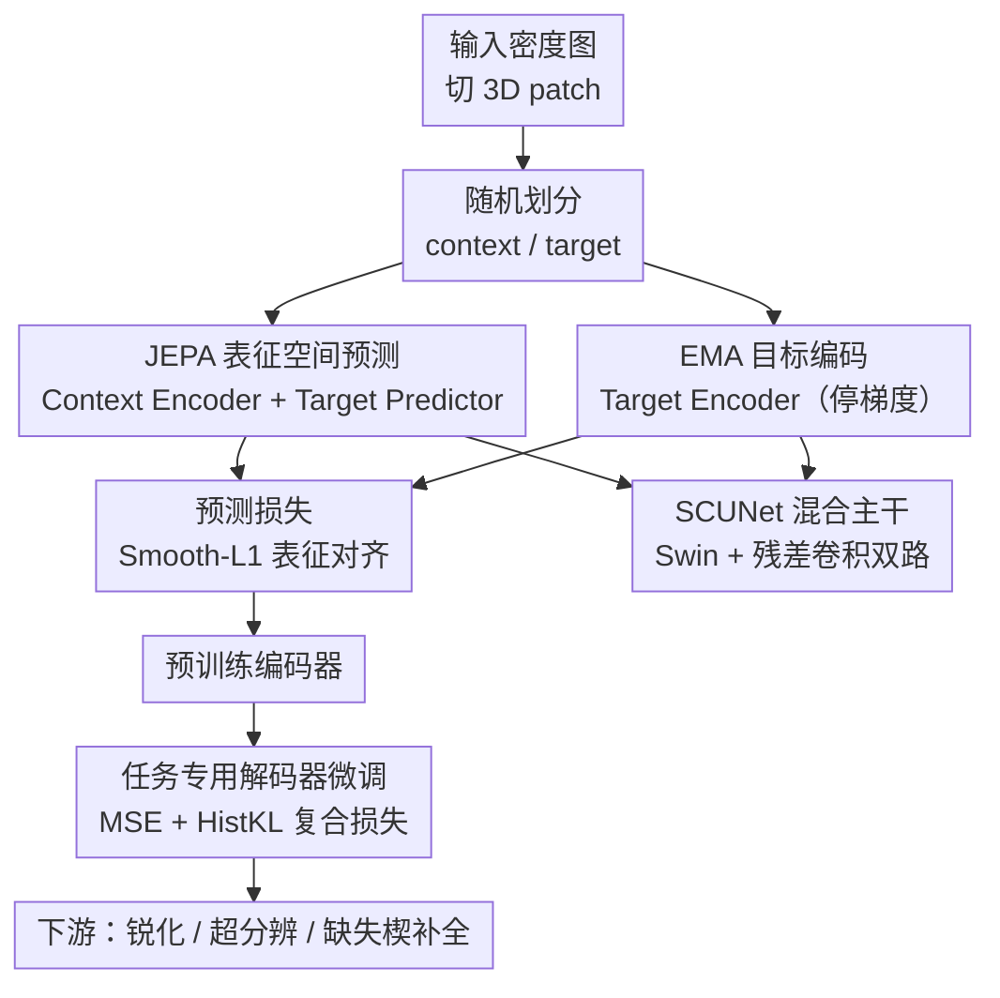

# CryoLVM: Self-supervised Learning from Cryo-EM Density Maps with Large Vision Models

**会议**: ICLR2026  
**OpenReview**: [https://openreview.net/forum?id=9xcvEF2BRi](https://openreview.net/forum?id=9xcvEF2BRi)  
**代码**: 待确认  
**领域**: 计算生物学 / 自监督学习 / 基础模型 / cryo-EM  
**关键词**: cryo-EM 密度图, JEPA, SCUNet, 自监督预训练, 直方图分布对齐损失

## 一句话总结
CryoLVM 把联合嵌入预测架构（JEPA）+ SCUNet 主干引入 cryo-EM 三维密度图领域，用 EMDB 上 7,302 张真实实验密度图做表征空间的自监督预训练，再配一个新颖的直方图分布对齐损失做微调，在密度图锐化、超分辨、缺失楔补全三个下游任务上一致超越 DeepEMhancer、EMReady、EM-GAN、IsoNet 等专用方法。

## 研究背景与动机
**领域现状**：冷冻电镜（cryo-EM）让人们能以近原子分辨率观察生物大分子复合体，EMDB 中沉积的密度图数量呈指数增长。围绕这一管线，机器学习方法已经渗透到从重构（cryoDRGN、3DFlex）、后处理锐化（DeepEMhancer、EMReady）到原子模型搭建（DeepTracer、ModelAngelo）的各个环节。

**现有痛点**：这些深度学习方法几乎全是**任务专用 + 全监督**的——每个任务都要单独配一对“退化输入 / 干净目标”的标注数据从头训一个模型，数据规模受限、泛化能力差。一旦换到新任务或新的成像条件就要重起炉灶。

**核心矛盾**：cryo-EM 密度图本身信噪比极低、高频信息衰减、分辨率各向异性（尤其是 cryo-ET 的缺失楔伪影）。这意味着两件事互相打架：**既想用大规模无标注数据学到通用结构表征**，又**不能让模型把密度图里弥漫的噪声当成信号去拟合**。基于体素重建的预训练（如掩码自编码 MAE 预测原始体素值）恰恰会放大这种噪声。

**本文目标**：造一个 cryo-EM 密度图的**基础模型**，在大规模真实实验图上自监督预训练，学到可迁移的结构语义表征，然后只需轻量微调就能适配多个下游任务。

**切入角度**：作者注意到 JEPA 在**抽象表征空间**做预测而非在像素/体素空间重建——这天然地把密度里的噪声过滤掉，只保留高层结构语义。再考虑到密度图既需要原子级局部特征、又需要跨区域全局空间关系，作者选了混合 Swin Transformer + 残差卷积的 SCUNet 当主干。

**核心 idea**：用“表征空间预测的 JEPA + SCUNet 主干”代替“体素重建 + 任务专用网络”，把 cryo-EM 密度图处理统一成“一次预训练、多任务微调”。

## 方法详解

### 整体框架
CryoLVM 分两个阶段。**预训练阶段**：把输入密度图切成不重叠的三维 patch，随机划成可见的 context 子集和被遮挡的 target 子集；Context Encoder 编码可见 patch，Target Predictor 拿着 context 嵌入加上被遮挡 patch 的位置信息，去预测 Target Encoder 对那些 target patch 输出的嵌入，二者之间施加回归损失；Target Encoder 的权重是 Context Encoder 权重的指数滑动平均（EMA），并停止梯度。**微调阶段**：把预训练好的编码器接上任务专用解码器（上采样 SC 块 + 三维转置卷积），在每个下游任务的标注数据上联合微调，配上 MSE + 直方图对齐的复合损失，得到密度图锐化、超分辨、缺失楔补全三个模型。

### 关键设计

**1. JEPA 表征空间预测：在抽象空间预测，从源头过滤噪声**

cryo-EM 密度信噪比低，若像 MAE 那样直接预测被遮挡区域的**原始体素值**，模型会被迫去拟合弥漫噪声，学到的是“怎么复刻噪声”而非结构语义。CryoLVM 改用 JEPA：只预测被遮挡 patch 在 Target Encoder 下的**嵌入表征**，不预测体素本身。预训练目标是
$$L_p = \mathbb{E}_{x,M}\Big[\sum_{i\in M}\mathrm{SmoothL1}_\beta\big(g_\phi(f_{\theta_c}(x_{\text{context}}), z_i) - f_{\theta_t}(x_i)\big)\Big],$$
其中 $M$ 是被遮挡 patch 集合，$z_i$ 是 target patch 的空间位置信息，$f_{\theta_c}$ 是 Context Encoder、$f_{\theta_t}$ 是 Target Encoder、$g_\phi$ 是 Target Predictor。用 Smooth-L1（参数 $\beta$）而非 L2，是为了对密度图中常见的离群值更鲁棒。因为损失只在“语义嵌入”这一抽象空间计算，噪声在编码过程中被自然滤掉，模型得以聚焦高层结构语义——这正是后续多任务都能受益的可迁移表征来源。消融显示 JEPA 预训练一致优于 MAE 预训练。

**2. SCUNet 混合主干：同时抓原子级局部细节和跨区域全局关系**

cryo-EM 数据有个矛盾需求：原子级特征要靠局部感受野，跨区域的空间关系又要靠全局建模，单纯的三维 ViT 偏全局、纯卷积偏局部，都不够。作者选 SCUNet 作主干，其核心是 swin-conv（SC）块的**双路结构**：卷积分支用带 Filter Response Normalization 的残差 $3\times3\times3$ 卷积保留局部细节，Transformer 分支用窗口大小 $4\times4\times4$ 的三维窗口多头自注意力捕获长程依赖，两路再用 $1\times1\times1$ 卷积融合。Context/Target Encoder 由三个下采样 SC 块、三个三维卷积块和一个瓶颈 SC 块组成；编码器输出经线性变换转成 patch 嵌入，并叠加三维正弦位置编码以保留特征网格中的空间关系，随后再施加掩码生成 context 与 target 嵌入。下游解码器则用上采样 SC 块 + 三维转置卷积块对称展开。消融中 SCUNet 主干在所有下游任务上都优于 ViT 对应版本。

**3. EMA 目标编码器：给自监督预测一个稳定且不坍缩的目标**

JEPA 需要一个“目标”来对齐，但若目标编码器和上下文编码器共享同一套实时更新的权重，自预测很容易坍缩成平凡解。CryoLVM 让 Target Encoder 的权重作为 Context Encoder 权重的**指数滑动平均（EMA）**来更新，并在该路径上**停止梯度**：目标侧像一个缓慢演进的“老师”，提供稳定一致的预测目标，避免表征坍缩，同时让在线的 Context Encoder 朝着越来越好的语义空间收敛。Target Predictor 则是标准 Transformer 块，最后用线性投影把预测映射回编码器的嵌入维度，保证与 target 输出维度一致以便算损失。

**4. 直方图分布对齐损失 $L_{\text{HistKL}}$：让预测密度的整体分布对齐真值，而不仅逐体素拟合**

逐体素的 MSE 只惩罚点对点误差，容易让预测密度的整体灰度/幅度分布偏离真值，影响下游可解释性与收敛速度。作者设计了一个可微的直方图分布对齐损失：先用高斯核加权把预测密度 $X$ 和目标密度 $X^\star$ 各自构造成**软直方图**
$$h(x)_j = \frac{1}{N}\sum_{i}^{N}\exp\!\Big(-\tfrac{1}{2}\big(\tfrac{x_i - c_j}{\sigma}\big)^2\Big),$$
其中 $c_j$ 是第 $j$ 个 bin 的中心、$\sigma$ 控制平滑度、$N$ 是总体素数；再用基于 KL 散度的 Jensen–Shannon（JS）散度度量两个直方图 $p=h(X)$、$q=h(X^\star)$ 的分布差异
$$D_{JS}(p\|q)=\tfrac{1}{2}\sum_k p_k\log\tfrac{p_k}{m_k}+\tfrac{1}{2}\sum_k q_k\log\tfrac{q_k}{m_k},\quad m=\tfrac{1}{2}(p+q),$$
于是 $L_{\text{HistKL}}(X,X^\star)=D_{JS}\big(H(X)\,\|\,H(X^\star)\big)$。软直方图的高斯核保证整个过程可微、能反传。消融表明把它和 MSE 组合后，收敛更快、下游性能更好。

### 损失函数 / 训练策略
预训练阶段用上面的表征预测损失 $L_p$（Smooth-L1）。下游三个任务统一采用复合损失
$$L_{\text{total}} = \alpha\, L_{\text{MSE}} + (1-\alpha)\, L_{\text{HistKL}},$$
超参 $\alpha\in[0,1]$ 平衡逐体素重建精度与整体分布对齐。预训练数据来自 Cryo2StructData 训练子集，含 7,392 张 1–4 Å 高分辨率实验密度图；标准化预处理：体素尺寸统一重采样到 1 Å、密度值按 0.01–0.99 分位裁剪后归一化到 $[0,1]$；为防数据泄漏，剔除下游 baseline 测试集中出现的图，最终预训练语料 7,302 张，输入随机裁剪成 $48^3$ 体积。下游任务的监督目标图用 Chimera.molmap 从对应 PDB 结构按匹配分辨率仿真生成（锐化任务分辨率匹配实验图；超分辨任务输入 4–6 Å、目标设 1.8 Å）。

## 实验关键数据

### 主实验
三个下游任务上 CryoLVM 全面领先。密度图锐化（与原子模型的互相关 + Q-score，越高越好）：

| 方法 | CCbox ↑ | CCmask ↑ | CCpeaks ↑ | Q-score ↑ |
|------|---------|----------|-----------|-----------|
| Deposited | 0.744 | 0.788 | 0.659 | 0.338 |
| DeepEMhancer | 0.695 | 0.679 | 0.659 | 0.323 |
| EMReady | 0.878 | 0.802 | 0.791 | 0.424 |
| **CryoLVM** | **0.894** | **0.821** | **0.806** | **0.444** |

密度图超分辨（FSC / 局部分辨率，单位 Å，越低越好）：

| 方法 | $d_{\text{model}}$ ↓ | FSC-0.143 ↓ | FSC-0.5 ↓ | Resolution ↓ |
|------|------|------|------|------|
| Deposited | 3.66 | 3.39 | 4.64 | 3.81 |
| DeepEMhancer | 3.27 | 2.72 | 4.86 | 3.47 |
| EM-GAN | 2.49 | 2.70 | 5.46 | 4.18 |
| **CryoLVM** | **2.33** | **2.58** | **4.58** | **3.39** |

缺失楔补全（cryo-ET，phenix.mtriage 的 FSC 分辨率，越低越好）：

| 方法 | FSC-0.143 ↓ | FSC-0.5 ↓ |
|------|------|------|
| IsoNet | 10.448 | 12.361 |
| **CryoLVM** | **10.094** | **11.447** |

缺失楔任务上 CryoLVM 把 FSC-0.143 从 10.448 降到 10.094 Å（约 3.39%）、FSC-0.5 从 12.361 降到 11.447 Å（约 7.39%）；可视化中它能重建出连续的孔道状通道，而 IsoNet 产生断裂/拓扑错误的片段。

### 消融实验

| 配置 | 结论 |
|------|------|
| SCUNet vs ViT 主干 | SCUNet 在所有下游任务上一致优于 ViT（同超参对比，Appendix G.1） |
| MSE + HistKL vs 仅 MSE | 复合损失加快收敛、提升超分辨下游性能（Appendix G.2） |
| 预训练 vs 从头训 | 预训练后微调在所有指标上一致改善（Appendix G.3） |
| JEPA vs MAE 预训练 | 锐化任务上 JEPA 一致优于 MAE（Appendix G.3） |

### 关键发现
- **JEPA > MAE** 验证了核心假设：在低信噪比密度图上，表征空间预测确实比体素重建更能学到有用结构语义、不被噪声带偏。
- **SCUNet 主干贡献稳定**：跨三个任务都优于 ViT，印证“局部卷积 + 全局注意力双路”更契合 cryo-EM 既要原子细节又要全局关系的特点。
- **HistKL 既提性能又加速收敛**：说明逐体素 MSE 之外，约束整体密度分布是有价值的正交监督信号。
- 在真实噪声、低分辨率实验图上稳健，弥补了 CryoFM 仅在精选高质量图 + 合成噪声上评测的短板。

## 亮点与洞察
- **把 JEPA 从 2D 自然图像搬到 3D 科学体数据**：抓住“表征空间预测天然抗噪”这一特性去解决 cryo-EM 信噪比痛点，迁移动机非常对路，而不是盲目套基础模型。
- **可微软直方图 + JS 散度做分布对齐**：把“整体密度分布要一致”这件原本难以求导的事，用高斯核软直方图变成可反传的损失，是个可复用到其他密度/图像生成任务的小 trick。
- **一次预训练、三任务微调的统一范式**：锐化、超分辨、缺失楔补全这三件以往各自为政的事，被收进同一个编码器 + 任务解码器框架，工程上把“每任务从头训”的成本摊薄了。
- 三任务都用同源真值仿真（Chimera.molmap 从 PDB 生成目标），保证了监督信号一致性，这套数据构造思路对做 cryo-EM 监督任务的人很有参考价值。

## 局限与展望
- 下游任务仍依赖**配对的仿真目标图**（从已解析 PDB 结构 molmap 生成），本质上还是监督微调；真正缺结构、无配对真值的图怎么办尚未触及。
- 评测主要落在三个修复类任务和 FSC/CC/Q-score 等密度图质量指标上，离“是否真的提升了下游原子模型搭建/序列识别的正确率”这一终极目标还隔了一层。
- 缺失楔补全的绝对分辨率仍在 10 Å 量级、提升幅度（3–7%）相对有限，对实际 cryo-ET 解读的增益需进一步验证。
- 预训练语料 7,302 张相对“大”视觉模型仍偏小，scaling 行为、以及对超出 1–4 Å 训练分布的更低分辨率图的泛化都还没系统刻画。

## 相关工作与启发
- **vs CryoFM**: 同为 cryo-EM 密度图基础模型，CryoFM 是 flow-based 生成先验，但只在精选高质量图 + 合成噪声上训练评测；CryoLVM 用 JEPA 判别式表征学习，直接在真实噪声实验图上训练评测，鲁棒性更贴近真实工作流。
- **vs DeepEMhancer / EMReady（锐化）**: 二者是任务专用全监督 3D U-Net / Swin-Conv-UNet，CryoLVM 用同源 SCUNet 主干但前接自监督预训练，在 CCbox/CCmask/CCpeaks/Q-score 上全面更优。
- **vs EM-GAN（超分辨）**: EM-GAN 用 3D GAN 增强 3–6 Å 图，CryoLVM 在 FSC 各指标上显著更好且更稳定。
- **vs IsoNet（缺失楔）**: IsoNet 靠旋转子断层图 + 人为加楔做配对训练的 3D U-Net，CryoLVM 在 FSC 分辨率上更优，且能保持孔道等拓扑结构的连续性。
- **vs MAE 类重建预训练**: 二者都做掩码自监督，但 MAE 预测原始体素会放大噪声，JEPA 在表征空间预测从源头规避，本文消融直接验证了这一差异。

## 评分
- 新颖性: ⭐⭐⭐⭐ 首个把 JEPA + SCUNet 引入 3D cryo-EM 密度图的基础模型，HistKL 损失设计巧妙。
- 实验充分度: ⭐⭐⭐⭐ 三任务全面对比 + 多组消融（主干/损失/预训练范式），但部分细节放在附录、缺失楔增益偏小。
- 写作质量: ⭐⭐⭐⭐ 动机—方法—实验逻辑清晰，公式与图示完整。
- 价值: ⭐⭐⭐⭐ 为 cryo-EM 提供“一次预训练、多任务微调”的统一范式，对结构生物学社区有实际推动力。

<!-- RELATED:START -->

## 相关论文

- [\[ICLR 2026\] CryoNet.Refine: A One-step Diffusion Model for Rapid Refinement of Structural Models with Cryo-EM Density Map Restraints](cryonetrefine_a_one-step_diffusion_model_for_rapid_refinement_of_structural_mode.md)
- [\[ICLR 2026\] CryoSplat: Gaussian Splatting for Cryo-EM Homogeneous Reconstruction](cryosplat_gaussian_splatting_for_cryo-em_homogeneous_reconstruction.md)
- [\[ICLR 2026\] CellDuality: Unlocking Biological Reasoning in LLMs with Self-Supervised RLVR](cellduality_unlocking_biological_reasoning_in_llms_with_self-supervised_rlvr.md)
- [\[ICML 2026\] Learning the Neighborhood: Contrast-Free Multimodal Self-Supervised Molecular Graph Pretraining](../../ICML2026/computational_biology/learning_the_neighborhood_contrast-free_multimodal_self-supervised_molecular_gra.md)
- [\[ICLR 2026\] Animal behavioral analysis and neural encoding with transformer-based self-supervised pretraining](animal_behavioral_analysis_and_neural_encoding_with_transformer-based_self-super.md)

<!-- RELATED:END -->
