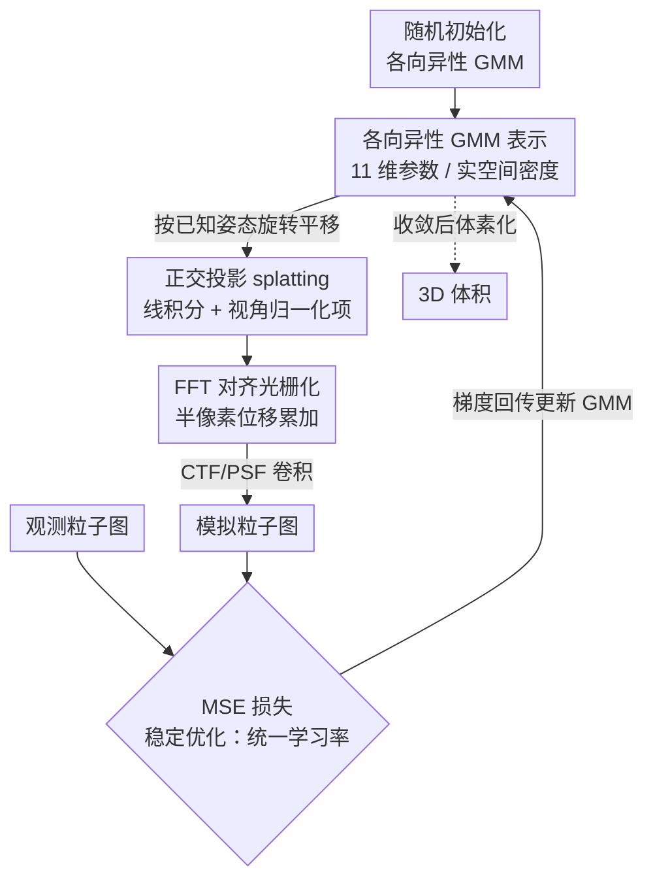

# CryoSplat: Gaussian Splatting for Cryo-EM Homogeneous Reconstruction

**会议**: ICLR2026  
**OpenReview**: [https://openreview.net/forum?id=dLaUZKBzta](https://openreview.net/forum?id=dLaUZKBzta)  
**代码**: https://github.com/Chen-Suyi/cryosplat （待释放）  
**领域**: 计算生物学 / 冷冻电镜重建 / 高斯泼溅  
**关键词**: cryo-EM, 高斯混合模型, Gaussian Splatting, 同质重建, 可微渲染

## 一句话总结
CryoSplat 把 3D 高斯泼溅改造成符合冷冻电镜成像物理的可微渲染器，用各向异性高斯混合模型（GMM）从随机初始化、无需任何外部共识图或原子模型，就能直接从原始噪声粒子图稳定地完成 cryo-EM 同质重建，在四个真实数据集上的分辨率全面超越 cryoSPARC 和 cryoDRGN，且内存/速度都更优。

## 研究背景与动机
**领域现状**：单颗粒冷冻电镜（cryo-EM）的核心计算任务，是从大量未知取向、信噪比极低（实验数据 SNR 可低至约 $-20$ dB）的 2D 投影图，反推出分子的 3D 静电势体积。表示这个 3D 体积的方式有三大流派：体素网格（cryoSPARC / RELION / EMAN2，靠 FFT 做快速投影，但内存吃紧、与学习框架不兼容）、神经场（cryoDRGN 用坐标网络隐式表示，可微但慢、不可解释、难加生物先验）、以及高斯混合模型（GMM，连续、紧凑、物理可解释，且天然对接原子模型，能用更少参数表达精细结构）。

**现有痛点**：GMM 概念上很美，但落地有个绕不过的硬伤——**所有已有的 GMM 方法都依赖外部初始化**。它们要么需要从别的流水线先跑出一张共识体积（consensus map）来初始化，要么甚至需要原子模型作引导。一旦改成随机初始化，混合参数在极端噪声下的优化就会发散，重建质量崩坏。事实上，在论文作者之前，**没有任何方法能在仅给定已知粒子姿态的前提下，从随机初始化稳定地训出一个可靠的 GMM 重建**。这让 GMM 一直没有一个「自包含」的形式，无法作为更复杂重建工作流（如从头重建、异质重建）的骨干模块。

**核心矛盾**：与此同时，3D 高斯泼溅（3DGS）这类可微渲染在体积表示上展现了惊人的可扩展性和效率，看上去和 GMM-cryo-EM 是天作之合。但**现成的 3DGS 是为照片级真实感视图合成设计的，与 cryo-EM 在三个层面根本不兼容**：(i) 成像物理——3DGS 用针孔相机的透视投影，cryo-EM 是电子束沿光轴的正交（line integral）投影；(ii) 重建目标——3DGS 追求 2D 外观逼真，cryo-EM 要的是物理正确的 3D 密度；(iii) 坐标系——3DGS 的图像中心坐标系与 cryo-EM 假定的 FFT 对齐网格不一致。

**本文目标 / 核心 idea**：作者提出 **cryoSplat**——把高斯泼溅的可微框架按 cryo-EM 成像物理重新推导一遍，做出一个「正交投影感知的高斯泼溅」。在已知姿态下，它能从随机初始化的各向异性 GMM 出发，不靠任何外部先验，直接、稳定、高效地完成同质重建，从而补上「让 GMM 成为独立重建工具」所缺的那块地基。

## 方法详解

### 整体框架
cryoSplat 把待求的 3D 静电势体积参数化成一堆各向异性高斯（GMM），然后**在实空间里逐字模拟 cryo-EM 的成像过程**：给定一张粒子图对应的已知姿态，先把所有高斯旋转/平移对齐到该投影方向（viewing transformation），再沿 $z$ 轴做正交投影把每个 3D 高斯压成 2D「splat」，把这些 splat 在 FFT 对齐的网格上快速光栅化累加成一张投影图，最后用对比传递函数（CTF / PSF）卷积，得到一张「模拟粒子图」。把它和真实观测粒子图做 MSE，梯度回传更新 GMM 的全部参数。训练收敛后，把 GMM 体素化（voxelize）即得最终 3D 体积。

整条管线最关键的不是「用了泼溅」，而是把 3DGS 的每个环节都按 cryo-EM 物理改对：用物理的线积分替换启发式 alpha 混合、保留 3DGS 通常丢掉的视角归一化项、把光栅化坐标平移半个像素对齐 FFT 网格、并用统一学习率 + 朴素 MSE 保证从随机初始化也能稳定收敛。

### 关键设计

**1. 各向异性 GMM 表示：用一堆可学习的椭球高斯当 3D 密度，从随机初始化开始**

为了既紧凑又物理可解释，cryoSplat 把体积写成 $N$ 个归一化高斯的加权和 $V(r)=\sum_{i=1}^N A_i G_i(r)$。每个 3D 高斯 $G(r|\mu,\Sigma)$ 由均值 $\mu\in\mathbb{R}^3$（位置）和协方差 $\Sigma\in\mathbb{R}^{3\times3}$（形状）决定，并按 3DGS 的方式构造 $\Sigma = RSS^\top R^\top$ 以保证半正定——其中 $S=\mathrm{diag}(s)$ 是缩放、$R\in SO(3)$ 用四元数 $q$ 参数化。于是每个高斯由 11 维参数 $\{\mu_x,\mu_y,\mu_z,s_x,s_y,s_z,q_w,q_x,q_y,q_z,A\}$ 完全描述。为了优化稳定，振幅 $A$ 和缩放 $s$ 过 softplus 保正、四元数 $q$ 归一化。这一步本身不是 cryoSplat 的独门创新，但它是「自包含」的载体：全部参数都可训练、全部从随机初始化（均值撒在半径 $E/2$ 的球内、$\sigma=0.9\cdot E/6=0.075$，初始尺度 $0.0075$，振幅 $A=1/(2N)$ 保证总能量恒定），不依赖任何外部共识体积，这正是以往 GMM 方法做不到的。

**2. 正交投影 splatting：按 cryo-EM 物理重推投影，并保留被 3DGS 丢掉的归一化项**

这是把泼溅「掰对」的核心一步。cryo-EM 成像本质是电子束沿 $z$ 轴对静电势做线积分，再与 PSF $H$ 卷积：$Y(r_x,r_y)=H * \int_{\mathbb{R}} V(W^\top r + t)\,dr_z + \epsilon$，其中 $W\in SO(3)$ 是姿态、$t$ 是面内平移。由于积分是线性的，每个高斯独立贡献，所以可以单独处理一个高斯。先做视角变换把世界坐标的高斯对齐到投影方向：$\dot{\mu}=W(\mu-t)$、$\dot{\Sigma}=W\Sigma W^\top$；再沿 $z$ 轴积分，一个 3D 高斯被压成一个 2D 高斯 splat，闭式解为 $\tilde{G}(\tilde{r}|\tilde{\mu},\tilde{\Sigma})=\frac{1}{2\pi|\tilde{\Sigma}|^{1/2}}\exp(-\tfrac12(\tilde{r}-\tilde{\mu})^\top\tilde{\Sigma}^{-1}(\tilde{r}-\tilde{\mu}))$。

关键差别在那个归一化因子 $1/(2\pi|\tilde{\Sigma}|^{1/2})$：3DGS 因为只在乎照片级外观，常把它省掉；但在 cryo-EM 里目标是恢复**正确的 3D 体积**，省掉这个**视角相关的归一化**会让振幅产生偏置、重建出错。cryoSplat 因此显式保留它，从而保住模型的定量正确性。最终图像是所有 splat 加权求和再卷 PSF：$X(r_x,r_y)=H * \sum_i A_i\tilde{G}_i(\tilde{r})$。这一步等于用「物理线积分」替换了 3DGS 的启发式 alpha 混合。

**3. FFT 对齐光栅化：把坐标系平移半个像素，消除相位不一致**

cryoSplat 复用 3DGS 高效的分块（tile-based）光栅化框架，能可扩展、可微地处理上万个高斯——但把 alpha 混合改成了直接求和，以符合 cryo-EM 的物理透射模型。这里有个容易被忽视、却会毁掉重建的细节：对于 $D\times D$ 的图，原版 3DGS 把连续坐标中心放在 $[(D-1)/2,(D-1)/2]^\top$，即两个离散像素正中间；而 FFT 成像假定原点在整数网格点 $[\lfloor D/2\rfloor,\lfloor D/2\rfloor]^\top$。两者错半个像素，会引入相位不一致，破坏 CTF 调制时的梯度传播。cryoSplat 把光栅化坐标整体**平移半个像素**，让图像中心对齐 FFT 网格，既消除相位错位、保证电子投影模拟和反传的准确性，又保住了 3DGS 架构的计算效率。

**4. 稳定优化：统一学习率 + 朴素 MSE，让随机初始化也能收敛**

以往 GMM 方法要靠精心设计的复杂正则/约束损失才能勉强稳住优化，cryoSplat 反其道而行，只用最朴素的 $L=\|X-Y\|_2^2$（模拟图与观测图的均方误差），不加任何额外正则。能这么简单的前提是解决了发散根源：3DGS 给不同类型参数（位置、缩放、旋转、不透明度）分配**不同学习率**，这在视图合成里没问题，但在 cryo-EM 里会扭曲梯度方向——参数更新方向本应由 $\nabla_\theta L$ 决定，对不同分量乘上不同系数等于改了下降方向，导致高斯在早期迭代里失控扩散、最终发散。cryoSplat 改用**所有参数共用单一学习率**，保住了真正的下降方向。配合 Adam（batch size 1、学习率 0.001、每 epoch 指数衰减 $\gamma=0.1$），所有 GMM 只训 5 个 epoch 即稳定收敛。

### 损失函数 / 训练策略
损失就是上面的纯 MSE，无额外正则项。训练用 Adam，batch size 1，lr 0.001，逐 epoch 指数衰减（$\gamma=0.1$），共 5 个 epoch，单张 RTX 3090 即可。每个体积默认用 30,000 个高斯。粒子平移通过在傅里叶空间做相位平移施加到观测图上（而非走 GMM 的视角变换）。

## 实验关键数据

### 主实验
在 EMPIAR 四个真实数据集上、用相同的共识姿态做同质重建，仅比较体积表示的选择。无真值，用金标准 Fourier Shell Correlation（FSC，阈值 0.143 处的频率定义分辨率，分辨率数字越小越好）。

| 数据集 | 特点 | cryoSPARC（体素） | cryoDRGN（神经场） | cryoSplat（本文） |
|--------|------|------|------|------|
| EMPIAR-10028（Pf80S 核糖体） | 高对比、稳定，较易 | 3.80 Å | 3.80 Å | 3.80 Å（高频细节更优） |
| EMPIAR-10049（RAG 复合体） | 对称姿态退化、柔性 DNA/NBD | 4.23 Å | 4.07 Å | **2.49 Å** |
| EMPIAR-10076（E. coli LSU 装配） | 强成分/构象异质 | — | — | **3.30 Å**（碎片更少） |
| EMPIAR-10180（剪接体） | SF3b 大幅运动 | 4.51 Å | 4.27 Å | **4.26 Å**（无高频伪峰） |

cryoSplat 在所有数据集上 FSC 曲线整体更高，尤其在高空间频率（精细结构）上稳定胜出，且对姿态退化、异质性、大幅运动都更鲁棒（其它方法在 SF3b 区域会出现明显高频伪峰）。

### 消融实验

| 配置 | 关键指标 | 说明 |
|------|---------|------|
| 高斯数 $N$=2,048→30,000 | FSC 随 $N$ 单调改善 | $N$ 越多表示能力越强；约 10,000 个即足以在多数数据集稳定超越基线 |
| 训练 epoch 1→5 | 第 4、5 epoch FSC 曲线几乎重叠 | 5 epoch 内稳定收敛 |
| 统一学习率 vs 分组学习率 | 分组会发散 | 分组学习率使高斯早期失控扩散、最终发散（稳定性的关键） |
| 保留 / 省略归一化项 | 省略引入振幅偏置 | 视角归一化项关系到定量正确性 |
| 朴素 MSE vs 复杂正则损失 | 纯 MSE 即稳定快速收敛 | 无需额外正则 |

显存与速度（Tab. 1 / Fig. 4）：cryoSplat 即便 30,000 个高斯，显存也 $<$ 380 MiB，远低于 cryoDRGN（$D{=}256$ 时近 5 GiB）；在异质重建常用的 2,048–3,072 高斯设置下 FPS 是 cryoDRGN 的 2–3 倍，加上只需 5 epoch（cryoDRGN 需 50），整体提速可达 $\sim$30 倍，且对高斯数呈亚线性时间复杂度。

### 关键发现
- **稳定性的命门是学习率分组**：把 3DGS 的分组学习率换成统一学习率，是从随机初始化能收敛而非发散的决定性改动——这比损失设计还关键。
- **归一化项决定定量正确性**：3DGS 为了好看可以丢掉的视角归一化项，在 cryo-EM 里丢了就会偏振幅、重建错。
- **高斯数与质量正相关但有拐点**：约 10,000 个高斯即可在多数数据集稳定超越基线，30,000 个在最难的异质数据集（10076）上进一步明显领先。
- **越难的样本越能体现优势**：在姿态退化（10049）、强异质（10076）、大幅运动（10180）这些难场景上，cryoSplat 的领先幅度最大。

## 亮点与洞察
- **「把 3DGS 掰对而非套用」的范式**：作者没有直接拿 3DGS 当黑盒，而是逐项审查成像物理、重建目标、坐标系三处不匹配，并各给一个对症修法（线积分替 alpha 混合、保留归一化、半像素对齐 FFT）。这种「拿成熟可微渲染框架去适配某个科学成像物理」的做法，对其它科学成像（如 X 射线、CT、超声）也有迁移价值。
- **半像素对齐是典型的「魔鬼在细节」**：FFT 网格原点与 3DGS 像素中心错半像素，听上去微不足道，却足以破坏 CTF 调制的相位一致性——这类「坐标约定」级别的坑往往是科学重建复现失败的隐形元凶。
- **统一学习率的洞察很反直觉**：分组学习率在视图合成里是公认的好实践，作者却指出它在极端噪声下会扭曲梯度方向导致发散。这提醒人：从一个领域搬经验到另一个领域，连「公认最佳实践」都要重新审视。
- **填补了 GMM「自包含」的地基**：这是第一个能从随机初始化、无外部先验跑通 cryo-EM 同质重建的 GMM 方法，为后续把 GMM 用作从头重建/异质重建骨干铺了路。

## 局限与展望
- **作者承认的局限**：当前框架假设粒子姿态已知，因此还不是从头（ab initio）重建方法，在完全无监督场景下不能直接用。
- **自己发现的局限**：实验只在四个 EMPIAR 数据集、且都在同质假设下评估；对真正的异质（多构象共存）重建尚未验证，论文一直强调的「GMM 适合异质」目前仍是承诺而非实证。初始化用了若干启发式常数（球半径 $E/2$、$\sigma=0.075$、尺度 $0.0075$、$A=1/2N$），其鲁棒性与数据集相关性还需更多消融。
- **改进思路**：作者指出的方向是联合优化姿态与高斯参数、扩展到异质重建、并把 cryoSplat 整合进端到端从头重建流水线——这三步若打通，GMM 就有望成为 cryo-EM 重建的统一骨干。

## 相关工作与启发
- **vs 体素法（cryoSPARC / RELION / EMAN2）**：它们靠 FFT 在密集体素网格上投影/反投影，快但内存随分辨率三次方膨胀、不可微、难接学习框架；cryoSplat 用紧凑 GMM，显存近乎与分辨率无关，且全程可微。
- **vs 神经场（cryoDRGN）**：用坐标网络隐式表示体积，可微但慢（需 50 epoch）、显存高（近 5 GiB）、不可解释、难加生物先验；cryoSplat 显式、可解释、对接原子模型，5 epoch 收敛、显存 $<$ 380 MiB，分辨率还更高。
- **vs 既有 GMM 方法（E2GMM / Chen 等）**：它们必须从外部共识体积甚至原子模型初始化，随机初始化会发散；cryoSplat 是首个从随机初始化、无外部先验即可稳定重建的 GMM 方法。
- **vs 原版 3DGS（Kerbl 2023）**：3DGS 为视图合成设计，用透视投影 + alpha 混合 + 图像中心坐标系；cryoSplat 改为正交线积分 + 保留归一化 + FFT 对齐坐标 + 统一学习率，使其符合 cryo-EM 成像物理。

## 评分
- 新颖性: ⭐⭐⭐⭐⭐ 首个从随机初始化跑通 cryo-EM GMM 重建，把高斯泼溅按成像物理系统性重推。
- 实验充分度: ⭐⭐⭐⭐ 四个真实数据集 + FSC/显存/速度全面对比 + 关键消融，但缺异质重建与从头重建的实证。
- 写作质量: ⭐⭐⭐⭐⭐ 三处不匹配 → 三处修法的论证线索清晰，公式与物理动机交代到位。
- 价值: ⭐⭐⭐⭐⭐ 为 GMM 成为 cryo-EM 重建骨干补上自包含地基，方法范式可迁移到其它科学成像。

<!-- RELATED:START -->

## 相关论文

- [\[ICCV 2025\] CryoFastAR: Fast Cryo-EM Ab initio Reconstruction Made Easy](../../ICCV2025/computational_biology/cryofastar_fast_cryoem_ab_initio_reconstruction_made_easy.md)
- [\[CVPR 2026\] CryoKRAQEN: Kernel-Regularized Annealing for Quantized Embedding Networks in Cryo-EM Heterogeneous Reconstruction](../../CVPR2026/computational_biology/cryokraqen_kernel-regularized_annealing_for_quantized_embedding_networks_in_cryo.md)
- [\[ICLR 2026\] CryoLVM: Self-supervised Learning from Cryo-EM Density Maps with Large Vision Models](cryolvm_self-supervised_learning_from_cryo-em_density_maps_with_large_vision_mod.md)
- [\[CVPR 2026\] CryoHype: Reconstructing a Thousand Cryo-EM Structures with Transformer-Based Hypernetworks](../../CVPR2026/computational_biology/cryohype_reconstructing_a_thousand_cryo-em_structures_with_transformer-based_hyp.md)
- [\[ICLR 2026\] CryoNet.Refine: A One-step Diffusion Model for Rapid Refinement of Structural Models with Cryo-EM Density Map Restraints](cryonetrefine_a_one-step_diffusion_model_for_rapid_refinement_of_structural_mode.md)

<!-- RELATED:END -->
