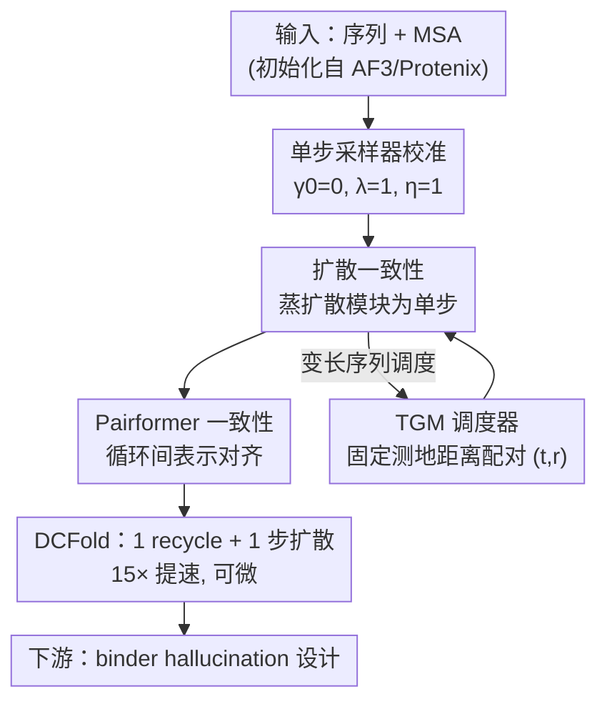

# DCFold: Efficient Protein Structure Generation with Single Forward Pass

**会议**: ICLR 2026  
**OpenReview**: [https://openreview.net/forum?id=LMsdys7t1L](https://openreview.net/forum?id=LMsdys7t1L)  
**代码**: 待确认  
**领域**: 计算生物 / 蛋白质结构预测 / 扩散加速  
**关键词**: 蛋白质折叠, AlphaFold3, 一致性模型, 单步生成, 扩散蒸馏

## 一句话总结
DCFold 把 AlphaFold3 的两大迭代瓶颈（多步扩散 + Pairformer 循环）同时用"双一致性"蒸馏掉，再配一个针对变长蛋白序列设计的 Temporal Geodesic Matching 调度器，做到单次前向就能达到 AlphaFold3 级别的结构预测精度，推理提速约 15×（平均 133s → 9s）。

## 研究背景与动机
**领域现状**：AlphaFold2 把多序列比对（MSA）和几何约束端到端地结合，把蛋白结构预测推到接近实验精度；AlphaFold3（AF3）进一步重构成全原子框架，并把结构模块换成扩散模型，从而能生成蛋白、核酸、配体等各类生物分子复合物，成了下游虚拟筛选、蛋白设计的基础模型。

**现有痛点**：AF3 为了精度引入了两层迭代——Pairformer 要循环 recycle 多次更新 pair/single 表示，扩散模块又要几十步去噪。结果是长序列上单次预测要按"分钟"算（平均 133s）。可在虚拟筛选里动辄要给上千甚至公开库里海量候选打分，这种推理成本根本扛不住。更糟的是，基于 hallucination 的蛋白设计需要对折叠网络做梯度反传，而 AF3 的多步迭代结构让梯度回传几乎不可行，直接把社区挡在了"拿 AF3 当设计基础模型"的门外。

**核心矛盾**：精度来自迭代，迭代带来不可承受的推理开销和不可微性。以往的折中（如 BindCraft 手动砍 recycle 次数）是拿精度换速度，必然掉点；扩散领域的高阶 solver 也很难把采样步数压到 10 步以下。

**切入角度**：一致性模型（Consistency Model, CM）在图像生成里已经能把多步轨迹塌缩成单步，理论上正对 AF3 的扩散瓶颈。但作者发现直接套用 CM 到 AF3 有两个致命问题：(i) 标准 CM 调度假设数据是定长的、用固定欧氏距离配对相邻时间步，无法适配变长蛋白序列，导致训练不稳定甚至权重崩塌；(ii) AF3 除扩散外还有 Pairformer 循环这第二个瓶颈，是传统扩散一致性方法管不到的。

**核心 idea**：用"双一致性（Dual Consistency）"同时把扩散和 Pairformer 两个迭代来源蒸成单步，并把一致性调度从"固定欧氏间隔"改成"固定测地距离"（TGM），让配对在蛋白扩散轨迹的内在几何空间里进行，从而既稳定训练又保住精度。

## 方法详解

### 整体框架
DCFold 的目标是：在不重训整个 AF3 的前提下，把它从"几十步扩散 + 多轮 Pairformer 循环"压成"1 步扩散 + 1 轮 recycle"，同时尽量不掉精度。整体分三块走：先把 AF3 的扩散采样器调成能稳定单步出图（关掉额外噪声注入、固定 rescale 与步长），拿到一个可用的单步采样器；再用双一致性分两阶段蒸馏——先蒸扩散模块、再蒸 Pairformer，把两个迭代瓶颈各自塌缩；蒸扩散时用 TGM 调度器解决变长序列下的训练不稳定问题。蒸完后的 DCFold 既高效又可微，能直接接入 binder design 这类需要大规模采样 + 梯度优化的下游任务。

### 关键设计

**1. 单步采样器校准：先让 AF3 在一步内不崩**

在做任何蒸馏之前，作者先观察 AF3 在少步采样下为什么失败，发现问题主要出在采样过程本身：AF3 默认会注入额外随机噪声并放大 ODE 步长，这在单步 regime 下是灾难——放大的步长会把 ODE 预测的偏差成倍放大。于是他们直接改采样器：关闭噪声注入（噪声因子 $\gamma_0 = 0$）、固定 rescale 因子 $\lambda = 1$、把步长归一化为 $\eta = 1$。这样 AF3 在不重训的情况下就已经能单步生成出大致正确的结构（即论文里的 AF3 ODE baseline），为后续蒸馏提供了一个能用的起点。这一步看似是工程调参，但它点明了一个关键事实：AF3 本身就"具备"单步生成能力，只是被默认采样策略掩盖了。

**2. 双一致性：把扩散和 Pairformer 两个瓶颈分别蒸成单步**

这是 DCFold 的核心。作者把 AF3 的推理瓶颈定位为两个迭代来源，分别施加一致性学习。**扩散一致性**对扩散模块做一致性蒸馏，让单步输出对齐多步输出，损失是不同时间步输出间的 MSE：

$$\mathcal{L}_{\text{diffusion}} = \mathbb{E}_{x,t,r,\epsilon}\left[w(t)\,\text{MSE}\big(f_\theta(x_t, t) - f_{\text{sg}(\theta)}(x_r, r)\big)\right]$$

其中 $f_\theta$ 是扩散模块，$\text{sg}(\theta)$ 是 stop-gradient，实验发现 $w(t)=1$ 即可。**Pairformer 一致性**针对最关键的瓶颈：Pairformer 要循环 $N$ 轮（实验取 $N=4$）逐步精化表示，每轮依赖上一轮输出，所以单次前向天然就包含了不同循环深度的表示。作者据此引入"循环一致性损失"，直接最小化相邻循环的表示传递误差：

$$\mathcal{L}_{\text{pairformer}} = \sum_{i=1}^{N-1}\big(\text{MSE}(z_i, z_{i+1}) + \text{MSE}(s_i, s_{i+1})\big)$$

其中 $z_n, s_n$ 分别是第 $n$ 轮后的 pair 表示和 single 表示。这个设计巧在不需要像扩散那样显式采样时间步——循环深度本身就提供了"逐步精化"的监督信号。加权上沿用 AF3 的策略，核酸和小分子位置权重高于氨基酸；single 表示直接用 per-token 权重 $\alpha$，pair 表示则用 $\sqrt{\alpha}\sqrt{\alpha}^\top$ 的外积加权矩阵。训练分两阶段（见下方训练策略），并辅以 AF3 的置信度损失 $\mathcal{L}_{\text{confidence}}$ 稳定训练。

**3. Temporal Geodesic Matching（TGM）：用测地距离配对时间步，治变长序列的训练崩塌**

直接把通用一致性方法用到 AF3 常出现权重崩塌或训练成本爆炸，根因在于变长输出（蛋白结构尺寸不固定）下的调度问题。传统调度器用固定欧氏间隔配对 $(t, r)$，会产生病态课程：长序列上即便很小的 $\Delta t$ 也会触发剧烈的分布漂移、要求模型做不现实的预测跳跃；短序列上同样的间隔又只提供很弱的信号。本质是忽略了"信息量随数据维度非均匀累积"。

TGM 的解法是：不在欧氏空间、而在"时间信息流形" $\mathcal{M}_t$ 上按测地距离配对。作者把扩散轨迹的中间分布族 $p_t(x)$ 看成流形上的坐标，用关于扩散时间 $t$ 的 Fisher 信息作为黎曼度量张量 $g(t) := I(t) = \mathbb{E}_{p_t(x)}[(\partial_t \log p_t(x))^2]$，两个时间点的测地距离即 $d_g(t,r) = \int_r^t \sqrt{I(\tau)}\,d\tau$。关键的理论支撑是命题 1（局部度量-KL 等价）：小步长下测地距离约等于相邻分布 KL 散度的平方根 $d_g(t,r) = \sqrt{2 D_{\text{KL}}(p_r\|p_t)}^{1/2} + O((\Delta t)^3)$，说明用测地距离配对等价于用扩散变分目标本身的"自然距离"配对。具体调度上，给定训练进度 $u = \text{steps}/\text{max\_steps} \in [0,1]$，让每个 $t$ 配一个固定测地距离 $C(u)$ 处的参考点 $r$，其中 $C(u) = C_0(1-u)^\beta$ 单调递减，用一步 Euler 近似 $r(t,u) = t - \frac{C_0}{\sqrt{I(t)}}(1-u)^\beta$。作者还给出了 $I(t)$ 的解析形式，并把数据维度 $D$ 显式纳入调度，以平衡不同长度序列的学习难度——正是因为 KL 散度随维度线性累积，经典一致性训练才会在长序列上夸大信息差异，TGM 把这一点直接补偿掉。

### 损失函数 / 训练策略
训练分两阶段，权重见下：阶段 (i) 只更新扩散模块，目标为 $\mathcal{L}_{\text{confidence}}$（权重 $10^{-4}$）+ $\mathcal{L}_{\text{diffusion}}$（权重 1）；阶段 (ii) 只更新一个 16-block 的 Pairformer，目标为 $\mathcal{L}_{\text{confidence}}$（权重 $10^{-4}$）+ $\mathcal{L}_{\text{pairformer}}$（权重 1）。其中置信度损失 $\mathcal{L}_{\text{confidence}} = \mathcal{L}_{\text{plddt}} + \mathcal{L}_{\text{pde}} + \mathcal{L}_{\text{resolved}} + \alpha_{\text{pae}}\mathcal{L}_{\text{pae}}$（$\alpha_{\text{pae}}=1$），各项定义沿用 AF3。模型初始化自 Protenix（AF3 的开源复现），最终只用 1 recycle + 1 步扩散去噪。

## 实验关键数据

### 主实验
在 Posebusters V2 上报告预测 ligand 坐标 RMSD 低于不同阈值的比例（取每个复合物的 best/worst 两种）。DCFold 在 worst-case 上全面优于 AF3 ODE，逼近甚至在部分阈值超过原始 AF3，说明双一致性"收紧"了输出分布、压低了极端误差。

| 方法 | Best <2Å (%) | Best <5Å (%) | Worst <2Å (%) | Worst <5Å (%) |
|------|------|------|------|------|
| AlphaFold3 | 82.86 | 93.81 | 70.00 | 87.62 |
| AF3 ODE | 74.77 | 92.38 | 66.19 | 87.62 |
| DCFold (Ours) | 78.57 | **94.29** | **71.43** | **90.48** |

在 Low Homology Recent PDB 上用 TM-score 和成功率（RMSD<2Å 的比例）评估，DCFold 在三类复合物上相对 AF3 ODE 全面正向提升，且 Success Rate 的提升幅度明显大于平均 TM-score 的提升——这正印证了"重塑分布"的论断：DCFold 比 AF3 更能避免生成不合理的复合物。

| 类别 | 方法 | TM-score | SR (%) |
|------|------|------|------|
| PL-complex | AF3 ODE | 0.815 | 92.3 |
| PL-complex | DCFold | **0.824 (+1.2)** | **94.9 (+2.6pp)** |
| Monomer | DCFold | **0.850 (+2.3)** | **95.7 (+2.9pp)** |
| PP-complex | DCFold | **0.800 (+4.8)** | **92.2 (+5.2pp)** |

效率上，平均折叠时间从 AF3 的 133.3s 降到 DCFold 的 8.9s，约 15× 提速，而 Posebusters V2 成功率仅从 82.9% 微降到 78.6%。

### 消融实验
TGM 的单独有效性在 Posebusters V2 上对比各类通用一致性模型，TGM 在相同单步耗时下成功率最高，而朴素 CD 直接训练崩塌：

| 方法 | 单步耗时 (s) | 成功率 (%) | 说明 |
|------|------|------|------|
| CD | 18.5 | 25.6 ↓ | 训练崩塌，严重掉点 |
| sCM | 38.1 | - | 不可用 |
| ECM | 11.6 | 75.7 ↑ | 可提升，作为先前方法代表 |
| TGM | 11.6 | **77.5 ↑** | 同耗时下增益最大 |

双一致性两个组件的消融（Recent PDB lDDT，Figure 3）显示扩散一致性与 Pairformer 一致性贡献互补，二者共同驱动了主要增益。

### 关键发现
- **AF3 本就能单步生成**：只要选对 ODE 参数（关噪声、固定步长），AF3 ODE 单步就能出大致正确的结构，瓶颈在采样策略而非模型本身。
- **双一致性是"重塑分布"而非单纯提精度**：best-case RMSD 基本不变，但 worst-case 显著改善——它把分布收紧、削掉极端错误，所以 Success Rate 涨得比平均 TM-score 多。
- **多样性与置信度几乎不掉**（Table 4）：双一致性轻微收紧结构分布（Diversity 略降），置信度（pLDDT）反而略升，且与采 MSA、列聚类/mask、调 dropout 等多样性增强策略正交，可叠加使用。
- **下游 binder 设计实打实受益**：六个靶点的 in silico 成功率上，DCFold（.29/.78 平均）多数靶点超过 AF2-based BindCraft（.26/.69），在 H3、VirB8、LTK 上提升明显——可微 + 高效让 AF3 首次能跑此前只有 AF2 能做的 hallucination 设计。

## 亮点与洞察
- **把"循环深度"当免费监督信号**：Pairformer 一致性不需要像扩散那样显式采时间步，因为单次前向已天然包含不同循环深度的表示，直接对相邻循环表示做 MSE 即可——这是把架构的迭代结构反过来当蒸馏信号用，很省。
- **测地距离 = KL 的几何化**：TGM 用命题 1 把"测地距离 ≈ KL 散度平方根"打通，等于说"在扩散变分目标的自然度量下配对时间步"，并把数据维度 $D$ 显式纳入调度补偿长序列的信息累积——这一思路对任何变长/变维的扩散蒸馏任务都通用。
- **不重训整网、靠蒸馏改造现成基础模型**：DCFold 从 Protenix 初始化、两阶段轻量蒸馏即可，给"如何把昂贵基础模型改造成可部署版本"提供了可复用范式。

## 局限与展望
- **精度上仍有微小损失**：Posebusters V2 best-case 成功率从 82.9% 降到 78.6%，对极致精度场景（如难解复合物）单步可能不够，需在速度/精度间权衡。
- **强条件性导致多样性增益有限**：DCFold 和 AF3 一样，单纯加采样数（5→15）几乎不提升多样性，受 AlphaFold 系列强条件性所限，要靠正交的 MSA 扰动等手段补。
- **下游验证偏 binder 设计**：实验主要在结构预测 + binder hallucination 两类任务，是否在更广的蛋白设计/对接任务上同样稳健仍待验证。
- **理论近似的适用边界**：TGM 的测地距离用一步 Euler 近似、命题 1 是小步长局部展开，在大步长或极端长序列下近似误差的影响值得进一步分析。

## 相关工作与启发
- **vs AlphaFold3**：AF3 靠多步扩散 + 多轮 Pairformer 循环换精度；DCFold 用双一致性把两层迭代都蒸成单步，精度持平/略升、速度 15×，且模型可微能做梯度优化，本文优势是部署效率和可微性，代价是 best-case 精度略降。
- **vs 通用一致性模型（CD / sCM / ECM）**：它们假设定长数据、用欧氏间隔配对时间步，套到变长蛋白上会崩塌或不稳；TGM 改用 Fisher 信息测地距离配对，专门治变长序列，成功率最高（77.5% vs ECM 75.7%，CD 直接崩到 25.6%）。
- **vs BindCraft（AF2-based 设计）**：BindCraft 只能在 AF2 框架内做 hallucination 设计；DCFold 让 AF3 也具备高效可微推理，把 AF3 的全原子复合物建模能力带进 binder 设计，多数靶点成功率反超 BindCraft。
- **vs 高阶 ODE solver**：高阶 solver 虽提效但很难压到 10 步以下；DCFold 走一致性蒸馏路线直接做到 1 步，方向不同且更彻底。

## 评分
- 新颖性: ⭐⭐⭐⭐⭐ 双一致性同时蒸两个瓶颈 + 测地距离调度治变长序列，思路清晰且有理论支撑
- 实验充分度: ⭐⭐⭐⭐ 结构预测 + 多样性 + binder 设计 + TGM 消融覆盖完整，但下游任务种类偏窄
- 写作质量: ⭐⭐⭐⭐ 动机推导和方法层次分明，理论部分（Fisher/测地距离）需一定背景
- 价值: ⭐⭐⭐⭐⭐ 把 AF3 从分钟级压到秒级且可微，直接打开下游设计的大门，实用价值很高

<!-- RELATED:START -->

## 相关论文

- [\[ICLR 2026\] GAGA: Gaussianity-Aware Gaussian Approximation for Efficient 3D Molecular Generation](gaga_gaussianity-aware_gaussian_approximation_for_efficient_3d_molecular_generat.md)
- [\[ICLR 2026\] Learning Flexible Forward Trajectories for Masked Molecular Diffusion](learning_flexible_forward_trajectories_for_masked_molecular_diffusion.md)
- [\[ICML 2026\] Protein Autoregressive Modeling via Multiscale Structure Generation](../../ICML2026/computational_biology/protein_autoregressive_modeling_via_multiscale_structure_generation.md)
- [\[ICLR 2026\] Convex Efficient Coding](convex_efficient_coding.md)
- [\[ICLR 2026\] ProteinAE: Protein Diffusion Autoencoders for Structure Encoding](proteinae_protein_diffusion_autoencoders_for_structure_encoding.md)

<!-- RELATED:END -->
