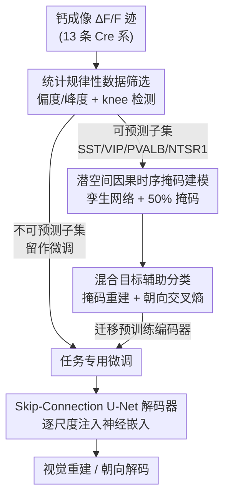

# Decoding Dynamic Visual Experience from Calcium Imaging via Cell-Pattern-Aware Pretraining

**会议**: ICLR2026  
**OpenReview**: [https://openreview.net/forum?id=z9kAjjRejs](https://openreview.net/forum?id=z9kAjjRejs)  
**代码**: 待确认  
**领域**: 计算生物 / 神经解码 / 自监督学习  
**关键词**: 钙成像, 神经解码, 细胞类型, 自监督预训练, 课程学习

## 一句话总结
POYO-CAP 把"统计规律性"（用偏度和峰度衡量）当成显式的数据筛选准则，先在最"可预测"的一批神经元（抑制性中间神经元等）上做掩码重建预训练，再迁移到嘈杂神经元做下游解码，从而把钙成像里的神经元异质性从拦路虎变成可扩展的学习优势——电影帧重建 SSIM 达 0.593、数据效率提升 1.98×，且模型越大性能越稳地上升。

## 研究背景与动机
**领域现状**：从神经记录里学有用表征是机器学习的一个老大难。各实验室采集的数据规模小、信号高维且只能部分观测（受记录技术限制），标签又稀缺又弱。自监督学习（SSL）天然适合这种"数据少、标签缺"的场景，掩码建模、序列预测在语言等结构化领域早已验证有效，被寄望于直接从神经活动重建感知或意图（如脑机接口 BCI）。

**现有痛点**：SSL 成立的前提是数据里存在"可学习的统计规律"。但神经解码恰恰打破了这个前提——我们只记录到整个回路里一小撮、还带偏置的神经元，导致"可预测性"在群体内部极不均匀。这种不可预测性和细胞类型强相关：抑制性神经元、皮质丘脑神经元的动态相对规整，而兴奋性锥体细胞在孤立观测下显得稀疏、随机（因为我们看不到驱动它们的更大网络信号）。如果不加区分地把这种混合信号一股脑喂给 SSL，损失会被那些不可预测的神经元主导，把模型的注意力从该学的规律拉走。

**核心矛盾**：神经群体的功能异质性（规整神经元 vs. 高度随机的神经元混在同一份数据里）与 SSL 对统计规律性的依赖之间存在根本冲突。作者甚至观察到一个反常现象——**加入更多神经元反而会导致"扩展崩溃"（scaling collapse）**，这是异质神经群体独有的失败模式。

**本文目标**：验证一个"统计规律性假设"——表征学习的效率，随所选神经元子集的统计规律性而提升；并据此设计出能让 SSL 稳定扩展的预训练方案。

**切入角度**：与传统按"任务难度"安排课程不同，作者主张用神经元**内在的统计属性**来指导学习课程——这是一种"数据饮食"（data diet）思路，但裁剪的对象不是样本而是**神经元（特征源）**。他们用高阶统计量（偏度 skewness、峰度 kurtosis）作为可预测性的免标签代理。

**核心 idea**：把"统计可预测性"当成显式的数据筛选准则——先在偏度/峰度低（近高斯、薄尾）的"可预测"神经元上预训练，再微调到更随机的群体，把异质性转化为可扩展的学习优势。

## 方法详解

### 整体框架
POYO-CAP（Cell-pattern Aware Pretraining）是一个"先挑神经元、再分阶段训练"的混合预训练框架。整条管线是：输入小鼠视觉皮层的钙成像 $\Delta F/F$ 迹 → 用偏度/峰度把 13 条 Cre 驱动系（cell line）切成"可预测"与"不可预测"两部分 → 在可预测子集上做"潜空间掩码重建 + 辅助分类"的混合目标预训练（编码器基于 POYO+，孪生网络）→ 把预训练好的编码器迁移到不可预测神经元上微调，配上任务专用解码器（电影重建用 Skip-Connection U-Net，朝向分类用 POYO+ 解码器）→ 输出重建的电影帧或漂移光栅朝向。

整个设计的精神是把"挑数据"提升到和"设计模型"同等重要的地位：预训练阶段不追求覆盖所有神经元，而是刻意只学最规整的那一批，给后续大模型打一个良态（well-conditioned）的优化地基。

### 关键设计

**1. 统计规律性数据筛选：用偏度/峰度免标签地挑出"可预测"神经元**

针对"混合信号让 SSL 损失被随机神经元主导"这个痛点，作者把可预测性操作化为一个可计算、免标签的准则。他们对每个神经元的 $\Delta F/F$ 迹算偏度和峰度——近高斯（对称、薄尾）的神经元被视为"可预测"（被选子集均值偏度 1.87、峰度 7.32），而重尾、稀疏爆发的神经元（均值峰度高达 148.51）则留给后续微调。具体切分用 knee-detection 算法（Satopaa 等）在 13 条 Cre 系的逐系均值分布上找数据驱动的拐点，得到阈值 $\text{skewness} \le 3.51,\ \text{kurtosis} \le 22.62$，筛出 4 条系：SST、VIP、PVALB（三大抑制性中间神经元类）和 NTSR1（一条调控性皮质丘脑兴奋系）。妙处在于这个纯统计准则筛出的群体**在生物学上也自洽**——都是稳定神经回路的关键角色，统计与生物两套标准在此收敛。注意这个阈值是**先验固定**的单一切分准则，而非可调超参，所以作者没做敏感性分析。

**2. 潜空间因果时序掩码建模：用孪生网络在隐空间做掩码重建**

预训练的主目标是掩码重建，但作者不在原始信号上掩码，而是在**潜空间**做。架构基于 POYO+：钙迹先 token 化成输入 token 序列，经一个 cross-attention 块压缩成 $L$ 个潜 token $Z_1 = \{z_1^{(1)}, \cdots, z_1^{(L)}\}$，每个潜 token 带一个相对上下文窗口的时间戳。然后施加**因果时序掩码**——把后半段（50%，经验最优）的潜 token 替换为 `<MASKED>`，得到 $Z_1^{\text{masked}}$。用一个孪生网络让 $Z_1$ 和 $Z_1^{\text{masked}}$ 分别过同一组 self-attention 块，得到 $Z_L$ 和 $Z_L^{\text{masked}}$，再用未掩码视图的 $Z_L$ 当作掩码视图 $Z_L^{\text{masked}}$ 的回归目标。选时序掩码（而非随机掩码）是因为它保留了对神经动态至关重要的局部时间依赖（V1 神经元典型感受野 50–100ms），消融也证实时序掩码优于随机掩码，反过来印证了"被选神经元确实具备可被专门任务利用的可预测时序结构"。

**3. 混合目标辅助分类：用轻量监督当"易课程"稳住早期训练**

光做潜空间自蒸馏式掩码重建容易表征坍塌（representational collapse）。作者引入一个轻量的全监督辅助损失——漂移光栅朝向的交叉熵分类，把预训练损失写成

$$\text{Loss}_{\text{pretrain}} = \text{Loss}_{L1}(Z_L^{\text{masked}}, Z_L) + \lambda \cdot \text{Loss}_{\text{CE}}(\text{DG}_{\text{pred}}, \text{DG}_{\text{true}})$$

其中权重 $\lambda = 0.01$（网格搜索 $\{0.001, 0.01, 0.1\}$ 得到，偏离最优时性能掉 7–11%）。CE 权重故意压得很小，让分类只负责加速收敛、引导早期选择性，而掩码重建才是塑造表征的主力。作者把这套"先用简单辅助任务打地基、再攻难的下游重建"明确称为一种课程学习（curriculum learning）——注意整个预训练阶段不用任何下游标签。

**4. Skip-Connection U-Net 解码器：从单个神经嵌入逐尺度重建高分辨率电影帧**

微调阶段在不可预测神经元上用任务专用解码器。对于电影帧重建这种稠密预测任务，原版 POYO+ 解码器缺少视觉模块，作者专门设计了一个 U-Net 风格解码器。它的关键改造是**用神经嵌入投影替代传统的编码器跳连**：在每个上采样阶段，把潜向量直接投影成对应尺度的特征图（如 $128\times2\times2$、$64\times4\times4$），与上采样得到的特征图拼接后用 $1\times1$ 卷积融合。这种"反复把神经嵌入注入各尺度"的做法对在所有尺度维持语义信息至关重要，让模型能从一个紧凑的神经表征忠实地重建出精细视觉细节。电影重建损失是多项加权组合：

$$\text{Loss}_{\text{movie}} = 50\,\text{Loss}_{\text{focal}} + 50\,\text{Loss}_{L1} + 50\,\text{Loss}_{\text{FFT}} + \text{Loss}_{\text{perceptual}} + 0.1\,\text{Loss}_{\text{SSIM}}$$

各权重在 $[0.1, 100]$ 上以 SSIM 验证分做网格搜索确定。⚠️ 各损失项具体形式以原文 Appendix I 为准。

### 损失函数 / 训练策略
预训练用上面的 $\text{Loss}_{\text{pretrain}}$（L1 潜空间重建 + 小权重朝向交叉熵）；微调按任务分两套，电影解码用 $\text{Loss}_{\text{movie}}$ 多项组合损失，漂移光栅则简单用 $\text{Loss}_{\text{DG}} = \text{Loss}_{\text{CE}}(\text{DG}_{\text{pred}}, \text{DG}_{\text{true}})$。数据集是 Allen Brain Observatory 钙成像（13 条 Cre 系），预训练/微调在 Cre 系层面严格不重叠（连动物个体都不重叠），下游 train/val/test 在每个 session 内按试次（trial）时间不重叠切分以防时间泄漏。硬件为 4×V100。

## 实验关键数据

### 主实验
下游解码性能对比（三个随机种子，均值 ± 95% CI，配对 t 检验 $p<0.05$）：

| 方法 | 预训练数据 | 微调数据 | 电影 SSIM↑ | 漂移光栅准确率↑ |
|------|-----------|---------|-----------|----------------|
| **POYO-CAP（本文）** | 可预测 | 不可预测 | **0.593±0.013** | **0.555±0.022** |
| 从零训练（Train on All） | 无 | 全部（可+不可预测） | 0.528±0.023 | 0.492±0.041 |

相对从零训练，电影重建和朝向解码各取得约 12–13% 的相对提升；外部 SSL 基线 CEBRA 编码器接同样视觉解码器只到 SSIM≈0.48，说明对齐行为的对比式潜空间不能很好迁移到高保真像素生成。

### 消融实验

| 配置 | 电影 SSIM | 说明 |
|------|----------|------|
| Full（POYO-CAP） | 0.593 | 完整模型 |
| MLP Enc.→MLP Dec. | 0.449 | 全连接、无空间归纳偏置 |
| POYO+ Enc.→MLP Dec. | 0.503 | 保留 SSL 编码器、线性解码器 |
| POYO+ Enc.→U-Net 无跳连 | 0.466 | 去掉多尺度跳连 |
| Reverse SSL（先练不可预测） | 0.489 | 课程反转，比从零训练还差 |
| Mixed SSL（混合预训练） | 0.543 | 加入不可预测神经元 |
| Random masking | 0.540 | 随机掩码 < 时序掩码 |
| Masking only（去辅助分类） | 0.496 | 去掉 CE 辅助 |

### 关键发现
- **课程方向比数据量更重要**：反转课程（先在不可预测神经元上预训练）SSItM 0.489，甚至**低于从零训练的 0.528**，说明在高随机数据上预训练会建立更差的归纳偏置；漂移光栅上 Reverse SSL 更是崩到 0.213。
- **预测可预测神经元信息密度更高**：Fisher 信息 64.5 vs. 33.5（1.93×），换算成质量加权的有效数据集规模后，每个可预测数据点的训练效率是不可预测的 1.98×。
- **损失地形截然不同**：可预测神经元诱导出光滑近凸的损失面（粗糙度 $\sigma_L=14.85$），不可预测神经元则崎岖非凸（$\sigma_L=2048$，约 138× 粗糙），为"预测性优先"课程提供了几何解释。
- **稳定扩展**：仅在可预测神经元上预训练的模型随容量增大稳定正向扩展（斜率 0.018，$p<0.01$，比从零训练陡约 40%），而混合/反转/从零训练的斜率仅 0.005–0.013，会停滞或震荡。
- **迁移机制**：微调时编码器权重仅变化约 0.18%，而读出层偏置幅度增大 12.4×（$p<0.01$）——预训练提供了一个稳定的"表征脚手架"，下游只需调读出层的决策边界。

## 亮点与洞察
- **把"挑神经元"当成一等公民**：传统 data diet 裁剪样本，本文裁剪的是特征源（神经元）。这一视角转换揭示了神经数据特有的"扩展崩溃"，并给出可操作的解法，对所有从异质传感器阵列学表征的场景都有启发。
- **统计与生物的双重自洽**：纯靠偏度/峰度的 knee 检测筛出的 4 条系，恰好对应抑制性中间神经元 + 调控性皮质丘脑系——免标签的统计准则居然和已知细胞类型生物学对上了，这种"啊哈"让筛选准则可信度大增。
- **损失地形 + Fisher 信息双重佐证**：作者没停在"性能更好"，而是用 138× 的地形粗糙度差和 1.93× 的 Fisher 信息把"为什么可预测神经元更适合 SSL"量化清楚，方法论上很扎实。
- **可迁移的 trick**：U-Net 解码器用"逐尺度注入潜向量"替代跳连，从单个紧凑嵌入重建高分辨率细节——这套思路可迁移到任何"从低维表征生成稠密输出"的任务。

## 局限与展望
- **作者承认的局限**：偏度/峰度阈值只是与已知生物分布一致的计算代理，不蕴含因果机制；评测局限于小鼠视觉皮层、受控刺激条件。
- **同刺激集泛化**：训练帧和测试帧来自同一刺激集，任务评估的是"神经-帧映射在时间段间的泛化 + 预训练迁移"，而非对全新刺激的重建——对真正未见刺激的泛化能力仍待验证。
- **依赖细胞类型标注**：按 Cre 系切分依赖于有 cell-type 标注的数据集（Allen Brain Observatory），在缺乏 Cre 系标注的真实记录上如何复刻这套筛选，是落地的现实问题。
- **改进思路**：可探索在线/自适应的可预测性筛选（不依赖预先的 Cre 系标注）、把统计规律性课程推广到其他模态（电生理、fMRI），以及在更开放的自然刺激下检验。

## 相关工作与启发
- **vs POYO / POYO+**：POYO 系列用 transformer 做多 session 神经解码但依赖全监督，扩展到无标签数据受限；本文复用其编码器架构，但用统计规律性筛选 + 自监督混合目标，去掉了对下游标签的依赖。
- **vs CEBRA**：CEBRA 用对比学习放松单 session 的标签需求，但其对齐行为的潜空间迁移到像素级高保真生成时只到 SSIM≈0.48；本文的掩码重建表征更适合视觉重建。
- **vs Neuro-BERT 等同质化 SSL**：这类方法把所有神经元一视同仁、忽略功能特化；本文显式区分可预测/不可预测神经元，按内在回路结构而非外部监督来组织学习。
- **vs 标准 data diet（样本剪枝）**：标准方法剪掉样本（图像/文本），本文选择的是神经元这一特征源，并指出"加更多神经元反而扩展崩溃"是异质神经群体独有的失败模式。

## 评分
- 新颖性: ⭐⭐⭐⭐⭐ 把"统计可预测性"提升为显式数据筛选准则、并揭示神经数据独有的扩展崩溃，视角新颖
- 实验充分度: ⭐⭐⭐⭐ 多组消融 + 损失地形/Fisher 信息/表征几何/扩展性多维佐证扎实，但仅一个数据集、同刺激集评测
- 写作质量: ⭐⭐⭐⭐ 假设—方法—验证逻辑清晰，统计与生物双重自洽讲得漂亮
- 价值: ⭐⭐⭐⭐ 为可扩展神经 SSL 提供了可检验的"预测性优先"课程信号，对 BCI 与计算神经科学有实际意义

<!-- RELATED:START -->

## 相关论文

- [\[ICLR 2026\] Continuous Multinomial Logistic Regression for Neural Decoding](continuous_multinomial_logistic_regression_for_neural_decoding.md)
- [\[ICLR 2026\] Pretraining with Re-parametrized Self-Attention: Unlocking Generalization in SNN-Based Neural Decoding Across Time, Brains, and Tasks](pretraining_with_re-parametrized_self-attention_unlocking_generalizationin_snn-b.md)
- [\[AAAI 2026\] Apo2Mol: 3D Molecule Generation via Dynamic Pocket-Aware Diffusion Models](../../AAAI2026/computational_biology/apo2mol_3d_molecule_generation_via_dynamic_pocket-aware_diff.md)
- [\[AAAI 2026\] MergeDNA: Context-aware Genome Modeling with Dynamic Tokenization through Token Merging](../../AAAI2026/computational_biology/mergedna_context-aware_genome_modeling_with_dynamic_tokenization_through_token_m.md)
- [\[NeurIPS 2025\] MEIcoder: Decoding Visual Stimuli from Neural Activity by Leveraging Most Exciting Inputs](../../NeurIPS2025/computational_biology/meicoder_decoding_visual_stimuli_from_neural_activity_by_leveraging_most_excitin.md)

<!-- RELATED:END -->
