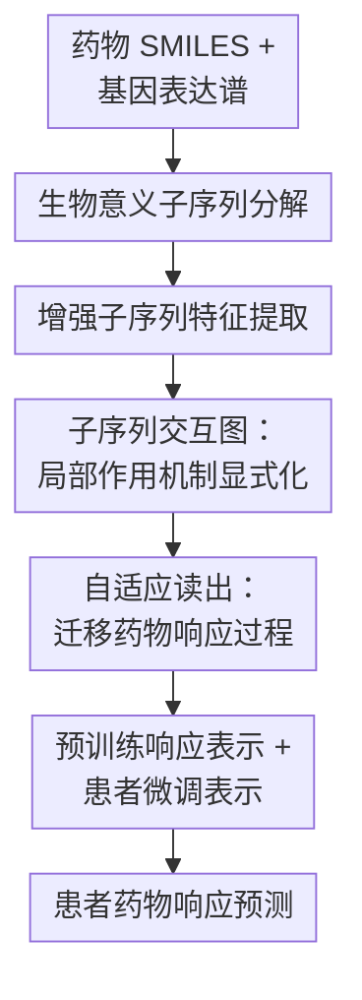

# DeepSADR: Deep Transfer Learning with Subsequence Interaction and Adaptive Readout for Cancer Drug Response Prediction

**会议**: ICLR2026  
**OpenReview**: [https://openreview.net/forum?id=jrFJWpDZvq](https://openreview.net/forum?id=jrFJWpDZvq)  
**代码**: https://github.com/ZYPssss/DeepSADR  
**领域**: 计算生物学 / 癌症药物响应预测  
**关键词**: 癌症药物响应预测, 迁移学习, 子序列交互图, 自适应读出, 细胞系到患者迁移  

## 一句话总结
DeepSADR 把“药物-患者是否响应”建模成药物子结构与基因功能子序列之间的二部交互图，再用图自编码器和 Set Transformer 自适应读出把细胞系中的丰富响应知识迁移到样本稀缺的临床患者数据，在 5 种临床药物上取得平均 AUC 0.856、AUPR 0.862。

## 研究背景与动机
**领域现状**：癌症精准用药希望根据患者的基因表达等组学特征预测某种药物是否有效。
真实患者数据来自 TCGA 等临床队列，但每个患者通常只接受少数药物，带标签的药物响应样本非常少。
相比之下，DepMap 这类癌症细胞系数据可以在同一细胞系上测试大量药物，因此药物-细胞系响应标签更丰富。
现有临床药物响应预测方法常把细胞系作为源域、患者作为目标域，用迁移学习或领域适配把体外数据转化为对体内患者的预测能力。

**现有痛点**：多数方法主要对齐细胞系和患者的全局基因表达分布，默认只要学到一个共享表达空间，就能把细胞系模型迁移到患者。
这个假设过于粗糙。
药物响应不是“整颗分子 + 整个表达向量”的黑箱匹配，而是由药物中的具体药效团、化学片段与患者基因功能通路之间的局部相互作用共同决定。
如果把 SMILES 和基因表达都当成整体特征，模型很难解释到底是哪段药物结构作用在哪类生物过程上。

**核心矛盾**：细胞系和患者之间的差异不只体现在 $P(G_c) \ne P(G_p)$ 这种静态基因分布偏移。
患者体内还有免疫系统、肿瘤微环境、药代动力学等细胞系无法复现的因素，因此真正变化的是“药物响应过程”本身。
只做全局特征对齐会忽略这个机制层面的 domain shift；只做子结构解释又不足以完成从细胞系到患者的迁移。

**本文目标**：作者希望同时解决两个问题。
第一，把药物响应拆成更有生物意义的局部交互，让模型知道哪类药物子结构可能影响哪类基因功能子序列。
第二，在样本很少的患者数据上，只微调少量、最该适配体内机制的模块，从而保留细胞系预训练知识并避免过拟合。

**切入角度**：DeepSADR 的观察是，药物子结构与基因功能通路之间的相互作用比原始基因表达向量更接近“可迁移的作用机制”。
同一个药物片段可能在细胞系和患者中都影响类似的凋亡、DNA 修复或细胞周期通路，只是体内环境会改变这些交互的整体读出方式。
因此，论文把每个 drug-response case 转成一个子序列交互图，再把“如何从图中读出响应表示”作为迁移学习的核心适配点。

**核心 idea**：用药物子结构-基因功能子序列交互图替代整药物/整基因特征拼接，并只微调 Set Transformer 自适应读出和预测器来学习细胞系到患者的响应机制迁移。

## 方法详解
### 整体框架
DeepSADR 是一个两阶段迁移框架。
预训练阶段只使用大规模细胞系药物响应数据，学习药物子结构、基因功能子序列、二者交互图以及图级响应表示。
微调阶段把预训练模型的大部分参数冻结，只更新自适应读出（Adaptive Readout, AR）和患者预测器，并把预训练响应表示拼接进患者表示中，让模型在少量临床标签上适配体内响应机制。

整体流程可以理解为：先把药物和基因表达拆成局部组件，再为每个药物-样本对构建一张二部交互图，随后通过监督图自编码器得到节点表示，最后用可训练的集合读出函数汇聚成图级药物响应表示。
其中“子序列交互图”和“自适应读出”是两个最关键的贡献：前者让模型从机制局部性入手，后者决定哪些交互模式应该被迁移到患者域。

### 关键设计
**1. 生物意义子序列分解：把黑箱输入拆成可解释的作用单元**

传统药物响应模型通常直接编码整条 SMILES 和整条基因表达向量，这会把药物的活性片段、患者的功能通路和很多无关噪声混在一起。
DeepSADR 的第一步是把输入拆成更接近生物机制的子序列：药物侧用 RDKit 中的 BRICS 把 SMILES $S(d_i)$ 分解为 $[S^1_{sub}, S^2_{sub}, \ldots, S^n_{sub}]$，这些片段对应更局部的化学子结构；基因侧用 gseapy 做功能富集，再按 KEGG、GO 等通路信息把基因表达聚成 $[G^1_{sub}, G^2_{sub}, \ldots, G^m_{sub}]$ 这类功能子序列。

这个设计的价值不只是“特征变多了”。
它把预测对象从“药物和患者两个大向量是否匹配”改成“某个药物片段是否作用于某类功能通路”。
例如论文在可视化里展示 Temozolomide 的某个环状片段与细胞应激/凋亡通路有较高交互权重，这种解释粒度比只输出“该药有效”更接近药物机制，也更适合作为从体外到体内迁移的中间表示。

**2. 增强子序列特征提取：药物片段和基因通路用不同编码器处理**

药物子结构仍然是分子图，普通 GNN 的局部消息传递容易受限于化学键邻域，难以捕获非键相互作用和长程结构效应。
DeepSADR 因此在经典 GNN 上叠加边特征融合、归一化、Dropout、残差连接、FFN 和随机游走结构位置编码，形成 GNP 编码器来提取药物子结构表示。
药物侧得到 $Sub^d_i \in \mathbb{R}^{n \times e_d}$，基因侧则用多个全连接层分别编码功能通路子序列，得到 $Sub^c_j$ 或 $Sub^p_j \in \mathbb{R}^{m \times e_g}$。

这种非对称编码是合理的：药物片段天然有图结构，基因功能子序列更像由富集通路组织起来的表达特征集合。
如果两侧都用同一种粗粒度编码器，模型要么丢掉分子结构，要么把通路信息硬套成图。
附录消融中，作者把 GNP 换成最简单的 GNN 后，五药平均性能下降，说明药物子结构编码的细节确实影响后续交互图质量。

**3. 子序列交互图：用二部图显式表示药物片段与基因功能的作用强度**

有了两侧子序列表示后，DeepSADR 不直接拼接预测，而是用双线性打分函数计算每个药物片段和每个基因功能子序列之间的交互强度：$\psi(\hat d, \hat g)=\sigma(\hat d W \hat g^\top)$。
所有配对分数构成矩阵 $R \in \mathbb{R}^{n \times m}$，其中每个值都在 $[0,1]$ 内，表示一条可能的药物子结构-基因功能边。
随后模型用阈值 $t$ 过滤弱边，得到 $\hat R$，并构造二部邻接矩阵 $A=\begin{pmatrix}0 & \hat R \\ \hat R^\top & 0\end{pmatrix}$。

这个阈值过滤看似简单，但在这篇论文里很关键。
如果保留完整二部图，很多低分边只是噪声，会干扰图编码；如果阈值过高，又可能删掉真正有用的弱交互。
作者在不同药物上使用不同最佳阈值，例如 Fluorouracil 为 0.19、Temozolomide 为 0.40、Sorafenib 为 0.57，并在敏感性实验中发现阈值对性能波动很明显。
构图后，监督图自编码器（SGAE）在这张二部图上学习节点潜表示 $Z=SGAE(X,A)$，既聚合交互结构，也保留可视化解释的入口。

**4. 自适应读出：把迁移重点放在“药物响应过程”的图级汇聚上**

普通图级任务常用 sum、mean、max 读出节点表示，但这些固定池化函数假设所有节点贡献模式基本稳定。
在细胞系到患者迁移中，这个假设很危险：体外和体内的药物响应机制会因为免疫环境、微环境和系统性因素而改变，真正需要适配的是“哪些子序列交互应该被重视、如何组合成响应表示”。
DeepSADR 用 Set Transformer 思路设计 Adaptive Readout，让读出函数对节点集合保持置换不变，同时通过多头注意力学习复杂交互组合。

具体地，SGAE 输出的节点表示先进入若干 SAB 编码块，再经过 PMA 和 SAB/FF 解码块，最后对多头输出求平均得到图级表示 $Z=AR(Z)$。
预训练时，所有参数在细胞系响应标签上更新；微调时，除 AR 和预测器外的模块全部冻结。
同时，患者输入还会经过冻结的预训练模型产生 $\hat Z_{pre}$，与微调分支得到的 $Z_{fine}$ 拼接为 $[Z_{fine} \Vert \hat Z_{pre}]$。
这样做的含义很清楚：底层子结构、通路和交互图知识主要来自大规模细胞系；患者小样本只负责调节读出和预测边界，避免整个模型在几百个临床标签上过拟合。

### 一个完整示例
以 Temozolomide 的患者响应预测为例，输入是一条药物 SMILES 和某个 TCGA 患者的 1,426 维基因表达特征。
模型先用 BRICS 把 Temozolomide 拆成若干化学子结构，同时把患者基因表达按功能富集结果组织成凋亡、细胞周期调控、DNA 修复等功能子序列。
药物片段经 GNP 编码，功能子序列经全连接层编码，然后二者两两计算双线性交互分数。

如果某个药物片段与“细胞应激和凋亡路径”的分数高于阈值，它会在二部图中保留为一条边；低分边被视作噪声删掉。
SGAE 随后在这张图上传播信息，让每个节点表示不仅包含自身子序列特征，也包含它与另一侧子序列的交互上下文。
最后 AR 读出整张图，并与冻结预训练模型产生的响应表示拼接，由预测器输出该患者对 Temozolomide 的响应概率。
论文的可视化分析显示，模型学到的高权重片段与已有 Temozolomide 作用机制文献相符，说明这个例子不仅是预测流程，也能作为机制解释线索。

### 损失函数 / 训练策略
预训练阶段只使用细胞系数据，所有模块一起训练。
损失由响应预测误差和 VAE 正则组成：$L_{pre}=MSE(P_1(Z_{pre}),Y_c)-KL[q(Z|X,A)\Vert p(Z)]$，其中 $p(Z)$ 是标准高斯先验。
这里的目标是让模型在大规模细胞系药物响应上学会稳定的子序列交互图编码和图级响应表示。

微调阶段只使用患者数据，冻结子序列分解、特征提取和 SGAE 等预训练模块，只训练 AR 与预测器。
损失为 $L_{fine}=MSE(P_2([Z_{fine}\Vert \hat Z_{pre}]),Y_p)$。
患者标签极少，作者采用 7:3 的 train/test 划分，并在 5 种至少有 20 个患者响应样本的药物上微调。
超参数中，卷积层数通常为 6、注意力头为 4、Dropout 为 0.5，预训练 200 epoch、微调 100 epoch；阈值则按药物调优。

## 实验关键数据

### 主实验
论文使用与 WISER 相同的细胞系和患者基因表达特征，包含 1,426 个基因。
预训练数据来自 DepMap，共 966 个癌症细胞系样本和 20 种细胞系/患者共有药物。
微调数据来自 TCGA，共 555 个患者样本；主实验选择患者响应样本不少于 20 的 5 种药物：Fluorouracil、Temozolomide、Sorafenib、Gemcitabine 和 Cisplatin。
评价指标为 AUC 和 AUPR，表中数值为均值/标准差。

| 药物 | DeepSADR AUC | DeepSADR AUPR | 最强基线 AUC | 最强基线 AUPR | 主要结论 |
|------|--------------|---------------|--------------|---------------|----------|
| Fluorouracil | 0.805/0.056 | 0.821/0.023 | 0.793(GANDALF) | 0.794(TransDRP) | DeepSADR 小幅领先，AUPR 优势更明显 |
| Temozolomide | 0.870/0.026 | 0.886/0.029 | 0.791(GANDALF) | 0.786(WISER) | 对胶质瘤常用药提升稳定 |
| Sorafenib | 0.957/0.037 | 0.978/0.024 | 0.811(GANDALF) | 0.795(GANDALF) | 五药中提升最显著 |
| Gemcitabine | 0.719/0.057 | 0.702/0.022 | 0.709(GANDALF) | 0.697(GANDALF) | 优势较小，说明部分药物仍接近上限或受样本限制 |
| Cisplatin | 0.927/0.027 | 0.922/0.021 | 0.852(GANDALF) | 0.813(GANDALF) | 明显优于迁移和领域适配基线 |

从平均结果看，DeepSADR 的 AUC/AUPR 为 0.856/0.862，强于 GANDALF 的 0.791/0.765、WISER 的 0.726/0.741 和 CODE-AE 的 0.680/0.711。
作者还把未做迁移适配的细胞系模型直接用于患者，AUC/AUPR 通常低 0.2 到 0.3，说明简单把体外模型搬到临床患者并不可行。

### 消融实验
| 配置 | 平均 AUC | 平均 AUPR | 说明 |
|------|----------|-----------|------|
| DeepSADR | 0.856 | 0.862 | 完整模型 |
| w/o AR | 0.662 | 0.675 | 用 sum/max/mean 等传统读出替代自适应读出 |
| w/o SN | 0.698 | 0.710 | 移除子序列交互图，直接读出子序列特征 |
| w/o TS | 0.775 | 0.749 | 不做阈值筛边，保留低权重噪声边 |
| w/o ET | 0.781 | 0.787 | 微调时不拼接预训练响应表示 |
| w/o GNP | 约低于完整模型 | 约低于完整模型 | 用普通 GNN 替代增强药物子结构编码器 |

消融结果很清楚：掉得最厉害的是 w/o AR，平均 AUC 从 0.856 降到 0.662，说明读出函数不是一个可随便替换的池化层，而是迁移学习的核心适配位置。
w/o SN 也明显下降，说明只拼接药物/基因子序列特征不够，必须把二者组织成交互图。
w/o TS 和 w/o ET 的下降说明，筛掉低置信边以及保留预训练响应表示都在小样本患者微调中起作用。

### 关键发现
- 子序列交互图和自适应读出是互补关系：前者提供更有机制含义的局部交互输入，后者从这些交互中提取更适合跨域迁移的图级响应表示。
- DeepSADR 对不同药物的阈值很敏感；阈值过低会引入噪声边，阈值过高会删掉真实但较弱的交互，这也是作者明确承认的局限。
- 在 Sunitinib、Doxorubicin、Erlotinib 等患者样本更少的药物上，DeepSADR 仍优于基线，但性能下降，说明患者标签量仍是临床迁移的硬约束。
- 可视化实验把 Temozolomide 的药物片段和患者功能通路画成热图，高权重交互与已有生物医学研究中关于四嗪环片段、细胞应激和凋亡通路的结论相符，增强了模型解释性。

## 亮点与洞察
- **把迁移对象从静态基因表达改成响应过程**：许多领域适配方法只对齐细胞系和患者的表达分布，DeepSADR 更强调药物片段与功能通路的交互模式。
这让迁移学习更贴近“药物为什么在体内/体外表现不同”的生物问题，而不是只做特征空间工程。

- **子序列交互图提供了可解释的中间层**：模型输出的不只是响应概率，还能给出药物子结构和基因功能子序列之间的交互热图。
对于药物响应预测这种高风险临床辅助任务，可解释性本身就是实用价值的一部分。

- **只微调 AR 的策略很适合小样本患者数据**：患者响应样本每种药只有几十到一百多例，如果全模型微调，很容易把细胞系学到的通用结构知识破坏掉。
冻结底层交互建模、只调整读出和预测头，是一种相对克制的迁移方式。

- **阈值筛边把交互图从“完全连接解释”变成“稀疏机制假设”**：完全二部图虽然包含所有可能关系，但解释上几乎不可读，训练上也会混入大量弱相关边。
可学习打分加阈值过滤让图更稀疏，既提高性能，也让热图中的高权重交互更有意义。

## 局限与展望
- 患者数据仍然太少，主实验中最小的 Sorafenib 只有 26 个患者样本，Cisplatin 也只有 40 个。
这种规模下即便使用多随机种子，结果仍可能对划分和超参数较敏感，需要更大临床队列验证泛化性。

- 阈值 $t$ 需要按药物单独调优，是一个明显的工程和科学局限。
不同药物的最佳阈值差别较大，说明交互图稀疏度与药物结构、作用机制、样本规模都有关系；未来可以考虑可学习阈值、边稀疏正则或贝叶斯不确定性筛边。

- 基因功能子序列依赖通路富集和聚类质量。
如果输入基因表达噪声大、通路注释不完整，或者某些药物机制不主要经过已知通路，交互图的可解释性和预测性能都会受影响。

- 论文把患者药物响应标签定义为化疗后复发时间高于/低于中位数，这是一种可操作但相对粗粒度的二分类标签。
真实临床响应还涉及剂量、联合用药、治疗线数、生存结局和副作用等因素，未来需要更丰富的临床终点。

- 模型虽然有热图解释，但尚未形成严格的因果验证。
高权重药物片段-通路交互与文献相符是有力信号，但仍需要湿实验或更系统的药理验证来证明这些边确实对应作用机制。

## 相关工作与启发
- **vs CODE-AE**: CODE-AE 通过上下文解耦和自编码器学习更稳健的药物响应表示，重点在去除混杂因素和对齐表达空间。
DeepSADR 的区别是显式建模药物子结构与基因功能子序列之间的交互，并把响应过程本身作为迁移对象；优势是解释性更强，但也依赖更复杂的构图和阈值调参。

- **vs WISER / GANDALF**: WISER 用弱监督和表示学习缓解患者标签稀缺，GANDALF 用生成式注意力和数据增强让细胞系样本更接近患者分布。
DeepSADR 不主要生成伪患者样本，而是让细胞系知识通过子序列交互图和 AR 读出迁移；在主实验中它对 Sorafenib、Cisplatin、Temozolomide 的提升尤其明显。

- **vs GraphCDR / DeepTTA**: GraphCDR 和 DeepTTA 更偏向细胞系药物响应预测，使用图神经网络、对比学习或 Transformer 建模药物-基因关系。
DeepSADR 的任务设置更临床化：目标是从细胞系迁移到患者，而且患者域只微调少量模块。
这说明面向体外 benchmark 的强模型，直接用于患者时可能不如专门设计迁移机制的模型。

- **启发**: 这篇论文的思路可以迁移到其他“体外数据多、体内数据少”的生物医学预测任务。
例如药物毒性、联合用药协同、免疫治疗响应等问题，也可以把分子片段、通路模块、细胞状态或微环境特征组织成交互图，再把读出函数作为跨域适配的主要学习对象。

## 评分
- 新颖性: ⭐⭐⭐⭐☆ 把子序列交互图和自适应读出结合到细胞系到患者的药物响应迁移中，思路清晰且有机制解释价值。
- 实验充分度: ⭐⭐⭐⭐☆ 主实验、消融、无微调对比、可视化、敏感性和统计显著性都比较完整，但临床样本规模仍偏小。
- 写作质量: ⭐⭐⭐⭐☆ 方法结构和动机比较清楚，附录信息丰富；部分公式和图示说明略显堆叠，需要读者花时间对齐模块。
- 价值: ⭐⭐⭐⭐☆ 对癌症精准用药预测有实际意义，尤其适合启发“可解释局部机制 + 小样本迁移”的生物医学建模范式。

<!-- RELATED:START -->

## 相关论文

- [\[ICLR 2026\] GRAM-DTI: Adaptive Multimodal Representation Learning for Drug-Target Interaction Prediction](gram-dti_adaptive_multimodal_representation_learning_for_drugtarget_interaction_.md)
- [\[ICLR 2026\] I2Mole: Interaction-aware Invariant Molecular Learning for Generalizable Drug-Drug Interaction Prediction](i2mole_interaction-aware_invariant_molecular_learning_for_generalizable_property.md)
- [\[ICLR 2026\] Adaptive Data-Knowledge Alignment in Genetic Perturbation Prediction](adaptive_data-knowledge_alignment_in_genetic_perturbation_prediction.md)
- [\[ICLR 2026\] Readout Representation: Redefining Neural Codes by Input Recovery](readout_representation_redefining_neural_codes_by_input_recovery.md)
- [\[AAAI 2026\] SpaCRD: Multimodal Deep Fusion of Histology and Spatial Transcriptomics for Cancer Region Detection](../../AAAI2026/computational_biology/spacrd_multimodal_deep_fusion_of_histology_and_spatial_transcriptomics_for_cance.md)

<!-- RELATED:END -->
