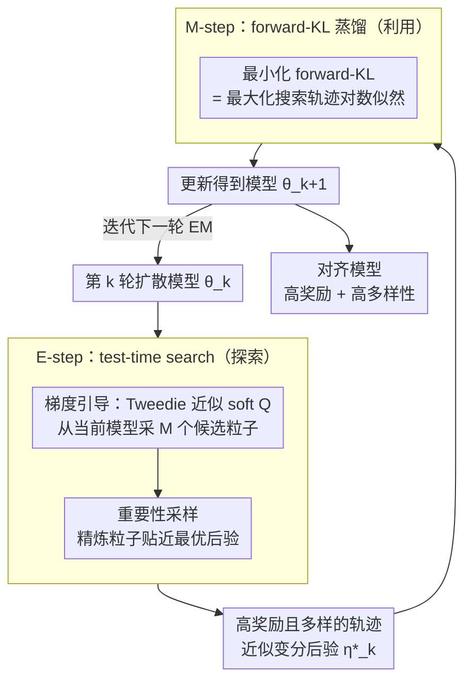

# Diffusion Alignment as Variational Expectation-Maximization

**会议**: ICLR 2026  
**arXiv**: [2510.00502](https://arxiv.org/abs/2510.00502)  
**代码**: [https://github.com/Jaewoopudding/dav](https://github.com/Jaewoopudding/dav)  
**领域**: 计算生物  
**关键词**: diffusion alignment, expectation-maximization, test-time search, reward optimization, mode collapse prevention  

## 一句话总结
将扩散模型对齐形式化为变分 EM 算法：E-step 用 test-time search（soft Q 引导 + 重要性采样）探索高奖励多模态轨迹，M-step 通过 forward-KL 蒸馏将搜索结果写入模型参数，在图像生成和 DNA 序列设计上同时实现高奖励和高多样性。

## 研究背景与动机

**领域现状**：扩散模型对齐（使生成匹配外部奖励）主要有两条路线：RL（DDPO/DPOK）和直接反向传播（DRaFT/AlignProp）。

**现有痛点**：RL 方法用 reverse-KL 优化，导致 mode-seeking 行为→模式坍缩和多样性丧失；直接反向传播依赖奖励模型的梯度信号，容易 reward over-optimization。两类方法在训练后期都出现 reward 高但图像质量/多样性急剧下降的现象。

**核心矛盾**：reward 优化 vs 多样性保持的 trade-off。Reverse-KL 天然 mode-seeking，容易坍缩到单一模式。

**本文目标**：设计一个对齐框架，能有效优化奖励的同时保持样本多样性和自然性，且适用于连续（图像）和离散（DNA）扩散模型。

**切入角度**：将对齐问题形式化为变分 EM——引入最优性变量 $\mathcal{O}$ 和轨迹潜变量 $\tau$，E-step 找多模态后验，M-step 用 forward-KL（mode-covering）蒸馏。Forward-KL 天然鼓励覆盖所有模式而非聚焦单一模式。

**核心 idea**：E-step 用 test-time search 发现多模态高奖励样本，M-step 用 forward-KL 蒸馏保持多样性，循环迭代逐步改善。

## 方法详解

### 整体框架

DAV 想解决的是扩散模型对齐里"奖励越调越高、多样性却越掉越惨"的老毛病。它的破局思路是把对齐重新写成一个变分 EM 循环：先在测试时主动搜出一批既高奖励又互不雷同的轨迹，再把这批轨迹蒸馏回模型，如此往复，让奖励和多样性一起往上走。落到每一轮 EM 上就是两步交替——E-step（探索）从当前模型出发，用 test-time search（梯度引导采样 + 重要性采样）生成高奖励且多样的轨迹，近似变分后验 $\eta_k^*$；M-step（蒸馏）拿这些轨迹训练模型，最小化 forward-KL $D_{\text{KL}}(\eta_k^* \| p_\theta)$，等价于最大化搜索轨迹的对数似然 $-\log p_\theta(\tau)$。两步循环往复，模型一轮比一轮更对齐，E-step 也就能从越来越好的分布里采到更优的轨迹，形成正向循环。

### 关键设计

**1. 变分 EM 形式化：把 reward 优化改写成带最优性变量的边际似然最大化**

直接对奖励做 RL 容易 mode-seeking，DAV 换了个视角：引入一个最优性变量 $\mathcal{O}$，定义 $p(\mathcal{O}=1|\tau) \propto \exp(\sum r_t/\alpha)$，把整条去噪轨迹 $\tau$ 当成潜变量，于是对齐就成了最大化 $\mathcal{O}$ 的边际似然。对应的 ELBO 记作 $\mathcal{J}_{\alpha,\gamma}(\eta, p_\theta)$，其中折扣因子 $\gamma$ 用来衰减离终端越远的时间步的信用，避免早期高噪声步抢走奖励信号。这个改写最大的好处是天然把探索（E-step 找后验 $\eta$）和利用（M-step 更新 $p_\theta$）解耦，而且 M-step 用的是 mode-covering 的 forward-KL，从根上堵住坍缩。

**2. E-step——test-time search：用主动搜索近似最优变分后验**

E-step 要采样的目标后验是 $\eta_k^*(x_{t-1}|x_t) \propto p_{\theta_k}(x_{t-1}|x_t) \exp(Q_{\text{soft}}^*/\alpha)$，即在当前模型的去噪分布上乘一个 soft Q 的指数权重。DAV 分两阶段近似它：先做梯度引导，用 Tweedie's formula 把 $Q_{\text{soft}}$ 近似成 $\gamma^{t-1} r(\hat{x}_0(x_{t-1}))$（拿当前状态预测出的干净样本 $\hat{x}_0$ 的奖励来打分），据此采样 $M$ 个候选粒子；再用重要性采样在这 $M$ 个粒子里精炼，挑出真正贴近后验的。之所以不走传统 EM-RL 的 on-policy 重加权，是因为一旦策略偏离后验，重加权就会严重有偏；主动搜索则能跑到当前策略分布之外，把策略本来采不到的高奖励区域挖出来。

**3. M-step——forward-KL 蒸馏：把搜索到的轨迹写回模型参数**

E-step 找到的好轨迹要落进模型才有用。M-step 最小化 forward-KL，损失就是搜索轨迹下的负对数似然 $\mathcal{L}_{\text{DAV}} = -\mathbb{E}_{\tau \sim \eta_k^*}[\log p_\theta(\tau)]$；需要约束对预训练模型的偏离时，可以再加一项 KL 正则 $\mathcal{L}_{\text{DAV-KL}} = \mathcal{L}_{\text{DAV}} + \lambda D_{\text{KL}}(p_\theta \| p_{\theta^0})$。关键在 forward-KL 的方向：最小化 forward-KL 等于最大化搜索样本的似然，是 mode-covering 的，会逼模型去覆盖后验里所有被搜出来的模式；这正好和 RL 用的 reverse-KL（mode-seeking、只盯一个峰）相反，所以多样性能自然保住。

**4. 模块化设计：搜索器可换、连续离散通吃**

E-step 的搜索只是个即插即用的组件，可以替换成任意 test-time search 方法，框架本身不绑定某种特定搜索；同时整套 EM 推导不依赖样本空间是连续还是离散，所以连续的图像扩散和离散的 DNA 序列扩散都能直接套用。

### 损失函数 / 训练策略

- 基于 SD v1.5，奖励为 LAION aesthetic score（可微）或 compressibility（不可微）
- EM 迭代 100 epochs
- E-step 每步采样 $M$ 个候选, 重要性采样选择
- 折扣因子 $\gamma$ 衰减早期时间步的信用分配

## 实验关键数据

### 主实验（Text-to-Image, SD v1.5, Aesthetic Reward）

| 方法 | Aesthetic ↑ | LPIPS-A ↑ | ImageReward ↑ | 类型 |
|------|-----------|---------|-------------|------|
| Pretrained | 5.40 | 0.65 | 0.90 | — |
| DDPO | 6.83 | 0.48 | 0.27 | RL |
| DRaFT | 7.22 | 0.46 | 0.19 | 反向传播 |
| **DAV** | **8.04** | 0.53 | **0.95** | EM |
| DAV-KL | 6.99 | **0.58** | 1.13 | EM+KL |
| DAS (search only) | 7.22 | 0.65 | 1.07 | 推理时 |
| DAV Posterior | **9.18** | 0.53 | 0.91 | EM+search |

### 消融实验

| 分析 | 关键发现 |
|------|---------|
| DAV ELBO 趋势 | ELBO 单调递增（近似），消融掉 E-step search 后 ELBO 下降 |
| DAV vs DAV-KL | KL 正则化牺牲奖励（8.04→6.99）换取多样性（0.53→0.58） |
| DDPO/DRaFT 100 epochs | 已严重坍缩，ImageReward 降至负值 |

### 关键发现
- DAV 的奖励（8.04）远超 DDPO（6.83）和 DRaFT（7.22），同时 ImageReward 保持 0.95（接近预训练的 0.90），说明没有 reward over-optimization
- DDPO 和 DRaFT 在训练后期 ImageReward 暴跌（0.27/0.19），说明严重过优化
- DAV Posterior（推理时加 search）达到 9.18 aesthetic，是所有方法最高
- 在 DNA 序列设计上也有效，在 reward-diversity-naturalness 三个维度上全面超越 baseline

## 亮点与洞察
- **Forward-KL vs Reverse-KL** 的选择是核心洞察。RL 方法用 reverse-KL（mode-seeking→坍缩），DAV 用 forward-KL（mode-covering→保持多样性）。这个选择的理论动机清晰且实验验证充分。
- **Test-time search amortization** 是一个通用思路——先搜索再蒸馏，将推理时计算转化为模型能力。可以迁移到任何需要在推理时做昂贵搜索的场景（如代码生成、分子设计等）。
- **跨模态适用**：同一框架同时处理连续（图像）和离散（DNA）扩散，说明方法论的通用性。

## 局限与展望
- E-step 的 test-time search 增加训练开销（每个 EM 迭代需要多次 ODE/forward pass）
- Tweedie's formula 估计 $Q^*_{\text{soft}}$ 只是近似，对高噪声时间步可能不准
- 只在 SD v1.5 上验证，缺少 SDXL/Flux 等更大模型的实验
- 折扣因子 $\gamma$ 的最优选择未被系统研究
- Forward-KL 蒸馏可能无法精确覆盖后验的所有模式（有限样本+有限训练步）

## 相关工作与启发
- **vs DDPO/DPOK**: 都是 RL 对齐，但 DAV 用 forward-KL 替代 reverse-KL，核心区别在于 mode-covering vs mode-seeking。DAV 奖励更高且不坍缩。
- **vs DRaFT/AlignProp**: 直接反向传播效率高但梯度信号脆弱。DAV 不要求可微奖励。
- **vs DAS (test-time search)**: DAS 只做推理时搜索不更新模型。DAV 将搜索结果蒸馏回模型，推理时无额外开销。

## 评分
- 新颖性: ⭐⭐⭐⭐⭐ 变分 EM 视角统一了 RL 和 test-time search，forward-KL 蒸馏是关键创新
- 实验充分度: ⭐⭐⭐⭐ 图像+DNA 双域验证，训练动态分析充分，但仅 SD v1.5
- 写作质量: ⭐⭐⭐⭐⭐ 理论推导清晰，动机-方法-实验逻辑严谨
- 价值: ⭐⭐⭐⭐⭐ 解决了扩散对齐的核心痛点（over-optimization + mode collapse），具有广泛适用性

<!-- RELATED:START -->

## 相关论文

- [\[ICLR 2026\] Discrete Diffusion Trajectory Alignment via Stepwise Decomposition](discrete_diffusion_trajectory_alignment_via_stepwise_decomposition.md)
- [\[ICLR 2026\] Riemannian Variational Flow Matching for Material and Protein Design](riemannian_variational_flow_matching_for_material_and_protein_design.md)
- [\[ICLR 2026\] Unified Biomolecular Trajectory Generation via Pretrained Variational Bridge](unified_biomolecular_trajectory_generation_via_pretrained_variational_bridge.md)
- [\[ICLR 2026\] Fast and Interpretable Protein Substructure Alignment via Optimal Transport](fast_and_interpretable_protein_substructure_alignment_via_optimal_transport.md)
- [\[ICLR 2026\] Property-Driven Protein Inverse Folding with Multi-Objective Preference Alignment](property-driven_protein_inverse_folding_with_multi-objective_preference_alignmen.md)

<!-- RELATED:END -->
