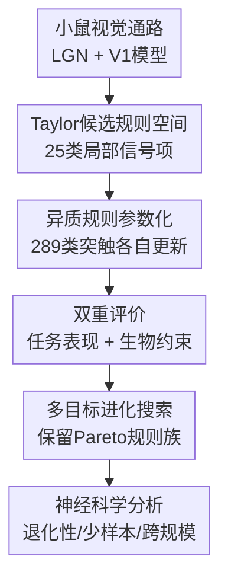

# Discovering heterogeneous synaptic plasticity rules via large-scale neural evolution

**会议**: ICLR2026  
**OpenReview**: [https://openreview.net/forum?id=hJBPMSUNUG](https://openreview.net/forum?id=hJBPMSUNUG)  
**代码**: 无  
**领域**: 计算神经科学 / 突触可塑性  
**关键词**: 异质突触可塑性, 进化搜索, 小鼠V1, 工作记忆, 生物合理性  

## 一句话总结

这篇论文把小鼠初级视觉皮层 V1 建成一个可塑的脉冲神经网络，在由脉冲、资格迹和奖赏预测误差信号组成的巨大可解释规则空间中，用多目标进化算法搜索不同突触类型各自的学习规则，发现多种数学形式很不一样的规则都能同时保持生物合理性、视觉变化检测能力、少样本适应性和跨网络规模泛化。

## 研究背景与动机

**领域现状**：突触可塑性通常被看作学习和记忆的底层机制。经典理论从 Hebbian 学习、BCM、Oja 规则一路发展到 STDP，关注的是神经元活动如何导致突触权重改变；实验神经科学则发现，不同突触类型、不同兴奋/抑制细胞、不同脑区和不同神经调质状态下，可塑性规则并不相同。

**现有痛点**：问题在于，单个突触或小规模网络上的规则很难解释真实皮层电路里的集体行为。真实 V1 里有多种细胞类型、层间连接和兴奋/抑制通路，不同 synapse type 可能遵循不同规则；而已有计算工作常常只在小型人工网络中搜索统一规则，或者只粗略地区分兴奋与抑制突触，无法系统探索“异质规则族”如何共同产生行为。

**核心矛盾**：一边是生物实验给出的强约束：放电率、放电分布、Dale 法则、突触权重范围都不能乱来；另一边是功能目标：网络需要真的完成视觉变化检测、形成工作记忆式的延迟期活动，还要能少样本学习。如果只追求任务准确率，搜索可能找到生物上荒唐的解；如果只模仿生物统计，又可能没有行为能力。

**本文目标**：作者要回答的不是“哪一条塑性规则最好”，而是“在一个接近真实小鼠 V1 的电路中，哪些数学结构的异质突触可塑性规则既能产生功能行为，又不偏离生物约束”。这要求同时定义可解释的候选规则空间、可扩展的搜索算法、任务与生物双重评价指标，以及对搜索结果的神经科学解释。

**切入角度**：论文把 Darwinian evolution 当成搜索机制：一个 population 中同时保留许多候选规则，用多目标选择让高任务表现、低复杂度、更接近生物统计的规则留下来，再通过交叉和变异产生新规则。这个角度适合研究“规则族”和 Pareto trade-off，而不是只用梯度优化逼出一个单点解。

**核心 idea**：用截断 Taylor 展开把局部神经信号组合成可解释的突触可塑性规则空间，再在生物真实 V1 模型中通过多目标大规模进化搜索，发现一批功能等价但数学结构不同的异质可塑性规则。

## 方法详解

### 整体框架

整套方法可以理解为四步：先固定一个带 LGN 输入通路的小鼠 V1 脉冲网络，再为 17 种神经元类型两两形成的 289 类突触定义候选可塑性规则；然后把每条规则放进 V1 中做视觉变化检测训练与验证，同时测任务表现和生物统计；最后用噪声感知的多目标进化算法在 2645 维左右的参数空间里搜索 Pareto-optimal 规则族。

这里的关键不是把 V1 当成普通神经网络训练，而是把“学习算法本身”当作被进化的对象。每个候选个体是一整套异质 plasticity rule：不同突触类型可以拥有不同系数，神经元类型还可以拥有不同资格迹和奖赏迹时间常数。规则被评价时，V1 权重按该规则在线更新；验证时关闭可塑性，检查它是否真的学到了变化检测能力。

### 关键设计

**1. Taylor候选规则空间：把可塑性搜索限制在可解释的局部信号组合内**

如果直接让算法自由生成学习规则，搜索空间会大到无法解释，也很容易产生不具备神经科学意义的黑箱更新。作者从五类局部信号出发：突触前脉冲 $S_{pre}$、突触后脉冲 $S_{post}$、突触前资格迹 $X_{pre}$、突触后资格迹 $X_{post}$ 和奖赏预测误差迹 $R$。其中资格迹记录近期神经活动历史，奖赏预测误差迹模拟神经调质信号。这样一来，规则的输入都对应真实神经系统里可讨论的变量，而不是任意隐藏状态。

候选项通过三阶截断 Taylor 展开生成：

$$
P = \{ \prod_{j=1}^{q} u_j \mid u_j \in \{S_{pre}, S_{post}, X_{pre}, X_{post}, R\}, q \le 3 \}.
$$

作者再删除冗余项和无意义项，例如 $S_{pre}^2=S_{pre}$、$R^2$ 不保留，最终得到 25 个候选 plasticity terms。每条突触规则可以看成这些项的门控加权和：

$$
\Delta W^{(m_{pre},m_{post})} = \sum_{k=1}^{N_P} g_k c_{k,(m_{pre},m_{post})} P_k.
$$

这里 $g_k\in\{0,1\}$ 控制某一项是否启用，$c_{k,(m_{pre},m_{post})}$ 是对应突触类型的系数。这个设计的妙处在于，规则空间足够大，能包含简单的 presynaptic-only 规则、资格迹交互、奖赏调制项和高阶组合；但每个被发现的规则仍能写成清楚的数学式，便于后续神经科学解释。

**2. 异质突触参数化：让不同细胞类型连接真正拥有不同学习机制**

论文使用的是 Billeh 等人构建的小鼠 V1 生物真实模型，并参考后续修改版本，让网络包含 17 类神经元：兴奋性细胞以及 Pvalb、Sst、Htr3a 等抑制性细胞类别，分布在不同皮层层级中。17 类神经元两两连接，对应 $17^2=289$ 种 synapse type。本文没有假设所有突触共享同一规则，而是允许不同 $m_{pre}\rightarrow m_{post}$ 连接拥有不同系数。

这种异质性还体现在时间常数上。资格迹按指数衰减：

$$
X_i(t+\Delta t)=X_i(t)-\frac{\Delta t}{\tau_E^m}X_i(t)+S_i(t),
$$

奖赏预测误差则先用最近 $N_{win}=20$ 个 trial 的平均 reward 构造预测，得到 $\delta_R(l_i)=r(l_i)-\bar r(l_i)$，再通过神经元类型相关的 $\tau_R^m$ 形成 reward trace。也就是说，同一个奖赏事件对不同神经元群体的持续影响可以不同，符合神经调质和 eligibility trace 在不同细胞类型中呈现异质动态的生物观察。

整个参数量因此达到 2645 个：包括神经元类型相关系数、突触类型相关系数、25 个二值门控、资格迹/奖赏迹时间常数以及读出阈值。作者同时施加 Dale 法则、突触类型特定的权重上下界，以及每次更新不超过当前权重比例的自适应缩放，避免搜索把网络推向符号翻转、权重爆炸或不生物的极端状态。

**3. 双重评价指标：用任务表现和生物合理性共同决定规则是否值得保留**

每条候选规则都会被放进 V1 模型里评估。视觉刺激先经过固定的 retina/LGN/LGN-to-V1 通路，再进入可塑的 V1；读出层来自 L5 excitatory neurons。任务是视觉变化检测，包含 grating image 和 ImageNet natural image 两个 domain。每次评价先跑 100 个 training trials，此时启用可塑性；随后跑 validation/testing trials，此时关闭可塑性，看网络是否形成了能支持 1-back 式变化检测的内部状态。

评价不只看准确率。作者使用 6 个目标：跨域平均任务准确率越高越好，规则复杂度越低越好，最大放电率越低越好，同步放电比例越低越好，平均放电率与小鼠数据差异越小越好，放电率分布与小鼠数据的 Wasserstein 距离越小越好。这样可以防止搜索找到“靠全网同步爆发来做对任务”的伪解。

这个指标设计也让结果有解释空间。例如某些简单规则复杂度很低、表现接近小鼠行为；复杂规则可能准确率更高但不一定在所有生物指标上最优。最后筛出的不是一个绝对冠军，而是 Pareto 前沿上的一批规则，适合研究不同机制如何达成相似行为。

**4. 噪声感知多目标进化：在昂贵、随机且不可微的规则空间中保留可靠的规则族**

评估一条规则需要从头模拟 V1 学习过程，且不同随机种子和刺激序列会带来噪声；同时规则包含二值门控、脉冲事件、硬约束和多目标指标，很难直接用梯度优化。作者因此设计了基于 EvoX/JAX 的并行进化框架，每代维护 4000 条规则，总共进化 150 代，并利用 8 块 A6000 GPU 做 batched evaluation。

繁殖阶段采用类似 Competitive Swarm Optimizer 的机制：随机配对个体，在随机抽取的目标上比较出 teacher 和 student，student 朝 teacher 和群体中心方向更新，再对 teacher/student 都做 mutation。选择阶段不是简单按一次评价排序，而是维护目标均值和方差，用概率优势关系做 non-dominated sorting；如果某个候选因为噪声方差很大，必须有足够明确的优势才会被认为支配另一个候选。

这种设计服务于论文的科学问题：作者想看“哪些规则族稳定存在”，而不是让一次偶然高分的个体主导搜索。最终从最后一代 Pareto population 中按任务表现和生物有效性筛出 70 条规则，再分析它们的数学形式、比例、代表性行为和跨场景鲁棒性。

### 一个完整示例

可以把一次候选规则评估想象成这样：某个个体选择了 5 个 active terms，例如整体最佳规则的形式为

$$
\Delta w = X_{post}+S_{pre}X_{pre}+S_{post}X_{pre}+X_{post}^2+X_{post}R.
$$

在 grating change detection 中，网络先看到一串视觉刺激。前 100 个 trial 是训练阶段，如果当前刺激相对前一个刺激发生变化且 L5 excitatory readout 超过阈值，网络得到相应 reward；reward 与过去 20 个 trial 的平均 reward 比较，形成 $\delta_R$，再通过 $R$ 影响包含奖赏项的突触更新。与此同时，每个神经元的脉冲会积累到 $X_{pre}$ 或 $X_{post}$，让更新不仅依赖当前 spike，也依赖最近一段时间的活动历史。

到验证阶段，塑性规则被关闭，权重固定。此时模型仍要根据当前和上一帧刺激之间是否变化来输出响应。如果规则有效，V1 在 stimulus window 和 delay period 之间会维持合适的持续活动，使读出层能区分 change 与 no-change；如果规则只是把权重推爆，最大放电率、同步比例或放电分布指标会把它筛掉。最终这条规则在两个视觉 domain 上都有较好表现，才可能进入 Pareto 前沿。

### 损失函数 / 训练策略

本文没有使用传统单一 loss 来训练 plasticity rule，而是把规则搜索写成多目标优化：

$$
\min F(\theta)=(f_1(\theta),\ldots,f_{N_o}(\theta)), \quad \theta\in\Omega_\theta,
$$

其中 $\theta=\{c,g,\tau_E,\tau_R\}$，再加上任务共享读出阈值 $\phi$。连续系数 $c\in[-1,1]$，门控 $g\in\{0,1\}$，资格迹和奖赏迹时间常数在 $(0,150]$，读出阈值 $\phi\in[0,10]$ Hz。搜索目标中，任务准确率是最大化目标，其余复杂度和生物偏差类指标按最小化处理。

V1 训练协议是短时在线学习：进化评估阶段每个任务 100 个训练 trial + 100 个验证 trial；收敛后最终评估用 100 个训练 trial + 200 个 testing trial，且跨 5 个随机种子报告均值和标准差。与 Adam/SGD baseline 比较时，作者用 surrogate gradient 和 BPTT 训练同一个 V1，并把生物合理性指标加入正则项，避免 baseline 因无约束而不公平。

## 实验关键数据

### 主实验

| 评估项 | 本文代表结果 | 对照 / 参照 | 结论 |
|--------|--------------|-------------|------|
| 搜索规模 | population 4000，进化 150 代 | 随机采样 3000 条规则大多接近 chance | 高维规则空间非平凡，需要系统搜索 |
| 最终筛选 | Pareto population 中筛出 70 条规则 | 原始 population 包含 dominated rules | 多目标约束能得到兼顾任务和生物指标的规则族 |
| 最常见规则 | $\Delta w=S_{pre}$ 占 46.67% / 主文约 48.57% | 复杂规则并非唯一可行解 | 简单 presynaptic-dependent 规则也可产生功能行为 |
| 整体最佳规则 | $\Delta w=X_{post}+S_{pre}X_{pre}+S_{post}X_{pre}+X_{post}^2+X_{post}R$ | 复杂度更高但准确率最高 | 奖赏调制和资格迹组合能进一步提升表现 |
| 行为参照 | 规则达到接近小鼠变化检测的准确率范围 | 小鼠 grating 约 60%，natural image 约 73% | 搜索结果不只是数值优化，也落在合理行为区间 |

| 方法 / 规则 | Grating / Natural image 变化检测 | 样本效率 | 生物约束 |
|-----------|-------------------------------|----------|----------|
| 进化得到的三类代表规则 | 100 个 training trials 内达到较高测试准确率 | grating 上约比 Adam 少 $5000\times$ 样本，natural image 上约少 $3000\times$ | 评价时显式约束放电率、同步比例和分布差异 |
| Adam + surrogate gradient | 需要大量样本才能接近代表规则表现 | 数据需求远高于进化规则 | 生物指标作为正则项加入 loss |
| SGD baseline | 多个学习率下难以有效收敛 | 明显弱于 Adam | 同样受训练预算限制 |

### 消融实验

| 配置 / 分析对象 | 关键指标 | 说明 |
|----------------|----------|------|
| 随机采样规则空间 | Obj-1 均值 0.503，中位数 0.500，最佳 0.685 | 大部分随机规则只接近随机猜测，说明好规则不是随便采样就能得到 |
| 最常见规则 $\Delta w=S_{pre}$ | 平均任务指标 65.19，最佳 70.29，复杂度 0.04 | 简单、reward-free、presynaptic-only 规则占筛选规则近一半，显示非 Hebbian coincidence 机制也可能有效 |
| 排名第二规则 $\Delta w=S_{pre}X_{post}$ | 平均任务指标 63.91，最佳 68.43，复杂度 0.04 | 资格迹参与后仍保持简单形式，但数学结构与第一类不同 |
| 整体最佳规则 | 任务指标 71.86，最大放电率 115.63，同步比例 0.00 | 准确率最高，形式更复杂，包含 postsynaptic trace、pre/post 交互和 reward-modulated 项 |
| 长时训练测试 | 最佳规则在远超进化设置的训练样本下仍能稳定 | 说明它有一定 homeostatic property；但多数规则在长时暴露下会退化 |
| 跨网络规模测试 | 从 1000 到 5000 个 V1 神经元仍保持强表现 | 规则没有只过拟合到 3000 神经元搜索规模 |

### 关键发现

- 多条数学形式不同的规则可以产生相近的视觉变化检测行为，这支持 computational degeneracy：生物系统不一定依赖唯一“正确”的学习公式，而可能有多个功能等价的实现。
- 最意外的是 reward-free 规则也能在 reward-required 的任务设置中表现良好，尤其 $\Delta w=S_{pre}$ 这类只依赖突触前活动的规则占比很高，挑战了只有前后脉冲 coincidence 或奖赏调制才足够解释记忆形成的直觉。
- 代表性最佳规则能让 V1 出现 delay period 中的持续放电，这是工作记忆的典型神经活动签名；同时 firing rate distribution 仍呈现接近生物数据的 heavy-tailed 形状。
- 和 Adam 的比较重点不是“进化规则算法上胜过梯度下降”，而是说明进化可以把 inductive bias 写进可塑性规则本身，使网络用很少经验就能表达特定行为，这给 innate ability 提供了一种突触可塑性层面的解释。

## 亮点与洞察

- **把规则搜索做成可解释科学工具**：Taylor 展开的候选项让每个结果都能写成明白的 $\Delta w$ 公式，而不是只得到一个黑箱 meta-learner。这对计算神经科学很重要，因为结果需要能和 STDP、资格迹、奖赏调制等已有概念对话。
- **异质性不是装饰，而是建模核心**：论文允许 289 类 synapse type 有不同系数，同时让不同神经元类型有不同 $\tau_E$ 和 $\tau_R$。这比“全网共享一个 Hebbian rule”更接近真实皮层，也解释了为什么同样行为可能由多种局部机制共同拼出来。
- **多目标评价避免伪生物解**：很多神经网络方法只要任务准确率高就算成功，但这里还检查最大放电率、同步比例和与小鼠 firing distribution 的差异。这个做法可以迁移到其他 brain-inspired AI：如果声称生物合理，就应把生物统计作为搜索目标，而不是事后解释。
- **规则族视角很有启发**：作者没有把论文收束到单个 best rule，而是分析 Pareto 前沿中不同数学形式的比例和行为。这让“矛盾的突触可塑性实验结果”有了另一种解释：不同实验可能观察到不同规则，但它们在功能层面未必冲突。
- **innate ability 的解释角度新**：论文把先天能力从“硬接线电路”扩展到“预配置可塑性机制”。也就是说，动物出生时未必已经写死所有行为，而可能拥有一套能在极少经验中快速打开相关行为的 synaptic learning prior。

## 局限与展望

- 当前候选信号主要包含 spike、eligibility trace 和 reward prediction error，没有显式纳入突触当前权重、电压、树突状态、局部抑制调制等变量，因此还不能覆盖所有已知生物可塑性机制。
- 实验只绑定小鼠 V1 和视觉变化检测任务，结论对听觉、嗅觉、海马、运动控制等非视觉系统是否成立还需要独立验证。
- 时间尺度偏短，主要模拟毫秒级 spike-timing-driven plasticity；像 CA1 中 behavioral-timescale synaptic plasticity 这类秒级机制还没有纳入。
- 生物相似性主要通过 firing rate 均值、分布和同步比例约束，尚未充分比较神经动力系统的轨迹结构、流形或 Koopman spectrum 等更细的 dynamics-based similarity。
- 搜索成本很高，论文使用 8 块 A6000 GPU；虽然 batched gradient-free simulation 提高了吞吐，但对普通实验室复现和扩展到更复杂脑区仍是门槛。
- 部分复杂规则在长时间训练下更稳，而多数规则会退化，说明 Pareto 筛选中的短时任务表现不能完全代表 lifelong stability。未来可以把长时 homeostasis 直接纳入进化目标。

## 相关工作与启发

- **vs STDP / triplet STDP / Clopath 等手工规则**: 经典模型从特定实验现象出发设计公式，优点是机制清楚；本文反过来先定义可解释信号空间，再在真实电路和任务约束中搜索规则族，能同时发现简单规则和高阶组合。
- **vs data-driven plasticity inference**: Stevenson & Koerding、Mehta 等工作从 spike train 或行为数据中推断规则，主要目标是拟合观测数据；本文目标更偏生成式探索：让规则在 V1 中产生行为，并同时满足生物统计。
- **vs meta-learning plasticity rules**: Confavreux、Jordan、Miconi 等工作已经展示自动发现 plasticity rules 的可能，但常在小型或简化网络中进行；本文的差异在于使用实验约束的小鼠 V1、大规模异质突触类型和多目标生物约束。
- **vs surrogate-gradient SNN training**: Adam/BPTT 可以训练脉冲网络完成任务，但它使用全局误差信号和大量样本；本文搜索到的局部规则一旦被进化出来，可以在少量 trial 中快速调整权重，更像生物个体带着演化先验去学习。
- **启发**: 对 neuromorphic computing 来说，这篇论文提示我们可以先离线进化一批局部可塑性规则，再部署到低功耗硬件上做在线少样本适应；对神经科学来说，它提供了一种用计算搜索生成可检验假设的路线，例如哪些 synapse type 更依赖 presynaptic trace，哪些更需要 reward modulation。

## 评分

- 新颖性: ⭐⭐⭐⭐⭐ 论文把异质突触可塑性、真实 V1 模型和多目标大规模进化搜索结合得很完整，科学问题也不是普通性能优化。
- 实验充分度: ⭐⭐⭐⭐☆ 主实验、代表规则分析、Adam/SGD 比较、跨规模和长时稳定性都有覆盖，但任务和脑区仍集中在视觉 V1。
- 写作质量: ⭐⭐⭐⭐☆ 方法链条清楚，公式和附录细节充分；不过实验图表信息密度很高，读者需要反复对照目标指标和规则形式。
- 价值: ⭐⭐⭐⭐⭐ 对计算神经科学、可解释 plasticity search、少样本生物学习和 neuromorphic learning rule 设计都有直接启发。

<!-- RELATED:START -->

## 相关论文

- [\[ICLR 2026\] Distilling Causal Signals for One-Shot Directed Evolution of Antibodies](distilling_causal_signals_for_one-shot_directed_evolution_of_antibodies.md)
- [\[NeurIPS 2025\] EDBench: Large-Scale Electron Density Data for Molecular Modeling](../../NeurIPS2025/computational_biology/edbench_large-scale_electron_density_data_for_molecular_modeling.md)
- [\[ICLR 2026\] Fast Proteome-Scale Protein Interaction Retrieval via Residue-Level Factorization](fast_proteome-scale_protein_interaction_retrieval_via_residue-level_factorizatio.md)
- [\[ICLR 2026\] Hierarchical Multi-Scale Molecular Conformer Generation](hierarchical_multi-scale_molecular_conformer_generation.md)
- [\[ICLR 2026\] Continuous Multinomial Logistic Regression for Neural Decoding](continuous_multinomial_logistic_regression_for_neural_decoding.md)

<!-- RELATED:END -->
