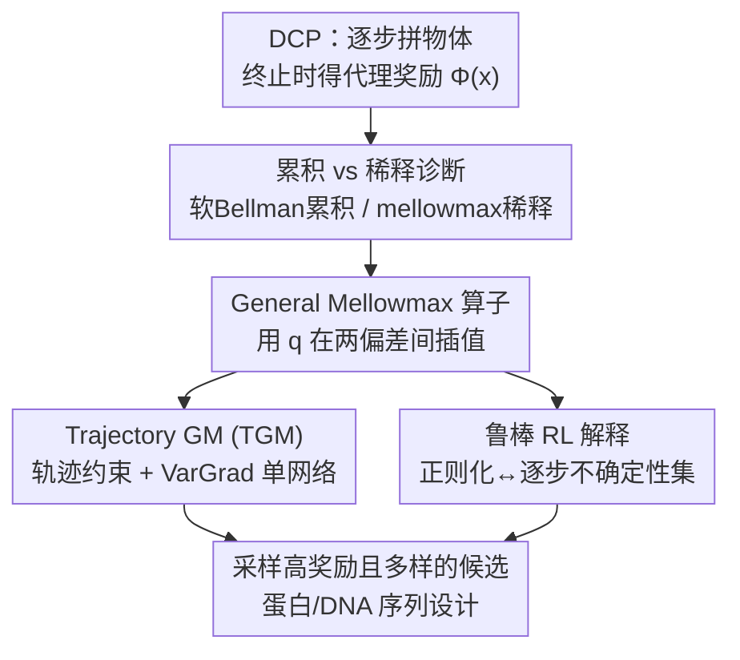

# Discrete Compositional Generation via General Soft Operators and Robust Reinforcement Learning

**会议**: ICLR2026  
**OpenReview**: [https://openreview.net/forum?id=MGWk2tEgLW](https://openreview.net/forum?id=MGWk2tEgLW)  
**代码**: https://github.com/marcojira/tgm  
**领域**: 强化学习 / 生成流网络  
**关键词**: GFlowNet, 离散组合生成, 正则化强化学习, 鲁棒 RL, mellowmax 算子, 科学发现

## 一句话总结
针对 GFlowNet 在指数级搜索空间里"按奖励正比采样"会被海量次优物体淹没掉极少数高奖励物体的问题，本文提出一个把软 Bellman、mellowmax、soft mellowmax 三类软 RL 算子统一起来的 general mellowmax 算子（用一个参数 $q$ 在"累积"和"稀释"两种偏差之间插值），并据此导出一个简单易用的轨迹级算法 TGM，在 DNA/蛋白质等真实生物序列设计任务上比 GFN/PPO/SAC 找到奖励更高且仍然多样的候选。

## 研究背景与动机
**领域现状**：科学发现（找新蛋白、新分子、新 DNA 序列）的核心是从一个**指数级大**的离散物体集合里筛出一小批有潜力的候选。这些物体天然是"组合式"的——蛋白是氨基酸序列、分子是片段拼接，因此可以建模成一个**离散组合过程（DCP）**：从空串出发逐步加 token，到终止动作时由一个代理奖励模型 $\Phi(x)$（proxy reward，比如一个预测结合力/荧光强度的 transformer）给出奖励。把它看成 MDP 后，就能用 RL 学一个采样器来生成候选。其中 **GFlowNet（GFN）** 最成功：它在最优时让物体 $x$ 被采样的概率正比于 $e^{\beta\Phi(x)}$，且与最大熵 RL 有理论联系，因此能保证候选的多样性。

**现有痛点**：本文指出 GFN 这个"按奖励正比采样"的目标在**指数级大空间里会失效**。问题在于：极少数高奖励物体的采样概率，会被**组合爆炸**出来的海量低奖励物体的概率之和淹没。论文给了一个清晰的反例——在一个词表大小 $B$、最大长度 $d$ 的序列任务里，假设采样器已经走到一条长度 $n<d$ 的最优序列 $s^*$，它要决定是终止返回 $x^*$ 还是继续加 token。继续加能生成 $\Omega(B^{d-n})$ 条以 $s$ 为前缀的序列，只要这些序列奖励不为零，终止的概率 $\pi(x^*\mid s)\le e^{\Phi(x^*)}/(c_r\cdot B^{d-n})$ 就会随 $d-n$ **指数衰减**。而图 2 显示真实任务里几乎所有随机物体都有不可忽略的奖励，所以这不是个别现象。

**核心矛盾**：根子在采样目标本身。从动态规划视角看，GFN 等价于在 DCP 上反复套用**软 Bellman 算子**（对 Q 值做 logsumexp），从叶子往根累积时，大量次优物体的价值会**累积（accumulation）**起来压过单个高奖励物体；如果换成对 Q 值做 logmeanexp 的 **mellowmax 算子**，又会走向反面——深处一个高奖励物体的价值会被浅层的平均**稀释（dilution）**掉。两者各占一个极端，没有一个算子能同时抗住累积和稀释。

**本文目标**：找到一个能在"质量 vs 多样性"上灵活权衡、且同时抵抗累积和稀释的算子，让采样分布更"尖"（peakier）地集中在高奖励物体上，但又不丢多样性。

**核心 idea**：用一个统一的正则化框架把软 Bellman、mellowmax、soft mellowmax 三个算子**插值**起来（general mellowmax），用参数 $q$ 在累积和稀释之间取中间值；再把它落成一个带轨迹约束的实用算法 TGM；最后给正则化一个**鲁棒 RL 的解释**——正则化等价于对"代理奖励与真实奖励之差"这种组合式不确定性的鲁棒性。

## 方法详解

### 整体框架
论文要解决的是"在 DCP 上学一个采样器，使它集中采高奖励物体而不塌缩成单点"。整条线索分三块：先**诊断**现有软 RL 算子为什么不行（累积/稀释两难），再**统一并插值**出 general mellowmax 算子从机制上同时压住两个偏差，然后把这个算子**落成实用算法 TGM**（轨迹级约束 + VarGrad 单网络训练）；最后从**鲁棒 RL** 视角回头解释为什么 GFN 的正则化"不健康"、而 GM 诱导的不确定性集更合理。三块互相支撑：诊断给出度量、插值给出算子、轨迹化给出可训练损失、鲁棒视角给出理论背书。

### 关键设计

**1. 累积/稀释诊断：把"算子好不好"量化成对最大 Q 值的偏离**

要比较不同算子，先得有个统一尺子。论文把任意算子 $T$ 作用后的状态价值与该状态最优动作的 Q 值之差定义为 $\Delta^T_s := Tv_s - \max_{a\in Ch(s)} Q(s,a)$，再拆成两个非负量：**累积** $\mathrm{Acc}^T(s):=\max(\Delta^T_s, 0)$ 和**稀释** $\mathrm{Dil}^T(s):=\max(-\Delta^T_s, 0)$，分别表示算子把状态价值抬高/压低了多少。理想算子应当**两者都小**——既不被一堆次优物体抬高（否则高奖励物体被淹），也不被平均压低（否则深处的好物体信号丢失）。有了这把尺子，三个经典算子就能被排到同一张表上：软 Bellman $T^{SB}v_s = \frac{1}{\omega}\,\mathrm{logsumexp}(\omega Q_s)$ 纯累积、mellowmax $T^{MM}v_s = \frac{1}{\omega}\log\sum_a \frac{1}{|Ch(s)|}e^{\omega Q_s(a)}$（logmeanexp）纯稀释、soft mellowmax $T^{SMM}v_s=\frac{1}{\omega}\log\langle\mathrm{softmax}(\alpha Q_s), e^{\omega Q_s}\rangle$ 介于两者但仍偏一边。这个诊断是后面所有改进的出发点。

**2. General Mellowmax 算子：用一个 $q$ 把三类软算子插值成一个**

既然累积和稀释是两个极端，自然想到在中间取一个折中。论文从**正则化 MDP** 的视角统一这三个算子：软 Bellman 对应用 Shannon 熵正则、mellowmax/soft mellowmax 对应用 $\mathrm{KL}(\pi_s, d_s)$ 正则（$d_s$ 取均匀分布或 $\mathrm{softmax}(\alpha Q_s)$）。于是定义一个**插值正则化子**

$$\Omega^q_{d_s}(\pi_s) := \frac{1}{\omega}\big[\,q\,\mathrm{KL}(\pi_s, d_s) + (1-q)\,(-H(\pi_s))\,\big],\quad q\in[0,1]$$

它在熵正则（鼓励多样）和靠近 $\mathrm{softmax}(\alpha Q_s)$（鼓励对齐高 Q 值）之间用 $q$ 滑动。取 $d_s=\mathrm{softmax}(\alpha Q_s)$ 时，对应的算子可推为

$$\Omega^{q,*}_\alpha(Q_s) = \frac{1}{\omega}\log\big\langle \mathrm{softmax}(\alpha Q_s)^q,\ e^{\omega Q_s}\big\rangle$$

它**优雅地把三个算子收编为特例**：$q=0$ 退回熵正则/GFN 算子，$q=1$ 得到 soft mellowmax，再令 $\alpha=0$ 得到 mellowmax。关键收益是 $q\in(0,1)$ 时同时只产生**少量**累积和少量稀释，而不是某一种的大量偏差——表 1 证明在 $q\in(0,1)$ 时 $|\Delta^T_s|=\max\{\mathrm{Acc}, \mathrm{Dil}\}$ 的最坏界**严格小于**其他三个算子，因此采样分布能更尖地集中到高奖励物体上。一个技术细节是 $\Omega^q_\alpha$ 依赖当前状态的 Q 值，已不再是标准凸共轭，跳出了 Geist 等人的经典框架，论文用类似技巧另行推导。

**3. Trajectory General Mellowmax（TGM）：把算子落成可训练的轨迹级单网络算法**

光有算子还不能直接训练。DCP 任务只在终止时有奖励，逐转移（transition）训练会面临严重的信用分配问题；GFN 之所以好用，靠的是**轨迹/子轨迹平衡**这类把早期状态策略直接连到终末奖励的约束。论文为 general mellowmax 推导了一条**等价的轨迹约束**（定理 4.1）：满足该约束于所有轨迹，就保证 $\mathrm{softmax}([\alpha q+\omega]Q^\theta)$ 是正则化问题的最优策略。落地时做三个工程选择：(1) 取 $d_s=\mathrm{softmax}(\alpha Q_s)$，这样同一套东西能 on-policy 也能 off-policy，不需要单独维护 $d_s$；(2) 让网络去满足上面那条轨迹约束以继承轨迹方法的信用分配优势；(3) 只训练**单个** Q 网络 $Q^\theta$，用 VarGrad 目标，使其等价于最小化轨迹约束。最终损失为

$$\mathcal{L}_{\mathrm{TGM}}(\tau) = \mathrm{Var}\Big[\tfrac{1}{\omega}\sum_{i=0}^{n}\big(\log\sigma_{q\alpha+\omega}[Q^\theta_{s_i}(a_i)] - q\log\sigma_\alpha[Q^\theta_{s_i}(a_i)]\big) - \beta r(x)\Big]$$

其中 $\sigma_t$ 是逆温度为 $t$ 的 softmax。算法极简、对 transformer 友好，并且在 $q=0,\ \omega=1$ 时**精确退化为 GFN 训练**——也就是说 TGM 是 GFN 的严格超集，多出来的 $q,\alpha$ 旋钮让你在累积/稀释间调档。

**4. 鲁棒 RL 解释：正则化 = 对逐步累积的代理奖励不确定性鲁棒**

最后这块给前面的"为什么有效"一个理论解释，也顺带说明 GFN 的正则化为什么"不健康"。直觉是：代理奖励 $\Phi$ 并不是真实奖励，存在一个隐藏的真值 $r^*$，二者差 $\delta$。于是筛选过程可写成一个鲁棒优化 $\max_{p}\min_{\delta\in R} \mathbb{E}_{x\sim p}[\Phi(x)+\delta(x)]$。传统 DCP 把不确定性只放在最后一个终止动作上，**忽略了任务的组合本质**；论文改为把 $\delta(x)=\sum_{i=0}^n \delta_i[a_i]$ **拆到生成过程的每一步**（对应鲁棒 RL 里常见的 state-rectangularity 假设）。借助一条 Fenchel–鲁棒 MDP 定理（定理 5.1），正则化算子与"逐步不确定性集"的鲁棒算子价值函数完全相等，并给出 GM 的不确定性集

$$R_s = r_0(s,\cdot) + \Big\{ r_s\in\mathbb{R}^A:\ \tfrac{1}{\omega}\sum_{a} d_s(a)^q e^{-\omega r_s(a)} \le 1 \Big\}$$

由此可解释图 3 的现象：**熵正则/GFN 的不确定性集永远不包含代理奖励 $\Phi(x)$**（只对奖励"上调"鲁棒，对真值低于代理的情况毫无防备，且在多步 DCP 里逐层越偏越远），所以它的"鲁棒"是假的；而 soft mellowmax / GM 的集合包含 $\Phi(x)$ 附近、对奖励下调也鲁棒，给出更有意义的不确定性概念。这条线把"为什么要稀疏化采样"从经验提升为可解释的鲁棒性结论。

### 一个完整示例
以图 1 的蛋白序列生成为例走一遍：(A) 从空串出发逐个添加氨基酸，直到终止动作；(B) 完整序列 $x$ 被代理奖励 $\Phi(x)$ 打分，作为终止动作的奖励；(C) 沿生成轨迹，每一步都注入一个不确定性扰动 $\delta_i$，逐步累积；(D) 真实奖励由 $\Phi(x)$ 与累积不确定性共同决定。GFN（$q=0$）在这条轨迹上会因为"后面还能接出指数多条次优长序列"而不敢在最优长度处终止，把概率摊薄；而 TGM 取 $q\in(0,1)$ 后，general mellowmax 抑制了这种累积，让策略更愿意在高奖励的短序列处终止，同时 $\alpha$ 仍保留对多个不同模式的探索——最终采样分布既"尖"又不塌缩。

### 损失函数 / 训练策略
训练目标即上文的 VarGrad 损失 $\mathcal{L}_{\mathrm{TGM}}$，本质是要求"沿轨迹累加的对数策略修正项 $-\beta r(x)$"在一条轨迹内方差最小（VarGrad 用方差代替显式估计配分常数 $v^*_0$）。超参三个：$q\in[0,1]$ 控累积/稀释权衡，$\alpha$ 控对高 Q 值动作的偏置，$\omega$ 控正则化强度（与采样温度挂钩）。实验中为公平对比固定 $\alpha=1$ 只扫 $\omega\in\{1,4,16\}$、$\beta\in\{4,16,64,256\}$ 和学习率 $\{10^{-5},10^{-4},10^{-3}\}$；从 $Q^\theta$ 直接闭式得到最优策略 $\mathrm{softmax}([\alpha q+\omega]Q^\theta)$，无需单独的策略网络。

## 实验关键数据

实验围绕三问：[Q1] $q$ 如何影响小/合成环境里采样的"尖度"；[Q2] TGM 在大规模真实生物设计任务上是否找到更好候选；[Q3] TGM 对超参是否鲁棒。

### 主实验

生物序列设计三任务（代理奖励均为在真实数据集上训练的 transformer），报告 15 个种子的**平均模式奖励**（avg mode reward，先沿质量/多样性曲线扫温度，再贪心选出 $k=100$ 个两两距离 $\ge\delta$ 的最佳候选）：

| 任务（空间规模） | SAC | PPO | GFN（=TGM $q{=}0$） | TGM 最佳变体 | 验证集 Max |
|------------------|-----|-----|---------------------|--------------|-----------|
| UTR（$4^{50}$，预测核糖体载量） | 3.46 | 4.12 | 4.19 | **4.27**（$q{=}0.75$） | 4.26 |
| AMP（抗菌肽，变长 $\sim20^{60}$） | 9.79 | 10.04 | 10.13 | **10.43**（$q{=}0.75$） | 9.96 |
| GFP（$20^{237}$，绿色荧光蛋白） | 0.66 | 1.90 | 2.44 | **2.95**（$q{=}0.25$） | 3.63 |

三个任务上 TGM 各变体都**匹配或超过** GFN/PPO/SAC，差距在最大空间 GFP 上最显著（GFN 2.44 → TGM 2.95，相对提升约 21%），印证了"空间越大、按奖励正比采样越吃亏、TGM 越受益"的核心论点。SAC/PPO 整体偏弱，作者归因于终末奖励带来的信用分配难题；只有 AMP 因允许生成更短序列，PPO 才追平。

### 消融实验

| 配置 | 现象 | 说明 |
|------|------|------|
| $q=0$（即 GFN） | 累积偏差大、采样不够尖 | 在大空间塌成"广撒网"，GFP 上明显落后 |
| $q\in(0,1)$ | 累积/稀释都小，最坏 $\|\Delta^T_s\|$ 最低（表 1） | 三任务最佳变体均落在此区间 |
| $q=1$（soft mellowmax） | 偏稀释 | AMP 上 $q{=}1$ 方差极小、几乎所有超参都表现好，但非普遍最优 |
| TF-Bind-8（$4^8$，可精确求解） | 同 $\beta{=}4$ 下 TGM 把更多质量压到奖励高分位 | 直接验证 $q$ 增大→采样更尖 |
| Bit sequence（$2^{120}$，有 ground-truth 模式） | $q{>}0$ 比 GFN 找到更多模式且离模式更近 | 尖度提升不损害多样性 |

### 关键发现
- **最优 $q$ 因任务而异，但几乎都在 $(0,1)$**：UTR/AMP 偏好 $q{=}0.75$，GFP 偏好 $q{=}0.25$——说明"插值"本身才是价值所在，固定退化到 GFN（$q{=}0$）或 soft mellowmax（$q{=}1$）都不是普遍最优。
- **空间越大收益越大**：GFP（$20^{237}$）是提升最明显的任务，正面回应了"GFN 在指数级空间会保守低估高奖励候选"的动机。
- **尖度不牺牲多样性**：Bit sequence 上 $q{>}0$ 既找到更多模式又离每个模式更近，说明 general mellowmax 不是简单地塌缩到单点。
- **超参鲁棒性**：网格扫 learning rate/$\beta$/$\omega$ 后，TGM 各 $q$ 的平均表现均高于 GFN；SAC 稳定但弱，PPO 对超参极敏感。

## 亮点与洞察
- **一个旋钮统一三个算子**：用 $q$ 把软 Bellman（$q{=}0$）、soft mellowmax（$q{=}1$）、mellowmax（$q{=}1,\alpha{=}0$）插值起来，既给了理论上的统一视角，又把"累积 vs 稀释"这对矛盾变成可连续调节的设计选择——这是最让人"啊哈"的地方。
- **把抽象的采样偏好量化**：用 $\mathrm{Acc}/\mathrm{Dil}$ 和最坏 $|\Delta^T_s|$ 把"采样分布够不够尖"做成可证明的最坏界（表 1），让"GM 更好"不是空谈而是有界保证。
- **鲁棒 RL 解释提供了新动机**：把逐步不确定性集拆到每个生成动作、并指出 GFN 的不确定性集**根本不含代理奖励**，给"为什么要偏离按奖励正比采样"一个全新且可解释的理由，这套 Fenchel–鲁棒分析可迁移到其他轨迹约束的设计。
- **向后兼容、即插即用**：TGM 在 $q{=}0,\omega{=}1$ 退化为 GFN，温度条件化、Q-学习混合采样等现有 GFN 技巧都能叠加，迁移成本极低。

## 局限与展望
- **多了 $q,\alpha$ 两个超参**：虽然作者展示了一定鲁棒性，但最优 $q$ 因任务而异（UTR 偏 0.75、GFP 偏 0.25），实际使用仍需要扫参；实验为公平对比固定了 $\alpha=1$，作者也承认同时调 $\alpha$ 可能进一步提升，未充分探索。
- **理论分析主要在 DAG/树结构 DCP 上**：算子与软 Bellman 的等价性是在 $G$ 为树时讨论的，一般有向无环图上的行为论文着墨较少。
- **代理奖励质量是上限**：方法本质是在"更鲁棒地最大化代理 $\Phi$"，若 $\Phi$ 与真实属性 $r^*$ 偏差大，再好的采样器也受限；论文用 $\delta$ 建模这种不确定性，但 $\delta$ 的结构（state-rectangular）是假设而非验证。
- **评估是 in-silico**：所有"高奖励候选"都由代理模型打分，未做湿实验验证其真实生物活性，最终价值待实验科学闭环。

## 相关工作与启发
- **vs GFlowNet（Bengio et al. 2021；Trajectory Balance）**：GFN 目标是 $p(x)\propto e^{\beta\Phi(x)}$，本文指出该目标在指数空间会被次优物体淹没；TGM 用 general mellowmax 替换软 Bellman 算子、并保留轨迹约束，$q{=}0$ 时严格退回 GFN，是其超集。
- **vs 温度条件化 GFN（Zhang et al. 2023；Kim et al. 2023）**：它们通过学习随 $\beta$ 变化的条件策略来对抗 GFN 过度平滑，本文从算子层面直接改造，两者**互补**可叠加。
- **vs soft mellowmax / mellowmax（Asadi & Littman 2017；Gan et al. 2021）**：这些算子从未用于 DCP；本文把它们一般化、配上轨迹约束并首次成功用于真实 DCP 任务。
- **vs 扩散微调式科学发现（Uehara et al. 2024；Wang et al. 2024）**：那一类需要预训练扩散模型且每步要近似解 SDE、计算昂贵；TGM 单 Q 网络、对 transformer 友好，更轻量。
- **vs SAC/PPO**：标准 RL 在仅有终末奖励的 DCP 上信用分配差、表现弱（实验印证），本文的轨迹级约束正是补这一短板。

## 评分
- 新颖性: ⭐⭐⭐⭐⭐ 用单参数 $q$ 统一并插值三类软 RL 算子，并配上原创的鲁棒 RL 不确定性集解释，理论与算法都新。
- 实验充分度: ⭐⭐⭐⭐ 覆盖合成（TF-Bind-8、Bit sequence）到真实生物三任务、15 种子 + 超参扫描，扎实；但全为 in-silico，缺湿实验闭环。
- 写作质量: ⭐⭐⭐⭐⭐ 动机反例清晰、累积/稀释框架和算子谱系讲得很顺，理论与直觉衔接好。
- 价值: ⭐⭐⭐⭐ 对 GFlowNet/科学发现社区即插即用、向后兼容 GFN，且在最大空间收益最大，实用价值高。

<!-- RELATED:START -->

## 相关论文

- [\[ICLR 2026\] Ultra-Fast Language Generation via Discrete Diffusion Divergence Instruct](ultra-fast_language_generation_via_discrete_diffusion_divergence_instruct.md)
- [\[NeurIPS 2025\] Self Iterative Label Refinement via Robust Unlabeled Learning](../../NeurIPS2025/computational_biology/self_iterative_label_refinement_via_robust_unlabeled_learning.md)
- [\[ICLR 2026\] FragFM: Hierarchical Framework for Efficient Molecule Generation via Fragment-Level Discrete Flow Matching](fragfm_hierarchical_framework_for_efficient_molecule_generation_via_fragment-lev.md)
- [\[ICLR 2026\] Discrete Diffusion Trajectory Alignment via Stepwise Decomposition](discrete_diffusion_trajectory_alignment_via_stepwise_decomposition.md)
- [\[ICML 2025\] Improved Off-policy Reinforcement Learning in Biological Sequence Design](../../ICML2025/computational_biology/improved_off-policy_reinforcement_learning_in_biological_sequence_design.md)

<!-- RELATED:END -->
