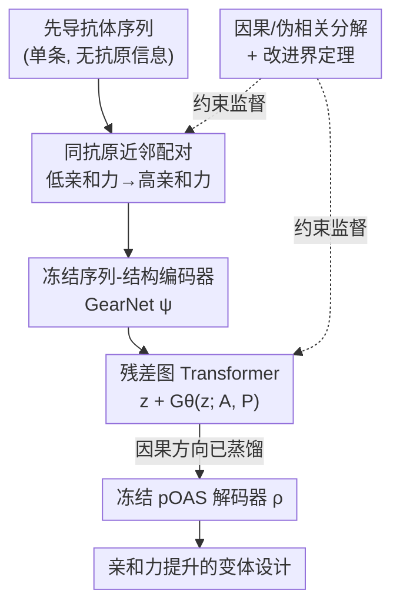

# Distilling Causal Signals for One-Shot Directed Evolution of Antibodies

**会议**: ICLR2026  
**OpenReview**: [https://openreview.net/forum?id=M7PDJTrqcS](https://openreview.net/forum?id=M7PDJTrqcS)  
**代码**: https://github.com/prescient-design/AffinityEnhancer  
**领域**: 计算生物学 / 蛋白设计 / 抗体亲和力成熟  
**关键词**: 抗体亲和力成熟, 单次定向进化, 因果信号蒸馏, 配对数据匹配, 图 Transformer

## 一句话总结
AFFINITYENHANCER 提出在「只给一条先导抗体序列、不给抗原信息、不微调、不用抗原-抗体复合物结构」的极端单次（one-shot）设定下做抗体亲和力成熟：通过在跨抗原数据集中构造「同抗原、低亲和力→高亲和力」的近邻配对，让一个残差图 Transformer 在冻结的序列-结构 embedding 空间里学习「把低亲和力 embedding 推向高亲和力」的映射，理论上证明这种配对监督被因果（causal）变化主导而把伪相关（spurious）漂移压在很小的预算内，从而泛化到完全没见过的抗体种子，并把突变集中在 paratope 界面的边缘（rim），效果超过结构条件反折叠（AntiFold）和序列 inpainting（IgCraft）基线。

## 研究背景与动机

**领域现状**：抗体作为癌症、自身免疫等治疗领域的核心药物，其疗效由「结合机制」驱动——抗体用六条高变环（CDR）上的一小撮残基（paratope）去咬住抗原表面的特定片段（epitope）。药物发现里拿到一条中等亲和力的先导抗体后，要做亲和力成熟（affinity maturation），即通过随机/定向突变造出大库再筛更强结合者。但实验筛库只能探索 $\sim 10^6$–$10^9$ 量级的序列空间，而抗体可变域的全空间是 $250^{20}$ 量级，杯水车薪，往往筛不出足够多达标的设计。

**现有痛点**：机器学习版的计算亲和力成熟分两派，都不适合 one-shot。结构条件类模型（AbMPNN、AntiFold、FvHallucinator、RFDiffusion）依赖先导抗体结构、甚至抗原-抗体复合物结构来约束设计形状，但复合物结构和配对亲和力数据本就稀缺且多样性差；而且像 RFDiffusion 这类 de novo 模型即使给了抗原也只保证「能结合」，不保证「结合得更强」。序列类模型（ProGen2、Walk-Jump、各种蛋白语言模型定向进化）只学序列分布或需要反复的靶标特异性筛选轮次。更直接的前作 PropEn（Tagasovska 等，2024）用「数据匹配」隐式学习某个性质的上升梯度方向，但它只用序列表征，而且必须先导分子附近已经有几百条相关序列才行——根本无法 one-shot。

**核心矛盾**：one-shot 设定的根本难点是**泛化**——测试时给的先导抗体在序列和结构特征上可能远离训练分布，模型必须在「没有抗原上下文、不微调」的条件下提出更强变体。同时配对数据天然带选择偏差（selection bias）：只有部分序列被测过，且不是每条序列都在每个抗原环境下测过，导致与亲和力无因果关系的伪因素（批次效应、文库/先导特异性等）会通过选择和亲和力假性相关。

**本文目标**：（1）在无抗原信息下做 one-shot 亲和力成熟；（2）利用异质数据集里的匹配缓解数据稀疏；（3）从理论上保证学到的是因果特征而非伪相关；（4）在 held-out 种子上超过结构条件与反折叠基线。

**切入角度**：作者的关键观察是——如果把配对限制在「同一抗原环境 + 序列上足够近 + 亲和力确实更高」，那么环境驱动的增益被条件掉了，只剩下序列本身的改变能解释亲和力提升；再加上 Lipschitz 类平滑假设，就能在数学上证明每个配对都强制了一个最小的因果方向移动、同时把伪方向漂移卡在很小的上界内。

**核心 idea**：用「同抗原近邻配对 + 冻结的序列-结构 embedding + 残差图 Transformer」把「低亲和力 embedding → 高亲和力 embedding」的因果方向蒸馏出来，在 embedding 空间里完成定向进化，再解码回序列。

## 方法详解

### 整体框架

AFFINITYENHANCER 要解决的是：给一条 held-out 先导序列 $x^{e^*}_{\text{lead}}$（对应一个训练时没见过的抗原 $e^*$），在不微调、不用其抗原结构的前提下，提出一批可靠提升亲和力的新设计。整体上它把问题拆成「在哪些环境里学因果方向 → 用什么表征 → 怎么搬运这个方向」三件事，落成一条「配对 → 编码 → 残差搬运 → 解码」的流水线。

形式化地，设抗体序列空间为 $X$、测得的结合亲和力为 $Y\subset\mathbb{R}$，训练数据来自 $E$ 个环境（每个环境对应一条先导抗体/种子，记 $e=1,\dots,E$），每个环境只观测到约 10 条带亲和力标注的序列 $\{(x^e_j, y^e_j)\}$。流程是：

1. **构造匹配对**：在每个环境 $e$ 内，为每条低亲和力序列 $x_i$ 找近邻 $x'_i$，要求 $y'_i > y_i$ 且序列距离不超过阈值 $\delta_x$，得到 $M=\{(x_i, x'_i \mid e=e')\}$。
2. **提取 embedding**：用基础模型 $\psi: X\to\mathbb{R}^{L\times d}$ 把配对里每条抗体编码成序列-结构 embedding。
3. **学「差→好」的 embedding 映射**：用残差图 Transformer $G_\theta$ 在残基上作用，$f(z) := z + G_\theta(z; A, P)$，其中 $z=\psi(x)$，$A$ 是从预测结构来的残基-残基邻接矩阵，$P$ 是位置/边特征。
4. **embedding→序列解码**：训一个轻量解码器 $\rho:\mathbb{R}^{L\times d}\to X$ 把逐残基 embedding 映回氨基酸分布。
5. **对 OOD 先导采样**：测试时算 $z_{\text{lead}}=\psi(x^{e^*}_{\text{lead}})$，施加残差映射 $\tilde z = z_{\text{lead}} + G_\theta(z_{\text{lead}}; A, P)$，再解码 $\tilde x=\rho(\tilde z)$。

实现上落成三个模块：Embedder（GearNet，冻结）、Reconstruction（图 Transformer，唯一训练的部件）、Decoder（在 pOAS 上训完即冻结）。三件套让序列被嵌入到一个在海量蛋白/抗体数据上学到的通用语义空间，从而泛化到盲测种子。

### 关键设计

**1. 同抗原近邻匹配：把「环境增益」条件掉，只留序列侧的可解释改进**

这一设计直击 one-shot 的伪相关痛点。亲和力 $y$ 既依赖序列又依赖抗原环境 $e$，如果随便配「赢家 vs 输家」（像标准偏好学习那样），赢家可能只是因为换了个更好咬的抗原，而不是序列本身更优。AFFINITYENHANCER 的匹配规则要求三个条件同时满足：序列距离近 $d(x,x')<\varepsilon$、亲和力确有提升 $y'-y>\Delta y>0$、且**同一抗原环境** $e'=e$，写成目标条件分布

$$p\big(x' \mid x,\ d(x,x')<\varepsilon,\ y'-y>\Delta y,\ e'=e\big).$$

条件在 $e'=e$ 上意味着「换抗原带来的增益」被剔除，只有 $x$ 的改变能解释 $y$ 的提升。这是和 PropEn 的关键升级：PropEn 只在序列表征上做匹配，而这里匹配发生在预训练编码器 + 残差图 Transformer 诱导的几何里，并显式加了「同环境」约束。它和偏好学习（DPO 那一类）的两点区别也在这：偏好学习的配对不要求序列接近、也不要求测量值相近；而这里造的是**局部改进对**（nearby variants that differ in measured binding），让学到的变换对应真实的、逐步的改进，而非任意的赢/输跳变。

**2. 因果信号蒸馏的理论保证：用 Lipschitz 假设把每个配对的因果移动给出下界、伪漂移给出上界**

光有匹配规则还不够，作者要论证这套监督「确实被因果变化主导」。他们假设观测序列由潜在因子生成 $x=f(s,c)$、亲和力由 $y=h(c,e)$ 决定，其中 $c$ 是真正决定亲和力的因果因子、$s$ 是只影响 $x$ 不影响 $y$ 的伪因子（批次/文库特异性等）。在两条假设下——性质平滑（固定 $e$ 时 $h$ 对 $c$ 是 $K_y$-Lipschitz）、观测渲染器双向 Lipschitz（$x$ 的小移动蕴含潜因子小移动，不允许大幅抵消）——给出**改进界定理**：对满足 $d(x,x')<\varepsilon$ 且 $y'-y>\Delta y$ 的配对，

$$d(c',c) > \Delta y / K_y, \qquad d(s',s) < K_x\varepsilon - \Delta y/K_y.$$

直觉是：每个配对**强制**了一个最小的因果方向移动（下界 $\Delta y/K_y$），同时把伪方向漂移卡在严格有限的预算内（上界 $K_x\varepsilon-\Delta y/K_y$，且匹配可行的前提正是该上界非负）。在多环境上平均时，伪方向随机涨落相互抵消，而因果方向跨配对对齐——所以最小化重构损失就逼着 $G_\theta$ 去建模那个跨环境不变、能一致解释亲和力增益的成分。这套「invariance-by-matching」是全文实验的理论底座。

**3. 冻结表征 + 残差图 Transformer：在通用 embedding 空间里只学「搬运因果方向」**

这是把理论落地的工程设计。Embedder 用 GearNet（在 AlphaFold2 数据库 60 万条序列-结构上预训练）给出语义丰富的序列-结构 embedding，并冻结；Decoder 是在配对观测抗体空间 pOAS 上训练、把 GearNet embedding 映回抗体序列的轻量解码器，训完也冻结。唯一被训练的是 Reconstruction 模块——一个邻接信息引导的图 Transformer，学一个**残差映射** $f_\theta(z)=z+G_\theta(z;A,P)$，在 SKEMPI 2.0 造出的匹配对上最小化

$$L(\theta)=\frac{1}{|M|}\sum_{(x,x')\in M}\big\|\psi(x')-f_\theta(\psi(x))\big\|_2^2,$$

即「把低亲和力 embedding 重构成高亲和力 embedding」。残差形式让模型只需学「相对先导该往哪个方向挪」而不必重建整条 embedding，正好对应理论里那个「因果方向移动」；邻接矩阵 $A$ 注入残基接触的物理先验，使编辑紧凑、物理可信。冻结海量预训练的编码/解码、只训中间这块小残差算子，是它能在盲测种子上泛化又数据高效的根本原因。

### 损失函数 / 训练策略
训练目标就是上面 embedding 空间的 $\ell_2$ 重构损失 $L(\theta)$，只训图 Transformer $G_\theta$，Embedder（GearNet）与 Decoder（pOAS 上训练）全程冻结。匹配对来自 SKEMPI 2.0，且严格排除任何落在 held-out 种子邻域的序列以保证 one-shot 评测的公平。采样时编辑距离可通过迭代次数/温度调控，实现小到中等编辑的可控探索。

## 实验关键数据

### 主实验
评测在真正的 one-shot 体制下进行：4 条 held-out 种子（3 条内部抗体 + 公开的 Trastuzumab），每条都显著 OOD（全序列编辑距离 64–87），训练集已剔除其邻域序列。用预测模型 Cortex 作为 oracle 预测设计的结合与亲和力。指标包括：相对种子的编辑距离、预测为 binder 的设计数、相对种子改进的 binder 数，以及 binder rate / improved rate。对比三类基线——PropEn（同样匹配数据集、仅序列）、AntiFold（抗体专用结构条件反折叠）、IgCraft（抗体专用生成式 inpainting）。

| 模型 | 平均编辑距离 | 平均 Binder rate | 平均 Improved rate | 改进种子数 |
|------|------|------|------|------|
| **AFFINITYENHANCER（完整）** | 7.08 | **50.10%** | **8.46%** | **4/4** |
| PropEn（仅序列，去结构） | 55.8 | 0.0% | 0.00% | 0/4 |

PropEn 在每条种子上提出的设计都离种子 >25 个编辑、无一被预测为 binder，说明仅序列匹配根本无法在 one-shot 下落在种子邻域。AFFINITYENHANCER 则把设计稳定地保持在种子附近（编辑距离约 7），各种子 26–78% 被预测为 binder。在 $\text{ED}\in[5,12]$ 窗口内与 AntiFold、IgCraft 对比预测 pKD 分布时，AFFINITYENHANCER 把亲和力分布显著上移、改进 binder 更多——AntiFold 因循着种子结构多产出「保持结合但同等或更低亲和力」的变体，IgCraft 则几乎无法产出保持/提升结合的 CDR 序列，印证「只学抗体序列分布不足以生成保留结合的 CDR」。

### 消融实验
对 Trastuzumab + 3 条内部种子各采样 5000 条，逐组件消融（数值为四种子均值）：

| 配置 | Binder rate | Improved rate | 改进种子数 | 说明 |
|------|------|------|------|------|
| Full model | 50.10% | 8.46% | 4/4 | GearNet + pOAS 解码 + 邻接图 Transformer + 匹配 |
| − Matching | 6.61% | 4.29% | 2/4 | 退化成 embedding 自编码器，提案聚在种子附近、binder 少 |
| − Embedding | 27.02% | 1.32% | 4/4 | 去掉 GearNet/pOAS，结构先验+匹配仍有信号但多样性/binder 数掉 |
| CNN（替换 GT） | 16.07% | 0.63% | 2/4 | 局部卷积核，编辑距离涨、可控性差、功能性编辑变弱 |
| − Adjacency | 35.04% | 9.98% | 3/4 | 全连接图 Transformer，编辑膨胀、采样可控性下降 |

### 关键发现
- **匹配是最关键的干预**：去掉匹配后模型退化成 embedding 空间自编码器，improved rate 从 8.46% 掉到 4.29%、只在 2/4 种子上改进——匹配负责把概率质量推向功能性、更高亲和力的区域。
- **图 Transformer 的关系归纳偏置重要**：用 CNN 替换后 binder/improved binder 大幅下降，说明 GT 对「局部、功能性编辑」的建模优于局部卷积核。
- **邻接矩阵带来紧凑、物理感知的编辑**：去掉邻接（全连接）后编辑膨胀、采样旋钮失效，凸显显式接触信息对「紧凑物理可信修改」的引导作用。
- **生物可解释性**：AFFINITYENHANCER 在不看抗原的情况下把编辑集中在抗原-抗体界面的**边缘（rim）而非核心**，符合「从已强先导出发的亲和力提升常靠延伸/精修外围接触而非扰动核心」的生物学直觉；在有大规模单突变实验数据的 G6 抗体上，它最常编辑的位点恰好关联更大的实测增益，并避开「替换几乎必废结合」的位点。

## 亮点与洞察
- **把因果推断的语言搬进抗体设计**：用「因果因子 $c$ vs 伪因子 $s$」+ 选择偏差建模，给「同抗原近邻匹配为什么有效」一个可证的下/上界，而不是经验上「配对有用」——这把 PropEn 的隐式梯度匹配升级成有理论护栏的因果蒸馏。
- **「冻结大模型 + 只训小残差算子」的数据高效范式**：海量预训练的编码/解码全冻结，可训部件只是一个在 embedding 空间搬运方向的残差图 Transformer，这正是它能在仅 ~10 条/环境的极稀疏标注下泛化到盲测种子的关键，思路可迁移到任何「有强预训练表征 + 想做定向性质优化」的分子任务。
- **无监督地"猜中"界面 rim**：模型从抗体序列单输入就把编辑集中到抗原界面边缘，这种「不给抗原也能定位结合相关区域」的涌现行为，对没有复合物结构的真实药物发现场景极有价值。
- **可控编辑距离**：通过迭代/温度调节编辑幅度，支持「风险感知」的探索（小步保守 vs 大步激进），是落地为 directed evolution 工具的实用属性。

## 局限与展望
- **依赖 in silico oracle 评测**：binder/improved binder 全由 Cortex 预测模型判定，并无湿实验验证，oracle 的偏差可能传导到结论；论文自己也把这定位为「in silico affinity gains」。
- **个别种子改进率极低**：完整模型在 Seed 1、Seed 3 上 improved rate 仅 0.04%、0.06%，均值 8.46% 主要由 Trastuzumab（31.5%）撑起，说明对某些 OOD 种子提升仍很有限，泛化并不均匀。
- **不用抗原信息既是卖点也是天花板**：作者承认引入 epitope/抗原上下文有望消歧「多条改进路线」，当前完全不看抗原可能在多解情形下选错方向。
- **数据资源受限**：匹配对来自 SKEMPI 2.0，扩展带标注亲和力资源才能覆盖更多结合模式。
- **理论假设的现实性**：双向 Lipschitz、潜因子加性可分解（$d([c,s],[c',s'])=d(c,c')+d(s,s')$）等假设在真实抗体序列-亲和力关系上能否成立未做实证检验，且分析是「无测量噪声」的确定性版本。

## 相关工作与启发
- **vs PropEn（Tagasovska 等，2024）**：PropEn 用数据匹配隐式学性质上升方向，但只用序列表征、且需要先导附近已有几百条相关序列，无法 one-shot；AFFINITYENHANCER 加入序列-结构 embedding、显式同环境控制、残差图 Transformer，把匹配搬到几何诱导空间，实现真正的盲测种子泛化（PropEn 在四种子上 0/4 改进，本文 4/4）。
- **vs AntiFold（结构条件反折叠）**：AntiFold 循着先导结构做反折叠，倾向产出「保持结合但同等/更低亲和力」的变体；本文几乎对每条种子都产出亲和力提升的设计，且增益幅度更大。
- **vs IgCraft（序列 inpainting）**：IgCraft 学抗体序列分布做 CDR inpainting，但无法产出保留/提升结合的 CDR 序列——印证「只学序列分布不足以保结合」，反衬本文「因果方向蒸馏」的必要性。
- **vs 偏好学习 / DPO 系（Rafailov 等；蛋白侧 ReFT、能量偏好扩散、多目标 DPO binder 设计）**：偏好学习用任意 (winner, loser) 对、不要求序列接近或测量值相近，且优化「条件输入→输出」的生成器；本文构造的是局部改进对、做的是 lead-conditioned 改进（给定已有 binder 生成更强变体），两点差异让学到的是真实逐步改进而非任意跳变。

## 评分
- 新颖性: ⭐⭐⭐⭐⭐ 把因果推断的选择偏差框架 + 可证改进界引入 one-shot 抗体亲和力成熟，理论与设计高度自洽。
- 实验充分度: ⭐⭐⭐⭐ 四 OOD 种子 + 多基线 + 细致逐组件消融 + 生物学可解释性分析，但缺湿实验、个别种子改进率极低。
- 写作质量: ⭐⭐⭐⭐ 问题设定、理论推导与模块映射讲得清楚，图文配套完整。
- 价值: ⭐⭐⭐⭐⭐ 在无抗原/无复合物结构的真实稀缺场景给出可控、数据高效的 drop-in 抗体优化工具，落地价值高。

<!-- RELATED:START -->

## 相关论文

- [\[ICLR 2026\] One Protein Is All You Need](one_protein_is_all_you_need.md)
- [\[ICML 2026\] Towards A Generative Protein Evolution Machine with DPLM-Evo](../../ICML2026/computational_biology/towards_a_generative_protein_evolution_machine_with_dplm-evo.md)
- [\[ICML 2026\] TD3B: Transition-Directed Discrete Diffusion for Allosteric Binder Generation](../../ICML2026/computational_biology/td3b_transition-directed_discrete_diffusion_for_allosteric_binder_generation.md)
- [\[ICLR 2026\] Extending Sequence Length is Not All You Need: Effective Integration of Multimodal Signals for Gene Expression Prediction](extending_sequence_length_is_not_all_you_need_effective_integration_of_multimoda.md)
- [\[AAAI 2026\] On the Information Processing of One-Dimensional Wasserstein Distances with Finite Samples](../../AAAI2026/computational_biology/on_the_information_processing_of_one-dimensional_wasserstein_distances_with_fini.md)

<!-- RELATED:END -->
