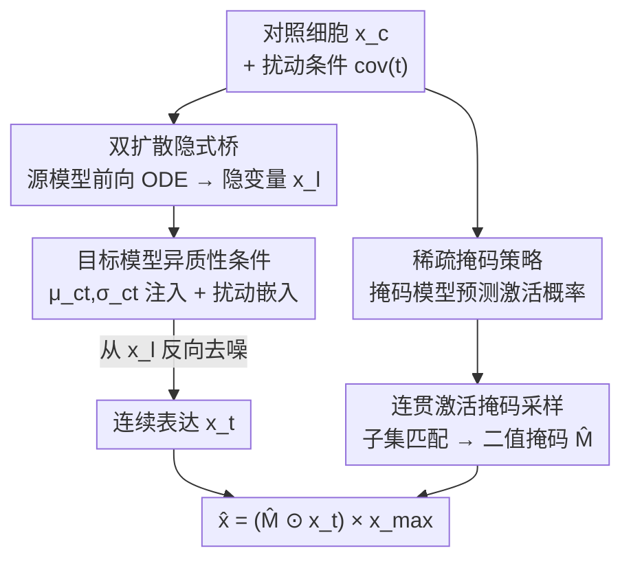

# Doloris: Dual Conditional Diffusion Implicit Bridges with Sparsity Masking Strategy for Unpaired Single-Cell Perturbation Estimation

**会议**: ICLR2026  
**OpenReview**: [https://openreview.net/forum?id=rvpDHfoTd2](https://openreview.net/forum?id=rvpDHfoTd2)  
**代码**: https://github.com/ChangxiChi/Doloris  
**领域**: 计算生物学 / 扩散模型 / 单细胞扰动预测  
**关键词**: 单细胞扰动, 双扩散隐式桥, 非配对数据, 稀疏掩码, 条件扩散

## 一句话总结
Doloris 用两个共享高斯隐空间的条件扩散模型分别建模"未扰动细胞"和"扰动后细胞"的分布，靠隐式桥（DDIB）绕过单细胞测序"同一细胞测不到扰动前后两态"的非配对难题，再配一个稀疏掩码模型专门预测哪些基因被沉默，让扩散模型把力气花在真正表达的基因上，从而在遗传/分子扰动数据集上达到 SOTA 并保住单细胞响应的多样性。

## 研究背景与动机
**领域现状**：单细胞扰动预测要回答"给某种细胞施加某个 CRISPR 基因敲除或小分子药物后，它的基因表达谱会变成什么样"。这能帮助筛选关键基因、加速药物筛选。现有方法（GEARS、graphVCI、scGPT、BioLord、GRAPE、CPA、chemCPA 等）大致分两类：回归模型直接预测扰动后的表达，或生成模型重建扰动态分布。

**现有痛点**：单细胞 RNA 测序需要裂解细胞才能释放 RNA，是个**不可逆的破坏性过程**——同一个细胞不可能既测到扰动前、又测到扰动后。所以扰动组和对照组的数据天生**非配对（unpaired）**。但大多数方法要么强行把扰动样本和未扰动样本配成对（引入不真实的假设），要么干脆在建模时忽略两者关系。少数考虑了非配对性的工作（如基于神经最优传输的 Bunne 等）又缺乏显式的扰动建模，泛化到没见过的扰动很差。

**核心矛盾**：除了非配对，单细胞表达还有第二个结构性难题——**高维 + 稀疏**。基因维度 $N$ 很大，而表达矩阵里充斥着大量零值或近零值。作者实验显示，纳入越多基因，表达数据的相对信噪比（SNR）越低（论文 Fig. 8），即维度越高、模式越难学；叠加稀疏后，模型很容易"过拟合到零"——把精力都用来预测那些本来就该是 0 的基因，反而忽略了真正承载扰动信号的表达基因，导致生成结果坍缩、丧失多样性（论文 Fig. 2）。

**本文目标**：在不需要细胞配对的前提下，既显式建模扰动、又能泛化到未见过的基因/分子扰动；同时不被稀疏零值带跑偏。

**切入角度**：作者借鉴 DDIB（Dual Diffusion Implicit Bridges）的思路——两个域之间的迁移可以靠"各自训一个扩散模型 + 共享一个高斯隐空间"来桥接，而不需要任何成对样本。这恰好对上了单细胞非配对的本质：把"未扰动→扰动"看成两个分布之间的迁移。

**核心 idea**：用一对共享隐空间的条件扩散模型隐式对齐对照态与扰动态（解决非配对），再用一个独立的稀疏掩码模型显式预测零值基因、把扩散损失限制在表达基因上（解决稀疏过拟合）。

## 方法详解

### 整体框架
Doloris 的输入是一个真实的对照（未扰动）细胞 $x_c$ 以及目标扰动条件（细胞类型 + 遗传/分子扰动），输出是该细胞在这个扰动下预测的基因表达谱 $\hat{x}$。整条管线分三股力量协同：**源模型**学未扰动细胞分布、**目标模型**学扰动后细胞分布，二者共享同一个标准高斯隐空间（这就是"隐式桥"）；**掩码模型**单独学"扰动后哪些基因会被沉默"。

推理时走两步：先用源模型对 $x_c$ 做 DDIM 前向（加噪 ODE）映射到隐变量 $x_l$，再用目标模型在给定扰动条件下从 $x_l$ 反向去噪生成连续表达值 $x_t$；与此并行，掩码模型根据扰动条件预测每个基因的激活概率并转成 0/1 二值激活掩码 $\hat{M}$；最后把连续表达和掩码逐元素相乘、再乘回原始尺度 $x_{\max}$ 得到最终预测。训练时三者分开优化：源/目标扩散模型最小化只在表达基因上计算的重构损失，掩码模型最小化交叉熵。

### 关键设计

**1. 双条件扩散隐式桥：用共享高斯隐空间绕过细胞配对**

这是 Doloris 应对"非配对"痛点的核心。作者训练两个结构相同的条件扩散模型：源模型 $\hat{x}^{(s)}_\theta$ 学未扰动细胞分布（条件 $\mathrm{cov}^{(s)}=\{ct\}$，仅细胞类型），目标模型 $\hat{x}^{(t)}_\theta$ 学扰动后分布（条件含细胞类型与扰动 $P$）。二者并不直接对齐细胞，而是各自把自己的分布映到**同一个标准高斯隐空间**，靠这个共享先验隐式地把对照态和扰动态"桥"起来。推理时先用源模型把对照细胞 $x_c$ 通过前向 ODE 推到隐变量：$x_l = \mathrm{ODESolve}(x_c; \hat{x}^{(s)}_\theta, \mathrm{cov}^{(s)}, 0, 1)$，再用目标模型从 $x_l$ 反向去噪生成扰动态：$x_t = \mathrm{ODESolve}(x_l; \hat{x}^{(t)}_\theta, \mathrm{cov}^{(t)}, 1, 0)$。这样既不需要把扰动样本和未扰动样本强行配对，又通过共享隐空间显式保留了"扰动是从某个对照态出发的迁移"这一结构，比最优传输类方法多了显式的扰动条件、因而能泛化到未见扰动。

另外一个值得注意的参数化选择：与常规扩散模型预测每步噪声 $\epsilon$ 不同，Doloris 的网络**直接预测干净表达 $x_0$**。原因是基因表达数据复杂、结构性弱，直接对噪声建模很难；而两种参数化在理论上等价（$x_0 = (x_t - \sqrt{1-\bar\alpha_t}\,\epsilon_0)/\sqrt{\bar\alpha_t}$），所以换成预测 $x_0$ 不损失通用性却更稳定。

**2. 目标模型的异质性保持条件：避免坍缩到均值轮廓**

扰动本质上是"作用在未扰动细胞上"的，所以目标模型需要知道对照组的信息。但数据非配对，没法直接喂一个配对的未扰动样本进去。一个朴素做法是只用对照组各细胞类型的表达期望 $\mu_{ct}\in\mathbb{R}^N$，但这等于抹掉了细胞间异质性，会让生成结果坍缩成"平均细胞"。Doloris 的做法是：训练时在 $\mu_{ct}$ 上按对照分布的标准差 $\sigma_{ct}$ 注入随机高斯噪声，$x_{\text{noisy}} = \mu_{ct} + \sigma_{ct}\cdot\epsilon,\ \epsilon\sim\mathcal{N}(0,I)$。作者强调这并非假设基因表达服从高斯，而只是一个**随机化机制**，刻意保留对照态的离散度、防止生成轮廓退化到均值。于是目标模型的条件被打包成 $\mathrm{cov}^{(t)}=\{ct, \mu_{ct}, \sigma_{ct}, P\}$。推理时不一样：此时有真实的对照细胞 $x_c$ 作为起点，可以直接用 $x_c$ 替换掉训练时构造的 $x_{\text{noisy}}$，条件变为 $\mathrm{cov}^{(t)}=\{ct, x_c, P\}$。消融显示去掉 $\mu_{ct},\sigma_{ct}$ 会显著掉点，印证了"扰动 = 从对照态出发的迁移"这一建模假设的重要性。

**3. 稀疏掩码策略：把扩散模型的注意力从零值上拉回来**

针对高维稀疏导致的"过拟合零值"，Doloris 训练一个独立的掩码模型 $\hat{m}_\theta$ 专门预测"扰动后哪些基因被沉默（取零）"。它在两个地方起作用。其一，扩散模型的重构损失**只在表达基因上计算**——用二值掩码 $M_i = \mathbb{1}[x_{0,i}\neq 0]$ 把零值基因从损失里抠掉，源/目标损失都写成 $L = \mathbb{E}\big[\,\|M\odot(x_0-\hat{x}_\theta)\|^2 / \sum_i M_i\,\big]$，于是梯度不再被海量零值稀释。其二，掩码模型本身以交叉熵训练，把输出解释为各基因的激活概率：$L_{\text{mask}} = -\frac{1}{N}\sum_i\big[M^t_i\log\hat{m}_\theta(\mathrm{cov}^{(t)}) + (1-M^t_i)\log(1-\hat{m}_\theta(\mathrm{cov}^{(t)}))\big]$。这一拆解的好处是把"该不该表达（离散的开/关）"和"表达多少（连续值）"解耦：扩散模型专心学表达基因的连续模式，掩码模型专心学稀疏结构，二者都不被对方拖累。消融里去掉掩码模型后模型明显倾向预测零、生成多样性（intra-class 距离）下降，说明这一策略确实缓解了零坍缩。

**4. 连贯激活掩码采样：用子集匹配代替独立伯努利采样**

掩码模型只给出每个基因的**边际**激活概率 $p_{\hat{m}_\theta}\in[0,1]^N$，但要得到一个真正的 0/1 激活掩码 $\hat{M}$，不能简单对每个基因独立做伯努利采样——因为基因间存在共表达/共沉默的相关结构，逐基因独立采样会累积严重误差、产出全局不一致的激活模式。Doloris 的做法是：先在训练集里找出那些**经验边际分布与预测 $p_{\hat{m}_\theta}$ 相近的条件子集**，再依据预测概率在这些子集的样本上做更新，从而得到全局连贯的二值掩码 $\hat{M}\in\{0,1\}^N$（细节在附录 A.11）。最后把掩码作用到连续表达上并还原尺度：$\hat{x} = (\hat{M}\odot x_t)\times x_{\max}$。这一步保证了"哪些基因开"在全基因组层面自洽，而不是逐基因乱开乱关。

### 损失函数 / 训练策略
源/目标扩散模型与掩码模型分开优化。扩散损失是只在表达基因上的掩码 $\ell_2$ 重构损失（式 9、13），掩码模型是交叉熵（式 14）。由于源与目标模型架构相同、目标模型只是多了扰动等条件输入，作者把二者统一成一个实现、同时处理 $\mathrm{cov}^{(s)}$ 与 $\mathrm{cov}^{(t)}$ 以简化训练。细胞类型嵌入作为可训练标签表示直接从数据学，不依赖外部模型；遗传扰动沿用 GRAPE（Chi et al., 2025）的嵌入策略以支持多基因敲除与组合效应，分子扰动则用预训练分子模型抽特征作条件。优化器 AdamW，学习率 0.001，batch size 32，扩散 500 步、DDIM 推理 50 步；Adamson/Norman/SciPlex3 训练步数分别为 1 万 / 1 万 / 10 万，单卡 A100 80G。

## 实验关键数据

### 主实验
数据集：CRISPR 敲除用 Adamson 和 Norman，化学扰动用 sci-Plex3。评估上，作者指出单细胞数据异质性强、很多差异表达（DE）基因在同一条件下呈**双峰分布**，使得基于均值的 RMSE 不可靠，于是额外引入 **Energy Distance（E-distance）** 衡量整体分布对齐、**Earth Mover's Distance（EMD）** 衡量基因级分布偏移。

| 任务 / 数据集 | 指标（All） | Doloris | 次优方法 | 说明 |
|---|---|---|---|---|
| 未见单基因扰动 (Adamson) | RMSE↓ | **0.0336** | 0.0473 (linear) | E-distance 0.4682 vs 0.8658 |
| 未见单基因扰动 (Adamson) | EMD↓ | **0.0348** | 0.0373 (linear) | 全面领先回归/生成基线 |
| 未见分子扰动 (sci-Plex3) | RMSE↓ | **0.0287** | 0.0409 (BioLord) | E-distance 0.4055 vs 0.7847 (chemCPA) |
| 双基因扰动 (Norman) | E-distance↓ | **0.6819** | 0.7862 (GRAPE) | 捕捉基因–基因互作 |
| OOD 药物 (sci-Plex3) | E-distance↓ | **0.7071** | 0.8861 (chemCPA) | EMD 0.0295 vs 0.0959 |

对比方法（GEARS、graphVCI、scGPT、BioLord、GRAPE、CPA、chemCPA、scLambda、linear 等）大多依赖强制配对：回归模型因此偏向拟合数据均值、抓不住异质性；CPA/chemCPA/scLambda 等只重建扰动态而不显式建模"从对照态的迁移"，表现更弱。值得注意的是简单 linear 基线（Ahlmann-Eltze et al., 2025）在部分指标上竟能打过若干深度模型，但它本质上无法建模复杂非线性分布迁移。

### 消融实验

| 配置 | 效果 | 说明 |
|---|---|---|
| Full (Doloris) | 最优 | 完整模型 |
| w/o $\mu_{ct},\sigma_{ct}$ | 明显掉点 | 去掉对照组均值/方差条件，验证"扰动=从对照态迁移" |
| w/o latent | 掉点 | 推理时把隐变量 $x_l$ 换成随机高斯噪声，失去结构化初始化 |
| w/o mask model | 掉点 + 多样性下降 | 强制预测全部基因，模型转去拟合零值，intra-class 距离下降 |

### 关键发现
- **掩码模型贡献关键**：去掉后模型倾向预测零、生成多样性下降（论文 Fig. 2 的 intra-distance 直观显示）。
- **结构化隐变量比随机噪声强**：用"对照细胞加噪"得到的隐变量作为初始化，比纯随机高斯噪声生成质量与效率都更好。
- **对照态统计量不可省**：$\mu_{ct},\sigma_{ct}$ 提供了扰动迁移的起点，去掉后性能显著退化。
- **泛化到未见扰动**：在双基因敲除和 OOD 药物两个更难设置下仍领先，说明显式扰动建模 + 隐式桥的组合有较好外推能力。

## 亮点与洞察
- **把"非配对"重新表述成"两分布迁移"**：用 DDIB 的共享隐空间思想替代强行配对，既保留扰动方向性又免去配对假设，是这篇最干净的概念替换。
- **离散开关与连续幅度解耦**：掩码模型管"基因开不开"、扩散模型管"开多大"，两件本来纠缠的事被拆开各自优化，直接缓解了稀疏数据的零坍缩——这个解耦思路可迁移到任何高维稀疏计数数据的生成任务。
- **采样阶段的"连贯性"意识**：作者没止步于边际概率，而是用子集匹配保证全基因组激活模式自洽，避免独立伯努利的误差累积，这是容易被忽略却很实在的工程洞察。
- **评估方法学的修正**：指出双峰分布下均值类指标（RMSE）失效、改用 E-distance/EMD，对整个单细胞扰动评测都有借鉴价值。

## 局限与展望
- **掩码采样依赖训练集子集匹配**：连贯激活掩码需要在训练集里找经验分布相近的条件子集，当目标扰动与训练分布差异极大、或训练条件覆盖稀疏时，这种子集匹配可能退化（论文未充分讨论其失效边界）。
- **目标模型的高斯加噪假设**：虽然作者声明 $\mu_{ct}+\sigma_{ct}\epsilon$ 只是随机化机制而非分布假设，但用对角高斯刻画对照态异质性仍可能丢失基因间的协方差结构。
- **依赖外部嵌入**：分子扰动用预训练分子模型抽特征、遗传扰动沿用 GRAPE 嵌入，性能上限部分被这些外部表示绑定。
- **改进方向**：把掩码采样从"子集匹配"换成可学习的结构化离散生成（如自回归/图结构）以摆脱对训练子集的依赖；或让源/目标模型的隐空间对齐有更强的正则约束。

## 相关工作与启发
- **vs 强配对回归/生成方法（GEARS、graphVCI、scGPT、GRAPE、CPA、chemCPA、scLambda）**：它们强行配对或忽略对照–扰动关系，回归模型偏向均值、抓不住异质性；Doloris 用隐式桥免配对、显式建模扰动迁移，在异质/双峰数据上更稳。
- **vs 最优传输类非配对方法（Bunne et al. 2023、Cao et al. 2024）**：同样不配对，但它们缺乏显式扰动条件，难泛化到未见扰动；Doloris 把扰动作为目标模型的条件，能外推到 OOD 药物与双基因敲除。
- **vs DDIB（Su et al. 2022）**：Doloris 继承了"两扩散模型 + 共享隐空间"的桥接框架，但把它从图像域迁移问题搬到单细胞，并新增了细胞类型/扰动条件、$x_0$ 参数化与稀疏掩码策略这三项面向生物数据的改造。

## 评分
- 新颖性: ⭐⭐⭐⭐⭐ 把非配对建模为分布迁移 + 离散/连续解耦的稀疏掩码，组合干净且贴合单细胞本质问题
- 实验充分度: ⭐⭐⭐⭐ 三数据集 + 单/双基因/OOD 药物 + 多指标 + 三项消融，较完整；但缺更细的超参敏感性与失效分析
- 写作质量: ⭐⭐⭐⭐ 动机与方法叙述清晰，公式与符号自洽，掩码采样细节略偏附录
- 价值: ⭐⭐⭐⭐⭐ 给单细胞扰动预测确立了"免配对 + 抗稀疏"的新范式，并修正了评测指标，实用与方法学价值兼具

<!-- RELATED:START -->

## 相关论文

- [\[ICLR 2026\] scDFM: Distributional Flow Matching for Robust Single-Cell Perturbation Prediction](scdfm_distributional_flow_matching_model_for_robust_single-cell_perturbation_pre.md)
- [\[ICML 2026\] What Makes a Representation Good for Single-Cell Perturbation Prediction?](../../ICML2026/computational_biology/what_makes_a_representation_good_for_single-cell_perturbation_prediction.md)
- [\[NeurIPS 2025\] PRESCRIBE: Predicting Single-Cell Responses with Bayesian Estimation](../../NeurIPS2025/computational_biology/prescribe_predicting_single-cell_responses_with_bayesian_estimation.md)
- [\[ICLR 2026\] Clustering by Denoising: Latent Plug-and-Play Diffusion for Single-Cell Embeddings](clustering_by_denoising_latent_plug-and-play_diffusion_for_single-cell_embedding.md)
- [\[ICLR 2026\] Count Bridges enable Modeling and Deconvolving Transcriptomic Data](count_bridges_enable_modeling_and_deconvolving_transcriptomic_data.md)

<!-- RELATED:END -->
