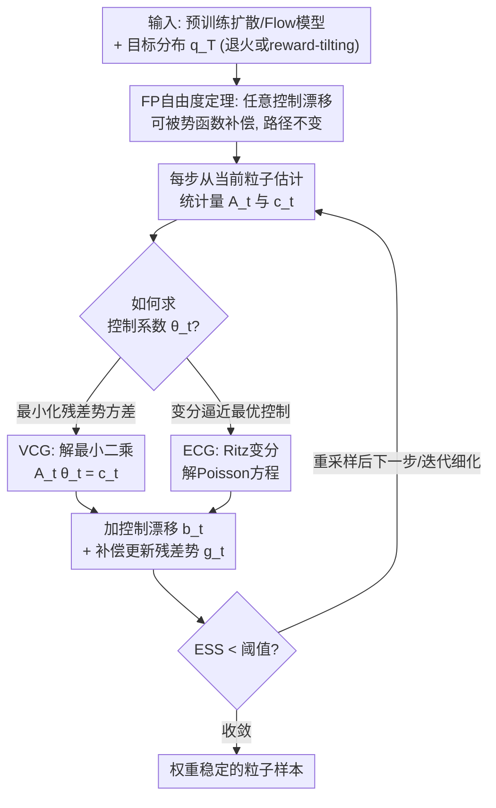

# DriftLite: Lightweight Drift Control for Inference-Time Scaling of Diffusion Models

**会议**: ICLR 2026  
**arXiv**: [2509.21655](https://arxiv.org/abs/2509.21655)  
**代码**: [https://github.com/yinuoren/DriftLite](https://github.com/yinuoren/DriftLite)  
**领域**: 计算生物  
**关键词**: 扩散模型推理适配, 粒子方法, 漂移控制, Fokker-Planck方程, 方差缩减

## 一句话总结
DriftLite 提出在 Fokker-Planck 方程中利用漂移-势函数的自由度，通过轻量级线性系统求解最优控制漂移来主动稳定粒子权重，以最小代价解决 Sequential Monte Carlo 中的权重退化问题，在高斯混合、分子系统和蛋白质-配体共折叠任务上大幅超越 Guidance-SMC 基线。

## 研究背景与动机

**领域现状**：扩散/Flow Matching 模型在生成任务上取得巨大成功，但推理时适配（不重新训练适应新目标分布）仍是关键挑战。主要有两类方法：guidance（简单但有偏）和 SMC 粒子重加权（无偏但权重退化严重）。

**现有痛点**：
   - Guidance 方法（classifier/classifier-free guidance）简单但本质有偏——忽略了目标分布的归一化常数随时间变化
   - SMC 粒子方法理论上无偏（KL 散度 $\mathcal{O}(N^{-1})$），但实际中权重会指数级退化，有效样本量 (ESS) 迅速崩塌
   - 增加粒子数可缓解但计算成本线性增长；减少粒子数则不稳定
   - 基于训练的控制方法（neural network 参数化）需要反向传播，丢失了推理时方法的轻量优势

**核心矛盾**：无偏性 vs 计算效率——SMC 理论正确但实际不稳定，guidance 高效但有偏

**本文目标**
   - 如何在保持无偏性的前提下稳定粒子权重？
   - 能否找到一种 training-free 且开销极小的方法？

**切入角度**：Fokker-Planck 方程中漂移项和势函数之间存在根本性的自由度——任何加到漂移上的控制项都可以被势函数的对应修正精确补偿，而这个自由度可以用来最小化残差势函数的方差。

**核心 idea**：将 SMC 的被动重加权（passively reweight）改为主动转向（proactively steer）——把导致权重方差的势函数 $g_t$ 的一部分"卸载"到漂移项中，只需在每步求解一个小线性系统。

## 方法详解

### 整体框架
DriftLite 要解决的是推理时适配里 SMC 的老毛病：粒子权重指数级退化，有效样本量很快崩塌。它的做法不是事后给权重做归一化，而是在采样过程里就主动把"会制造权重方差"的那部分信息从权重挪到漂移项里去。它的合法性来自 **Fokker-Planck 自由度定理**——往漂移里加任何控制项，都能被势函数的对应修正精确补偿、不改变最终路径，于是"把方差从权重卸载到漂移"成了一个无偏的旋钮。具体到每个时间步，给定预训练扩散模型和目标分布（退火 $q_T \propto p_0^\gamma$ 或 reward-tilting $q_T \propto p_0 \exp(r)$），流程是：先用当前这批粒子估出一个小矩阵 $A_t$ 和向量 $c_t$，再按 **VCG**（最小化残差势方差）或 **ECG**（变分逼近最优控制）求解一个 $n \times n$（$n \leq 3$）的线性系统拿到控制漂移系数 $\theta_t$，把控制漂移加进粒子 SDE 并相应更新残差势函数；ESS 跌破阈值时做一次 SMC 重采样，再进入下一步或迭代细化。整套机制不引入任何待训练参数，每步的额外代价就是解一个三阶以内的小线性方程。

### 关键设计

**1. Fokker-Planck 自由度定理：把权重方差转移进漂移的数学许可证**

权重退化的根源是势函数 $g_t$ 在粒子间方差太大，但要"动"漂移又不能改变最终分布——这条定理（Prop 3.1）正是把这件事变成合法操作的依据。它说明：对任意控制漂移 $\bm{b}_t$，只要给势函数配上一个补偿项 $h_t(\bm{x}; \bm{b}_t) = \nabla \cdot \bm{b}_t + \bm{b}_t \cdot \nabla \log q_t$，Fokker-Planck 方程描述的路径 $(q_t)$ 就丝毫不变。换句话说，漂移和势函数之间存在一个可以自由分配的自由度：往漂移里加什么，都能被势函数的对应修正精确抵消。关键性质 $\mathbb{E}_{q_t}[h_t(\cdot; \bm{b}_t)] = 0$ 保证这个补偿在期望意义下不引入偏差。于是 SMC 的无偏性原封不动，而我们获得了一个把势函数方差"卸载"到漂移里的旋钮——理想情况下甚至能把权重方差完全消掉。

**2. VCG（Variance-Controlling Guidance）：直接最小化残差势函数的方差**

有了自由度，剩下的问题是往漂移里加多少。VCG 的策略最直接：直接以"残差势函数方差最小"为目标去求最优漂移。它把控制漂移限制在一个有限维子空间里 $\bm{b}_t = \sum_i \theta_t^i \bm{s}_i$，基函数取 $\{\nabla r_t, \nabla \log \hat{p}_t, \hat{\bm{u}}_t\}$（reward 梯度、score 梯度、模型自身的漂移估计）。这样一来，最小化 $\text{Var}_{q_t}[\phi_t]$ 就退化成一个标准最小二乘问题 $A_t \theta_t = c_t$，其中 $A_{ij} = \mathbb{E}[h_t^i h_t^j]$、$c_i = -\mathbb{E}[g_t h_t^i]$，两个统计量都能从当前粒子蒙特卡洛估出来。它直接打在权重退化的根源（势函数方差）上，又因为只需解一个 $3 \times 3$ 线性系统、基函数还能复用 guidance 已经算好的 score 和 reward 梯度，额外开销近乎可以忽略。

**3. ECG（Energy-Controlling Guidance）：用变分法逼近最优控制的 Poisson 方程解**

ECG 是另一条路线，目标不是"方差最小"而是"逼近理论最优控制"。最优控制可写成势函数形式 $\bm{b}_t^* = \nabla A_t$，这里的 $A_t$ 满足一个 Poisson 方程 $\nabla \cdot (q_t \nabla A_t) = q_t g_t$。直接解这个方程在高维里不现实，ECG 改用 Ritz 变分方法，在一组标量基函数 $\{r_t, \log \hat{p}_t, \hat{U}_t\}$ 上展开 $A_t$，把它同样化简成一个小线性系统。它和 VCG 的差别在于逼近的对象：VCG 盯着方差这个可观测量，ECG 盯着理论最优解；ECG 的一个好处是不需要计算可微的 Laplacian，回避了高维下 Laplacian 估计带来的噪声。

### 损失函数 / 训练策略
- **完全 training-free**：不需要任何训练或反向传播
- 每步额外开销：求解 $n \times n$（$n=3$）线性系统 + 评估基函数（复用 guidance 已计算的 score 和 reward gradient）
- 支持迭代细化：前一轮的控制漂移+残差势函数作为下一轮的基础动力学，逐步降低方差
- 可选 SMC 重采样（ESS < 阈值时）或纯连续权重

## 实验关键数据

### 主实验（30维高斯混合模型，退火 $\gamma=2.0$）

| 方法 | $\Delta$NLL↓ | MMD↓ | SWD↓ | ESS 稳定性 |
|------|------------|------|------|-----------|
| Pure Guidance | 高偏差 | 差 | 差 | N/A |
| Guidance-SMC | 中等 | 模式坍塌 | 中等 | 迅速退化 |
| **VCG-SMC** | **最低** | **最佳** | **最佳** | **稳定** |
| **ECG-SMC** | 接近VCG | 接近VCG | 接近VCG | **稳定** |

### 蛋白质-配体共折叠（AlphaFold3 + DriftLite）

| 方法 | 配体 RMSD↓ | 口袋 TM-score↑ | Clash Score↓ |
|------|----------|-------------|-------------|
| AF3 baseline | 中等 | 中等 | 较高 |
| AF3 + VCG | **显著改善** | **改善** | **降低** |

### 消融实验

| 配置 | 效果 |
|------|------|
| 方差缩减幅度 | VCG 降低势函数方差数个数量级 |
| 粒子数缩放 | DriftLite 用 N/4 粒子达到 SMC N 粒子的效果 |
| 迭代细化 | 每轮方差单调递减，样本质量逐步提升 |
| 额外运行时间 | 相比 Pure Guidance 增加约 20-40% |

### 关键发现
- **方差降低数个数量级**：VCG 将势函数方差从 $10^2$-$10^3$ 降至 $10^{-1}$-$10^0$，ESS 在整个推理过程保持稳定
- **粒子效率提升**：DriftLite 用 32 个粒子超过 G-SMC 用 128 个粒子——4 倍效率提升
- **VCG 略优于 ECG**：直接最小化方差比变分逼近 Poisson 方程更有效
- **大规模科学应用可行**：在 AlphaFold3 蛋白质-配体共折叠上成功应用，证明方法可扩展到真实大规模场景
- **迭代细化有效**：多轮细化方差单调递减，类似自适应方法但无需训练

## 亮点与洞察
- **将 FP 方程的自由度转化为方差控制工具**是本文最核心的理论贡献——极为优雅。这个自由度虽然在数学上是已知的（twisted proposals in SMC），但将其形式化为可编程的轻量级控制，且仅需 3×3 线性系统，是工程上的巧妙创新。
- **"主动转向 vs 被动重加权"的范式转换**值得关注——SMC 的本质问题不是理论正确性而是实际的权重退化。DriftLite 通过把"信息"从权重转移到漂移中，从根本上解决了这个工程问题。
- **在 AlphaFold3 上的成功应用**证明了该方法在真实科学场景中的价值——这不仅仅是一个理论漂亮的方法，而是可以直接改善蛋白质结构预测的实用工具。

## 局限与展望
- 需要 reward function 二阶可微（可用随机估计器近似，但精度下降）
- 基函数选择仍是手工的（3个基函数），更多/更好的基函数可能进一步提升
- 高维场景中 Laplacian 估计引入噪声，可能影响控制质量
- 仅在生成式 scientific 任务验证，未在大规模图像生成（如 SD3）上测试
- 迭代细化增加推理时间（但不需要训练）

## 相关工作与启发
- **vs Guidance-SMC (Skreta et al.)**: 同一框架但 DriftLite 通过漂移控制主动减少权重退化，而 G-SMC 被动重加权→权重坍塌
- **vs Neural Control (Albergo & Vanden-Eijnden)**: 用 NN 参数化控制需要训练/反向传播；DriftLite 用 3 个基函数的线性系统替代，training-free
- **vs Pure Guidance (Ho & Salimans)**: Guidance 简单但有偏；DriftLite 保持无偏性的同时计算开销仅增加 20-40%

## 评分
- 新颖性: ⭐⭐⭐⭐⭐ FP 自由度→方差控制的理论洞察原创性极高
- 实验充分度: ⭐⭐⭐⭐⭐ 从合成数据到分子系统到蛋白质折叠的全面验证
- 写作质量: ⭐⭐⭐⭐⭐ 理论推导严谨优雅，实验设计逻辑清晰
- 价值: ⭐⭐⭐⭐⭐ 对扩散模型推理时适配的通用贡献，科学应用价值高

<!-- RELATED:START -->

## 相关论文

- [\[NeurIPS 2025\] Remasking Discrete Diffusion Models with Inference-Time Scaling](../../NeurIPS2025/computational_biology/remasking_discrete_diffusion_models_with_inference-time_scaling.md)
- [\[ICLR 2026\] OmniMouse: Scaling properties of multi-modal, multi-task Brain Models on 150B Neural Tokens](omnimouse_scaling_properties_of_multi-modal_multi-task_brain_models_on_150b_neur.md)
- [\[ICLR 2026\] Reverse Distillation: Consistently Scaling Protein Language Model Representations](reverse_distillation_consistently_scaling_protein_language_model_representations.md)
- [\[ICLR 2026\] Multifidelity Simulation-based Inference for Computationally Expensive Simulators](multifidelity_simulation-based_inference_for_computationally_expensive_simulator.md)
- [\[ICLR 2026\] Fine-Tuning Diffusion Models via Intermediate Distribution Shaping](fine-tuning_diffusion_models_via_intermediate_distribution_shaping.md)

<!-- RELATED:END -->
