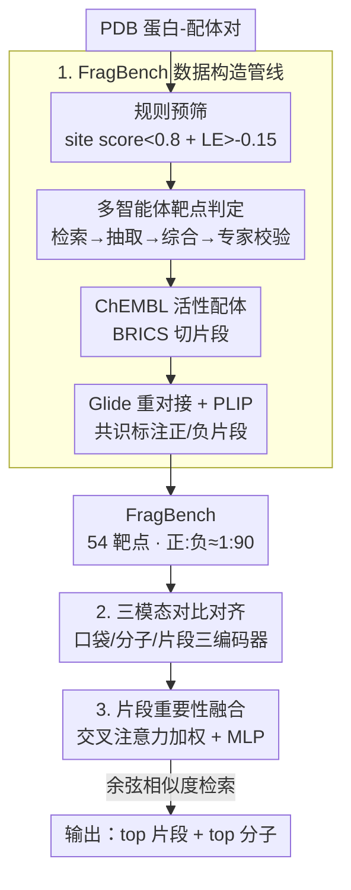

# Drugging the Undruggable: Benchmarking and Modeling Fragment-Based Screening

**会议**: ICLR2026  
**OpenReview**: [https://openreview.net/forum?id=MMLAvR1juf](https://openreview.net/forum?id=MMLAvR1juf)  
**代码**: 待确认  
**领域**: 计算生物学 / 药物发现 / 对比学习  
**关键词**: 不可成药靶点, 片段筛选, 三模态对比学习, 虚拟筛选, FBDD

## 一句话总结
针对"不可成药"蛋白（口袋浅、瞬态、隐蔽）上传统分子筛选失效的问题，本文构建了首个片段级虚拟筛选基准 FragBench（54 个挑战性靶点，多智能体 LLM+人工协同标注），并提出三模态对比学习框架 FragCLIP（联合编码口袋、整分子、片段），在片段检索上大幅超越对接软件和已有 ML 方法（FragBench 上 EF@0.5% 从 Glide 的 1.86 提到 6.85），且检索出的片段能被扩展/连接成高亲和力先导化合物。

## 研究背景与动机
**领域现状**：基于结构的虚拟筛选（VS）已经相当成熟——DiffDock/EquiBind 预测结合构象，DrugCLIP 用对比学习对齐口袋与配体表示，DUD-E、LIT-PCBA、CrossDocked2020 等基准支撑了标准化评测。但这些工作几乎全都假设目标蛋白有"良好定义、形状稳定"的结合口袋，筛选的也都是类药（drug-like）的整分子。

**现有痛点**：人类蛋白组里超过 85% 被认为"不可成药"（undruggable）——比如转录因子、蛋白-蛋白相互作用（PPI）枢纽，它们和癌症、神经退行性疾病密切相关，却没有深而稳定的口袋，整分子既塞不进去也抓不住。基于片段的药物发现（FBDD）本是出路：片段更小更灵活，能挤进浅的、瞬态的、隐蔽的位点，作为"锚点"再扩展或连接成高亲和力分子（经典案例 BCL-xL 就是这么做出来的）。但片段筛选自身又卡住了：实验手段（NMR、晶体学）准但慢且贵；计算对接（docking）本是为整尺寸配体设计的，对小片段系统性低估，假阳/假阴都高——论文实测 Glide 在这类靶点上 EF1 只有 1.8，几乎和随机一样。

**核心矛盾**：AI 在药物发现里突飞猛进，但片段筛选这块几乎是空白，原因有两条根本性的缺口。其一，**没有针对不可成药口袋的片段筛选基准**，无法标准化评测、横向比较；其二，**现有建模框架没法捕捉"片段—类药分子—蛋白口袋"三者的三元关系**——只看片段-口袋的局部交互或只看分子-口袋的全局结合，都难以做到跨靶点泛化的片段检索。

**本文目标**：把"不可成药口袋上的片段检索"这个任务形式化，并同时补上数据和模型两块——既要有高质量基准，也要有专为片段设计的模型。

**切入角度**：作者的关键观察是，片段虽然结合信号弱、监督稀疏，但片段并非孤立存在——它来自某个类药母分子，母分子提供了"骨架级（scaffold-level）的上下文"。如果让模型在三种粒度（口袋 / 整分子 / 片段）之间做对比对齐，母分子就能当作"桥梁"去正则化、稳定片段表示，缓解片段单独训练时的稀疏噪声监督。

**核心 idea**：用三模态对比学习联合编码口袋、整分子、片段（FragCLIP），让母分子作为骨架桥梁稳定片段表示；并配套用"规则预筛 + 多智能体 LLM-人工协同 + 交互式标注"造出首个不可成药靶点的片段筛选基准（FragBench）。

## 方法详解

### 整体框架
本文是"基准 + 模型"双产出。任务定义为**片段级虚拟筛选**：给定一个口袋 $p\in P$（通常来自不可成药蛋白）和一个片段库 $F=\{f_1,\dots,f_N\}$，要从中挑出能与 $p$ 形成有利非共价相互作用的子集 $F^+\subseteq F$。每个片段是从类药分子按可合成断键规则（如 BRICS）切出来的化学有效子结构，分子量低、官能团少，因而结合弱而局部，但正因为简单才能进到不可成药口袋。评测用早期识别指标 EF@k 和 BEDROC。

整条管线分两半。**前半是 FragBench 的数据构造**：从 PDB 的蛋白-配体复合物出发 → 规则预筛（site score 与配体效率过滤）选出结构上有挑战性的口袋-配体对 → 多智能体框架（检索/抽取/综合/专家校验）从文献证据判定靶点是否"不可成药" → 从 ChEMBL 拉活性配体、BRICS 切片段、Glide 重对接 + PLIP 交互检测打片段级正负标签。**后半是 FragCLIP 的训练与推理**：三个编码器分别编口袋、整分子、片段，用多视角对比损失对齐三种粒度，再用一个交叉注意力融合模块给片段加权聚合成融合表示并与口袋对齐；推理时直接在共享嵌入空间里用余弦相似度同时检索 top 片段和 top 分子。

### 关键设计

**1. FragBench 数据构造：规则预筛 + 多智能体 LLM-人工协同把"不可成药靶点"挖出来并打上可靠片段标签**

最大的障碍是数据本身：PDB 严重偏向有良好口袋的可成药蛋白，且**没有任何数据库系统地编目过不可成药靶点**。作者用一条规则管线先做粗筛——从所有 PDB 蛋白-配体对里剔除共价配体、临近核酸（6 Å 内）、过小口袋（残基 <10），得到 87,425 对；再用 SiteMap 算 site score、保留 <0.8 的（小或封闭性差的口袋），同时算配体效率 $LE(l)=S(l)/HA(l)$（Glide 对接分数除以重原子数），保留 $LE(l)>-0.15$（按尺寸归一化后偏弱结合）。最终候选集 $C=\{(p,l)\mid \text{SiteScore}(p)<0.8 \wedge LE(l)>-0.15\}$ 收敛到 1,387 个结构挑战性的口袋-配体对供专家复核。

光靠规则判不了"是否不可成药"，所以作者再上一个**模块化多智能体框架**：检索智能体 $R:t\mapsto D_t$ 从 DrugBank、PubMed 拉取靶点 $t$ 的相关文献语料；抽取智能体 $E$ 用任务化 prompt 对每篇文档产出结构化证据元组 $(e_i,c_i)$（证据类型如"浅口袋""片段命中""不可成药结构域" + 引文），并用 schema 约束解码保证输出一致；综合智能体 $S$ 聚合证据和 DrugBank 元特征算出临时分类 $\hat y_t\in\{\text{druggable, undruggable, FBDD-reported}\}$，证据冲突的走确定性规则或标记人工复核；最后专家校验 $V:\hat y_t\mapsto y_t$ 给出真值标签。平均每个靶点能拿到 218/34/25 篇关于可成药性/不可成药性/FBDD 的 PubMed 证据。片段标签则走保守共识：从 ChEMBL 活性配体用 BRICS 切片段（保留 $8\le HA(f_i)\le 24$ 以匹配 Enamine REAL 等真实片段库），Glide 重对接 + PLIP 检测非共价交互，只有当片段在某个对接姿势中**至少 2 个原子各形成 ≥1 个非共价交互**、且这一模式在 **3 次独立对接重复**里稳定复现，才标为正；负样本按 1:90 随机采。最终 FragBench 覆盖 54 个靶点，每靶平均 84.37 个正片段、7593.33 个负片段。这套"规则缩范围、智能体扩证据、人工兜底"的协同，本质是用 LLM 把分散在文献里的不可成药证据规模化抽取出来，再用交互模式给弱信号片段打上高置信标签。

**2. 多粒度对比对齐：让母分子当桥梁，稳住稀疏噪声的片段-口袋监督**

直接拿片段-口袋对训练问题很大——片段小、亲和力弱、强烈依赖上下文，监督既稀疏又带噪。作者的解法是设计一个多编码器框架同时建模三种粒度：口袋编码器 $f_p$ 把 3D 口袋结构映到隐空间，片段编码器 $f_f$ 抓与结合相关的细粒度子结构，分子编码器 $f_m$ 提供骨架级上下文、充当结构/化学桥梁去正则化片段表示并稳定训练。三种粒度之间用一组对比目标对齐：口袋-分子对齐 $L_{p\text{-}m}$ 保留骨架级语义，口袋-片段对齐 $L_{p\text{-}f}$ 给片段-口袋兼容性直接监督，分子-片段对齐 $L_{m\text{-}f}$ 强制片段与其母分子内部一致。每个损失都是 InfoNCE 形式：

$$L_{a\text{-}b}=-\frac{1}{N}\sum_{i=1}^N \log\frac{\exp(\mathrm{sim}(f_a(a_i),f_b(b_i))/\tau)}{\sum_{j=1}^N \exp(\mathrm{sim}(f_a(a_i),f_b(b_j))/\tau)}$$

总对齐损失 $L_{align}=L_{p\text{-}m}+\lambda_1 L_{p\text{-}f}+\lambda_2 L_{m\text{-}f}$。实现上三个编码器都基于 UniMol（带 SE(3)-等变注意力的 3D 分子表示模型）：口袋用 UniMol 的口袋编码器，$f_m$ 和 $f_f$ 共用其分子编码器，保证跨模态的几何表示统一。这样片段不是在真空里学，而是被"它来自哪个分子""那个分子配哪个口袋"两条额外监督拴住，弱信号被骨架上下文托起来。

**3. 片段重要性融合：交叉注意力筛掉"打酱油"的片段，把真正驱动结合的子结构突出来**

一个分子里大部分片段对结合贡献甚微，有些还会形成虚假或上下文依赖的交互，一视同仁地用全部片段会稀释判别性线索，模型分不清"哪个子结构真的在结合"。为此作者加了个**融合机制做联合选择与过滤**：给定分子嵌入 $f_m(m)$ 和它的片段嵌入 $\{f_f(f_i)\}_{i=1}^k$，用交叉注意力模块高亮与结合最相关的片段、下调无信息片段，注意力输出与分子嵌入拼接后过 MLP 得到融合表示：

$$z_{fusion}=\mathrm{MLP}\big(f_m(m)\,\|\,\mathrm{Attn}(f_m(m),\{f_f(f_i)\}_{i=1}^k)\big)$$

这个融合嵌入再通过对比损失 $L_{fusion}$ 与口袋表示对齐（同样是 InfoNCE 形式，正例是配对口袋 $f_p(p_i)$）。融合模块的作用是把片段嵌入精炼成更有判别力的检索信号——强调结合相关子结构、压制噪声，从而强化片段级表示学习，也为后面"片段信号反哺分子检索"埋下伏笔。

### 一个完整示例：片段信号把被埋没的分子捞回来
论文图 4 给了个很有画面的例子：一个 AKT1 的活性配体被分子编码器打了个差分（MolScore −0.0659，排名百分位 43.31%，几乎要被当成无效分子丢掉）。但 FragCLIP 从这个分子里识别出两个信息量大的片段，它们与口袋有很强交互（FragScore 分别 0.2680、0.4931）。把这两个片段信号通过集成方式并进去后，最终分数提到 0.2901，排名一下升到 8.36%。这个例子直观说明：当整分子层面的信号模糊时，局部片段的强交互证据能反过来纠正分子排序——这正是三模态联合建模和融合模块的价值所在。

### 损失函数 / 训练策略
训练总目标是对齐损失 $L_{align}=L_{p\text{-}m}+\lambda_1 L_{p\text{-}f}+\lambda_2 L_{m\text{-}f}$ 加上融合对比损失 $L_{fusion}$，温度系数 $\tau$。训练数据用 PDBbind，为防测试靶点泄漏，移除所有与 FragBench/DUD-E/LIT-PCBA/DEKOIS 2.0 中任一靶点序列相似度 >90% 的复合物，过滤后训练/验证集为 14,223 / 744 个蛋白-配体对。推理时多粒度集成：$\text{Score}=\text{MolScore}+\alpha\cdot\text{FragScore}+\beta\cdot\text{FusionScore}$，超参 $\alpha=\beta=0.8$。

## 实验关键数据

### 主实验
FragBench（不可成药靶点）上，经典对接彻底失效——Vina 给不出有意义排序，Glide 仅勉强富集；FragCLIP 在所有指标上最优，EF@0.5% 比 Glide 提升约 3.7 倍。

| 方法 | AUROC | BEDROC | EF@0.5% | EF@1% | EF@5% |
|------|-------|--------|---------|-------|-------|
| Vina | 0.476 | 0.025 | 1.665 | 1.419 | 1.113 |
| Glide | 0.597 | 0.034 | 1.862 | 1.825 | 1.712 |
| EquiScore† | 0.581 | 0.105 | 4.039 | 3.331 | 2.049 |
| LigUnity† | 0.505 | 0.089 | 4.262 | 3.562 | 2.087 |
| DrugCLIP (90%) | 0.597 | 0.080 | 4.110 | 3.203 | 2.067 |
| **FragCLIP (90%)** | 0.593 | **0.115** | **6.853** | **5.797** | **3.000** |

在 DUD-E / Dekois / LIT-PCBA 的片段版基准上 FragCLIP 同样全面领先：

| 数据集 | 指标 | FragCLIP | 最强基线 |
|--------|------|----------|----------|
| DUD-E (frag) | EF@0.5% | **20.317** | 19.493 (LigUnity) |
| Dekois (frag) | EF@0.5% | **17.963** | 8.607 (DrugCLIP) |
| LIT-PCBA (frag) | EF@0.5% | **3.437** | 2.939 (RTMScore) |

### 消融 / 分析实验
片段信号反哺分子检索：在 DUD-E 整分子级筛选上，引入片段对比学习但仅用分子编码器检索，就把 EF1% 从 31.87（仅分子）提到 33.56；进一步用多粒度集成（含融合分数）冲到 37.23。

| 配置 | AUC | BEDROC | EF@1% | 说明 |
|------|-----|--------|-------|------|
| DrugCLIP | 80.93 | 50.52 | 31.89 | 仅分子对比基线 |
| FragCLIP (w/o Fusion) | 84.76 | 53.61 | 33.56 | 加片段对比、不用融合 |
| **FragCLIP** | **85.44** | **59.32** | **37.23** | 完整（融合+集成） |

### 关键发现
- **对接方法在片段上系统性失效**：Glide 在 FragBench 的 EF1 仅约 1.8，几乎等于随机——这正是论文立项的根本依据，说明片段筛选不是"把整分子方法缩小"就行。
- **三模态联合建模是涨点主力**：从 DrugCLIP（仅分子-口袋）到 FragCLIP，FragBench EF@0.5% 从 4.11 翻到 6.85；即使只在分子级检索，加了片段监督也能涨（31.87→33.56），说明片段上下文确实正则化了表示。
- **融合 + 集成进一步放大收益**：DUD-E 整分子 EF1% 从 33.56（无融合）到 37.23（完整），融合模块对"筛掉无关片段"是有效的。
- **片段可下游使用**：在不可成药靶点 BCL-2 上，FragCLIP 检索 30 个候选片段，Glide 找锚点构象，再用 DiffLinker 连接两个高分片段，得到 Glide 分数 −11.96 的连接分子，证明检索结果能直接喂给生成模型做先导化合物设计。

## 亮点与洞察
- **把"找不可成药靶点"这件事工程化**：以前没有数据库编目不可成药靶点，作者用"规则缩范围 + 多智能体 LLM 扩文献证据 + 人工兜底"把它变成可复现的高通量管线，平均每靶聚合上百篇证据——这套 human-in-the-loop 的证据溯源思路可迁移到任何"标签藏在文献里、规则判不出来"的生物医学标注任务。
- **母分子当桥梁是点睛之笔**：片段单独训练监督太稀疏，借母分子的骨架上下文做三粒度对比对齐，相当于给弱信号加了两条额外的锚链（片段↔分子、分子↔口袋），是缓解稀疏监督的通用招法。
- **保守共识标注降噪**：要求"≥2 原子形成交互 + 3 次对接重复稳定"才算正样本，用冗余换可靠，对接本身有噪也能挤出高置信标签。
- **片段反哺分子检索的反直觉结论**：局部片段的强交互证据能把被整分子编码器埋没的活性分子重新捞回来（AKT1 案例 43%→8%），提示"细粒度信号可纠正粗粒度排序"。

## 局限与展望
- **标签依赖对接 + PLIP，不是实验真值**：正片段由 Glide 重对接 + PLIP 交互检测生成，而对接本身在片段上就不可靠——基准的"金标准"其实是计算近似，可能继承对接的系统偏差（作者在附录做了重复次数/阈值的可靠性分析，但本质仍是 in silico 标签）。
- **绝对富集仍然偏低**：FragBench 上 EF@0.5% 才 6.85、BEDROC 0.115，相比 DUD-E 上的 20+ 差一个量级——说明不可成药口袋的片段检索远未解决，FragCLIP 是"明显更好但远不够好"。
- **规模有限**：54 个靶点对"覆盖整个不可成药蛋白组（>85% 蛋白组）"还很小，跨靶点泛化的统计说服力受限。
- **下游验证停留在单个案例 + 预测亲和力**：BCL-2 连接分子只有 Glide 预测分数 −11.96，没有湿实验验证，离"真能成药"还有距离。

## 相关工作与启发
- **vs DrugCLIP**：DrugCLIP 用口袋-配体两模态对比做整分子虚拟筛选，本文把它扩成口袋-分子-片段三模态、并加片段重要性融合，专门攻片段级且不可成药的场景；FragCLIP 在 FragBench 上 EF@0.5% 6.85 vs DrugCLIP 4.11，在 DUD-E 整分子级也更高（EF1% 37.23 vs 31.89）。
- **vs 对接软件（Glide / Vina）**：对接为整尺寸配体设计、靠物理打分，对小片段系统性低估、在浅口袋上几乎随机；本文用学习式对比检索绕开对接打分偏差。
- **vs 标准 VS 基准（DUD-E / LIT-PCBA / DEKOIS）**：这些基准面向类药分子和良构口袋，FragBench 是首个针对不可成药靶点、片段级的基准，且作者还把这三个经典基准改造成"片段版"用于跨难度评测。
- **启发**：当某个子任务缺监督时（这里是片段-口袋），可以引入一个"信息更丰富的相邻粒度实体"（母分子）当桥梁做多粒度对比对齐——这一范式对蛋白结构域、子图、token 级等"小而弱信号"的检索/表示学习都有借鉴意义。

## 评分
- 新颖性: ⭐⭐⭐⭐⭐ 首个不可成药靶点片段筛选基准 + 三模态对比框架，问题切口和方法都新
- 实验充分度: ⭐⭐⭐⭐ 4 个基准 + 消融 + 分子反哺 + 下游连接案例，但下游缺湿实验、绝对指标偏低
- 写作质量: ⭐⭐⭐⭐ 动机推导清晰、公式完整、图示到位，部分附录细节需翻查
- 价值: ⭐⭐⭐⭐⭐ 直指 85% 不可成药蛋白组这一高价值难题，基准 + 模型为 FBDD 提供了可复用的地基

<!-- RELATED:START -->

## 相关论文

- [\[ICLR 2026\] SubDyve: Subgraph-Driven Dynamic Propagation for Virtual Screening Enhancement](subdyve_subgraph-driven_dynamic_propagation_for_virtual_screening_enhancement_co.md)
- [\[ICLR 2026\] FACET: A Fragment-Aware Conformer Ensemble Transformer](facet_a_fragment-aware_conformer_ensemble_transformer.md)
- [\[ICLR 2026\] HeurekaBench: A Benchmarking Framework for AI Co-scientist](heurekabench_a_benchmarking_framework_for_ai_co-scientist.md)
- [\[ICLR 2026\] SigmaDock: Untwisting Molecular Docking with Fragment-Based SE(3) Diffusion](sigmadock_untwisting_molecular_docking_with_fragment-based_se3_diffusion.md)
- [\[ICML 2026\] Protein Fold Classification at Scale: Benchmarking and Pretraining](../../ICML2026/computational_biology/protein_fold_classification_at_scale_benchmarking_and_pretraining.md)

<!-- RELATED:END -->
