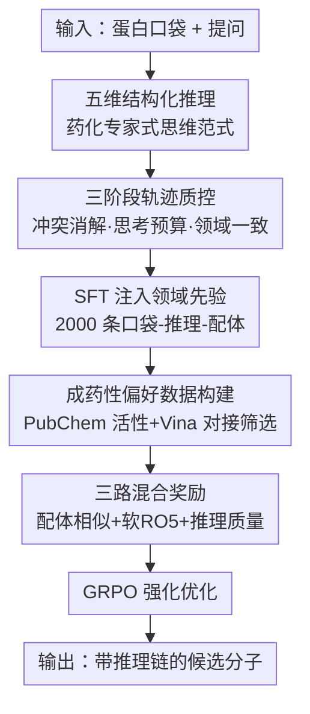

# DrugTrail: Interpretable Drug Discovery via Structured Reasoning and Druggability‑Tailored Preference Optimization

**会议**: ICLR2026  
**OpenReview**: [https://openreview.net/forum?id=1pAW0y8WLH](https://openreview.net/forum?id=1pAW0y8WLH)  
**代码**: 待确认  
**领域**: 计算生物 / LLM 推理 / 强化学习  
**关键词**: 药物发现, 可解释推理, 偏好优化, GRPO, 成药性  

## 一句话总结
DrugTrail 把通用大模型改造成"会像药化专家一样思考"的药物设计器：先用临床化学引导的五维结构化推理（CCIR）做轻量 SFT，再用一套不依赖耗时打分、能在线计算的成药性偏好优化（DTPO）做 GRPO 强化学习，让 7B 级小模型在口袋导向分子生成上对接能量、QED、SA 等指标全面碾压 DeepSeek-R1 等大模型，且每个分子都附带可读的推理链。

## 研究背景与动机
**领域现状**：机器学习已被广泛用来加速早期药物发现——虚拟筛选、分子对接、分子编辑。近期大模型因其跨领域知识和能生成人类可读解释的能力，被视为辅助药物发现的有力工具。

**现有痛点**：现有 AI 工具有两个老毛病。一是"黑箱"——只给最终预测，不暴露中间推理，专家无法理解、修正、信任它的结论，难以嵌入真实生物医学工作流。二是数据饥渴——多数基于 LLM 的方法需要大规模生物相关语料做预训练，而高质量生物数据稀缺、算力成本高。

**核心矛盾**：作者抓住两个更深的矛盾。第一，要让模型"按药化方式思考"，但现有数据集根本没有结构化的推理轨迹可供学习领域思维范式。第二，奖励设计是 RL 的瓶颈——以往方法常用结合亲和力（binding affinity）做奖励，但**亲和力高 ≠ 成药性好**：结合时长、合成可及性、潜在脱靶抑制等都决定一个分子能否变成安全有效的药。只盯亲和力会把搜索空间引偏。

**本文目标**：在不做昂贵领域预训练的前提下，激活通用 LLM 已内嵌的领域知识，让它（1）输出透明、合规于药化原则的推理；（2）按更贴近真实药学标准的综合目标做优化。

**切入角度**：前人已证明，与其靠昂贵预训练造领域模型，不如用 RL 把通用 LLM 里已有的领域知识"解锁"出来（如数学、编程），且少量 SFT 就足以引导其推理能力。作者据此押注"SFT 引出结构化推理 + RL 校准成药性"这条轻量路线。

**核心 idea**：用"五维结构化推理轨迹（SFT 引出）+ 成药性定制偏好优化（GRPO 强化）"替代"大规模预训练 + 单一亲和力奖励"，做出既可解释又成药的分子设计器。

## 方法详解

### 整体框架
DrugTrail 把"从蛋白口袋生成可结合小分子"这件事拆成两段串行的能力构建。第一段是 **CCIR（Clinical Chemistry-Informed Reasoning，临床化学引导推理）**：先从通用大模型里"问"出药化专家常用的五个推理维度，再用这五维把已有的口袋–配体对补全成"口袋→推理→配体"三元组数据集，经三道质控过滤后做 SFT，让模型学会用 `<Characterization>`/`<Stability>`/`<Guidance>`/`<Conservation>`/`<Optimization>` 五段标签 + `<Answer>` 输出结构化、可读的推理链并给出 SMILES。第二段是 **DTPO（Druggability-Tailored Preference Optimization，成药性定制偏好优化）**：在 SFT 模型之上用 GRPO 做 RL，但奖励不再是耗时的对接打分，而是"配体相似度 + 软性 Lipinski 规则 + 推理质量"三路混合奖励，从而在线高效计算且与真实成药性强相关。输入是蛋白口袋序列，输出是一个带完整推理链的候选分子。

### 关键设计

**1. 五维结构化推理维度：让模型按药化专家的思路展开思考**

可解释性的核心痛点是模型只给结论不给"怎么想的"。作者没有手写一套推理模板，而是设计结构化 prompt 去问一个基座大模型（Qwen3-235B-A22B），把临床药物发现里"专家通常从哪些角度思考"萃取出来，得到五个核心维度：(1) 深入的理化性质刻画；(2) 维持核心结构/功能完整性；(3) 先验知识与化学/结构空间引导；(4) 保守性分析与关键位点识别；(5) 优化与多属性平衡。这五维各自对应一对特殊标签（`<Characterization>` 等），强制模型把推理拆成可读、可核查的段落。这样做的价值在于：推理维度不是凭空规定，而是从大模型自身的知识空间里"采"出来的专家共识，既贴合药化逻辑，又天然能被 LLM 生成；同时标签化让后续 RL 能直接对"推理是否完整"打分。

**2. 三阶段轨迹质控：把"采"出来的推理过滤成可信训练数据**

直接让大模型补全的推理良莠不齐，会把噪声学进去。作者从 CrossDocked2020 训练集采样口袋–配体对，让大模型按五维补全"连接口袋与其配体"的推理，再过三道闸：**冲突消解（Conflict Resolving）**——对同一样本用随机解码/多模型集成生成多条候选，由一个更强的裁判 LLM 评判内部一致性，含逻辑谬误、自相矛盾、生化论断冲突的轨迹被丢弃；**思考预算指令（Thinking Budget Instruction）**——基于"好推理应既全面又简洁"的假设，按长度过滤，惩罚过长啰嗦或过短敷衍的轨迹，引导模型学到聚焦高效的推理风格；**领域一致性（Domain Consistency）**——用对抗验证：准备一小批专家手写的"黄金"轨迹，混入生成轨迹后让一个 LLM 当分类器，把明显偏离专家范式的生成样本剔除。三关下来得到约 2,000 条高质量"口袋–推理–配体"样本用于 SFT，用标准交叉熵把基座模型对齐到这套结构化推理格式与药化知识，给模型注入一个结构化的认知先验。

**3. 成药性定制偏好优化 DTPO：用能在线算的混合奖励取代耗时亲和力打分**

这是针对"亲和力≠成药性、且对接打分太慢"的痛点。DTPO 在 GRPO 框架（无价值网络、用组内相对优势 $A_{i,t} = (R_i - \mathrm{mean}(\{R_i\}))/\mathrm{std}(\{R_i\})$ 估计优势、带 KL 正则保稳定）上设计三路混合奖励 $R_{total} = w_{ligand}R_{ligand} + w_{rule}R_{rule} + w_{reasoning}R_{reasoning}$：

- **配体相似度奖励（带自适应排序）**：为每个口袋先定位生物靶点，从 PubChem 检索对该靶点实验验证有活性的分子，再用 AutoDock Vina 对接筛选、保留 Vina 分数低于 -7 的 top-20 候选，连同真值配体构成"口袋专属参考集"。奖励定义为 $R_{ligand}(m) = \sum_{i=1}^{N} \gamma^{rank_i}\,\mathrm{Tanimoto}(m, r_i)$，参考集按对接亲和力预排序、用衰减因子 $\gamma=0.95$ 指数加权，从而优先奖励与高排名配体相似、继承其关键结构特征的分子。这一路把"和已知有效药像"变成可在线计算的连续信号。
- **软性 Lipinski 五规则奖励**：把 RO5 的四个性质（分子量 MW、脂水分配系数 LogP、氢键供体 HBD、氢键受体 HBA）各映射成 $(0,1)$ 的软分，如 $s(x) = 1/(1+\exp(k(x-t)))$，整体 $R_{rule}(m) = (s_{MW}+s_{LogP}+s_{HBD}+s_{HBA})/4$，鼓励生成理化性质友好的分子。
- **推理质量奖励**：对六对预定义特殊标签，每完整正确包含一对 +0.1，$R_{reasoning}(trace) = 0.1 \times N_{pairs}(trace)$，$N_{pairs}\in\{0,\dots,6\}$，强制模型保留全部推理维度、维持结构清晰。

三路奖励的关键在于"全部可在线快速计算"，绕开了把每个候选都去做真实对接打分的高成本，又通过"和真活性分子像 + 满足 RO5 + 推理完整"三重约束把优化目标拉回成药性，而非单一亲和力。

### 损失函数 / 训练策略
两阶段：先用约 2,000 条质控后样本做标准交叉熵 SFT，把模型对齐到五维 + `<Answer>` 的结构化输出格式与药化先验；再用 GRPO（式 1，clip 的代理目标 + KL 正则）以三路加权混合奖励 $R_{total}$ 做强化优化。基座覆盖 Qwen3-1.7B/4B/8B 三档。

## 实验关键数据

### 主实验
基准用 CBGBench 在 CrossDocked2020（100 个测试复合物）上评测，从子结构、化学性质、相互作用三个维度衡量；不评几何维度（本法不做直接 3D 生成）。

| 任务/指标 | Base (Qwen3-8B) | +CCIR | +CCIR+DTPO | 强推理基线 DeepSeek-R1 |
|--------|------|------|------|------|
| 对接能量 E ↓ | 11.80 | -3.10 | **-6.82** | -0.36 |
| 优越结合占比 IMP(%) ↑ | 0.01 | 10.93 | **41.01** | 0.2 |
| QED ↑ | 0.17 | 0.31 | **0.57** | — |
| SA ↑ | 0.28 | 0.43 | **0.72** | — |

跨 1.7B/4B/8B 三档模型，完整模型把 E 压到 -6.65 ∼ -6.82、IMP 抬到 33–41%，远超所有强/弱推理大模型基线（DeepSeek-R1、Qwen3-235B、DeepSeek-V3 等 E 多在 -1.2 ∼ +21 区间、IMP 近乎 0）。子结构分析里原子/环/官能团的 JSD、MAE 也全面下降，说明生成分布更贴近参考集。

### 消融实验

| 配置 | 现象 | 说明 |
|------|---------|------|
| Base | E 正、IMP≈0、QED≈0.12-0.17 | 通用模型几乎不会做口袋导向设计 |
| +CCIR | E 转负、QED≈0.30、SA≈0.40 | 结构化推理 SFT 已"激活"领域能力 |
| +CCIR+DTPO | E≈-6.8、IMP≈41%、QED≈0.57 | 偏好优化带来最大增益 |
| w/o R / w/o L / w/o RQ | 各指标向理想区外偏移 | 三路奖励缺一不可（图 2c） |
| 衰减因子 γ | 0.95 附近 VS 与多样性最佳 | γ 控制对 top 配体的偏好强度（图 2b） |

### 关键发现
- **CCIR 是"开关"，DTPO 是"放大器"**：只加 CCIR 就能把对接能量从正转负、QED 翻倍，说明结构化推理 SFT 把通用模型里沉睡的领域能力激活了；DTPO 再把 IMP 从 ~11% 推到 ~41%，贡献最大增益。
- **三路奖励缺一不可**：图 2c 中 w/o R、w/o L、w/o RQ 任意去一路都把 VS/QED/SA/LPSK 拉出理想区，配体相似度与软 RO5 互补。
- **零样本泛化**：同一个在 CrossDocked2020 上训练的模型，不做任何后训练就能迁移到小分子编辑（ZINC 200 分子）和蛋白优化（GFP fitness 从 0.05–0.08 提到 0.53–0.62），显示推理范式具备跨生物分子域的可迁移性。

## 亮点与洞察
- **"从模型里问出专家思维范式"很巧**：五维推理不是研究者拍脑袋定的，而是 prompt 基座大模型萃取的专家共识——既保证贴合药化逻辑，又保证 LLM 本就能生成，规避了人工设计推理模板的主观性。
- **把"成药性"工程化成可在线算的奖励**：用"和 PubChem 真活性分子的 Tanimoto 相似 + 软 RO5 + 推理完整度"三路替代慢速对接打分，是这篇最实用的 trick——可迁移到任何"真实评估很贵、但有可代理的廉价信号"的 RL 场景。
- **可解释性不是附赠而是被奖励逼出来的**：推理质量奖励直接对六对标签的完整性打分，把"输出可读推理"变成优化目标本身，而非事后解释。
- **小模型打大模型**：7B 级模型经此范式后在专业任务上全面压过 235B/DeepSeek-R1，再次印证"激活已有知识 > 堆参数/堆数据"。

## 局限与展望
- **泛化实验偏探索性**：分子编辑与蛋白优化作者自称是"初步实证"，GFP 上多样性/新颖性反而下降（如 8B 上 Novelty 从 187 降到 7.9），作者也提示多样性高低不直接等于好坏，这块结论还需更系统验证。
- **奖励代理的天花板**：配体相似度奖励本质是"向已知活性分子靠拢"，可能压制真正新颖骨架的探索（exploration-exploitation 权衡），软 RO5 也只是粗粒度成药性近似，未覆盖毒性、代谢稳定性、脱靶等。
- **依赖外部资源与裁判 LLM**：质控的冲突消解/领域一致性都靠"更强的 LLM 当裁判 + 少量专家黄金轨迹"，裁判与专家样本的偏差会传导进训练数据；PubChem/Vina 检索筛选也引入对接工具的固有误差。
- **不做 3D 几何生成**：方法输出 SMILES、靠下游对接评估构象，评测刻意跳过几何维度，与直接 3D 生成方法不完全可比。

## 相关工作与启发
- **vs 需大规模预训练的 LLM 药物方法**: 他们靠海量生物语料预训练造领域模型，本文只用 ~2000 条 SFT + 轻量 GRPO 激活通用模型已有知识，数据与算力成本低一个量级。
- **vs 以亲和力为奖励的分子生成 RL**: 他们直接优化 binding affinity / Vina 分数（且打分慢），本文论证"亲和力≠成药性"，改用可在线计算的"相似度+软RO5+推理"混合奖励，把优化目标拉回真实成药性。
- **vs 直接 3D 分子生成（如 pocket-based 扩散模型）**: 他们在 3D 空间直接生成原子坐标，本文走"LLM 生成 SMILES + 结构化文本推理"路线，强在可解释与跨任务迁移，弱在不直接建模几何。

## 评分
- 新颖性: ⭐⭐⭐⭐⭐ "从大模型萃取专家推理维度 + 成药性可在线奖励"组合很新颖，切中可解释与成药性双痛点。
- 实验充分度: ⭐⭐⭐⭐ 三模型三维度主实验 + 奖励消融扎实，但泛化任务偏探索、缺更大规模/真实湿实验验证。
- 写作质量: ⭐⭐⭐⭐ 动机与方法叙述清晰，公式完整；部分指标（IMP/MPBG/LBE 定义）需查附录。
- 价值: ⭐⭐⭐⭐⭐ 给"轻量激活通用 LLM 做可信药物设计"提供了一条可复现、可迁移的范式，并开源大规模生物活性参考集。

<!-- RELATED:START -->

## 相关论文

- [\[NeurIPS 2025\] g-DPO: Scalable Preference Optimization for Protein Language Models](../../NeurIPS2025/computational_biology/g-dpo_scalable_preference_optimization_for_protein_language_models.md)
- [\[ACL 2025\] Enhancing Safe and Controllable Protein Generation via Knowledge Preference Optimization](../../ACL2025/computational_biology/kpo_protein_safety.md)
- [\[ICLR 2026\] CellDuality: Unlocking Biological Reasoning in LLMs with Self-Supervised RLVR](cellduality_unlocking_biological_reasoning_in_llms_with_self-supervised_rlvr.md)
- [\[AAAI 2026\] EPO: Diverse and Realistic Protein Ensemble Generation via Energy Preference Optimization](../../AAAI2026/computational_biology/epo_diverse_and_realistic_protein_ensemble_generation_via_energy_preference_opti.md)
- [\[ICLR 2026\] Refine Drugs, Don't Complete Them: Uniform-Source Discrete Flows for Fragment-Based Drug Discovery](refine_drugs_dont_complete_them_uniform-source_discrete_flows_for_fragment-based.md)

<!-- RELATED:END -->
