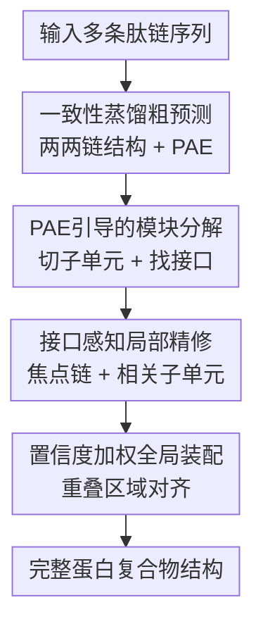

# Efficient Prediction of Large Protein Complexes via Subunit-Guided Hierarchical Refinement

**会议**: ICLR 2026  
**OpenReview**: [https://openreview.net/forum?id=0G8Cq9z2Hp](https://openreview.net/forum?id=0G8Cq9z2Hp)  
**代码**: https://github.com/Luchixiang/HierAFold  
**领域**: 计算生物学 / 蛋白复合物结构预测  
**关键词**: 蛋白复合物预测, AlphaFold3, PAE, 子单元分解, 大规模结构装配  

## 一句话总结
HIERAFOLD 用 PAE 从粗粒度两两预测中自动切出刚性子单元和跨链接口，再只对“焦点链 + 相关接口子单元”做高精度精修，最后用置信度加权对齐装配，从而在接近 AlphaFold3 准确率的同时把大蛋白复合物的峰值显存压到可运行范围。

## 研究背景与动机
**领域现状**：AlphaFold2/AlphaFold3 系列已经把单体蛋白、多链蛋白复合物乃至蛋白-配体结构预测推到很高精度。
这类模型通常把残基、核苷酸或配体原子表示成 token，再通过 pair representation、triangle update、attention 和扩散采样推断三维结构。
在中小规模复合物上，端到端地把所有链一起送进模型是最直接也最可靠的做法，因为模型能同时看到所有跨链相互作用。

**现有痛点**：问题出在“很大”的复合物上。
AlphaFold3/Protenix 这类模型的关键模块对 token 数有近似二次显存开销，几千 token 后显存迅速失控。
论文里提到，约 4,500 token 的复合物可能需要 80GB GPU 显存；在 5,000 token 以上的大复合物集合上，端到端 AlphaFold3 baseline 直接 OOM。
已有的替代方案常把复合物拆成 pair/triple，再用 MCTS 或组合装配拼回整体，但这种“只看两两关系再拼图”的策略容易漏掉多链协同：一个接口在 pair 里看起来合理，放到完整复合物里却可能方向错、闭合不了，或者被第三条链改变构象。

**核心矛盾**：大复合物预测同时需要两件事：一方面不能把所有 token 端到端放进模型，否则显存爆炸；另一方面又不能只做孤立两两预测，否则缺少多体上下文。
真正要保留的上下文不是整个复合物，而是每条链周围会影响其构象和装配的少数接口区域。
也就是说，问题不是“拆不拆”，而是“怎样自动拆到足够小，同时不丢关键接口”。

**本文目标**：作者希望构建一个自动化的大蛋白复合物预测流程。
它需要先从粗预测中识别每条链内部相对刚性的结构子单元，再找出哪些外部子单元可能和当前链形成可靠接口；随后用完整的 AlphaFold3-style 模型只在这个局部上下文里精修；最后把多个局部高置信预测对齐成完整复合物。
目标不是训练一个完全替代 AlphaFold3 的新端到端模型，而是把已有强预测器包装成更可扩展的分层推理系统。

**切入角度**：关键观察来自 PAE（Predicted Aligned Error）。
低 PAE 的对角块通常意味着一段链内部相对刚性、可作为结构子单元；跨链的低 PAE 离对角块则常对应模型对相对位置有信心的接口区域。
因此，PAE 不只是置信度输出，还能当作“哪里该拆、哪里该保留上下文”的结构线索。

**核心 idea**：用 PAE 引导的子单元分解，把大复合物预测改写成多次“焦点链 + 稀疏接口子单元”的局部精修，再用置信度加权装配恢复全局结构。

## 方法详解

### 整体框架
HIERAFOLD 的输入是一组肽链序列，输出是完整蛋白复合物的三维结构。
它先对所有链对做快速粗预测，得到两两结构和 PAE；然后从 PAE 中切出链内刚性子单元并筛选跨链接口子单元；接着对每条焦点链分别执行一次高精度局部精修；最后把这些部分重叠的结构预测装配到同一个坐标系里。

这张图里的四个中间节点就是论文的核心贡献。
“一致性蒸馏粗预测”解决全链对粗筛太慢的问题；“PAE引导的模块分解”决定哪些结构片段值得保留；“接口感知局部精修”负责在显存可控的局部上下文中恢复多体协同；“置信度加权全局装配”则把多个局部坐标系合并成一个全局模型。

### 关键设计
**1. 一致性蒸馏粗预测：用少步扩散为全对链组合提供便宜的结构先验**

如果直接用完整 AlphaFold3-style 模型为所有链对做粗预测，复杂度会随着链数变成大量两两推理，而且每次推理还要跑昂贵的扩散过程。
HIERAFOLD 的第一步只是为了拿到足够可用的两类先验：链对的粗坐标 $X_{ij}$ 和对应 PAE 矩阵 $P_{ij}$。
因此作者训练了一个 consistency-distilled 结构预测器，用更浅的 Pairformer（12 个 token-level transformer blocks，而不是 24 个）和少步扩散替代完整采样。

这个蒸馏模型学习在不同噪声时间步上给出自洽的结构输出。
论文把目标写成相邻时间步之间的 consistency loss：

$$
L_{con}=\mathbb{E}\left[d\left(f_\theta(x_{t_{n+1}}, t_{n+1}, c), f_{\theta^-}(\hat{x}_{t_n}, t_n, c)\right)\right]
$$

其中 $c$ 是 Pairformer 提取的条件特征，$\theta^-$ 是 EMA target model，$\hat{x}_{t_n}$ 是从 $x_{t_{n+1}}$ 沿 ODE 回退一步得到的估计。
推理时，粗阶段只跑两步 refinement，每个链对生成 5 个随机样本，并用 ipTM、pTM 和 clash penalty 的组合分数选出 top-ranked 样本。
这样做的意义很具体：粗阶段不追求最终结构精度，而是以低延迟提供“哪些区域相对刚、哪些链段可能相互作用”的信号，后面的精修再用完整模型补回精度。

**2. PAE引导的模块分解：用低误差块同时切出刚性子单元和跨链接口**

大蛋白复合物并不是一团不可拆的残基云。
一条链内部常由多个相对稳定的结构域或功能模块组成，跨链相互作用也通常集中在少数接口区域。
HIERAFOLD 利用 PAE 的两个形态特征来自动发现这种模块性：链内低 PAE 对角块对应相对刚性的子单元，跨链低 PAE 离对角块对应模型有信心的接口。

对一条长度为 $L$ 的链，作者从 pairwise PAE 里取出链内矩阵 $P_{ii}$，再用递归 top-down partitioning 切分区间。
对任意候选片段 $[i,j)$，算法枚举切点 $k$，计算切开后两个子片段之间的平均互相 PAE：

$$
P_{inter}(k)=\frac{1}{2}\left(
\frac{\sum_{u=i}^{k-1}\sum_{v=k}^{j-1} P_{uv}}{(k-i)(j-k)}+
\frac{\sum_{u=k}^{j-1}\sum_{v=i}^{k-1} P_{uv}}{(j-k)(k-i)}
\right)
$$

直觉是：如果两个候选子片段之间的相对位置不稳定，跨块 PAE 会高，说明它们更像两个可分开的结构单元。
当最大 $P_{inter}(k)$ 超过阈值 $\tau_{split}$，并且两边长度都大于 $L_{min}$ 时，算法接受这个切分并继续递归。
实验默认 $\tau_{split}=10.0$，$L_{min}=20$。

切完链内子单元后，方法再为每条焦点链 $C_a$ 选择来自其他链的邻域子单元 $N(C_a)$。
一个外部子单元 $U_{b,j}$ 会被选入上下文，如果它与 $C_a$ 的 mean interface PAE 足够低，或者在粗预测坐标中与 $C_a$ 的最小中心原子距离足够近。
默认阈值是 $\bar{P}(C_a,U_{b,j})<\tau_p=5.0$ 或 $d_{min}(C_a,U_{b,j})<\tau_d=20\ \text{Å}$。
这里 PAE 和距离不是重复信号：PAE 表示模型对相对位置有多相信，距离表示粗结构里是否真的靠近；两者合用比只看其中一个更稳。

**3. 接口感知局部精修：只把焦点链和相关接口送进完整模型以保留多体上下文**

传统 divide-and-conquer 方法常预测所有 pairwise interaction，再把 pair 拼成整体。
它的问题是每个 pair 只见到两条链，无法表达“第三条链改变接口构象”或“多个子单元共同稳定一个局部构象”的多体效应。
HIERAFOLD 的精修阶段不是孤立 pair 预测，而是对每条焦点链 $C_a$ 构造组合输入 $C_a \cup N(C_a)$：完整保留焦点链，同时只加入其他链上被筛出的相关接口子单元。

这个局部输入比全复合物小得多，所以可以运行完整 AlphaFold3-style inference；但它又比 pairwise docking 更有上下文，因为同一焦点链周围的多个潜在接口会一起出现。
最终每条链都会得到一个高分辨率、部分重叠的局部预测 $\hat{X}_a$。
这些预测各自处在不同坐标系里，但每个预测都包含焦点链及其部分外部接口，因此后续装配有足够重叠区域可用。
这一步是 HIERAFOLD 相比 CombFold 类方法的关键区别：它不是先独立预测 pair 再组合，而是在显存允许的局部范围内显式让多个接口共同参与精修。

**4. 置信度加权全局装配：用可靠重叠区域决定局部结构如何拼回全局**

精修结束后，模型有 $M$ 个局部结构预测，每个预测都可信但坐标系不同。
如果直接用普通 Kabsch 对所有重叠原子做刚体对齐，柔性 loop、IDR 或低置信片段可能把整体变换拉偏。
HIERAFOLD 因此使用 confidence-weighted Kabsch：先选择最高置信的局部预测作为全局装配起点，再逐个把剩余 $\hat{X}_a$ 对齐到当前全局结构。

对重叠原子集合中的第 $k$ 个原子，权重设为两边 pLDDT 的乘积：

$$
w_k = pLDDT(x_{a,k})\cdot pLDDT(x_{global,k})
$$

然后求解加权 RMSD 最小的旋转 $R$ 和平移 $t$：

$$
\arg\min_{R,t}\sum_{k\in overlap}w_k\left\|(Rx_{a,k}+t)-x_{global,k}\right\|^2
$$

这个设计尤其适合大复合物，因为大复合物里常有柔性区域和局部不确定性。
高 pLDDT 的接口和稳定结构域会主导对齐，低置信的无序片段则被自然降权。
论文在 IDR 分析里也解释了这一点：IDR 往往会被 PAE 分割成单独子单元，真正参与结合时仍会因跨链低 PAE 被选入精修，而装配时又因低 pLDDT 不会过度影响全局刚体变换。

### 一个完整示例
假设一个复合物有 5 条链，总长超过 5,000 token，端到端 Protenix/AlphaFold3 在 80GB A100 上会 OOM。
HIERAFOLD 首先对所有链对做快速粗预测，拿到每对链的 PAE 和坐标。
其中链 $C_3$ 的链内 PAE 出现两个低 PAE 对角块，中间跨块 PAE 很高，于是被切成两个子单元；链 $C_4$ 的某个子单元和 $C_1$ 之间出现低 PAE 离对角块，并且粗坐标距离小于 $20\ \text{Å}$，因此被认为是 $C_1$ 的候选接口子单元。

轮到精修 $C_1$ 时，完整输入不是 5 条链全放进去，而是 $C_1$ 加上来自 $C_2,C_3,C_4,C_5$ 的少数接口子单元。
这样 token 数可能从 5,000+ 降到一条焦点链加几个局部片段，完整 AlphaFold3-style 模型可以正常运行。
轮到 $C_2$、$C_3$ 等链时，系统重复同样流程，得到多个互相重叠的局部结构。
最后，装配阶段从最高置信局部结构出发，用重叠接口上 pLDDT 高的原子估计刚体变换，把各条焦点链逐步放回同一个全局坐标系。

这个例子说明 HIERAFOLD 的“层级”不是简单裁剪输入，而是先用 PAE 找出哪些裁剪不会破坏接口信息，再让完整模型在这些局部上下文中做高质量推理。

### 损失函数 / 训练策略
训练只发生在粗阶段的一致性蒸馏模型上；高精度精修阶段使用 Protenix v0.5.0 作为 AlphaFold3-style backbone。
蒸馏模型把 token-level transformer block 从 24 层减到 12 层，atom-level transformer stack 保持不变。
训练使用 Adam，学习率 $1\times10^{-5}$，2,000 step linear warmup，$\beta_1=0.9$，$\beta_2=0.95$，weight decay 为 $1\times10^{-8}$。
训练数据来自 Protenix 预处理复合物数据集，序列裁剪到最多 512 token 以适配显存。

推理时，粗阶段对每个链对生成 5 个随机样本，只跑两步 iterative refinement，并按 ipTM、pTM 和 clash penalty 的组合分数选出一个粗预测。
短链（少于 40 token）不再细分而是始终保留；小分子配体的所有原子始终保留，并与每条焦点链及其选择子单元独立 docking，最终用平均 atom pLDDT 选择配体姿态。
如果某个链对的最大 ipTM 低于 0.2，说明粗预测交互不可靠，该 partner chain 会从焦点链上下文中整体排除。

## 实验关键数据

### 主实验
论文用 Protenix v0.5.0 作为 AlphaFold3 的开源复现 baseline。
蛋白-蛋白接口使用 DockQ success rate（DockQ $>0.23$），蛋白-配体用 ligand RMSD $\le 2\ \text{Å}$ success rate，同时报告 Oracle 和 Top-1。
最关键的结果是：HIERAFOLD 在标准 recent PDB 和 PoseBuster v2 上几乎保持 AlphaFold3 baseline 的准确率，而在 5,000 token 以上的大复合物上突破 OOM，并显著优于 CombFold。

| 数据集 | 指标 | HIERAFOLD | AlphaFold3 baseline | 关键对比 |
|--------|------|-----------|---------------------|----------|
| Recent PDB | DockQ Oracle success | 73.1% | 74.4% | 几乎不牺牲标准规模准确率 |
| Recent PDB | DockQ Top-1 success | 69.0% | 70.4% | Top-1 只低 1.4 个百分点 |
| PoseBuster v2 | Ligand RMSD $\le 2\ \text{Å}$ Oracle | 77.4% | 78.6% | 配体精细相互作用基本保留 |
| PoseBuster v2 | Ligand RMSD $\le 2\ \text{Å}$ Top-1 | 74.7% | 76.0% | 小分子处理策略有效 |
| Large Complexes $>5k$ tokens | DockQ Oracle success | 44.5% | OOM | baseline 无法运行 |
| Large Complexes $>5k$ tokens | DockQ Top-1 success | 43.9% | OOM | 相比 CombFold+AF3 的 19.8% 明显更强 |

与 CombFold 的差距说明了方法设计的重点。
在 Recent PDB 上，CombFold+AF3 即使用同一个强预测引擎，Top-1 也只有 43.2%，远低于 HIERAFOLD 的 69.0%。
这表明性能提升不是来自 backbone 模型更强，而是来自“局部多接口一起精修”比“pairwise 预测后组合装配”更能保留多链协同。

| 组件 / 数据切片 | 指标 | 结果 | 说明 |
|----------------|------|------|------|
| CombFold+AF3 on Recent PDB | Top-1 DockQ success | 43.2% | 同用 AF3-style engine，但缺少局部多体精修 |
| HIERAFOLD on Recent PDB | Top-1 DockQ success | 69.0% | 接近端到端 baseline |
| CombFold+AF3 on Large Complexes | Top-1 DockQ success | 19.8% | 大复合物上 pairwise assembly 更吃亏 |
| HIERAFOLD on Large Complexes | Top-1 DockQ success | 43.9% | 显存可控且保留关键接口上下文 |
| Benchmark 2 from CombFold | Top-1 DockQ success | 50.7% vs 30.2% | HIERAFOLD 高于 CombFold |

### 消融实验
消融显示，HIERAFOLD 的几个环节都不是装饰性组件。
完整扩散模型做粗预测只带来很小准确率增益，却把平均时间从 46 分钟拉到 125 分钟；只用 PAE 或只用距离筛接口都会掉点；去掉 pLDDT 加权装配也会明显降低 Top-1。

| 配置 | Oracle / Top-1 | 平均时间 | 说明 |
|------|----------------|----------|------|
| HIERAFOLD full | 73.1% / 69.0% | 46 min | 默认完整方法 |
| 粗阶段用完整扩散模型 | 73.3% / 69.4% | 125 min | 准确率只小幅提升，耗时约 3 倍 |
| 粗阶段 mini-rollout 20 steps | 71.0% / 68.2% | 52 min | 粗构象不够好会影响最终结果 |
| $\tau_{split}=0$ residue-level | 72.0% / 67.8% | 45 min | 过细切分破坏结构连贯性 |
| PAE-only selection | 71.0% / 66.9% | 46 min | 只看相对置信不如 PAE+距离 |
| Distance-only selection | 70.4% / 66.3% | 46 min | 只看粗坐标距离更不稳 |
| fine stage 使用蒸馏模型 | 69.3% / 64.9% | 15 min | 速度快但高精度精修质量不足 |
| unweighted assembly | 71.0% / 66.5% | 45 min | 不按 pLDDT 加权会被低置信片段干扰 |

论文还分析了 PAE 分割阈值的敏感性。
$\tau_{split}=5,15,20$ 时 Top-1 基本在 68.9% 到 69.1% 附近，说明方法对合理阈值不太敏感。
但 $\tau_{split}=0$ 的 residue-level 过细分割会掉到 67.8%，支持作者的判断：HIERAFOLD 需要的是结构上协同移动的子单元，不是越碎越好。

### 关键发现
- HIERAFOLD 的最大价值不是在标准规模上超过 AlphaFold3，而是在几乎保持标准规模准确率的同时，把大复合物从 OOM 变成可运行。
  论文报告大 token 数时峰值显存可节省约 40%，4,000 token 目标上约减少 25GB。

- PAE 是比传统 domain segmentation 更适配该任务的信号。
  Merizo 在 CATH domain parsing 上 IoU 更高，但换成 Merizo 分割并不会带来更好结构预测；PAE 分割虽然不追求进化域定义，却更贴合“刚性子单元 + 接口上下文”的下游需求。

- IDR 场景没有被层级分解额外放大问题。
  随着 interface disorder score 从 low 到 high，AlphaFold3 和 HIERAFOLD 的 DockQ 都下降；HIERAFOLD 的下降模式接近 baseline，说明分割、选择和装配没有引入新的 IDR 脆弱性。

| Interface IDR score | AlphaFold3 mean DockQ | HIERAFOLD mean DockQ | 解释 |
|---------------------|-----------------------|----------------------|------|
| Low (0.1-0.25) | 0.55 | 0.52 | 低无序接口上两者都较稳 |
| Medium (0.25-0.5) | 0.49 | 0.44 | 无序增强后两者下降 |
| High ($>0.5$) | 0.46 | 0.41 | 高柔性接口本身更难预测 |

- 规模越大，HIERAFOLD 相对 CombFold 的优势越稳定。
  在 recent PDB 按 token 数分 bin 后，HIERAFOLD 相比 CombFold 的成功率优势从 0-1,000 token 的 +13.4% 增长到 3,000-4,000 token 的 +23.9%，在 $>4,000$ token 仍有 +23.1%。

## 亮点与洞察
- 最巧妙的地方是把 PAE 从“置信度可视化”变成了“推理调度信号”。
  论文没有额外训练一个复杂 domain parser，而是复用粗预测天然产生的 PAE，直接决定子单元边界和跨链接口，成本很低且和下游精修目标一致。

- HIERAFOLD 对 divide-and-conquer 的修正很有启发。
  它不是简单把大问题拆小，而是让每个小问题仍然保留足够多体上下文：焦点链看到多个相关接口子单元，因此比 pairwise assembly 更不容易漏掉高阶耦合。

- confidence-weighted assembly 是一个朴素但有效的工程细节。
  大复合物装配里低置信柔性区域很多，普通刚体对齐会被这些区域污染；用两边 pLDDT 乘积做权重，本质上是在问“哪些重叠原子最值得相信”。

- 这套思想可以迁移到其他“大对象 + 局部交互稀疏”的结构预测任务。
  例如 RNA-蛋白复合物、多蛋白-配体体系、甚至某些材料/分子组装问题，都可能用粗预测置信图先筛局部交互，再局部精修和全局装配。

## 局限与展望
- HIERAFOLD 用时间换显存。
  它需要对链对做粗预测，并对每条焦点链分别跑 fine-stage refinement；虽然每次输入更小，但总推理次数变多。
  论文报告 4,000 token 时 AlphaFold3 baseline 约 74 分钟，HIERAFOLD 约 98 分钟；5,000 token 时 baseline OOM，而 HIERAFOLD 约 170 分钟。

- 方法上限受 backbone 预测器限制。
  HIERAFOLD 不是重新学习物理规律的模型，而是包装 AlphaFold3/Protenix 这类 predictor。
  对 AlphaFold-family 本身难处理的多状态构象、抗体相关复杂接口、超长链训练分布外问题，它也会继承相当一部分困难。

- 大复合物数据集上的绝对准确率仍不高。
  虽然 Top-1 43.9% 已远高于 CombFold+AF3 的 19.8%，但相比 Recent PDB 的 69.0% 仍有明显差距。
  作者指出该集合含有更高比例蛋白-抗体相互作用，并且链长远超训练时 768 token crop，未来可能需要针对大复合物更长 crop 或专门 finetuning。

- 多状态装配仍是明显短板。
  论文给出的 apo/holo 例子显示，HIERAFOLD 可能像 AlphaFold3 一样把本应开放的 apo 状态也预测成闭合状态。
  后续可以结合 AlphaFold-family 的 multi-state prediction 技术，例如 MSA clustering、状态约束或多构象采样，让层级流程不只输出一个默认构象。

## 相关工作与启发
- **vs AlphaFold3 / Protenix**: AlphaFold3-style 模型端到端看完整复合物，准确率高但显存随 token 数快速增长。
  HIERAFOLD 保留其高精度精修能力，但只在焦点链与相关接口子单元上运行，因此牺牲少量标准规模准确率来换取大复合物可扩展性。

- **vs CombFold**: CombFold 也走分而治之路线，但主要依赖 pairwise 子复合物预测和组合装配。
  HIERAFOLD 的区别是用 PAE 选出接口子单元，并在 fine stage 让多个接口共同进入同一次 AlphaFold3-style 推理，因此更能表达多链协同。

- **vs MoLPC**: MoLPC 通过 pair/triple 预测和 Monte Carlo Tree Search 装配大复合物，更依赖准确的对称性、化学计量和搜索过程。
  HIERAFOLD 更像一个由 PAE 自动调度的局部精修系统，不需要专家预先定义子单元，也不把主要压力放在全局组合搜索上。

- **vs Merizo / CATH / ECOD 等 domain segmentation**: 传统 domain 工具关注进化域或结构域边界，可能需要额外推理或数据库信息。
  HIERAFOLD 的 PAE 分割不一定最符合生物学 domain 注释，但它更关注“哪些片段作为刚性模块参与当前复合物装配”，因此更服务于预测任务本身。

## 评分
- 新颖性: ⭐⭐⭐⭐☆ 把 PAE 用作层级推理调度信号并不复杂，但和大复合物显存瓶颈结合得很精准。
- 实验充分度: ⭐⭐⭐⭐☆ 覆盖 Recent PDB、PoseBuster v2、大复合物、IDR、显存、时间和多项消融；若能有更多真实超大复合物案例会更强。
- 写作质量: ⭐⭐⭐⭐☆ 论文主线清楚，方法和实验对齐较好，但部分 implementation 叙述有小的排版/术语瑕疵。
- 价值: ⭐⭐⭐⭐⭐ 对需要预测 5,000 token 以上蛋白复合物的用户很实用，是一种能直接包裹现有强模型的工程化扩展路线。

<!-- RELATED:START -->

## 相关论文

- [\[ICLR 2026\] DCFold: Efficient Protein Structure Generation with Single Forward Pass](dcfold_efficient_protein_structure_generation_with_single_forward_pass.md)
- [\[ICLR 2026\] FragFM: Hierarchical Framework for Efficient Molecule Generation via Fragment-Level Discrete Flow Matching](fragfm_hierarchical_framework_for_efficient_molecule_generation_via_fragment-lev.md)
- [\[ICLR 2026\] Convex Efficient Coding](convex_efficient_coding.md)
- [\[CVPR 2026\] HyperST: Hierarchical Hyperbolic Learning for Spatial Transcriptomics Prediction](../../CVPR2026/computational_biology/hyperst_hierarchical_hyperbolic_learning_for_spatial_transcriptomics_prediction.md)
- [\[ICLR 2026\] Learning Brain Representation with Hierarchical Visual Embeddings](learning_brain_representation_with_hierarchical_visual_embeddings.md)

<!-- RELATED:END -->
