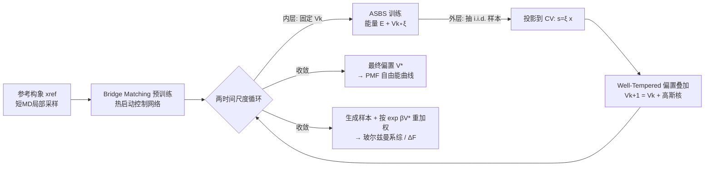

# Enhancing Diffusion-Based Sampling with Molecular Collective Variables

**会议**: ICLR 2026  
**OpenReview**: [https://openreview.net/forum?id=1bJN1EQByS](https://openreview.net/forum?id=1bJN1EQByS)  
**代码**: 待确认  
**领域**: 计算生物 / 分子模拟 / 扩散采样器  
**关键词**: 玻尔兹曼生成器, 扩散采样器, 增强采样, 集体变量, well-tempered metadynamics, 自由能, Schrödinger Bridge  

## 一句话总结
把分子动力学里的"well-tempered metadynamics"沿集体变量（CV）施加在线排斥偏置的思想，嫁接到 state-of-the-art 的扩散采样器 ASBS 上，得到 WT-ASBS：训练中沿低维 CV 持续累积偏置逼出稀有构象、推理时按偏置重加权恢复玻尔兹曼分布，首次用扩散采样器以远低于 metadynamics 的墙钟时间采样了带键断裂/形成的反应能面。

## 研究背景与动机
**领域现状**：从玻尔兹曼分布 $\nu(x)\propto\exp(-\beta E(x))$ 采样是统计力学模拟的核心，传统靠分子动力学（MD）/ MCMC 沿时间推进，但高能垒分隔的构象之间转移极慢，要捕捉一次构象变化或化学反应往往需要海量串行能量评估。机器学习的"玻尔兹曼生成器"（早期归一化流、近期扩散采样器如 ASBS）想绕开动力学，仅用能量/对数密度直接抽 i.i.d. 样本。

**现有痛点**：扩散采样器虽能把采样成本摊销到多次抽样，但相比 MD 并不能从根本上减少所需能量评估数，而且有一个臭名昭著的"模式坍缩"问题——训练和采样都集中在高概率盆地，系统性低估那些罕见却热力学关键的态。更糟的是，可靠的自由能和系综平均严格依赖给罕见构象赋予正确（可能指数级小）的权重，所以**既要够到低占据模式，又要给它们正确的玻尔兹曼权重**，两者缺一不可。基线 ASBS 在丙氨酸二肽上就因为 mode-seeking 而漏掉了占据率低的模式。

**核心矛盾**：扩散采样器天然 mode-seeking、爱往主盆地跑，但分子科学要的恰恰是稀有态的发现 + 统计正确的重加权，二者直接冲突。

**本文目标**：给扩散采样器装一个"鼓励探索 + 可精确重加权"的机制，让它在直角坐标下也能采到完整构象空间和反应能面，并且比 MD 增强采样更快。

**核心 idea（加偏置 + 重加权）**：受增强采样启发，沿一组信息量大的低维 CV（如骨架二面角、键长）维护一个**在线排斥势**——访问越多的 CV 区域累积越高的偏置、抬高其有效能量、把后续样本推向新区域，等价于在投影空间升高温度；推理时用偏置的重要性权重把这个偏置精确扣掉，从而既扩大探索又保证系综估计无偏。

## 方法详解

### 整体框架
WT-ASBS（Well-Tempered Adjoint Schrödinger Bridge Sampler）= ASBS 扩散采样器 + well-tempered metadynamics 的在线偏置。它用两时间尺度交替进行：内层固定当前偏置 $V_k$ 把 ASBS 训到收敛（让 $t=1$ 的边缘分布等于带偏置的目标 $\nu_{V_k}$），外层从训好的采样器抽一批 i.i.d. 样本、投影到 CV 空间、按 well-tempered 规则往偏置上叠加高斯核。整个流程再配上"局部预训练热启动 + 约束势限定可达域 + 重加权/精修恢复玻尔兹曼系综"三个工程配方落地到真实分子系统。

### 关键设计

**1. CV 空间上的 well-tempered 偏置：把"升温"精确锁定在慢坐标上。** 方法的物理内核来自 Barducci 等人的 well-tempered metadynamics。CV 是原子坐标的低维函数 $\xi:\mathcal{X}\to\mathcal{S}\subset\mathbb{R}^m$（$m\ll n$），只编码慢、化学相关的运动（如二面角 $\phi,\psi$、键长）。在 CV 上加偏置 $V(s)$ 得到采样密度 $\nu_V(x)\propto\exp[-\beta E(x)-\beta V(\xi(x))]$，对应重要性权重 $w(x)\propto\exp[+\beta V(\xi(x))]$。给定偏置因子 $\gamma>1$，well-tempered 偏置取 $V_{WT}(s)=-(1-\frac1\gamma)F(s)$，其中 $F(s)=-\frac1\beta\log\bar\nu(s)$ 是沿 CV 的平均力势（PMF）。代入后 CV 边缘满足 $\bar\nu_{WT}(s)\propto[\bar\nu(s)]^{1/\gamma}$——即 CV 方向像处在更高有效温度 $T_{\text{eff}}=\gamma T$，而**正交方向的条件分布完全不变**。这就同时满足了"局部高效"（Requirement 3）和"只沿慢坐标加热、不破坏其他自由度"。

**2. 两时间尺度在线偏置叠加，带收敛保证。** 偏置不是预先知道的，而是训练中靠堆叠高斯核 on-the-fly 构造。外层每步从当前采样器抽 i.i.d. 批 $\{X_{1,k}^{(i)}\}$、投到 CV 得 $s_k^{(i)}$，按
$$V_{k+1}(s)=V_k(s)+h\sum_{i=1}^N \exp\!\Big(-\tfrac{\beta}{\gamma-1}V_k(s_k^{(i)})\Big)K_\sigma(s,s_k^{(i)})$$
叠加，其中 $K_\sigma(s,s')=\exp(-\|s-s'\|^2/2\sigma^2)$ 是高斯核、$h$ 是固定高度。已访问区域偏置越高、新叠加的高度越被压低，自动"填平"自由能盆地。论文给出 Proposition 3.1：随训练进行 $V_k$ 几乎必然收敛到 $V^*(s)=-(1-\frac1\gamma)F(s)+\text{const}$，因而采样分布收敛到 well-tempered 目标。一个直接红利（Remark 3.1）是**最终偏置本身就是 PMF**：$F(s)=-\frac{\gamma}{\gamma-1}V^*(s)+\text{const}$，免费拿到自由能曲线。相比 MD 增强采样，扩散采样器每步给的是去相关的 i.i.d. 样本、无需等待退相关就能沉积偏置，所以可以用更小的 $\gamma$、更小的 $h$、更频繁地加偏置，混合更快。

**3. 三件套工程配方让它真能跑分子系统。** 纯算法之外，论文给了落地三要素。其一是**局部预训练热启动**：虽然 ASBS 原则上不需要数据，但在参考构象附近跑短 MD 拿到无能垒区域的样本、用 bridge matching 初始化控制网络，这一步精度无所谓（可用经典力场/快设置/代理模型省算力），却能显著加速后续训练。其二是**约束势限定可达域 $\mathcal{A}$**（Requirement 1）：采样只应停留在与参考构象动力学连通的构象上，论文用化学同分异构的视角形式化——例如对每个 $C_\alpha$ 手性中心施加 flat-bottom 谐振势在 improper torsion 上，把采样压向天然的 L-构型，避免能量函数无法区分的镜像构型污染系综。其三是**采样与精修**：可直接从 $V^*$ 读出 PMF，或积分 SDE 生成样本并赋权 $W_i=\exp[\beta V^*(\xi(X_i))]$ 得到自归一化估计；若采样器不完美，还能从生成样本出发在偏置能面 $E+V^*\circ\xi$ 上跑短 MD/MCMC 再重加权，恢复渐近正确性同时保持高效。

## 实验关键数据
四个分子采样任务：两个肽（丙氨酸二肽 Ala2、四肽 Ala4，经典力场+隐式水）+ 两个化学反应（SN2、过渡态后分叉的环加成，用 uMLIP UMA-S-1.1 提供近 DFT 能量）。主要对手是基线 ASBS 和 MD 增强采样的 WTMetaD。评估核心是看重加权样本/偏置导出的 PMF 与参考密度是否一致。

### 主实验

| 任务 | 结果 |
|------|------|
| **Ala2（$\phi,\psi$ 为 CV）** | 偏置逐步把采样从高占据态推到低占据态；偏置导出 PMF 与重加权样本 PMF 都与长程参考 MD 高度吻合；基线 ASBS 在低占据区**直接失败**；相同偏置因子下 WT-ASBS 的两态 $\Delta F$ 收敛比 WTMetaD 更准 |
| **Ala4（$\phi_1,\phi_2,\phi_3$ 为 CV，8 个模式）** | 仅从 1 个模式预训练，WT-ASBS 在训练早期就发现全部 8 个模式，比 WTMetaD 探索快得多；8 态自由能 MAE 收敛进化学精度（1 kcal/mol） |
| **SN2 反应** | 2-D PMF 沿两 C–Cl 键长对称、与 WTMetaD 一致；TS 位置与能垒和鞍点优化结果一致 |
| **环加成（TS 后分叉）** | 用接触 CV 构造 $s_1=c_1+c_2+c_3$（键形成进度）与 $s_2=c_2-c_3$（区分两产物），1-D/2-D PMF 与 WTMetaD 吻合，成功解析分叉的两条产物通道 |

### 计算效率（四块 A100 80GB，墙钟时间 vs 收敛）

| 反应 | WT-ASBS | WTMetaD |
|------|---------|---------|
| SN2 | 0.77M 能量评估 / **4.3 小时** | 4.0M / 29 小时 |
| TS 后分叉 | 2.6M 能量评估 / **23 小时** | 6.4M / 48 小时 |

### 关键发现
- WT-ASBS 在**跨大能垒、发现稀有模式**上明显占优（i.i.d. 样本能同时朝多个构象变化方向探索，而 MD 只能按时间顺序逐个穿越）。
- 但在 Ala4 上自由能 MAE **并不优于** WTMetaD——一旦穿过 CV 上的能垒，MD 的盆地内局部混合很高效，而扩散采样器要学完整高维盆地内分布。作者由此建议"全局扩散移动 + 局部 MD 混合"组合用于复杂系统。
- 消融：在很宽范围改 $h,\sigma,\gamma$ 最终 $\Delta F$ 几乎不变（只有极端 $h$ 例外），更大 $h$/更宽 $\sigma$ 主要加速早期探索；过于频繁刷新 replay buffer 反而拖慢收敛。
- 还验证了可用自动学习的 ML CV 替代手工 CV，重加权后仍能恢复准确 PMF/$\Delta F$。

## 亮点与洞察
- **跨社区嫁接得很干净**：把分子模拟成熟的 well-tempered metadynamics 几乎"原样"接到扩散采样器上，而且证明了收敛性（偏置 → $-(1-1/\gamma)F$），让"自由能曲线 = 最终偏置"这一免费红利成立。
- **第一个用扩散采样器采反应能面**：捕捉键断裂/形成、解析 TS 后分叉，且墙钟时间只有 WTMetaD 的零头，这是把神经采样器推向真实化学应用的实质一步。
- **诚实地指出自己不是处处赢**：明确承认盆地内精修上 MD 仍更强，给出"全局 diffusion + 局部 MD"的混合路线，比一味宣称 SOTA 更有说服力。
- **i.i.d. 采样改变了偏置沉积节奏**：因为无需等退相关，可用更小 $\gamma$、更小 $h$、更密集沉积，这是扩散采样器相对 MD 增强采样的结构性优势点睛。

## 局限与展望
- 盆地内自由能精度受限于扩散采样器要学完整高维分布，复杂系统可能仍需配合局部 MD 精修（作者已建议混合策略）。
- 仍依赖人为选/学习一组好的低维 CV；CV 选不好会限制可探索的方向（虽然展示了可用 ML CV，但学 CV 本身也有门槛）。
- 约束势把采样限定在与参考构象连通的可达域 $\mathcal{A}$，跨更长时间尺度的键重组（小时到天级）不在覆盖范围内。
- 重加权权重 $\exp[\beta V^*(\xi(x))]$ 在采样器不完美时可能高方差；展望里提到可推广到离散格点/动态贝叶斯网络等低维隐变量场景。

## 相关工作与启发
- 上游基座是 **ASBS（Liu et al., 2025）**——把玻尔兹曼采样建成源分布到目标的 Schrödinger Bridge，用 Adjoint Matching + Corrector Matching 避免对 SDE 反传、保持可扩展性，但 mode-seeking 漏稀有模式正是本文要补的短板。
- 增强采样侧承接 **well-tempered metadynamics（Barducci et al., 2008）** 与变分偏置（Valsson & Parrinello 2014），把"沿 CV 升温 + 重加权"的统计力学传统嫁接到生成模型。
- 与数据驱动的构象/蛋白/晶体生成模型（如 torsional diffusion、RFdiffusion）形成互补：那些做"模式探索"（不带玻尔兹曼权重），本文强调统计正确的加权采样。
- 启发：神经采样器与经典 rare-event 技术并非互斥，"全局测度传输移动 + 局部物理动力学"的混合范式可能是复杂分子系统的实际最优解；其"在线偏置可同时给探索和免费自由能"的结构也值得迁移到其他高维稀有事件采样问题。

## 评分
- **新颖性**: ⭐⭐⭐⭐ — well-tempered 偏置嫁接扩散采样器并配收敛证明，外加首次用扩散采样器采反应能面，跨社区贡献清晰。
- **实验充分度**: ⭐⭐⭐⭐ — 二肽/四肽 + 两类反应共四任务，主实验 + 效率对比 + 消融 + ML CV 验证齐全，还诚实报告了不占优的场景。
- **写作质量**: ⭐⭐⭐⭐ — 把三条采样需求（受限支撑/一致性/局部高效）作为主线串起方法与实验，逻辑严密；公式与物理直觉解释到位。
- **价值**: ⭐⭐⭐⭐ — 把扩散采样器从"比 MD 慢的玩具"推到能以更短墙钟时间解反应能面的实用工具，对计算化学/分子模拟有现实意义。

<!-- RELATED:START -->

## 相关论文

- [\[ICLR 2026\] Learning Collective Variables from BioEmu with Time-Lagged Generation](learning_collective_variables_from_bioemu_with_time-lagged_generation.md)
- [\[ICLR 2026\] Enhancing Molecular Property Predictions by Learning from Bond Modelling and Interactions](enhancing_molecular_property_predictions_by_learning_from_bond_modelling_and_int.md)
- [\[ICLR 2026\] Graph Diffusion Transformers are In-Context Molecular Designers](graph_diffusion_transformers_are_in-context_molecular_designers.md)
- [\[ICLR 2026\] Learning Flexible Forward Trajectories for Masked Molecular Diffusion](learning_flexible_forward_trajectories_for_masked_molecular_diffusion.md)
- [\[ICLR 2026\] SigmaDock: Untwisting Molecular Docking with Fragment-Based SE(3) Diffusion](sigmadock_untwisting_molecular_docking_with_fragment-based_se3_diffusion.md)

<!-- RELATED:END -->
