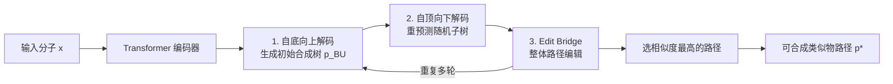

# Exploring Synthesizable Chemical Space with Iterative Pathway Refinements

**会议**: ICLR 2026  
**OpenReview**: [https://openreview.net/forum?id=aQKVfKOkR5](https://openreview.net/forum?id=aQKVfKOkR5)  
**代码**: [NVIDIA-Digital-Bio/ReaSyn](https://github.com/NVIDIA-Digital-Bio/ReaSyn)  
**领域**: 计算生物 / 药物发现 / 可合成分子生成  
**关键词**: 可合成投影、合成路径生成、双向自回归、离散流编辑、ReaSyn  

## 一句话总结
ReaSyn 把"给分子找可合成类似物"建模成一个搜索/推理问题：用单个自回归 Transformer 同时支持自底向上与自顶向下生成合成树，并叠加一个整体级的离散流编辑器（Edit Bridge），通过"自底向上解码→自顶向下解码→整体编辑"的迭代循环，大幅提升可合成化学空间的覆盖率与重构率。

## 研究背景与动机

**领域现状**：分子生成模型是加速药物发现的重要工具，但一个长期痛点是它们不保证生成的分子可被合成。把生成空间约束到"可合成空间"的主流做法是直接生成合成路径而非最终产物分子，其中"可合成投影"（synthesizable projection / analog generation）这一支因为模块化、可即插即用地接在任意分子生成器后面而尤其有用——它学会把一个（可能不可合成的）输入分子"投影"成结构相似但可合成的类似物。

**现有痛点**：可合成分子的组合空间随构建块与反应数量指数级膨胀（本文设定下 >$10^{60}$ 个分子），现有方法在这个空间里探索能力差、覆盖率低。具体有两层问题：(1) 生成方向单一——大多数方法只做自底向上（bottom-up, BU），从构建块逐步拼到目标产物；少数做自顶向下（top-down, TD），从产物倒推。BU 的难点在于最初几步要在巨大的构建块集合 $\mathcal{B}$（21 万个）里搜索而非在反应集合 $\mathcal{R}$（115 个）里搜索（$|\mathcal{B}|\gg|\mathcal{R}|$），TD 虽然更符合化学家的逆推直觉、初期更容易，却不保证叶节点落在合法构建块上。(2) 路径表示笨重——现有方法用分子指纹（Morgan fingerprint）表示构建块，存在信息损失且单个比特出错就会得到完全不同的分子，还要用分层表示（先判节点类型再预测特征）带来误差累积和架构复杂度。

**核心矛盾**：合成树里的节点彼此耦合——改动任一节点既要向上传播（更新剩余路径以兼容新中间产物）又要向下传播（重新生成产生该产物的子树），单向生成无法表达这种双向修正，因此探索能力受限。

**本文目标**：把可合成投影 $p^* = \arg\max_p \mathrm{sim}(\mathrm{prod}(p), x)$（找一条路径 $p$，其末端产物与目标分子 $x$ 最相似）当作一个需要双向推理的搜索问题来解。

**核心 idea**：**[统一双向 + 整体编辑]** 用一个统一模型同时具备 BU/TD 两种生成方向，并引入一个能在整条路径层面做插入/删除/替换编辑的离散流模型，把三者组成迭代精炼循环来"推理"出可合成路径——ReaSyn（谐音 reason）。

## 方法详解

### 整体框架

ReaSyn 采用 encoder-decoder Transformer：编码器编码输入分子 $x$，解码器自回归地生成其可合成类似物的合成路径。整个生成是一个可重复的三步迭代循环：先自底向上解码出一条初始合成树，再随机选一个子树用自顶向下方向重预测，最后用 Edit Bridge 在整条路径层面做整体编辑；多轮循环后，选取末端产物与目标分子相似度最高的路径作为最终解。

### 关键设计

**1. 双向序列化路径表示：用 SMILES 直接表示构建块，靠正/逆后序遍历统一两个方向。** ReaSyn 抛弃了分层 + 指纹的表示，转而用一个简单的序列表示来遍历合成树。一条路径 $p$ 被切成 $B$ 个块（block），每块要么是一个分子要么是一个反应：自底向上序列 $p_{\mathrm{BU}} := p_1 \oplus p_2 \oplus \cdots \oplus p_B$ 对应合成树的后序遍历（从叶到根），把它整体反转就得到自顶向下序列 $p_{\mathrm{TD}} := p_B \oplus p_{B-1} \oplus \cdots \oplus p_1$（从根到叶）。分子块用 SMILES 加首尾分隔符 `[MOL:START]`/`[MOL:END]` 表示，反应块就是单个表示反应类型的 token，两者共享同一套词表。直接用 SMILES 而非指纹，既消除了指纹与分子非双射带来的信息损失，又避免了"先判类型再预测特征"的分层结构的误差累积——这个看似朴素的表示是后面单模型双向生成的前提。

**2. 单模型双向训练/推理 + 按 token 类型加权的损失。** 训练时对每个 $(x, p)$ 对以 0.5 概率在 $p=p_{\mathrm{BU}}$ 与 $p=p_{\mathrm{TD}}$ 间随机切换，用下一 token 预测训练，让同一个自回归模型同时掌握两个方向。关键在于分子块由多个 SMILES token 组成而反应块只占单 token，若不加权会让学习被长 SMILES 主导，因此引入按类型归一的损失：

$$\mathcal{L} = -\mathbb{E}_{(x,p)\sim\mathcal{D},\, p\sim\{p_{\mathrm{BU}},p_{\mathrm{TD}}\}}\left[\frac{1}{|I_{\mathrm{mol}}|}\sum_{i\in I_{\mathrm{mol}}}\log\pi_\theta(p_i|x,p_{1:i-1}) + \frac{1}{|I_{\mathrm{other}}|}\sum_{j\in I_{\mathrm{other}}}\log\pi_\theta(p_j|x,p_{1:j-1})\right]$$

其中 $I_{\mathrm{mol}}$、$I_{\mathrm{other}}$ 分别是分子块与其它块（反应、起止符）的 token 下标集合。推理时控制方向也极简：$p_{\mathrm{BU}}$ 必以 `[MOL:START]` 开头、$p_{\mathrm{TD}}$ 必以反应 token 开头，于是只要把第一个 token 的非目标类别 logits 置为 $-\infty$，就能强制采样到指定方向。这样单模型双向采样达到了与两个单向模型相当的性能，却不增加任何额外计算成本。

**3. 双向迭代循环：子树级修正在树内向根/叶传播。** 有了双向模型，ReaSyn 用一个交替两个方向的循环来走遍可合成空间。给定目标产物，先 BU 生成一条 $B$ 块的初始路径 $p_{\mathrm{BU}}$；然后从 $\{1,\dots,B-1\}$ 里随机抽一个块下标 $b$，从第 $b$ 块开始用 TD 方向重预测其互补序列的右半段 $p^{>b}_{\mathrm{TD}}$（等价于 $p^{\le(B-b)}_{\mathrm{BU}}$），从而在子树层面精炼合成树。这个循环可重复多次直到找到产物足够相似的路径。因为树中节点相互连接，单向只能片面修正，而双向迭代保证任一节点的更新都能正确传播到根与叶。

**4. Edit Bridge：从"模型分布"而非"噪声"出发的离散流整体编辑。** ReaSyn 把搜索再推进一步，用 Edit Flow（一种在整条序列层面定义 CTMC、通过插入/删除/替换三种编辑算子把源分布运到目标分布的离散流）做整体级精炼。原始 Edit Flow 的源序列 $p_0$ 是空序列或均匀随机序列，与目标 $p_1$ 几乎无重叠。ReaSyn 的关键改造是把 $p_0$ 换成由前述双向自回归模型生成的样本，再训练 Edit Flow 学习从这个"已经不错的草稿"编辑到数据分布 $p_1$——因为它在自回归分布与数据分布之间架桥，故称 **Edit Bridge**。这一耦合让 $p_0$-$p_1$ 的对齐率从空/均匀耦合的 0.0%/2.6% 提升到 70.6%，把转换所需编辑操作和采样步数从 94.6/142.9 步压到 30.0 步。Edit Bridge 复用同一 encoder-decoder 架构，额外加头预测三种编辑速率 $u^\theta_t(\mathrm{ins}(p,i,a)|p)$、$u^\theta_t(\mathrm{del}(p,i)|p)$、$u^\theta_t(\mathrm{sub}(p,i,a)|p)$，并离线准备了 1050 万条 $(p_0,p_1)$ 训练对。与自回归逐 token 不同，它能整体性地联合编辑树骨架与语义。

## 实验关键数据

设定：沿用 SynFormer 的 115 个常见单/双/三分子反应 + Enamine 美国库 21.1 万个可购买构建块，覆盖 >$10^{60}$ 分子的可合成空间。

### 主实验表格

可合成分子重构（3 次运行均值，越高越好）：

| 数据集 | 方法 | 重构率(%) | 相似度 | 多样性(路径) | 多样性(构建块) |
|--------|------|-----------|--------|--------------|----------------|
| Enamine | SynNet | 25.2 | 0.661 | 0.014 | 0.239 |
| Enamine | SynFormer | 66.3 | 0.913 | 0.101 | 0.587 |
| Enamine | **ReaSyn** | **95.0** | **0.987** | **0.118** | **0.753** |
| ChEMBL | SynFormer | 19.7 | 0.668 | 0.039 | 0.192 |
| ChEMBL | **ReaSyn** | **31.7** | **0.751** | **0.050** | **0.321** |
| ZINC1k | SynFormer | 18.0 | 0.624 | 0.020 | 0.181 |
| ZINC1k | **ReaSyn** | **87.9** | **0.958** | **0.071** | **0.658** |

ZINC1k 加入了训练后才出现的 3.7 万个未见构建块（模拟构建块库扩张的真实场景），ReaSyn 在这个 OOD 设定上把重构率从 18.0% 拉到 87.9%，体现强泛化。在 Luo et al. (2024) 的 ChEMBL 测试集上，ReaSyn 重构率 33.0%，也大幅超过 ChemProjector(13.4%) 与 SynFormer(19.5%)。

可合成目标导向优化（TDC 15 个 oracle，AUC top-10 均值）：

| 方法 | 是否约束合成 | 平均分 |
|------|--------------|--------|
| Graph GA-**ReaSyn** | ✓ | **0.633** |
| Graph GA-SF (SynFormer) | ✓ | 0.612 |
| SynthesisNet | ✓ | 0.608 |
| SynNet | ✓ | 0.545 |
| Graph GA（无合成约束） | ✗ | 0.633 |

ReaSyn 作为遗传算法的额外变异算子（投影后代分子到可合成空间），在所有"合成约束"基线里最高，且追平了不受合成约束的 Graph GA——说明可合成投影几乎不损失核心分子性质。

### 消融实验表格

各组件在重构任务上的贡献（BU=自底向上，TD=自顶向下，EF=空耦合 Edit Flow，EB=Edit Bridge）：

| 配置 | 说明 |
|------|------|
| BU / TD | 仅单向，即使加大测试时算力仍重构失败大量分子 |
| EF | 空耦合编辑流，弱于双向迭代 |
| BU+TD | 双向迭代，显著优于任一单向 |
| **BU+TD+EB** | 完整 ReaSyn，再叠加 Edit Bridge 后进一步提升 |

| 耦合方式 | $p_0$-$p_1$ 对齐率 | 推理采样步数 |
|----------|--------------------|--------------|
| 空耦合 | 0.0% | 142.9 |
| 均匀耦合 | 2.6% | 94.6 |
| **Edit Bridge 耦合** | **70.6%** | **30.0** |

### 关键发现
- 双向迭代是性能跃升的主因：单向方案即使加大测试时算力也无法重构大量分子，BU+TD 远超单向。
- Edit Bridge 把源分布从噪声换成自回归草稿，对齐率提升一个数量级，采样步数减少约 3-5 倍，并在 BU+TD 之上再提升。
- 在 sEH 结合亲和力优化上，ReaSyn 在亲和力、SA score、QED、AiZynthFinder 成功率四项全部最优，证明它能更可靠地找到可合成的化学最优解。

## 亮点与洞察
- 把"找可合成类似物"明确重构为需要**双向推理的搜索问题**，并用单个模型 + 两套互补的序列遍历优雅地实现，思想上比"堆更大的单向模型"更对。
- **Edit Bridge 是一个可迁移的通用 trick**：让离散流从一个预训练生成器的草稿出发而非从噪声出发，把昂贵的对齐/采样成本压下来——这一"learned-to-data bridging"思路不限于分子，可推广到其它离散序列精炼任务。
- 用 SMILES 直接表示构建块、单一词表统一分子/反应块，既去信息损失又去分层误差累积，朴素却有效。

## 局限与展望
- Edit Bridge 需要离线准备 1050 万条 $(p_0,p_1)$ 训练对（含昂贵的采样与对齐），训练侧工程成本高。
- 迭代循环本质是测试时算力换重构率的权衡，实际部署需在延迟与覆盖率间取舍。
- ChEMBL 测试集上重构率仍偏低（31.7%），因部分目标分子本就落在所定义的 $\mathcal{B}$、$\mathcal{R}$ 之外——方法受限于给定反应规则与构建块库的表达范围，扩展反应/构建块库的能力仍待验证。
- 评估的合成性主要靠模型与 AiZynthFinder 等代理，与真实湿实验可合成性的差距未直接验证。

## 相关工作与启发
- **可合成分子设计**：SynNet（GA）、SynFormer（扩散头）、ChemProjector，以及 GFlowNet 系（SynFlowNet 等）和 MCTS 系（SyntheMol）。ReaSyn 属于"可合成投影"一支但首次统一双向并加整体编辑。
- **逆合成规划**：与 AiZynthFinder 等不同，逆合成把目标分子当作不可变起点，无法对不可合成分子给出类似物；ReaSyn 是"松弛的单端合成规划"，目标分子只作引导而非硬约束，可同时优化整条路径的末端性质。
- **离散流/Edit Flow**：本文首次用编辑操作在"学到的分布"与"数据分布"之间架桥，对其它需要从草稿精炼的离散生成任务有借鉴意义。

## 评分
- 新颖性: ⭐⭐⭐⭐⭐ 双向统一 + Edit Bridge（从生成器草稿出发的离散流桥接）两个点都有真创新，思路清晰。
- 实验充分度: ⭐⭐⭐⭐⭐ 覆盖重构、目标导向优化（TDC + sEH）、hit expansion 三类任务，含 OOD 设定与完整消融。
- 写作质量: ⭐⭐⭐⭐ 结构清楚、动机与设计对应紧密；部分细节（Edit Flow/对齐）需查附录。
- 价值: ⭐⭐⭐⭐⭐ 重构率与覆盖率大幅领先（如 ZINC1k 87.9% vs 18.0%），且模块化可接任意生成器，对真实药物发现有直接实用价值。

<!-- RELATED:START -->

## 相关论文

- [\[ACL 2026\] ToxReason: A Benchmark for Mechanistic Chemical Toxicity Reasoning via Adverse Outcome Pathway](../../ACL2026/computational_biology/toxreason_a_benchmark_for_mechanistic_chemical_toxicity_reasoning_via_adverse_ou.md)
- [\[ICLR 2026\] A Genetic Algorithm for Navigating Synthesizable Molecular Spaces](a_genetic_algorithm_for_navigating_synthesizable_molecular_spaces.md)
- [\[ICLR 2026\] SynCoGen: Synthesizable 3D Molecule Generation via Joint Reaction and Coordinate Modeling](syncogen_synthesizable_3d_molecule_generation_via_joint_reaction_and_coordinate_.md)
- [\[ICLR 2026\] Iterative Distillation for Reward-Guided Fine-Tuning of Diffusion Models in Biomolecular Design](iterative_distillation_for_reward-guided_fine-tuning_of_diffusion_models_in_biom.md)
- [\[ICLR 2026\] Low rank adaptation of chemical foundation models generate effective odorant representations](low_rank_adaptation_of_chemical_foundation_models_generate_effective_odorant_rep.md)

<!-- RELATED:END -->
