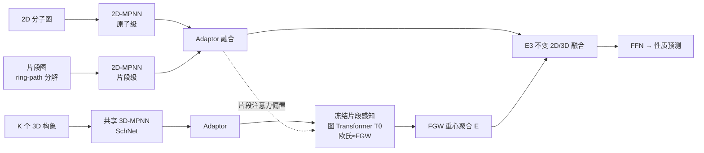

# FACET: A Fragment-Aware Conformer Ensemble Transformer

**会议**: ICLR 2026  
**OpenReview**: [https://openreview.net/forum?id=cpwbXHvd2h](https://openreview.net/forum?id=cpwbXHvd2h)  
**代码**: 已开源（论文内提供链接）  
**领域**: 分子表征学习 / 计算化学 / 几何深度学习  
**关键词**: 构象集成, Fused Gromov-Wasserstein, 图 Transformer, 片段先验, 分子性质预测  

## 一句话总结
FACET 用一个可微图 Transformer 去**学习逼近昂贵的 Fused Gromov-Wasserstein (FGW) 距离**，把"几何感知的多构象聚合"从在线求解优化问题变成一次前向推理，再叠加片段级结构先验，在保持 SOTA 精度的同时把训练提速 5–6 倍，可扩展到 7.5 万分子规模。

## 研究背景与动机
**领域现状**：分子性质预测需要同时利用 2D 拓扑图（连接关系）和 3D 构象（键长、二面角等几何信息）。由于分子会因键旋转、振动在多个低能构象间动态采样，溶解度、结合亲和力等很多可观测性质取决于**整个构象集成**而非单一构象，因此混合 2D+3D 多构象模型成为主流范式。

**现有痛点**：① 朴素聚合（mean pooling / DeepSets / self-attention）假设所有构象等权，忽略构象间的对齐与结构相似性；② 基于最优传输的几何感知方法（尤其 FGW 对齐，如 CONAN-FGW）能同时对齐特征空间与几何空间，效果好，但**FGW 求解极其昂贵**，在 Drugs-75k 这类大数据集上无法扩展——CONAN-FGW 在 Drugs-75K 上训 300 epoch 需 1107 GPU 小时。

**核心矛盾**：FGW 的几何对齐质量 vs. 其求解的计算代价——既要保留 FGW 的结构-特征联合对齐能力，又要摆脱在线求解优化问题的开销。

**本文目标**：在大规模生成式分子管线中实现快速、置换不变、几何感知的构象聚合。

**核心 idea**：**用监督学习把 FGW 蒸馏进一个图 Transformer 的隐空间**——训练时用真实 FGW 距离监督，让 Transformer 输出嵌入之间的欧氏距离逼近 FGW 距离；推理时直接前向得到"FGW 重心"的隐空间表示，再注入片段级先验增强细粒度化学语义。

## 方法详解

### 整体框架
FACET 由三条支路汇合而成：一条 2D-MPNN 编码原子级拓扑、另一条 2D-MPNN 在片段图上编码高阶子结构先验，二者经 adaptor 融合；多个 3D 构象由共享 3D-MPNN (SchNet) 编码后送入一个**预训练并冻结**的片段感知图 Transformer $T_\theta$，该 Transformer 已被 FGW 距离监督训练，能把构象嵌入到"欧氏距离≈FGW 距离"的空间中；最后一个置换不变且 E(3) 不变的融合模块把 2D 与 3D 表示统一成单一嵌入做下游预测。

### 关键设计
**1. FGW 距离的可学习代理：把优化求解换成一次前向。** FACET 的灵魂在于不再在线求解 FGW，而是训练图 Transformer $T_\theta$ 把每个构象 $S$ 映射到隐空间，使任意构象对 $(S_i,S_j)$ 的嵌入欧氏距离逼近其 FGW 距离。监督损失直接对齐二者：

$$\mathcal{L}_{enc}=\sum_{ij}\Big|\;\lVert T_\theta(H_i)-T_\theta(H_j)\rVert_2^2-\mathrm{FGW}_{p,\alpha}(G(S_i),G(S_j))\;\Big|$$

训练完冻结 $T_\theta$，对 $K$ 个构象取嵌入均值 $\bar H=\mathbb{E}[\{T_\theta(H_i)\}]$，这个均值正对应隐空间中的 **FGW 重心**（构象集合的几何均值）。FGW 重心本是要解 $\arg\min_G\sum_k\lambda_k\mathrm{FGW}(G,G_k)$ 的昂贵优化，现在退化成一次平均，这是 6× 提速的根源。作者还从多维标度 (MDS) 理论出发，把"非欧的 Wasserstein/FGW 距离嵌入欧氏空间"的累积应力误差给出了上下界（Theorem 1），用 $F=-CDC$ 的特征分解刻画下界 $L=\sum_{\lambda_i<0}\lambda_i^2$，为代理的可行性提供理论支撑。

**2. 片段感知的注意力偏置：让注意力对准化学有意义的子结构。** 单纯几何注意力不足以捕捉环、官能团等化学语义。FACET 先用 ring-path 分解把分子拆成片段图 $G^{frag}$，用 GAT 编出片段嵌入，再把它加回每个所属原子：$\tilde h_v^{(L)}=h_v^{(L)}+\mathrm{FFN}(h_{f(v)}^{frag})$，得到"原子局部+片段全局"的双尺度表示。在图 Transformer 内部，注意力分数在 Graphormer 的中心性编码、最短路 (SPD) 空间编码之外，再加一项由片段增强嵌入算出的化学相似度偏置：

$$\tilde A_{ij}=\frac{(h_iW_Q)(h_jW_K)^\top}{\sqrt d}+s_{\phi(v_i,v_j)}+c_{ij}+A(G)_{ij},\quad A(G)_{ij}=1-\frac{\langle\tilde h_i^{(L)},\tilde h_j^{(L)}\rangle}{\lVert\tilde h_i^{(L)}\rVert\,\lVert\tilde h_j^{(L)}\rVert}$$

其中 $A(G)_{ij}$ 是 2D 拓扑图上原子嵌入的余弦距离，直接把注意力引向环/官能团/骨架等功能相关区域，消融显示它对 FreeSolv 等数据集贡献明显。

**3. 三阶段训练 + adaptor 对齐域漂移。** 因为 $T_\theta$ 是在 Stage-1 固定的 3D-MPNN 特征上预训练的，而端到端联合训练会持续更新 3D-MPNN，造成喂给 $T_\theta$ 的特征分布漂移。FACET 采用三阶段：Stage 1 独立训 2D/3D MPNN 提特征（也产出监督 FGW 的数据）；Stage 2 单独训 Graphormer (12 层/8 头/372k 参) 逼近 FGW；Stage 3 端到端联合微调。关键是插入轻量 **MLP adaptor** 把 2D/3D 特征投影回 $T_\theta$ 训练时见过的分布（64 维），缓解域漂移——消融中去掉 adaptor 在所有数据集上都明显掉点。

**4. 置换与 E(3) 不变的 2D/3D 融合。** 最终把 2D 片段增强表示 $h_{2D}$、图 Transformer 聚合表示 $h_{GT}$ 与 3D 构象特征 $H_{3D}$ 通过可学习投影线性组合：$H_{comb}=\tilde W_{2D}H_{2D}+\tilde W_{3D}H_{3D}+\tilde W_{GT}H_{GT}$，再过 FFN 预测目标。整套聚合对构象顺序置换不变、对 3D 刚体变换 E(3) 不变，保证物理对称性下的鲁棒性。

## 实验关键数据

### 主实验表格
MoleculeNet 分子性质回归（MSE ↓，SchNet 骨干）：

| Model | Lipo | ESOL | FreeSolv | BACE |
|---|---|---|---|---|
| UniMol | **0.374** | 0.741 | 2.867 | - |
| CONAN | 0.556 | 0.571 | 1.496 | 0.635 |
| CONAN-FGW | 0.422 | 0.529 | 1.068 | 0.549 |
| **FACET** | 0.424 | **0.516** | **0.967** | **0.495** |

FACET 在 ESOL / FreeSolv / BACE 三项取得最低 MSE，相对 CONAN-FGW 持续改进；MARCEL 基准上在 SchNet 与 GemNet 两种骨干上均带来稳定提升，而 CONAN-FGW 在大规模 MARCEL 上难以扩展。

### 消融实验表格
组件消融（MSE ↓）：

| Dataset | FACET | w/o Frag. | w/o Frag. in Trans. | w/o Adap. |
|---|---|---|---|---|
| ESOL | **0.516** | 0.531 | 0.525 | 0.546 |
| FreeSolv | **0.967** | 1.072 | 0.973 | 1.085 |
| Kraken | **0.238** | 0.247 | 0.242 | 0.262 |

训练策略消融（MSE ↓）：

| Settings | ESOL | FreeSolv | BACE | Lipo |
|---|---|---|---|---|
| FACET (default) | 0.52 | 0.97 | 0.50 | 0.42 |
| Merge all steps | 0.57 | 1.26 | 0.59 | 0.53 |
| FACET (w/o FGW) | 0.54 | 0.98 | 0.53 | 0.45 |

### 关键发现
- **效率**：相对 CONAN-FGW 训练提速 5–6×；Drugs-75K 300 epoch 从 1107 GPU 小时降到 214 小时（8 卡仅 26.75 小时 vs. 138 小时），且推理时间随构象数线性增长。
- **FGW 监督有效**：去掉 FGW 监督 (w/o FGW) 普遍掉点，证明 Transformer 确实学到了几何对齐而非普通注意力。
- **代理保真度**：MoleculeNet 上学到的嵌入欧氏距离与真实 FGW 距离强相关（图 2 高 $\rho$），且构象数越多越可靠。
- **片段先验与 adaptor 都不可省**：去掉任一都退化，adaptor（对抗域漂移）影响最大。
- **化学泛化**：在有机催化剂、过渡金属配合物等化学多样性高的体系上尤为有效。

## 亮点与洞察
- **把"昂贵的优化求解"蒸馏成"一次前向"是核心范式**：用神经网络监督学习 FGW 这种结构感知 OT 度量，是首个针对 FGW（而非标准 OT）的可学习代理，思路可迁移到其他需要在线求解几何对齐的场景。
- **隐空间均值 = FGW 重心**：把重心计算这个优化问题降为简单平均，理论上还用 MDS 给了误差界，工程优雅且有据可依。
- **片段先验注入注意力偏置**而非仅做特征拼接，让化学语义直接调制 token 间的注意力，是 2D 拓扑与 3D 几何耦合的巧妙接口。

## 局限与展望
- 构象由 RDKit 距离几何法生成而非 DFT，几何精度有上限；对需要量子级精度的性质可能不足。
- FGW 监督信号仍需在 Stage 1/2 离线计算真实 FGW 距离作为标签，预处理成本未完全消除，只是从训练循环中移出。
- 三阶段 + 冻结 + adaptor 的流程较繁琐，超参（如 $\alpha$、adaptor 维度、阶段 epoch）较多，端到端单阶段（merge all steps）明显更差，说明对训练 schedule 敏感。
- UniMol 在 Lipo 上仍领先，说明大规模预训练在某些任务上的优势 FACET 尚未覆盖。

## 相关工作与启发
- **构象集成学习**：从 mean pooling / DeepSets / self-attention 到 FGW 对齐（Ma 2023, Nguyen 2024 CONAN-FGW），FACET 直接以 CONAN-FGW 为主要对标并解决其可扩展性。
- **可扩展 OT**：Sinkhorn、低秩分解、neural OT 代理（Haviv 2024 把 Wasserstein 嵌入欧氏空间）——FACET 将其从标准 OT 推广到结构感知的 FGW。
- **片段先验 GNN**：ring-path 分解（Wollschläger 2024）、scaffold-aware、片段对比学习等，FACET 把片段层级同时注入 2D 消息传递与 3D 空间注意力。
- **启发**：凡是训练/推理中反复调用昂贵几何对齐（点云配准、形状匹配、图匹配）的任务，都可考虑"用真实度量监督一个可微编码器、把度量蒸成嵌入距离"的代理范式。

## 评分
- **新颖性**: ⭐⭐⭐⭐ 首个针对 FGW 的可学习图 Transformer 代理 + 隐空间均值即重心 + MDS 误差界，组合新颖且有理论支撑。
- **实验充分度**: ⭐⭐⭐⭐ 覆盖 MoleculeNet/MARCEL 6 基准、多骨干、效率与代理保真度分析、完整消融，规模到 75k 分子。
- **写作质量**: ⭐⭐⭐⭐ 框架图与三阶段叙述清晰，公式与符号规范；流程较繁琐但解释到位。
- **价值**: ⭐⭐⭐⭐ 在保持 SOTA 精度下把几何感知聚合提速 5–6×，对大规模药物/材料筛选有直接工程价值。

<!-- RELATED:START -->

## 相关论文

- [\[ICLR 2026\] Hierarchical Multi-Scale Molecular Conformer Generation](hierarchical_multi-scale_molecular_conformer_generation.md)
- [\[ICLR 2026\] SigmaDock: Untwisting Molecular Docking with Fragment-Based SE(3) Diffusion](sigmadock_untwisting_molecular_docking_with_fragment-based_se3_diffusion.md)
- [\[ICLR 2026\] Animal behavioral analysis and neural encoding with transformer-based self-supervised pretraining](animal_behavioral_analysis_and_neural_encoding_with_transformer-based_self-super.md)
- [\[ICLR 2026\] Drugging the Undruggable: Benchmarking and Modeling Fragment-Based Screening](drugging_the_undruggable_benchmarking_and_modeling_fragment-based_screening.md)
- [\[ICLR 2026\] Coupled Transformer Autoencoder for Disentangling Multi-Region Neural Latent Dynamics](coupled_transformer_autoencoder_for_disentangling_multi-region_neural_latent_dyn.md)

<!-- RELATED:END -->
