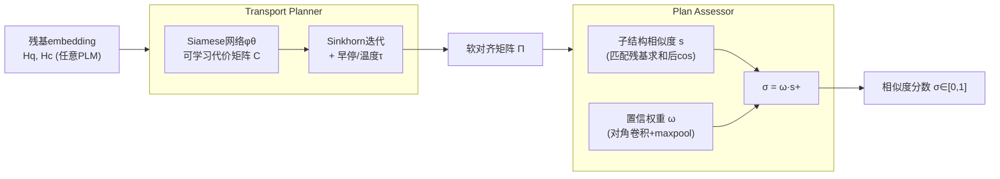

# Fast and Interpretable Protein Substructure Alignment via Optimal Transport

**会议**: ICLR 2026  
**OpenReview**: [https://openreview.net/forum?id=FileqNzZzn](https://openreview.net/forum?id=FileqNzZzn)  
**代码**: [https://github.com/ZW471/PLASMA-Protein-Local-Alignment](https://github.com/ZW471/PLASMA-Protein-Local-Alignment)  
**领域**: 计算生物学 / 蛋白质结构对齐  
**关键词**: 蛋白质局部结构对齐, 最优传输, Sinkhorn 算法, 可解释性, 残基级对齐  

## 一句话总结
PLASMA 把蛋白质局部结构对齐重新表述为带熵正则的最优传输问题，用可微 Sinkhorn 迭代直接输出残基级对齐矩阵和一个 [0,1] 区间的可解释相似度分数，做到了又快（约 10ms/对，比 TM-align 快 50×）又准又能看懂的活性位点/结合位点对齐。

## 研究背景与动机

**领域现状**：蛋白质的局部结构基序（催化残基、结合口袋、金属结合位点等）是连接结构与功能的关键，且结构保守性比序列保守性强 3–10 倍——很多功能关系只能从局部结构对齐看出来，序列对齐看不出。AlphaFold 数据库（AFDB）这类海量结构资源带来了在全蛋白宇宙中挖掘保守基序的机会。

**现有痛点**：已有方法大致三类，各有硬伤。（1）**模板搜索类**只能匹配已知基序，发现不了新的相似性；（2）**全局结构相似类**（TM-align、Foldseek、TM-Vec）要么计算昂贵难以扩展，要么把残基级信息压成粗粒度 embedding，丢掉了局部可解释性；（3）**子结构对齐类**（构造相似矩阵 + 动态规划）虽然更准，但结果会被全局结构模式干扰、对齐矩阵为算法性能优化而牺牲了清晰度，而且大多不可训练、无法适配具体任务或注入领域知识。

**核心矛盾**：功能相似的局部区域往往只是**部分重叠**、长度可变、且在序列上彼此分离、嵌在完全不同的整体折叠里。而现成的 OT 对齐方法又都假设**严格一对一**或一方完全包含另一方——这与蛋白质子结构对齐的真实情况冲突。

**本文目标**：做一个同时满足**准确、高效、清晰**三要素，且能处理部分/变长/非顺序基序对齐的残基级局部对齐方法。

**核心 idea**：**把子结构对齐重新表述为带熵正则的最优传输（OT）**——用可学习的几何代价矩阵 + 可微 Sinkhorn 迭代直接求软对齐矩阵，再用一个 Plan Assessor 把对齐矩阵压成一个有概率含义的相似度分数，整体作为可插拔模块挂在任意预训练蛋白质表示模型上。

## 方法详解

### 整体框架

PLASMA（Pluggable Local Alignment via Sinkhorn MAtrix）接收一对蛋白质的残基级隐表示 $H_q \in \mathbb{R}^{N\times d}$、$H_c \in \mathbb{R}^{M\times d}$（来自任意预训练蛋白质语言模型），输出一个软对齐矩阵 $\Pi \in \mathbb{R}^{N\times M}$ 和相似度分数 $\sigma \in [0,1]$，即 $(\Pi, \sigma) = \text{PLASMA}(H_q, H_c)$。它由两个互补模块串联：**Transport Planner** 负责核心 OT 计算、生成对齐矩阵 $\Pi$；**Plan Assessor** 把 $\Pi$ 总结成一个可解释的相似度分数。整体复杂度 $O(N^2)$，完全可并行、可微、可端到端训练。

### 关键设计

**1. 可学习几何代价矩阵：用 Siamese 网络把残基对的相似度变成可优化的传输代价。** 代价矩阵的每个元素 $C_{ij}$ 衡量从查询残基 $r_{q,i}$ 到候选残基 $r_{c,j}$ 的搬运代价，定义为 $C_{ij} = \big[\varphi_\theta(\text{LN}(h_{q,i})) \cdot \varphi_\theta(\text{LN}(h_{c,j}))\big]_+ + 1$。这里 $\varphi_\theta$ 是一个共享参数 $\theta$ 的孪生（Siamese）网络（默认两层全连接 $\varphi_\theta(h)=\text{ReLU}(h W_1) W_2$，也可换成 Transformer 或 GNN），层归一化 $\text{LN}(\cdot)$ 保证数值稳定与尺度不变，铰链非线性 $[\cdot]_+$ 在子图匹配任务中被证明优于点积。这种可学习设计让 PLASMA 能通过端到端训练学到任务特定的对齐代价，而不是写死一个固定的相似度度量。作者还给出了**免训练变体 PLASMA-PF**：直接去掉孪生网络、在原始 embedding 上算代价，作为无标注数据场景下的快速基线——但学习版在稳定性与外推上更优。

**2. 早停 + 温度的 Sinkhorn 软对齐：用熵正则 OT 求解部分对齐，避免被迫一对一。** 基于代价矩阵 $C$，初始化 $\Pi^{(0)}=\exp(-C/\tau)$，然后做 Sinkhorn 行列交替归一化迭代逼近 OT 计划。这里有个关键观察：原始 Sinkhorn 会收敛到完全双随机矩阵，**强迫每个残基把质量摊到对方所有残基上**，而真实情况是大多数残基根本没有对应物，这种强匹配在生物学上没有意义。PLASMA 用两个机制实现**隐式部分对齐**：一是**早停**——限制 Sinkhorn 迭代步数，让匹配差的残基保持低权重、保留稀疏性；二是**温度参数 $\tau$**——控制对齐质量分布，越低越稀疏越聚焦。两者合力突出生物学相关的对应、避开强行匹配，且不需要对传输预算加硬约束。这正是它能处理「部分重叠、变长、非顺序」基序的关键。

**3. 置信权重校正的可解释分数：先算子结构相似度，再用对角连续性加权防止虚高。** Plan Assessor 先以阈值 $\eta$ 从 $\Pi$ 里挑出匹配残基集合 $R_q, R_c$（$\Pi_{ij}>\eta$），把它们的 embedding 求和后算余弦相似度得到子结构相似度 $s$。但当只有零星几个残基对齐、或匹配残基沿序列散开而没聚成连续区域时，$s$ 会**虚高**——看起来很像但其实没形成结构上可解释的子结构。为此引入**置信权重 $\omega$**：用一个 $k\times k$ 单位核 $K=I_k$ 对 $\Pi$ 做 2D 卷积 $\omega_{ij}=\sum_{u=0}^{k-1}\Pi_{i+u,j+u}$，这相当于沿对角线累加、突出「查询里连续残基对上候选里连续残基」的核心区域；再用 max-pooling 取 $\omega=\max_{i,j}\omega_{ij}$，最终分数 $\sigma=\omega\cdot s_+$。这样 $\sigma=0$ 表示无匹配、$\sigma=1$ 表示完美子结构对齐，沿用 TM-align 惯例排除负相似度，给出了一个有一致概率含义的分数。

**4. 双目标训练 + Label Match Loss：联合优化「有没有对齐」和「对到哪」，且对缺标注鲁棒。** 训练数据是蛋白质对 $(P_q, P_c)$，部分对含共享功能的匹配子结构，用掩码 $M_q, M_c$ 标出目标子结构位置。分数 $\sigma$ 用二元交叉熵 $L_{BCE}$ 监督「这对有没有匹配子结构」。对齐矩阵的优化更棘手——未标注残基可能是有效但没标的匹配，当负样本惩罚会误伤模型。为此提出 **Label Match Loss（LML）** 只盯着已标注子结构：$L_{LML}=\|[M_c - \Pi^\top M_q]_+\|_1 / \|M_c\|_1$，它衡量对齐矩阵把已标注子结构对齐得好不好，$[\cdot]_+$ 只保留非负项、用 $\|M_c\|_1$ 归一化；无标注时 $L_{LML}=0$，让模型聚焦已知子结构而不惩罚潜在有效匹配。最终损失 $L=L_{BCE}+L_{LML}$。

## 实验关键数据

### 主实验表格

在 VenusX 残基级功能对齐基准上评测三类功能子结构（motif / 结合位点 / 活性位点），训练-测试序列一致性 <50%。重点看 **test_extra**（来自训练未见家族的新颖子结构，考验泛化）。下表为各方法在三类任务上的代表性指标（ANKH backbone）：

| 指标 | 任务 | PLASMA | PLASMA-PF | EBA | Foldseek | TM-Align |
|------|------|--------|-----------|-----|----------|----------|
| ROC-AUC | Motif | **.98** | .98 | .90 | .89 | .81 |
| ROC-AUC | 结合位点 | **.99** | .99 | .99 | — | — |
| ROC-AUC | 活性位点 | **.98** | .97 | .97 | — | — |
| F1-Max | Motif | **.97** | .96 | .86 | .91 | .76 |
| PR-AUC | Motif | **.98** | .98 | .91 | .84 | .86 |

PLASMA 在全部三类任务、全部指标上稳居第一；PLASMA-PF 无需训练也很强，但在 test_extra 上不及学习版（说明监督样本对全新功能子结构有价值）。基线方法在不同 backbone 上波动巨大（如 EBA 配 PROTSSN 时 F1-Max 直接掉到 0）。

### 消融/效率与对齐质量

| 维度 | PLASMA | PLASMA-PF | EBA | TM-Align / Foldseek |
|------|--------|-----------|-----|---------------------|
| 单对推理时间 | ~10ms | ~7ms | ~30ms | ~500ms（约 50× 慢） |
| 低相似度(TM<0.5)下 ROC-AUC | >0.9 | >0.9 | 急剧下降 | 急剧下降 |
| LMS 对齐质量 | 最高 | 次之 | 无法有效评估(恒为1.0) | — |

- **效率**：PLASMA 比 TM-align/Foldseek（需昂贵结构叠加）快约 50×，比 EBA（串行动态规划）快约 3×，得益于完全可微、GPU 加速的 OT 形式。
- **可校准性**：PLASMA/PLASMA-PF 能清晰分开正负蛋白质对分布，EBA 分数无上界、难以解释和校准。
- **训练增益**：LMS 上 PLASMA 全面优于 PLASMA-PF，证明学习确实提升了对齐精度。

### 关键发现
1. OT 形式让对齐**独立于整体相似度**聚焦局部对应，是低同源场景仍稳健的根因。
2. 三个真实生物案例（小螺旋基序、辅因子结合域、多元件延展子结构）中，PLASMA 对上了功能相关残基（如 Leu-X-X-Leu-Leu 基序，RMSD 0.18Å），而 EBA 常对到非功能的骨架区域。
3. 跨七种 backbone（ProtT5/ProstT5/ANKH/ESM2/ProtBERT/TM-Vec/ProtSSN）行为一致，说明方法不绑定特定编码器。

## 亮点与洞察
- **问题重述的优雅**：把「枚举片段 + 动态规划」换成「熵正则 OT + Sinkhorn」，一步绕过显式片段枚举，天然支持部分/变长/非顺序匹配，还顺带拿到完全并行可微的实现。
- **两个朴素机制实现部分对齐**：不引入硬约束（传输预算），只靠「早停 + 温度」就破解了 Sinkhorn 强制双随机的生物学不合理性，工程上极简却抓住要害。
- **置信权重对角卷积**：用一个单位核卷积识别对角连续段，把「散点虚高」和「真子结构」区分开，是让分数真正可解释的点睛之笔。
- **可插拔 + 训练/免训练双版本**：作为模块挂在任意 PLM 上，有标注用学习版、没标注用 PLASMA-PF，落地友好。

## 局限与展望
- **依赖预训练表示质量**：PLASMA 接收的是现成 PLM 的残基 embedding，编码器本身的偏差会传导到对齐结果，论文虽展示跨 backbone 一致性但未深入分析失败编码器情形。
- **阈值/超参敏感**：匹配阈值 $\eta$、温度 $\tau$、卷积核大小 $k$、Sinkhorn 迭代步数 $T$ 都需调，对全新任务的默认值鲁棒性有待更系统的考察。
- **标注依赖**：LML 需要子结构掩码标注，VenusX 之外的新功能类别仍受限于标注可得性；PLASMA-PF 虽免训练但精度（LMS）明显下降。
- **评测范围**：主要在功能子结构检测+案例研究，缺少大规模数据库检索（如全 AFDB 扫描）的端到端实证。

## 相关工作与启发
- **全局结构对齐**：TM-align、Foldseek（结构→1D 序列）、TM-Vec（定长向量快速检索）、GTAlign（空间索引）、US-align（通用大分子）——全局性质限制了对不相似蛋白中保守基序的检测，正是 PLASMA 要补的缺口。
- **子结构/序列对齐**：图基残基 embedding、活性位点环境、线性指派形式，以及 PLM embedding 相似度打分到嵌入感知动态规划。最相关的是 OT 可微图匹配学习结构/功能感知的替换矩阵（Pellizzoni 2024），但它聚焦学习匹配代价；PLASMA 直接产出残基级显式映射，兼顾速度与可解释性。
- **启发**：把「对齐 = 最优传输」这一视角配合「早停+温度做软稀疏」，对其它需要部分/变长对应的匹配任务（点云配准、跨模态 token 对齐、子图匹配）有迁移潜力。

## 评分
- **新颖性**: ⭐⭐⭐⭐ 把蛋白质局部对齐重述为熵正则 OT 并用早停+温度实现部分对齐、置信权重做可解释分数，组合清晰且切中现有方法痛点，虽各组件（Sinkhorn/Siamese）已知但整合到位。
- **实验充分度**: ⭐⭐⭐⭐ 三类任务 × 七种 backbone × 插值/外推双难度 + 效率对比 + 三个真实生物案例，覆盖全面；缺大规模数据库检索实证。
- **写作质量**: ⭐⭐⭐⭐ 动机—痛点—方法逻辑顺畅，公式与图配合清楚，模块职责分明。
- **价值**: ⭐⭐⭐⭐ 快 50×、可解释、可插拔，对功能注释、进化研究和结构药物设计有实用价值，开源实现降低落地门槛。

<!-- RELATED:START -->

## 相关论文

- [\[ICLR 2026\] KGOT: Unified Knowledge Graph and Optimal Transport Pseudo-Labeling for Molecule-Protein Interaction Prediction](kgot_unified_knowledge_graph_and_optimal_transport_pseudo-labeling_for_molecule-.md)
- [\[ICLR 2026\] Optimal Transport Unlocks End-to-End Learning for Single-Molecule Localization](optimal_transport_unlocks_end-to-end_learning_for_single-molecule_localization.md)
- [\[ICLR 2026\] WFR-FM: Simulation-Free Dynamic Unbalanced Optimal Transport](wfr-fm_simulation-free_dynamic_unbalanced_optimal_transport.md)
- [\[ICLR 2026\] RankFlow: Property-aware Transport for Protein Optimization](rankflow_property-aware_transport_for_protein_optimization.md)
- [\[ICLR 2026\] Greater than the Sum of Its Parts: Building Substructure into Protein Encoding Models](greater_than_the_sum_of_its_parts_building_substructure_into_protein_encoding_mo.md)

<!-- RELATED:END -->
