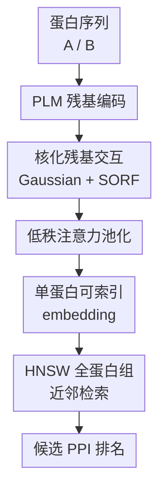

# Fast Proteome-Scale Protein Interaction Retrieval via Residue-Level Factorization

**会议**: ICLR2026  
**OpenReview**: [https://openreview.net/forum?id=Dp1RM3gPg8](https://openreview.net/forum?id=Dp1RM3gPg8)  
**论文**: [OpenReview](https://openreview.net/forum?id=Dp1RM3gPg8)  
**代码**: https://github.com/AndyJZhao/RaftPPI  
**领域**: 计算生物学 / 蛋白质相互作用检索  
**关键词**: 蛋白质相互作用, 全蛋白组检索, residue-level factorization, Random Fourier Features, hard negative weighting  

## 一句话总结
RaftPPI 把传统 residue-residue 蛋白互作评分近似成可分解的单蛋白 embedding 内积，用 Gaussian kernel、SORF 随机傅里叶特征和低秩注意力保留残基级建模能力，同时把全人类蛋白组候选互作检索从 GPU 月级降到单机数分钟。

## 研究背景与动机
**领域现状**：蛋白质-蛋白质相互作用（PPI）预测本质上关心两个蛋白是否会在细胞环境中发生功能或结构层面的接触。高精度路线通常有两类：一类直接预测蛋白复合物结构，如 AlphaFold-Multimer、AlphaFold3 或 RoseTTAFold 系列；另一类是 sequence-based PPI classifier，用蛋白语言模型（PLM）给每个残基或整条序列编码，再对蛋白对做二分类。前者结构解释性强，但每个候选复合物都要做昂贵推理；后者更轻，但许多强模型仍然需要对每一对蛋白联合编码或显式计算 residue-residue 交互。

**现有痛点**：真实应用不是只判断一小批候选，而是要在一个物种的 proteome 里筛出可能互作的蛋白对。人类蛋白组大约有两万条蛋白，候选对数量约 $2\times 10^8$。如果模型对每一对蛋白都计算长度为 $L_A\times L_B$ 的残基交互矩阵，总复杂度会接近 $O(N^2L^2)$；如果再叠加 pairwise PLM 推理或结构预测，筛一遍全蛋白组就会变成 GPU 月级任务。论文里给出的对照很直观：强分类模型 PLM-Interact 在人类蛋白组上估计需要 148.47 个 A100 GPU-days，约 4.9 个月。

**核心矛盾**：PPI 的信号确实发生在 residue level，粗暴地把整条蛋白压成一个 [CLS] 向量会损失界面残基信息；但显式 residue-residue 交互又无法在全蛋白组检索中承受二次方候选数。也就是说，模型既要像 residue-level 模型一样看局部接触，又要像向量检索模型一样把每条蛋白预先编码成可索引 embedding。

**本文目标**：作者要解决的不是单纯提高 AUROC，而是让 PPI 模型同时满足三件事：第一，仍然近似 residue-level interaction scoring；第二，每条蛋白只编码一次，之后能用 ANN index 做大规模 top-$K$ 检索；第三，在构造负样本质量参差不齐的 PPI 数据上训练稳定，不被大量 easy negatives 带偏。

**切入角度**：论文的关键观察是，许多 residue-level PPI 模型可以抽象成“预测残基对分数，再加权聚合成蛋白对分数”的 Pred&Agg pipeline。只要把其中的非线性残基打分和二维注意力聚合改写成可分解形式，就有机会把整个蛋白对 logit 写成两个单蛋白向量的内积。于是作者选择 Gaussian kernel 表示 residue-residue 相似性，用 Random Fourier Features 把 kernel 近似成显式特征内积，再用低秩 separable attention 把二维残基权重分解成两个一维权重。

**核心 idea**：RaftPPI 用“核化残基交互 + 低秩注意力池化”把每对蛋白的 residue-level PPI 分数因子化为单蛋白 embedding 的点积，从而把全蛋白组 PPI screening 从显式 pairwise scoring 改造成向量近邻检索。

## 方法详解
RaftPPI 的方法可以看成对传统 residue-level PPI pipeline 的一次数学改写：原本需要对蛋白 $A$ 和 $B$ 的所有残基对 $(i,j)$ 计算交互分数 $c_{ij}$，再用聚合函数得到蛋白对 logit；RaftPPI 则让这个过程在训练和推理时都近似等价于 $\langle \hat{h}_A, \hat{h}_B\rangle$。这样每条蛋白的 $\hat{h}$ 可以预先缓存并放进 HNSW 索引，查询时不再遍历所有蛋白对。

### 整体框架
输入是一对蛋白序列。首先用 ESM2-8M 这类 PLM 生成残基级 embedding；然后 RaftPPI 不直接构造完整 pair matrix，而是对每个残基 embedding 做 Gaussian kernel 的随机傅里叶特征映射，并同时学习一组 per-residue attention 权重；接着把一条蛋白内的残基特征按 attention 加权求和，得到固定长度的单蛋白 embedding；最后训练时用两个 embedding 的内积作为 PPI logit，推理时把所有蛋白 embedding 建成 HNSW index 做近邻检索。

图里的 PLM 残基编码是通用脚手架，真正的贡献集中在三个同名模块：核化残基交互、低秩注意力池化、HNSW 全蛋白组近邻检索；训练层面再加上 adaptive negative weighting，解决 PPI 数据里负样本构造不可靠的问题。整体框架与关键设计的对应关系很直接：先把残基交互变成可分解 kernel，再把二维 attention 变成一维权重乘积，最后把得到的蛋白向量接入 ANN 检索。

### 关键设计
**1. 核化残基交互：用 Gaussian kernel 保留非线性 residue-level 接触信号**

传统 Pred&Agg 方法可以用一个 MLP 或内积函数 $f(z_{A,i}, z_{B,j})$ 预测残基对接触分数，但这种 pair-specific 非线性函数一旦依赖两个残基同时输入，就很难提前为单条蛋白建索引。RaftPPI 把残基对交互改成 Gaussian kernel：$k_{\hat{\sigma}}(z_{A,i}, z_{B,j})=\exp(-\|z_{A,i}-z_{B,j}\|^2/(2\hat{\sigma}^2))$。这一步的含义是：如果两个残基在 PLM embedding 空间里更接近，它们对互作 logit 的贡献更大；带宽 $\hat{\sigma}$ 控制这种“近”的尺度，太小会只看极局部匹配，太大又会把结构差异过度抹平。

Gaussian kernel 的好处不是简单换一个相似度函数，而是它天然对应某个无限维 RKHS 中的内积。作者用 Random Fourier Features 把它近似成显式有限维特征：$k_{\hat{\sigma}}(x,y)\approx \psi(x)^\top\psi(y)$，其中 $\psi(z)=\frac{1}{\sqrt{d'}}[\cos(Wz);\sin(Wz)]$。为了降低随机特征计算成本，论文采用 Structured Orthogonal Random Features（SORF），用 Hadamard 矩阵和 Rademacher 符号翻转构造频率矩阵 $W$，避免 dense RFF 的 $O(Ldd')$ 昂贵乘法。这样，残基级非线性相似度被转成了每个残基各自可计算的特征向量内积，为后面的单蛋白因子化铺路。

**2. 低秩注意力池化：把二维 residue-pair 权重拆成两条蛋白各自的一维权重**

只把 kernel 分解还不够，因为传统聚合函数还会对每个残基对 $(i,j)$ 赋不同权重 $s_{ij}$。如果 $s_{ij}$ 仍然是一个任意的二维矩阵，模型还是必须看到蛋白对之后才能计算完整 score。RaftPPI 的处理是用 rank-$r$ separable attention 近似这个二维注意力面：对每条蛋白分别用轻量 per-residue scorer $h_\theta^{(t)}$ 产生残基重要性，再 softmax 得到 $w_A^{(t)}$ 和 $w_B^{(t)}$，然后令 $s_{ij}=\sum_{t=1}^{r}w_{A,i}^{(t)}w_{B,j}^{(t)}$。

论文实际默认用 $r=1$，于是残基对权重就是 $w_{A,i}w_{B,j}$。代入 kernel 近似后，蛋白对 logit 可以从双重求和整理成两个加权和的内积：$\ell(A,B)\approx\langle\sum_i w_{A,i}\psi(z_{A,i}),\sum_j w_{B,j}\psi(z_{B,j})\rangle$。这一步是整篇论文最关键的 algebra：它不是把 residue-level 信息丢掉，而是让每条蛋白自己先选出重要残基、把这些残基的 kernel feature 加权合成一个 embedding。附录的 rank ablation 也说明，rank 1 已经给出最好的 AUROC 和 Recall@20%，rank 2 只略微提升 Recall@1/3/5，而更高 rank 反而过拟合并线性增加存储和检索成本。

**3. 单蛋白可索引 embedding：把全蛋白组筛选从 exhaustive scoring 改成 ANN 检索**

经过前两个设计，RaftPPI 可以为任意蛋白 $A$ 生成 $\hat{h}_A=\sum_iw_{A,i}\psi(z_{A,i})$，蛋白对分数就是 $\ell(A,B)=\langle\hat{h}_A,\hat{h}_B\rangle$。这使推理形态发生了根本变化：过去每次判断一个候选对都要同时加载两条蛋白并计算残基矩阵；现在每条蛋白只需编码一次，所有 $\hat{h}$ 可以缓存，然后用 HNSW 这类 approximate nearest neighbor index 做 inner-product retrieval。

复杂度也随之改变。全蛋白组里 $N$ 条平均长度为 $L$ 的蛋白，PLM 编码成本约为 $O(NL^2)$；RaftPPI 额外的映射和池化对每条蛋白近似线性于 $L$，索引构建为 $O(N\log N)$，查询随 $N$ 多项对数增长。相比之下，传统 residue-pair scoring 要面对 $O(N^2L^2)$ 的候选对代价。论文在人类蛋白组上的数字很好地说明了这点：RaftPPI 在单 A100 上 top-20% retrieval 总耗时约 343 秒，其中编码 102 秒、检索 241 秒；在 Intel Xeon 6980P CPU 上甚至只需 200 秒，约 3.3 分钟。

**4. 自适应负样本加权：让训练关注更像阳性的 hard negatives**

PPI 数据集的一个长期难题是负样本不可靠。实验验证“两个蛋白不互作”很少见，很多 benchmark 的 negative pairs 是按不同细胞区室、随机配对或拓扑规则构造出来的，其中一大批可能太容易，模型学会了数据构造偏差却不一定学会真实互作边界。RaftPPI 用 adaptive negative weighting 在训练中自动提高 hard negatives 的权重：对一个 minibatch 内的负样本，根据当前 logit $\ell_i$ 定义 $p_i=\exp(\tau\ell_i)/\sum_{j\in N}\exp(\tau\ell_j)$，并在实现中 stop gradient through $p_i$。

最终 loss 是正样本 BCE 与加权负样本 BCE 的平衡形式：$L=\frac{1}{2}[-\frac{1}{|P|}\sum_{p\in P}\log\sigma(\ell_p)-\sum_{i\in N}p_i\log\sigma(-\ell_i)]$。当 $\tau=0$ 时它退化成均匀 BCE；当 $\tau$ 很大时几乎只盯最难负样本。论文发现 $\tau=4$ 在分类 AUROC 和 Recall@20% 上都比较稳，说明适度强调高分负样本能缓解 easy negative 主导训练的问题，但过度强调会被异常样本牵着走。

### 一个完整示例
假设要在人类蛋白组中为某个 query protein 找潜在互作对象。传统 residue-level 模型会把这个 query 与约两万条 candidate protein 逐对组合，每一对都构造 $L_A\times L_B$ 的残基交互矩阵，最后排序；如果对所有 query 都这么做，就会遍历约 $2\times10^8$ 个候选对。

RaftPPI 的流程不同。离线阶段先对两万条蛋白各跑一次 ESM2-8M，得到残基 embedding；每条蛋白再经过固定 SORF 映射和 attention pooling，得到一个 $\hat{h}$，并放进 HNSW 索引。在线查询阶段，query protein 也变成一个 $\hat{h}_q$，系统只需在索引里找 inner product 最大的邻居，例如取 top 20% 候选约四千条，再把这些 pair 作为后续实验验证或结构预测的 shortlist。这个例子里，RaftPPI 不是承诺直接替代 AlphaFold 类结构建模，而是把“先从全蛋白组里找值得精算的候选”这一步做得足够快。

### 损失函数 / 训练策略
实验使用 ESM2-8M 作为 PLM backbone，主要训练超参保持跨数据集一致：AdamW，学习率 $10^{-4}$，Random Fourier Features 频率数 $d'=2048$，Gaussian bandwidth $\hat{\sigma}=0.5$，adaptive negative weighting temperature $\tau=4$。SORF transform 在训练和推理时固定一致，保证训练得到的 kernel feature 空间与检索时存储的 embedding 对齐。

模型选择上，作者没有盲目使用更大的 ESM2，而是在附录中比较了 8M、35M、150M、650M checkpoint。结果显示，PPI 分类和检索的表现并不会随 PLM 参数量稳定增长；考虑到 pairwise 推理已经非常昂贵，论文采用 ESM2-8M 作为性能与吞吐的折中。对 RaftPPI 来说，真正的扩展性收益来自因子化检索结构，而不是单纯堆大 backbone。

## 实验关键数据

### 主实验
论文在七个经过 sequence similarity 与 node-degree 控制的 PPI benchmark 上评估分类性能，覆盖 yeast 和 human，包括 GUO、DU、HUANG、D-SCRIPT、PAN、RICHOUX、GOLD。这样的 split 比随机划分更严格，因为它减少了同源序列泄漏和 hub protein 频率偏差，能更接近真实泛化。

| 方法 | D-SCRIPT AUROC | Huang AUROC | Gold AUROC | Guo AUROC | Du AUROC | 平均 AUROC |
|------|----------------|-------------|------------|-----------|----------|------------|
| ESM2-NoFT | 75.01 | 58.63 | 57.85 | 62.87 | 57.36 | 62.07 |
| ESM2-MLP | 82.83 | 73.34 | 56.35 | 83.54 | 73.34 | 74.25 |
| TUnA | 83.38 | 66.66 | 52.55 | 69.81 | 69.37 | 70.79 |
| PLM-Interact | 84.77 | 69.69 | 65.00 | 79.60 | 75.20 | 75.14 |
| RaftPPI | 82.06 | 72.20 | 68.69 | 84.93 | 75.06 | 75.29 |

RaftPPI 的平均 AUROC 为 75.29%，略高于 PLM-Interact 的 75.14%，但两者的意义不同：PLM-Interact 依赖更重的 cross-protein early fusion，分类很强却很难大规模检索；RaftPPI 在保持同等级分类性能的同时，输出可索引 embedding，这正是本文的核心价值。

蛋白组检索实验更贴近应用场景。作者从每个数据集采样 100 个 query protein，在 test split 上检索真阳性，并报告 Recall@K%。平均曲线显示 RaftPPI 在各个 K 上都领先或接近领先，尤其在 Recall@20% 上优势明显。

| 方法 | Recall@1% | Recall@3% | Recall@5% | Recall@10% | Recall@20% |
|------|-----------|-----------|-----------|------------|------------|
| ESM2-MLP | 3.0 | 7.2 | 10.4 | 17.7 | 30.8 |
| TUnA | 9.6 | 16.6 | 21.1 | 29.7 | 42.4 |
| PLM-Interact | 8.8 | 15.8 | 20.8 | 31.2 | 45.7 |
| ESM2-NoFT | 10.9 | 18.8 | 23.9 | 34.0 | 48.3 |
| RaftPPI-P | 10.4 | 17.2 | 22.1 | 31.5 | 43.9 |
| RaftPPI | 10.9 | 18.2 | 23.3 | 34.0 | 48.3 |

效率表是本文最有冲击力的结果。非因子化模型需要显式跑候选 protein pairs，RaftPPI 则一次性编码蛋白并复用索引。

| 模型类型 | 方法 | 编码时间 | Recall@20% 检索时间 | 平均 AUROC | Recall@20% |
|----------|------|----------|---------------------|------------|------------|
| Unfactorizable | ESM2-MLP | NA | 1,766,576 s | 74.25 | 27.77% est. |
| Unfactorizable | TUnA | NA | 3,833,646 s | 70.79 | 30.44% est. |
| Unfactorizable | PLM-Interact | NA | 12,827,660 s | 75.14 | 30.81% est. |
| Factorizable | ESM2-NoFT | 105 s | 259 s | 62.07 | 41.72% full |
| Factorizable | RaftPPI-P | 54 s | 187 s | 71.90 | 43.83% full |
| Factorizable | RaftPPI | 102 s | 241 s | 75.29 | 47.91% full |

### 消融实验
| 配置 | 分类 AUROC 平均 | Recall@20% 平均 | 说明 |
|------|----------------|-----------------|------|
| Raft-BCE-Loss | 72.24 | 45.05 | 用均匀 BCE 代替 adaptive negative weighting，分类和检索都下降 |
| ESM2-MLP-ANW-Loss | 74.33 | 27.77 | 加了自适应负样本权重但没有 residue-level factorization，检索明显崩掉 |
| Raft-WoSORF | 74.62 | 48.33 | 去掉 Gaussian/SORF 的核化交互后整体略弱，说明非线性 kernel 有贡献 |
| Raft-Avg-Agg | 74.67 | 47.83 | 用平均池化替代 attention，说明残基重要性加权有帮助 |
| Raft-CLS-Agg | 74.40 | 46.83 | 用 [CLS] 聚合不如 residue attention，证明界面残基信息不能完全靠全局 token 表示 |
| RaftPPI | 75.29 | 49.34 | 完整模型在分类和检索上综合最好 |

### 关键发现
- RaftPPI 最重要的贡献不是单点 AUROC 大幅领先，而是把 residue-aware PPI model 做成了 retrieval-friendly model；它在平均 AUROC 上与 PLM-Interact 同级，却在全人类蛋白组检索中从约 4.9 个 GPU 月降到数分钟。
- Residue-level modeling 对检索尤其关键。ESM2-MLP 即便加上 adaptive negative weighting，在分类上还能竞争，但 Recall@20% 平均只有 27.77；这说明 PPI retrieval 不是简单二分类 head 能解决的任务。
- Gaussian bandwidth 有明显最优区间。$\hat{\sigma}=0.5$ 在 human 和 yeast 上都比较稳定；太小会让残基匹配过稀疏，太大则过度平滑 residue-level 结构。
- Attention rank 并不是越大越好。rank 1 已经达到最佳 AUROC 和 Recall@20%，rank 2 只轻微改善最靠前 recall，更高 rank 反而过拟合并增加 embedding 维度。
- RFF dimension 相对不敏感。$d'$ 从 256 到 4096 的变化只带来约 1 个点以内波动，说明 RaftPPI 的主要性能瓶颈不在随机特征维度，而在 kernel 带宽、attention 与负样本训练。

## 亮点与洞察
- 这篇论文最巧妙的地方是把“残基级交互”和“向量检索”这两个看似冲突的目标用一个可分解公式连起来。很多工作会在准确率和可扩展性之间二选一，RaftPPI 则通过 kernel approximation 和 separable attention 把高成本 pairwise score 重写成单蛋白 embedding dot product。
- SORF 的使用很务实。它不是为了炫一个随机特征技巧，而是让 Gaussian kernel 的显式映射在残基序列上足够快，否则 dense RFF 本身也会成为瓶颈。
- 实验设计比普通 PPI 分类论文更可信。作者采用 Bernett et al. 的 sequence- and degree-controlled splits，主动避开同源序列泄漏和 hub protein 偏差，并且把检索任务作为核心评估，而不是只报告容易乐观的随机划分 AUROC。
- Adaptive negative weighting 对 PPI 任务很贴切。生物实验里“没有观测到互作”不等于“确认不互作”，因此训练时不能让大量人工构造的 easy negatives 支配梯度；让模型关注高分负样本，相当于把学习重点放在更接近真实边界的候选上。
- 这个思路可以迁移到其他 pairwise biological retrieval 任务。只要任务有“局部 token-level 交互很重要，但全库 pairwise scoring 太贵”的结构，例如蛋白-配体候选筛选、抗体-抗原初筛、RNA-protein interaction retrieval，都可以考虑类似的 kernelized factorization。

## 局限与展望
- RaftPPI 主要解决 screening 和 retrieval，不直接给出复合物三维结构或精确结合界面。因此它更适合作为 AlphaFold/RoseTTAFold 等结构预测的前置 shortlist 工具，而不是终局验证工具。
- Gaussian kernel 基于 PLM embedding 空间距离，隐含假设是“embedding 接近”能代表潜在残基交互相容性；如果某些界面依赖构象变化、翻译后修饰、细胞区室或条件特异表达，这种 sequence-only 表征可能捕捉不到。
- 实验虽然用了严格 benchmark 和人类蛋白组检索，但最终仍是计算评估，没有给出湿实验验证的新互作发现。对生物发现流程来说，top-ranked novel pairs 的实验验证会更能说明实际价值。
- HNSW 检索返回的是近似 top-$K$，在极端高召回需求下可能需要调索引参数或加入二阶段精排。论文的框架天然支持 shortlist 后用更昂贵模型复核，这也是实际部署中应采用的方式。
- Adaptive negative weighting 依赖 batch 内负样本分布。如果训练 batch 中 hard negatives 很少，或者负样本里混入未标注真阳性过多，权重机制可能把噪声放大。后续可以结合生物先验、co-localization 或 experimentally curated negatives 做更可靠的 negative curriculum。

## 相关工作与启发
- **vs D-SCRIPT / TT3D / Topsy-Turvy**: 这些方法同样重视 residue-residue interaction，并通过接触矩阵或图/结构信息聚合成 PPI 分数；RaftPPI 的区别在于把残基交互设计成可因子化内积，使全蛋白组检索不再需要显式遍历所有 protein pairs。
- **vs PLM-Interact**: PLM-Interact 的 early fusion 能让模型深层联合建模两条蛋白，因此分类 AUROC 很强；但它必须逐 pair 推理，导致人类蛋白组筛选估计需要 4.9 个 A100 GPU 月。RaftPPI 分类平均性能相近，却能用单蛋白 embedding 和 ANN index 在分钟级完成筛选。
- **vs ESM2-NoFT / [CLS] dot product retrieval**: ESM2-NoFT 天然可检索，速度快，但它没有针对 PPI 训练，也没有显式残基级交互建模。RaftPPI 保留了 dot-product retrieval 的可扩展性，同时通过 residue kernel 和 attention 学到更贴近互作界面的相似性。
- **vs 结构预测筛选流水线**: AlphaFold-Multimer、AlphaFold3、RF2-Lite 等结构方法适合对小候选集做高精度建模，但不适合直接扫完整 proteome。RaftPPI 的启发是：大规模发现可以先用可索引 residue-aware 模型做候选缩小，再把昂贵结构模型用于更少的 pair。

## 评分
- 新颖性: ⭐⭐⭐⭐⭐ 把 residue-level PPI scoring 严格改写成可索引单蛋白 embedding 内积，问题定义和数学因子化都很漂亮。
- 实验充分度: ⭐⭐⭐⭐⭐ 覆盖七个严格 PPI benchmark、人类蛋白组检索、效率对比和多组消融，主张支撑比较完整。
- 写作质量: ⭐⭐⭐⭐ 论文主线清楚，公式推导直接，但部分图表信息密度较高，读者需要对 kernel/RFF/ANN 检索有一定背景。
- 价值: ⭐⭐⭐⭐⭐ 对全蛋白组 PPI screening 很实用，特别适合作为后续结构预测或实验验证前的高速候选生成器。

<!-- RELATED:START -->

## 相关论文

- [\[ICLR 2026\] Learning Residue Level Protein Dynamics with Multiscale Gaussians](learning_residue_level_protein_dynamics_with_multiscale_gaussians.md)
- [\[ICLR 2026\] Fast and Interpretable Protein Substructure Alignment via Optimal Transport](fast_and_interpretable_protein_substructure_alignment_via_optimal_transport.md)
- [\[ICLR 2026\] Discovering heterogeneous synaptic plasticity rules via large-scale neural evolution](discovering_heterogeneous_synaptic_plasticity_rules_via_large-scale_neural_evolu.md)
- [\[ICML 2026\] Learning the Interaction Prior for Protein-Protein Interaction Prediction: A Model-Agnostic Approach](../../ICML2026/computational_biology/learning_the_interaction_prior_for_protein-protein_interaction_prediction_a_mode.md)
- [\[ICLR 2026\] PRISM: Enhancing Protein Inverse Folding through Fine-Grained Retrieval on Structure-Sequence Multimodal Representations](prism_enhancing_protein_inverse_folding_through_fine-_grained_retrieval_on_struc.md)

<!-- RELATED:END -->
