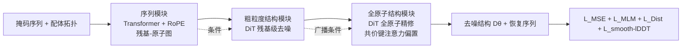

# FlexRibbon: Joint Sequence and Structure Pretraining for Protein Modeling

**会议**: ICLR 2026  
**OpenReview**: [https://openreview.net/forum?id=B8BXHrshMi](https://openreview.net/forum?id=B8BXHrshMi)  
**代码**: [https://github.com/bjzgcai/FlexRibbon](https://github.com/bjzgcai/FlexRibbon)  
**领域**: 计算生物学 / 蛋白质基础模型  
**关键词**: 蛋白质基础模型, 序列-结构联合预训练, 扩散模型, 掩码语言模型, 抗体设计, single-sequence  

## 一句话总结
FlexRibbon 用「掩码语言建模 + 扩散去噪」把氨基酸序列和三维结构在预训练阶段**双向**绑在一起，不依赖 MSA，在抗体/纳米抗体 CDR、多肽界面、蛋白-配体对接、功能注释等 12 个任务上刷新 SOTA，尤其在高突变、低同源场景下显著超越 AlphaFold 这类 MSA 方法。

## 研究背景与动机

**领域现状**：蛋白质基础模型 (PFM) 主要分两条线。一是序列语言模型 (ESM-2、ProtT5)，在海量序列上学通用表示，便宜通用，但缺三维几何先验；后续工作往序列编码器里"注入"结构信号（几何特征、模板/图编码、从结构预测器蒸馏表示），但本质仍是序列中心，结构只是辅助信号，不被生成式、双向地建模。二是 MSA 结构预测器 (AlphaFold 2/3)，靠进化耦合精准折叠。

**现有痛点**：MSA 方法严重依赖同源序列。当比对浅、稀疏或被大量突变破坏时（抗体 CDR 环、内在无序界面、快速演化病原体），预测信号急剧退化。而现有"序列+结构"模型大多是**单向**的 sequence→structure 映射，无法做序列-结构协同设计；联合模型又因全原子表示显存开销巨大难以放大，参数最终堆在序列侧。

**核心矛盾**：既要在 single-sequence（无 MSA）下保持高精度，又要让结构表示像序列表示那样可规模化，同时支持双向预测与设计——三者难以兼得。

**本文目标**：训练一个 30 亿参数、直接从序列与大规模结构语料（PDB 实验结构 + AFDB 预测结构）学习的蛋白基础模型，统一结构预测与设计，并在高突变区域稳定可靠。

**核心 idea**：**[双向序列-结构预训练]** 把扩散去噪（结构生成）与掩码语言建模（序列恢复）耦合成一个统一目标，让模型学会"看结构猜序列、看序列生结构"的双向映射；**[分层结构建模]** 用序列模块→粗粒度结构模块→全原子结构模块的三级架构，把可扩展容量同时分配给序列和结构，破解全原子显存瓶颈。

## 方法详解

### 整体框架
FlexRibbon 把每个残基表示成"序列身份 + 结构上下文"的单一嵌入，架构分三级流水：序列模块统一编码蛋白残基与小分子原子语义；粗粒度结构模块在残基级/原子级用 DiT 去噪坐标，建立全局组织；全原子结构模块把粗粒度结果广播到每个原子做精修，输出化学一致的高分辨率坐标。训练目标把扩散去噪损失和掩码恢复绑在一起（SIMLM），采样即逆扩散过程。

### 关键设计

**1. 扩散预训练：把结构生成变成去噪打分。** 结构 $R\in\mathbb{R}^{3N}$ 用所有重原子坐标表示，沿用 Karras (EDM)/AlphaFold 3 的方差爆炸过程把数据分布与高斯噪声连起来：$R_t = R_0 + \sigma_t\epsilon,\ \epsilon\sim\mathcal{N}(0,I)$，$\sigma_t$ 随 $t$ 增大。采样即反转该过程，需要学打分函数 $\nabla\log p_t$，用网络 $D_\theta(R,t)$ 参数化为 $s_\theta(R,t)=\frac{D_\theta(R,t)-R}{\sigma_t^2}$，于是训练退化为加权去噪损失 $\min_\theta \mathbb{E}\,w_t\lVert D_\theta(R_t,t)-R_0\rVert^2$。为保证刚体不变性，作者把结构质心居中去掉平移自由度，用随机 SO(3) 旋转做数据增强来实现旋转不变，而**不**用笨重的 SO(3)-等变架构（后者还会引入不想要的反射对称），也放弃了对训练稳定性无益、反而有采样风险的 alignment-based 目标。

**2. 三级分层架构：让结构容量真正可扩展。** 序列模块用带 RoPE 的标准 Transformer 纯编码序列语义，并对小分子用一个小 MLP 从原子类型嵌入产生二维键特征矩阵，从原子身份直接恢复共价键模式（而非手工键编码），形成残基-原子图后再经 pair-feature 更新建模残基间/残基-原子相互作用。粗粒度结构模块用 Diffusion Transformer (DiT) 在残基级（蛋白）和原子级（配体）去噪坐标，以序列模块嵌入为条件。全原子结构模块再用一个 DiT 显式表示每个原子，把粗粒度输出广播为残基级条件指导，并对共价键相连的原子对加入"原子类型+键类型"的可学习注意力偏置以保证化学合法性。这种"先粗后细"的分配让结构侧也能像序列侧一样吃下规模，破解了过去全原子模型的显存瓶颈。

**3. 结构感知掩码语言模型 SIMLM：三种模式逼出双向依赖。** 核心思想是被掩码的残基既要从周围序列相关性推断，也要反映其结构上下文。作者把 MLM 与扩散通过三种互补训练模式融合：Mode 1（序列→结构）用干净序列条件生成带噪结构，是标准单向重建；Mode 2（局部耦合扰动）对随机 15% 残基同时掩码氨基酸类型并对其局部结构加扩散噪声，其余不动；Mode 3（全局扰动）随机掩 15% 残基类型的同时对**所有**残基结构加噪。模型在单向映射、局部联合扰动、全局扰动间交替，从而稳健学到序列↔结构的双向关系，捕捉演化与功能背后的结构约束与可变性。

**4. 四项损失 + 三阶段课程 + 置信加权。** 总损失 $L = L_{\text{MSE}} + L_{\text{MLM}} + L_{\text{Dist}} + L_{\text{smooth-lDDT}}$：扩散去噪、掩码残基恢复、残基间距离正则（维持真实三级结构几何）、smooth-lDDT（对齐常用结构质量指标、强调局部几何）。训练分三阶段递进：Stage A 除 $L_{\text{MLM}}$ 外全开、限长 384 残基（推迟 MLM 避免早引入的不稳定，先学核心结构规律）；Stage B 扩到 768 残基并引入 $L_{\text{MLM}}$ 稳定联合优化；Stage C 进一步扩到 1024 残基并训练置信头，学习校准的残基级不确定性。全程用 pLDDT 派生的 sigmoid 权重做**置信加权扩散损失**，给低置信结构区域降权、给可靠信号加权，从而从 AF2 预测结构里榨取有用信号又不过拟合不可靠几何。采样按 Eq. (3) 模拟逆过程，因损失里没用方向对齐，故不在每步做随机旋转，模型学到相对输入的正确输出朝向。

## 实验关键数据

预训练数据：AFDB + PDB（2021-09-30 之前发布）。下游分三大任务族共 12 个任务，测试集蛋白链与训练集序列同一性 ≤ 40%。

### 主实验：柔性界面预测与设计

结构预测成功率（DockQ ≥ 0.23 的成功率 SR）：

| 复合体 | 关键对比 | FlexRibbon | 绝对提升 |
|---|---|---|---|
| 抗原-抗体 | vs IgGM | **61.3%** | +14.6% |
| 抗原-纳米抗体 | vs IgGM | **51.1%** | +7.1% |
| 蛋白-多肽 | vs AF3 / PepGLAD | **91.4%** | +7.0% / +10.2% |

抗体/纳米抗体设计（输入抗原序列+结构，设计全部 CDR 并生成复合体）：

| 方法 | 抗体 H3-AAR | 抗体 DockQ | 抗体 SR | 纳米 H3-AAR | 纳米 DockQ | 纳米 SR |
|---|---|---|---|---|---|---|
| dyMEAN | 0.294 | 0.079 | 0.049 | - | - | - |
| DiffAb (AF3) | 0.226 | 0.208 | 0.368 | 0.156 | 0.211 | 0.346 |
| IgGM | 0.360 | 0.246 | 0.433 | 0.183 | 0.267 | 0.415 |
| **FlexRibbon** | **0.414** | **0.273** | **0.460** | **0.218** | **0.244** | **0.437** |

### 分子间相互作用与功能预测

蛋白-配体对接（PoseBusters V1，口袋对齐 RMSD < 2 Å）：FlexRibbon 作为 single-sequence 模型 random-1 达 **71.82%**、oracle 达 **78.70%**，大幅超越所有 single-sequence 基线并逼近 MSA 方法。

配体诱导构象变化（Apo/Holo）：zero-shot 下 TM-ens **0.889**（比 ESMDiff +0.038），加配体引导再 +0.012；腺苷酸激酶 apo/holo 两态 TM-score 达 0.985/0.984。

结合亲和力（CASF-2016）与功能注释（EC/GO，F1）：

| 亲和力 CASF-2016 | RMSE↓ | R↑ | | 功能 | EC | GO-BP | GO-MF | GO-CC |
|---|---|---|---|---|---|---|---|---|
| SPIN | 1.258 | 0.826 | | ESM-2-3B | 0.863 | 0.476 | 0.659 | 0.497 |
| **FlexRibbon** | **1.150** | **0.848** | | ESM-GearNet | 0.890 | 0.488 | 0.681 | 0.464 |
| | | | | **FlexRibbon** | **0.891** | **0.539** | **0.694** | **0.560** |

置信头（CASP15）：预测 pTM 与真实 TM-score 的 Pearson R = **0.89**；单体结构预测 TM-score **0.703**，超 ESMFold/ESM3 各 +0.019/+0.030。

### 关键发现
- 联合双向预训练的优势在**高突变/低同源**场景最突出（抗体 CDR、纳米抗体、快速演化抗原），正好是 MSA 方法的盲区。
- 同一个预训练模型横跨"折叠预测 + 设计 + 对接 + 亲和力 + 功能"5 类任务都拿 SOTA，说明序列-结构联合预训练的迁移性远超蛋白折叠本身。
- 配体上下文对构象建模有实质帮助（+0.012 TM-ens），验证了把小分子原子纳入统一表示的价值。

## 亮点与洞察
- **把扩散和 MLM 真正"焊"在一起**：SIMLM 的三模式设计（单向/局部耦合/全局扰动）是让双向依赖落地的关键，比简单多任务叠加更逼模型学结构-序列互推。
- **single-sequence 路线追平 MSA**：在对接上 single-sequence 模型逼近 AlphaFold 3，对低同源、突变密集的真实药物/抗体场景意义重大。
- **分层架构 + 置信加权**是工程上的两个聪明点：前者让全原子结构表示可扩展，后者让大规模 AF2 预测结构（噪声大）能被安全利用。

## 局限与展望
- 没有 confidence head 用于对接排序，所以报 random-1 而非 top-1，实际部署需要可靠的样本筛选（oracle 与 random-1 差 ~7% 说明排序还有空间）。
- 3B 参数 + 全原子扩散训练成本高，三阶段课程也增加了调参复杂度；可扩展性虽好但门槛不低。
- 评测仍以 ≤40% 序列同一性切分，真实"完全新折叠/远超分布"泛化、以及多链超大复合体（>1024 残基）的表现待验证。
- 抗体设计 AAR 绝对值仍偏低（CDR-H3 ~0.41），离"可直接湿实验下单"还有距离。

## 相关工作与启发
- **序列 PFM**：ESM-2、ProtT5 提供通用嵌入但缺几何；ESM-3 统一序列/结构/功能、DPLM-2 用结构 tokenization 做扩散——FlexRibbon 选择不 tokenize 结构而直接全原子扩散，是另一条技术路线。
- **MSA 预测器**：AlphaFold 2/3 是精度标杆但受限于同源信号；FlexRibbon 证明 single-sequence + 联合预训练可在难场景超越它。
- **抗体设计**：DiffAb、dyMEAN、IgGM 等用扩散/等变网络做 CDR 协同设计，FlexRibbon 把这一能力纳入通用基础模型而非专用模型，启发"用一个 PFM 覆盖预测+设计"的范式。
- **启发**：对低资源/高变异领域，与其堆同源信息，不如让模型在预训练阶段学会序列与结构的双向因果；置信加权地利用"伪标签结构"（AF2 预测）是放大结构数据规模的实用技巧。

## 评分
- **新颖性**: ⭐⭐⭐⭐ — SIMLM 把 MLM 与扩散三模式耦合实现双向序列-结构预训练，加分层全原子架构，思路清晰且不落 tokenization 俗套。
- **实验充分度**: ⭐⭐⭐⭐⭐ — 12 个任务跨预测/设计/对接/亲和力/功能，对比 MSA 与 single-sequence 双阵营基线，证据扎实。
- **写作质量**: ⭐⭐⭐⭐ — 动机—方法—实验逻辑顺畅，三模式与三阶段课程讲得清楚；部分工程细节压在附录。
- **价值**: ⭐⭐⭐⭐⭐ — 在 MSA 失效的高突变场景（抗体/纳米抗体/快速演化抗原）给出可用的通用基础模型，对药物与抗体设计有直接落地价值。

<!-- RELATED:START -->

## 相关论文

- [\[ICLR 2026\] A Joint Diffusion Model with Pre-Trained Priors for RNA Sequence-Structure Co-Design](a_joint_diffusion_model_with_pre-trained_priors_for_rna_sequence-structure_co-de.md)
- [\[ICLR 2026\] SynCoGen: Synthesizable 3D Molecule Generation via Joint Reaction and Coordinate Modeling](syncogen_synthesizable_3d_molecule_generation_via_joint_reaction_and_coordinate_.md)
- [\[ICLR 2026\] PRISM: Enhancing Protein Inverse Folding through Fine-Grained Retrieval on Structure-Sequence Multimodal Representations](prism_enhancing_protein_inverse_folding_through_fine-_grained_retrieval_on_struc.md)
- [\[ICLR 2026\] AntigenLM: Structure-Aware DNA Language Modeling for Influenza](antigenlm_structure-aware_dna_language_modeling_for_influenza.md)
- [\[ICML 2026\] Protein Autoregressive Modeling via Multiscale Structure Generation](../../ICML2026/computational_biology/protein_autoregressive_modeling_via_multiscale_structure_generation.md)

<!-- RELATED:END -->
