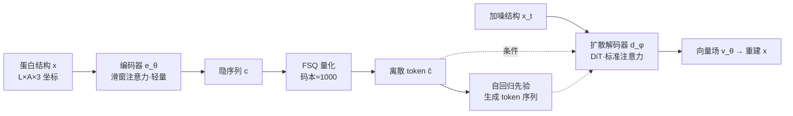

# Flow Autoencoders are Effective Protein Tokenizers

**会议**: ICLR 2026  
**OpenReview**: [https://openreview.net/forum?id=5p9uled7JM](https://openreview.net/forum?id=5p9uled7JM)  
**代码**: 开源软件包（独立仓库，论文中提供）  
**领域**: 计算生物学 / 蛋白质结构生成  
**关键词**: 蛋白质结构 tokenizer, 流匹配, 自编码器, FSQ 量化, 自回归生成  

## 一句话总结
本文提出 Kanzi——一个用流匹配损失训练的非等变蛋白质结构 tokenizer，用一个扩散解码器加一个 FSQ 量化瓶颈，替换掉传统 tokenizer 里那套 SE(3)-不变模块和繁杂损失，以 1/20 参数量、1/400 训练数据就拿下重建 SOTA。

## 研究背景与动机
**领域现状**：把连续的三维蛋白质结构 $x\in\mathbb{R}^{L\times A\times 3}$（$L$ 为残基长度、$A$ 为骨架原子数）离散成有限词表里的 token，是构建蛋白质序列-结构-功能多模态大模型（如 ESM3、DPLM2）的关键一步。这类 structure tokenizer 普遍沿用 AlphaFold2 的范式，依赖 SE(3)-不变的架构组件（invariant point attention）和 SE(3)-不变的损失（frame-aligned point error），靠显式编码对称性归纳偏置来避免模型生成破坏物理对称的结构。

**现有痛点**：这些不变模块虽然原理上"安全"，但难以在大规模下优化、难以扩展到更丰富的生物分子（带翻译后修饰的蛋白、RNA、DNA），训练管线里堆叠了一大堆复杂的 frame-based 表示与多项不变损失（FAPE、dRMSD、Kabsch、violation 等组合），工程上既笨重又脆弱。

**核心矛盾**：归纳偏置带来的"物理可信"与可扩展性、灵活性之间存在张力。AlphaFold3、Boltz、Proteina 等近期工作已证明在生成任务里抛弃对称性架构反而能更好地扩展——但"非不变 tokenizer 是否可行"这一问题此前没有答案，这类模型根本不存在。

**本文目标**：造出第一个不显式编码空间对称性、却能匹配甚至超越现有 tokenizer 的蛋白结构 tokenizer，并验证它能驱动可设计（designable）的自回归结构生成。

**核心 idea**：**用扩散/流模型当解码器**——把 tokenizer 的重建问题改写成"用离散码本条件一个流匹配模型去重建结构"。这样一来 frame 表示可换成全局坐标、一堆不变损失可换成单一流匹配损失、SE(3)-不变注意力可换成标准注意力，三处简化同时发生。

## 方法详解

### 整体框架
Kanzi 是一个非等变流自编码器：轻量编码器 $e_\theta$ 把原始坐标压成隐序列，经 FSQ 量化瓶颈离散成 token $\hat c$，再用一个更深的扩散 Transformer 解码器 $d_\phi$ 以 $\hat c$ 为条件、对加噪结构做流匹配重建。整套用单一扩散损失端到端训练，无任何辅助损失。训练好后，token 序列可喂给一个自回归先验模型，实现长度无关的结构生成。

### 关键设计
**1. 扩散解码器 + 单一流匹配损失：一损替众损。** 全文的支点是把解码器换成流模型，于是 tokenizer 训练只需最小化一个流匹配目标 $L_{\text{flow}}=\mathbb{E}_{x_1\sim p_{\text{data}},\,x_0\sim\mathcal N(0,1)}\lVert v_\theta(x_t,t,\hat c)-(x_1-x_0)\rVert_2^2$，其中 $\hat c=\mathrm{FSQ}(e_\theta(x))$、$x_t=(1-t)x_0+t x_1$ 是线性插值噪声、回归目标即条件向量场 $u=x_1-x_0$。这一项直接替代了 ESM3/IST 那套 FAPE+violation+dRMSD+binned direction 的损失大杂烩——把"如何度量结构误差"的工程难题，交给扩散模型自己去隐式学习，从根上消除了对 frame 与不变损失的依赖。

**2. 非对称编解码器 + 单流/双流的关键取舍。** 编码器显著小于解码器（更窄更浅，tokenizer 常见做法），并用滑窗注意力（sliding window）只做局部信息混合，为下游自回归建模引入因果友好的偏置；解码器则保持全双向连通、用 RoPE 相对位置编码。一个被作者强调为"决定成败"的细节是：编码器用单流（single stream），而解码器把量化隐变量当 in-context 条件做双流拼接。因为蛋白坐标本身维度极低，双流条件能让梯度高效地穿过浅编码器回传——这与图像领域 FlowMo 的双流编码器设计相反，是低维数据特有的选择。

**3. FSQ 量化 + 直通梯度。** 量化瓶颈采用有限标量量化（FSQ），把连续隐变量离散为 $\hat c=\lfloor \ell/2\rfloor\tanh(\mathrm{Linear}(c))$，每维取 $\ell=8,5,5,5$ 个 level，等效码本约 1000。梯度用标准直通估计器（straight-through estimator）传回编码器。作者观察到一个有趣现象：训练初期原始坐标高度相关导致码本利用率很低，但**码本利用率会随长时训练自发涌现**地铺开变高，无需额外的负载均衡损失。

**4. 共享 adaLN + 推理期灵活采样。** 与标准 DiT 不同，Kanzi 在所有 DiT block 间共享 adaLN 的时间条件权重，参数量直降约 30%。由于解码器是连续流模型，推理时可享受图像扩散的全套技巧：闭式 score 场 $s_\theta=\tfrac{t v_\theta(x_t,t,\hat c)-x_t}{1-t}$、分类器无关引导 $\tilde v_\theta=v_\theta(x_t,t,\hat c)+g\big(v_\theta(x_t,t,\hat c)-v_\theta(x_t,t,\varnothing)\big)$（训练时以 0.1 概率 mask 条件以启用），以及把噪声尺度 $\gamma$、score 尺度 $\eta$ 当超参数调的 ad hoc SDE 采样器——这是离散/自回归 tokenizer 难以企及的灵活度。

## 实验关键数据

### 主实验表格
Cα 重建（CAMEO / CATH / AFDB，RMSD↓ / TM↑），Kanzi 以远小的规模匹配或超越大模型：

| 模型 (参数量) | CAMEO RMSD | CATH RMSD | AFDB RMSD | AFDB TM |
|---|---|---|---|---|
| DPLM2 (118M) | 1.651 | 1.641 | 4.676 | 0.810 |
| ESM3 (648M) | 0.860 | 1.048 | 2.384 | 0.915 |
| IST (11M) | 1.637 | 1.201 | 2.872 | 0.862 |
| bio2token (1.1M) | 1.076 | — | 1.212 | 0.932 |
| **Kanzi (30M)\*** | **0.817** | **0.953** | **0.870** | **0.962** |
| Kanzi (11M)\* | 0.863 | 0.994 | 0.994 | 0.952 |

> 注：\* 采样设 $\eta=0.45,\gamma=1.0,g=2.0$，且该设定刻意"欠优化"（仅在 100 条 AFDB 子集上调过）。Kanzi 用约 ESM3 的 1/20 参数、1/400 训练数据，AFDB 上 RMSD/TM 全面领先。

### 消融实验表格
生成评测（自回归先验，Designability↑ / scRMSD↓）：

| 模型 (参数量) | Designability | scRMSD | scTM | α% |
|---|---|---|---|---|
| ESM3-AR (300M) | 0.520 | 4.252 | 0.804 | 38.6 |
| DPLM2-AR (300M) | 0.320 | 8.989 | 0.706 | 41.2 |
| Kanzi-AR (250M), $\eta=0$ | 0.328 | 4.210 | 0.724 | 71.9 |
| Kanzi-AR (250M), $\eta=0.66$ | 0.562 | 3.781 | 0.795 | 88.7 |
| **Kanzi-AR (250M), $\eta=0.66$ + BoN** | **0.617** | **3.655** | 0.807 | 88.2 |

### 关键发现
- **编码器需要 token mixing 才能生成，但重建不需要**：把编码器窗口缩到 0（即逐点 MLP）仍能给出好重建，却严重损害下游生成质量——说明重建与可生成性是两个不同目标。
- **best-of-N（$N=2$，用对数似然当 reward proxy）** 进一步提升设计性，证明自回归先验学到了有意义的分布。
- Kanzi-AR 是已知**首个无需海量预训练就能产出可设计结构的 tokenized 模型**；但它倾向过度预测 α 螺旋（合成数据依赖的已知通病），且尚未追平连续扩散 SOTA。
- 引入 **rFPSD**（重建 Fréchet 蛋白结构距离）这一分布级重建指标，揭示了"强重建≠强生成"——DPLM2 重建不如 ESM3，rFPSD 却更好。

## 亮点与洞察
- **"换解码器"四两拨千斤**：把 tokenizer 的难点从"设计正确的不变损失"转移到"让扩散解码器隐式学结构分布"，一举消掉 frame 表示、不变损失、不变注意力三座大山，工程极简且更易扩展。
- **非不变路线的独特价值被实证**：在 cryoET 体积图条件生成这类"条件信号本身就非不变"的任务上，其他不变 tokenizer 直接崩溃，而 Kanzi token 天然可用。
- 低维数据下"双流条件解码器 + 单流编码器"这个反直觉取舍，是让浅编码器梯度可学的关键，给后来者省了踩坑。

## 局限与展望
- 生成质量虽超同类 tokenized 模型，但仍**落后于连续扩散 SOTA**；过度预测 α 螺旋需要额外后训练修正（留作未来工作）。
- 训练数据**全为合成结构**（Foldseek 聚类的 AFDB，约 49.9 万条），分布偏置可能传导到生成。
- 滑窗/全注意力、绝对/相对位置编码等在编码器侧的取舍仍较经验化；非不变编码器在残基级表示任务上仍逊于不变 tokenizer。

## 相关工作与启发
- **图像流自编码器**（FlowMo、DiTo）证明用扩散解码器可省去 VQGAN 的感知+对抗损失组合，本文是把这一思路首次迁移到蛋白结构。
- **抛弃对称性的生成模型**（AlphaFold3、Proteina、Boltz）为"非不变也能 scale"提供先验信心，Kanzi 把这一判断延伸到 tokenization 环节。
- 对做多模态生物大模型的人：一个可扩展、易训练、还能吃非不变条件信号的结构 tokenizer，意味着结构模态可以更轻地接进语言模型。

## 评分
- 新颖性: ⭐⭐⭐⭐ — 首个非不变流自编码器蛋白 tokenizer，"换解码器消损失"的迁移虽借鉴图像领域，但在蛋白结构上是开创性的，并解决了"非不变 tokenizer 不存在"的空白。
- 实验充分度: ⭐⭐⭐⭐ — 5 个held-out 测试集 + Cα/全骨架双设定 + 重建/生成/表示三类任务 + 系统消融 + 新指标 rFPSD，覆盖很全；略欠真实（非合成）大规模训练验证。
- 写作质量: ⭐⭐⭐⭐ — 动机清晰、简化叙事有说服力，图 2/图 4 把架构与"简化损失管线"讲得很直观。
- 价值: ⭐⭐⭐⭐ — 以极小算力拿下重建 SOTA、首个无海量预训练即可生成可设计结构的 tokenized 模型，对多模态生物建模有直接落地意义。

<!-- RELATED:START -->

## 相关论文

- [\[ICLR 2026\] ProteinAE: Protein Diffusion Autoencoders for Structure Encoding](proteinae_protein_diffusion_autoencoders_for_structure_encoding.md)
- [\[ICLR 2026\] La-Proteina: Atomistic Protein Generation via Partially Latent Flow Matching](la-proteina_atomistic_protein_generation_via_partially_latent_flow_matching.md)
- [\[ICLR 2026\] Riemannian Variational Flow Matching for Material and Protein Design](riemannian_variational_flow_matching_for_material_and_protein_design.md)
- [\[ICLR 2026\] Low rank adaptation of chemical foundation models generate effective odorant representations](low_rank_adaptation_of_chemical_foundation_models_generate_effective_odorant_rep.md)
- [\[ICLR 2026\] Extending Sequence Length is Not All You Need: Effective Integration of Multimodal Signals for Gene Expression Prediction](extending_sequence_length_is_not_all_you_need_effective_integration_of_multimoda.md)

<!-- RELATED:END -->
