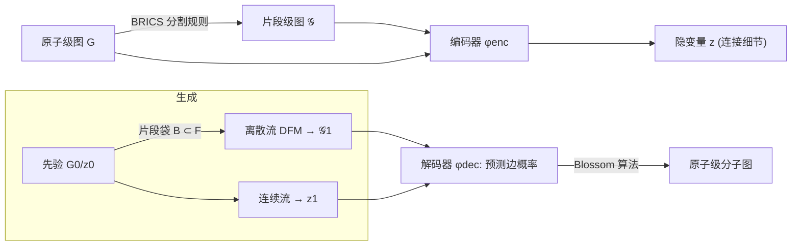

# FragFM: Hierarchical Framework for Efficient Molecule Generation via Fragment-Level Discrete Flow Matching

**会议**: ICLR 2026  
**OpenReview**: [https://openreview.net/forum?id=tr6vRn2aPg](https://openreview.net/forum?id=tr6vRn2aPg)  
**代码**: [https://github.com/lee-jwon/FragFM](https://github.com/lee-jwon/FragFM)  
**领域**: 计算生物学 / 分子图生成  
**关键词**: 分子生成, 片段级生成, 离散流匹配, 粗到细自编码器, 天然产物基准  

## 一句话总结
FragFM 把分子生成搬到"化学片段"这一更高层次：用离散流匹配在片段级图上采样，再用粗到细自编码器无损还原到原子级；配合"随机片段袋"策略绕开固定片段词表的限制，在更少去噪步数下生成更大、更真实、更可控的分子。

## 研究背景与动机
- **领域现状**：扩散/流匹配类图生成模型近年在 de novo 分子图生成上取得显著进展（DiGress、DeFoG、Cometh 等），有望加速药物与材料发现。
- **现有痛点**：这些模型几乎都建立在**原子级表示**上，面临严重的可扩展性瓶颈——边数随图规模二次增长，而化学键本身稀疏，导致边预测困难、易生成非法连接；GNN 又难以捕捉环等拓扑结构，常偏离化学合理性。
- **核心矛盾**：片段级生成本是更优解（保全局结构、好控性质、贴近真实药物化学），但已有片段法要么依赖**小而固定的片段词表**，严重限制化学空间覆盖与领域知识注入，要么用纯数据驱动的自动分割（如 BPE），无法利用合成导向的化学分割先验。
- **本文目标**：在片段级做生成的同时，既能**处理超大片段词表**、又能**无损还原原子级连接**，并在大分子（如天然产物）上保持效率与质量。
- **核心 idea**：**【片段级离散流匹配 + 粗到细自编码器 + 随机片段袋】**——把"用哪些片段"交给一个可泛化到未见片段的 GNN 嵌入 + Info-NCE 对比学习，把"片段如何拼回原子"交给自编码器 + Blossom 算法，从而在可控算力下探索庞大的片段空间。

## 方法详解

### 整体框架
FragFM 由两条主线构成：(i) 一个**粗到细自编码器**把原子级图 $G$ 压成片段级图 $\mathcal{G}$ 加一个连续隐变量 $z$（$z$ 记录片段内/片段间的精细连接信息）；(ii) 在 $X=(\mathcal{G}, z)$ 上做联合流匹配——离散流匹配（DFM）生成片段类型与片段间边，连续流匹配生成 $z$。生成完后，解码器先预测所有候选原子-原子边的概率，再用 Blossom 算法挑出最大似然的边集，无损重建原子级分子。

### 关键设计

**1. 粗到细自编码器：把"片段→原子"的歧义封进一个隐变量。** 片段级图虽是更高层抽象，但一个片段级连接 $\mathcal{E}$ 可能对应多种合法的原子级配置，直接生成会丢连接信息。FragFM 用预定义化学分割规则（如 BRICS）把 $G$ 转成 $\mathcal{G}$，再用神经网络把 $(G,\mathcal{G})$ 编码成单个连续隐变量 $z$ 来"提交"那些无法从 $\mathcal{G}$ 读出的原子连接：$G \xrightarrow{\text{Rule}} \mathcal{G},\ (G,\mathcal{G})\xrightarrow{\phi_{enc}} z$。解码端给定 $(\mathcal{G}, z)$ 先输出相邻片段间所有候选原子边的连续打分，再用 **Blossom 最大匹配算法**（Edmonds 1965）把打分离散成合法连接 $\mathcal{E}$。这套自编码器在标准基准上达到 **>99% 键级重建精度**，保证片段级生成可以端到端无损落回原子级。

**2. 片段类型的掩码式 DFM + Info-NCE 损失：用对比学习近似巨大词表上的后验。** 真实化学空间的片段词表 $|F|$ 极大，对整个空间直接建 CTMC 在计算上不可行。FragFM 采用**掩码版 DFM**——节点一旦解掩码就固定不再变——并把片段类型的预测重写成密度比估计：用网络 $f_\theta(X_t, x)$ 去逼近 $p_{1|t}(x|X_t)/p_1(x)$。训练时每步构造一个袋 $B$，含 1 个正样本片段 $x_1^+\sim p_{1|t}(x_1|X_t)$ 与 $N-1$ 个从边缘分布 $p_1(x)$ 采的负样本，袋内后验写作 $p_{1|t}(x\mid X_t, B)=\dfrac{\mathbb{1}_B(x)\,p_{1|t}(x|X_t)/p_1(x)}{\sum_{y\in B} p_{1|t}(y|X_t)/p_1(y)}$，并用标准 Info-NCE 损失 $\mathcal{L}(\theta)=-\mathbb{E}_B\big[\log \frac{f_\theta(X_t,x^+)}{\sum_{y\in B} f_\theta(X_t,y)}\big]$ 训练。关键在于损失只涉及袋内的 $x\in B$，**计算成本随 $N$ 而非 $|F|$ 线性增长**；又因为片段嵌入由 GNN 给出，模型天然能泛化到训练时未见的片段。

**3. 随机片段袋的"袋内转移核"：把全集期望近似成袋内期望，兼顾保真与算力。** 标准 DFM 采样时，一步转移核需要对全片段集 $F$ 上 $x_1$ 条件的速率矩阵求期望；FragFM 改成只在随机子集 $B\subset F$ 上做。袋内 $x_1$ 后验为 $p^\theta_{1|t,B}(x_1|X_t,B)=\dfrac{\mathbb{1}_B(x_1) f_\theta(X_t,x_1)}{\sum_{y\in B} f_\theta(X_t,y)}$，由此诱导出袋条件前向核 $p^\theta_{t+\Delta t|t}(x_{t+\Delta t}|X_t,B)=\mathbb{E}_{x_1\sim p^\theta_{1|t,B}}\big[p_{t+\Delta t|t}(x_{t+\Delta t}|X_t,x_1)\big]$。这是对无袋核的实用代理：当袋大小 $N\to|F|$ 时收敛到精确核，而 $\Delta t$ 小、$N$ 适中时偏差可忽略、算力可控。

**4. 双条件引导：片段袋重加权 + classifier guidance 联合控性质。** 朝目标性质 $c$ 引导时有两处入口：其一，构造袋 $B$ 时用性质预测器 $p_{\psi_{prop}}(c|x)$ 配合可调的**片段袋重加权参数 $\lambda_B$** 来偏置候选片段采样，使袋本身就富含符合目标的片段；其二，转移核里再叠加引导强度 $\lambda_X$（沿用 DiGress 的 classifier guidance），形成多条件核。两条入口让 FragFM 比纯原子级 classifier guidance 多出一个"在词表层面提前筛选"的控性质杠杆。

## 实验关键数据

### 主实验表格

MOSES 标准基准（25,000 生成分子，越右越好的指标已标注箭头）：

| 模型 | 表示层级 | Valid↑ | Novel↑ | Filters↑ | FCD↓ | SNN↑ |
|---|---|---|---|---|---|---|
| JT-VAE | 片段(图) | 100.0 | 99.9 | 97.8 | 1.00 | 0.53 |
| SAFE-GPT | 片段(序列) | 98.1 | 90.9 | 98.2 | 0.71 | 0.54 |
| DiGress | 原子(图) | 85.7 | 95.0 | 97.1 | 1.19 | 0.52 |
| DeFoG | 原子(图) | 92.8 | 92.1 | 98.9 | 1.95 | 0.55 |
| **FragFM** | 片段(图) | **99.8** | 87.1 | **99.1** | **0.58** | **0.56** |

FragFM 无需显式合法性约束即接近 100% Valid（与强制约束的 JT-VAE 相当），FCD 0.58 大幅领先所有 baseline。

NPGen 天然产物基准（30,000 生成分子，平均重原子数 35.0，远大于 MOSES 21.7）：

| 模型 | 表示层级 | Val.↑ | Novel↑ | NP-likeness KL↓ | FCD↓ |
|---|---|---|---|---|---|
| JT-VAE | 片段(图) | 100.0 | 99.5 | 0.5437 | 4.07 |
| SAFE-GPT | 片段(序列) | 96.5 | 73.5 | 0.0024 | 0.15 |
| DiGress | 原子(图) | 85.4 | 99.9 | 0.1957 | 2.05 |
| DeFoG | 原子(图) | 85.9 | 99.2 | 0.1550 | 4.46 |
| **FragFM** | 片段(图) | **98.0** | 95.4 | **0.0374** | **1.34** |

在图模型中 FragFM 于功能性指标（NP-likeness、NP-Classifier KL）全面领先，且采样比 DiGress **快约 5×**。

### 消融实验表格

| 维度 | 设置/发现 |
|---|---|
| 去噪步数鲁棒性 | 减少去噪步数时性能仍稳健，体现片段级生成的效率优势 |
| 片段袋大小 $N$ | $N$ 越大越接近精确核；适中 $N$ 即可在保真与算力间取得平衡（附录 C.6） |
| 分割规则 | 对比不同 fragmentation rule（如 BRICS 等）的影响（5.5 节） |
| 词表可替换性 | 装上 test-set 片段词表后可泛化生成未见 scaffold（GNN 嵌入支撑，附录 C.4） |
| 自编码器重建 | >99% 键级重建精度，验证片段→原子的无损性（附录 C.3） |

### 关键发现
- **片段级 + 大词表可并存**：随机片段袋 + Info-NCE 把成本从 $O(|F|)$ 降到 $O(N)$，首次让片段法不必受限于小固定词表。
- **大分子上优势放大**：在天然产物这类大而复杂的分子上，FragFM 相对原子级扩散/流模型的领先幅度比小分子基准更大。
- **新颖性的权衡**：MOSES Scaf 与 Novelty 偏弱源于固定词表 + scaffold-split 协议（测试集未见 scaffold 无法生成），但可通过简单改动用保真换新颖性。

## 亮点与洞察
- **把"词表规模"从瓶颈变成可调旋钮**：用对比学习的密度比 + 袋内采样，巧妙地把"在巨大离散空间上建 CTMC"这个不可行问题，转化为随袋大小线性扩展的可行问题。
- **粗到细自编码器解决了片段法的老大难**——片段级连接到原子级的多义性，用一个连续隐变量 $z$ + Blossom 离散化干净地封住，重建精度 >99%。
- **NPGen 基准本身是贡献**：现有 MOSES/GuacaMol 指标趋于饱和且偏向小分子，NPGen 用 COCONUT 的 65.8 万天然产物把评测推向更大、更难、更贴近真实药物发现的区域。
- **双重控性质杠杆**：片段袋重加权让"控性质"在词表层面就开始，比纯原子级引导多一层粒度。

## 局限与展望
- **仍依赖固定片段词表生成**：unseen scaffold 若不在词表中就无法直接生成（与 JT-VAE 同病），虽可换词表缓解但需额外步骤。
- **新颖性偏弱**：在 scaffold-split 协议下 Novelty/Scaf 指标不占优，存在保真-新颖性的内在权衡。
- **分割规则敏感性**：性能依赖 BRICS 等化学分割规则的选择，不同规则会改变片段空间结构。
- **展望**：把可替换词表与动态片段发现结合、扩展到 3D 构象与靶向药物设计，是自然的下一步。

## 相关工作与启发
- **原子级图扩散/流**：DiGress、DisCo、Cometh、DeFoG——FragFM 正是为绕开它们的二次边复杂度与边稀疏问题而生。
- **片段级生成**：JT-VAE（先粗图后补全）、HierVAE、SAFE-GPT（片段序列）、Levy & Rector-Brooks（固定片段集）、Chen et al.（BPE 分割）——FragFM 用 GNN 嵌入 + 随机袋突破"固定/小词表"限制。
- **层级生成**：MolGrow、MolHF（层级 normalizing flow）、Qiang et al.（3D 层级扩散）——FragFM 区别在于用**化学定义的片段**而非数据诱导的粗化子图作为生成单元。
- **启发**：Info-NCE 密度比 + 随机子集采样，是把生成模型扩展到超大离散词表（如 retrieval-augmented / 大词表 token 生成）的一种通用思路，不止限于分子。

## 评分
- **新颖性**: ⭐⭐⭐⭐ 片段级 DFM + 随机片段袋 + Info-NCE 的组合解决了片段法"大词表不可行"的核心难题，思路有原创性；粗到细自编码器虽借鉴层级生成但落地巧妙。
- **实验充分度**: ⭐⭐⭐⭐ 覆盖 MOSES/GuacaMol/ZINC250k/NPGen 多基准 + 条件生成 + 效率 + 多项消融，且自建 NPGen 基准；不足在新颖性指标偏弱已被坦诚讨论。
- **写作质量**: ⭐⭐⭐⭐ 框架清晰、公式与动机衔接好、图 1 概括到位，方法分节合理。
- **价值**: ⭐⭐⭐⭐ 让片段级生成兼得大词表覆盖与原子级无损还原，并提出更难更真实的 NPGen 基准，对药物/材料发现有实际推动力。

<!-- RELATED:START -->

## 相关论文

- [\[ICLR 2026\] La-Proteina: Atomistic Protein Generation via Partially Latent Flow Matching](la-proteina_atomistic_protein_generation_via_partially_latent_flow_matching.md)
- [\[ICLR 2026\] Riemannian Variational Flow Matching for Material and Protein Design](riemannian_variational_flow_matching_for_material_and_protein_design.md)
- [\[ICML 2025\] Efficient Molecular Conformer Generation with SO(3)-Averaged Flow Matching and Reflow](../../ICML2025/computational_biology/efficient_molecular_conformer_generation_with_so3-averaged_flow_matching_and_ref.md)
- [\[ICLR 2026\] Refine Drugs, Don't Complete Them: Uniform-Source Discrete Flows for Fragment-Based Drug Discovery](refine_drugs_dont_complete_them_uniform-source_discrete_flows_for_fragment-based.md)
- [\[ICLR 2026\] Multi-Marginal Flow Matching with Adversarially Learnt Interpolants](multi-marginal_flow_matching_with_adversarially_learnt_interpolants.md)

<!-- RELATED:END -->
