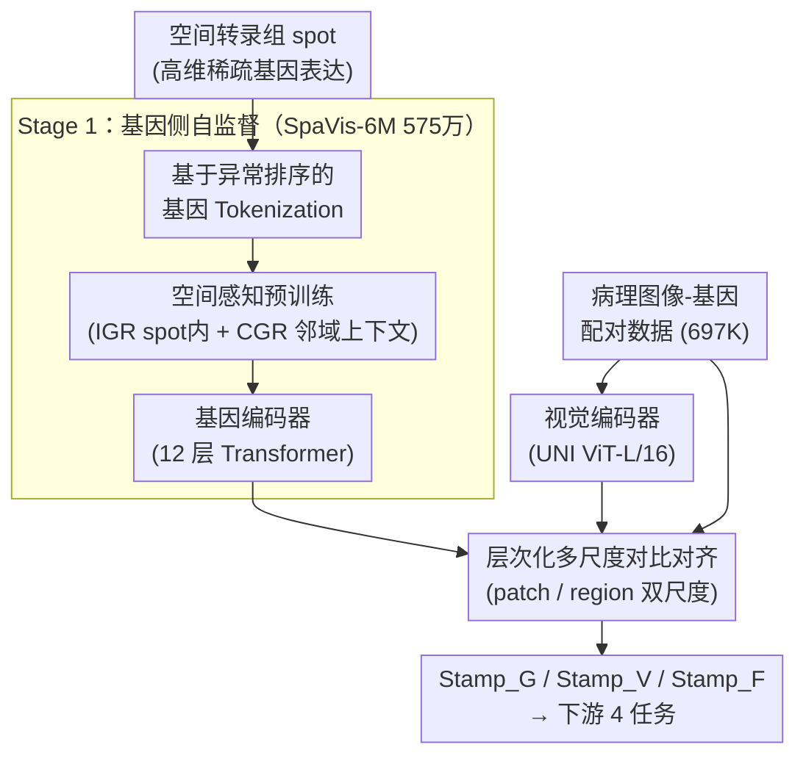

# Fusing Pixels and Genes: Spatially-Aware Learning in Computational Pathology

**会议**: ICLR 2026  
**arXiv**: [2602.13944](https://arxiv.org/abs/2602.13944)  
**代码**: [https://github.com/Hanminghao/STAMP](https://github.com/Hanminghao/STAMP)  
**领域**: 计算生物  
**关键词**: Spatial Transcriptomics, Computational Pathology, Multimodal Pretraining, Gene Expression, Contrastive Learning

## 一句话总结

本文提出 Stamp 框架，利用空间转录组学基因表达数据作为监督信号，通过空间感知基因编码器预训练和层次化多尺度对比对齐，实现病理图像与空间转录组数据的联合表示学习，在 6 个数据集 4 个下游任务上取得 SOTA。

## 研究背景与动机

**领域现状**：计算病理学（Computational Pathology, CPATH）的基础模型正在从单模态（纯视觉自监督预训练）向多模态演进。PLIP、CONCH 等方法通过图像-文本对比学习对齐病理图像与自然语言描述。TANGLE 进一步引入 bulk RNA-seq 基因表达数据来指导全切片图像（WSI）表示学习。

**现有痛点**：自然语言缺乏分子层面的特异性，无法提供深入的病理学监督。例如，"浸润性导管癌"的文本描述无法告诉模型哪些基因通路被激活。Bulk RNA-seq 虽然可提供分子级信息，但它将整个组织切片的基因表达平均化，无法捕捉样本内部的空间异质性（如肿瘤中心与侵袭前沿的基因表达差异巨大）。现有引入空间转录组（Spatial Transcriptomics, ST）的工作存在两个关键限制：(1) 编码方式过于简单（线性层+少量基因），需要对每个新数据集全参数微调视觉骨干；(2) 忽略了 ST 数据固有的空间多尺度结构。

**核心矛盾**：ST 数据同时包含空间位置信息和基因表达信息，具有跨 spot 的强空间依赖性，但现有方法将其当作独立样本对待，直接套用视觉-语言预训练的框架（将每个 spot 视为独立的图像-文本对），浪费了 ST 最独特的优势——空间上下文。

**本文目标** (1) 如何训练一个能感知空间结构的基因编码器？(2) 如何在有限的配对数据下实现病理图像与基因的有效对齐？(3) 如何捕捉病理分析中的多尺度特征？

**切入角度**：作者构建了迄今最大的 10X Visium 空间转录组数据集 SpaVis-6M（575万条），在其上预训练空间感知基因编码器，然后通过层次化多尺度对比对齐与病理视觉编码器联合训练。两阶段策略减少了对配对数据的依赖（仅 697K 配对数据对齐）。

**核心 idea**：通过空间邻域采样和上下文基因重建预训练基因编码器，再通过跨尺度定位和层次对比学习与视觉编码器对齐，实现分子监督驱动的病理图像表示学习。

## 方法详解

### 整体框架

Stamp 要解决的是「怎么用空间转录组的基因表达当监督信号、训练出懂分子又懂空间的病理图像表示」，整个流程分两阶段串起来。**Stage 1（基因侧自监督）**：把每个 spot 的高维稀疏基因表达先转成 token 序列，在 575 万非配对的 SpaVis-6M 上做空间感知预训练，让一个 12 层 Transformer 基因编码器既学会 spot 内的基因共表达、又学会 spot 间的空间依赖。**Stage 2（跨模态对齐）**：拿冻结好的基因编码器，在 697K 病理图像-基因配对数据上，通过层次化多尺度对比对齐把视觉编码器（UNI, ViT-L/16）拉向基因表示。最终产出三种嵌入——基因嵌入 Stamp_G、视觉嵌入 Stamp_V、以及二者融合的 Stamp_F，供下游任务按需取用。

### 关键设计

**1. 基于异常排序的基因 Tokenization：用排名而非数值，让稀疏基因表达对批次效应免疫**

基因表达数据维度高且稀疏，而 ST 来自不同平台、不同切片，绝对表达值受批次效应严重污染，直接喂进 Transformer 既不稳定也浪费稀疏结构。Stamp 的做法是先计算每个基因在所有样本上的平均非零表达水平，把每个样本的表达除以对应均值做归一化；关键一步是**不直接用归一化后的数值**（它仍带批次偏移），而是按归一化偏差从大到小排序，取前 $N=1500$ 个基因的 ID 作为 token 序列：

$$T_i = \{id(ep_i^0), id(ep_i^1), \ldots, id(ep_i^{N-1}) : ep_i^k \geq ep_i^{k+1}\}$$

零表达的基因自然排到末尾、进不了序列。这样"排名比绝对值更稳"——批次效应改变数值大小却不太改变相对排序，所以 token 序列对批次效应天然鲁棒；同时未检测到的基因被自动剔除，稀疏性也被一并消化，序列形式还能无缝接上 BERT 式的掩码建模。

**2. 空间感知预训练（IGR + CGR 双重损失）：让基因编码器既懂 spot 内共表达、又懂 spot 间空间依赖**

现有引入 ST 的工作把每个 spot 当独立样本，丢掉了 ST 最独特的空间上下文。Stamp 先用邻域中心采样策略（Algorithm 2）构建空间连贯的 mini-batch——从一个随机种子 spot 出发，按最近邻迭代把周围 spot 加进来，使一个 batch 里的 spot 在组织上彼此相邻。在这样的 batch 上设两个目标。其一是**内在基因重建 (IGR)**：随机掩码 15% 的 token，用同一 spot 的未掩码 token 把它们重建回来，

$$\mathcal{L}_{IGR} = -\frac{1}{|M|}\sum_{j \in M} \log P(t_{i,j} \mid x_{i,L-1})$$

它逼模型学会基因之间固有的表达关联（如共调控网络）。其二是**上下文基因重建 (CGR)**：用邻域 spot 的聚合特征

$$h_i = \frac{1}{|N(s_i)|}\sum_{k \in N(s_i)} x_{i,L-1}^k$$

来预测中心 spot 被掩码的基因。CGR 背后是一条生物学先验——一个 spot 的转录状态和它的微环境高度相关，于是模型被迫把组织的空间结构编码进表示里。基因编码器本身是 12 层 Transformer。

**3. 层次化多尺度对比对齐：在 patch 与 region 两个尺度上把图像和基因对齐，模拟病理医师放大缩小的读片方式**

直接套用视觉-语言预训练只在单尺度上对齐，忽略了病理分析本就是跨尺度的。对齐阶段同时优化四个损失。**跨尺度 patch 定位 $\mathcal{L}_{CSP}$** 模拟病理医师放大缩小的工作流：把一个 patch 视为某个 $3 \times 3$ region 网格里的子区域，引入一个"pretext token"让同一个共享视觉编码器既能处理 patch 输入又能处理 region 输入，再用 CE 损失预测该 patch 落在 region 的哪个位置，从而显式建立 patch 与 region 的空间关系。**patch-基因对比对齐 $\mathcal{L}_{P-S}$** 与 **region-基因对比对齐 $\mathcal{L}_{R-S}$** 都是标准的 InfoNCE 对称损失，把两个视觉尺度分别拉向对应的基因表达。**patch-region 模态内对齐 $\mathcal{L}_{P-R}$** 在视觉模态内部对齐两个尺度，既扩大视觉编码器的有效感受野、又利用多尺度冗余防止 BERT 式方法常见的表示坍缩。四项合成总对齐损失：

$$\mathcal{L}_{Align} = \mathcal{L}_{CSP} + \mathcal{L}_{P-S} + \mathcal{L}_{R-S} + \mathcal{L}_{P-R}$$

### 损失函数 / 训练策略

基因编码器预训练损失：$\mathcal{L}_{Gene} = \mathcal{L}_{IGR} + \mathcal{L}_{CGR}$，先仅 $\mathcal{L}_{IGR}$ 训练 1 epoch，再加入 CGR 训练 1 epoch。对齐预训练损失：$\mathcal{L}_{Align} = \mathcal{L}_{CSP} + \mathcal{L}_{P-S} + \mathcal{L}_{R-S} + \mathcal{L}_{P-R}$，训练 30 epochs。使用 AdamW 优化器，学习率 $10^{-4}$，4 × A800 GPU。

## 实验关键数据

### 线性探测与无监督聚类（DLPFC + HBC 数据集）

| 模型 | 预训练模态 | DLPFC Bal.Acc | DLPFC ARI | HBC Bal.Acc | HBC ARI |
|------|-----------|-------------|-----------|-------------|---------|
| UNI | 视觉 | 0.544 | 0.144 | 0.859 | 0.499 |
| Hoptimus0 | 视觉 | 0.568 | 0.147 | 0.816 | 0.458 |
| CONCH | 视觉+语言 | 0.454 | 0.124 | 0.704 | 0.406 |
| mSTAR | 视觉+语言+基因 | 0.540 | 0.159 | 0.869 | 0.505 |
| scGPT-Spatial | 基因 | 0.558 | 0.215 | 0.610 | 0.208 |
| **Stamp_G** | 基因 | **0.658** | **0.369** | 0.659 | 0.416 |
| **Stamp_V** | 视觉+基因 | 0.624 | 0.246 | **0.872** | **0.526** |
| **Stamp_F** | 融合 | **0.721** | **0.342** | **0.899** | **0.590** |

Stamp_F 在 DLPFC 上 Bal.Acc 比最强单模态视觉模型 Hoptimus0 高 15.3%，ARI 高 13.3 倍。

### 基因表达预测（PSC、HHK、HER2+ 数据集）

| 方法 | 训练参数量 | PSC MSE↓ | PSC PCC-V↑ | HHK MSE↓ | HER2+ MSE↓ |
|------|-----------|----------|-----------|----------|-----------|
| STNet | 12.08M | 0.330 | 0.110 | 1.357 | 1.190 |
| EGN | 146.02M | 0.345 | 0.094 | 1.321 | 1.112 |
| Stamp (线性探测) | 少量参数 | **最低** | **最高** | **最低** | **最低** |

Stamp 仅通过冻结视觉编码器的线性探测就超越了需全参训练的专用模型。

### 关键发现

- **基因监督显著增强视觉表示**：在 DLPFC 数据集上，用 ST 数据微调后的 PLIP 和 CONCH 在所有聚类指标上大幅提升（ARI 从 0.128 到 0.174），证实分子监督的价值
- **空间上下文的关键作用**：同一架构下，加入 CGR 损失（利用邻域信息）比仅用 IGR 的 Stamp_G† 在 DLPFC ARI 上从 0.233 提升到 0.369（+58%），验证空间感知预训练的必要性
- **跨平台泛化**：虽然仅在 10X Visium 数据上训练，Stamp 在使用不同测序平台的 HER2+ 数据集上同样表现最优，展现了强泛化能力
- **融合嵌入的互补性**：Stamp_G 和 Stamp_V 在不同数据集上各有优势（DLPFC 上基因更强，HBC 上视觉更强），融合后（Stamp_F）在两者上都达到最佳

## 亮点与洞察

- **数据集贡献突出**：SpaVis-6M 是迄今最大的 Visium 空间转录组数据集，覆盖 35 个器官、1982 个切片、262 个数据集/文献，为社区提供了重要资源
- **基因 Tokenization 的巧思**：用排序代替归一化数值，一招解决批次效应和数据稀疏两个问题，且与 BERT 的序列范式自然对接
- **两阶段策略的实用性**：基因编码器在 575 万非配对数据上预训练，对齐阶段仅需 70 万配对数据，大幅降低了对昂贵配对数据的依赖
- **"Pretext Token"设计**：通过一个可学习的 token 使同一视觉编码器在处理 patch 和 region 时切换模式，避免了两套编码器的开销

## 局限与展望

- **分辨率限制**：10X Visium 的 55μm 分辨率对应多个细胞，无法达到亚细胞级精度，可能限制对单细胞层面异质性的捕捉
- **仅限病理图像**：框架专注于 H&E 染色切片，未探索 IHC 或荧光染色等其他成像模态
- **下游任务评估深度有限**：虽然涵盖 4 种任务，但未在临床预后预测或治疗反应预测等临床最相关任务上验证
- **缺乏与更新的视觉骨干对比**：使用 UNI (ViT-L/16) 作为视觉骨干，未与 Virchow2、Hoptimus0 等更新模型作为骨干的结果对比
- **训练成本未充分讨论**：575 万的基因预训练 + 70 万的对齐训练需要的总计算量未报告

## 相关工作与启发

- **vs TANGLE (Jaume et al., 2024)**：TANGLE 使用 bulk RNA-seq 指导 WSI 表示学习，只能捕捉患者级信息。Stamp 使用空间转录组保留了空间异质性，且在 spot 级别对齐而非 WSI 级别
- **vs CONCH (Lu et al., 2024)**：CONCH 对齐图像与文本（117 万配对），但文本缺乏分子特异性。Stamp 用基因表达替代文本监督，在 DLPFC 上 ARI 从 0.124 提升到 0.342
- **vs OmiCLIP (Chen et al., 2025)**：OmiCLIP 将基因特征转化为文本句子再对齐，间接且有信息损失。Stamp 直接在嵌入空间对齐基因与图像，更高效

## 评分

- 新颖性: ⭐⭐⭐⭐ 首次大规模空间转录组-病理图像多模态预训练，空间感知设计有创新
- 实验充分度: ⭐⭐⭐⭐⭐ 6 个数据集、4 种任务、多种评估指标、详尽的消融和对比
- 写作质量: ⭐⭐⭐⭐ 框架清晰，数据和方法描述详细，但符号和公式较密集
- 价值: ⭐⭐⭐⭐⭐ 数据集和方法均有重要贡献，可能推动计算病理学从图文对齐走向图基因对齐的新范式

<!-- RELATED:START -->

## 相关论文

- [\[ICML 2025\] Global Context-aware Representation Learning for Spatially Resolved Transcriptomics](../../ICML2025/computational_biology/global_context-aware_representation_learning_for_spatially_resolved_transcriptom.md)
- [\[ICLR 2026\] I2Mole: Interaction-aware Invariant Molecular Learning for Generalizable Drug-Drug Interaction Prediction](i2mole_interaction-aware_invariant_molecular_learning_for_generalizable_property.md)
- [\[ICLR 2026\] FACET: A Fragment-Aware Conformer Ensemble Transformer](facet_a_fragment-aware_conformer_ensemble_transformer.md)
- [\[ICLR 2026\] RankFlow: Property-aware Transport for Protein Optimization](rankflow_property-aware_transport_for_protein_optimization.md)
- [\[ICLR 2026\] Learning Brain Representation with Hierarchical Visual Embeddings](learning_brain_representation_with_hierarchical_visual_embeddings.md)

<!-- RELATED:END -->
