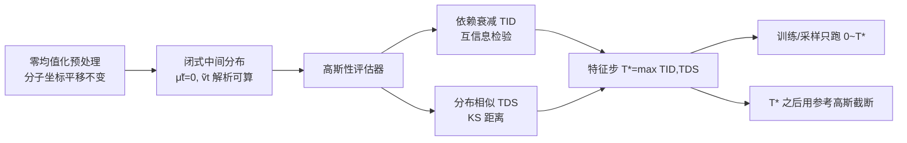

# GAGA: Gaussianity-Aware Gaussian Approximation for Efficient 3D Molecular Generation

**会议**: ICLR 2026  
**OpenReview**: [https://openreview.net/forum?id=Q9gz8lVyAi](https://openreview.net/forum?id=Q9gz8lVyAi)  
**代码**: [https://github.com/QuJX/GAGA](https://github.com/QuJX/GAGA)  
**领域**: 计算生物学 / 3D 分子生成 / 扩散与流匹配加速  
**关键词**: 高斯概率路径生成模型, 3D 分子生成, 轨迹截断, 高斯近似, 训练与采样加速  

## 一句话总结
GAGA 发现 3D 分子数据在前向加噪过程中**远早于图像**就达到了"足够高斯"的状态，于是用统计检验定位这个特征时间步 $T^*$、把它之后的冗余轨迹直接替换成闭式高斯近似，从而在**不改架构、不改噪声调度**的前提下同时加速训练与采样并提升生成质量。

## 研究背景与动机
- **领域现状**：以扩散模型和高斯流匹配为代表的"高斯概率路径生成模型"（Gaussian Probability Path based Generative Models, GPPGMs）在 3D 分子生成上达到 SOTA，其本质是把一个简单高斯先验沿着概率路径平滑变换回数据分布。
- **现有痛点**：这条生成轨迹被建模为 SDE/ODE 的解，为了学习粒度通常被离散成**几百到上千步**，训练和采样都极其昂贵。已有加速方案分两类，各有缺陷：① 推理侧的减步求解器（DDIM、DPM-Solver）和检索式方法只压缩采样、**训练成本不变**，而且粗化轨迹会牺牲粒度；② 训练侧的自适应先验、leapfrog 初始化器等需要改噪声过程或专用架构，**领域专用、难迁移到分子**。
- **核心矛盾**：要省算力就得砍轨迹步数，但砍步数（粗化/重参数化轨迹）会损失学习粒度和推理保真度——效率与质量看似不可兼得。
- **本文目标**：在**保持原始轨迹全分辨率学习动态**的同时，去掉那段"在高斯样分布之间反复搬运"的冗余轨迹，做到训练、采样双加速且质量不降反升。
- **核心 idea**（**高斯性感知截断**）：不同数据模态在前向过程中达到"足够高斯"的时间步差异极大；分子数据因稀疏、低维、平移不变，**很早**就变成近似独立高斯。一旦在某个特征步 $T^*$ 达到足够高斯，后面的轨迹就可以用一个均值方差**解析可算**的参考高斯一笔带过，把轨迹从 $T$ 步缩到 $T^*$ 步。

## 方法详解

### 整体框架
GAGA 建立在两个支点上：分子坐标的**零均值不变性**让中间分布的均值恒为 0、方差可由数据统计估出，于是任意时刻的边缘分布都有闭式高斯形式；再用一个**高斯性评估器**（互信息依赖 + KS 分布相似度）在前向过程中定位"数据已退化为独立高斯"的特征时间步 $T^*$。训练与采样都只在 $[0, T^*]$ 这段有效轨迹上进行，$T^*$ 之后直接用参考高斯 $\mathcal{N}(\tilde\mu_{T^*}, \tilde v_{T^*}I)$ 截断。

### 关键设计

**1. 零均值不变性 → 可解析的中间分布：** 分子坐标具有平移不变性，对每个样本减去其经验均值（零均值化）不损失任何结构信息，却让中间分布的均值恒等于 0，绕开了"中间时刻均值不可解析"的难题。方差则用逐样本统计 $v^{(i)}=\frac{1}{d-1}\sum_j (x^{(i)}_j-\mu^{(i)})^2$ 跨数据集平均得到无偏估计 $\hat v$。把 $\hat v$ 代入 VP 前向过程，任意中间步 $t$ 的噪声数据分布就有闭式形式 $\tilde\mu_t = 0,\ \tilde v_t = 1-\bar\alpha_t(1-\hat v)$，于是 $x_{T^*}$ 可被参考高斯 $\mathcal{N}(0, \tilde v_{T^*}I)$ 直接逼近——这是整套截断策略的地基。

**2. 高斯性早晚由初始分布决定（理论保证）：** 文章用 Proposition 3.1 把"什么时候够高斯"和"初始数据分布有多接近高斯"严格挂钩。它定义了一个综合协方差非对角项与高阶累积量的高斯性泛函 $H^{(K)}(x)=\beta\|\Pi_{D^\perp}(\mathrm{Cov}(x))\|_F+\mathbb{1}_{\{K\ge3\}}\sum_{k\ge3}w_k\|C^{(k)}(x)\|_F$，并证明：若初始分布 A 在各阶上都比 B 更接近高斯，则对任意 $\epsilon$ 都有 $T^*_A < T^*_B$。直觉上，平衡态附近稀疏的分子坐标本就更接近高斯，因而能在**更小的 $T^*$** 完成近似——这解释了图 2 中"同样的噪声调度下，分子数据比图像早几百步达到高斯"的现象。

**3. 依赖衰减 + 分布相似双判据定位 $T^*$：** 仅凭闭式形式还不够，必须验证 $x_{T^*}$ 确实**既独立又边缘高斯**。GAGA 从两个互补角度量化：一是**数据依赖衰减**，用 K 近邻互信息估计 $\mathrm{Dep}(x_t)$（跨特征与分量切片取平均），定义 $T_{ID}=\min\{t\mid \mathrm{Dep}(x_t)\le\varepsilon_{dep}\}$，依赖消失是独立高斯近似的充分条件；二是**分布相似**，对每一维比较经验 CDF 与匹配方差的高斯 CDF 的 Kolmogorov–Smirnov 距离 $D_t=\frac1d\sum_j\sup_x|F_{t,j}(x)-\Phi_{\tilde v_t}(x)|$，定义 $T_{DS}=\min\{t\mid D_t\le\varepsilon_{DS}\}$。最终取 $T^*=\max(T_{ID}, T_{DS})$，保证同时满足独立性与边缘高斯性。

**4. 截断带来三重收益且与求解器正交：** 在 $T^*$ 处截断同时改善训练（不再在过度加噪、无信息引导的轨迹段上做无效优化）和采样（保留原轨迹粒度，把学习容量集中在仍含结构信息的步上），因此质量、效率双赢。更重要的是，GAGA 只动"轨迹起止范围"而非求解器本身，与 DDIM 等 SDE/ODE 加速器**完全正交**，可叠加使用并进一步提质；这一点是大多数只压缩采样的求解器类方法做不到的（它们无法加速训练）。

## 实验关键数据

### 主实验表格（QM9，10000 个生成样本，跑 3 次取均值±std）

| 模型 | Atom Sta(%) | Mol Sta(%) | Valid×Uniq(%) | Traj. Len.(Steps) |
|------|------|------|------|------|
| EDM | — | 90.7 | — | 1000 |
| EDM + GAGA | — | — | **92.0** | **550** |
| GeoLDM | — | 91.9 | — | 1000 |
| GeoLDM + GAGA | — | — | **94.4** | **650** |

> 论文摘要口径：GAGA 让分子稳定性最高提升 **3.6%**，轨迹长度最多缩短 **40%**。

### 主实验表格（GEOM-Drugs，更大更难，平均 44 原子）

| 模型 | Atom Sta(%) | Valid(%) | S-Time(GPU sec) | Traj. Len.(Steps) |
|------|------|------|------|------|
| EDM | 81.3 | 92.6 | 10.9 | 1000 |
| EDM + GAGA | **84.3** | **93.4** | **6.4** | **650** |
| GeoLDM | 84.4 | 99.3 | 10.2 | 1000 |
| GeoLDM + GAGA | **85.9** | 99.3 | **7.9** | 800 |

### 消融实验表格（QM9，$T^*$ 选取的影响）

| 模型 | Valid×Uniq(%) | S-Time(GPU sec) |
|------|------|------|
| EDM ($T^*$=1000) | 90.7 | 0.65 |
| EDM+GAGA ($T^*$=450 过早) | 91.4 | 0.32 |
| EDM+GAGA ($T^*$=650 过晚) | 91.6 | 0.45 |
| **EDM+GAGA ($T^*$=550 本文估计)** | **92.0** | **0.36** |
| GeoLDM ($T^*$=1000) | 91.9 | 0.64 |
| **GeoLDM+GAGA ($T^*$=650 本文估计)** | **94.4** | 0.42 |

### 兼容性实验（QM9，与 DDIM 2× 加速叠加）

| Backbone | DDIM | GAGA | Valid×Uniq(%) | Traj. Len. |
|------|------|------|------|------|
| EDM | ✗ | ✓ | 92.0 | 550 |
| EDM | ✓ | ✗ | 83.7 | 500 |
| EDM | ✓ | ✓ | **83.9** | **275** |
| GeoLDM | ✓ | ✗ | 85.8 | 500 |
| GeoLDM | ✓ | ✓ | **87.5** | **325** |

### 关键发现
- $T^*$ **既不能太早也不能太晚**：太早（450/550）截断会塌掉仍有化学合理性的残余轨迹、伤质量；太晚（650/750）则数据早已高斯，多跑的步只是冗余噪声、白费算力。本文评估器估出的 $T^*$ 恰好落在"刚达到高斯"的最佳点。
- **质量与效率同时改善**：在 EDM、GeoLDM、并跨 QM9/GEOM-Drugs，GAGA 都在缩短轨迹、降采样时间的同时提升稳定性/有效性，且**不改任何架构**。
- **与求解器正交且互补**：GAGA 叠加 DDIM 后既继承双方的效率收益，质量还优于单用 DDIM——因为 DDIM 的粗化轨迹本身会损害分子质量，而 GAGA 保留了轨迹粒度。

## 亮点与洞察
- **换了一个加速维度**：以往加速都在"怎么用更少步走完整条轨迹"上做文章（粗化/蒸馏/换调度），GAGA 问的是"这条轨迹有没有必要全走"，把高噪声段识别为"高斯之间的无意义搬运"直接截掉，思路干净且有理论支撑。
- **模态差异是免费的午餐**：揭示并量化了"分子比图像早得多达到高斯"这一被忽视的事实，把零均值不变性从"对称性技巧"升级为"可解析中间分布 + 早截断"的实用杠杆。
- **训练侧加速是稀缺收益**：绝大多数 DE 求解器只能加速采样，GAGA 通过去掉无效优化段同时省了训练算力，这是它相对求解器类方法的独特价值。
- **统计检验定位 $T^*$ 而非拍脑袋调参**：依赖衰减（MI）+ 分布相似（KS）双判据给出可操作、可量化的截断点，而非人工试 $T^*$。

## 局限与展望
- **依赖零均值不变性**：方法地基是"减均值不丢信息"，这对分子坐标、点云、类别嵌入成立，但对自然图像/视频不成立（绝对均值携带语义），因此当前无法直接迁移到这些模态。
- **变量近似为标量方差**：用逐样本统计聚合出的单一 $\hat v$ 假设各维近似同方差，对结构高度各向异性的数据可能偏弱。
- **$T^*$ 估计依赖容差超参** $\varepsilon_{dep}, \varepsilon_{DS}$，其鲁棒性与跨数据集可迁移性还需更系统的考察。
- **展望**：作者希望设计统一版 GAGA，能同时容纳零均值不变与非不变模态（如图像/视频），把"何时够高斯"的判定从依赖零均值化中解放出来，提升泛化能力。

## 相关工作与启发
- **GPPGMs 与加速**：扩散模型（DDPM、Score SDE）与高斯流匹配（Flow Matching）共享同一条高斯概率路径，Gao et al. 2025 证明二者训练目标与所学模型等价——这是 GAGA 能同时适用于扩散和流匹配的理论前提。求解器类加速（DDIM、DPM-Solver、高斯混合求解器）只压缩采样且粗化轨迹。
- **高斯近似传统**：中心极限定理为高维特征近似正态提供经典依据；Wang & Vastola 观察到高噪声下扩散 score 可被线性高斯模型逼近、可省 15–30% 采样步——与 GAGA "高噪声段是高斯之间搬运"的洞察一脉相承，但 GAGA 把它形式化为可定位的截断点并兼顾训练。
- **分子生成路径设计**：EDM（等变扩散）、GeoLDM（几何隐扩散）、EquiFM（等变流匹配）从不同角度改前/后向路径；GAGA 与它们正交——保持原调度不变，只判定"何时已进入高斯区"从而安全截断冗余高噪声段，因此可与这些方法叠加互补。

## 评分
- 新颖性: ⭐⭐⭐⭐ — "按模态高斯性早晚截断轨迹"是一个新颖且有理论支撑的加速视角，区别于主流的减步/蒸馏路线。
- 实验充分度: ⭐⭐⭐⭐ — 覆盖 QM9 与 GEOM-Drugs、多种 backbone（扩散/隐扩散/流匹配）、$T^*$ 消融与 DDIM 兼容性，论证链条完整；但仅限分子两数据集、未验证跨模态。
- 写作质量: ⭐⭐⭐⭐ — 动机—理论（Prop 3.1）—评估器—实验逻辑清晰，图 1/2 直观；部分推导细节下放附录。
- 价值: ⭐⭐⭐⭐ — 即插即用、不改架构、训练采样双加速且提质，对 3D 分子生成落地有实际意义；受零均值不变性约束限制了通用性。

<!-- RELATED:START -->

## 相关论文

- [\[ICLR 2026\] DCFold: Efficient Protein Structure Generation with Single Forward Pass](dcfold_efficient_protein_structure_generation_with_single_forward_pass.md)
- [\[AAAI 2026\] Apo2Mol: 3D Molecule Generation via Dynamic Pocket-Aware Diffusion Models](../../AAAI2026/computational_biology/apo2mol_3d_molecule_generation_via_dynamic_pocket-aware_diff.md)
- [\[ICLR 2026\] Convex Efficient Coding](convex_efficient_coding.md)
- [\[ICLR 2026\] SynCoGen: Synthesizable 3D Molecule Generation via Joint Reaction and Coordinate Modeling](syncogen_synthesizable_3d_molecule_generation_via_joint_reaction_and_coordinate_.md)
- [\[ICLR 2026\] FragFM: Hierarchical Framework for Efficient Molecule Generation via Fragment-Level Discrete Flow Matching](fragfm_hierarchical_framework_for_efficient_molecule_generation_via_fragment-lev.md)

<!-- RELATED:END -->
