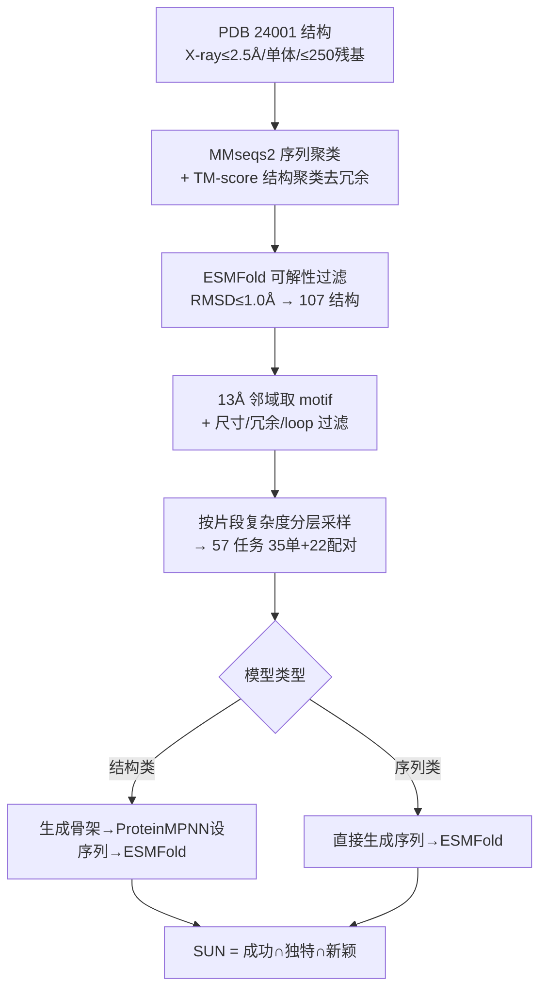

# GeomMotif: A Benchmark for Arbitrary Geometric Preservation in Protein Generation

**会议**: ICLR 2026  
**OpenReview**: [https://openreview.net/forum?id=b4C3zAzRgH](https://openreview.net/forum?id=b4C3zAzRgH)  
**代码**: [GitHub + HuggingFace 数据集](https://openreview.net/forum?id=b4C3zAzRgH)（论文提供）  
**领域**: 计算生物学 / 蛋白质生成 / Benchmark  
**关键词**: motif scaffolding, 几何保持, 蛋白质生成, SUN score, modality-agnostic benchmark  

## 一句话总结
GeomMotif 把蛋白质 motif scaffolding 任务从"功能位点"中解耦出来，构造了 57 个保证可解、模态无关的"纯几何保持"任务，用统一的 SUN（成功×独特×新颖）指标系统揭示出结构类模型远超序列类模型、以及结构条件反而可能干扰生成等反直觉现象。

## 研究背景与动机
**领域现状**：motif scaffolding（给定一个功能片段、生成包裹它的完整蛋白）是深度学习蛋白设计的核心任务，类比于计算机视觉里的"图像外扩"（outpainting）。RFdiffusion、Genie2、ESM3、DPLM 等一批生成模型都把它当作主战场，主流评测基准如 RFdiffusion 的 25 个功能 motif、MotifBench 的 30 个测试用例都聚焦于酶活性位点、结合界面等已知功能位点。

**现有痛点**：现有基准存在一个"诊断盲区"——它们把两个本质不同的挑战混为一谈：**保持 3D 几何** 与 **满足复杂功能约束**（残基身份、电荷分布、疏水堆积、侧链构象等）。当模型在功能 motif 任务上失败时，无法判断到底是"根本没能力保持几何结构"还是"几何对了但不满足功能要求"。更糟的是，某些复杂功能位点任务可能对当前方法根本无解，污染了评测信号。

**核心矛盾**：在蛋白工程中几何精度是功能的前提——文中引用的数据触目惊心：计算设计的蛋白 binder，当结合 motif 的骨架 RMSD 偏离目标仅 1.0 Å，实验成功率就可能从近 50% 暴跌到 0。几何精度是湿实验前最关键的计算筛选器，但现有基准恰恰把这个基础能力和复杂功能纠缠在一起，无法单独度量。

**本文目标**：构造一个**只考几何保持、不掺功能特异性**的基准，让"模型能否在任意选取的残基间维持局部与长程几何关系"这一核心生成能力被干净地测出来。

**核心 idea**：**[从 PDB 均匀采样而非功能偏置]** 直接从蛋白质数据库（PDB）里无功能偏向地采样结构片段，把任务变成"蛋白外扩"——**[保证可解]** 每个任务都从真实蛋白中切出，天然存在至少一个 ground-truth 解；**[模态无关]** 任务定义不依赖序列或结构表征，序列类与结构类模型能公平同台；**[富属性标注]** 每个任务标注 8 种结构/理化属性，支持超越成功率的细粒度分析。

## 方法详解

### 整体框架
GeomMotif 的核心是一条"基准构造 + 模态无关评测"的双段流水线。构造段从 PDB 海量结构里逐级过滤、聚类、验证可解性，再按"片段复杂度"分层采样出 57 个任务；评测段对结构类和序列类模型走各自适配的折叠管线，最后统一汇聚到 SUN 单一指标。

### 关键设计

**1. 可解性保证的任务构造：让"失败"只能归因于模型**　这是 GeomMotif 区别于以往基准最根本的设计。作者先用三条硬标准从 PDB 滤出高质量起点：X 射线晶体学且分辨率 ≤2.5 Å、仅生物单体（避免复合物在孤立态构象漂移）、长度 ≤250 残基（避免子结构需全局上下文才能折叠），得到 24,001 个结构；再用两阶段聚类去冗余——MMseqs2 在 80% 序列相似度、90% 覆盖度下聚类，随后用完全连接层次聚类在 TM-score 0.5、覆盖 30% 下做结构聚类。关键一步是**用 ESMFold 对每个簇代表做预测，只保留预测折叠与实验结构 RMSD ≤1.0 Å 的结构**，从而保证整条评测管线本身就能把这个结构"还原"出来——这直接堵上了 MotifBench 里"某些任务可能本就无解"的漏洞，最终留下 107 个可解结构。

**2. 基于空间邻域的 motif 定义与片段复杂度分层**　motif 不是按功能挑的，而是几何定义的：遍历每个残基作为中心，把 Cα 落在其 13 Å 半径内的所有残基集合定为一个 motif，再用三道过滤精炼（剔除 <30 残基的小 motif、移除残基重叠 >20% 的冗余邻域、去掉 DSSP 判定 loop 含量 >25% 的松散 motif），得到 3,772 个单 motif 候选；对配对任务则取同一结构内中心相距 ≥30 Å 的 motif 对，得 5,364 个候选。由于空间上相邻的残基在序列上常常不连续，作者用**"片段复杂度"**——即构成 motif 的连续序列片段数——来刻画几何难度，并按此分层均匀采样（单 motif 取 1–7 段、配对取 3–7 段，每类至多 5 个代表），最终得到 57 个任务（35 单 + 22 配对），覆盖 mainly-α、mainly-β、α/β 等多种 CATH 折叠类。此外允许可变区在生物合理范围内变长度、仅固定 motif 几何，迫使模型真正理解几何而非复述记忆模式。

**3. 八维理化属性标注：把成功率拆成可解释维度**　每个任务额外标注 8 种属性以支持细粒度归因：二级结构三分量（螺旋含量 / 延展 β 含量 / loop 含量，由 DSSP 给出）、motif 尺寸（残基数，代表几何约束的范围）、Eisenberg 标度的平均疏水性、埋藏比（相对溶剂可及度 RSA < 0.2 的残基占比，代表堆积约束苛刻程度）、绝对电荷密度（按 Arg/Lys +1、Asp/Glu −1 计的每残基绝对电荷）、以及结构上下文（4.5 Å 阈值下 motif 内部接触与对外接触之比）。这些属性让分析从"成功 / 失败"上升到"哪类结构特征对哪种架构最难"。

**4. SUN 统一指标与模态无关评测**　评测同时考量几何保真、结构多样、相对已知蛋白的新颖三方面。判定单个生成蛋白"成功"需同时满足：motif 骨架 scRMSD < 1.0 Å（几何忠实）且预测结构平均 pLDDT ≥70（整体折叠良好）；在成功设计内再用 TM-score 0.8 阈值的层次聚类数衡量多样性（Unique），用与 ground-truth 的 TM-score < 0.8 判定新颖（Novel）。最终汇聚为 SUN 分数：

$$\text{SUN} = P(\text{Successful} \cap \text{Unique} \cap \text{Novel})$$

它只奖励同时兼顾精度、多样、原创的设计，天然平衡了蛋白设计中相互竞争的目标。评测对两类模态适配不同管线——结构类按"生成骨架 → ProteinMPNN 设计 8 条序列 → ESMFold 折叠验证"，序列类则跳过 ProteinMPNN 直接折叠其生成序列；并设固定长度与可变长度两套评测，前者作受控基线、后者区分真泛化与记忆。

## 实验关键数据

### 主实验：10 个模型的整体 SUN（可变长度）

| 类别 | 模型 | 成功率 % | SUN % |
|---|---|---|---|
| 结构类 | Genie2 | — | **39.4** |
| 结构类 | La-Proteina | — | 38.8 |
| 结构类 | RFdiffusion | 54.4 | 37.8 |
| 结构类 | Protpardelle-1C | — | 33.8 |
| 结构类 | FrameFlow | — | 23.3 |
| 结构类 | RFdiffusion2 | 19.2 | 17.9 |
| 序列类 | ESM3 (seq-only) | — | 3.5 |
| 序列类 | DPLM-3B | — | 2.7 |
| 序列类 | DPLM-650M | — | 2.1 |
| 序列类 | ESM3 (seq+struct) | — | 1.0–1.4 |

结构类模型整体把序列类碾压一个数量级以上（最佳结构类 39.4% vs 最佳序列类 3.5%）。

### 消融 / 拆解：单 motif vs 配对 motif（SUN 组件）

| 模型 | 成功(单/配) | 新颖(单/配) | 独特(单/配) | SUN(单/配) |
|---|---|---|---|---|
| Genie2 | 60.1 / 32.9 | 60.1 / 26.6 | 59.9 / 22.5 | 59.9 / 18.8 |
| La-Proteina | 67.1 / 62.7 | 67.1 / 35.2 | 61.3 / 22.7 | 61.3 / 16.2 |
| RFdiffusion | 65.1 / 43.7 | 65.1 / 25.0 | 62.4 / 20.5 | 62.4 / 13.2 |
| Protpardelle-1C | 56.2 / 44.6 | 56.2 / 25.2 | 53.5 / 22.6 | 53.5 / 14.1 |
| FrameFlow | 30.6 / 25.1 | 30.6 / 19.7 | 30.6 / 20.2 | 30.6 / 16.0 |
| ESM3 (seq) | 17.4 / 6.5 | 11.3 / 0.1 | 10.1 / 0.1 | 6.8 / 0.1 |
| DPLM-3B | 19.3 / 11.0 | 10.2 / 0.9 | 9.8 / 0.6 | 4.9 / — |

### 关键发现
- **结构 vs 序列存在量级鸿沟**：结构类（Genie2 39.4%、RFdiffusion 37.8%）远超序列类（最佳 3.5%），说明纯几何保持仍是序列生成范式的硬伤。
- **配对 motif 是序列类的"绝壁"**：序列类模型在空间分离的配对 motif 上 SUN 近乎归零（ESM3 0.1%），而结构类虽下降但仍可用（Genie2 18.8%），暴露架构性局限。
- **多模态反而拖后腿**：ESM3 同时用序列+结构（1.0–1.4%）一致地低于仅序列模式（3.5%），提示结构条件可能引入冲突信号。
- **参数放大≠能力提升**：DPLM-3B（2.7%）仅微弱优于 DPLM-650M（2.1%），单纯堆参数解决不了序列 scaffolding 的根本难题。
- **基准互补性**：RFdiffusion2 在原子酶基准上 41/41 全解、在 GeomMotif 上仅 17.9%；原版 RFdiffusion 在酶基准上只有 16/41 却在 GeomMotif 拿 37.8%——说明"窄域调优"与"广域泛化"是两种能力，两个基准互补而非替代。

## 亮点与洞察
- **问题解耦的优雅**：把"几何 vs 功能"这对长期纠缠的变量拆开，是这篇 benchmark 最大的概念贡献——它让"模型失败"第一次能被干净归因。
- **可解性保证**是工程上的关键一笔：用 ESMFold 反向验证每个任务可还原，避免了"用无解任务考模型"的系统性偏差。
- **片段复杂度**这个量化轴很有洞见：它把"几何难度"从模糊概念变成可分层采样、可作相关性分析的连续维度。
- 反直觉结论（多模态反而更差、放大参数无效、RFdiffusion2 倒退）对后续模型设计有直接警示价值。

## 局限与展望
- **只测几何、不测功能**：作者明确把功能正确性排除在外，因此 GeomMotif 是功能基准的补充而非替代，单独用它不能预测最终的生物可用性。
- **规模偏小**：57 个任务、107 个源结构，相对 PDB 体量仍是小样本，可能限制某些罕见折叠/拓扑的覆盖。
- **评测依赖 ESMFold/ProteinMPNN**：可解性筛选与成功判定都绑定特定折叠/逆折叠工具，这些工具自身的偏差会传导到基准。
- **未来方向**：把几何与功能维度组合成多轴评测、扩大任务规模、引入更多侧链原子级 motif，会让诊断更全面。

## 相关工作与启发
- **功能型基准**：RFdiffusion（25 功能 motif）与 MotifBench（30 用例）聚焦酶活性位点/结合界面，是本文要解耦的对象；Atomic Motif Enzyme Benchmark 则代表"窄域原子级"评测，与 GeomMotif 形成能力互补。
- **被评测的生成范式**：结构扩散/流匹配（RFdiffusion(2)、Genie2、FrameFlow、La-Proteina、Protpardelle-1c）与序列生成（ESM3、DPLM 系列）；多 motif 形式化承袭 Lin et al. 与 Liu et al.。
- **指标谱系**：SUN（Successful, Unique, Novel）源自 Sriram et al. 2024，本文把它适配到 motif scaffolding 场景。
- **启发**：对任何"生成 + 约束保持"任务（如分子、布局、图像外扩），先把"约束几何保真"与"语义/功能正确"解耦评测，都是值得借鉴的基准设计哲学。

## 评分
- 新颖性: ⭐⭐⭐⭐ — 不是新模型而是新评测视角，但"几何/功能解耦 + 可解性保证 + 模态无关"的组合在蛋白设计 benchmark 里确属首创，概念贡献扎实。
- 实验充分度: ⭐⭐⭐⭐ — 覆盖 10 个跨范式模型、57 任务各 100 样本、含 bootstrap 不确定度与固定/可变长度双设定，结论由富属性分析支撑，较全面。
- 写作质量: ⭐⭐⭐⭐ — 动机叙述有力（1.0 Å→成功率归零的例子很抓人），构造流水线与指标定义清晰，图表组织得当。
- 价值: ⭐⭐⭐⭐ — 为社区提供了诊断几何能力的干净标尺，揭示的反直觉现象（多模态拖后腿、参数无效）对模型迭代有实际指导意义。

<!-- RELATED:START -->

## 相关论文

- [\[ICLR 2026\] Protein Structure Tokenization via Geometric Byte Pair Encoding](protein_structure_tokenization_via_geometric_byte_pair_encoding.md)
- [\[ICLR 2026\] CAPSUL: A Comprehensive Human Protein Benchmark for Subcellular Localization](capsul_a_comprehensive_human_protein_benchmark_for_subcellular_localization.md)
- [\[ICLR 2026\] La-Proteina: Atomistic Protein Generation via Partially Latent Flow Matching](la-proteina_atomistic_protein_generation_via_partially_latent_flow_matching.md)
- [\[ICML 2025\] Geometric Representation Condition Improves Equivariant Molecule Generation](../../ICML2025/computational_biology/geometric_representation_condition_improves_equivariant_molecule_generation.md)
- [\[ICLR 2026\] DCFold: Efficient Protein Structure Generation with Single Forward Pass](dcfold_efficient_protein_structure_generation_with_single_forward_pass.md)

<!-- RELATED:END -->
