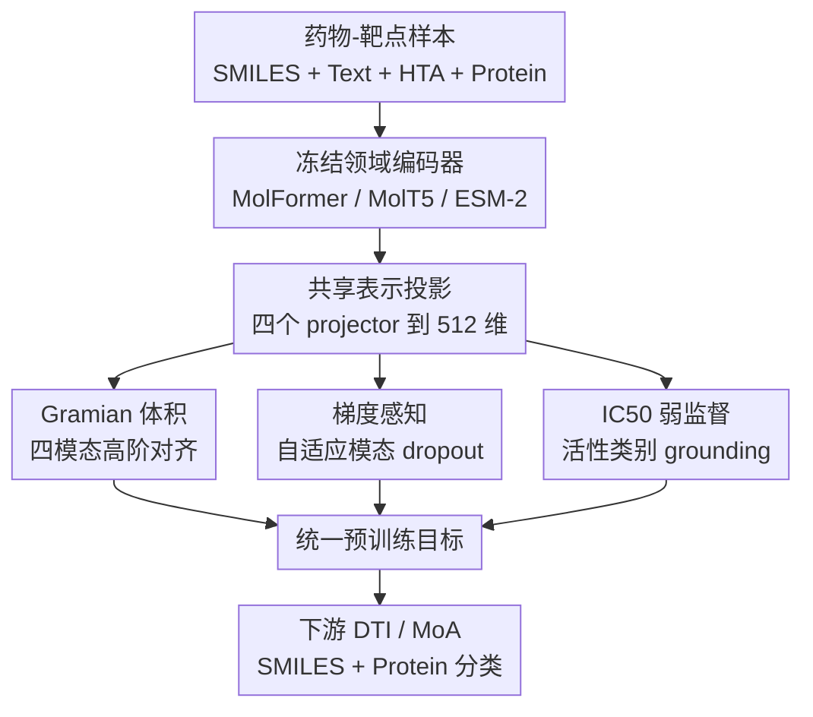

# GRAM-DTI: Adaptive Multimodal Representation Learning for Drug-Target Interaction Prediction

**会议**: ICLR2026  
**OpenReview**: [https://openreview.net/forum?id=dbZeLxOCIs](https://openreview.net/forum?id=dbZeLxOCIs)  
**代码**: https://github.com/uta-smile/GRAM-DTI  
**领域**: 计算生物学 / 药物-靶点相互作用预测  
**关键词**: 药物-靶点相互作用, 多模态预训练, Gramian volume alignment, 自适应模态 dropout, IC50 弱监督  

## 一句话总结
GRAM-DTI 把药物 SMILES、分子文本、分子层级分类标注和蛋白序列放进同一个预训练框架，用 Gramian 体积对齐、自适应模态 dropout 和 IC50 弱监督学习更稳健的药物-靶点表示，并在 DTI / MoA 预测和零样本检索上整体超过强基线。

## 研究背景与动机
**领域现状**：药物-靶点相互作用预测是计算药物发现里的基础任务，用来判断某个小分子是否可能作用于某个蛋白靶点，也常被进一步扩展到激活 / 抑制机制预测。近几年的深度学习方法大多把药物表示成 SMILES 或分子图，把靶点表示成氨基酸序列，然后用 GNN、Transformer、蛋白语言模型或双塔结构做二分类。

**现有痛点**：这种“药物序列 + 蛋白序列”的做法能覆盖最基本的结构信息，但它没有充分利用药物发现里已经存在的多源信息。一个小分子不只有 SMILES，还可能有自然语言描述、功能描述、层级分类标注；蛋白侧也有序列和活性测量。更麻烦的是，已有多模态 DTI 方法常用成对 contrastive learning，把某个模态当锚点后逐对对齐，这在模态数量增加到三四个时很容易只学到局部配对关系，难以表达“这四种视角共同指向同一对药物-靶点语义”的高阶一致性。

**核心矛盾**：DTI 预训练既需要引入更多模态，又不能简单地把所有模态等权相加。不同样本里的模态质量和信息量差异很大：有的分子文本更有解释力，有的 HTA 标注更粗糙，有的蛋白-药物关系主要由序列和 SMILES 决定。如果静态融合，强势但未必真正有用的模态可能压过互补信号；如果只做 pairwise 对齐，又会丢掉四模态之间的整体几何约束。

**本文目标**：作者要解决三个子问题：第一，如何把 SMILES、分子文本、HTA 和蛋白序列同时对齐到统一空间；第二，如何在训练过程中动态调节每个模态的参与度，避免模型被某个模态绑架；第三，如何利用公开数据库里部分可得的 IC50 活性测量，让预训练表示更贴近真实药物-靶点结合强度。

**切入角度**：论文借鉴 Gramian multimodal representation learning 的 volume loss，把多模态对齐看成几何体积最小化问题。直觉上，如果同一样本的四个模态嵌入在共享空间里语义一致，它们张成的 Gramian volume 应该更小；而不匹配的负样本应该形成更大的体积。这个角度比逐对拉近更适合四模态场景，因为它直接约束一组模态的整体一致性。

**核心 idea**：GRAM-DTI 用 Gramian 体积损失做四模态高阶对齐，再用梯度信息决定训练时临时丢弃哪个模态，并把 IC50 离散为弱监督分类目标，从而学到对冷启动药物和冷启动靶点更泛化的 DTI 表示。

## 方法详解

### 整体框架
GRAM-DTI 的输入是一组药物-靶点多模态样本：药物侧包含 SMILES、自然语言文本描述和层级分类标注 HTA，蛋白侧包含氨基酸序列；如果该药物-蛋白对有 IC50 测量，还会额外提供一个活性类别标签。模型先用冻结的领域预训练编码器抽取各模态表示，再训练轻量 projector 把它们投到统一的 512 维空间，在这里同时施加四模态 volume loss、SMILES-蛋白 pairwise contrastive loss 和 IC50 辅助分类损失。下游 DTI / MoA 预测时，只取预训练后的 SMILES 和蛋白表示拼接，接一个轻量 MLP 做二分类。

预训练数据来自 TRIDENT 分子多模态数据和 BindingDB 蛋白结合信息的合并。原始 TRIDENT 提供 SMILES、文本描述和 HTA 三元组，作者把其中能映射到 BindingDB 的分子与蛋白序列、IC50 测量连接起来，构成 $\langle \text{SMILES}, \text{Text}, \text{HTA}, \text{Protein} \rangle$ 四元组。最终预训练集包含 50,968 个四元组，覆盖 6,545 个分子和 4,418 个蛋白，其中 16,035 个样本带有可用于辅助监督的 IC50。

编码器部分尽量复用已有 foundation model：SMILES 用 MoLFormer-XL，文本和 HTA 用 MolT5，蛋白序列用 ESM-2。所有大 backbone 都冻结，只训练每个模态后面的三层投影网络和 IC50 分类头。这让预训练非常轻量，同时把主要学习压力集中在“如何把已有表示对齐”而不是重新学习分子或蛋白基础语义。

### 关键设计
**1. Gramian 体积对齐：用一组模态的几何体积替代逐对相似度**

传统 contrastive learning 通常看两个向量是否匹配，比如 SMILES 和蛋白是否应该靠近。GRAM-DTI 的核心变化是一次性看四个模态是否共同一致。对同一个样本的四个归一化投影表示 $f_i^s, f_i^t, f_i^h, f_i^p$，模型构造 Gram 矩阵 $G$，其中 $G_{kj}=\langle f_i^k, f_i^j\rangle$。这四个向量张成的 Gramian volume 定义为 $V(f_i^s,f_i^t,f_i^h,f_i^p)=\sqrt{\det(G)}$。如果四个模态表达的是同一个药物-靶点语义，它们在共享空间里应更紧凑，体积更小；如果把其中一个模态换成 batch 内其他样本的模态，整体一致性被破坏，体积应变大。

基于这个直觉，论文把 volume 转成 contrastive logits：正样本使用同一四元组，负样本通过替换 anchor 模态构造。前向损失可理解为在所有候选 anchor 中选择能和其余三个模态形成最小体积的那个，反向损失则换一个方向构造负样本，最后取两者平均：$L_{vol}=\frac{1}{2}(L_{vol}^{\rightarrow}+L_{vol}^{\leftarrow})$。这比“SMILES-文本、SMILES-HTA、SMILES-蛋白”逐对拉近更强，因为它要求四个视角同时闭合成一个一致的语义簇，而不是只满足若干局部边。

**2. 梯度感知自适应模态 dropout：让模型别被单个模态牵着走**

四模态对齐的一个隐患是某个模态可能在训练中贡献过强，模型为了快速降低损失就过度依赖它；也可能某个模态长期贡献很弱，被静态融合机制自然忽略。GRAM-DTI 不直接学习一个软权重，而是在训练时以概率 $p_{drop}$ 做“硬 dropout”：根据近期梯度贡献决定暂时从 volume loss 中去掉哪个模态，让剩余模态仍然必须形成可用对齐。

具体做法是计算每个模态表示对当前辅助损失的梯度范数 $g_{\tilde{t}}^m=\lVert \partial \tilde{L}_{\tilde{t}}/\partial f_{\tilde{t}}^m\rVert_2$，再用长度为 $K$ 的指数衰减历史得到平滑贡献 $\bar{g}_{\tilde{t}}^m$。如果某个模态的贡献超过均值加阈值 $\mu_{\tilde{t}}+\lambda_\sigma\sigma_{\tilde{t}}$，就认为它正在主导训练，优先丢掉它；否则丢掉贡献最小的模态，迫使模型不要长期依赖“顺手”的组合。论文默认 $p_{drop}=0.8$、$K=5$、$\lambda_\sigma=1.5$。

一个关键细节是，作者不用 $L_{vol}$ 本身来计算 dropout 的梯度重要性，而使用 $L_{bi}$ 和 $L_{IC50}$。这避免了“用某个 loss 的梯度决定该 loss 怎么算”的循环依赖，也让 dropout 决策更贴近下游 DTI 目标：SMILES-蛋白对齐和 IC50 活性监督都直接反映药物-靶点关系。

**3. IC50 弱监督与双模态对齐：把多模态语义拉回真实结合活性**

单靠多模态语义一致性，模型可能学到“这个分子的文本、分类和 SMILES 很一致”，但未必知道它和蛋白的相互作用强弱。论文因此把 BindingDB 中可用的 IC50 测量作为弱监督。IC50 原本是连续值，但跨度大、噪声高、分布异质，作者没有做回归，而是按药物发现常用阈值离散为三类：$IC50<10\mu M$ 为有效，$10\mu M\le IC50\le1000\mu M$ 为中等，$IC50>1000\mu M$ 为无效。分类头输入四个模态拼接后的 $f_{fused}=[f^s;f^t;f^h;f^p]$，并用加权交叉熵缓解类别不平衡。

同时，虽然预训练有四个模态，下游真正用于预测的是药物和蛋白。作者额外加入 SMILES 到 protein、protein 到 SMILES 的 CLIP-style 双向 contrastive loss $L_{bi}$，显式强化药物表示和蛋白表示之间的一对一关系。最终目标是 $L_{total}=\lambda_1L_{vol}+\lambda_2L_{bi}+\lambda_3L_{IC50}$，默认三个权重都为 1。这样，volume loss 负责高阶多模态一致性，$L_{bi}$ 负责下游核心配对，$L_{IC50}$ 负责把表示 grounding 到生物活性强弱。

**4. 冻结大编码器 + 轻量投影：把可扩展性留给上游 foundation model**

GRAM-DTI 没有重新训练 ESM-2、MoLFormer 或 MolT5，而是把它们当作固定特征抽取器，只训练投影层、IC50 分类头和下游分类器。投影层把 SMILES / 文本 / HTA 的 768 维输出、蛋白的 1280 维输出统一映射到 512 维空间；下游 DTI 预测则拼接 SMILES 和蛋白表示，经 1024 到 512、256、2 的 MLP 输出二分类结果。

这个设计的好处有两层。第一，计算上很省，论文报告预训练可以在单张 A6000 上完成，backbone 冻结后主要成本来自投影和 batch 内 contrastive 计算。第二，框架具有模块性：附录里把默认 MolFormer 换成 Uni-Mol2 或 BioT5+ 后，Activation 上三种 split 的 AUROC / AUPRC 都进一步提升，说明 GRAM-DTI 更像一个多模态对齐外壳，可以自然吃到更强分子编码器的红利。

### 一个完整示例
假设一个训练样本是一种小分子和一个蛋白靶点。小分子侧有 SMILES 字符串、来自 PubChem/文本资源的功能描述，以及 HTA 层级分类；蛋白侧有氨基酸序列；BindingDB 里还可能记录了这对分子-蛋白的 IC50。GRAM-DTI 首先分别用 MoLFormer、MolT5 和 ESM-2 得到四个初始 embedding，再用四个 projector 投到同一个 512 维空间。

在某个 mini-batch 里，这个样本的四模态表示形成一个正四元组。volume loss 会计算它们的 Gramian volume，同时把其中一个 anchor 模态替换成 batch 内其他样本的对应模态，形成“只有一个模态错了、其余模态都看起来还对”的 hard negative。模型要学会让正四元组体积小、错配四元组体积大。

如果训练过程中蛋白模态的梯度贡献远高于其他模态，dropout 机制可能在这一轮把蛋白从 volume loss 中暂时拿掉，迫使 SMILES、文本和 HTA 也能互相对齐；如果没有明显主导模态，它可能丢掉贡献最小的 HTA，让模型集中利用更有效的信号。若这对样本带有 IC50，IC50 分类头还会判断它是有效、中等还是无效活性，让表示不仅语义一致，也更靠近药物发现里的真实活性概念。预训练完成后，下游任务只拿药物 SMILES 表示和蛋白表示拼接，预测是否相互作用或是否产生激活 / 抑制机制。

### 损失函数 / 训练策略
训练采用两阶段流程。第一阶段离线抽取四个模态的 backbone embedding，第二阶段用分布式训练投影网络和 volume loss。主要超参为 batch size 1280、学习率 $1\times10^{-4}$、训练 40 epoch、温度 $\tau=0.07$、drop probability $p_{drop}=0.8$、梯度历史长度 $K=5$、指数衰减因子 $\alpha=0.9$、阈值倍数 $\lambda_\sigma=1.5$，三个 loss 权重均为 1。

下游分类遵循 DTIAM 的协议，对只有正样本的 DTI / MoA 数据集按 1:10 生成负样本。评测 split 包括 warm start、drug cold start 和 target cold start，分别测试已见药物-靶点组合之外的新 pair、未见药物和未见蛋白。Yamanishi 08 与 Hetionet 用 10-fold cross-validation，Activation 与 Inhibition 用 5-fold cross-validation。

## 实验关键数据

### 主实验
论文在四个公开 benchmark 上评估：Yamanishi 08 和 Hetionet 是 DTI 预测，Activation 和 Inhibition 是 MoA 激活 / 抑制预测。主表里 GRAM-DTI 在 DTI 任务 12 个指标场景里赢了 10 个，在 MoA 任务 12 个指标场景里赢了 8 个，最明显优势集中在 target cold start，也就是面对未见蛋白靶点时的泛化。

| 数据集 / 任务 | Split | 指标 | DTIAM | GRAM-DTI | 观察 |
|--------|------|------|------|----------|------|
| Yamanishi 08 / DTI | Warm start | AUROC / AUPR | 0.967 / 0.901 | 0.977 / 0.904 | 暖启动小幅领先，说明预训练对常规 pair split 也有增益 |
| Yamanishi 08 / DTI | Target cold start | AUROC / AUPR | 0.941 / 0.844 | 0.955 / 0.849 | 未见蛋白场景更稳，蛋白-药物对齐有效 |
| Hetionet / DTI | Drug cold start | AUROC / AUPR | 0.752 / 0.514 | 0.855 / 0.529 | 大数据集上药物冷启动 AUROC 提升明显 |
| Activation / MoA | Target cold start | AUROC / AUPR | 0.792 / 0.391 | 0.834 / 0.450 | 激活机制预测中，冷启动靶点收益最大 |
| Inhibition / MoA | Drug cold start | AUROC / AUPR | 0.921 / 0.731 | 0.940 / 0.756 | 抑制任务在 drug cold start 上超过 DTIAM |
| Inhibition / MoA | Warm start | AUROC / AUPR | 0.954 / 0.845 | 0.949 / 0.785 | 该场景不占优，说明大规模抑制数据下强监督基线仍很强 |

零样本检索也支持“预训练表示本身有用”这个结论。模型不做额外 fine-tuning，直接用投影后的 SMILES / Protein 表示互相检索，GRAM-DTI 在大多数 Recall@K 上超过 DTIAM，尤其在 Activation 的 protein-to-drug 检索中提升很明显。

| 方向 | 数据集 | 指标 | DTIAM | GRAM-DTI | 提升含义 |
|------|--------|------|------|----------|----------|
| SMILES→Protein | Yamanishi 08 | R@1 / R@10 / R@100 | 0.0038 / 0.0341 / 0.1960 | 0.0465 / 0.1691 / 0.4449 | 药物查靶点时，top-k 命中大幅提高 |
| Protein→SMILES | Yamanishi 08 | R@1 / R@10 / R@100 | 0.0040 / 0.0849 / 0.3670 | 0.0742 / 0.2465 / 0.5540 | 靶点查候选药物也更好 |
| SMILES→Protein | Activation | R@1 / R@10 / R@100 | 0.0028 / 0.0266 / 0.3184 | 0.0136 / 0.1020 / 0.5688 | MoA 数据上检索收益明显 |
| Protein→SMILES | Activation | R@1 / R@10 / R@100 | 0.0071 / 0.0463 / 0.2206 | 0.0370 / 0.2454 / 0.6029 | 蛋白到药物检索的中高 K 提升最大 |
| SMILES→Protein | Inhibition | R@1 / R@10 / R@100 | 0.0004 / 0.0097 / 0.1036 | 0.0055 / 0.0337 / 0.1994 | 抑制任务检索同样改善 |

### 消融实验
作者在 Activation 主文和 Yamanishi 08 附录中做了组件消融。Exp 1 是完整 GRAM-DTI；Exp 2 去掉 volume loss；Exp 3 去掉 SMILES-Protein 双模态 contrastive loss；Exp 4 去掉 IC50 辅助监督；Exp 5 保留完整目标但不做自适应模态 dropout。趋势是完整模型总体最好，尤其 volume loss、IC50 和 dropout 的组合对冷启动更重要。

| 配置 | 训练目标 / 变化 | Activation 上的主要现象 | 说明 |
|------|----------------|--------------------------|------|
| Exp 1 | $L_{vol}+L_{bi}+L_{IC50}$ + adaptive dropout | 多数指标最佳，target cold start AUROC 约 0.834、AUPRC 约 0.450 | 三个组件协同最强 |
| Exp 2 | 去掉 $L_{vol}$ | 多数 split 和指标下降 | 仅靠 pairwise 药物-蛋白对齐不足以捕获四模态高阶关系 |
| Exp 3 | 去掉 $L_{bi}$ | 性能下降但不完全崩 | volume alignment 有效，但下游核心的 SMILES-Protein 对齐仍需要显式强化 |
| Exp 4 | 去掉 $L_{IC50}$ | 大多数场景弱于完整模型 | 生物活性弱监督能把表示拉向真实结合强度 |
| Exp 5 | 不做 adaptive dropout | 性能通常下降，部分指标差距明显 | 动态丢模态比静态全模态训练更能防止过拟合和模态主导 |

论文还把 hard dropout 与两种 soft balancing 对比：Weighted-Modality Gradients 和 Standard Weighted Loss。在 Activation 上，梯度感知 dropout 的 AUROC / AUPRC 为 warm start 0.914 / 0.642、drug cold start 0.913 / 0.628、target cold start 0.834 / 0.450，均优于或基本优于两个软加权方案。这说明“临时移除一个模态”带来的正则化，比只是缩放梯度或学习 loss 权重更强。

| 策略 | Warm AUROC / AUPRC | Drug cold AUROC / AUPRC | Target cold AUROC / AUPRC | 结论 |
|------|--------------------|--------------------------|----------------------------|------|
| Gradient-Informed Dropout | 0.914 / 0.642 | 0.913 / 0.628 | 0.834 / 0.450 | 最稳定，冷启动表现最好 |
| Weighted Gradients | 0.909 / 0.618 | 0.910 / 0.624 | 0.828 / 0.445 | 软缩放有帮助但正则化较弱 |
| Standard Weighted Loss | 0.901 / 0.621 | 0.892 / 0.619 | 0.814 / 0.440 | 只学 loss 权重不足以解决模态依赖 |

### 关键发现
- 四模态高阶对齐的收益在 target cold start 中最清楚，因为未见蛋白需要模型从蛋白序列和药物多模态语义中迁移，而不是记住已见 pair。
- IC50 弱监督不是主任务标签，却能让预训练表示更接近药物活性概念；去掉它后多数评测场景变差。
- 自适应模态 dropout 的“硬丢弃”比软权重更有效，说明多模态 DTI 里真正的问题不是简单调权，而是防止模型在训练路径上长期依赖某个模态。
- 强分子编码器能继续抬升表现：在 Activation 上，Uni-Mol2 和 BioT5+ 替换 MolFormer 后，target cold start AUROC 从 0.8335 提到 0.8642 / 0.8577，AUPRC 从 0.4497 提到 0.4848 / 0.4805，说明框架具备可插拔性。
- 部分模态预训练是潜在扩展方向。用 80% 完整样本加 20% 随机缺失单模态样本训练 masked-volume loss，比只用 80% 完整样本更好，target cold start AUROC 从 0.791 提到 0.828。

## 亮点与洞察
- **把 DTI 多模态对齐从“多条边”提升成“一个几何体”**：Gramian volume 的好处是直接建模四个模态的整体一致性，而不是把四模态拆成若干 pair。这个视角适合药物发现，因为药物文本、HTA、SMILES 和蛋白并不是独立两两关系，而是共同约束一个生物交互语义。
- **dropout 决策来自梯度而不是人工经验**：很多多模态方法只是固定丢模态或学一个 gating 权重，GRAM-DTI 则观察最近几步哪个模态对损失最敏感。这个设计让训练过程能动态应对“某个模态暂时太强”或“某个模态长期太弱”的状态。
- **IC50 作为弱监督很务实**：论文没有把稀疏且噪声大的 IC50 强行当连续回归目标，而是离散成药物发现上可解释的三档活性。这牺牲了一些精细数值信息，但换来更稳的训练信号，也更适合作为预训练辅助任务。
- **框架比具体编码器更重要**：默认版本已经使用冻结 backbone 获得不错结果，换更强分子编码器后还能继续提升。这说明贡献不只来自某个强 encoder，而来自多模态对齐、模态选择和生物监督的组合方式。
- **零样本检索结果有实际药物发现意义**：如果只靠预训练表示就能更好地做 drug-to-protein / protein-to-drug retrieval，那么这个表示不只是服务二分类 benchmark，也可能用于候选靶点发现、药物再利用和早期筛选。

## 局限与展望
- **预训练数据规模仍受完整四元组限制**：当前主模型只使用四个模态都存在的样本，最终只有 50,968 个四元组。对药物发现来说这个规模并不大，尤其是为了避免 downstream pair 泄漏还要删除重叠 pair。论文自己也指出，扩展到缺失模态样本会显著扩大预训练语料。
- **实体级重叠仍是一个 caveat**：主实验删除了下游中的精确 SMILES-protein pair，但没有完全删除所有出现过的药物或靶点，否则数据太少。附录的 overlap cleaning 显示删除 Activation 中共享实体相关 pair 后性能只中等下降，但 Hetionet / Inhibition 的实体重叠比例很高，冷启动结论仍需要更严格外部数据验证。
- **蛋白侧模态仍偏单一**：方法名是四模态，但蛋白侧主要是序列，药物侧有三种模态。未来可以加入蛋白结构、功能注释、通路信息、表达谱或疾病上下文，让“药物多模态 + 蛋白多模态”更均衡。
- **IC50 离散化损失了连续亲和力信息**：三分类更稳，但无法区分同一档内部的活性强弱。后续可以尝试 ordinal regression、分布式回归或不确定性建模，在抗噪声和保留连续信息之间做更细的折中。
- **Inhibition warm start 不占优**：GRAM-DTI 在 Inhibition 的 warm start / AUPR 上明显落后 DTIAM，说明在大规模、标签较充分的特定 MoA 数据上，多模态预训练未必总能超过强监督基线。更细粒度分析哪些靶点家族或药物类别受益，会比只报总体均值更有解释力。

## 相关工作与启发
- **vs DeepDTA / TransformerCPI**: 这些早期方法主要依赖药物序列和蛋白序列，用神经网络直接学习 pair 表示。GRAM-DTI 的区别是先做多模态预训练，再用药物-蛋白表示做下游分类；优势在冷启动和小数据场景更明显，代价是需要额外构建多模态预训练语料。
- **vs DTIAM**: DTIAM 是最强基线之一，也强调统一的 DTI / affinity / MoA 框架。GRAM-DTI 的关键差别在于四模态 volume alignment、adaptive modality dropout 和 IC50 弱监督的组合；从结果看，GRAM-DTI 在多数 AUROC / AUPR 和零样本检索上更好，但在 Inhibition warm start 等场景并非全面领先。
- **vs TRIDENT**: TRIDENT 提供了 SMILES、文本、HTA 的分子多模态表示学习基础。GRAM-DTI 可以看成把 TRIDENT 的分子三模态扩展到药物-蛋白交互任务，并引入蛋白序列与 IC50 监督，让表示从“分子语义”走向“分子-靶点关系”。
- **vs Gramian multimodal representation learning**: 原始 Gramian volume 思想来自通用多模态对齐。本文的启发是，这种几何体积损失不仅适合音频-视频-文本，也适合生物医学里模态数量多、pairwise 关系不足的场景。
- **可迁移启发**：很多生物任务都有“核心 pair + 辅助注释”的结构，例如抗体-抗原、TCR-epitope、药物-疾病、基因-表型。GRAM-DTI 的思路可以迁移为：用 volume loss 对齐核心实体和辅助注释，用弱生物标签 grounding，再用梯度感知 dropout 避免某个廉价注释模态主导训练。

## 评分
- 新颖性: ⭐⭐⭐⭐☆ 把 Gramian volume alignment、梯度感知模态 dropout 和 IC50 弱监督组合到 DTI 预训练里，设计完整且贴合任务；单个组件并非全新，但组合有清晰贡献。
- 实验充分度: ⭐⭐⭐⭐☆ 覆盖四个数据集、三种 split、零样本检索、消融、超参敏感性、缺失模态和显著性检验；不足是实体级重叠和外部真实冷启动验证还可以更严格。
- 写作质量: ⭐⭐⭐⭐☆ 方法逻辑清楚，图和公式能解释核心机制；部分附录表格命名和主文引用略显杂乱，个别结论需要更多 caveat。
- 价值: ⭐⭐⭐⭐☆ 对药物发现里的多模态预训练很有参考价值，尤其是冷启动靶点、候选检索和弱监督 grounding；后续若扩展蛋白侧模态和缺失模态训练，实用潜力更大。

<!-- RELATED:START -->

## 相关论文

- [\[ICLR 2026\] DeepSADR: Deep Transfer Learning with Subsequence Interaction and Adaptive Readout for Cancer Drug Response Prediction](deepsadr_deep_transfer_learning_with_subsequence_interaction_and_adaptive_readou.md)
- [\[ICLR 2026\] I2Mole: Interaction-aware Invariant Molecular Learning for Generalizable Drug-Drug Interaction Prediction](i2mole_interaction-aware_invariant_molecular_learning_for_generalizable_property.md)
- [\[ICLR 2026\] Adaptive Data-Knowledge Alignment in Genetic Perturbation Prediction](adaptive_data-knowledge_alignment_in_genetic_perturbation_prediction.md)
- [\[ICML 2026\] Learning the Interaction Prior for Protein-Protein Interaction Prediction: A Model-Agnostic Approach](../../ICML2026/computational_biology/learning_the_interaction_prior_for_protein-protein_interaction_prediction_a_mode.md)
- [\[NeurIPS 2025\] GFlowNets for Learning Better Drug-Drug Interaction Representations](../../NeurIPS2025/computational_biology/gflownets_for_learning_better_drug-drug_interaction_representations.md)

<!-- RELATED:END -->
