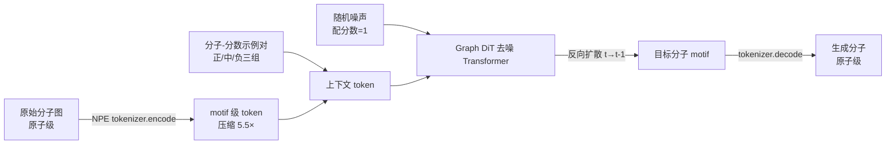

# Graph Diffusion Transformers are In-Context Molecular Designers

**会议**: ICLR 2026  
**OpenReview**: [https://openreview.net/forum?id=lJ87GN5zJc](https://openreview.net/forum?id=lJ87GN5zJc)  
**代码**: 待确认  
**领域**: 计算生物学 / 分子设计 / 生成模型  
**关键词**: 上下文学习, 图扩散模型, 分子设计, 分子基础模型, motif tokenizer, Node Pair Encoding  

## 一句话总结
用「分子-分数」示例对替代文本 prompt 来定义任务上下文，把图扩散 Transformer 训成一个 0.7B 的分子基础模型 DemoDiff，仅靠几十个 in-context 示例就能在 33 个设计任务上匹敌甚至超过大 100–1000 倍的 LLM。

## 研究背景与动机
**领域现状**：In-context learning（ICL）让大模型靠几个示例就能适应新任务，但在分子设计上一直水土不服。分子任务横跨数百万种生物 assay 和材料测量，每种属性往往只有寥寥几个标注样本——示例足够定义任务，却远不够从头训一个模型。

**现有痛点**：(1) 直接照搬 LLM 的自回归框架不可行，因为分子是离散图 + 数值属性，不是顺序文本；(2) 此前的 Graph Diffusion Transformer（Graph DiT）最多只能用一个向量编码约 5 个属性，而真实属性空间是数百万维 assay，用 one-hot 属性向量 + 巨大 embedding 表既稀疏又无法泛化到未见属性；(3) 原子级分子表示像「字符级建模文本」，token 太多，严重限制了能塞进上下文的示例数量。

**核心矛盾**：属性空间海量稀疏 vs. 模型需要稠密可泛化的条件表示；上下文容量有限 vs. 更多示例才能刻画任务概念。

**本文目标**：构建一个分子基础模型，用 in-context 示例（而非属性向量或文本）来定义任意分子设计任务，在标注稀缺、Oracle 调用受限的现实条件下做逆向分子设计。

**核心 idea**：**用示例定义任务（demonstration-conditioned）** —— 把任务上下文表示成一组「分子-分数」对，分数∈[0,1] 充当相对位置（替代 position ID），设计目标即「查询分数=1 的分子」；再配一个 **motif 级 tokenizer（NPE）** 把分子压缩 5.5×，让更多示例塞进固定上下文。

## 方法详解

### 整体框架
DemoDiff 以 Graph DiT 为骨干，把逆向分子设计写成「给定上下文 C（分子-分数对集合）和查询分数 Q=1，去噪生成目标分子 X」。它分两块：先用 Node Pair Encoding 把原子级分子图压成 motif 级 token，再让去噪 Transformer 同时 attend 到「正在去噪的分子 token」和「示例上下文 token」，通过反向扩散从随机噪声逐步精修出对齐目标属性的分子。

### 关键设计

**1. Node Pair Encoding（NPE）：给分子图做 BPE 式 motif 分词。** 此前工作用 BRICS 或分子文法这类领域启发式切 motif，词表独立于预训练数据、常漏掉高频子结构。NPE 借鉴 BPE 思路改成频率驱动：词表 $\mathcal{M}$ 初始化为周期表 118 种原子加一个聚合点「*」（保证最坏情况退化到原子级仍可表示），然后迭代三步——邻域合并（枚举数据集中相邻可合并的 motif 对）、频率选择（选最高频的候选 motif 加入词表）、图更新（把全数据集中该 motif 对替换成新 motif）。每个 motif $m=(\tilde{A},\tilde{B})$ 是连通子结构，分子被切成互不相交的 motif 集合，motif 间用有向边连接，边带两个属性：键型与 attachment index（标明键从源 motif 的哪个原子发出），从而保证 `decode` 无损重建。为避免环结构（如芳香环）产生多条歧义有向边，作者加了 **Constrained NPE**：初始化时把 top-$K_{ring}$ 高频环整体并入词表，合并时把环 $r$ 当作完整单元合并而非拆原子。词表设为 $K=3000$（含 $K_{ring}=300$），在 100 万预训练分子上平均压缩比 $5.446\pm2.569$，中位数从 30 个原子降到 5 个 motif——这正是能塞进更多示例的关键。

**2. 示例即条件的扩散目标：用 C、Q 替换属性向量。** 标准 Graph DiT 在离散扩散里以属性 $\{c_i\}$ 为条件最小化负对数似然；DemoDiff 把条件换成整段上下文与查询，预训练目标变为 $\mathcal{L}_{pretrain}=\mathbb{E}_{q(x_0)}\mathbb{E}_{q(x_t|x_0)}\big[-\log p_\theta(x_0\mid x_t, C, Q)\big]$。离散扩散前向 $q(x_t|x_{t-1})=\mathrm{Cat}(x_t; p=x_{t-1}Q_t)$ 逐步腐蚀分子，反向过程从 $q(x_T)$ 采样、由 Transformer 逐步去噪。这把 ICL 解释成在扩散轨迹上对潜在任务概念 $\theta$ 的隐式贝叶斯推断 $p(X|C,Q)=\int_\theta p(X|\theta,C,Q)p(\theta|C,Q)d\theta$：示例越多，后验越集中于真实任务概念，模型据此引导反向过程精修结构。分数 $Y_i\in[0,1]$ 用 RoPE 编码、为示例分子和目标提供位置信号；由于上下文中分子结构互不相交，边的连通性天然划定了示例边界，无需显式分隔符。

**3. 正/中/负三组示例：完整刻画任务概念。** 只用正示例（接近目标或在 assay 中活性的分子）不够——正例可能因任务相关性（如同为非小细胞肺癌活性但不同细胞系）或采样偏差（极稀疏时两任务共享同一个正例）而跨任务重叠。DemoDiff 按归一化分数把示例切成正 [0.75,1]、中 [0.5,0.75)、负 [0,0.5) 三组，每组最多 15 个，提供任务概念的全景视图。预训练数据从 ChEMBL（药物）+ 多个聚合物数据源（材料）构造：每个生物活性分子（pChEMBL>6）当 target 给分数 1，其余分子按 pChEMBL 差值归一化成上下文分数，最终得到 100 万分子、155K 独特属性、约 160 万任务，属性频率服从 Zipf 律 $P(Y_{rank})\propto rank^{-1.13}$（与语言语料一致）。

**4. 一致性分数（consistency score）：推理期过滤假阳性。** 给定查询，把生成分子 $X$ 的指纹相似度分别与正/中/负三组比较，检验是否满足 pos > med > neg 的相对关系，得到一个一致性分数衡量生成是否对齐上下文中的相对序。推理时先用它做置信过滤、选出高一致性的生成再交给 Oracle 评估，等于在不调用 Oracle 的情况下剔除假阳性，跨任务带来 0.8%–27.5% 的提升。

## 实验关键数据

### 主实验表格
33 个任务分 6 类，报告 Top-10 生成的 oracle 分数与多样性分数的调和平均（越高越好），以及在全部方法中的平均排名（越低越好）：

| 方法 | 类型 | Drug Rediscovery | Drug MPO | Material | Avg Rank↓ |
|---|---|---|---|---|---|
| GraphGA | 优化(100 oracle) | 0.36 | 0.52 | 0.58 | 6.56 |
| GenMol | 优化(100 oracle) | 0.42 | 0.51 | 0.62 | 7.98 |
| Graph-DiT | 条件生成 | 0.43 | 0.50 | 0.55 | 8.53 |
| DeepSeek-V3 | LLM ICL | 0.45 | 0.51 | 0.39 | 8.08 |
| GPT-4o | LLM ICL | 0.47 | 0.53 | 0.43 | 7.89 |
| Qwen3-8B-FT | LLM ICL | 0.37 | 0.27 | 0.44 | 10.96 |
| **DemoDiff (0.7B)** | **扩散 ICL** | **0.44** | **0.54** | **0.67** | **4.10** |

DemoDiff 平均排名 4.10，远优于最佳基线 GraphGA（6.56），且参数量仅为 LLM 基线的 1/100–1/1000；在 target-based design（0.79）和 material design（0.67）等属性驱动任务上优势最明显。

### 消融实验表格
模型规模扩展（Top-10 调和平均）：

| 规模 | Drug Rediscovery | Drug MPO | Structure Constrained | Drug Design | Target-Based | Material |
|---|---|---|---|---|---|---|
| 78M | 0.39 | 0.46 | 0.47 | 0.57 | 0.73 | 0.62 |
| 311M | 0.40 | 0.46 | 0.50 | 0.53 | 0.75 | 0.62 |
| 739M | 0.44 | 0.54 | 0.56 | 0.79 | 0.78 | 0.67 |

- **上下文长度**：motif token 从 50 增到 150，Albuterol rediscovery 调和分数从 0.705 升到 0.752——更长上下文塞进更多示例，印证 motif tokenization 的价值。
- **正例比例**：正例比例 0.5 时最优（0.752），全正例（1.0）反而掉到 0.708，说明正/中/负多样示例缺一不可。
- **一致性分数**：作为置信过滤跨任务带来 0.8%–27.5% 提升。

### 关键发现
- **小模型大能量**：0.7B 扩散模型靠几十个示例匹敌/超过 100–1000× 大的 LLM，且生成分子分数更贴近目标、结构多样性更好（LLM 常生成高分但雷同的分子）。
- **属性驱动 > 结构约束**：DemoDiff 在药物/材料属性设计上得 0.67–0.79，在 rediscovery/结构约束任务上约 0.44–0.56——后者 Oracle 评分绑定特定子结构，解空间更窄。
- **规模收益随任务而异**：中等规模在多数任务提升，大规模在 6 类中 5 类显现明显的参数扩展收益。

## 亮点与洞察
- **范式迁移漂亮**：把 NLP 的「示例即 prompt」迁到分子设计，用「分子-分数对」替代文本示例、用分数替代 position ID，给「属性空间海量稀疏」这一老大难提供了优雅出口——不再维护百万维属性 embedding 表。
- **NPE 是真正的使能器**：5.5× 压缩看似工程细节，实则是 ICL 能成立的前提（固定上下文塞更多示例 → 任务概念刻画更准），且 Constrained NPE 巧妙解决环结构的解码歧义。
- **负示例的价值被正面论证**：实验显示纯正例不如正/中/负混合，为「示例多样性」给出了反直觉但扎实的证据。
- **一致性分数零 Oracle 提纯**：在推理期不花 Oracle 预算就能过滤假阳性，对真实药物发现（Oracle 极贵）很实用。

## 局限与展望
- **结构约束任务仍偏弱**：rediscovery 与结构约束设计只有约 0.44–0.56，指纹相似度难捕捉甲基等细微子结构导致一致性与目标分数相关性弱，未来需更细的结构对齐信号。
- **预训练成本高**：0.7B 模型用了约 146 H100 GPU days，复现门槛不低。
- **数据偏 ChEMBL+聚合物**：覆盖 drugs 与 materials，对蛋白、晶体等其他化学空间的泛化尚待验证。
- **分数归一化依赖任务定义**：上下文分数由 pChEMBL/属性差值归一化得到，跨 assay 的分数语义是否一致、对噪声标注的鲁棒性仍是开放问题。

## 相关工作与启发
- **ICL 的贝叶斯视角**（Xie et al., 2021）：把 ICL 解释成对潜在概念的隐式贝叶斯推断，本文将其搬到扩散轨迹上。
- **Graph Diffusion Transformer**（Liu et al., 2024c）：DemoDiff 的骨干，本文把它从「≤5 属性向量条件」扩展到「百万 assay 的示例条件」。
- **离散图扩散**（Vignac et al., 2022）：提供分子结构的离散扩散建模基础。
- **BPE → NPE**：把 NLP 子词分词的频率合并思想迁到分子图，启发我们任何「token 太碎」的离散结构都可考虑频率驱动的 motif 化压缩。
- **启发**：当属性/标签空间巨大且稀疏时，与其建超大条件 embedding 表，不如把「少量带标注示例」直接作为条件喂给生成模型——这一思路可推广到材料、蛋白乃至其他科学发现的逆向设计。

## 评分
- **新颖性**: ⭐⭐⭐⭐⭐ 「示例-分数对定义任务 + 分数当 position ID + motif 级 NPE」组合在分子设计中是清晰的新范式，把 ICL 真正在分子上做通了。
- **实验充分度**: ⭐⭐⭐⭐ 33 任务 6 类对比 19 个基线，含规模/上下文/正例比例/一致性的系统消融；但结构约束任务的失效分析与跨化学空间泛化可再深入。
- **写作质量**: ⭐⭐⭐⭐ 动机递进清晰、贝叶斯框架与方法图配合得当；公式与符号略密集，appendix 依赖较多。
- **价值**: ⭐⭐⭐⭐⭐ 用 1/100–1/1000 参数匹敌 LLM，定位为分子基础模型，对标注稀缺、Oracle 昂贵的真实药物/材料发现意义重大。

<!-- RELATED:START -->

## 相关论文

- [\[ICML 2025\] Supercharging Graph Transformers with Advective Diffusion](../../ICML2025/computational_biology/supercharging_graph_transformers_with_advective_diffusion.md)
- [\[ICLR 2026\] SigmaDock: Untwisting Molecular Docking with Fragment-Based SE(3) Diffusion](sigmadock_untwisting_molecular_docking_with_fragment-based_se3_diffusion.md)
- [\[ICLR 2026\] Learning Flexible Forward Trajectories for Masked Molecular Diffusion](learning_flexible_forward_trajectories_for_masked_molecular_diffusion.md)
- [\[ICLR 2026\] Enhancing Diffusion-Based Sampling with Molecular Collective Variables](enhancing_diffusion-based_sampling_with_molecular_collective_variables.md)
- [\[ICLR 2026\] TetraGT: Tetrahedral Geometry-Driven Explicit Token Interactions with Graph Transformer for Molecular Representation Learning](tetragt_tetrahedral_geometry-driven_explicit_token_interactions_with_graph_trans.md)

<!-- RELATED:END -->
