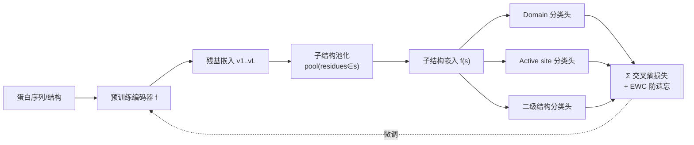

# Greater than the Sum of Its Parts: Building Substructure into Protein Encoding Models

**会议**: ICLR 2026  
**OpenReview**: [https://openreview.net/forum?id=7LoFonLZqs](https://openreview.net/forum?id=7LoFonLZqs)  
**代码**: [https://github.com/rcalef/magneton](https://github.com/rcalef/magneton)  
**领域**: 计算生物学 / 蛋白质表示学习  
**关键词**: 蛋白质表示学习, 子结构, 监督微调, ESM, 结构域, 功能预测  

## 一句话总结
本文提出 **Magneton** 环境（含 53 万蛋白、170 万子结构标注的数据集、训练框架与 13 项基准任务）和 **substructure-tuning** 这一模型无关的监督微调方法，把"蛋白由进化保守的重复子结构（domain、active site 等）组装而成"这一生物学先验显式注入预训练蛋白编码器，在不依赖全局结构输入的情况下系统性提升功能相关任务表现。

## 研究背景与动机

**领域现状**：蛋白表示学习从纯序列模型（ESM2、ProtTrans）发展到融合实验/预测结构的模型（GearNet、SaProt、ProSST），在折叠、功能预测、变异效应预测等任务上取得长足进步。但这些模型几乎都把蛋白编码为**逐残基 token 序列**或**单一全局嵌入**。

**现有痛点**：这种编码方式忽略了蛋白组织的一个核心性质——蛋白不是均匀的氨基酸链，而是由**反复出现、进化保守的子结构**（从几个残基的局部 motif，到覆盖大段序列的 domain、active site、binding site）组装而成，这些子结构才是承载催化、金属配位、信号传导等核心分子功能的单元。尽管 Pfam、InterPro、DSSP 等数据库已系统编目了这些子结构，它们却很少被当作训练信号或表示单元使用。

**核心矛盾**：把子结构纳入模型有四重技术挑战——(1) 子结构跨越多个空间/功能尺度；(2) 在序列空间上常**非连续**，标准序列模型难以编码；(3) 单个残基可同时属于多个重叠子结构，形成层级化、上下文相关的关系，平展表示无法自然处理；(4) 标注子结构呈**长尾分布**（二级结构丰富、专门 motif 稀缺），给训练目标与评测协议设计带来困难。

**本文目标**：回答"如何系统性地把数十年关于蛋白子结构的生物学知识注入蛋白编码模型"。

**核心 idea**：**【环境+方法双线】** 一方面构建 Magneton 环境（数据+训练框架+基准）为子结构感知建模提供基础设施；另一方面提出 substructure-tuning——**把"对进化保守子结构做分类"作为监督微调目标**，将子结构知识蒸馏进任意预训练编码器，且该目标只需残基级嵌入、与具体模型架构无关。

## 方法详解

### 整体框架
Magneton 由三部分组成：**(1) 数据集**——从 UniProtKB/SwissProt 出发，融合 InterPro（同源超家族、domain、保守位点、active site、binding site）与 DSSP（二级结构）标注，得到 53 万蛋白、6 大类共 13,075 种、170 万条子结构标注；**(2) 训练框架**——把每个蛋白同时看作残基级视图 $P=(a_1,\dots,a_l)$ 和子结构级视图 $P=(s_1,\dots,s_n)$，对子结构做监督分类来微调编码器；**(3) 基准**——13 项任务在残基、子结构、蛋白、相互作用四个尺度上探测表示质量。核心方法 substructure-tuning 的流程是"残基嵌入 → 子结构池化 → 类型分类头 → 交叉熵微调"。

### 关键设计

**1. 子结构表示构造：池化把"哪些残基属于这个子结构"的先验喂给模型**。给定蛋白模型 $f$，先算残基级嵌入 $f(P)=(v_1,\dots,v_l)$，再对子结构 $s$ 的构成残基做池化得到子结构表示 $f(s)=\mathrm{pool}(\{v_i:a_i\in s\})\in\mathbb{R}^d$（默认 mean pooling）。这里关键是子结构的残基成员关系由 InterPro/DSSP 标注**显式给定**，模型不需要自己发现边界——因此子结构分类被定位为"探测模型能否表示已知子结构"的诊断任务，而非"识别未标注子结构"。由于子结构残基可非连续地散布在序列各处，池化天然支持了非连续子结构的编码。

**2. substructure-tuning：把子结构分类当作监督微调目标蒸馏知识**。在诊断任务基础上**解冻编码器参数**，用子结构类型分类的交叉熵损失反向更新整个 base model，迫使模型学会区分上千种生物学相关子结构类型。这一目标只依赖残基级嵌入，因而**模型无关**，可作用于纯序列模型（ESM2、ESM-C）和序列-结构模型（SaProt、ProSST），也兼容 LoRA 等参数高效微调。实验显示即便用仅 12 个残基的 active site 这类极小子结构微调，也能带来功能任务增益。

**3. 多尺度多任务损失：每类子结构独立预测头，损失跨尺度求和**。由于子结构横跨二级结构、domain、active site 等多个尺度，方法为**每个子结构类别分配独立的预测模块**，总损失为所有类型交叉熵之和 $\mathcal{L}=\sum_{c}\mathcal{L}_{\mathrm{CE}}^{(c)}$。这种多任务形式让单次微调能同时注入不同尺度的子结构知识。作者扫描了 26 种类别组合中的代表性子集，最终选定 **active site + binding site + conserved site** 组合，因其在功能任务上正增益、在定位/变异效应任务上影响中性，取得最佳折中。

**4. EWC 防灾难性遗忘：保留 base model 原有预训练能力**。子结构微调是监督目标，可能冲掉 base model 原本的自监督表示。方法引入弹性权重巩固（EWC, Elastic Weight Consolidation）正则化原始目标的重要参数。消融显示 EWC 会**适度削弱**子结构微调的正向增益，但同时**显著减小**在受负面影响任务（如残基级变异效应）上的退化，是一种增益-稳健性的权衡。

## 实验关键数据

实验覆盖 6 个 SOTA base model（ESM2-150M/650M、ESM-C 300M/600M、SaProt-650M、ProSST-2048），在 Magneton 的 13 项任务上对比 base 与 +ST（substructure-tuned）版本。

### 子结构表示诊断（macro accuracy）

| Model | 同源超家族 | Domain | 保守位点 | Binding site | Active site | 二级结构 |
|---|---|---|---|---|---|---|
| ESM2-150M | 0.899 | 0.969 | 0.988 | 1.000 | 0.995 | 0.827 |
| SaProt-650M | 0.916 | 0.967 | 0.992 | 0.999 | 0.996 | 0.955 |
| ProSST-2048 | 0.888 | 0.945 | 0.995 | 0.996 | 0.993 | 0.927 |

→ base 模型已能较好表示各尺度子结构，结构类模型整体优于纯序列模型；分类依赖**局部结构线索**而非全局相似性（单蛋白内多 domain 也能各自分类正确）。

### 子结构微调跨模型（蛋白级任务，节选）

| Model | EC (Fmax) | GO:MF | Thermostability (ρ) |
|---|---|---|---|
| ESM-C 300M | 0.688 | 0.429 | 0.703 |
| ESM-C 300M +ST | **0.761** | **0.488** | 0.681 |
| SaProt-650M | 0.778 | 0.538 | 0.784 |
| SaProt-650M +ST | **0.839** | **0.584** | 0.741 |

### 关键发现
- **功能任务普遍提升**：EC、GO:MF、GO:BP、Thermostability 等功能相关任务一致受益；定位任务（GO:CC、Subcellular）与残基级变异效应则中性到轻微下降。
- **与全局结构互补**：即便对已输入结构的 SaProt、ProSST，子结构微调仍带来增益，说明子结构信息与全局结构**正交互补**。
- **泛化到未见类型**：silhouette score 显示子结构微调显著增强模型聚类同类型子结构的能力，且对**训练中完全未见的稀有子结构类型**仍更一致，表明模型学到的是功能子结构的**通用特征**而非特定签名。
- **无数据泄漏**：作者验证增益并非来自 Magneton 训练集与评测测试集间的泄漏；任务特定全量微调会"盖过"子结构知识。

## 亮点与洞察
- **把生物学先验当训练信号**：跳出"残基 token / 全局嵌入"二元对立，第一次把数十年编目的进化保守子结构系统化地当作监督单元，思路干净且立即可用。
- **模型无关 + 即插即用**：substructure-tuning 只要残基级嵌入，对纯序列和序列-结构模型同样有效，且兼容 LoRA，落地成本低。
- **环境化交付**：不止给方法，还给了 53 万蛋白数据集 + Python 库 + 13 项标准化基准，把"子结构感知建模"做成一个可复现、可扩展的研究底座。
- **诚实的负面结论**：明确报告定位/残基级任务的退化，并用 EWC 量化增益-稳健性权衡，没有夸大。

## 局限与展望
- **增益偏向功能任务**：对亚细胞定位、残基级变异效应等任务中性甚至有害，子结构信息并非对所有任务都正向。
- **被任务微调淹没**：当下游做激进的任务特定全量微调时，子结构微调带来的优势基本被抹平，限制了其在重微调场景下的价值。
- **监督依赖标注覆盖**：方法依赖 InterPro/DSSP 已有标注，长尾稀有子结构靠 ≥75 次出现的频次过滤截断，难以覆盖真正罕见的功能 motif。
- **未探索对比/生成目标**：当前用交叉熵监督，作者指出对比损失等替代目标值得探索；与原子级几何编码器的结合也留作未来工作。

## 相关工作与启发
- **序列-结构融合**：SaProt、ProSST（结构 token 化）、ISM、ESM-S（结构蒸馏）把全局/残基级结构注入序列模型，本文与之**正交**——聚焦跨蛋白保守的子结构而非全局结构。
- **层级/子结构感知**：GearNet（蛋白内多视图对比）、SES-Adapter（DSSP 二级结构 cross-attention）、xTrimoPGLM（随机 span mask）、ESM3（多 track tokenization）都触及局部/层级信息，但要么只用单一尺度，要么是蛋白内 partition/随机 span/本体代理，未在**跨蛋白保守子结构**上做监督。
- **启发**：把领域数据库里沉淀的结构化生物知识转化为监督目标，是一条比纯自监督 scaling 更"省数据、强先验"的路径，对其他富先验领域（化学、材料）也有借鉴意义。

## 评分
- **新颖性**: ⭐⭐⭐⭐ — "子结构作为表示单元/训练信号"角度新颖，填补了序列-结构融合工作之外的明显空白；方法本身（监督分类微调）较直接。
- **实验充分度**: ⭐⭐⭐⭐⭐ — 6 个 SOTA 模型 × 13 项跨尺度任务，含配置扫描、跨模型验证、机制分析、泄漏检验、EWC 消融，非常完整。
- **写作质量**: ⭐⭐⭐⭐ — 动机清晰、负面结果如实报告、图表组织良好。
- **价值**: ⭐⭐⭐⭐⭐ — 开源数据集+库+基准构成可复现研究底座，模型无关方法即插即用，对蛋白表示学习社区有持续催化价值。

<!-- RELATED:START -->

## 相关论文

- [\[ICLR 2026\] Fast and Interpretable Protein Substructure Alignment via Optimal Transport](fast_and_interpretable_protein_substructure_alignment_via_optimal_transport.md)
- [\[ICLR 2026\] ProteinAE: Protein Diffusion Autoencoders for Structure Encoding](proteinae_protein_diffusion_autoencoders_for_structure_encoding.md)
- [\[ICLR 2026\] Protein Structure Tokenization via Geometric Byte Pair Encoding](protein_structure_tokenization_via_geometric_byte_pair_encoding.md)
- [\[ICLR 2026\] SimpleFold: Folding Proteins is Simpler Than You Think](simplefold_folding_proteins_is_simpler_than_you_think.md)
- [\[ICLR 2026\] Towards Understanding the Shape of Representations in Protein Language Models](towards_understanding_the_shape_of_representations_in_protein_language_models.md)

<!-- RELATED:END -->
