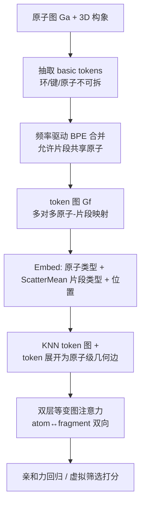

# h-MINT: Modeling Pocket-Ligand Binding with Hierarchical Molecular Interaction Network

**会议**: ICLR 2026  
**OpenReview**: [https://openreview.net/forum?id=ajywV0kKXk](https://openreview.net/forum?id=ajywV0kKXk)  
**代码**: [https://github.com/Atomu2014/hmint](https://github.com/Atomu2014/hmint)  
**领域**: 计算生物学 / 药物发现 / 分子表示学习  
**关键词**: 蛋白-配体结合、分子分词、片段化表示、层次图网络、SE(3) 等变、虚拟筛选  

## 一句话总结
本文提出可重叠的分子分词算法 OverlapBPE 与配套的层次分子交互网络 h-MINT，用"片段可共享原子"的多对多映射保留芳香性/手性/电荷等化学语境，在结合亲和力预测、虚拟筛选与高通量筛选上全面超越现有最优。

## 研究背景与动机
**领域现状**：蛋白-配体结合的精确建模是早期药物发现（亲和力预测、虚拟筛选）乃至酶工程的核心。要刻画 H 键、π-堆叠、π-阳离子等只在特定局部环境下才出现的关键相互作用，就必须有能表达分子化学环境的表示。主流做法把分子建成原子级图，再用 E(n)-等变或方向性消息传递网络处理。

**现有痛点**：(1) 纯原子级 token 很难学到立体化学、孤对电子、共轭体系等高阶化学语境；(2) 片段化方法（如 Principal Subgraph、预定义官能团、BRICS）虽然把局部上下文打包成粗粒度单元，但它们把分子**硬切成不相交的子集**，这种 naive 划分会破坏手性、芳香键完整性和离子态——而这些恰恰决定了相互作用是否成立。

**核心矛盾**：小分子子结构的边界本质上是**模糊的、可重叠的**（如萘可以看成两个共享 2 个芳香碳的苯环），但几乎所有现有层次分子网络都只支持原子到片段的 **1-1 不相交映射**，无法表达这种重叠。要保留芳香完整性就得允许片段重叠，可一旦重叠就产生多对多映射，现有架构又接不住。

**本文目标**：从表示与架构两端同时破局——既要一种能保留完整化学语境、允许片段重叠的分词方法，也要一种能处理由此产生的多对多映射、并在原子与片段两个尺度间双向流通信息的网络。

**核心 idea**：
- **数据驱动 + 允许重叠的分词（OverlapBPE）**：在 BPE 频率合并的基础上允许片段共享原子，并把电荷、芳香性、3D 构象（手性）显式写进 token 标识符。
- **支持重叠的层次等变网络（h-MINT）**：用双层（atom/fragment）注意力支持多对多映射，把片段级关系展开成原子级几何边，实现跨尺度双向信息流且保持 SE(3) 等变。

## 方法详解

### 整体框架
方法分两块：先用 OverlapBPE 把分子从原子图转成**允许重叠**的 token 图（自下而上 BPE 合并，芳香环/键/原子作为不可拆的 basic token 保底），并在 token 标识符里编码手性、电荷与芳香态；再把"原子 + 重叠片段 + 全局节点"喂进 h-MINT，通过双层等变注意力在原子与片段两级间双向传递消息，预测亲和力或筛选得分。

### 关键设计

**1. OverlapBPE：让片段边界"模糊"以守住化学完整性。** 传统片段化把分子切成不相交集合，一刀切就可能拦腰斩断芳香环或丢掉离子态。OverlapBPE 的破解思路是先固定一套 basic token——把训练集里所有单原子、键、环都纳入，并优先用环替换、再用键、最后用原子来覆盖整张图，保证 token 集合完备且最小芳香单元不被破坏；token 图 $G^f=(V^f, E^f)$ 中"两个 token 共享原子即相连"，这正是允许重叠的关键。随后走自下而上的 BPE：枚举所有相邻 token 对 $C=\{\mathrm{Merge}(f_i,f_j)\}$，按训练语料频率选出最高频的 $f^*$ 加入词表 $\Phi_{comp}$，并把语料中所有出现替换为超节点；注意原 token 在其所有相邻候选都被合并前**不会从图中移除**，这保证了重叠结构在合并中得以保留。最后用频率阈值过滤得到 $\Phi_{final}=\{f\in\Phi_{basic}\cup\Phi_{comp}\mid \mathrm{freq}(f)>t\}$。萘被分成两个共享 2 个芳香碳的苯环，就是这套"可重叠"机制的直接产物。

**2. 把化学知识写进 token 标识符。** 光有重叠还不够，化学语境要能被表示编码。OverlapBPE 在 2D 图上叠加 3D 构象信息进行分词，使每个 token 被赋予唯一的**同分异构 SMILES** 作为词表标识——例如 L-乳酸与 R-乳酸分别记为 `C[C@H](O)C(=O)O` 与 `C[C@@H](O)C(=O)O`，从而把手性原生地刻进词表；芳香完整性由"芳香环作为不可分 basic token + 重叠式渐进合并发现扩展共轭体系"双重保证；电荷与芳香原子则用显式标识符承载，如 `[Cl-]` 表示带负电的氯、`[n+]` 表示带正电的芳香氮。相比标准 SMILES 常常在孤立原子上省略这些细节，这套 token 把化学意义上关键的属性全部显式保留下来。

**3. 层次图构建：token 级 KNN 关系展开成原子级几何边。** h-MINT 接收 pocket-ligand 对的原子 $(V^a_p,V^a_l)$、token $(V^f_p,V^f_l)$ 与原子-token 映射 $T$，并为每条节点列表都补上 `<global>` 节点收集全局信息。嵌入层把原子类型、经 ScatterMean 聚合的片段类型、位置编码相加：$H^0=\mathrm{Embed}(V^a)+\mathrm{ScatterMean}(\mathrm{Embed}(V^f),T_{f2a})+\mathrm{Embed}(\mathrm{Pos}(V^a))$。在 token 级用 token 间最小原子距离 $\mathrm{dist}(f_i,f_j)=\min_{a_s\in f_i,a_t\in f_j}\mathrm{dist}(a_s,a_t)$ 建 KNN 图（两个 global token 各自聚合 pocket/ligand 信息并互连以交换配对信息）；再把每条 token 级边 $(f_i,f_j)$ **展开成若干原子级边**——对 $f_i$ 中每个原子只连到 $f_j$ 中的 $k$ 个最近原子。这样同时获得邻域内短程相互作用与由 token 边桥接的长程相互作用，跨尺度信息流既灵活又受控。

**4. 双层等变注意力：原子-片段双向消息传递。** 这是接住多对多映射的核心算子。对一条 token 边及其展开的原子边，先算原子级交叉注意力：打分 $S_{i,j}[a_s,a_t]=\mathrm{MLP}(Q[a_s],K[a_t],\mathrm{RBF}(D[a_s,a_t]),e_{i,j})$ 融入相对位置 RBF 与区分分子内/分子间的边类型 $e_{i,j}$，再对 $a_t\in\mathrm{knn}(f_j,a_s)$ 做 Softmax 得权重 $\alpha_{i,j}$；token 级注意力则把同一条 token 边展开的所有原子边打分取均值 $S_{i,j}=\frac{1}{|\mathrm{knn}(f_i,f_j)|}\sum M_{i,j}[a_s,a_t]$，再对 $f_j\in\mathrm{KNN}(f_i)$ Softmax 得 $\beta_{i,j}$。消息按 $m_i[a_s]=\sum_{f_j}\beta_{i,j}\mathrm{MLP}(\sum_{a_t}\alpha_{i,j}[a_s,a_t]V[a_t])$ 两级加权聚合，最后 $H^l[a_s]\leftarrow H^{l-1}[a_s]+\mathrm{ScatterMean}(m_i[a_s],T_{f2a})$ 经 ScatterMean 把信息散回多个所属片段——正是这一步天然兼容了一个原子归属多个重叠 token 的多对多结构。配合等变前馈层与等变层归一化，堆叠成一个 SE(3)-等变图 Transformer。

## 实验关键数据

### 主实验表格

**PDBBind 亲和力预测（3 次运行均值）**

| 模型 | RMSE ↓ | Pearson ↑ | Spearman ↑ |
|------|--------|-----------|------------|
| GET (前最优 bi-level) | 1.430 | 0.586 | 0.575 |
| GET-PS (主对比基线) | 1.387 | 0.601 | 0.582 |
| **Ours (h-MINT)** | **1.295** | **0.640** | **0.625** |

**LBA 亲和力预测**

| 模型 | RMSE ↓ | Pearson ↑ | Spearman ↑ |
|------|--------|-----------|------------|
| LEFTNet (最优原子级) | 1.343 | 0.610 | 0.598 |
| GET-PS (最优 bi-level) | 1.312 | 0.631 | 0.642 |
| **Ours** | **1.276** | **0.660** | **0.661** |

**DUD-E 零样本虚拟筛选（仅用 PDBBind 训练）**

| 模型 | AUC% | BEDROC% | EF@0.5% | EF@1% | EF@5% |
|------|------|---------|---------|-------|-------|
| DrugCLIP* | 81.39 | 45.96 | 34.27 | 29.01 | 10.18 |
| LigUnity* | 81.69 | 46.01 | 34.44 | 29.07 | 10.26 |
| **Ours\*** | **84.45** | **47.64** | **35.06** | **29.91** | **10.76** |

LIT-PCBA 上 BEDROC (6.27 vs 4.34) 与 EF@0.5%/1% (7.01/5.20 vs 4.11/4.06) 显著领先，体现强早期富集能力。

### 消融 / 对照实验表格

**PubChem HTS 手性消融（仅 OverlapBPE + XGBoost，logAUC[0.001,0.1]）**

| 变体 | 说明 | 表现 |
|------|------|------|
| Ours (non-chiral) | 词表不保留立体化学 | 明显更低 |
| Ours (chiral) | 词表保留手性 | 平均排名最佳，超 ChiRo / MolKGNN |

GET 三种分词变体对照（GET-Murcko/BRICS/PS）也表明：分词方式直接影响下游精度，而 OverlapBPE 优于全部预定义/PS 方案。

### 关键发现
- **手性信息确实重要**：chiral 词表显著优于 non-chiral，且仅靠 token 化的词袋特征 + XGBoost 就能超越专为手性设计的 ChiRo、MolKGNN，训练+预测在 1 秒内完成。
- **化学语境保真带来更准预测**：LBA 案例中 OverlapBPE 保住 `[N+]` 正电与苯环完整性，得以建模 π-阳离子相互作用，误差 0.56 vs PS 分词的 0.67。
- **零样本泛化强**：仅用 PDBBind 训练即在 DUD-E/LIT-PCBA 全面领先，说明重叠分词捕捉到了可迁移的归纳偏置。

## 亮点与洞察
- **"模糊边界"是把握化学的关键直觉**：放弃"分子必须被切成不相交块"的执念，允许片段共享原子，是同时守住芳香性与离子态的根本前提——一个反直觉但很本质的设计哲学。
- **表示与架构协同设计**：OverlapBPE 制造的多对多映射，靠 h-MINT 的 ScatterMean 散回机制天然吸收，两者是配套而非各自为政。
- **轻量也能打**：HTS 上不依赖深网，仅 token 词袋 + XGBoost 就超越复杂手性 GNN，说明价值主要来自表示而非模型容量。

## 局限与展望
- pocket 端仍用残基作 token，未对蛋白侧也施加 OverlapBPE，蛋白-配体两侧粒度不对称的影响待探。
- token 展开成原子级边会增加边数，作者用"每原子只连 k 个最近原子"控制规模，超大复合物/口袋上的可扩展性需进一步验证。
- 词表由训练语料频率挖掘，对训练集中罕见的新颖骨架/稀有官能团的覆盖与泛化仍是开放问题。
- 高通量场景下用 XGBoost 绕过 h-MINT，端到端层次模型在大规模筛选中的效率优化尚有空间。

## 相关工作与启发
- **片段分词谱系**：从手工 junction-tree / 预定义片段库（Jin et al.）到数据驱动频繁子图挖掘、PS-VAE（Kong et al. 2022b 的 Principal Subgraph）。本文最直接对标 PS-VAE，区别在于 OverlapBPE 富化原子属性、引入 3D 立体化学、并允许片段重叠。
- **分子交互建模**：原子级 E(n)-等变/方向消息传递（SchNet、EGNN、LEFTNet 等）善于局部物理，但常困于单一分辨率；GET（Kong et al. 2024）作为双层最优基线提供了对照。h-MINT 的增量在于原子-token 重叠机制 + token 关系展开为原子几何边，打通双向跨尺度信息流。
- **虚拟筛选**：与对比学习框架 DrugCLIP、LigUnity 对标，h-MINT 既可独立使用，也可作为轻量 adapter 叠在 UniMol 预训练编码器之上。

## 评分
- **新颖性**: ⭐⭐⭐⭐⭐ —— "允许片段重叠的分词"是对片段化范式根本假设（不相交划分）的挑战，并配套设计了支持多对多映射的等变层次网络，表示与架构双创新且自洽。
- **实验充分度**: ⭐⭐⭐⭐ —— 覆盖亲和力预测（PDBBind/LBA）、虚拟筛选（DUD-E/LIT-PCBA）、HTS（PubChem）三类任务多个数据集，含手性消融与化学语境案例研究；蛋白侧分词、超大体系扩展性等可再补。
- **写作质量**: ⭐⭐⭐⭐ —— 动机—矛盾—方法逻辑清晰，公式与图示完整，部分细节（位置编码表、附录算法）下放附录略增阅读跳转。
- **价值**: ⭐⭐⭐⭐⭐ —— 直击药物发现中"化学语境保真"的核心痛点，提升明确（亲和力 +2~4%、筛选 +1~3%）且零样本泛化强，对结构基药物设计有实际意义，代码与 checkpoint 已开源。

<!-- RELATED:START -->

## 相关论文

- [\[ICLR 2026\] Pallatom-Ligand: an All-Atom Diffusion Model for Designing Ligand-Binding Proteins](pallatom-ligand_an_all-atom_diffusion_model_for_designing_ligand-binding_protein.md)
- [\[ICLR 2026\] Quantifying Cross-Attention Interaction in Transformers for Interpreting TCR-pMHC Binding](quantifying_cross-attention_interaction_in_transformers_for_interpreting_tcr-pmh.md)
- [\[ICLR 2026\] I2Mole: Interaction-aware Invariant Molecular Learning for Generalizable Drug-Drug Interaction Prediction](i2mole_interaction-aware_invariant_molecular_learning_for_generalizable_property.md)
- [\[ICLR 2026\] Hierarchical Multi-Scale Molecular Conformer Generation](hierarchical_multi-scale_molecular_conformer_generation.md)
- [\[ICLR 2026\] Intrinsic Lorentz Neural Network](intrinsic_lorentz_neural_network.md)

<!-- RELATED:END -->
