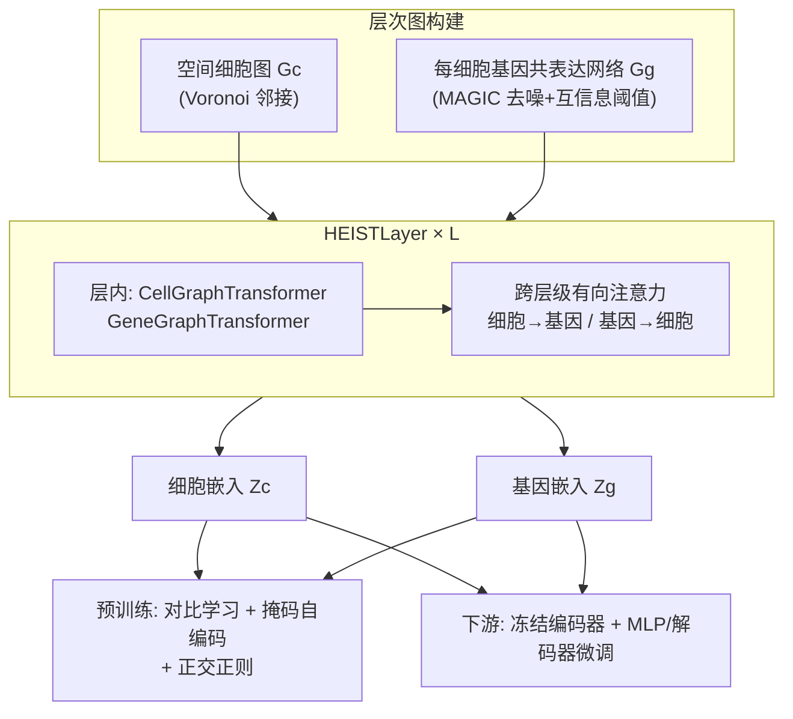

# HEIST: A Graph Foundation Model for Spatial Transcriptomics and Proteomics Data

**会议**: ICLR 2026  
**代码**: [https://github.com/Graph-and-Geometric-Learning/HEIST](https://github.com/Graph-and-Geometric-Learning/HEIST)  
**领域**: 计算生物学 / 空间组学基础模型 / 图神经网络  
**关键词**: 空间转录组学, 空间蛋白质组学, 层次图Transformer, 基因共表达网络, 跨层级消息传递, 自监督预训练  

## 一句话总结
HEIST 把组织建模成「空间细胞图 + 每个细胞内部的基因共表达网络」双层层次图，通过跨层级有向注意力让基因表征受空间微环境调制、细胞表征受内部转录态影响，从而摆脱固定基因词表、零样本迁移到蛋白质组学，并在临床预测、细胞注释、基因填补等任务上刷新 SOTA。

## 研究背景与动机
**领域现状**：单细胞转录组（scRNA-seq）让我们能在单细胞分辨率上研究基因表达，但丢失了细胞在组织里的空间位置；空间转录组学（MERFISH、Xenium）和空间蛋白质组学（CODEX、MIBI）则同时保留了空间坐标与分子计数，能刻画组织结构、细胞间通讯与肿瘤微环境。

**现有痛点**：当下的基础模型各有偏废。scGPT、scFoundation、CellPLM 这类单细胞基础模型要么完全忽略细胞-细胞的空间结构，要么被锁死在**预定义的基因词表**上——遇到训练时没见过的基因或蛋白标记就无法泛化；GraphST、STAGATE 这类图方法虽然能捕获空间邻域，却是任务特定、不可迁移的；scGPT-spatial 把一个细胞内所有基因当成全连接图，丢掉了基因共表达本身的归纳偏置。

**核心矛盾**：细胞内部的基因调控程序与细胞外部的空间微环境是相互耦合的——同一个基因在不同微环境下应当被编码得不一样——但没有模型把「分子层级」和「组织层级」统一在一个可双向影响的框架里，更没有模型能在不重训的前提下从转录组迁移到蛋白质组。

**本文目标**：构建首个同时显式建模空间邻近性与细胞内共表达网络、且支持跨模态迁移到蛋白质组学的空间组学基础模型。

**核心 idea**：**把组织建成双层层次图**——高层是空间细胞图，每个细胞节点向下展开成一张基因共表达网络；通过**跨层级消息传递**让两层互相塑形，并用**从共表达网络动态计算基因嵌入**替代固定词表，由此实现对未见基因/蛋白的开箱泛化。

## 方法详解

### 整体框架
HEIST 输入一组层次图：一张空间细胞图 $G_c(C,E,P,T)$（细胞、空间边、坐标、细胞类型）+ 每个细胞 $k$ 一张基因共表达网络 $G_g^{t_k}(V, E^{t_k}, X_k)$。模型把这些图送入堆叠 $L$ 层的 HEISTLayer，每层先做**层内消息传递**（细胞图、基因图各自更新），再做**跨层级消息传递**（细胞↔基因双向交互），最终产出细胞嵌入 $Z_c$ 与基因嵌入 $Z_g$。预训练用空间感知的对比学习 + 掩码自编码两个目标联合驱动。

### 关键设计

**1. 双层层次图构建：把「空间在哪」和「基因怎么协同表达」拼进一张图。** 预处理阶段先去离群、归一化、保留高变基因，再用 MAGIC 做图扩散去噪以缓解空间转录组特有的 dropout；随后按细胞类型（标注或 Leiden 聚类）分组，对每组内去噪后的基因计算两两互信息，超过阈值 $\tau$ 的基因对连边，得到带互信息先验的 $|T|$ 张共表达网络。空间侧则对细胞坐标做 Voronoi 多边形剖分、相邻多边形对应的细胞连边。最后把每个细胞挂到它所属细胞类型的共表达网络上，形成「细胞图在上、基因网在下」的层次结构。这一步是后面所有跨层级交互的物理基础。

**2. 跨层级有向注意力：让空间微环境调制基因、内部转录态塑形细胞。** 每个 HEISTLayer 在层内 graph transformer 更新出中间表征 $\tilde{H}_c^{(l)}, \tilde{H}_g^{(l)}$ 后，用一个有向的跨级注意力把两层缝合起来：
$$\text{CrossMP}(H_{to}, H_{from}) = \left(\frac{\langle H_{to}W_q,\, H_{from}W_k\rangle}{\sqrt{d}}\right)\cdot (H_{to}W_v)$$
基因方向上，$H_g^{(l)} = \text{CrossMP}(\tilde{H}_g^{(l)}, \tilde{H}_c^{(l),\text{repeat}})$——每个基因从它的父细胞接收信息，于是空间上下文得以调制基因级表征；细胞方向上，$H_c^{(l)} = \text{CrossMP}(\tilde{H}_c^{(l)}, \bar{H}_g^{(l)})$，其中 $\bar{H}_g^{(l)}$ 是对细胞内基因嵌入做 MEAN 或 DiffPool 聚合，让细胞嵌入反映内部转录态。这种**有向**（而非对称注意力或拼接）的设计刻意保留了基因与细胞的不同生物角色，不把二者塌缩成一团，是模型最核心的创新点。

**3. 动态基因嵌入替代固定词表：泛化到未见基因与蛋白标记的关键。** HEIST 不维护一张「基因→向量」的查找表，而是把基因嵌入初始化为基于 rank 的位置编码 + 正弦位置编码，再在共表达图中通过消息传递动态更新。因为表征落脚在「共表达动力学 + 空间上下文」而非基因身份本身，模型遇到蛋白质组学这种全新标记集合时，可以**直接从观测到的蛋白构建共表达网络、纳入全部标记而无需重训**——这正是它能零样本跨到 proteomics、且在 UPMC 上把只支持 6/28 个标记的 scGPT-spatial 甩开 25%+ 的根因。

**4. 对比 + 掩码自编码 + 正交正则的联合预训练目标。** 对比损失把「同类型且空间半径 $r$ 内」的细胞对/共表达基因对拉近、不同类型的推远，并额外加 cell↔gene 跨层级对齐项，三项 $\ell_{c\leftrightarrow c}, \ell_{g\leftrightarrow g}, \ell_{c\leftrightarrow g}$ 互补地约束结构一致性；掩码自编码则随机遮住部分细胞坐标和基因表达、用 MSE 重建，模拟真实 dropout 噪声并迫使模型学会用基因信号恢复空间、用空间线索预测表达。最终目标用可学习标量 $\gamma$ 经 sigmoid 动态平衡两者，并叠加正交正则 $\lambda(\|I_d - Z_c^\top Z_c\|_F^2 + \|I_d - Z_g^\top Z_g\|_F^2)$ 让嵌入维度去相关、避免表征坍缩：
$$L = \sigma(\gamma)\cdot L_{\text{contrastive}} + (1-\sigma(\gamma))\cdot L_{\text{mae}} + \lambda(\|I_d - Z_c^\top Z_c\|_F^2 + \|I_d - Z_g^\top Z_g\|_F^2)$$
此外，得益于稀疏建模避开了全自注意力，HEIST 抽取嵌入比 scGPT-spatial 快 8×、比 scFoundation 快 48×。

## 实验关键数据

预训练规模：22.3M 细胞 / 124 组织切片 / 15 器官 / 两种技术（MERFISH、Xenium），4×NVIDIA L40s 训练，每 epoch 约 3 小时，早停常在第 5–6 epoch。下游评估覆盖 4 任务 × 4 种技术 × 5 器官。

### 主实验表格

临床结局预测（AUC-ROC，含蛋白质组学数据集）：

| 模型 | Placenta-Condition | Charville-Outcome | UPMC-Recurrence | DFCI-Recurrence | Melanoma-Response |
|------|------|------|------|------|------|
| STAGATE | 0.578 | 0.657 | 0.602 | 0.659 | 0.533 |
| GraphST | 0.659 | 0.828 | 0.582 | 0.683 | 0.644 |
| scFoundation | 0.601 | 0.713 | 0.678 | 0.689 | 0.500 |
| CellPLM (unaligned) | 0.682 | 0.744 | 0.681 | 0.667 | 0.580 |
| scGPT-spatial (unaligned) | 0.602 | 0.834 | 0.717 | 0.676 | 0.600 |
| **HEIST** | **0.769** | **0.861** | **0.835** | **0.929** | **0.866** |
| HEIST Imp.% | +12.7 | +3.2 | -3.3 | +5.2 | +44.3 |

七个评估场景中 HEIST 拿下六项最优；在皮肤黑色素瘤免疫治疗响应预测上提升高达 44.3%。

细胞类型注释（F1）：HEIST 在五个数据集中四项最优，UPMC（+12.2%）、DFCI（+28.7%、+17.9%）增益显著；Charville 脑数据上 F1 高达 0.9953。基因填补（Pearson 相关）：微调后 Placenta 0.821（+2.5%）、Skin 0.807（+9.0%），超过包括其预处理也用到的 MAGIC 在内的所有基线。配体-受体对预测 AUC-ROC 达 0.995。

### 消融实验表格

| 变体 | Charville-Outcome | Skin-Imputation | SEA-Cell 分类 |
|------|------|------|------|
| **HEIST 完整** | **0.861** | **0.807** | **0.995** |
| 去空间图（无层次） | 0.596 | 0.345 | 0.179 |
| 去基因图（无层次） | 0.764 | 0.173 | 0.194 |
| 去预训练 | 0.500 | 0.623 | 0.784 |
| 去跨层级消息传递 | 0.625 | 0.531 | 0.955 |
| 去位置编码 | 0.523 | 0.458 | 0.220 |
| 去对比学习 | 0.623 | 0.536 | 0.966 |
| 去掩码自编码 | 0.658 | 0.495 | 0.162 |

### 关键发现
- **层次建模与空间信息最关键**：去掉空间图或基因图任一层都造成最大幅度的性能崩塌，证明双层结构不可或缺。
- **跨层级消息传递与对比学习显著提升细胞分类**，掩码自编码对基因填补和分类至关重要（去 MAE 后 SEA 分类从 0.995 跌到 0.162）。
- **预训练对临床预测尤为关键**（去预训练后 Charville-Outcome 退化到随机 0.500），因为这些数据集标签分布高度倾斜。
- HEIST 嵌入能在 L4-IT 细胞内解析出三个空间信息驱动的亚簇，而 CellPLM、scGPT-spatial 会把这些微环境子结构塌缩掉；注意力还能随 Braak 病理分期揭示出从孤立神经元簇到密集混合细胞 hub 的渐进式微环境重构。

## 亮点与洞察
- **「同一基因在不同上下文应被编码得不同」这一生物直觉被工程化**：有向跨级注意力让基因表征自适应父细胞的空间语境，这是固定词表模型根本做不到的，也是 HEIST 区别于一众「贴空间信息补丁」工作的本质。
- **零样本跨模态（转录组→蛋白质组）的实现路径很优雅**：不靠对齐 trick，而是把表征锚定在共表达动力学上，让模型直接吃下全部蛋白标记——这把基础模型的「词表诅咒」转成了「构图能力」。
- **可解释性是副产品而非附加项**：注意力高分边直接对应已知配体-受体通讯和病理微环境，使模型在生物发现层面（而不仅是预测精度）有实用价值。
- 稀疏建模带来的 8×/48× 加速让大规模空间组学的基础模型在实际算力下可落地。

## 局限与展望
- **零样本基因填补偏弱**（Placenta 0.574、Skin 0.350，远低于微调后），说明基因表达模式的数据集特异性仍强，跨数据集的零样本生成能力有限，必须微调解码器才能发挥层次结构优势。
- 共表达网络依赖细胞类型分组（标注或 Leiden 聚类）与互信息阈值，构图质量对下游有影响，自动化与鲁棒性还有打磨空间。
- 训练数据虽大，但与 scGPT-spatial、CellPLM 的单细胞空间转录组部分存在重叠，跨技术泛化的「真·分布外」程度有待更严格隔离的评测。
- 仅在 MERFISH/Xenium 两种技术上预训练，对更多平台（如 Visium spot 级、序列测序型空间组学）的覆盖可进一步扩展。

## 相关工作与启发
- **单细胞基础模型**：scGPT、scFoundation、CellPLM 证明了大规模自监督在单细胞数据上的价值，但固定词表 + 忽略空间是其天花板，HEIST 正是对症下药。
- **空间图方法**：GraphST、STAGATE 用 GNN 捕获空间邻域，但任务特定、不可迁移；HEIST 把它们的空间归纳偏置纳入一个可迁移的基础模型框架。
- **层次/跨模态图学习**：DiffPool 式的可微池化、有向注意力等技术在这里被组织进生物语义清晰的双层结构，是「把领域归纳偏置写进架构」的好范例——对其他需要耦合多个相互影响的层级（如分子-细胞-组织、词-句-篇）的问题有借鉴意义。

## 评分
- **新颖性**: ⭐⭐⭐⭐⭐ 首个同时显式建模空间邻近 + 细胞内共表达网络、且零样本跨到蛋白质组学的空间组学基础模型，双层层次图 + 有向跨级注意力 + 动态基因嵌入三者组合是真正的原创架构。
- **实验充分度**: ⭐⭐⭐⭐ 覆盖 4 任务 × 4 技术 × 5 器官，主实验 + 完整消融 + 可解释性分析齐备，七场景六项 SOTA；扣分项在零样本场景较弱、与基线数据有重叠未完全隔离。
- **写作质量**: ⭐⭐⭐⭐ 动机-方法-实验脉络清晰，公式与生物直觉对应到位；个别符号（如 repeat/聚合记号）密集，偶有拼写瑕疵。
- **价值**: ⭐⭐⭐⭐⭐ 解决空间组学「固定词表 + 忽略空间」两大痛点，跨模态迁移与可解释微环境发现对临床和生物研究都有实际意义，8×/48× 加速进一步提升落地性。

<!-- RELATED:START -->

## 相关论文

- [\[ICML 2025\] SToFM: a Multi-scale Foundation Model for Spatial Transcriptomics](../../ICML2025/computational_biology/stofm_a_multi-scale_foundation_model_for_spatial_transcriptomics.md)
- [\[ICLR 2026\] ProTDyn: A Foundation Protein Language Model for Thermodynamics and Dynamics Generation](protdyn_a_foundation_protein_language_model_for_thermodynamics_and_dynamics_gene.md)
- [\[ICLR 2026\] A Foundation Model with Multi-Variate Parallel Attention to Generate Neuronal Activity](a_foundation_model_with_multi-variate_parallel_attention_to_generate_neuronal_ac.md)
- [\[ICLR 2026\] Towards All-atom Foundation Models for Biomolecular Binding Affinity Prediction](towards_all-atom_foundation_models_for_biomolecular_binding_affinity_prediction.md)
- [\[CVPR 2026\] FEAST: Fully Connected Expressive Attention for Spatial Transcriptomics](../../CVPR2026/computational_biology/feast_fully_connected_expressive_attention_for_spatial_transcriptomics.md)

<!-- RELATED:END -->
