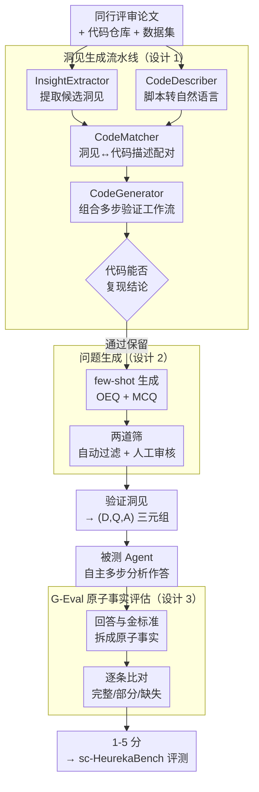

# HeurekaBench: A Benchmarking Framework for AI Co-scientist

**会议**: ICLR 2026  
**arXiv**: [2601.01678](https://arxiv.org/abs/2601.01678)  
**代码**: [brbiclab.epfl.ch/projects/heurekabench](https://brbiclab.epfl.ch/projects/heurekabench)  
**领域**: 计算生物  
**关键词**: AI co-scientist, benchmark, scientific agents, single-cell biology, open-ended evaluation

## 一句话总结
提出 HeurekaBench，一个基于真实科学工作流构建评测基准的框架，通过多LLM流水线从论文中提取可验证的科学洞见并生成开放式研究问题，用于评估AI co-scientist在数据驱动科学发现中的端到端能力。

## 研究背景与动机
LLM推理能力提升催生了大量科学Agent（如CellVoyager、Biomni等），它们旨在自主分析实验数据并产生科学洞见。然而，现有benchmark存在根本性不足：大多数仅测试静态知识检索或单步计算问题（如"有多少miRNA在p≤0.05后显著？"），这些"指令跟随式"任务与真正的co-scientist角色相去甚远——一个合格的co-scientist应能自主规划分析流程、探索数据集并生成新发现。BaisBench虽尝试生成研究问题但仅依赖单个LLM，导致问题质量不可靠。核心矛盾在于：现有benchmark无法评估开放式、数据驱动的科学发现能力。本文的切入角度是将benchmark构建本身植根于科学过程——从同行评审论文中提取经过验证的科学洞见，作为评测的ground truth。

## 方法详解

### 整体框架
HeurekaBench 要解决的核心问题是：怎么让评测基准本身长在真实科研流程上，而不是靠 LLM 凭空攒题。它把基准构建拆成三个前后衔接的阶段——先从同行评审论文里提取候选洞见并用代码做验证（洞见生成流水线），再把验证通过的洞见转写成 OEQ/MCQ 两种问答对（问题生成），最后让被测 Agent 自主设计多步分析去回答、由 LLM Judge 把回答拆成原子事实对照 ground truth 打分（G-Eval 原子事实评估）。整条链路的关键是把"论文里被代码复现过的结论"当作可信金标准，从源头保证题目既开放又有据可查；三个阶段共同产出的就是一批 $(D,Q,A)$ 三元组（数据集、研究问题、金标准答案）。

### 关键设计

**1. 洞见生成流水线：用代码可复现性筛掉不靠谱的洞见**

BaisBench 这类工作直接让单个 LLM 生成问题，无从判断问题背后的结论是否真实成立。HeurekaBench 改用四个 LLM 组件串成的流水线把这件事落地：InsightExtractor（GPT-4o）从论文提取候选洞见，每条都带摘要、所用实验技术、原文证据三个结构化字段；CodeDescriber 把代码仓库里的脚本逐个翻成自然语言描述；CodeMatcher 把每条洞见和最相关的代码描述配对；CodeGenerator 再把脚本组合成一条能跑通的多步验证工作流，这三个代码模块都用 Claude-4-Sonnet。只有当对应代码真能复现出结论时洞见才被保留，于是那些无法被实验脚本支撑的说法被自然过滤掉，金标准的可信度由"可执行"而非"看起来对"来保证。

**2. 问题生成：把验证过的洞见转成开放题和多选题两种形态**

有了可信洞见还得变成能考 Agent 的题。对每条洞见用 few-shot prompting 生成两个问答对：开放式研究问题（OEQ）允许多条分析路径殊途同归地得到正确答案，对应真实科研的开放性；多选题（MCQ）配上高质量干扰项，作为快速给 Agent 原型打分的轻量代理。生成后再过两道筛：自动过滤剔掉仅凭 LLM 预训练知识就能答对的简单题，人工审核去掉幻觉、重复以及建立在未验证部分上的题。两种形态搭配，既保住了开放探索的难度，又留了一个能批量快测的口子。

**3. G-Eval 原子事实评估：按事实拆解比对，奖励数据驱动而非记忆**

开放题没有唯一答案，表面字符串匹配会失真。HeurekaBench 让 GPT-4o 当 Judge 给回答打 1-5 分，但评分前先把回答和 ground truth 都拆解成一组原子事实（条件、趋势、结论），再逐条比对完整、部分匹配还是缺失。只有当 ground truth 的所有事实都出现且无矛盾时才给满分，而额外的、不矛盾的新发现不扣分。如此一来评分奖励的是真正从数据里分析出来的结论，而非靠记忆背出来的事实。

落到单细胞生物学领域，这套框架被实例化为 sc-HeurekaBench：从 22 篇 Nature/Cell 论文出发，最终沉淀出覆盖 13 篇论文的 41 条验证洞见，产出 50 个 OEQ 和 50 个 MCQ。流水线本身的可靠性也有数据支撑——InsightExtractor 提取的洞见在 FlyBase 上有 44/50 强相关，CodeMatcher 的文件正确匹配率平均达 74.6%。

## 实验关键数据

### 主实验

| Agent | OEQ正确性[1-5] | MCQ准确率(%) | MCQ召回率(%) | MCQ精度(%) |
|-------|---------------|-------------|-------------|-----------|
| BixBench-Agent | 2.34 | 44.44 | 80.56 | 62.96 |
| CellVoyager | 2.03 | 27.78 | 38.89 | 32.41 |
| Biomni | 2.31 | **50.00** | **88.24** | **76.96** |

### Planner消融（Biomni Agent）

| 模型 | 开源 | OEQ正确性 | MCQ准确率(%) |
|------|------|----------|-------------|
| MedGemma-27B | ✓ | 1.53 | 20.41 |
| Qwen3-32B | ✓ | 1.47 | 40.00 |
| Qwen3-235B-thinking | ✓ | 1.85 | 46.00 |
| GPT-OSS-120B | ✓ | 2.08 | 42.00 |
| Claude-4-Sonnet | ✗ | **2.58** | 44.00 |

### 关键发现
- Biomni和BixBench-Agent优于CellVoyager，表明灵活的Agent循环更能构建鲁棒的工作流
- Claude-4-Sonnet作为Planner显著优于其他模型（2.58 vs 2.08），闭源前沿模型在co-scientist任务上仍有明显优势
- End-critic（在Agent循环结束时加入critic）可显著提升开源LLM表现，低分组（得分1-2）的表现从1.32提升至1.91
- 模型参数规模和推理能力（thinking模式）对co-scientist表现至关重要

## 亮点与洞察
- 从"将benchmark植根于科学过程本身"的角度出发非常巧妙——用论文的可重现性作为洞见验证标准
- 多LLM流水线的模块化设计使框架可迁移到其他科学领域
- End-critic的设计能弥补开源与闭源模型的差距达22%，是一个轻量且有效的改进策略

## 局限与展望
- 目前仅在单细胞生物学领域实例化，框架泛化到化学、物理等需额外验证
- sc-HeurekaBench规模较小（50 OEQ + 50 MCQ），可能不足以进行细粒度能力诊断
- 验证过程仍需大量人工参与（运行代码、核对结果），自动化程度有提升空间

## 相关工作与启发
- **vs BaisBench**: BaisBench仅用单个LLM生成问题且无验证，HeurekaBench通过多LLM+代码验证确保可靠性
- **vs BixBench**: BixBench主要测试计算型问题，HeurekaBench测试开放式科学探索

## 评分
- 新颖性: ⭐⭐⭐⭐ 框架思路新颖但偏benchmark/系统工作
- 实验充分度: ⭐⭐⭐⭐ 多维度消融非常详尽，但数据集规模较小
- 写作质量: ⭐⭐⭐⭐⭐ 结构清晰，图表精美
- 价值: ⭐⭐⭐⭐ 为AI for Science领域提供了重要的评测框架

<!-- RELATED:START -->

## 相关论文

- [\[ICLR 2026\] PoseX: AI Defeats Physics-based Methods on Protein Ligand Cross-Docking](posex_ai_defeats_physics-based_methods_on_protein_ligand_cross-docking.md)
- [\[ICLR 2026\] Drugging the Undruggable: Benchmarking and Modeling Fragment-Based Screening](drugging_the_undruggable_benchmarking_and_modeling_fragment-based_screening.md)
- [\[ICML 2026\] Protein Fold Classification at Scale: Benchmarking and Pretraining](../../ICML2026/computational_biology/protein_fold_classification_at_scale_benchmarking_and_pretraining.md)
- [\[ICLR 2026\] FragFM: Hierarchical Framework for Efficient Molecule Generation via Fragment-Level Discrete Flow Matching](fragfm_hierarchical_framework_for_efficient_molecule_generation_via_fragment-lev.md)
- [\[ICLR 2026\] SAVE: A Generalizable Framework for Multi-Condition Single-Cell Generation with Gene Block Attention](save_a_generalizable_framework_for_multi-condition_single-cell_generation_with_g.md)

<!-- RELATED:END -->
